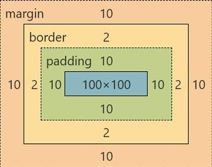
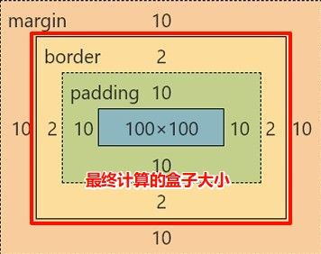
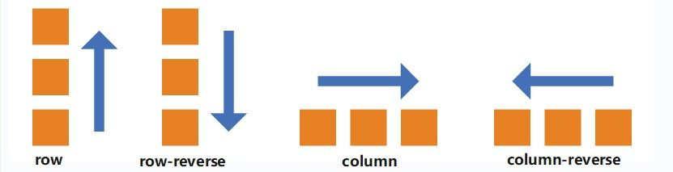

# 前端尺寸

### px：像素级精度控制

适用于需要绝对稳定的尺寸场景，和设备像素直接对应，不随屏幕或父元素变化。

- 常用于图标大小、边框、阴影、文字的细节控制
- 保证视觉表现一致，不受其他尺寸变化影响
- 示例：设置按钮图标为 `24px`，在所有设备上保持一致

### rem：响应式布局核心单位

适合用于页面整体的尺寸控制，比如布局宽度、边距、字体大小等，方便全局缩放。

- 基于根元素 `<html>` 的 `font-size`，统一控制整体比例
- 常用于布局类尺寸，能配合媒体查询或 JS 调整根字体实现响应式
- 示例：设置根字体为 `10px`，`1rem` 就等于 `10px`，方便换算

### 百分比：适应父元素的流动单位

用于让元素根据父容器的尺寸自动变化，适合响应式布局中需要比例调整的部分。

- 宽高可跟随父元素变化，适合两栏布局、等比容器等
- 父容器必须有明确尺寸，子元素才能正确缩放
- 不适用于 `margin`、`border` 等属性的百分比设置

### vw / vh：视口适配单位

跟随视口宽高变化的单位，适用于全屏布局、响应式字体或元素大小调整。

- `1vw` 是视口宽度的 1%，`1vh` 是视口高度的 1%
- 常用于横幅、高度占屏的模块或随屏幕变动的标题字号
- 移动端使用 `vh` 时需注意浏览器地址栏变化带来的影响，可通过 JS 动态获取视口高度修正

# 文字属性

### 文字颜色 `color`

规定文本的颜色, 值支持:

```css
color: red;                  /* 英文单词（适合快速原型） */
color: #ff0000;              /* 十六进制（设计师常用） */
color: rgba(255,0,0,0.5);    /* 带透明度（悬浮效果常用） */
```

> 实际开发建议使用十六进制或 CSS 变量统一管理色值

### 字体大小 `font-size`

设置文字尺寸,PC 端网页常用单位为 **px**.  
默认大小一般是 16px.

```css
body { font-size: 16px; }    /* 默认基准值 */
.title { font-size: 2rem; }  /* 推荐 rem 适配响应式 */
.mobile { font-size: 4vw; }  /* 视口动态缩放（移动端慎用） */
```

Chrome 强制最小 12px，移动端适配优先用 `rem` + 媒体查询

### 字体粗细 `font-weight`

设置字体的粗细。

| 数值 | 等效关键字 | 使用场景               |
| ---- | ---------- | ---------------------- |
| 400  | normal     | 正文默认               |
| 700  | bold       | 标题/重点强调          |
| 300  | -          | 纤薄字体（需字体支持） |

```css
/* 优先用数字写法 */
h1 { font-weight: 700; }
```

### 字体样式 `font-style`

一般用来 **清除** 字体的默认倾斜.

| 值       | 描述   |
| -------- | ------ |
| `normal` | 不倾斜 |
| `italic` | 倾斜   |

```css
em {
  font-style: normal;  /* 取消 <em> 默认斜体 */
  color: #f00;         /* 改为红色强调 */
}
```

### 字体族 `font-family`

设置字体样式.  
属性值填写字体名称即可,多个字体逗号隔开. 如果字体名称包含空格，它必须加上引号.

Windows 优先用微软雅黑，macOS 用苹方
中文字体文件过大，建议用 `font-display: swap` 防阻塞渲染

```css
body {
  font-family:
    "Microsoft Yahei",   /* 首选字体 */
    "PingFang SC",       /* macOS 字体 */
    sans-serif;          /* 兜底通用字体 */
}
```

> 中文字体名称需加引号，最后必须设置通用字体族（sans-serif / serif / monospace）

### 复合属性 `font`

节省代码量,能集合字体的其他属性调整.

```css
/* 完整格式：style weight size/line-height family */
font: italic 700 16px/1.5 "Arial", sans-serif;

/* 最简写法（必须包含 size 和 family） */
font: 14px "SimSun";
```

未设置的属性会重置为默认值。

# 文本属性

### 文本对齐 `text-align`

控制文本水平排列方向，适用于块级元素

```css
/* 基础用法 */
h1 { text-align: center; }    /* 标题居中 */
.nav { text-align: right; }   /* 导航右对齐 */
```

| 值      | 效果           | 典型场景        |
| ------- | -------------- | --------------- |
| left    | 左对齐（默认） | 正文段落        |
| center  | 居中对齐       | 标题/按钮文字   |
| right   | 右对齐         | 时间戳/操作按钮 |
| justify | 两端对齐       | 报刊杂志式排版  |

### 文本修饰 `text-decoration`

控制文本装饰线条样式

```css
a { text-decoration: none; }     /* 去除链接下划线 */

.discount {
  text-decoration: line-through; /* 商品价格删除线 */
}

.highlight {
  text-decoration: underline wavy #ff0000; /* 波浪形下划线 */
}
```

| 属性值       | 效果扩展                   |
| ------------ | -------------------------- |
| underline    | 支持定义线型和颜色（CSS3） |
| overline     | 常用于设计元素装饰         |
| line-through | 电商场景表示原价           |

### 控制文本大小写 `text-transform`

强制控制文字大小写，不改变原始内容

```css
.button {
  text-transform: uppercase;  /* 按钮文字全大写 */
}
.title {
  text-transform: capitalize; /* 每个单词首字母大写 */
}
```

| 值         | 效果说明                      |
| ---------- | ----------------------------- |
| uppercase  | 全大写（如：BUTTON）          |
| lowercase  | 全小写（如：alert）           |
| capitalize | 首字母大写（如：Hello World） |

### 文本缩进 `text-indent`

控制段落首行缩进，支持负值

```css
p {
  text-indent: 2em;   /* 首行缩进2字符 */
}
.hidden-text {
  text-indent: -9999px; /* SEO隐藏文字技巧 */
}
```

> 推荐使用相对单位：  
> `1em = 当前字体尺寸`，适配不同屏幕比例

### 行高控制 `line-height`

影响垂直排版的属性

```css
.box {
  height: 40px;
  line-height: 40px;  /* 单行文字垂直居中 */
}

.article {
  line-height: 1.6;   /* 无单位值，基于当前字体尺寸 */
}
```

**推荐技巧：**

1. **单行居中**：`line-height = height`
2. **阅读优化**：正文建议 1.5-1.8 倍行距
3. **数值类型**：优先使用无单位数值（继承更安全）

```css
/* 最佳实践 */
body {
  font-size: 16px;
  line-height: 1.6;  /* 实际计算值 16px * 1.6 = 25.6px */
}
```

# 背景图属性

**常用方式**

```css
.box {
  background-color: #f0f0f0;       /* 设置纯色背景 */
  background-image: url("bg.jpg"); /* 添加背景图 */
  background-repeat: no-repeat;    /* 禁止平铺 */
}
```

### 背景平铺 `background-repeat`

```css
.banner {
  background-repeat: repeat-x;     /* 横向平铺制作条纹背景 */
}
.pattern {
  background-repeat: repeat;       /* 小尺寸图案无缝平铺 */
}
```

| 值        | 效果               | 使用场景      |
| --------- | ------------------ | ------------- |
| no-repeat | 不重复（最常用）   | banner/封面图 |
| repeat-x  | 横向重复           | 渐变条纹背景  |
| space     | 等间距平铺（CSS3） | 网格布局      |

### 背景定位 `background-position`

```css
.icon {
  background-position: right 10px center; /* 右侧10px垂直居中 */
}
.hero {
  background-position: 80% 50%; /* 焦点图主体居中 */
}
```

**开发技巧**：

- 使用方位词组合更直观（left top/center bottom）
- 百分比定位公式：`(容器尺寸 - 图片尺寸) * 百分比`
- 雪碧图定位推荐像素单位

### 背景缩放 `background-size`

```css
.header {
  background-size: cover;     /* 完全覆盖容器（可能裁剪） */
}
.product {
  background-size: contain;   /* 完整显示图片（可能留白） */
}
.avatar {
  background-size: 80px auto; /* 固定宽度自适应高度 */
}
```

| 值      | 效果对比       | 适用场景   |
| ------- | -------------- | ---------- |
| cover   | 铺满容器无空白 | 全屏背景图 |
| contain | 完整显示图片   | 产品展示图 |

### 复合属性

```css
.card {
  background:
    linear-gradient(45deg, #ff6b6b30, #4ecdc430), /* 渐变遮罩层 */
    url("card-bg.jpg") center/cover no-repeat;
}
```

**正确简写顺序**：  
`color image repeat attachment position/size`

> 注意：老版本浏览器需分开写 `background-size`

**实战开发建议**

1. **性能优化**

   ```css
   /* 雪碧图方案 */
   .icon-home {
     background: url("sprite.png") -120px 0 / 400px auto;
   }
   ```

2. **响应式适配**

   ```css
   @media (max-width: 768px) {
     .banner {
       background-image: url("mobile-bg.jpg");
       background-size: contain;
     }
   }
   ```

3. **备用方案**

   ```css
   .hero {
     background: #2c3e50 url("hero.jpg") center/cover;
     /* 图片加载失败时显示背景色 */
   }
   ```

4. **视差效果**
   ```css
   .parallax {
     background-attachment: fixed; /* 创建滚动视差 */
   }
   ```

**常见问题**

**图片拉伸失真**  
 使用`background-size: contain` + 给容器设置`max-width`

**Retina 屏幕模糊**  
提供 2 倍尺寸图片 + 设置`background-size: 50% auto`

**多重背景叠加**  
用逗号分隔多组背景，最先写的层级最高

**渐变+图片组合**  
先写渐变后写图片，用半透明渐变实现遮罩效果

```css
.overlay {
  background:
    linear-gradient(rgba(0,0,0,0.5),
    url("image.jpg") center/cover;
}
```

# CSS 盒子模型

### 基本盒子模型的组成



每个元素都是一个矩形盒子，从内到外由四层组成：

1. **内容区**：通过 `width/height` 控制尺寸
2. **内边距**：`padding` 控制内容与边框间距
3. **边框**：`border` 包裹内边距与内容
4. **外边距**：`margin` 隔离相邻盒子（不计入盒子总尺寸）

### 尺寸的计算

- **默认情况**

如果增加 padding, 盒子尺寸会变大.



```css
div { box-sizing: content-box; }
/* 总宽度 = width + padding + border */
```

- **智能內减**（推荐）

设置为自动减去 border/padding 的尺寸

```css
div { box-sizing: border-box; }
/* 总宽度 = width（自动扣除 padding 和 border）*/
```

> 实际开发建议全局设置：  
> `* { box-sizing: border-box; }`

#### 行内元素

行内元素添加内外边距, 无法改变元素的垂直位置

解决方法:
添加 line-height 改变垂直位置

# 盒子模型相关属性

### 边框线

| 边框样式 | 效果           |
| -------- | -------------- |
| `solid`  | 实线（最常用） |
| `dashed` | 虚线           |
| `dotted` | 点线           |

使用属性: border-radius 添加圆角.

```css
/* 基础边框 */
border: 2px solid #333; /* 粗细 样式 颜色 */
border-top-style: dotted; /* 单独控制某边 */

/* 圆角进阶 */
.avatar {
  border-radius: 50%; /* 正圆 */
}
.btn {
  border-radius: 20px; /* 胶囊按钮 */
}
```

### 内外边距

**padding**：

```css
padding: 10px;           /* 四边相同 */
padding: 5px 20px;       /* 上下 | 左右 */
padding: 10px 0 15px;    /* 上 | 左右 | 下 */
```

**margin**：

```css
margin: 0 auto; /* 水平居中经典写法 */
.parent { margin-bottom: 30px; } /* 推荐用 padding 替代 margin 分隔父子元素 */
```

> **行内元素注意**：垂直方向的 `padding/margin` 不生效，改用 `line-height` 调整间距

#### 外边距两大经典问题

1. **兄弟元素合并**：垂直排列的两个元素，上下 `margin` 会合并取最大值

   ```css
   /* 方案：统一使用单方向 margin */
   .item { margin-bottom: 20px; }
   ```

2. **父子元素塌陷**：子元素的 `margin-top` 会穿透父容器
   ```css
   /* 解决方案（任选其一） */
   .parent {
     overflow: hidden;     /* 触发 BFC */
     padding-top: 1px;     /* 添加最小 padding */
     border-top: 1px solid transparent; /* 透明边框 */
   }
   ```

### 清除默认样式

```css
* {
  margin: 0;
  padding: 0;
  box-sizing: border-box; /* 关键！统一尺寸计算方式 */
}

ul {
  list-style: none; /* 去除列表默认符号 */
}
```

# 标准流与浮动

在网页布局中，标准流（文档流）是 HTML 元素默认的排列规则。元素根据类型自动按照从上到下、从左到右的顺序排布，但存在以下限制：

1. 块级元素独占一行，行内元素无法直接设置宽高
2. 行内元素默认**底边对齐**，若高度不一致会产生缝隙
3. 连续空格或换行会触发**空白折叠现象**（多个空格合并为单个）

#### 脱离标准流的方式

当需要突破标准流限制时，可通过三种方式实现：

- **浮动（float）**
- **绝对定位（absolute）**
- **固定定位（fixed）**

### 浮动特性与问题

通过`float: left/right`让元素**脱离标准流**，产生以下特性：

```css
.box {
  float: left;  /* 元素向左浮动 */
  width: 200px; /* 块元素转为行内块特性 */
}
```

**核心表现**：

1. 浮动元素自动转为行内块模式，可水平排列
2. 后续未浮动元素会**紧贴浮动元素边缘**布局
3. 父元素未设置高度时，浮动会导致**高度塌陷**（子元素无法撑开父容器）

**典型问题场景**：

```html
<div class="parent">
  <div class="child"></div> <!-- 浮动元素 -->
</div>
<div class="sibling"></div> <!-- 受影响的兄弟元素 -->
```

此时`.sibling`会向上移动填补空间，导致布局错乱。

### 清除浮动的影响

**方法一：手动定义父容器高度**

直接通过 CSS 固定高度，但缺乏灵活性：

```css
.parent { height: 300px; } /* 需预知内容高度 */
```

**方法二：尾部插入清除元素**

在父容器末尾添加空块级元素并设置`clear`属性：

```html
<div class="parent">
  <div class="float-box"></div>
  <div class="clearfix"></div> <!-- 清除元素 -->
</div>
```

```css
.clearfix { clear: both; } /* 阻断浮动影响 */
```

**方法三：触发 BFC 特性**

通过`overflow`属性让父元素形成独立布局空间：

```css
.parent {
  overflow: hidden; /* 触发BFC */
  clear: both;      /* 兼容旧浏览器 */
}
```

浮动仍适用于图文环绕等传统场景，但复杂布局应优先考虑 Flex/Grid 方案。

# `Flex` 弹性盒子模型

Flex 布局通过**容器**与**子项目**的联动机制实现灵活排版，彻底解决了传统浮动布局的痛点。只需为父元素设置`display: flex`，子元素将自动获得弹性伸缩特性。

#### 核心概念与属性

**容器属性**控制整体排列规则，**项目属性**调整单个元素行为。以下为关键属性的快速索引：

| 控制维度       | 属性名            | 常用值示例               | 核心作用             |
| -------------- | ----------------- | ------------------------ | -------------------- |
| **主轴方向**   | `flex-direction`  | `row`/`column`           | 定义项目的排列基准轴 |
| **主轴对齐**   | `justify-content` | `center`/`space-between` | 控制主轴空间分配策略 |
| **交叉轴对齐** | `align-items`     | `stretch`/`flex-start`   | 定义侧轴对齐方式     |
| **多行排列**   | `flex-wrap`       | `wrap`/`nowrap`          | 允许项目换行显示     |

### 主轴控制详解

#### `flex-direction` 方向设置

通过基准轴定义项目的排列流向：

| 属性值         | 效果                     |
| -------------- | ------------------------ |
| **column**     | 垂直方向, 从上到下       |
| row            | 水平方向, 从左向右(默认) |
| row-reverse    | 水平方向, 从右向左       |
| column-reverse | 垂直方向, 从下向上       |



```css
.container {
  display: flex;
  flex-direction: row; /* 水平排列（默认） */
  /* column: 垂直排列 | row-reverse: 反向水平排列 */
}
```

#### `justify-content` 空间分配方式

控制项目在主轴上的分布方式：

| 属性值            | 效果                                 |
| ----------------- | ------------------------------------ |
| **center**        | 整体居中                             |
| **space-between** | **首尾贴边**，中间等距               |
| **space-around**  | 每个项目**两侧**等距（视觉间距递增） |
| **space-evenly**  | 所有间隙**完全相等**                 |
| felx-start        | 左对齐（默认）                       |
| felx-end          | 弹性盒子从主轴终点依次排起.          |

```css
.container {
  justify-content: space-between; /* 典型应用场景 */
}
```

优先使用 Flex 处理**一维线性布局**（单行或单列）

# 定位 `position`

通过 `position` 属性可灵活控制盒子在网页中的位置，其核心逻辑分为两步：**启用定位模式**（设置`position`属性值）和**使用边偏移属性**（`left`/`right`/`top`/`bottom`）调整位置。常见的定位模式特性如下：

- **相对定位**（`relative`）：元素相对于自身原位置偏移，**通常用于作为子级绝对定位的参照容器**，不脱离文档流。
- **绝对定位**（`absolute`）：元素相对于最近的定位父级（非`static`）进行偏移，**脱离文档流**，常用于父级设置`relative`后精准定位子元素，显示模式具备了行内块的特点。
- **固定定位**（`fixed`）：元素相对于浏览器视口定位，**脱离文档流且不随页面滚动**，适合悬浮按钮、导航栏等场景。

#### 定位居中

实现绝对定位元素的水平垂直居中需分两步：

1. 将元素左上角定位到父级中心点：
   ```css
   .child {
     position: absolute;
     left: 50%;  /* 水平偏移50% */
     top: 50%;   /* 垂直偏移50% */
   }
   ```
2. 通过平移将元素自身尺寸回退一半，**推荐使用`transform`简化代码**：
   ```css
   .child {
     transform: translate(-50%, -50%); /* 向左上移动自身宽高的一半 */
   }
   ```
   **注意**：直接使用`margin`调整需明确元素尺寸，而`transform`无需预知尺寸，适配性更强。

### 堆叠层级 z-index

当多个定位元素重叠时，可通过`z-index`控制显示优先级：

- 默认按 HTML 书写顺序层叠（后写元素覆盖前写元素）
- **属性值为整数**，数值越大层级越高，默认值为 0
- **仅对定位元素生效**（如`absolute`/`relative`/`fixed`）

## CSS Sprites

通过将多个小图合并为一张精灵图，减少服务器请求次数，提升加载性能。实现步骤：

1. **容器匹配尺寸**：创建与目标小图尺寸一致的盒子
2. **设置背景图**：将精灵图作为容器背景
3. **精确定位**：通过负值`background-position`移动背景图，使目标区域显示在容器中

```css
.icon-home {
  width: 30px;
  height: 30px;
  background-image: url("sprites.png");
  background-position: -60px -120px; /* 显示精灵图中位于(60px,120px)的小图 */
}
```

**核心优势**：减少 HTTP 请求，降低服务器压力，提升页面加载速度。

# 元素溢出解决方法

通过 `overflow` 控制内容超出容器时的显示方式：

- **hidden**：直接隐藏溢出内容
- **scroll**：始终显示滚动条（即使内容未溢出）
- **auto**：智能判定，仅在溢出时显示滚动条

```css
.container {
  overflow: auto;  /* 按需显示滚动条 */
}
```

# 盒子阴影

通过 `box-shadow` 添加立体效果，参数格式为：

```css
/* 水平偏移 垂直偏移 模糊度 扩散范围 颜色 内外阴影 */
box-shadow: 5px 5px 10px 2px rgba(0,0,0,0.3) inset;
```

- 省略`inset`时默认为外阴影
- 模糊半径和扩散半径可缺省，如仅设置基础效果：
  ```css
  box-shadow: 2px 2px 5px #ccc;  /* 水平 垂直 模糊 颜色 */
  ```

# 垂直对齐方式 `vertical-align`

控制 **行内元素** 或 **表格单元格** 的垂直对齐方式，常见场景包括：

- 图片与同行文字的对齐
- 表格单元格内内容的垂直位置
- 行内块元素（如图标与文本混合排版）

**注意**：该属性 **对块级元素无效**（如 `<div>`、`<p>`）。

**生效元素**：

- 行内元素（`<span>`、`<a>`）
- 行内块元素（``、`<button>`）
- 表格单元格（`<td>`）
- **默认值**：`baseline`（基线对齐）

#### 常用属性值与效果

| 属性值          | 效果描述                                    | 典型场景                 |
| --------------- | ------------------------------------------- | ------------------------ |
| **baseline**    | 元素基线与父级基线对齐（默认行为）          | 文本与图片默认对齐方式   |
| **top**         | 元素顶部与行内最高元素的顶部对齐            | 多行文本/图标顶部对齐    |
| **middle**      | 元素中线与父级基线 + 父级 x-height 中线对齐 | 图标与文字垂直居中       |
| **bottom**      | 元素底部与行内最低元素的底部对齐            | 多元素底部统一对齐       |
| **数值/百分比** | 相对基线偏移（正数上移，负数下移）          | 微调图标位置（如 `2px`） |

```css
/* 示例：图片与文字居中对齐 */
img {
  vertical-align: middle; /* 中线对齐 */
}
```

**典型问题与解决方案**

- 问题 1：图片底部默认间隙  
  **现象**：`` 下方出现空白，即使无 margin/padding。  
  **原因**：图片默认按 `baseline` 对齐，基线与父级基线存在间隙。  
  **解决**：

```css
img {
  vertical-align: bottom;  /* 或 top/middle */
  /* 或直接设置为块级元素 */
  display: block;
}
```

- 问题 2：行内块元素高度撑开父级  
  **现象**：父级高度被行内块元素异常撑大。  
  **原因**：不同 `vertical-align` 值影响行内元素垂直排列方式。  
  **解决**：

```css
.parent {
  line-height: 0;  /* 配合调整行高 */
}
.child {
  vertical-align: top; /* 统一对齐方式 */
}
```

#### 注意事项

1. **对齐基准差异**：`middle` 并非绝对居中，实际效果受父级字体影响。
2. **数值偏移方向**：`vertical-align: 10px` 表示 **向上** 偏移，与常规坐标系相反。
3. **表格单元格优先级**：在 `<td>` 中，`vertical-align` 优先级高于 `align-items`。

`vertical-align` 的生效效果高度依赖上下文环境，明确 **父级基线位置** 和 **同行元素对齐方式** 是精准控制的关键。

### 透明度效果控制

| 属性/方法     | 作用对象             | 继承性 | 适用场景                     |
| ------------- | -------------------- | ------ | ---------------------------- |
| **`opacity`** | 整个元素（含子元素） | 是     | 整体透明度调整（如淡入淡出） |
| **`rgba()`**  | 元素的**背景/颜色**  | 否     | 仅背景或文本颜色透明         |
| **`hsla()`**  | 同 `rgba()`          | 否     | 同 `rgba()`，色域模式不同    |

#### opacity 属性

控制元素及子元素的整体透明度，取值范围 `0（完全透明）` ~ `1（完全不透明）`：

```css
.element {
  opacity: 0.5;  /* 元素整体半透明 */
}
```

- 子元素会继承父级透明度（无法单独设置子元素不透明）
- 元素即便完全透明（`opacity: 0`）**仍占据布局空间**
- 常用于过渡动画效果：
  ```css
  .button {
    transition: opacity 0.3s;
  }
  .button:hover {
    opacity: 0.7;  /* 悬停时半透明 */
  }
  ```

#### rgba/hsla 颜色函数

仅针对特定颜色值（背景、边框、字体颜色）设置透明度，不影响元素内容：

```css
.element {
  background-color: rgba(255, 0, 0, 0.3);  /* 红色背景，30% 不透明 */
  color: hsla(120, 100%, 50%, 0.8);        /* 亮绿色文字，80% 不透明 */
}
```

**优势**：

- **精准控制**：独立调整背景、文字、边框的透明度
- **无继承性**：子元素不受父级颜色透明的影响

实现 **背景透明但文字清晰** 的效果：

```css
.card {
  background-color: rgba(0, 0, 0, 0.5);  /* 半透明黑色背景 */
  color: white;                          /* 文字保持不透明 */
}
```

1. **点击事件穿透**：`opacity: 0` 的元素仍可触发鼠标事件（需配合 `visibility: hidden` 完全隐藏）
2. **性能差异**：`opacity` 变化可通过 GPU 加速渲染，性能优于 `visibility`
3. **旧版 IE 兼容**：IE8 及以下不支持 `rgba()`，需备用方案：
   ```css
   .element {
     background: rgb(0, 0, 0);          /* 兼容 IE8 */
     background: rgba(0, 0, 0, 0.5);     /* 现代浏览器 */
   }
   ```

**常见问题**

- 为何父级 `opacity: 0.5` 时，子元素无法恢复不透明？

子元素实际透明度 = 父级透明度 × 子级透明度。若父级 `opacity: 0.5`，子级即使设置 `opacity: 1`，实际仍为 `0.5 × 1 = 0.5`。  
改用 `rgba()` 控制父级背景透明度，避免继承影响。

- 如何实现背景图透明但文字不透明？

使用 `rgba()` 设置背景色透明度
或通过伪元素独立控制背景层：

```css
.banner::before {
  content: "";
  position: absolute;
  background: url("image.jpg") rgba(0,0,0,0.5);
  width: 100%;
  height: 100%;
}
```

- 需整体透明 → `opacity`
- 需局部透明（背景/文字） → `rgba()`/`hsla()`
- 完全隐藏元素且不占位 → `opacity: 0` + `visibility: hidden`

### `cursor` 光标样式

控制鼠标悬停在元素上时的光标样式，直观反馈当前元素的交互行为（如可点击、拖拽、输入等），**提升用户体验的直观性**。

#### **常用属性值与场景**

| 属性值                 | 光标样式             | 典型应用场景                 |
| ---------------------- | -------------------- | ---------------------------- |
| `default`              | 默认箭头（系统默认） | 普通元素（无特殊交互时）     |
| `pointer`              | 手型图标             | 可点击元素（按钮、链接）     |
| `text`                 | 文本输入「I」型光标  | 文本输入框、可编辑区域       |
| `move`                 | 十字箭头             | 可拖拽元素（如拖拽调整位置） |
| `grab` / `grabbing`    | 抓取手型             | 拖拽控制（如地图拖拽）       |
| `not-allowed`          | 禁止图标             | 禁用状态（按钮不可点击时）   |
| `wait`                 | 加载等待（转圈）     | 操作等待提示（如提交中）     |
| `zoom-in` / `zoom-out` | 放大镜图标           | 图片缩放控制                 |
| `crosshair`            | 十字准星             | 绘图工具（如选区、测量工具） |
| `col-resize`           | 左右调整双箭头       | 列宽调整（表格分隔线）       |

#### **自定义光标**

通过 `url()` 指定光标图片，并设置备用值（避免图片加载失败）：

```css
.custom-cursor {
  cursor: url("custom.png"), auto;
  /* 若图片无效，回退到 auto（默认光标） */
}
```

- 图片格式推荐 `.png` 或 `.cur`（支持透明背景）
- 需指定备用光标（如 `pointer`、`default`）
- 图片尺寸不宜过大（一般建议 32×32 像素以内）

# 表格属性

使用 `border` 属性指定表格边框

```css
table, td {
    border: 1px solid black;
}
```

#### 折叠边框 `border-collapse`

border-collapse 属性设置表格的边框是否被折叠成一个单一的边框或隔开

### 表格样式优化

#### 基础边框控制

```css
table {
  border-collapse: collapse;  /* 合并边框（必选项） */
  width: 100%;                /* 默认自适应容器 */
  table-layout: fixed;        /* 固定列宽算法 */
}

td, th {
  border: 1px solid #e0e0e0;  /* 单元格边框 */
  padding: 12px;              /* 内边距必须设置 */
  text-align: left;           /* 文本对齐 */
}
```

**开发技巧**：

- 始终优先使用`border-collapse: collapse`避免双边框问题
- 设置`table-layout: fixed`提升渲染性能，配合`width`控制列宽
- 移动端适配添加`overflow-x: auto`实现横向滚动

#### 进阶样式处理

```css
/* 斑马纹效果 */
tr:nth-child(even) {
  background-color: #f8f9fa;
}

/* 表头样式 */
th {
  background-color: #2c3e50;
  color: white;
  font-weight: 600;
}

/* 响应式表格 */
@media (max-width: 768px) {
  td::before {
    content: attr(data-label);  /* 使用data-label属性 */
    display: inline-block;
    min-width: 80px;
    font-weight: bold;
  }
}
```

### 过渡效果

可以为一个元素在不同状态之前切换的时候添加过度效果.
加给标签本身

`transation : 过度属性 花费时间(s)`
