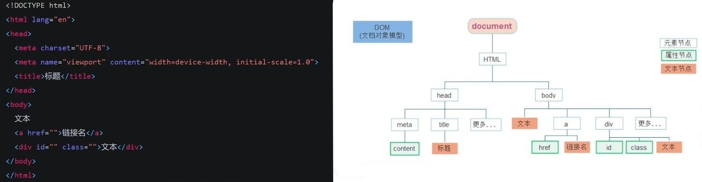
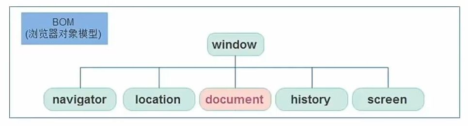
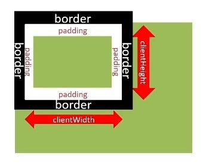
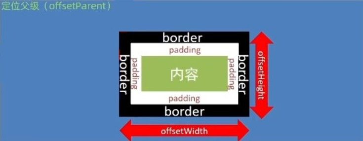
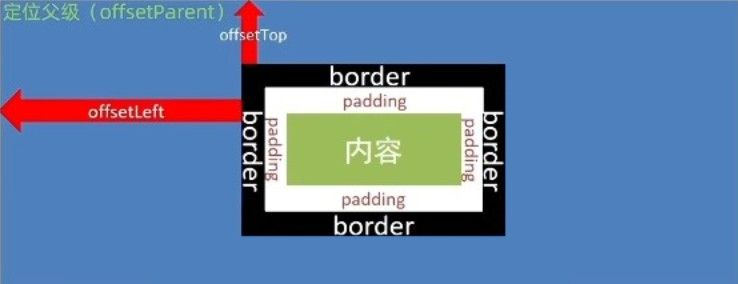
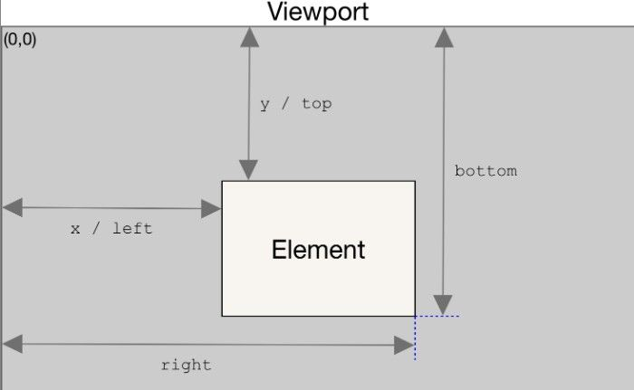
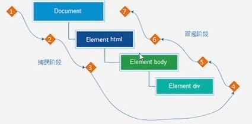
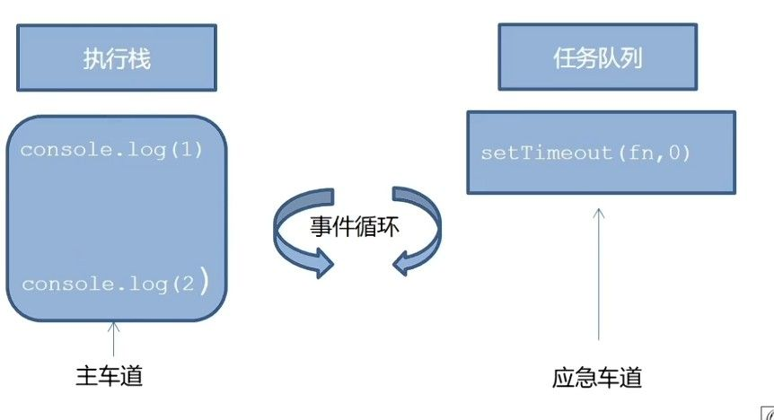
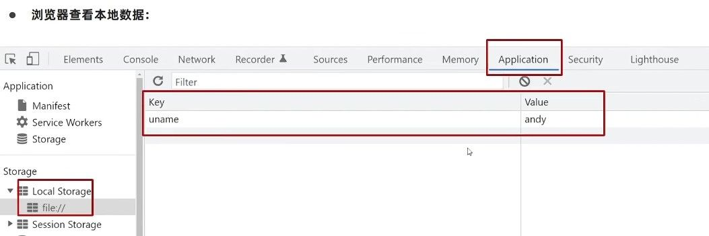

Web API 是浏览器为 JavaScript 提供的**双向通信接口**，使脚本具备两大核心能力：

1. 操作网页内容（DOM/Document Object Model）
2. 控制浏览器行为（BOM）

# DOM 文档对象模型

操作网页内容，刻意开发网页内容特效和实现用户交互。

### DOM 树

文档树直观的体现了标签与标签之间的关系。



有了 DOM 树， HTML  就转换为可编程的**对象**。
所有元素挂载在  `document`  对象下。

### 获取 DOM 元素

要操作任何元素，首先得获取。

#### 精准定位 `.querySelector()`

只会选择定位到的**首个**元素

```javascript
// 通过 CSS 选择器定位
const div = document.querySelector('div') // 可以获取首个 div
const nav = document.querySelector('#nav') // 也可使用 ID 选择器

const firstLi = document.querySelector('ul li:first-child') // 结合伪类选择器操作
const indexLi = document.querySelector(`li:nth-child(${index+1}`)
```

#### 批量获取 `.querySelectorAll()`

选择满足条件的所有元素

```javascript
const lis = document.querySelectorAll('ul li')

// 类数组特性：
lis.length // 元素数量
lis[0] // 索引访问
lis.forEach(item => { /* 遍历操作 */ })
```

### 操作元素内容

如果想修改标签元素里的内容，可以使用：

#### 直接操作文字 `.innerText`

```javascript
// 获取元素
const box = document.querySelector('.box')

// 纯文本模式
box.innerText = '你好世界' // 直接修改文字，但不解析HTML标签
```

#### 解析标签 `.innerHTML`

```javascript
// 获取元素
const box = document.querySelector('.box')

// HTML模式
box.innerHTML = '<strong>重点内容</strong>' // 可以插入加粗/颜色等效果
```

### 操作元素样式

#### 行内样式修改 `style`

能够直接操作元素，优先级最高，适合**少量动态样式调整** 。
多单词属性需用驼峰命名（如 `fontSize`）

```javascript
// 单个样式修改
box.style.color = '#fff'

// 批量修改（了解，更推荐类名替换）
Object.assign(box.style, {
  padding: '10px',
  border: '1px solid #ddd'
})
```

#### 类名替换 `className`

直接替换元素，适合**整体样式切换**  
 会覆盖原有类名，需手动拼接保留原有类

```javascript
// 覆盖模式
box.className = 'active' // 一个CSS类名

// 追加模式（了解，更推荐类列表操作）
box.className += ' active' // 原始类需存在空格结尾
```

#### 类列表操作 `classList`

精准增删类，**现代开发首选方案**  
不破坏原有类、支持批量操作、自带状态检测

```javascript
// 常用操作
box.classList.add('active')    // 添加类
box.classList.remove('box')    // 移除类
box.classList.toggle('show')   // 切换类 有就删掉，没有就加上。

box.classList.contains('active')   // 看看包不包含某个类，如果有返回true，没有返回false
```

### 操作表单元素

**常规属性操作**

普通的有属性有取值的跟其他的标签属性没有任何区别（例如 `type`/`value`）

```javascript
// 获取密码框元素
const pwdInput = document.querySelector('#password')

// 读取属性
console.log(pwdInput.type) // "password"

// 修改属性实现密码显示切换
function togglePassword() {
  pwdInput.type = pwdInput.type === 'password' ? 'text' : 'password'
}
```

**布尔属性操作**

表单属性中添加就有效果，移除就没有效果，一律使用布尔值表示

```javascript
// 禁用按钮
submitBtn.disabled = true

// 勾选复选框
checkbox.checked = true

// 选中下拉选项
option.selected = true
```

### 自定义属性

**标准属性**

HTML 标签原生支持的属性，比如 `classid` ，`title` 等，可以直接使用点语法操作。

```javascript
// 读取class属性
const className = element.className

// 修改title属性
element.title = '新的提示信息'
```

**自定义属性**

在 HTML5 中推出来了专门的 data-自定义属性，标签上一律以 data-开头。

```html
<!-- HTML定义 -->
<div
  data-user-id="123"
  data-order-status="pending"
  ></div>
```

DOM 对象上一律以 `dataset` 对象方式获取：

| 选择器类型   | 示例                  | 作用                              |
| ------------ | --------------------- | --------------------------------- |
| **存在属性** | `[data-role]`         | 选择所有带 data-role 的元素       |
| **精确匹配** | `[data-role="admin"]` | 选择 data-role 等于 admin 的元素  |
| **包含子串** | `[data-tag*="error"]` | 选择 data-tag 包含 "error" 的元素 |

```javascript
// 通过 dataset 对象访问（自动驼峰转换）
const userId = element.dataset.userId // "123"
const orderStatus = element.dataset.orderStatus // "pending"

// 修改属性
element.dataset.orderStatus = 'shipped' // 自动转为 data-order-status
```

用 css 选择器也可以选择自定义属性：

```HTML
<!DOCTYPE html>
<head>
  <style>
    /* CSS */
    /* 所有自定义按钮 */
    [data-btn-type] {
      padding: 8px 16px;
      border-radius: 4px;
    }
    /* 精确匹配主要按钮 */
    [data-btn-type="primary"] {
      background: #007bff;
      color: white;
    }
    /* 包含"loading"状态的元素 */
    [data-btn-state*="load"] {
      opacity: 0.7;
      cursor: wait;
    }
    /* 以"sec"开头的按钮类型 */
    [data-btn-type^="sec"] {
      background: #6c757d;
      color: white;
    }
  </style>
</head>
<body>
  <!-- HTML -->
  <button data-btn-type="primary">主要按钮</button>
  <button data-btn-type="secondary">次要按钮</button>
  <button data-btn-state="loading">加载中</button>
</body>
</html>
```

# BOM 浏览器对象模型

Browser Object Model（浏览器对象模型）用于提供与浏览器窗口交互的对象和方法，是浏览器提供给开发者操作浏览器窗口的接口集合。



其中  **`window`  对象**是 BOM 的核心入口，既是全局对象（所有顶层变量/函数都自动挂载到 window），也是浏览器窗口的抽象（控制导航栏、窗口尺寸等）。

```javascript
// 所有 var 定义的全局变量都会成为 window 的属性
var siteName = "我的网站";
console.log(window.siteName); // 输出"我的网站"

// 内置方法本质上属于 window
window.alert("等同于直接调用 alert()");
```

### Location 管理当前页面地址

Location 对象是浏览器地址栏的智能解析器，它将完整的 URL 地址拆解为多个可操作的组成部分。
就像快递员能快速找到包裹上的收件人信息，我们可以通过它精确获取或修改地址的各个部分。

**获取完整地址** `.href`

```javascript
console.log('当前页面地址：', location.href);
// 输出示例：https://www.example.com/products?id=123#details
```

**地址跳转控制** `.href = `

```javascript
// 跳转到新地址（保留历史记录）
location.href = 'https://new.example.com';

// 强制刷新页面（类似 Ctrl+F5）
const refreshBtn = document.querySelector('#reloadBtn');
refreshBtn.addEventListener('click', () => {
  location.reload(true); // 参数true表示跳过缓存
});
```

**解析地址参数**：`.search/.hash`

```javascript
// 假设当前地址为：https://www.example.com/search?keyword=手机&page=2
console.log('查询参数：', location.search); // 输出 ?keyword=手机&page=2
console.log('哈希参数：', location.hash);    // 输出 #details（常用于单页应用路由）
```

### Navigator 提供浏览器/设备信息

Navigator 对象是浏览器的身份档案库，存储着浏览器类型、版本、操作系统等关键信息。
开发者可以借此实现浏览器适配。

**移动设备检测与跳转**

```javascript
// 检测用户设备
const isMobile = /Android|webOS|iPhone|iPad|iPod|BlackBerry/i.test(navigator.userAgent);

// 自动跳转移动端站点
if (isMobile) {
  window.location.href = 'https://m.example.com';
}
```

### History 管理浏览历史记录

History 对象管理着浏览器的访问历史记录，提供在历史记录中导航的能力。
可以精确控制用户的浏览轨迹。

1. **基础导航** `.back()/.forward()`

```javascript
// 后退一步（相当于点击浏览器后退按钮）
history.back();

// 前进一步（相当于点击浏览器前进按钮）
history.forward();
```

2. **精确跳转**：`go()`

```javascript
// 前进2个历史记录
history.go(2);

// 后退3个历史记录
history.go(-3);
```

# 事件处理

## 事件监听

当用户使用特定方式互动（事件类型），系统就会自动执行对应功能（处理函数）。这种机制让网页具备响应用户交互的能力。

```Javascript
元素对象.addEventListener('事件类型'，要执行的函数)
```

事件监听有以下三要素解析:

**1. 事件源** - 确定监控目标
**2. 事件类型** - 定义触发方式
**3. 处理函数** - 设置响应行为

```html
<!-- 网页结构示例 -->
<button class="demo-btn">点击抽奖</button>
<div class="result-box"></div>

<script>
// 锁定抽奖按钮
const btn = document.querySelector('.demo-btn')

// 设计抽奖逻辑
function startLottery() {
  const prizes = ['一等奖', '二等奖', '谢谢参与']
  const result = prizes[Math.floor(Math.random()*3)]
  document.querySelector('.result-box').textContent = `恭喜获得：${result}`
}

// 建立点击监听
btn.addEventListener('click', startLottery)
</script>
```

### 事件类型

#### 鼠标事件

鼠标点击

- `click`：鼠标单击触发
- `dblclick`：鼠标双击击触发

鼠标经过

- **`mouseover`**：鼠标经过触发
- **`mouseout`**：鼠标离开触发

- `mouseenter`：鼠标经过触发 ❌ **不冒泡**
- `mouseleave`：鼠标离开触发 ❌ **不冒泡**

#### 焦点事件

表单获得或失去光标

- **`focusin`**：获得焦点
- **`focusout`**：失去焦点
- `focus`：表单元素获得焦点时触发 ❌ **不冒泡**
- `blur`：表单元素失去焦点时触发 ❌ **不冒泡**

#### 键盘事件

键盘触发

- `keydown`：键盘按下触发
- `keyup`：键盘抬起触发

#### 文本事件

表单输入触发

- `input`：用户在表单元素中输入内容时触发
- **`change`**：仅在值提交时触发（如输入框失焦、下拉框选择完成）

### 移动端触屏事件

| 事件名称       | 触发时机                        |
| -------------- | ------------------------------- |
| **touchstart** | 手指接触屏幕瞬间触发            |
| **touchmove**  | 手指在屏幕上滑动时 **持续触发** |
| **touchend**   | 手指离开屏幕时触发              |

**标准事件绑定写法**

```javascript
const box = document.querySelector('.box')

// 触摸开始（记录起始位置）
box.addEventListener('touchstart', e => {
  console.log('触点坐标:', e.touches[0].clientX, e.touches[0].clientY)
})

// 触摸移动（实时跟踪）
box.addEventListener('touchmove', e => {
  e.preventDefault() // 阻止默认滑动行为（常见于轮播图）
  console.log('移动中:', e.changedTouches[0].clientX)
})

// 触摸结束（完成操作）
box.addEventListener('touchend', () => {
  console.log('操作结束')
})
```

**应用场景**

1.  图片滑动切换

```javascript
let startX = 0
const slider = document.querySelector('.slider')

slider.addEventListener('touchstart', e => {
  startX = e.touches[0].clientX
})

slider.addEventListener('touchend', e => {
  const endX = e.changedTouches[0].clientX
  if (endX - startX > 50) {
    console.log('向右滑动')
  } else if (startX - endX > 50) {
    console.log('向左滑动')
  }
})
```

2.  长按菜单触发

```javascript
let timer
box.addEventListener('touchstart', () => {
  timer = setTimeout(showMenu, 1000) // 长按1秒显示菜单
})

box.addEventListener('touchend', () => {
  clearTimeout(timer) // 提前松开则取消
})
```

### 页面加载事件

当  `<script>`  标签放在  `<head>`  中时，DOM 元素尚未解析会导致元素获取失败。

```html
<head>
  <script>
    // <script> 标签放在 <head> 中时，DOM 元素尚未解析的问题
    const element = document.getElementById("myElement"); // 返回 null
  </script>
</head>
<body>
  <div id="myElement"></div>
</body>
```

解决方案：

- 将 JS 代码放在 `<body>` 末尾
- 使用 页面加载事件 **(新方法)**

页面加载事件就是用于在特定阶段执行代码，确保操作 DOM 时，元素已存在。

| 事件                         | 触发时机                            | 监听对象 | 适用场景                   |
| ---------------------------- | ----------------------------------- | -------- | -------------------------- |
| `load`                       | 页面所有资源（图片/CSS/JS）加载完成 | window   | 需要操作依赖外部资源的元素 |
| `DOMContentLoaded`<br>(常用) | HTML 文档解析完成（无需等外部资源） | document | 尽早操作 DOM（如绑定事件） |

若先解析 HTML → 优先使用`DOMContentLoaded` （性能更好）
若后加载资源，操作资源相关元素时 → 使用`load`

#### **`load`** - 等待所有资源

```javascript
   window.addEventListener("load", function() {
     // 所有资源加载完成后执行
     const img = document.querySelector("img");
     console.log(img.width); // 此时能正确获取图片尺寸
   });
```

- **特点**：等待图片、CSS、JS 等全部加载
- **典型场景**：获取图片尺寸、操作依赖外部资源的元素

#### **`DOMContentLoaded`** - 优先使用

```javascript
  document.addEventListener("DOMContentLoaded", function() {
    // HTML解析完成后立即执行（无需等图片/CSS）
    const btn = document.querySelector("#myButton");
    btn.addEventListener("click", handleClick); // 安全绑定事件
  });
```

- **特点**：比 `load` 更快触发，只关注 HTML 结构
- **典型场景**：初始化交互功能、绑定事件监听器

### 页面窗口尺寸事件

`resize` 事件：检测屏幕宽度，当浏览器窗口大小改变时触发（如用户拖动窗口边缘、切换横竖屏）

```javascript
window.addEventListener('resize',function (){
// 执行的操作
}
```

| 属性             | 作用说明             | 包含内容                           |
| ---------------- | -------------------- | ---------------------------------- |
| **clientWidth**  | 获取元素可视区域宽度 | 内容 + padding（不含滚动条、边框） |
| **clientHeight** | 获取元素可视区域高度 | 内容 + padding                     |



不包含边框（内容+padding，不含滚动条和边框），常用于布局计算。

例如，监听页面尺寸变化，并作出响应：

```javascript
// 监听窗口尺寸变化
window.addEventListener("resize", function() {
  // 获取窗口可视区域宽度（推荐）
  const width = document.documentElement.clientWidth;

  // 示例：根据宽度切换布局
  if (width < 768) {
    console.log("移动端布局");
  } else {
    console.log("桌面端布局");
  }
});
```

### 元素滚动事件

滚动事件用于检测用户滚动页面或元素时的行为，常用于实现动态交互效果。

`scroll` 事件：滚动条滚动时持续触发的事件

```javascript
window.addEventListener('scroll',function (){
// 执行的操作
}
```

想要获取元素滚动了多少距离，就可以使用以下两个属性：

| 属性           | 作用说明                                      |
| -------------- | --------------------------------------------- |
| **scrollTop**  | 获取/设置元素垂直滚动距离（被卷去的头部高度） |
| **scrollLeft** | 获取/设置元素水平滚动距离（被卷去的左侧宽度） |


- 获取元素内容往左、往上滚出去看不到的距离
- 这两个值是可读写的

> 📌 **`documentElement`** 
> 是  `document`  对象的一个属性，指向当前文档的  **根元素**。
> 通过  `documentElement`  可以直接操作  `<html>`  元素，常用于获取页面级属性（如滚动位置、视口尺寸）

```javascript
// 监听页面滚动
window.addEventListener("scroll", function() {
  // 获取页面垂直滚动距离（两种方式任选其一）
  const scroll = document.documentElement.scrollTop  // 推荐方式

  // 示例：滚动超过100px显示元素
  if (scrollY >= 100) {
    backToTopBtn.style.display = "block"
  }
})
```

> 当获取的 scrollTop 值为 0 :
>
> - 检查是否错误地获取了`body`而非`documentElement`
> - 确认元素本身是否可滚动（需设置`overflow: scroll`）

```javascript
console.log(document.documentElement.scrollTop)  // 表示文档根元素（即<html>标签），用于获取页面滚动距离
console.log(document.body.scrollTop)            // 旧版浏览器（了解即可）

// 修改滚动位置（自动滚动到顶部）
document.documentElement.scrollTop = 0
```

3. **性能优化**

```javascript
   // 使用防抖函数优化高频触发
   let timer
   window.addEventListener("scroll", function() {
     clearTimeout(timer)
     timer = setTimeout(() => {
       // 实际执行的操作
     }, 50)
   })
```

**让元素平滑滚动**

```javascript
// 使用原生方法
window.scrollTo({
  top: 0,
  behavior: "smooth"
})

// 或CSS添加全局样式
html {
  scroll-behavior: smooth;
}
```

**监听局部滚动 vs 页面滚动**

```javascript
// 监听指定元素的滚动（如div容器）
const box = document.querySelector(".scroll-box")
box.addEventListener("scroll", () => {
  console.log(box.scrollTop)  // 获取容器内滚动距离
})
```

`scrollTo())` 方法可把内容滚动到指定的坐标

```javascript
元素.scrollTo(x,y)
//让页面滚动到 y 轴 1000 像素的位置
window.scrollTo(0, 1000)
```

### 获取元素尺寸



| **属性**                              | **计算范围**                 | **包含内容**                       |
| ------------------------------------- | ---------------------------- | ---------------------------------- |
| `.offsetWidth`<br>`.offsetHeight`     | 元素完整尺寸（包括边框）     | 内容 + padding + border            |
| **`.clientWidth`**<br>`.clientHeight` | 元素内部可视尺寸（不含边框） | 内容 + padding（不含滚动条和边框） |

- 如果元素被隐藏（`display: none`），`offsetWidth`  和  `clientWidth`  会返回  `0`。

```javascript
const box = document.querySelector('.target-element')

// 获取元素完整尺寸（含边框 border）
console.log('元素宽度：', box.offsetWidth)
console.log('元素高度：', box.offsetHeight)

// 获取元素尺寸（不含边框）
console.log('元素宽度：', box.clientWidth)
console.log('元素高度：', box.clientHeight)
```

### 获取元素位置



| **属性/方法**                      | **作用**                           | **参照物**                            | **示例**                          |
| ---------------------------------- | ---------------------------------- | ------------------------------------- | --------------------------------- |
| **`.offsetLeft`** <br>`.offsetTop` | 元素左侧相对于定位父级的距离       | 最近的定位父元素（`position≠static`） | `box.offsetLeft`                  |
| **`.getBoundingClientRect()`**     | 返回元素大小及相对于视口的精确坐标 | 浏览器视口左上角                      | `box.getBoundingClientRect().top` |

- `offsetParent`：距离最近的定位父元素（`position≠static`）
- 无定位父级时，`offsetLeft/Top`相对于`<body>`计算

```javascript
const box = document.querySelector('.target-element')

// 获取相对定位父级的位置
console.log('X轴位置：', box.offsetLeft)
console.log('Y轴位置：', box.offsetTop)

// 获取位置：
console.log(box.getBoundingClientRect())
```

`getBoundingClientRect()`  可以一次性告诉你  **元素的大小和位置**，而且是相对于  **浏览器窗口（视口）**  的坐标。
调用这个方法会返回一个对象，包含以下关键属性：

| **属性** | **含义**                         |
| -------- | -------------------------------- |
| `top`    | 元素顶部到视口顶部的距离（px）   |
| `left`   | 元素左侧到视口左侧的距离（px）   |
| `bottom` | 元素底部到视口顶部的距离（px）   |
| `right`  | 元素右侧到视口左侧的距离（px）   |
| `width`  | 元素的宽度（包含边框和 padding） |
| `height` | 元素的高度（包含边框和 padding） |



这个方法在某些情况下使用十分方便：

**检测元素是否在视口中（懒加载）**

```javascript
const element = document.querySelector(".lazy-image");
const rect = element.getBoundingClientRect();

// 判断元素是否进入视口
if (rect.top < window.innerHeight && rect.bottom > 0) {
  console.log("元素进入视口了，可以加载图片了！");
}
```

**实现拖拽功能（获取实时位置）**

```javascript
element.addEventListener("mousedown", function(e) {
  const rect = element.getBoundingClientRect();
  // 记录初始位置
  const offsetX = e.clientX - rect.left;
  const offsetY = e.clientY - rect.top;

  // 拖拽逻辑...
});
```

**计算元素居中位置**

```javascript
function centerElement(element) {
  const rect = element.getBoundingClientRect();
  const centerX = window.innerWidth / 2 - rect.width / 2;
  const centerY = window.innerHeight / 2 - rect.height / 2;
  element.style.left = centerX + "px";
  element.style.top = centerY + "px";
}
```

3. **尺寸获取注意事项**

   ```javascript
   // 隐藏元素无法获取有效尺寸
   hiddenElement.style.display = 'none'
   console.log(hiddenElement.offsetWidth) // 输出0

   // 获取窗口尺寸的三种方式对比
   const windowWidth = window.innerWidth        // 包含滚动条（不推荐）
   const clientWidth = document.documentElement.clientWidth  // 不包含滚动条（推荐）
   const offsetWidth = document.documentElement.offsetWidth  // 包含滚动条（特殊场景使用）
   ```

## 环境对象 `this`

**「谁调用，this 就是谁」**  
通过函数**被调用的方式**确定 this 指向，而非函数定义的位置

### 全局调用

```javascript
function showThis() {
  console.log(this)  // 输出 window 对象（浏览器环境）
}
```

函数被全局环境直接调用，相当于 `window.showThis()`

### 对象方法调用

```javascript
const phone = {
  brand: '华为',
  showInfo: function() {
    console.log(this.brand) // 输出 "华为"
  }
}

phone.showInfo() // this → phone 对象
```

### DOM 事件处理

```html
<button class="demo-btn">点击测试</button>
```

```javascript
document.querySelector('.demo-btn').addEventListener('click', function() {
  console.log(this) // 输出当前按钮的 DOM 对象
})
```

**原理**：事件触发时，浏览器自动将 this 绑定到触发事件的元素

1. 箭头函数中的 this 行为不同（后续专题讲解）
2. 使用 `call`/`apply` 可手动修改 this 指向（进阶内容）
3. 严格模式下全局调用的 this 为 undefined

### 回调函数

回调函数表现为：将函数作为参数传递给另一函数，由接收方在特定时机调用。

- **参数化传递**：函数被当作普通参数传递
- **执行权转移**：由接收函数决定何时调用
- **功能解耦**：分离核心逻辑与定制化操作

例如，事件响应就是一个回调函数

```javascript
// 匿名回调函数
document.querySelector('#buy-btn').addEventListener('click', function() {
  console.log('商品已加入购物车')
})
```

## 事件对象

当用户与网页交互（点击、滚动、输入等）触发事件时，浏览器会创建**事件对象（Event Object）**，并将所有与事件相关的信息封装在其中。

就像快递包裹单，记录了发件人、收件人、包裹内容等信息，**事件对象（Event Object）**   就是事件的"快递单"，告诉你事件的详细数据。

### 获取方式

在事件绑定的回调函数中，通过**第一个参数**接收事件对象：

```javascript
元素.addEventListener('事件类型', function(事件对象) {
  // 通过事件对象获取信息
})
```

例如，点击事件信息获取

```javascript
document.addEventListener('click', function(e) { // e 为事件对象
  console.log('事件类型：', e.type) // 输出 "click"
})
```

| **属性**      | **作用说明**                                                       | **典型应用场景**         |
| ------------- | ------------------------------------------------------------------ | ------------------------ |
| `e.type`      | 获取触发的事件类型<br>（如 "click"、"keydown"）                    | 判断当前事件类型         |
| `e.clientX/Y` | 光标相对于**浏览器窗口**左上角的坐标                               | 实现拖拽元素时的位置跟踪 |
| `e.offsetX/Y` | 光标相对于**当前元素**左上角的坐标<br>（易受到`position`属性影响） | 绘制画板时的笔触定位     |
| `e.key`       | 用户按下的键盘按键标识<br>（如 "Enter"）                           | 表单提交的快捷键支持     |

#### 光标坐标定位

- **窗口坐标系** (`clientX/Y`)  
  以浏览器可视区域左上角为原点，适合处理全局位置相关的交互

- **元素坐标系** (`offsetX/Y`)  
  以当前触发元素左上角为原点，适合处理元素内部相对位置

```Javascript
 <script>
    const box = document.querySelector('.box');
    const area = document.querySelector('.area');

    // 鼠标移动时更新元素位置
    area.addEventListener('mousemove', function (e) {
      const areaEl = area.getBoundingClientRect()
      const boxWidth = box.offsetWidth
      const boxHeight = box.offsetHeight

      const areaWidth = area.offsetWidth
      const areaHeight = area.offsetHeight

      // 得到鼠标相对于整个区域的位置
      const cursorX = e.clientX - areaEl.left
      const cursorY = e.clientY - areaEl.top

      // 由鼠标得到移动的元素位置
      let positionX = cursorX - boxWidth / 2
      let positionY = cursorY - boxHeight / 2

      // 限制元素位置
      positionX = Math.max(0, Math.min(positionX, areaWidth - boxWidth))
      positionY = Math.max(0, Math.min(positionY, areaHeight - boxHeight))

      // 将值赋给元素
      box.style.left = positionX + 'px'
      box.style.top = positionY + 'px'
    });
  </script>
```

### **边界限制小技巧**

**公式**：`数值 = Math.max(最小值, Math.min(数值, 最大值))`  
**作用**：将任意数值限制在 `[最小值, 最大值]` 范围内，防止越界。

1. **拖拽边界限制**：

   ```javascript
   // 水平不超出容器
   x = Math.max(0, Math.min(x, 容器宽度 - 元素宽度));
   ```

2. **滚动条位置约束**：

   ```javascript
   scrollTop = Math.max(0, Math.min(scrollTop, 最大可滚动距离));
   ```

3. **颜色透明度控制**：
   ```javascript
   alpha = Math.max(0, Math.min(alpha, 1)); // 0~1之间
   ```

#### 键盘事件

```javascript
document.addEventListener('keydown', (e) => {
  if(e.key === 'Enter') { // 使用 key 属性
    console.log('用户按下了回车键')
  }
})
```

> **废弃属性**：`keyCode` 已不推荐使用，现代浏览器统一使用 `key`

### 事件流

假设页面里有个 div，当触发事件时，会经历两个阶段，分别是捕获阶段、冒泡阶段。



简单来说：捕获阶段是从父到子，冒泡阶段是从子到父。
实际工作主要使用事件冒泡为主。

### 事件触发

#### 事件捕获（从外到内）

- 从 document 根元素开始，逐级向下传递到目标元

```javascript
  element.addEventListener('click', 处理函数, true)
```

#### 事件冒泡（从内到外 | 默认）

- 从目标元素逐级向上传递到 document

```javascript
  element.addEventListener('click', 处理函数)
  // 第三个参数默认false
```

### 事件处理

#### 阻止冒泡 `.stopPropagation()`

因为默认就有冒泡模式的存在，所以容易导致事件影响到父级元素。
若想避免干扰父元素，就需要阻止事件冒泡。

`事件对象.stopPropagation()`

```javascript
element.addEventListener('click', function(e) {
  e.stopPropagation() // 阻止继续向上/向下传递
})
```

注意：此方法可以阻断事件流动传播，不光在冒泡阶段有效，捕获阶段也有效。

#### 阻止默认行为 `.preventDefault()`

我们某些情况下需要阻止默认行为的发生，比如阻止链接的跳转，表单域跳转.

`e.preventDetault()`

```JavaScript
<form action="http://www.baidu.com">
  <inputtype="submit"value="提交">
</form>

<script>
  const form =document.querySelector('form')
  form.addEventListener('submit',function (e){
  // 阻止表单默认提交行为
  e.preventDefault()
  // 清空表单
  this.reset()
)}
<script>
```

#### 事件解绑

**传统方式**

on 事件方式，直接使用 `null` 覆盖偶就可以实现事件的解绑。

```javascript
// 绑定
btn.onclick = function() { console.log('点击') }

// 解绑（直接覆盖）
btn.onclick = null
```

**现代方式**

addEventListener 方式，必须使用：

`removeEventListener(事件类型，事件处理函数，[获取捕获或者冒泡阶段])`

```javascript
// 必须使用命名函数
function handleClick() { console.log('点击') }

// 绑定
btn.addEventListener('click', handleClick)

// 解绑（精确控制）
btn.removeEventListener('click', handleClick)
```

### 事件委托

事件委托如同**快递代收点**：
所有子元素的交互事件由父元素统一处理。利用事件冒泡机制，将子元素的事件监听委托给父元素，大幅提升代码效率和可维护性。

### 1. 绑定父元素

```javascript
const list = document.querySelector('.list')  // 获取父容器
```

### 2. 识别触发源

```javascript
list.addEventListener('click', function(e) {
  const target = e.target  // 获取实际点击元素
})
```

### 3. 过滤目标元素 (`.tagName`/`matches()`)

`.tagName` 精确匹配元素类型

```javascript
if(target.tagName === 'LI') {  // 注意大写字母
  target.style.color = 'red'   // 操作目标元素
}

// 进阶：匹配特定class元素
if(target.classList.contains('item')) {
  // 执行操作
}
```

`matches()` 使用 CSS 选择器语法，精确查找元素

```javascript
if (target.matches('li.item')) {
  // 同时满足两个条件：是 <li> 标签 + 有 item 类名
  target.style.backgroundColor = 'yellow'
}
```

例如，一个任务点击焦糊

```html
<ul class="task-list">
  <li>写项目文档</li>
  <li>代码审查</li>
  <li>团队会议</li>
</ul>

<script>
document.querySelector('.task-list').addEventListener('click', function(e) {
  // 点击任意li时切换完成状态
  if(e.target.tagName === 'LI') {
    e.target.classList.toggle('completed')
  }
})
</script>
```

> **注意**：`tagName` 返回值为大写字符串（如 `LI`、`BUTTON`）

**`e.target`  和  `this`  的区别**

```javascript
document.querySelector('.parent').addEventListener('click', function(e) {
  console.log(e.target);    // 实际点击的子元素（如按钮）
  console.log(this);        // 绑定事件的父元素（.parent）
});
```

- **`e.target`**：用户点击的具体元素（可能是子元素）。
- **`this`**：事件绑定的元素（始终是  `.parent`）。

# 节点操作

DOM 树里每一个内容都称之为节点
节点类型包含：

- **元素节点**：所有的 HTML 标签（如 `body`、`div`），
- **属性节点**：所有的属性 （如 `href`）
- **文本节点**：标签内的文字


元素节点是 DOM 操作的核心对象，其他节点通过元素节点访问

### 查找节点

当无法直接获取目标元素时，通过已知元素与目标元素的  **亲属关系**  快速定位。
常见的 亲属关系 查找有以下三种：

#### 父节点查找 `parentNode`

使用方法：

```Javascript
子元素.parentNode
```

只返回   最近一级的 **元素节点**（跳过文本/注释节点） ，找不到时返回为 null

```Javascript
closeBtn.addEventListener('click', function() {
  this.parentNode.style.display = 'none' // 直接操作父元素
})
```

#### 子节点查找 `children`

1. `children`（✅ 推荐使用）

返回所有  **子元素节点**  的 **伪数组**

```javascript
// 获取列表项
const listItems = document.querySelector('ul').children
```

2. `childNodes`

返回包含  **所有类型子节点**  的集合（包括文本节点、注释节点等）

```javascript
// 典型问题案例
const nodes = document.querySelector('div').childNodes
console.log(nodes) // 可能包含无意义的换行文本节点
```

优先使用  `children`  精确获取子元素，避免处理干扰节点

#### 兄弟关系查找 `ElementSibling`

自动跳过文本/注释节点，只返回元素节点 ，若无兄弟元素则返回  `null`

| 方法               | 属性                     | 返回内容             |
| ------------------ | ------------------------ | -------------------- |
| **下一个兄弟元素** | `nextElementSibling`     | 紧邻的下一个元素节点 |
| **上一个兄弟元素** | `previousElementSibling` | 紧邻的上一个元素节点 |

```javascript
// 高亮当前项的下一个兄弟元素
currentItem.nextElementSibling.style.backgroundColor = 'yellow'
```

### 增加节点

动态增删节点能够实现用户交互驱动的  **内容动态更新**

#### 创建节点 ：`document.createElement()`

创造出一个新的网页元素，再通过 **追加节点** 把创建的节点插入

```javascript
// 创建新元素（此时尚未显示在页面中）
const newDiv = document.createElement('div')
newDiv.className = 'card' // 添加类名
newDiv.textContent = '新卡片' // 设置内容
```

可创建任意 HTML 元素（`'img'`、`'input'`  等）

#### 克隆节点：`.cloneNode()`

克隆一个已有的元素节点

```Javascript
元素.cloneNode(boolean)
```

复制一个原有的节点
再通过 **追加节点** 把复制的节点放入到指定的元素内部
| 参数类型 | 效果 | 示例代码 |
| ---------------- | -------------------------------------- | --------------------- |
| `true` | **深克隆**：复制节点+所有后代 | `box.cloneNode(true)` |
| `false` （默认） | **浅克隆**：仅复制自身，不包含后代节点 | `btn.cloneNode()` |

#### 追加节点 ：定位内容容器

创建后需手动插入 DOM 树才会显示。

| 方法               | 作用             | 代码示例                                            |
| ------------------ | ---------------- | --------------------------------------------------- |
| **appendChild()**  | 追加到父元素末尾 | `parent.appendChild(要插入的元素)`                  |
| **insertBefore()** | 插入到指定元素前 | `parent.insertBefore(要插入的元素，在哪个元素前面)` |

```javascript
// 获取父容器
const container = document.querySelector('.list')

// 方式一：末尾追加（默认行为）
container.appendChild(newDiv)
// 方式二：插入到第一个元素前（实现置顶）
container.insertBefore(newDiv, container.firstElementChild)
```

在列表最前方插入新项：

```javascript
const ul = document.querySelector('ul')      // 获取列表容器
const li = document.createElement('li')      // 创建新元素
li.textContent = '我是新置顶项'               // 设置内容

// 关键操作：插入到第一个子元素前
ul.insertBefore(li, ul.children[0])          // 成为新的第一项
```

`ul.children[0]` 表示  `ul`  元素下的  **第一个子元素节点**（跳过文本/注释等非元素节点）

#### 删除节点：`removeChild（）`

只能通过**父元素**删除指定子节点，**永久移除** DOM 元素
（对比  `display:none`  只是隐藏）

```Javascript
父元素.removeChild(要删除的子元素)
```

若一个节点在页面中已不需要时，可以删除它
在 JavaScript 原生 DOM 操作中，要删除元素必须通过父元素删除

```Javascript
// 删除待办事项
todoList.addEventListener('click', e => {
  if (e.target.classList.contains('delete-btn')) {
    const item = e.target.closest('li')
    item.parentNode.removeChild(item) // 通过父元素删除
  }
})

// 关闭广告（无父元素查找）
closeBtn.onclick = function() {
  this.parentElement.remove() // 现代简化写法（需注意兼容性）
}
```

# 定时器与同异步

### 定时器-间歇函数 `setInterval()`

定时器函数可让代码在指定时间间隔自动重复执行，无需手动触发，常用于需要周期性操作的场景。

**开启定时器 `setInterval`**

通过 `setInterval` 函数实现周期性执行：

```javascript
// 基础语法
const 定时器ID = setInterval(要执行的函数, 间隔时间(毫秒))

// 示例：每秒输出日志
const timer = setInterval(function() {
  console.log('系统心跳检测...')
}, 1000)
```

- 函数参数可以是预定义函数名或匿名函数
- 1000 毫秒 = 1 秒
- 定时器会返回唯一 ID 用于后续控制

**关闭定时器 `clearInterval`**

通过 `clearInterval` 终止正在运行的定时器：

```javascript
// 保存定时器ID
let count = 5
const timer = setInterval(() => {
  console.log(`剩余次数：${count--}`)

  // 满足条件时停止
  if(count < 0) {
    clearInterval(timer)
    console.log('定时器已停止')
  }
}, 1000)
```

### 定时器-延迟函数 `setTimeout()`

1）单次定时器 setTimeout

让代码**延迟指定时间后执行一次**，常用于延迟加载等场景：

```javascript
// 基础用法（箭头函数更简洁）
const timer = setTimeout(() => {
  console.log('3秒后执行');
}, 3000);

// 可中途取消（在3秒前调用）
clearTimeout(timer);
```

2）循环定时器 setInterval

**重复执行代码**直到被清除，适合轮询、简单动画：

```javascript
let counter = 0;
const intervalId = setInterval(() => {
  console.log(`第${++counter}次执行`);
  if(counter === 5) clearInterval(intervalId); // 执行5次后停止
}, 1000);
```

| 特性         | setTimeout            | setInterval            |
| ------------ | --------------------- | ---------------------- |
| **执行次数** | 单次                  | 循环                   |
| **清除方法** | clearTimeout(timerId) | clearInterval(timerId) |
| **常见用途** | 延迟操作、超时处理    | 轮询、简单动画         |

## JavaScript 执行机制

JavaScript **单线程设计** 是语言的核心特征，意味着代码执行始终遵循"一次只做一件事"的原则。
这种设计源于浏览器环境中需要安全有序地操作 DOM：想象你要修改某个网页元素，若同时进行添加和删除操作，必然导致不可预知的混乱。单线程机制通过**任务队列**管理代码执行顺序，确保操作原子性。

> 如同餐厅只有一个厨师，必须按订单顺序烹饪（同步执行），但聪明的厨师会在炖汤等待时（异步任务）准备其他菜品（处理其他任务）。

### 同步执行

严格按照代码书写顺序执行，前一个任务完全结束后才会执行下一个

```javascript
console.log('开始烧水');
setTimeout(() => { console.log('水烧开了') }, 10000); // 模拟10秒烧水
console.log('开始切菜'); // 必须等待烧水完成才能执行
```

### 异步执行

主线程不等待耗时操作完成，将耗时操作挂起，继续执行后续代码

```javascript
console.log('开始烧水');
setTimeout(() => { console.log('水烧开了') }, 10000); // 异步任务
console.log('开始切菜'); // 立即执行不等待
```

| 对比维度       | 同步模式           | 异步模式                     |
| -------------- | ------------------ | ---------------------------- |
| **执行顺序**   | 完全按代码顺序     | 优先执行非阻塞操作           |
| **资源利用**   | 容易造成 CPU 闲置  | 充分利用等待时间             |
| **代码复杂度** | 简单直观           | 需要处理回调或 Promise       |
| **典型场景**   | 简单计算、即时操作 | 网络请求、定时任务、文件操作 |

### 事件循环

JavaScript 通过 **事件循环（Event Loop）** 实现单线程下的异步处理，其运作流程如下：



1. **执行栈管理**  
   所有同步任务在主线程形成执行栈顺序执行，如同厨师处理当前订单。

2. **异步任务分流**  
   遇到 定时器、AJAX 请求等异步操作时，浏览器内核模块接管实际工作，主线程继续执行后续代码。

3. **任务队列存储**  
   异步操作完成时，其回调函数被放入任务队列（相当于完成备餐的菜品放置区）。

4. **循环检查机制**  
   当执行栈清空时，事件循环开始检查任务队列，将队列中的任务按先进先出原则移入执行栈。

```javascript
// 经典示例揭示执行顺序
console.log('开始执行'); // 同步任务1

setTimeout(() => {
  console.log('定时器回调'); // 异步任务
}, 0);

console.log('执行结束'); // 同步任务2

/* 输出顺序：
   开始执行同步任务 → 同步任务执行结束 → 定时器回调
*/
```

# 本地存储

浏览器本地存储如同一个**微型数据库**，能够将数据永久保存在用户设备中（除非手动删除），彻底解决传统网页"刷新即丢失"的问题。作为现代 Web 应用（如在线文档、Todo 清单）的基石。

浏览器提供了两种核心方案：

**localStorage** 和 **sessionStorage** 同属 Web Storage 标准，均采用键值对存储且容量约 5MB。二者的核心差异在于：

- **数据时效**：`localStorage` 永久有效，`sessionStorage` 随窗口关闭失效
- **作用范围**：`localStorage` 支持同源多窗口共享，`sessionStorage` 仅限当前窗口

例如：用户主题设置应存于 localStorage 实现长期生效，而表单草稿适合用 sessionStorage 临时保存防止隐私泄露。

## localStorage 长期存储

**存储数据（增/改）** `localStorage.setItem(key, value)`

当键名不存在时自动创建新条目，若键名已存在则直接覆盖原值，所有类型数据均会被自动转换为**字符串**存储
（注意数字的类型转换，对象会变成 `[object Object]`）

```javascript
// 存储用户主题配置
localStorage.setItem('ui_theme', 'dark-mode');

// 修改已存在的配置（直接覆盖）
localStorage.setItem('ui_theme', 'light-mode');
```

**读取数据（查）**`localStorage.getItem(key)`

若键名不存在则返回 `null`。

```javascript
// 读取存储的主题配置
const theme = localStorage.getItem('ui_theme');
console.log('当前主题：', theme); // 输出 "light-mode"

// 处理不存在数据的情况
const fontSize = localStorage.getItem('font_size') || '16px';
```



**删除数据（删）** `localStorage.removeItem(key)`

定向清除。该方法安全无副作用，对不存在的键名操作时静默跳过。

```javascript
// 存储用户信息
localStorage.setItem('username', '码农小明');
localStorage.setItem('user_level', 'VIP3');

// 获取用户等级
const level = localStorage.getItem('user_level');
alert(`欢迎 ${localStorage.getItem('username')}，您的等级是：${level}`);

// 清除单个数据
localStorage.removeItem('user_level');

// 清空全部存储（慎用！）
// localStorage.clear();
```

### 复杂数据存储方案

由于 localStorage 只能存储字符串类型数据。
处理对象、数组等复杂结构时需遵循 **序列化 → 存储 → 反序列化** 的标准流程。

核心方法是使用：

- `JSON.stringify()` 存储转换（对象 → JSON 字符串）
- `JSON.parse()` 读取解析（JSON 字符串 → 对象）

进行数据格式转换，确保数据结构完整性。

```javascript
const userProfile = {
  name: '李小明',
  level: 'VIP3',
  lastLogin: '2023-08-20'
};

// 存储转换
localStorage.setItem('user', JSON.stringify(userProfile));

// 读取解析
console.log(localStorage.getItem('user'));
// 一个序列化JSON {"name":"李小明","level":"VIP3","lastLogin":"2023-08-20"}

const storedData = JSON.parse(localStorage.getItem('user'));
console.log(storedData); // 一个 Object 对象
```

> **JSON 序列化** 是存储复杂数据的关键步骤，需特别注意其严格的格式要求：
> 所有属性名必须使用**双引号**包裹，值支持字符串、数字、布尔值、数组、对象及`null`类型。

## sessionStorage 临时存储

适合需要短期保存的敏感信息，例如支付流程中的临时数据：

```javascript
// 开启支付流程时存储
sessionStorage.setItem('paymentId', 'P123456');

// 支付页面中读取
const paymentId = sessionStorage.getItem('paymentId');

// 用户关闭窗口后数据自动清除
```

# 正则表达

正则表达式（Regular Expression）是用于匹配字符串中字符组合的规则模板。在 JavaScript 中，正则表达式以对象形式存在，被多种编程语言支持。核心用途包括：

- **匹配验证**（如：用户名只能包含字母、数字、下划线  `/^[a-z0-9_-]{3,16}$/`）
- **文本替换**（如：过滤敏感词）
- **内容提取**（如：从字符串提取特定部分）

### 正则表达式语法与使用

1.  定义规则
    **语法**：`const 变量名 = /表达式/`  
    示例：

```javascript
const reg = /前端/; // 定义规则：匹配"前端"字符串
```

2.  检测方法

检测方法有 **`test()` 与 `exec()`** 两种：

| 方法     | 用途               | 返回值       |
| -------- | ------------------ | ------------ |
| `test()` | 判断是否有匹配文本 | true / false |
| `exec()` | 提取匹配的详细信息 | 数组 / null  |

##### `test()`：判断是否匹配

`正则对象.test(字符串)` 检测字符串中是否存在符合规则的文本，返回布尔值。

```javascript
const str = "前端开发培训，web前端培训";
console.log(reg.test(str)); // true（找到匹配）
```

##### `exec()`：提取匹配结果

`正则对象.exec(字符串)` 查找并返回匹配的详细信息，未找到则返回 `null`。

```javascript
console.log(reg.exec(str));
// 输出结果示例：['前端', index: 5, input: '原始字符串', groups: undefined]
```

**返回值说明**：

- 数组首元素：匹配到的文本
- `index`：匹配文本的起始位置
- `input`：原始被检测的字符串

**示例：**

```javascript
// 验证用户名规则：3-16位字母/数字/下划线
const usernameReg = /^[a-z0-9_-]{3,16}$/;
console.log(usernameReg.test("user_123")); // true

// 提取第一个"前端"的位置
const result = reg.exec("学习前端开发，做前端工程师");
console.log(result[0]); // "前端"
console.log(result.index); // 2（匹配的起始位置）
```

### 元字符

**普通字符**是正则表达式中最基础的匹配单位，它们只能匹配与自身完全一致的字符。例如字母  `a`  仅能匹配字符串中的 "a"，数字  `5`  只能匹配 "5"。这种一对一的匹配方式简单直观，但功能单一。

**元字符**（Meta Character）则完全不同，它们被赋予特殊含义，能实现更强大的规则控制。例如  `[a-z]`  并非匹配具体字母，而是表示「任意一个小写字母」——就像一把万能钥匙，可以匹配 a 到 z 之间的所有字符。

元字符的核心优势体现在两方面：

- **简化规则**：用简洁符号表达复杂逻辑（如用  `\d`  代替  `0-9`  的所有数字组合）
- **灵活匹配**：支持范围匹配、排除匹配、重复次数控制等高级功能

这种「符号化规则」的设计，让正则表达式既能保持简洁，又能应对文本匹配中的多样化需求。

##### 1. 边界符（定位字符）

| 符号 | 作用                     | 示例      | 说明                |
| ---- | ------------------------ | --------- | ------------------- |
| `^`  | 匹配字符串**开头**的文本 | `/^abc/`  | 以 "abc" 开头       |
| `$`  | 匹配字符串**结尾**的文本 | `/xyz$/`  | 以 "xyz" 结尾       |
| `^$` | **精确匹配**整个字符串   | `/^abc$/` | 只能是 "abc" 字符串 |

**示例**：

```javascript
console.log(/^a/.test("apple"));   // true（以a开头）
console.log(/a$/.test("banana"));  // true（以a结尾）
console.log(/^a$/.test("a"));      // true（只能是a）
```

##### 2. 量词（控制重复次数）

| 量词    | 含义                  | 示例       | 说明                       |
| ------- | --------------------- | ---------- | -------------------------- |
| `*`     | 重复 **0 次或多次**   | `/a*/`     | 如 "", "a", "aaa"          |
| `+`     | 重复 **1 次或多次**   | `/a+/`     | 如 "a", "aaa"（至少 1 次） |
| `?`     | 重复 **0 次或 1 次**  | `/a?/`     | 如 "", "a"                 |
| `{n}`   | 重复 **n 次**         | `/a{3}/`   | 如 "aaa"                   |
| `{n,}`  | 重复 **n 次或更多次** | `/a{2,}/`  | 如 "aa", "aaaaa"           |
| `{n,m}` | 重复 **n 到 m 次**    | `/a{2,4}/` | 如 "aa", "aaaa"            |

**示例**：

```javascript
console.log(/a+/.test("apple"));    // true（至少1个a）
console.log(/^a{3}$/.test("aaa"));  // true（必须是aaa）
```

##### 3. 字符类（匹配字符集合）

1）`[ ]`：匹配集合内任意字符

**基本用法**：

```javascript
console.log(/[abc]/.test("andy"));   // true（包含a、b、c任意一个）
console.log(/[abc]/.test("dog"));    // false（不包含a、b、c）
```

**扩展功能**：

- **连字符 `-`**：表示范围

  ```javascript
  console.log(/^[a-z]$/.test("c"));       // true（单个小写字母）
  console.log(/^[A-Za-z0-9]$/.test("B")); // true（大小写字母或数字）
  ```

- **取反符 `^`**：匹配不在集合中的字符（需写在 `[ ]` 内）
  ```javascript
  console.log(/[^a-z]/.test("A"));  // true（非小写字母）
  ```

2）`.`：匹配**除换行符外**的任意单个字符

```javascript
console.log(/./.test("a"));   // true
console.log(/./.test("\n"));  // false（换行符不匹配）
```

3）预定义类（快捷符号）：常见匹配模式的简写形式

| 符号 | 等效写法       | 功能说明              | 代码示例                      |
| ---- | -------------- | --------------------- | ----------------------------- |
| `\d` | `[0-9]`        | 数字字符              | `/\d{3}/.test("123")` → true  |
| `\w` | `[A-Za-z0-9_]` | 字母/数字/下划线      | `/\w+/.test("user_1")` → true |
| `\s` | `[\t\r\n]`     | 空白符（空格/换行等） | `/\s/.test(" ")` → true       |

```javascript
// 验证日期格式（YYYY-MM-DD）
const dateReg = /^\d{4}-\d{1,2}-\d{1,2}$/;
console.log(dateReg.test("2024-03-01")); // true
```

4） 修饰符（模式开关）：如同电器的工作模式按钮，控制匹配规则

| 修饰符 | 功能说明   | 代码示例                      |
| ------ | ---------- | ----------------------------- |
| `i`    | 忽略大小写 | `/a/i.test("A")` → true       |
| `g`    | 全局匹配   | `"a1b2".match(/\d/g)` → [1,2] |

```javascript
// 替换所有数字为*
console.log("id:123, tel:456".replace(/\d/g, "*"));
// 输出："id:***, tel:***"
```

**综合案例：**

腾讯 QQ 号验证：

```javascript
const qqReg = /^[1-9]\d{4,}$/;  // 解释：
                                // ^[1-9] 首位非0
                                // \d{4,} 后续至少4位数字
console.log(qqReg.test("10086")); // true（有效QQ号）
```

敏感词过滤：

```javascript
const text = "禁止讨论暴力和赌博内容";
const filtered = text.replace(/暴力|赌博/g, "***");
console.log(filtered); // "禁止讨论***和***内容"
```

# 日期对象

### 实例化

在代码中发现了 new 关键字时，一般将这个操作称为实例化。

```Javascript
// 获取当前时间
const date = new Date();

// 获取指定时间（注意月份从0开始）
const specificDate = new Date('2022-04-30'); // 实际表示2022年5月1日
```

### 时间对象方法

因为日期对象返回的数据我们不能直接使用，所以需要转换为实际开发中常用的格式。
常用的方式如下：

| 方法            | 说明     | 取值范围            |
| --------------- | -------- | ------------------- |
| `getFullYear()` | 获取年份 | 4 位数字（如 2022） |
| `getMonth()`    | 获取月份 | 0-11（0=一月）      |
| `getDate()`     | 获取日期 | 1-31                |
| `getDay()`      | 获取星期 | 0-6（0=周日）       |
| `getHours()`    | 获取小时 | 0-23                |
| `getMinutes()`  | 获取分钟 | 0-59                |
| `getSeconds()`  | 获取秒数 | 0-59                |

> 注意：
> `getMonth()` 和 `getDay()`
> 为了方便配合数组操作，获取的第一个值为 0

```Javascript
// 创建日期对象（示例时间：2023年9月15日 周五 14点05分30秒）
const date = new Date(2023, 8, 15, 14, 5, 30) // 注意：月份参数是8表示九月

// 原始数据（直接使用会有问题）
console.log(date.getMonth())       // 输出：8 → 需要+1才是实际月份
console.log(date.getDay())         // 输出：5 → 需要转换星期文字

// 转换为常用格式
const formatDate = {
  year: date.getFullYear(),        // 2023（直接使用）
  month: date.getMonth() + 1,      // 9（月份+1修正）
  date: date.getDate(),            // 15（直接使用）
  week: ['日', '一', '二', '三', '四', '五', '六'][date.getDay()], // 转换为中文星期
  hours: date.getHours().toString().padStart(2, '0'),   // 14 → "14"
  minutes: date.getMinutes().toString().padStart(2, '0'), // 5 → "05"
  seconds: date.getSeconds().toString().padStart(2, '0')  // 30 → "30"
}

// 最终格式化输出
console.log(
  `${formatDate.year}-${formatDate.month}-${formatDate.date} ` +
  `${formatDate.hours}:${formatDate.minutes}:${formatDate.seconds} ` +
  `周${formatDate.week}`
)
// 输出：2023-9-15 14:05:30 周五
```

还有几个本地化显示日期时间的方法：

| 方法                   | 作用                | 示例输出              |
| ---------------------- | ------------------- | --------------------- |
| `toLocaleString()`     | 显示  **日期+时间** | `"2022/4/1 12:21:00"` |
| `toLocaleDateString()` | 仅显示  **日期**    | `"2022/4/1"`          |
| `toLocaleTimeString()` | 仅显示  **时间**    | `"12:21:00"`          |

所有方法都支持可选参数：`locales`：语言/地区代码
（如  `'en-US'`, `'zh-CN'`）

### 代码示例

```javascript
const date = new Date('2022-04-01T12:21:00');

// 默认格式（中文环境）
date.toLocaleString();       // "2022/4/1 12:21:00"
date.toLocaleDateString();   // "2022/4/1"
date.toLocaleTimeString();   // "12:21:00"

// 指定美式英语格式
date.toLocaleString('en-US');
// "4/1/2022, 12:21:00 PM"
```

### 时间戳

如果计算倒计时效果，前面方法无法直接计算，需要借助于时间戳完成
时间戳是 `1970-01-01 00:00:00 UTC` 至今的**毫秒数**

三种方式获取时间戳：

#### `+new Date()` （推荐）

一行代码同时支持 **当前时间戳** 和 **指定时间戳**

```javascript
// 获取当前时间戳（最简写法）
console.log(+new Date());

// 获取未来时间戳（如2024年跨年）
const future = +new Date('2024-01-01 00:00:00');
```

#### `Date.now()`

仅需当前时间戳的高性能场景

```javascript
// 高频次获取当前时间（如游戏帧同步）
let count = 0;
setInterval(() => {
  console.log(Date.now()); // 直接调用
  count++;
}, 16);
```

注意：无法获取指定时间戳

#### `date.getTime()`

兼容旧浏览器时的保底方案

```javascript
// 显式获取当前时间戳
const date = new Date();
console.log(date.getTime());

// 获取历史时间戳（如2008年奥运会）
const oldDate = new Date('2008-08-08');
console.log(oldDate.getTime());
```

倒计时算法：

```Javascript
const future = +new Date('2024-01-01');
const now = Date.now();
const remaining = (future - now) / 1000; // 剩余秒数

function getTime(timer) {
// 转换为对应单位，数值取整场景下，Math.floor 更高效且语义明确
  const hour = Math.floor(timer / 60 / 60)
  const minutes = Math.floor(timer / 60 % 60)
  const scond = Math.floor(timer % 60)
// 格式化并展示
  document.getElementById('hour').innerHTML = hour < 10 ? '0' + hour : hour
  document.getElementById('minutes').innerHTML = minutes < 10 ? '0' + minutes : minutes
  document.getElementById('scond').innerHTML = scond < 10 ? '0' + scond : scond
}
```
