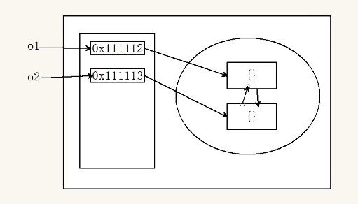
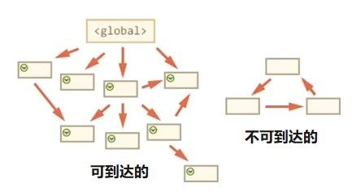
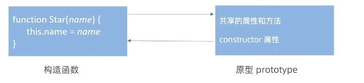
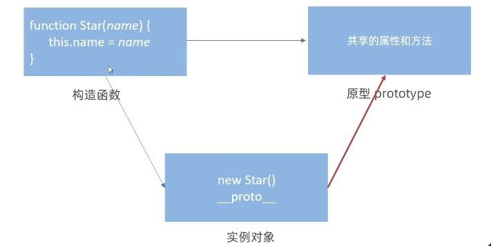
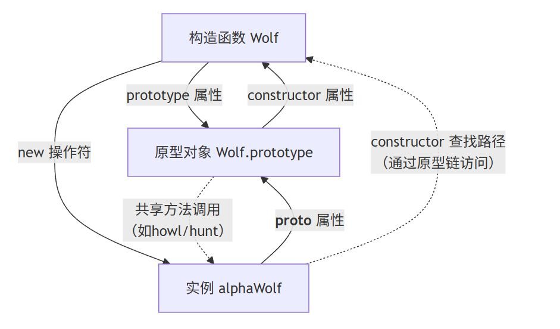
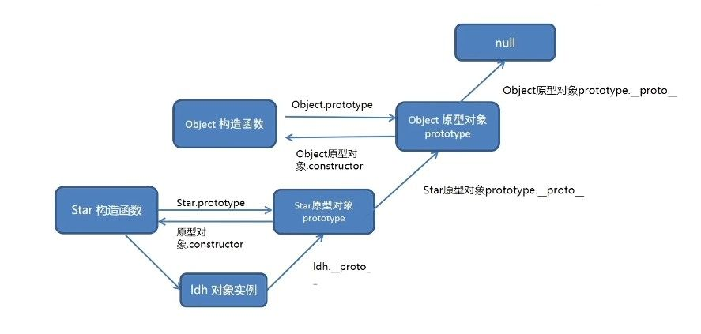

# 作用域

作用域是变量能被访问的有效范围，本质上决定了代码中变量的可见性。理解作用域能帮助我们避免变量污染，写出更健壮的代码。
作用域分为两大类型：局部作用域和全局作用域，它们通过作用域链形成层级查找关系。

### 局部作用域

局部作用域内的变量只能在特定范围内访问，分为两种常见形式：

- **函数作用域**

在函数内部声明的变量（包括函数参数）形成一个封闭的独立空间。例如：

```javascript
function calculate(x) { // x 是函数作用域的局部变量
  let result = x * 2; // result 只能在函数内部访问
  return result;
}
console.log(calculate(5)); // 输出 10
console.log(x); // 报错：x未定义
```

函数执行完毕后，其内部变量会被销毁。不同函数之间的变量就像隔墙对话——彼此无法直接访问。

- **块作用域**

用 `{}` 包裹的代码块（如 `if`/`for` 语句）中使用 `let` 或 `const` 声明的变量会形成块作用域：

```javascript
if (true) {
  let secret = "块内的秘密";
  var oldSecret = "老式秘密";
}
console.log(oldSecret); // 正常输出（var 无视块作用域）
console.log(secret); // 报错：secret未定义
```

通过对比可以看到，`let` 将变量限制在代码块内，而 `var` 会泄漏到外层作用域。现代开发中推荐使用 `let/const` 来避免意外污染。

### 全局作用域

在 `<script>` 标签或 JS 文件的最外层声明的变量属于全局作用域，可以在任何位置访问：

```javascript
const globalVar = "我是全局的";

function showGlobal() {
  console.log(globalVar); // 正常访问
  accidentalGlobal = "糟糕！我成了全局变量"; // 未使用声明关键字！
}
showGlobal();
console.log(accidentalGlobal); // 意外泄漏到全局
```

需要特别注意：

1. 避免直接给 `window` 对象添加属性（如 `window.myVar = 1`）
2. 函数内部未使用 `let/const/var` 声明的变量会变成全局变量
3. 过度使用全局变量容易引发命名冲突

### 作用域链

是一种查找机制，在当前作用域下去寻找该变量，如果没找到，再到它的上层作用域寻找，以此类推直到找到该变量或是已经到了全局作用域。
当前作用域 → 逐级父作用域 → 全局作用域

```javascript
let global = "顶层";
function outer() {
  let middle = "中间层";
  function inner() {
    let local = "底层";
    console.log(local);    // 当前作用域找到
    console.log(middle);  // 向上查找到 outer 作用域
    console.log(global);  // 继续向上查找到全局
  }
  inner();
}
outer();
```

这种链式查找机制解释了为什么内层函数能访问外部变量，而外层无法访问内部变量。理解这个机制对调试变量未定义错误至关重要。

### 垃圾回收机制

内存管理是 JavaScript 运行时的核心机制，理解垃圾回收能帮助我们写出更高效、更安全的代码。
内存生命周期分为三个阶段：分配（声明变量）→ 使用（读写操作）→ 回收（自动清理），其中回收阶段通过垃圾回收器自动完成，开发者更需要关注的是如何避免内存泄漏。

**内存分配与回收规则**

当我们在函数内部声明局部变量时，这些变量就像临时便签纸——函数执行时被贴在内存墙上，执行完毕就会被自动撕下（回收）。而全局变量则像永久告示牌，会一直存在直到页面关闭：

```javascript
function createTemp() {
  const tempData = "临时数据"; // 函数执行时创建
  console.log(tempData);
}
createTemp(); // 执行完毕后 tempData 被回收
console.log(tempData); // 报错：变量不存在

const globalData = "永久数据"; // 全局变量持续存在
```

需要警惕的是意外创建的全局变量：

```javascript
function leakMemory() {
  leakedVar = "本应是局部变量"; // 缺少 let/const 声明！
}
leakMemory();
console.log(leakedVar); // 意外成为全局变量
```

#### 回收算法

浏览器通过特定算法判断内存是否需要回收，经历了两个重要阶段：

- **引用计数法（已淘汰）**

早期 IE 浏览器通过"记账本"机制跟踪每个对象的被引用次数：

```javascript
let objA = { id: 1 }; // 引用次数+1
let objB = objA;      // 引用次数+1 → 总计2次
objA = null;          // 引用次数-1 → 剩余1次
objB = null;          // 引用次数-1 → 触发回收
```

但当对象相互引用时会导致永久驻留内存：

```javascript
function createLoop() {
  let o1 = {};
  let o2 = {};
  o1.link = o2; // 形成闭环引用
  o2.link = o1;
}
createLoop(); // 即使函数执行完毕，引用次数永远≥1
```



- **标记清除法（现代方案）**

现代浏览器采用"大扫除"机制：从全局对象出发标记所有可达对象，未被标记的视为垃圾：

```javascript
function createData() {
  const privateData = "敏感信息";
  window.exposedData = privateData; // 建立全局可达路径
}
createData();
// 函数执行后 privateData 仍被全局对象引用 → 无法回收
```

当需要清理时：

```javascript
delete window.exposedData; // 断开引用链
// 下次垃圾回收时 privateData 成为不可达对象 → 被回收
```



### 闭包

闭包就像函数的专属记忆背包——**当函数诞生时，它会随身携带出生地的环境变量**，这种"内外函数嵌套 + 变量持续锁定"的特性，让内部函数能长期访问外部函数的变量，即使外部函数已经执行完毕。

> 闭包=内层函数+外层函数的变量

**闭包的形成条件**

1. **嵌套结构**：函数内部定义另一个函数
2. **变量捕获**：内层函数使用外层函数的变量
3. **跨作用域调用**：内层函数在外层函数外部被使用

```javascript
function createCounter() {
  let count = 0; //  被锁定的记忆胶囊

  return function() {
    return ++count; //  每次调用都从背包取出胶囊操作
  };
}

// 🚀 创建携带独立背包的counter函数
const counter = createCounter();

console.log(counter()); // 1. 打开胶囊→读取0→+1→存回
console.log(counter()); // 2. 再次打开更新后的胶囊
```

此时外层函数的 `count` 变量不会被回收，因为内部函数始终保持对其的引用。

#### 闭包的常见写法

- **封装私有变量（模块模式）**

**场景**：需要保护数据不被外部直接修改时使用  
**写法**：用立即执行函数包裹，返回操作接口

```javascript
// 用户积分模块
const userScore = (function() {
  let _score = 0; // 私有变量，外部无法直接访问

  return {
    add: (num) => _score += num,
    deduct: (num) => _score = Math.max(0, _score - num),
    get: () => _score
  };
})();

userScore.add(50);
userScore.deduct(20);
console.log(userScore.get()); // 30
// console.log(_score) → 报错，无法直接访问
```

- **动态生成功能函数（工厂模式）**

**场景**：需要批量创建功能相似但配置不同的函数时使用  
**写法**：外层函数接收参数，返回携带配置的新函数

```javascript
// 创建不同倍数的计算器
function createMultiplier(multiplier) {
  return function(num) {
    return num * multiplier; // 闭包记住当前倍数
  };
}

const double = createMultiplier(2);
const triple = createMultiplier(3);

console.log(double(5)); // 10 → 始终用2倍计算
console.log(triple(5)); // 15 → 始终用3倍计算
```

#### 闭包的应用与风险

闭包常用于实现模块化开发，例如封装私有变量：

```javascript
const student = (function() {
  let _score = 60; // 私有变量

  return {
    getScore: () => _score,
    addScore: (num) => _score += num
  };
})();

console.log(student.getScore()); // 60
student.addScore(10);
console.log(student.getScore()); // 70
```

但不当使用会导致内存泄漏，例如在 DOM 事件中滥用闭包：

```javascript
function bindEvents() {
  const bigData = new Array(1000000).fill('*'); // 大数据
  document.getElementById('myBtn').onclick = () => {
    console.log(bigData.length); // 闭包长期持有 bigData
  };
}
// 即使移除按钮，bigData 仍驻留内存
```

### 变量提升

变量提升是 JavaScript 编译阶段的特殊处理机制，表现为 **`var` 声明的变量会提升到作用域顶部**，但仅提升声明不提升赋值。这种机制容易引发代码理解错位，是许多隐蔽 Bug 的根源：

```javascript
console.log(name); // 输出 undefined（而非报错）
var name = "张三";
```

等效于编译后的代码：

```javascript
var name;          // 声明提升到顶部
console.log(name); // 此时 name 尚未赋值
name = "张三";     // 赋值留在原地
```

1. `let/const` 强制先声明后使用，不会出现变量提升
2. 同一作用域下重复的 `var` 声明会被合并，而 `let/const` 会报错

现代开发中，使用 `let/const` 配合严格模式(`'use strict'`) 可完全规避变量提升问题：

```javascript
'use strict';
console.log(age); // 报错（未声明前不可访问）
let age = 25;
```

变量提升是早期 JS 设计妥协的产物，ES6 通过块级作用域和 `let/const` 弥补了这一缺陷。

# 函数进阶

### 函数提升

**函数声明整体提升**  
函数声明会带着函数体提升到作用域顶端，可在声明前调用：

```javascript
// ✅ 正常执行
getVersion();

function getVersion() {
  return 'v2.0.0';
}
```

**函数表达式不提升**  
通过变量赋值的函数遵循变量提升规则，仅提升变量声明：

```javascript
// ❌ 报错：not a function
getPrice();

var getPrice = function() {
  return 99.9;
};
```

等效于：

```javascript
var getPrice;         // 变量声明提升
getPrice();           // 此时 getPrice=undefined
getPrice = function() { ... }; // 赋值留在原地
```

### 函数参数

#### 动态参数 `arguments`

处理不确定数量的参数时，JavaScript 提供了两种方案。传统方式通过 **`arguments` 伪数组**获取所有实参，这种方式在箭头函数中不可用且操作受限：

```javascript
// 传统求和函数（使用 arguments）
function getSum() {
  let total = 0;
  // 遍历 arguments 对象
  for (let i = 0; i < arguments.length; i++) {
    total += arguments[i]; // 通过索引访问每个参数
  }
  console.log('总和：', total);
}

getSum(2, 3);        // 输出：总和：5
getSum(1, 2, 3, 4);  // 输出：总和：10
```

#### 剩余参数 `...arg`

现代开发更推荐使用 **剩余参数** 语法，直接将多余参数捕获为**真数组**：

```javascript
// 现代求和函数（使用剩余参数）
function getSum(...numbers) { // 所有参数存入 numbers 数组
  let total = 0;
  numbers.forEach(function(num) { // 直接使用数组方法
    total += num;
  });
  console.log('总和：', total);
}

getSum(5, 10);       // 输出：总和：15
getSum(2, 4, 6, 8);  // 输出：总和：20
```

#### 展开运算符

与剩余参数语法相同但作用相反，**展开运算符** 可拆解数组用于特定场景。经典应用包括：

- 展开数组
- 合并数组

```javascript
// 计算最高温度（参数需要独立数值）
const temperatures = [22, 19, 25, 18];

// 1 展开运算符，然后直接拆解
console.log('最高温度（现代）：', Math.max(...temperatures)); // 25

// 2 合并两个数组（不修改原数组）
const week1 = ['周一', '周二'];
const week2 = ['周三', '周四'];
const fullWeek = [...week1, ...week2];
console.log(fullWeek); // ['周一', '周二', '周三', '周四']
```

假设需要实现一个配置函数，同时接收基础 URL 和多个配置项：

```javascript
// 传统写法（使用 arguments）
function setConfig() {
  const baseURL = arguments[0]; // 手动提取第一个参数
  const options = Array.prototype.slice.call(arguments, 1); // 截取剩余参数
  console.log('基础地址：', baseURL);
  console.log('配置选项：', options);
}
setConfig('http://api.com', 'timeout=3000', 'retry=3');

// 现代写法（剩余参数）
function setConfig(baseURL, ...options) { // 自动分离参数
  console.log('基础地址：', baseURL);
  console.log('配置选项：', options);
}
setConfig('http://api.com', 'timeout=3000', 'retry=3');
```

### 箭头函数

#### 基本语法

箭头函数通过简化的语法结构提升代码可读性，其设计哲学在于提供更紧凑的函数表达式方案。
与传统函数的关键差异体现在三个方面：

**语法演进**

```javascript
// 传统函数表达式
const legacyFunc = function(a, b) {
  return a + b;
};

// 箭头函数标准形式（等效改写）
const arrowFunc = (a, b) => {
  return a + b;
};
```

**简写规则**

箭头函数通过精简语法让代码更直观，其简写规则针对常见场景做了针对性优化：

1. **单参数省略括号**

当函数**只有一个参数**时，可省略参数外的圆括号，让代码更紧凑：

```javascript
// 传统写法（带括号）
const double = function(num) { return num * 2; };

// 箭头函数优化（省略括号）
const double = num => num * 2;
```

这种写法常见于简单的数学运算或数据过滤：

```javascript
// 筛选正数
const positiveNumbers = [-2, 5, -3].filter(num => num > 0); // [5]
```

2. **单行返回值隐式返回：**

当函数体**只有一行代码**时，可省略花括号和`return`关键字，结果自动返回：

```javascript
// 传统写法（需写return）
const add = function(a, b) {
  return a + b;
};

// 箭头函数优化（自动返回）
const add = (a, b) => a + b;
```

适用于简单的计算或转换：

```javascript
// 温度转换（华氏度→摄氏度）
const fToC = fahrenheit => (fahrenheit - 32) * 5/9;
```

3. **返回对象字面量特殊处理：**

直接返回对象时**必须包裹圆括号**，避免引擎误认为代码块：

```javascript
// 错误写法（缺少括号）
const createUser = name => { name: name }; // 报错

// 正确写法（包裹对象）
const createUser = name => ({ name: name });
```

这种写法常见于快速构建数据对象：

```javascript
// 生成颜色配置
const getColor = code => ({
  hex: `#${code}`,
  rgb: '255,255,255'
});
```

**运行时特性**  
箭头函数作为表达式函数，不存在函数提升现象。这意味着：

```javascript
printHello(); // 正常执行
function printHello() { console.log('Hello'); }

printHi(); // 报错：初始化前访问
const printHi = () => console.log('Hi');
```

#### 箭头函数参数

参数处理机制体现了对传统函数缺陷的改进，**剩余参数（** 方案解决了 `arguments` 的伪数组问题：

```javascript
// 传统 arguments 方案（了解即可）
function legacySum() {
  let total = 0;
  for(let i=0; i<arguments.length; i++) {
    total += arguments[i];
  }
  return total;
}

// 现代剩余参数方案（推荐实践）
const modernSum = (...nums) => {
  return nums.reduce((acc, num) => acc + num, 0);
};
```

#### 箭头函数 this

this 绑定机制是箭头函数最核心的特性变革，其设计目标为解决传统函数上下文绑定的混乱问题。
执行规则为：**继承定义时的词法作用域的 this 值**。

**经典场景对比**：

```javascript
// 传统函数 - this 由调用方式决定
const timer = {
  seconds: 10,
  start: function() {
    setInterval(function() {
      console.log(this.seconds--); // 错误：this 指向 window
    }, 1000);
  }
};

// 箭头函数 - this 静态继承
const timer = {
  seconds: 10,
  start: function() {
    setInterval(() => {
      console.log(this.seconds--); // 正确：继承 start 的 this
    }, 1000);
  }
};
```

**DOM 事件处理警示**：

```javascript
const btn = document.querySelector('#actionBtn');

// 危险方案（this 指向 window）
btn.addEventListener('click', () => {
  console.log(this); // 不符合预期的上下文
  this.classList.add('active'); // 运行时错误
});

// 推荐方案（保留 this 绑定）
btn.addEventListener('click', function() {
  console.log(this); // 指向 DOM 元素
  this.classList.add('active');
});
```

**对象方法陷阱**：

```javascript
const user = {
  name: '张三',
  // 错误用法（箭头函数直接作为方法）
  printName: () => {
    console.log(this.name); // this 指向外层作用域
  },
  // 正确用法（传统方法语法）
  printNameValid() {
    console.log(this.name); // 正常访问对象属性
  }
};
```

**嵌套作用域穿透**：

```javascript
const parent = {
  value: 1,
  child: {
    value: 2,
    // 箭头函数继承 parent.child 作用域的 this
    print: () => console.log(this.value) // 输出 undefined
  }
};
```

通过理解箭头函数的静态 this 绑定特性，我们可以更安全地处理异步回调和嵌套函数场景，但需特别注意在需要动态上下文的场景（如对象方法、DOM 事件）中的使用限制。

### 对象解构

对象解构是一种快速提取对象属性并批量赋值的现代语法，其核心价值在于**简化数据访问逻辑**。
与传统逐个赋值的写法相比，这种语法糖（Syntactic Sugar）显著提升了代码的可读性和维护效率。

> **语法糖**：编程语言提供的简洁写法，用更易读的形式实现原有功能。例如  `const {name} = user`  本质仍是属性访问，但代码更清晰直观。

#### 基本语法

我们可以通过等号左侧的花括号声明需要提取的属性名，实现属性到变量的直接映射：

```javascript
// 用户数据对象
const user = {
  name: '小明',
  age: 18
};

// 传统逐个赋值
const name = user.name;
const age = user.age;

// 对象解构方案
const { name, age } = user;
console.log(name); // "小明"
console.log(age);  // 18
```

**关键规则**：

1. **属性名匹配**：变量名必须与对象属性名一致
2. **作用域隔离**：解构变量与外部作用域同名变量冲突时会报错
3. **安全防护**：未匹配属性返回 `undefined`

```javascript
// 危险操作（变量名冲突）
let title = '全局标题';
const post = { title: '文章标题' };
// const { title } = post; // 报错：重复声明

// 安全方案（隔离作用域）
function getPostInfo() {
  const { title } = post;
  console.log(title); // "文章标题"
}
```

#### 变量重命名

当需要避免命名冲突或提升语义时，可通过冒号语法指定新变量名：

```javascript
const product = {
  id: 'P1001',
  price: 99.9
};

// 重命名解构
const { id: productId, price: productPrice } = product;
console.log(productId);    // "P1001"
console.log(productPrice); // 99.9
```

这种写法常见于处理多个数据源的场景，如同时解析用户配置和系统配置：

```javascript
// 多配置合并场景
const userConfig = { theme: 'dark' };
const defaultConfig = { theme: 'light', fontSize: 14 };

const { theme: userTheme } = userConfig;
const { theme: defaultTheme, fontSize } = defaultConfig;
```

#### 数组对象解构

该语法同样支持从数组元素中解构对象，特别适合处理接口返回的规范化数据结构：

```javascript
// 接口返回的带元数据数组
const response = [{
  code: 200,
  data: [{
    id: 1,
    name: '商品A'
    }]
}];

// 分级解构获取核心数据
const [{
  data: [ firstItem ]
  }] = response;

console.log(firstItem); // { id: 1, name: '商品A' }
```

掌握基于构造函数创建对象，理解实例化过程 2.掌握对象数组字符数字等类型的常见属性和方法，便捷完成功能

新的对象

# 对象

### 创建对象

在 JavaScript 中，我们可通过三种典型方式创建对象，其演进路线体现了从简单场景到复杂系统需求的适应过程：

**对象字面量**
作为基础创建方式，适合定义单例对象。其语法直观但复用性有限：

```javascript
const Peppa = {
  name: '佩奇',
  age: 6,
  gender: '女'
};
```

**new Object()**
是早期提供的工厂模式，本质是对象字面量的语法变体。其局限性在于无法实现定制化对象创建逻辑：

```javascript
const George = new Object({
  name: '乔治',
  age: 3,
  gender: '男'
});
```

**构造函数(重点)**
的引入解决了批量对象创建问题。通过将对象模板抽象为可复用的函数结构，我们实现了面向对象编程的核心特征——实例化能力：

```javascript
function Pig(name, age, gender) { // 构造函数要求**首字母大写**
  // this 绑定新创建实例
  this.name = name
  this.age = age
  this.gender = gender

const Mum = new Pig('猪妈妈', 30, '女');
console.log(Mum); // Pig {name: '猪妈妈', age: 30, gender: '女'}
```

> 构造函数要求**首字母大写**的命名规范（如 Pig）

### 构造函数核心机制

当使用 `new` 运算符调用函数时，会触发以下隐式操作：

1. 创建空对象并绑定到函数上下文（this 指向空对象）
2. 执行构造函数逻辑进行属性赋值
3. **自动返回**新创建的对象实例

这一机制解释了为何构造函数中不需要显式 return 语句。

通过家庭成员对象的创建案例，我们可以清晰看到不同方案的适用边界：

```javascript
// 字面量方案：4 次重复代码
const Peppa = { name: '佩奇', age: 6, gender: '女' };
const George = { name: '乔治', age: 3, gender: '男' };
const Mum = { name: '猪妈妈', age: 30, gender: '女' };
const Dad = { name: '猪爸爸', age: 32, gender: '男' };

// 构造函数方案：模板化创建
function FamilyMember(name, age, gender) {
  this.name = name;
  this.age = age;
  this.gender = gender;
}

const Peppa = new FamilyMember('佩奇', 6, '女');
const George = new FamilyMember('乔治', 3, '男');
// ...其他家庭成员实例化
```

当需要创建**同构对象超过 2 个**时，构造函数模式能显著提升代码可维护性。这种模式转变带来的收益随着系统复杂度的提升呈指数级增长。

### 实例成员/静态成员

**实例成员**

实例成员是通过构造函数创建的**对象专属属性与方法**，每个实例对象都拥有独立的成员副本。
这种机制保证了对象间的数据隔离性，是面向对象编程的基础特性：

```javascript
function Person() {
  // 实例属性
  this.name = '小明';
  // 实例方法
  this.sayHi = function() {
    console.log('大家好~');
  };
}

const p1 = new Person();
console.log(p1.name);  // "小明"（访问实例属性）
p1.sayHi();            // 调用实例方法
```

**核心特性**：

实例成员通过构造函数内的  `this`  动态绑定到每个新对象，**每个实例都独立存储自己的属性和方法**。
例如创建两个  `Person`  对象时，它们的  `sayHi`  方法互不影响，修改一个不会改变另一个。

```javascript
// 参数化构造函数
function Student(name, grade) {
  this.name = name;
  this.grade = grade;
}

const s1 = new Student('李雷', 3);
const s2 = new Student('韩梅梅', 4);
// s1 与 s2 拥有独立数据存储
```

通过构造函数参数，我们可以像流水线一样**动态设置不同初始值**，快速生成结构相同但数据不同的对象。

**静态成员**

静态成员是**构造函数自身的属性与方法**，用于实现与实例无关的公共功能。
其设计目标是提供类级别的工具方法：

```javascript
function Person() {
  // 实例成员定义...
}

// 静态属性（所有人类共有特征）
Person.eyes = 2;
Person.arms = 2;

// 静态方法（通用功能）
Person.walk = function() {
  console.log('人类行走方式');
  console.log(this.eyes); // this 指向构造函数
};

console.log(Person.eyes); // 2（访问静态属性）
Person.walk();            // 调用静态方法
```

**关键约束**：

静态成员直接挂在构造函数上，**和具体实例无关**。

比如  `Person.walk()`  方法无法读取实例的  `name`  属性，就像数学工具  `Math.random()`  不需要知道具体数字一样。这类方法常用于定义通用工具（如日期格式化）或全局配置（如默认超时时间）。

# 内置构造函数

基本类型处理简单数据，引用类型承载复杂结构。
JavaScript 的类型系统存在一个精妙设计：**基本数据类型通过包装类型临时对象化**。

当我们操作字符串、数字等基本类型时，引擎会自动创建临时包装对象，这使得如下操作成为可能：

```javascript
const str = 'andy';
console.log(str.length); // 4（临时 String 对象提供 length 属性）
```

这种机制让基本类型在需要也能调用方法（如 `'text'.toUpperCase()`），操作完成后立即销毁临时对象，回归基本类型状态。

## 引用类型

### Object

#### 对象属性访问

访问对象属性有两种主要方法，各有优势：

```javascript
const person = { name: '小狼', age: 25 };

// 1. 点符号（语法简洁，直观）
console.log(person.name);  // 输出: 小狼

// 2. 方括号表示法（更灵活，可使用变量和特殊键名）
console.log(person['name']);  // 输出: 小狼

// 最强大的用法：使用变量作为键
const key = 'age';
console.log(person[key]);  // 输出: 25
```

#### 键值提取 `.keys()/.values()`

这对方法分别提取对象的键和值，返回数组形式。在处理数据格式转换时，它们常与数组方法配合使用：

```javascript
const user = { name: '佩奇', age: 6 };

const keys = Object.keys(user);   // ['name', 'age']
const values = Object.values(user); // ['佩奇', 6]
```

通过将对象结构转化为数组，可无缝接   接下来提到的数组方法进行深度处理。

#### 对象合并 `.assign()`

**`Object.assign()`**
该方法 从左到右覆盖式 合并对象。

1. **第一个参数为目标对象**：所有源对象的属性都会拷贝到此对象
2. **后续参数为源对象**：按顺序覆盖同名属性
3. **浅拷贝特性**：嵌套对象仍为引用关系（修改会影响原对象）

典型场景是为已有对象追加属性或创建浅拷贝：

```javascript
// 基础用法：动态添加属性
const obj = { a: 1 };
Object.assign(obj, { b: 2 });
console.log(obj); // { a:1, b:2 }（直接修改原对象）

// 合并逻辑：同名属性被覆盖
const merged = Object.assign(
  { color: '红' },
  { color: '蓝', size: 'M' },
  { size: 'XL' }
);
console.log(merged); // { color:'蓝', size:'XL' }（最后一个源对象覆盖 size）

// 浅拷贝陷阱：修改拷贝对象会影响原对象
const origin = { nested: { value: 10 } };
const copy = Object.assign({}, origin);
copy.nested.value = 99;

console.log(origin.nested.value); // 99（共享嵌套对象）
```

方括号表示法特别适用于：

- 键名为变量时（如 `romanValues[s[i]]`）
- 键名含特殊字符时（如 `obj['hello-world']`）
- 在算法中动态查找属性时（如罗马数字转换）

实际应用案例：

```javascript
// 罗马数字转整数中的应用
const romanValues = { 'I': 1, 'V': 5, 'X': 10 };
const romanStr = "IV";
let sum = 0;

for(let i = 0; i < romanStr.length; i++) {
  // 使用字符作为键名动态查询值
  sum += romanValues[romanStr[i]];  // 等同于 romanValues['I'], romanValues['V']
}
```

#### 键值提取 `.keys()/.values()`

这对方法分别提取对象的键和值，返回数组形式。在处理数据格式转换时，它们常与数组方法配合使用：

```javascript
const user = { name: '佩奇', age: 6 };

const keys = Object.keys(user);     // ['name', 'age']
const values = Object.values(user); // ['佩奇', 6]

// 同时获取键值对
const entries = Object.entries(user); // [['name','佩奇'], ['age',6]]
```

通过将对象结构转化为数组，可无缝接接下来提到的数组方法进行深度处理。

#### 对象合并 `.assign()`

**`Object.assign()`**
该方法 从左到右覆盖式 合并对象。

1. **第一个参数为目标对象**：所有源对象的属性都会拷贝到此对象
2. **后续参数为源对象**：按顺序覆盖同名属性
3. **浅拷贝特性**：嵌套对象仍为引用关系（修改会影响原对象）

典型场景是为已有对象追加属性或创建浅拷贝：

```javascript
// 基础用法：动态添加属性
const obj = { a: 1 };
Object.assign(obj, { b: 2 });
console.log(obj); // { a:1, b:2 }（直接修改原对象）

// 合并逻辑：同名属性被覆盖
const merged = Object.assign(
  { color: '红' },
  { color: '蓝', size: 'M' },
  { size: 'XL' }
);
console.log(merged); // { color:'蓝', size:'XL' }（最后一个源对象覆盖 size）

// 浅拷贝陷阱：修改拷贝对象会影响原对象
const origin = { nested: { value: 10 } };
const copy = Object.assign({}, origin);
copy.nested.value = 99;

console.log(origin.nested.value); // 99（共享嵌套对象）
```

### Array 重点方法

#### 基础迭代：`.forEach()`

```Javascript
数组.forEach(function(当前元素, 当前索引) {
  // 对每个元素执行操作（无返回值）
})
```

`forEach()` 是替代传统 `for` 循环的现代方案，其核心能力在于 **自动化迭代控制**。通过对比可见其如何简化代码逻辑：

```javascript
// 传统索引循环
const prices = [100, 200, 300];

for (let i = 0; i < prices.length; i++) {
  console.log(`价格${i + 1}: ${prices[i]}`);
}
// 现代迭代方案
prices.forEach(function(price, index) {
  console.log(`价格${index + 1}: ${price}`);
});
```

与手动维护索引的传统循环不同，`forEach` 自动处理数组遍历过程。回调函数始终按 **元素 → 索引 → 原数组** 的顺序接收参数，这种标准化接口降低了认知成本。

#### 数据转换：`.map()`

```Javascript
const 新数组 = 数组.map(function(当前元素, 当前索引) {
  return 转换后的元素 // 必须显式返回新值
})
```

`map()` 专注于 **元素映射转换**，其设计理念是保持原数组不变并**生成新数组**。

```javascript
// 传统转换方式
const prices = [99.8, 145.5, 32.0];
const formatted = [];
for (let i = 0; i < prices.length; i++) {
  formatted.push(`¥${prices[i].toFixed(2)}`);
}
// 声明式转换方案
const formatted = prices.map(function(price) {
  return `¥${price.toFixed(2)}`;
});
```

`map` 方法通过返回新数组的特性，天然支持链式调用。在处理数据流水线时，可以流畅衔接其他数组方法形成处理链路，这种特性在组合 `filter` 等操作时尤为实用。

#### 条件筛选：`.filter()`

```Javascript
const 筛选数组 = 数组.filter(function(当前元素) {
  return 条件表达式 // 返回true保留元素，false过滤元素
})
```

`filter()` 实现了 **真值测试驱动** 的数据过滤机制，其核心逻辑是将条件判断抽象为独立函数：

```javascript
// 传统筛选方式
const users = [/* 用户数据 */];
const adults = [];
for (let i = 0; i < users.length; i++) {
  if (users[i].age >= 18) {
    adults.push(users[i]);
  }
}

// 函数式筛选方案
const adults = users.filter(function(user) {
  return user.age >= 18;
});
```

该方法通过返回新数组保持数据不可变性，特别适合与 `map` 组合使用。当需要处理复合条件时，可通过逻辑运算符组合多个判断条件。

#### 字符串拼接：`.join()`

```Javascript
const 拼接结果 = 数组.join('分隔符') // 默认分隔符为逗号
```

`join()` 方法将数组转换为格式可控的字符串，其分隔符参数提供了灵活的格式定制能力：

```javascript
// 路径拼接场景
const pathSegments = ['src', 'utils', 'helper.js'];
const fullPath = pathSegments.join('/'); // "src/utils/helper.js"

// CSV生成场景
const headers = ['Name', 'Age'];
const row = ['Alice', 25];
console.log(headers.join(',')); // "Name,Age"
console.log(row.join(','));     // "Alice,25"
```

该方法在处理数据导出、URL 生成等场景时，能够显著简化字符串拼接逻辑。通过不同分隔符的配置，可快速适配 JSON、CSV 等多种数据格式要求。

#### 累计运算：`.reduce()`

```javascript
const 最终值 = 数组.reduce(function(累计值, 当前元素) {
  return 更新后的累计值
}, 初始值)
```

`reduce()` 的核心在于 **通过遍历逐步收敛为单一值**，

1. **初始值决定起点**：若提供初始值，首轮累计值为初始值；否则直接取数组**首元素**
2. **链式传递逻辑**：每次迭代的返回值自动成为下一轮累计值

其执行逻辑可通过两种典型场景理解：

```javascript
// 场景1：数组求和（无初始值）
const nums = [1, 2, 3, 4];
const sum = nums.reduce((acc, cur) => acc + cur);
// 执行过程：1+2=3 → 3+3=6 → 6+4=10（结果：10）

// 场景2：带初始值的对象统计
const words = ['apple', 'banana', 'apple'];
const count = words.reduce((acc, word) => {
  acc[word] = (acc[word] || 0) + 1;
  return acc;
}, {});
// { apple:2, banana:1 }（初始空对象逐步填充）
```

1. 初始值存在时，首次循环的 `acc` 为初始值，否则直接取数组第一个元素
2. 每次循环的返回值会成为下次循环的 `acc`
3. 最终收敛值可以是任意类型（数字、对象、数组等）

与传统循环相比，`reduce` 将迭代控制权交给引擎，开发者只需关注 **如何更新累计值**。这种模式在数据聚合、多维数组扁平化等场景中，能显著提升代码可读性。

#### 元素搜索：`.find()`

```javascript
const 目标元素 = 数组.find(function(当前元素) {
  return 匹配条件 // 返回true时停止搜索并返回该元素
})
```

`find()` 的核心价值在于 **短路搜索机制**，其执行逻辑与传统搜索方式的对比：

```javascript
// 传统搜索方式
const users = [{id:1, admin:false}, {id:2, admin:true}];
let target;
for (let i = 0; i < users.length; i++) {
  if (users[i].admin) {
    target = users[i];
    break; // 找到后立即中断循环
  }
}

// 声明式搜索方案
const adminUser = users.find(user => user.admin); // {id:2, admin:true}
```

该方法在找到首个匹配元素后立即终止遍历，这种特性在处理大型数组时能显著提升性能。与 `filter` 返回数组不同，`find` 直接返回目标元素本身，在需要获取对象引用时更为实用。

#### 全员检测：every()

```javascript
const 全员通过 = 数组.every(function(当前元素) {
  return 检测条件 // 所有元素都返回true则最终为true
})
```

`every()` 通过 **全员验证机制** 实现整体性判断，其短路特性体现在：

```javascript
// 传统验证方式
const products = [{stock:5}, {stock:0}, {stock:3}];
let allInStock = true;
for (let i = 0; i < products.length; i++) {
  if (products[i].stock <= 0) {
    allInStock = false;
    break; // 遇到不合格立即中断
  }
}

// 函数式验证方案
const isAllInStock = products.every(p => p.stock > 0); // false
```

当检测到首个不满足条件的元素时，遍历立即终止。该方法常与 `some()` 形成逻辑互补（全员满足 vs 至少一个满足），在表单验证、权限检查等场景中极为实用。

### Array 其他方法

#### 存在性检测：`some()`

与 `every()` 形成逻辑互补，当数组中**至少有一个元素**满足条件时即返回 `true`：

```javascript
const hasNegative = [1, -5, 3].some(n => n < 0); // true
```

典型应用场景：权限检查（至少拥有一个权限）、表单验证（存在非法输入）

#### 数组合并：`concat()`

**安全合并**多个数组（不修改原数组）：

```javascript
const arr1 = [1, 2];
const arr2 = [3];
const merged = arr1.concat(arr2); // [1,2,3]（原数组保持不变）
```

特别说明：现代开发更常用扩展运算符 `[...arr1, ...arr2]`

#### 排序控制：`sort()`

**原地排序**（修改原数组），默认按字符串 Unicode 排序：

```javascript
const nums = [10, 5, 40];
nums.sort(); // [10, 40, 5]（字典序排列）

// 正确数字排序需比较函数
nums.sort((a, b) => a - b); // [5, 10, 40]
```

关键注意：比较函数返回负数/0/正数决定排序顺序

#### 动态修改：`splice()`

**最灵活**的数组修改方法（可删除/替换/添加元素）：

```javascript
const arr = ['a', 'b', 'c'];
arr.splice(1, 1, 'x'); // 从索引1开始删除1个元素，插入'x'
console.log(arr); // ['a', 'x', 'c']
```

参数模式：  
`startIndex` → 起始位置  
`deleteCount` → 删除数量  
`...items` → 插入的新元素

#### 结构反转：`reverse()`

**原地反转**数组元素顺序：

```javascript
const letters = ['a', 'b', 'c'];
letters.reverse(); // ['c', 'b', 'a']（原数组被修改）
```

典型用途：处理栈结构、展示倒序列表

#### 索引定位：`findIndex()`

与 `find()` 逻辑一致，但返回元素的**索引值**（未找到返回-1）：

```javascript
const users = [{id:1}, {id:2}];
const index = users.findIndex(u => u.id === 2); // 1
```

特别适配场景：需要索引进行后续操作（如结合 `splice` 删除元素）

#### 结构转换：`Array.from()`

将类数组结构（含 length 属性）转换为标准数组：

```javascript
const 新数组 = Array.from(伪数组)
```

**典型场景**：处理 DOM 元素集合或 arguments 对象

```javascript
// DOM 操作场景
const divList = document.querySelectorAll('div'); // NodeList 伪数组
const realArray = Array.from(divList); // 可调用数组方法

// 传统方案对比
const oldWay = [].slice.call(divList); // ES5 转换方式
```

### Array 方法总结

#### 基础必备

**（处理数据必用，每天写代码都离不开）**

**1. `forEach` (重点)**  
最简单的遍历方法，**替代`for`循环**的最佳选择。就像自动售货机——投币（数组）后自动吐出每个商品（元素），你只需要处理每个商品：

```javascript
['牛奶', '面包'].forEach((商品, 序号) => {
  console.log(`第${序号+1}件：${商品}`)
})
// 输出：第1件：牛奶 → 第2件：面包
```

**注意**：不能中途`break`停止，需要中断时用`for`循环

**2. `map` (重点)**  
**数据变形金刚**，把数组中的每个元素变成新模样，且**不修改原数组**：

```javascript
const 价格 = [100, 200]
const 打折价 = 价格.map(原价 => 原价 * 0.8) // [80, 160]
```

**经典场景**：接口数据转换（API 返回的数据 → 前端需要的格式）

**3. `filter` (重点)**  
**数据过滤器**，只留下符合条件的元素：

```javascript
const 用户列表 = [{年龄:17}, {年龄:20}]
const 成年人 = 用户列表.filter(用户 => 用户.年龄 >= 18) // [{年龄:20}]
```

**陷阱**：`filter(item => item.prop)` 会过滤掉`prop`为`0`或`false`的合法值

#### 进阶必备

**（提升代码效率，处理复杂场景）**

**4. `reduce` (重点)**  
**数据聚合器**，把数组浓缩成一个值（数字/对象/新数组）：

```javascript
// 计算总价
const 购物车 = [{价格:100}, {价格:200}]
const 总价 = 购物车.reduce((累计, 商品) => 累计 + 商品.价格, 0) // 300
```

🔥 **高阶用法**：统计词频、扁平化嵌套数组

**5. `find` (重点)**  
**精准搜索**，找到第一个符合条件的元素（比`filter`更快）：

```javascript
const 订单列表 = [{id:1, 状态:'未支付'}, {id:2, 状态:'已发货'}]
const 待处理订单 = 订单列表.find(订单 => 订单.状态 === '未支付') // {id:1...}
```

**注意**：找不到时返回`undefined`，要用`if`判断结果是否存在

#### 实用工具

| 方法        | 一句话功能           | 使用示例                              | 注意点                      |
| ----------- | -------------------- | ------------------------------------- | --------------------------- |
| `some`      | **至少一个满足条件** | `[1, -2].some(n => n<0) → true`       | 和`every`相反               |
| `concat`    | **合并数组**         | `[1].concat([2]) → [1,2]`             | 用`[...arr1,...arr2]`更现代 |
| `sort`      | **排序**             | `[10,2].sort((a,b)=>a-b) → [2,10]`    | 必须传比较函数！            |
| `splice`    | **增删改元素**       | `arr.splice(1,0,'新增')` 插入元素     | 直接修改原数组              |
| `findIndex` | **找元素位置**       | `['a','b'].findIndex(v=>v==='b') → 1` | 找不到返回-1                |

- **`forEach`**：每个都做点什么
- **`map`**：每个都变个样子
- **`filter`**：好的留下，坏的不要
- **`reduce`**：多个变一个
- **`find`**：抓住第一个符合条件的

## 包装类型

String，Number，Boolean 等

### String 重点方法

#### 结构拆分：`.split()`

```javascript
const 数组 = 字符串.split(分隔符)
```

`split()`  实现字符串与数组的高效双向转换，与数组的  `join()`  方法形成互逆操作，构建字符串 ↔ 数组转换闭环。  
其核心价值在于**结构化数据处理**：

```javascript
// 传统方案：手动拆分
const csv = '张三,25,男';
let data = [];
let temp = '';
for (let char of csv) {
  if (char === ',') {
    data.push(temp);
    temp = '';
  } else {
    temp += char;
  }
}
data.push(temp);

// 现代拆分方案
const data = csv.split(','); // ["张三", "25", "男"]
```

分隔符支持正则表达式（如  `/\s+/`  匹配连续空格），连续分隔符会产生空元素，第二参数控制最大分段数量

#### 精准截取：`.substring()`

```javascript
字符串.substring(起始索引[, 结束索引]) // 截取内容不包含结束索引号的内容
```

与 `slice()` 方法类似，但**不支持负索引**，提供更安全的截取控制：

```javascript
// 传统字符操作
const str = '前端开发工程师';
let result = '';
for (let i=2; i<4; i++) {
  result += str[i];
}

// 现代截取方案
const result = str.substring(2, 4); // "开发"
```

当起始索引大于结束索引时，`substring` 会自动调换参数，而 `slice` 返回空字符串。在表单输入截断等场景下更安全。自动处理起始>结束的情况（交换参数）超范围索引自动截断到有效范围

#### 前缀检测：`.startsWith()`

```javascript
字符串.startsWith(检测字符串[, 起始位置])
```

实现精准的头部匹配检测，**替代正则检测的轻量方案**：

```javascript
// 传统方案
const isHttps = url.indexOf('https://') === 0;

// 现代检测方案
const isHttps = url.startsWith('https://');
```

**典型应用**：

```javascript
// 路由检测
if (path.startsWith('/api', 7)) {
  // 从第7字符开始检测
  handleAPIRequest();
}
```

#### 存在性判断：`.includes()`

```javascript
字符串.includes(搜索字符串[, 起始位置])
```

提供更直观的包含性检测，**替代 `indexOf` 的现代方案**：

```javascript
// 传统检测
const isValid = content.indexOf('重要通知') !== -1;

// 语义化检测
const isValid = content.includes('重要通知');
```

与数组的 `includes` 方法形成语法统一，降低记忆成本。注意对大小写敏感，必要时先统一大小写。

### String 其他方法

#### 大小写转换：`.toUpper/LowerCase()`

```javascript
字符串.toUpperCase()  // 全大写转换
字符串.toLowerCase()  // 全小写转换
```

#### 位置定位：`.indexOf()`

```javascript
字符串.indexOf(搜索值[, 起始位置])
```

返回**首次出现位置的索引**（未找到返回 -1），适合精确查找：

```javascript
// 文件类型检测
const fileName = 'report.pdf';
if (fileName.indexOf('.pdf') !== -1) {
  showPreview();
}
```

#### 后缀检测：`.endsWith()`

```javascript
字符串.endsWith(检测字符串[, 检测长度])
```

常用于文件格式验证，**支持限定检测范围**：

```javascript
// 图片格式校验
const isValidImage = ['png', 'jpg', 'gif'].some(ext =>
  fileName.endsWith(`.${ext}`)
);
```

#### 模式替换：`.replace()`

```javascript
字符串.replace(匹配模式, 替换内容)
```

支持**正则表达式替换**，实现灵活字符串处理：

```javascript
// 日期格式转换
const date = '2023-08-15'.replace(/-/g, '/');
// "2023/08/15"

// 危险字符过滤
const safeText = input.replace(/</g, '&lt;');
```

#### 模式匹配：`.match()`

```javascript
字符串.match(正则表达式)
```

返回匹配结果的数组，**捕获组信息完整保留**：

```javascript
// 提取颜色代码
const hexCodes = '色值：#FF0000 #00FF00'.match(/#[0-9A-F]{6}/g);
// ["#FF0000", "#00FF00"]
```

### Number

#### 数值格式化：`.toFixed()`

```javascript
数值.toFixed(保留小数位数)
```

`toFixed()` 实现数值的精确舍入与格式化输出，如同会计记账时的金额规范处理。通过对比可见其如何简化数值控制逻辑：

```javascript
// 传统手工计算方案
const price = 12.345;
let fixedPrice = Math.round(price * 100) / 100; // 12.35
// 补足小数点后两位
fixedPrice = fixedPrice.toString().includes('.') ? fixedPrice : fixedPrice + '.00';

// 现代格式化方案
const formatted = price.toFixed(2); // "12.35"（自动补零）
```

与手动计算不同，`toFixed` 自动处理四舍五入和末尾补零，返回**标准化字符串**。此方法与字符串的 `parseFloat` 形成数据处理闭环：

```javascript
// 金额输入校验场景
const input = "12.3";
const validValue = parseFloat(input).toFixed(2); // "12.30"
```

小数位不足时自动补零（如 `5.toFixed(2)→"5.00"`）采用国际标准四舍六入五成双规则始终返回字符串以避免精度丢失，需配合 `Number()` 转换使用

# 深入对象

### 编程思想

**面向过程编程**
如同制作蛋炒饭的过程：

先热锅、倒油、炒蛋、加饭、翻炒调味，每个步骤都需要严格按照顺序执行。

这种编程方式将问题分解为线性步骤，通过函数调用逐步实现：

```javascript
// 制作蛋炒饭的代码模拟
function heatPan() { /* 热锅逻辑 */ }
function addOil() { /* 倒油逻辑 */ }
function fryEgg() { /* 炒蛋逻辑 */ }
function cookRice() { /* 加饭逻辑 */ }

// 按步骤执行
heatPan();
addOil();
fryEgg();
cookRice();
```

其优势在于执行效率高（适合硬件操作、单片机开发），但维护困难——若要调整加饭和炒蛋的顺序，需要重写整个流程。
如同修改食谱步骤，可能影响最终成品。

**面向对象编程（OOP）**
更像盖浇饭的制作：将食材处理、酱料调配、摆盘装饰等功能拆分给不同厨师（对象），通过分工合作完成菜品。每个对象承担独立职责，彼此通过接口协作：

```javascript
// 盖浇饭对象协作模拟
const riceChef = {
  cook: function() { /* 蒸饭逻辑 */ }
};
const toppingChef = {
  prepare: function() { /* 备浇头逻辑 */ }
};
const plater = {
  serve: function() { /* 摆盘逻辑 */ }
};

// 对象间协作
riceChef.cook();
toppingChef.prepare();
plater.serve();
```

这种模式更易维护和扩展——若要新增「辣味浇头」，只需扩展 `toppingChef` 对象，无需修改其他部分。其代价是性能略低于面向过程，但为大型项目提供了更好的灵活性和协作性。

### 构造函数封装

JavaScript 通过构造函数实现面向对象的**封装性**，将数据与操作数据的方法组合成独立对象：

```javascript
function Wolf(name, age) {
  this.name = name;  // 属性封装
  this.age = age;
  this.howl = function() {  // 方法封装
    console.log('我会嚎叫');
  };
}

// 实例化对象
const greyWolf = new Wolf('灰太狼', 5);
const redWolf = new Wolf('红太狼', 6);
```

此时  `greyWolf.howl === redWolf.howl`  返回  `false`，说明每只狼的  `howl`  方法都是独立创建的。如同为每匹狼单独配备嚎叫设备，虽能正常工作，但造成了资源浪费。

当创建大量狼对象时，重复定义方法会导致显著的内存浪费。  
这种设计下，若有 1000 匹狼，就会产生 1000 个功能相同的  `howl`  方法副本，严重消耗内存资源。

### 构造函数封装

JavaScript 通过构造函数实现面向对象的**封装性**，将生物特征与行为模式组合成独立对象：

```javascript
function Wolf(species, age) {
  this.species = species;  // 品种属性封装（如北极狼/墨西哥狼）
  this.age = age;
  this.howl = function() {  // 实例方法封装
    console.log(`${this.species}发出低频嚎叫（120-180Hz）`);
  };
}

// 实例化不同亚种
const arcticWolf = new Wolf('北极狼', 3);
const mexicanWolf = new Wolf('墨西哥狼', 5);

console.log(arcticWolf.howl === mexicanWolf.howl);  // false
```

此时每个狼实例都携带独立的 `howl` 方法副本，如同为每匹狼配备专用声带系统。当建立狼群时（如 1000 匹规模的群体），会造成显著的内存冗余。

### 原型

#### 原型对象 `prototype`

每个 ​**​ 构造函数 ​**​ 在创建时自动获得一个名为  `prototype`  的 ​**​ 原型对象 ​**​，该对象专门用于存储同类实例共享的方法。  
通过将方法定义在原型对象上，所有通过该构造函数生成的实例均可访问这些方法，实现内存的高效利用。

```javascript
function Wolf(species, age) {
  // 实例独有属性
  this.species = species;  // 品种学名（如Canis lupus arctos）
  this.age = age;          // 年龄（月）
}

// 共享行为定义
Wolf.prototype = {
  constructor: Wolf,  // 关键构造关联
  howl: function() {
    console.log(`${this.species}发出领地性嚎叫（持续6-8秒）`);
  },
  hunt: function() {
    console.log(`${this.species}启动群体捕猎模式`);
  }
};

// 实例验证
const eurasianWolf = new Wolf('欧亚狼', 48);
const himalayanWolf = new Wolf('喜马拉雅狼', 36);

console.log(eurasianWolf.howl === himalayanWolf.howl); // true
```

#### 原型方法中的 this

原型方法中的  `this`  始终指向调用该方法的实例对象，这是实现状态独立的核心。

```javascript
Wolf.prototype.establishTerritory = function() {
  // this 指向调用实例
  console.log(`${this.species}标记 ${this.age*10} 平方公里领地`);
};

const greyWolf = new Wolf('灰狼', 60);
greyWolf.establishTerritory();  // 输出：灰狼标记 600 平方公里领地
```

若错误使用箭头函数定义原型方法，会导致  `this`  绑定失效。

### 原型链维护规范

#### `constructor` 修复机制

在 JavaScript 的原型继承体系中，每个构造函数的原型对象（prototype）默认包含一个 constructor 属性指向构造函数本身。



开发中常遇到需批量添加原型方法的场景。若采用直接赋值方式覆盖原型对象（而非属性追加方式），会破坏原型链的完整性：

```javascript
function Wolf() {}

// 初始状态 ✅
console.log(Wolf.prototype.constructor === Wolf); // true

// 危险操作：覆盖原型导致关联断裂 ❌
Wolf.prototype = {
  trackMigration: function() {
    console.log('追踪迁徙路线');
  }
};

```

覆盖原型时必须手动重建构造函数关联：

```javascript
// 修复方案 ✅
Wolf.prototype = {
  constructor: Wolf,  // 重建关联
  trackMigration: function() { /*...*/ }
};
```

后续通过  `new`  创建的实例才能正确继承构造函数类型特征。

#### 对象原型 `__proto__`

实例对象的  `__proto__`  属性（现代规范中对应 `[[Prototype]]` 内部插槽）构成原型链的核心链路。



该属性指向其构造函数的原型对象（prototype），实现继承关系：

```javascript
function ArcticWolf() {
  this.furType = '双层被毛';
}

// 定义群体通讯协议
ArcticWolf.prototype.snowCommunication = function() {
  console.log('使用低频震动传递位置信息');
};

const alphaWolf = new ArcticWolf();

// 原型链验证
console.log(alphaWolf.__proto__ === ArcticWolf.prototype);  // true
alphaWolf.snowCommunication();  // 通过原型链访问
```

### 三要素关系体系



**构造函数的 `prototype`**  
 存储当前构造函数所有实例的**共享方法**，该属性是一个独立对象，通过  `Wolf.prototype.howl`  定义的方法可被所有狼实例调用：

```JavaScript
Wolf.prototype.groupHunt = function() {
  console.log(`${this.species}发起群体围猎`);
}; // 所有实例共享此方法
```

**实例的 `__proto__`**  
 实例对象的隐式链接属性，指向其构造函数的原型对象。通过此属性实现原型链查找机制。

```JavaScript
const juvenileWolf = new Wolf('幼狼', 6);
console.log(juvenileWolf.__proto__ === Wolf.prototype); // true
// 查找 howl 方法流程：juvenileWolf → __proto__ → Wolf.prototype
```

**原型的 `constructor`**  
 原型对象的反向指针，指向其关联的构造函数。此属性是维护类型系统的关键：

```javascript
console.log(Wolf.prototype.constructor === Wolf); // true
// 确保 new 操作符的正确性
```

## 继承机制核心原理

通过原型链（Prototype Chain）实现属性和方法的层级共享。子类构造函数通过原型对象继承父类特性，形成「实例-子类原型-父类原型」的链式结构。

```javascript
// 生物基类（父类）
function Creature() {
  this.lifeSpan = 100;
}
Creature.prototype.breathe = function() {
  console.log('进行气体交换');
};

// 哺乳动物子类
function Mammal() {
  this.bloodType = 'warm';
}
Mammal.prototype = new Creature();  // 建立继承链
Mammal.prototype.constructor = Mammal;

// 狼类继承哺乳动物
function Wolf() {
  this.species = 'Canis lupus';
}
Wolf.prototype = new Mammal();
Wolf.prototype.constructor = Wolf;

const arcticWolf = new Wolf();
console.log(arcticWolf.lifeSpan); // 100（通过三级原型链继承）
```

当多个子类直接继承同一个原型对象时，会导致意外共享修改：

```javascript
function Person() {
  this.genes = 'XY';
}

// ❌ 危险继承方式
function Man() {}
function Woman() {}

// 共享父类原型
Man.prototype = Person.prototype;
Woman.prototype = Person.prototype;

// 给女性添加专属方法
Woman.prototype.pregnancy = function() {
  console.log('妊娠周期280天');
};

const male = new Man();
male.pregnancy(); // 异常：男性实例错误获得女性方法
```

`Man` 和 `Woman` 的原型指向同一内存地址，修改会相互影响。

通过中间构造函数创建独立的原型副本：

```javascript
function Person() {
  this.genes = 'XY';
}

function extend(Child, Parent) {
  const F = function() {};  // 缓冲构造函数
  F.prototype = Parent.prototype;
  Child.prototype = new F();  // 生成独立原型
  Child.prototype.constructor = Child;
}

// 安全继承实现
extend(Man, Person);
extend(Woman, Person);

// 添加专属方法
Woman.prototype.pregnancy = function() { /*...*/ };

const male = new Man();
male.pregnancy(); // TypeError: 方法不存在
```

### 原型链

原型链是基于原型对象的继承查找机制，通过将不同构造函数的原型对象（prototype）按层级关联形成的链状结构。

当访问对象属性/方法时，解释器按以下顺序查找：

1. **对象自身属性**：优先在对象实例中查找是否存在目标属性
2. **原型对象查找**：未找到时，通过  `__proto__`  属性（注：对象的内部原型指针）查找其构造函数对应的原型对象（prototype）
3. **原型链追溯**：若仍未找到，则继续向上一级原型对象（Object.prototype）追溯
4. **终止条件**：最终到达 Object.prototype 的  `__proto__`（值为 null）时停止查找



`instanceof`  运算符通过原型链检测对象类型：

```javascript
// 业务场景示例：设备权限校验
class SensorDevice {}  // 传感器基类
class TemperatureSensor extends SensorDevice {}  // 温度传感器子类

const sensor = new TemperatureSensor();

// 原型链检测：sensor -> TemperatureSensor.prototype -> SensorDevice.prototype -> Object.prototype
console.log(sensor instanceof SensorDevice);  // 输出：true
```

# 深浅拷贝

深浅拷贝仅针对数组、对象等引用类型数据（堆内存存储结构）

直接赋值会导致新旧对象完全关联，而拷贝操作能在堆内存中创建独立的新空间，实现不同程度的独立性。

```javascript
const obj = { a: 1, b: { c: 2 } };
const directCopy = obj;  // 直接赋值
```

- **本质**：复制栈内存中的指针地址
- **特点**：新旧变量共享同一内存空间，修改任意一方都会影响另一方

### 浅拷贝

浅拷贝仅复制第一层简单类型值，而嵌套的引用类型仍指向原地址。

实现浅拷贝的主要方式包括 - 使用  `Object.assign()`  方法和展开运算符  `...`
对于数组类型，可通过  `concat()`、`slice()`  或展开运算符实现。

```javascript
// 对象浅拷贝
const obj = { name: 'pink', info: { age: 18 } };
const shallowCopy1 = Object.assign({}, obj);
const shallowCopy2 = { ...obj };

// 数组浅拷贝
const arr = [1, [2, 3]];
const shallowArr1 = arr.concat();
const shallowArr2 = [...arr];
```

这些方法共同特点是：创建新对象并复制原始对象的第一层属性，当属性值为引用类型时，新旧对象会共享该属性的内存地址。

```javascript
shallowCopy1.name = 'red';      // 修改表层属性
console.log(obj.name);          // 输出 'pink'（未受影响）

shallowCopy1.info.age = 20;     // 修改深层属性
console.log(obj.info.age);      // 输出 20（同步变化）
```

- ✅ 隔离第一层数据
- ❌ 共享嵌套引用
-  适用于单层结构对象

### 深拷贝

深拷贝递归复制所有层级属性（创建完全独立的数据副本）。

**递归实现**
递归是深拷贝的核心实现原理，通过函数自调用遍历对象所有层级。基础实现需注意两点：终止条件（处理非对象类型）和特殊对象类型的处理（如数组）。

```javascript
function deepClone(target) {
    // 终止条件：非对象类型直接返回
    if (typeof target !== 'object' || target === null) {
        return target;
    }

    // 创建容器（识别数组类型）
    const clone = Array.isArray(target) ? [] : {};

    // 遍历属性递归拷贝
    for (const key in target) {
        if (target.hasOwnProperty(key)) {
            clone[key] = deepClone(target[key]);
        }
    }

    return clone;
}

// 测试用例
const original = { a: 1, b: { c: [2, 3] } };
const cloned = deepClone(original);
```

**优势**：可处理循环引用  
**注意**：需处理特殊对象类型（如 Date、RegExp）

**JSON 序列化**
利用  `JSON.stringify()`  和  `JSON.parse()`  的组合可实现快速深拷贝，但需要注意其局限性：

```javascript
const obj = { a: 1, b: { c: 2 } };
const deepCopy = JSON.parse(JSON.stringify(obj));
```

- 会丢失 undefined / function
- 无法处理循环引用
- 破坏特殊对象（如 Date 转为字符串）

**使用 Lodash 库**
Lodash 库的  `_.cloneDeep()`  方法提供生产级深拷贝方案，能正确处理各种边界情况：

```html
<!-- 引入 Lodash 库 -->
<script src="https://cdn.jsdelivr.net/npm/lodash@4.17.21/lodash.min.js"></script>

<script>
    // 包含特殊类型的对象
    const complexObj = {
        date: new Date(),         // Date 对象
        fn: () => console.log('测试函数'),  // 函数类型
        regex: /pattern/g         // 正则表达式
    };

    // 执行深拷贝
    const perfectCopy = _.cloneDeep(complexObj);
</script>
```

**专业选择**：处理各种边界情况的最佳实践

# 异常处理

异常处理是构建健壮应用的基石，能有效防止程序意外崩溃。JavaScript 提供了一套完整的错误控制机制，开发者通过合理运用可显著提升代码质量。

### 异常抛出 `throw`

`throw`  语句用于主动触发异常流程，通常与内置  `Error`  对象配合使用。当执行到 throw 语句时，当前函数执行上下文立即终止，控制权移交最近的异常捕获块。基础使用范式：

```javascript
function calculate(x, y) {
    if (!x || !y) {
        throw new Error('参数必须为有效数值'); // 创建错误实例
    }
    if (typeof x !== 'number' || typeof y !== 'number') {
        throw new TypeError('参数类型必须为数字'); // 特定错误类型
    }
    return x + y;
}
```

**错误类型细分**：除基础 Error 外，JavaScript 提供多种派生错误类型 - `SyntaxError`：语法解析错误 - `TypeError`：类型操作错误 - `RangeError`：数值越界错误 - `ReferenceError`：引用错误

**自定义错误扩展**

```javascript
class NetworkError extends Error {
    constructor(url) {
        super(`EC002: ${url} 请求失败`);
        this.code = 'NET_ERR';
        this.timestamp = Date.now();
    }
}

// 使用示例
throw new NetworkError('/api/user');
```

### 标准错误对象 `Error`

JavaScript 的内置 `Error` 对象是异常处理机制的核心组件，提供了标准化的错误表示形式。相比简单字符串，Error 对象自动捕获上下文信息，便于调试与追踪。

**基本结构与属性**

```javascript
const error = new Error('操作失败');
console.log(error.message); // "操作失败"
console.log(error.stack);   // 错误发生的完整调用堆栈信息
console.log(error.name);    // "Error"
```

**构造函数参数**

```javascript
// 基本形式
new Error(message)

// ES2022新增 - 错误链接
new Error(message, { cause: originalError })
```

**内置错误类型**

```javascript
// 类型错误：当操作的值类型与预期不符
throw new TypeError('参数必须为字符串');

// 引用错误：访问不存在的变量
throw new ReferenceError('变量未定义');

// 语法错误：代码不符合语言规范
throw new SyntaxError('JSON格式不正确');

// 范围错误：数值超出有效范围
throw new RangeError('数组长度不能为负数');
```

**实际应用示例**

```javascript
function fetchUserData(userId) {
  if (!userId) {
    throw new Error('用户ID不能为空');
  }

  if (typeof userId !== 'number') {
    throw new TypeError('用户ID必须为数字类型');
  }

  try {
    // 网络请求代码...
  } catch (networkError) {
    // 错误转换与信息增强
    throw new Error('获取用户数据失败', { cause: networkError });
  }
}
```

使用标准错误对象而非简单字符串是专业开发中的最佳实践，能显著提升应用的健壮性与可维护性。

### 异常捕获 `try-catch`

**try/catch/finally 结构**
完整的异常处理单元包含三个逻辑块，执行流程如下图所示：

```javascript
async function loadUserProfile() {
    try {
		// 可能包含错误的代码
    } catch (error) { // 出错时跳转至 catch

    } finally { // 无论出错都执行

    }
}
```

应用场景：

```javascript
try {
    // 风险操作区
    const element = document.querySelector('.dynamic-content');
    element.innerHTML = '<button>点击</button>';
} catch (error) {
    // 异常处理区
    console.error(`捕获异常: ${error.message}`);
    console.log('错误堆栈:', error.stack);
    // 异常转换示例
    throw new Error('界面渲染失败', { cause: error });
} finally {
    // 资源释放区
    console.log('清理临时缓存...');
    element = null; // 防止内存泄漏
}
```

1. **错误隔离性**：catch 仅捕获所在 try 块的异常
2. **作用域限制**：try 内部声明的变量在外部不可访问
3. **资源保障**：finally 区块始终执行，适合执行清理操作

## 浏览器调试 `debugger`

`debugger`  语句：代码中插入调试断点

```javascript
function complexCalculation() {
    let result = 0;
    debugger; // 自动触发断点
    for (let i = 0; i < 100; i++) {
        result += Math.sqrt(i);
    }
    return result;
}
```

**使用场景**：

- 动态调试复杂逻辑
- 配合浏览器开发者工具进行单步调试
- 临时插入断点替代 console.log

# this 指向

JavaScript 中的 `this` 关键字在不同执行环境中具有动态绑定特性，其指向规则是语言的重要特性之一。

### 普通函数

普通函数的 `this` 值由**调用方式**决定，遵循"谁调用指向谁"的基本原则。当函数作为独立函数调用时，非严格模式下 `this` 默认指向全局对象（浏览器环境中为 `window`），严格模式下则指向 `undefined`。

```javascript
// 基础函数定义
function sayHi() {
  console.log(this);
}
const sayHello = function() {
  console.log(this);
}

// 直接调用（无明确调用者）
sayHi(); // window（非严格模式）/ undefined（严格模式）
window.sayHi(); // 显式绑定调用者

// 对象方法调用
const user = {
  name: '小明',
  walk: function() {
    console.log(this); // 指向user对象
  }
}

user.sayHi = sayHi;
user.sayHello = sayHello;
user.sayHi(); // this指向user对象
```

严格模式通过 `"use strict"` 指令激活，该模式下未指定调用者时 `this` 值为 `undefined`。开发时应特别注意模式差异对代码行为的影响。

### 箭头函数

箭头函数采用**词法作用域**规则，其 `this` 值继承自外层最近的非箭头函数的 `this` 绑定。箭头函数自身不创建 `this` 绑定，这种特性使其特别适合需要保持上下文一致的场景。

当访问箭头函数中的 `this` 时，解释器将执行以下操作：

1. 检查当前函数作用域是否存在 `this` 定义
2. 沿作用域链逐层向上查找
3. 使用首个找到的有效 `this` 绑定

```javascript
// 原型方法误用示例
function Person() {}
Person.prototype.walk = () => {
  console.log(this); // 继承全局作用域的this（window）
}

const p1 = new Person();
p1.walk(); // 输出window对象
```

### 改变 this

在 JavaScript 中，可通过`call()`、`apply()`和`bind()`三种方法动态控制普通函数内部`this`的指向。这些方法虽功能相似，但在使用场景和执行逻辑上存在明显差异。

#### call()

**`call()`方法通过立即执行函数实现`this`指向的修改**。其语法为：

```javascript
fun.call(thisArg, arg1, arg2, ...)
```

其中`thisArg`为函数运行时指定的`this`值，后续参数以逗号分隔逐个传递。例如：

```javascript
const obj = { uname: 'pink' };
function fn(x, y) {
  console.log(this); // 输出obj对象
  console.log(x + y); // 输出3
}
fn.call(obj, 1, 2); // 立即执行函数，this指向obj
```

**特性**：直接调用函数，适合需要明确参数数量和立即执行的场景。

#### apply()

**`apply()`方法与`call()`的核心区别在于参数传递方式**，它通过数组接收参数：

```javascript
fun.apply(thisArg, [argsArray])
```

典型应用场景是处理数组数据，例如结合数学计算：

```javascript
const obj = { age: 18 };
function fn(x, y) {
  console.log(this); // 输出obj对象
  console.log(x + y); // 输出3
}
fn.apply(obj, [1, 2]);

// 实际应用：求数组最大值
const arr = [10, 5, 20];
console.log(Math.max.apply(null, arr)); // 输出20
```

**特性**：参数需封装为数组，适用于参数数量不确定或已有数组结构的场景。

#### bind()

**`bind()`方法通过生成新函数实现`this`指向的绑定**，但不会立即执行原函数：

```javascript
const newFun = fun.bind(thisArg, arg1, arg2, ...)
```

例如实现延时操作中的`this`控制：

```javascript
const obj = { age: 18 };
function fn() {
  console.log(this); // 输出obj对象
}
const newFn = fn.bind(obj);
newFn(); // 手动调用新函数才会执行
```

**特性**：返回修改了`this`指向的函数副本，适用于需要延迟执行或事件回调的场景。

#### 核心差异与选择

| 特性         | call         | apply      | bind         |
| ------------ | ------------ | ---------- | ------------ |
| **执行方式** | 立即调用     | 立即调用   | 返回新函数   |
| **参数形式** | 逗号分隔参数 | 单数组参数 | 逗号分隔参数 |
| **使用频率** | 中等         | 较低       | 高频         |

**关键结论**：

- **`call`**：明确参数数量时，替代普通函数调用
- **`apply`**：处理数组参数或不确定参数数量
- **`bind`**：需要保持`this`指向的场景（如定时器回调、事件处理）

通过理解参数传递方式和执行时机的差异，可根据具体需求选择最合适的方法控制`this`指向。

# 防抖与节流

## 防抖（debounce）

在单位时间内，若事件被频繁触发，仅执行最后一次操作。如同电梯关门机制——当持续有人进入时，关门动作会被不断延迟，直到无人进入后才真正执行关门。

### 典型应用场景

- 搜索框输入联想（用户停止输入 300ms 后发起请求）
- 表单验证（如手机号/邮箱格式校验）
- 鼠标移动停止后触发操作（如示例中鼠标停留 500ms 后更新数值）

**实现方案**

#### 原生 JavaScript 实现

通过定时器延迟执行，若重复触发则重置计时：

```javascript
const box = document.querySelector('.box');
let i = 1;

function debounce(fn, t) {
  let timer;                       // 声明定时器变量
  return function() {              // 返回闭包函数
    if (timer) clearTimeout(timer); // 清除前一次定时
    timer = setTimeout(() => {     // 重新计时
      fn.call(this);               // 绑定正确this指向
    }, t);
  };
}

const mouseMove = debounce(function() {
  box.innerHTML = i++;             // 实际业务逻辑
}, 500);                           // 500ms防抖阈值

box.addEventListener('mousemove', mouseMove);
```

#### Lodash 库实现

通过现成方法快速应用防抖：

```javascript
box.addEventListener('mousemove', _.debounce(mouseMove, 500));
```

## 节流（throttle）

**核心概念**：在单位时间内，无论事件触发多少次，最多执行一次操作。如同水龙头限流——无论快速开关多少次，水流始终以固定频率流出。

### 典型应用场景

- 页面滚动事件监听（如每 100ms 计算滚动位置）
- 窗口 resize 时元素重排
- 高频鼠标移动轨迹采样（如示例中每 500ms 记录一次坐标）

**实现方案**

#### 原生 JavaScript 实现

通过定时器控制执行间隔：

```javascript
function throttle(fn, t) {
  let timer = null;                // 初始化定时器
  return function() {              // 返回闭包函数
    if (!timer) {                  // 判断是否处于冷却期
      timer = setTimeout(() => {
        fn.call(this);            // 执行目标函数
        timer = null;             // 重置状态允许下次触发
      }, t);
    }
  };
}

const mouseMove = throttle(function() {
  box.innerHTML = i++;             // 实际业务逻辑
}, 500);                           // 500ms节流间隔

box.addEventListener('mousemove', mouseMove);
```

#### Lodash 库实现

直接调用现成节流方法：

```javascript
box.addEventListener('mousemove', _.throttle(mouseMove, 500));
```

**防抖适用场景**：关注最终状态，高频触发中只需最后一次有效（如输入停止后的搜索请求）。  
**节流适用场景**：需要维持固定执行频率，避免高频操作导致性能问题（如滚动事件的位置计算）。
