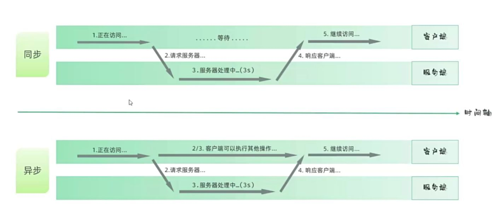
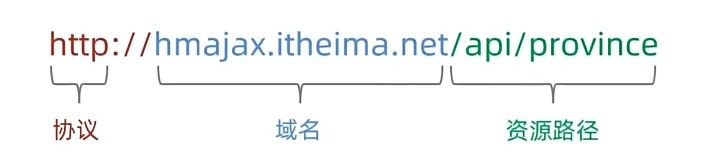
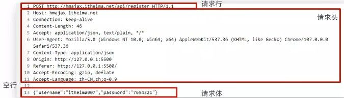
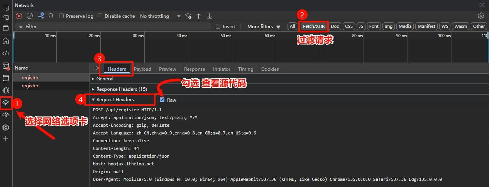
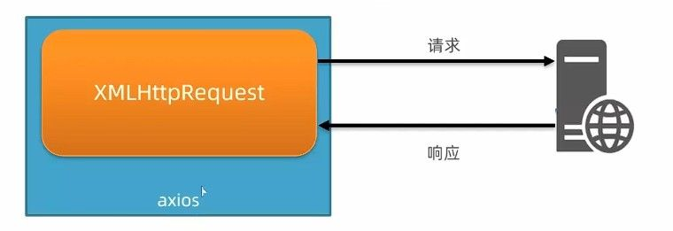
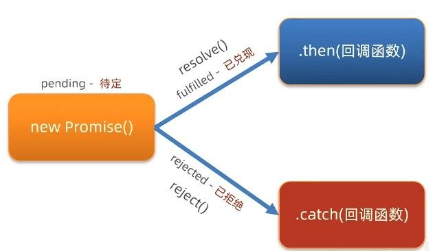
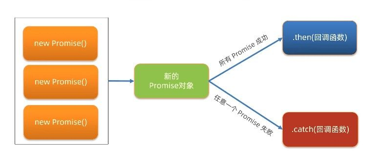
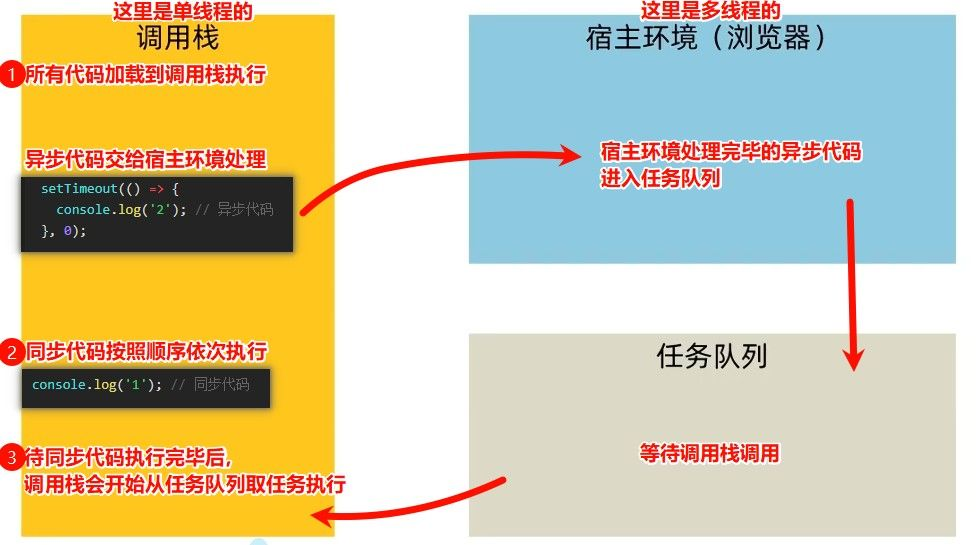
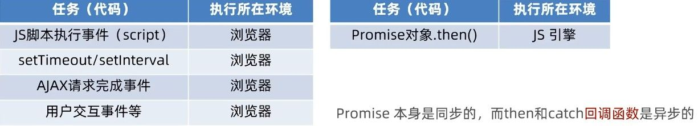
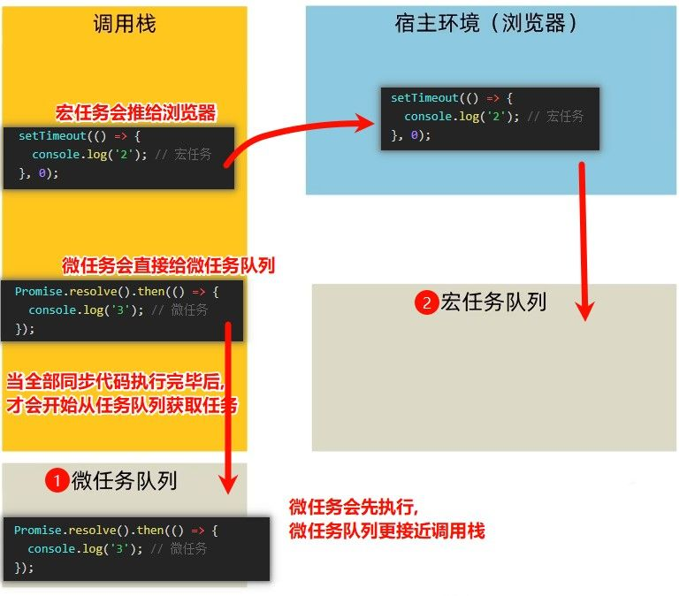

# Ajax 基础概念

Ajax 全称为 Asynchronous JavaScript And XML（**异步**的 JavaScript 和 XML）。

> XML 全称 Extensible Markup Language（可扩展标记语言），是一种用于存储和传输数据的格式。现在 Ajax 技术中更常用 JSON 格式代替 XML。

## Ajax 的核心优势

Ajax 技术主要有两大关键作用：

- **数据交换**：使前端能够与服务器进行数据交互，发送请求并获取服务器响应的数据
- **局部更新**：在**不刷新整个页面**的情况下，实现**部分网页内容的更新**，如搜索联想、用户名实时验证等



**传统同步请求**：当浏览器发送请求后，页面会被锁定，用户**只能等待服务器**响应完成后才能继续操作。

**Ajax 异步请求**：发送请求后，浏览器不会被锁定，用户**可以继续**在页面上进行其他操作，大大提升了用户体验。

# Axios - 现代化的 Ajax 请求工具

原生 Ajax 请求写法较为繁琐，Axios 作为一个流行的 HTTP 客户端库，极大简化了 Ajax 的使用。

> Axios 官网：[https://www.axios-http.cn](https://www.axios-http.cn)

## 快速入门示例

使用 Axios 发送请求只需简单两步：

1. 引入 Axios 库

```HTML
<script src="https://unpkg.com/axios/dist/axios.min.js"></script>
```

2. 使用 Axios 发送请求

```javascript
axios({
url: '目标资源地址'
}).then((result)=>{
	//对服务器返回的数据做后续处理
})
```

## URL

URL（统一文本定位符）是互联网中资源的标准地址，通常称为网址。

其核心结构由三部分组成：

- **协议**：规定浏览器和服务器之间传输数据的格式规则
- **域名**：标记服务器在互联网中的位置，用于提供一种对人类友好的方式来识别网络上的特定服务器
- **资源路径**：标记资源在服务器上的具体位置，通常以斜杠（/）分隔的文件夹和文件结构

三者协同定位网络资源的精确位置。



### URL 查询参数

浏览器提供给服务器的额外信息，让服务器返回浏览器想要的数据。
用于过滤、筛选或定制服务器返回的内容。

**语法格式**

```txt
http://example.com/path/resource?参数名1=值1&参数名2=值2
```

**在 Axios 中使用查询参数**

使用 Axios 提供的 params 选项可以轻松设置查询参数：

```javascript
axios({
  url: '目标资源地址',
  params: {
    参数名1: 值1,
    参数名2: 值2
  }
}).then(result => {
  // 对服务器返回的数据做后续处理
})
```

### `URLSearchParams` 工具类

`URLSearchParams` 是一个内置工具类，用于便捷地处理 URL 查询参数字符串。它提供了一系列方法来操作 URL 查询参数，无需手动拼接字符串。

```javascript
// 创建空的URLSearchParams对象
const params = new URLSearchParams()

// 添加参数
params.append('pname', '辽宁省')
params.append('cname', '大连市')

// 转换为查询字符串
console.log(params.toString()) // 输出: pname=辽宁省&cname=大连市

// 也可以从字符串创建
const params2 = new URLSearchParams('id=1&name=wolf')
console.log(params2.get('name')) // 输出: wolf
```

## 常用请求方法

HTTP 请求方法是客户端告诉服务器要执行什么操作的指令，而 Axios 则是在浏览器中优雅发送这些请求的工具。
不同请求方法代表不同的操作意图，选择正确的请求方法能让服务器更好理解我们的意图。

| 请求方法 | 主要用途           | 数据位置           |
| -------- | ------------------ | ------------------ |
| GET      | 获取/查询数据      | URL 参数中(params) |
| POST     | 提交/新增数据      | 请求体中(data)     |
| PUT      | 修改数据(全部更新) | 请求体中(data)     |
| DELETE   | 删除数据           | URL 参数或请求体   |
| PATCH    | 修改数据(部分更新) | 请求体中(data)     |

**GET vs POST**：最常用的两种方法，GET 用于获取数据，POST 用于提交数据

### GET 请求

数据放在 URL 中（通过 params 配置），GET 参数在 URL 中可见。
参数 受 URL 长度限制。

```javascript
axios({
  url: '目标资源地址',      // 必须，请求的URL
  method: '请求方法',      // 可选，默认为'get'
  params: { /* 参数 */ },  // GET请求的查询参数
})
```

```javascript
// 完整写法
axios({
  url: 'http://example.com/api/users',
  method: 'get',  // 可省略，因为默认就是GET
  params: {
    id: 1,
    name: 'wolf'
  }
}).then(result => {
  console.log(result.data)
})

// 简写方式
axios.get('http://example.com/api/users', {
  params: {
    id: 1,
    name: 'wolf'
  }
}).then(result => {
  console.log(result.data)
})
```

### POST 请求

数据放在请求体中（通过 data 配置），POST 数据不在 URL 中，相对更安全。
POST 理论上无长度限制。

```javascript
axios({
  url: '目标资源地址',      // 必须，请求的URL
  method: '请求方法',      // 可选，默认为'get'
  data: { /* 数据 */ }     // POST等请求的提交数据
})
```

```javascript
// 完整写法
axios({
  url: 'http://example.com/api/users',
  method: 'post',  // 必须指定为POST
  data: {          // 注意是data而不是params，会自动将对象转换为JSON字符串
    username: 'WolfGuard',
    password: '123456'
  }
}).then(result => {
  console.log(result.data)
})

// 简写方式
axios.post('http://example.com/api/users', {
  username: 'WolfGuard',
  password: '123456'
}).then(result => {
  console.log(result.data)
})
```

### PUT 请求

用于替换/更新资源的全部内容。PUT 请求假定资源的完整替换，如果没有提供某些字段，这些字段会被清除。

```javascript
axios({
  url: '目标资源地址',     // 必须，请求的URL
  method: 'put',          // 指定为PUT方法
  data: { /* 数据 */ }    // 将替换原有资源的完整数据
})
```

```javascript
// 完整写法
axios({
  url: 'http://example.com/api/users/1',
  method: 'put',
  data: {
    username: 'WolfGuard',
    email: 'wolf@forest.com',
    age: 5,
    // 需提供所有字段，未提供的字段将被删除
  }
}).then(result => {
  console.log(result.data)
})

// 简写方式
axios.put('http://example.com/api/users/1', {
  username: 'WolfGuard',
  email: 'wolf@forest.com',
  age: 5
}).then(result => {
  console.log(result.data)
})
```

### DELETE 请求

用于删除指定资源。DELETE 请求通常只需要指定要删除的资源 ID，但有时也可能需要在请求体中提供额外信息。

```javascript
axios({
  url: '目标资源地址',      // 必须，请求的URL
  method: 'delete',       // 指定为DELETE方法
  params: { /* 参数 */ },  // URL参数
  data: { /* 数据 */ }     // 可选，某些API可能需要请求体数据
})
```

```javascript
// 完整写法 - 通过URL参数
axios({
  url: 'http://example.com/api/users',
  method: 'delete',
  params: {
    id: 1
  }
}).then(result => {
  console.log('删除成功:', result.data)
})

// 简写方式
axios.delete('http://example.com/api/users/1').then(result => {
  console.log('删除成功:', result.data)
})

// 带请求体的DELETE (某些API需要)
axios.delete('http://example.com/api/users/1', {
  data: {
    reason: '用户请求删除',
    permanent: true
  }
}).then(result => {
  console.log('删除成功:', result.data)
})
```

### PATCH 请求

用于对资源进行部分更新。与 PUT 不同，PATCH 只更新提供的字段，不会影响其他字段。

```javascript
axios({
  url: '目标资源地址',     // 必须，请求的URL
  method: 'patch',        // 指定为PATCH方法
  data: { /* 数据 */ }    // 需要更新的字段
})
```

```javascript
// 完整写法
axios({
  url: 'http://example.com/api/users/1',
  method: 'patch',
  data: {
    email: 'newemail@forest.com'
    // 只提供需要更新的字段，其他字段保持不变
  }
}).then(result => {
  console.log(result.data)
})

// 简写方式
axios.patch('http://example.com/api/users/1', {
  email: 'newemail@forest.com'
}).then(result => {
  console.log(result.data)
})
```

## Axios 错误处理

网络请求并不总是成功的，错误处理是前端开发的重要环节。
Axios 基于 Promise，通过`.catch()`方法优雅地捕获各类错误，让我们能够为用户提供友好的错误提示，而不是让他们看到一堆吓人的技术报错。

**基本语法**

```javascript
axios({
  // 请求配置...
}).then(result => {
  // 处理成功情况
}).catch(error => {
  // 处理各种错误情况
  console.log(error)
})
```

**错误对象解析**

错误对象(error)包含丰富的信息：

- `error.response` - 服务器响应的详细信息
  - `error.response.status` - HTTP 状态码(如 404,500 等)
  - `error.response.data` - 服务器返回的数据(通常包含错误信息)
- `error.request` - 请求信息(在未收到响应时可用)
- `error.message` - 错误消息

**实战应用：注册案例**

```javascript
// 注册请求
axios({
  url: 'http://hmajax.itheima.net/api/register',
  method: 'post',
  data: {
    username: 'WolfGuard',
    password: '123456'
  }
}).then(result => {
  // 注册成功
  alert('注册成功！')
}).catch(error => {
  // 注册失败，提取并展示错误信息
  if (error.response) {
    // 服务器响应了但状态码表示出错
    alert(error.response.data.message || '注册失败，请稍后再试')
  } else if (error.request) {
    // 请求发出但没收到响应
    alert('网络异常，请检查您的网络连接')
  } else {
    // 请求配置有误
    alert('操作异常：' + error.message)
  }
})
```

**常见错误类型**

1. **服务器错误** (500 系列状态码)

   - 通常是服务器内部问题
   - 提示用户"系统繁忙，请稍后再试"

2. **客户端错误** (400 系列状态码)

   - 400: 请求参数有误
   - 401: 未授权(常见于登录失效)
   - 403: 禁止访问
   - 404: 资源不存在

# HTTP 通信解析

HTTP 协议是浏览器与服务器之间的"对话规则"，就像两国外交官交流必须遵循的礼仪。
请求报文是浏览器发出的"信件"，响应报文是服务器回复的"回信"，而接口文档则是这些"信件格式"的说明书。

理解这三者的关系，是掌握网络通信的关键基础。

## 请求报文

请求报文是浏览器按照 HTTP 协议规定的格式，发送给服务器的内容。
就像古代官府要求百姓上书必须按照特定格式写，否则不予受理。

请求报文包括：

1. **请求行**：包含三部分内容

   - 请求方法（GET/POST 等）
   - 请求 URL（目标地址）
   - HTTP 协议版本

2. **请求头**：以键值对形式提供附加信息

   - `Content-Type`：指明发送内容的类型
   - `User-Agent`：标识浏览器类型
   - `Authorization`：身份验证信息

3. **空行**：作为分隔符，表示请求头结束

4. **请求体**：实际发送的数据
   - GET 请求通常没有请求体
   - POST 等请求在此处放置提交的数据



**请求报文示例**

```text
POST /api/register HTTP/1.1
Host: hmajax.itheima.net
Content-Type: application/json
User-Agent: Mozilla/5.0 (Windows NT 10.0; Win64; x64)

{
  "username": "itheima007",
  "password": "7654321"
}
```

**错误排查技巧**

当登录失败时，可通过浏览器开发者工具检查：



## 响应报文

响应报文是服务器按照 HTTP 协议规定的格式，返回给浏览器的内容。和请求报文类似，也有类似的固定格式。

常见的 HTTP 状态码含义:

| 状态码范围 | 含义         | 典型例子                     |
| ---------- | ------------ | ---------------------------- |
| 1xx        | 信息性状态码 | 100 Continue                 |
| 2xx        | 成功         | 200 OK                       |
| 3xx        | 重定向       | 301 Moved Permanently        |
| 4xx        | 客户端错误   | 404 Not Found, 403 Forbidden |
| 5xx        | 服务器错误   | 500 Internal Server Error    |

响应报文包括：

1. **响应行**：包含三部分内容

   - HTTP 协议版本
   - 状态码
   - 状态描述

2. **响应头**：以键值对形式提供附加信息

   - `Content-Type`：返回内容的类型
   - `Content-Length`：返回内容的长度
   - `Set-Cookie`：设置 Cookie

3. **空行**：作为分隔符，表示响应头结束

4. **响应体**：服务器返回的实际数据
   - 可能是 HTML、JSON、图片等任何格式

**响应报文示例**

```
HTTP/1.1 200 OK
Content-Type: application/json
Date: Mon, 21 Apr 2025 15:49:38 GMT

{
  "message": "注册成功",
  "data": {
    "username": "itheima007"
  }
}
```

## 接口文档

接口文档是后端工程师提供的"通信说明书"，详细描述如何与服务器进行正确通信。
就像古代密信的使用说明，告诉你如何正确撰写才能被对方理解。

接口文档常见内容如下:

- 接口 URL：请求的地址
- 请求方法：GET/POST/PUT/DELETE 等
- 请求参数：需要传递什么数据
- 响应数据：返回什么格式的结果
- 错误码说明：不同错误状态的含义

# AJAX 原理 - XMLHttpRequest

XMLHttpRequest（简称 XHR）是浏览器提供的一个强大 API，是实现 Ajax 技术的**底层基础**。它允许网页应用在不刷新整个页面的情况下与服务器进行数据交换，实现真正的异步通信。

XHR 的核心作用在于：
它能在用户使用网页的同时，悄无声息地在后台与服务器交换数据，使网页可以局部更新，提供流畅的用户体验。这便是现代网页应用响应迅速的关键技术之一。



虽然现在我们有 Axios 等便捷工具，但了解 XHR 有助于理解这些工具的内部工作机制。

## XHR 使用步骤

XHR 的使用遵循一个清晰的流程，主要包含以下四个关键步骤：

1. **创建 XHR 对象**：实例化一个新的 XMLHttpRequest 对象

```javascript
// 1. 创建XMLHttpRequest对象
const xhr = new XMLHttpRequest();
```

2. **配置请求**：设置请求方法和目标 URL

```javascript
// 2. 配置请求方法和URL
xhr.open('GET', 'http://example.com/api/data');
```

3. **设置响应处理**：添加事件监听器处理服务器响应

```javascript
// 3. 监听loadend事件，处理响应结果
xhr.addEventListener('loadend', () => {
    // 服务器返回的数据在xhr.response中
    console.log(xhr.response);

    // 如果返回的是JSON格式，需要解析
    const data = JSON.parse(xhr.response);
    console.log(data);
});
```

4. **发送请求**：正式向服务器发起请求

```javascript
// 4. 发送请求
xhr.send();
```

**获取省份数据：**

```javascript
// 1. 创建XMLHttpRequest对象
const xhr = new XMLHttpRequest();

// 2. 配置请求方法和请求URL
xhr.open('GET', 'http://hmajax.itheima.net/api/province');

// 3. 监听loadend事件，接收响应结果
xhr.addEventListener('loadend', () => {
    console.log(xhr.response);
    const data = JSON.parse(xhr.response);
    console.log(data.list); // 输出省份列表
});

// 4. 发起请求
xhr.send();
```

## XHR 进阶

### 发送带查询参数的请求

查询参数是向服务器提供额外信息，让服务器返回我们想要的特定数据,。

**语法格式**

```txt
http://example.com/path/resource?参数名1=值1&参数名2=值2
```

**在 XHR 中使用查询参数**

```javascript
const xhr = new XMLHttpRequest();
xhr.open('GET', 'http://example.com/api/users?age=18&gender=male');
xhr.addEventListener('loadend', () => {
    console.log(xhr.response);
});
xhr.send();
```

### 发送 POST 请求提交数据

当需要向服务器提交数据时，通常使用 POST 请求，需要：

1. 设置请求头，告知服务器数据类型
2. 在请求体中发送数据

```javascript
const xhr = new XMLHttpRequest();
xhr.open('POST', 'http://example.com/api/register');

// 设置请求头，告诉服务器我们发送的是JSON格式数据
xhr.setRequestHeader('Content-Type', 'application/json');

xhr.addEventListener('loadend', () => {
    console.log(xhr.response);
});

// 准备数据并转为JSON字符串
const user = {
    username: 'wolfguard',
    password: '123456'
};
const userStr = JSON.stringify(user);

// 发送请求，携带数据
xhr.send(userStr);
```

### XHR 与 Axios 的关系

Axios 并非凭空而来，它是对原生 XHR 的封装与增强：

1. **底层实现**：Axios 在浏览器环境中内部使用的就是 XMLHttpRequest 对象
2. **便利性提升**：Axios 简化了 XHR 复杂的配置过程，提供了更友好的 API
3. **功能增强**：Axios 添加了拦截器、取消请求等高级功能

学习 XHR 有助于深入理解 Axios 的工作原理，当 Axios 出现问题时，能够更轻松地排查和解决。

## promise


Promise 是 JavaScript 中处理异步操作的一种强大机制，它本质上是一个代表"未来将会有结果的承诺"的对象。
这个承诺最终会兑现（成功）或拒绝（失败），并且 Promise 会记录这个结果值。

**Promise 的 链式调用 能够避免 回调地狱：**

以前写法（回调地狱）：

```javascript
asyncOperation1(function(result1) {
    asyncOperation2(result1, function(result2) {
        asyncOperation3(result2, function(result3) {
            asyncOperation4(result3, function(result4) {
                // 代码向右不断缩进，形成"地狱"
            });
        });
    });
});
```

Promise 写法：

```javascript
asyncOperation1()
    .then(result1 => asyncOperation2(result1))
    .then(result2 => asyncOperation3(result2))
    .then(result3 => asyncOperation4(result3))
    .then(result4 => {
        // 处理最终结果
    })
    .catch(error => {
        // 统一处理任何步骤的错误
    });
```

### 三种状态

Promise 对象在其生命周期中会处于以下三种状态之一：



1. **待定（pending）**：初始状态，既未兑现也未拒绝，如同管家接到命令正在执行中
2. **已兑现（fulfilled）**：表示操作成功完成，相当于管家顺利完成了任务
3. **已拒绝（rejected）**：表示操作失败，如同管家遇到困难无法完成任务

**重要特性**：Promise 对象一旦状态变为已兑现或已拒绝，就永远保持该状态，不会再变化。这种不可变性保证了 Promise 结果的可靠性和一致性。

### 基本使用

使用 Promise 主要分为三个步骤：

1. **创建 Promise 对象**：定义要执行的异步任务
2. **执行异步任务并传递结果**：在合适的时机调用 resolve 或 reject
3. **接收并处理结果**：通过 then 和 catch 方法处理成功或失败的情况

```javascript
// 1.创建Promise对象
const p = new Promise((resolve, reject) => {
    // 2.执行异步任务并传递结果
    // 假设这是一个异步操作
    setTimeout(() => {
        const success = true; // 模拟操作结果

        if(success) {
            // 成功调用：resolve(值)触发then()执行
            resolve("任务成功完成！");
        } else {
            // 失败调用：reject(值)触发catch()执行
            reject("出现了一些问题！");
        }
    }, 1000);
});

// 3.接收结果
p.then(result => {
    // 成功的处理
    console.log("成功：", result);
}).catch(error => {
    // 失败的处理
    console.log("失败：", error);
});
```

### Promise 与 Axios 的关系

Axios 内部大量使用 Promise 来处理 HTTP 请求。当您使用 Axios 发送请求时，它会返回一个 Promise 对象，使您能够以简洁优雅的方式处理请求结果：

```javascript
// Axios返回Promise
axios.get('http://example.com/api/data')
    .then(response => {
        // 处理成功响应
        console.log(response.data);
    })
    .catch(error => {
        // 处理错误
        console.error('请求失败:', error);
    });
```

## Promise + XHR 的简易 Axios

使用 Promise 管理 XHR 请求省份列表，这是模拟 Axios 等工具内部实现原理的简化版：

```html
<!DOCTYPE html>
<html lang="en">

<head>
  <meta charset="UTF-8">
  <meta http-equiv="X-UA-Compatible" content="IE=edge">
  <meta name="viewport" content="width=device-width, initial-scale=1.0">
  <title>案例_使用Promise+XHR_获取省份列表</title>
</head>

<body>
  <p class="my-p">正在加载省份数据...</p>
  <script>
    // 1. 创建Promise对象 - 将异步操作封装在Promise构造函数中
    const p = new Promise((resolve, reject) => {
      // 2. 在Promise内部执行XMLHttpRequest请求
      const xhr = new XMLHttpRequest();
      xhr.open('GET', 'http://hmajax.itheima.net/api/province');

      // 监听loadend事件 - 处理请求完成的情况
      xhr.addEventListener('loadend', () => {
        // 3. 根据HTTP状态码判断请求是否成功
        // 2xx系列状态码表示成功的HTTP请求
        if (xhr.status >= 200 && xhr.status < 300) {
          // 成功时，调用resolve并传递解析后的数据
          const data = JSON.parse(xhr.response);
          resolve(data); // 将Promise状态改为fulfilled(已兑现)
        } else {
          // 失败时，调用reject并传递错误信息
          reject(new Error(`请求失败，状态码：${xhr.status}`));
        }
      });

      // 发送请求 - 启动XHR的异步通信过程
      xhr.send();
    });

    // 4. 使用Promise的链式调用处理结果
    p.then(result => {
      console.log('请求成功:', result);
      // 将省份列表显示在页面上
      document.querySelector('.my-p').innerHTML = `
        <span style="color: green;">✓ 加载成功!</span><br>
        <strong>中国省份列表:</strong><br>
        ${result.list.join('<br>')}
      `;
    }).catch(error => {
      // 使用Error对象可以获取错误信息和堆栈
      console.dir(error);
      // 向用户友好地展示错误信息
      document.querySelector('.my-p').innerHTML = `
        <span style="color: red;">✗ 加载失败!</span><br>
        <strong>错误信息:</strong> ${error.message}
      `;
    });
  </script>
</body>

</html>
```

这种模式是现代 Ajax 工具如 Axios 的核心实现原理，它将复杂的异步操作封装成 Promise，使开发者能以更清晰的链式调用方式处理异步结果，同时提供了统一的错误处理机制。

现在，让我们尝试封装一个简易版的 Axios 工具，体验现代化 HTTP 请求库的内部实现逻辑。

### 基础版本：封装 GET 请求

首先，我们实现一个支持基本 GET 请求的`myAxios`函数：

```javascript
// 封装简易axios函数 - 基础版
function myAxios(config) {
  return new Promise((resolve, reject) => {
    const xhr = new XMLHttpRequest()
    xhr.open('GET', config.url)

    xhr.addEventListener('loadend', () => {

      if (xhr.status >= 200 && xhr.status < 300) {
        resolve(JSON.parse(xhr.response))
      } else {
        reject(new Error(`请求失败，状态码：${xhr.status}`))
      }
    })

    xhr.send()
  })
}

// 使用示例
myAxios({
  url: 'http://hmajax.itheima.net/api/province'
}).then(result => {
  console.log('获取到省份数据：', result)
  document.querySelector('.province-list').innerHTML = result.list.join('<br>')
}).catch(error => {
  console.dir(error)
  alert('获取省份失败：' + error.message)
})
```

### 增强版本：支持查询参数

接下来，让我们升级`myAxios`函数，使其支持通过 params 选项传递查询参数：

```javascript
// 封装简易axios函数 - 支持查询参数
function myAxios(config) {
  return new Promise((resolve, reject) => {
    const xhr = new XMLHttpRequest()

    // 1. 处理查询参数
    let url = config.url
    if (config.params) {
      // 使用URLSearchParams构建查询字符串
      const searchParams = new URLSearchParams()
      // 遍历params对象，添加参数
      for (let key in config.params) {
        searchParams.append(key, config.params[key])
      }
      // 拼接URL
      url += '?' + searchParams.toString()
    }

    xhr.open('GET', url)

    xhr.addEventListener('loadend', () => {
      if (xhr.status >= 200 && xhr.status < 300) {
        resolve(JSON.parse(xhr.response))
      } else {
        reject(new Error(`请求失败，状态码：${xhr.status}`))
      }
    })

    xhr.send()
  })
}

// 使用示例 - 获取特定地区列表
myAxios({
  url: 'http://hmajax.itheima.net/api/area',
  params: {
    pname: '辽宁省',
    cname: '大连市'
  }
}).then(result => {
  console.log('获取到地区数据：', result)
  document.querySelector('.area-list').innerHTML = result.list.join('<br>')
}).catch(error => {
  console.dir(error)
  alert('获取地区失败：' + error.message)
})
```

### 完整版本：支持 POST 请求和请求体数据

最后，我们进一步增强`myAxios`函数，使其支持不同请求方法和请求体数据：

```javascript
// 封装简易axios函数 - 完整版
function myAxios(config) {
  return new Promise((resolve, reject) => {
    const xhr = new XMLHttpRequest()

    let url = config.url
    if (config.params) {
      const searchParams = new URLSearchParams()
      for (let key in config.params) {
        searchParams.append(key, config.params[key])
      }
      url += '?' + searchParams.toString()
    }

    // 配置请求方法和URL
    const method = (config.method || 'GET').toUpperCase()
    xhr.open(method, url)

    xhr.addEventListener('loadend', () => {
      if (xhr.status >= 200 && xhr.status < 300) {
        resolve(JSON.parse(xhr.response))
      } else {
        reject(new Error(`请求失败，状态码：${xhr.status}`))
      }
    })

    // 处理请求体数据
    let body = null
    if (config.data) {
      // 设置请求头，指定内容类型为JSON
      xhr.setRequestHeader('Content-Type', 'application/json')
      // 将数据对象转为JSON字符串
      body = JSON.stringify(config.data)
    }

    xhr.send(body)
  })
}

// 使用示例 - 用户注册
myAxios({
  url: 'http://hmajax.itheima.net/api/register',
  method: 'POST',
  data: {
    username: 'wolfguard',
    password: '123456'
  }
}).then(result => {
  console.log('注册成功：', result)
  alert('注册成功！')
}).catch(error => {
  console.dir(error)
  alert('注册失败：' + error.message)
})
```

通过了解并手动实现这些功能，我们可以更深入地理解 Axios 等第三方库的工作原理，这有助于在实际开发中更好地使用这些工具，并在遇到问题时能够快速定位和解决。

# 回调地狱

在处理多个相互依赖的异步操作时，我们会遇到两种组织代码的方式：回调地狱和 Promise 链式调用。理解它们的区别对编写高质量的异步代码至关重要。

以获取省市区级联数据为例，必须先选择省份，才能知道有哪些城市。
在处理**数据依赖关系**的异步操作时，后续操作必须等待前一个操作的结果才能进行：

1. 获取城市列表 → 必须先知道是哪个省份
2. 获取区县列表 → 必须先知道是哪个省份和哪个城市

这种依赖关系决定了我们必须按顺序处理这些异步操作，而不能并行处理。

### 回调地狱

回调地狱（Callback Hell）是指在异步操作中，为了保证执行顺序而大量嵌套回调函数的现象。
回调地狱的写法如下：

```javascript
// 回调地狱示例 - 获取省市区数据
axios({url: 'http://hmajax.itheima.net/api/province'}).then(result => {
  const pname = result.data.list[0]
  document.querySelector('.province').innerHTML = pname

  // 嵌套第一层 - 获取城市数据
  axios({url: 'http://hmajax.itheima.net/api/city', params: { pname }}).then(result => {
    const cname = result.data.list[0]
    document.querySelector('.city').innerHTML = cname

    // 嵌套第二层 - 获取地区数据
    axios({url: 'http://hmajax.itheima.net/api/area', params: { pname, cname }}).then(result => {
      console.log(result)
      const areaName = result.data.list[0]
      document.querySelector('.area').innerHTML = areaName
    })
  })
}).catch(error => {
  console.dir(error)
})
```

**回调地狱的问题**

- **可读性差**：代码向右不断缩进，形成"金字塔"结构，难以阅读和理解
- **难以维护**：修改中间某一环节可能影响整个调用链
- **错误处理困难**：每层回调都需要单独处理错误，容易遗漏
- **代码耦合严重**：各个操作紧密嵌套，难以分离和复用

### Promise 链式调用

Promise 链式调用是解决回调地狱的有效方式，它将嵌套结构转变为线性结构，使代码更加清晰和易于维护。

Promise 链式调用的核心是**每个`.then()`方法都返回一个新的 Promise 对象**。这样就能将多个异步操作串联起来。就像是一条生产传送带，每道工序必须等待前一道工序完成并接收其结果，才能开始自己的加工。

```javascript
// 链式调用基本结构
第一个Promise对象
  .then(第一个任务的处理函数) // 返回新的Promise
  .then(第二个任务的处理函数) // 返回新的Promise
  .then(第三个任务的处理函数) // 返回新的Promise
  .catch(统一错误处理函数)     // 捕获链上任何错误
```

将上面的回调地狱示例改写为 Promise 链式调用：

```javascript
// Promise链式调用示例 - 获取省市区数据
// 1. 获取省份数据
axios({url: 'http://hmajax.itheima.net/api/province'})
  .then(result => {
    // 处理省份数据
    const pname = result.data.list[0]
    document.querySelector('.province').innerHTML = pname

    // 返回获取城市的Promise，而不是嵌套
    return axios({url: 'http://hmajax.itheima.net/api/city', params: { pname }})
  })
  .then(result => {
    // 处理城市数据
    const cname = result.data.list[0]
    document.querySelector('.city').innerHTML = cname

    // 从请求配置中获取省份名称
    const pname = result.config.params.pname

    // 返回获取地区的Promise
    return axios({url: 'http://hmajax.itheima.net/api/area', params: { pname, cname }})
  })
  .then(result => {
    // 处理地区数据
    const areaName = result.data.list[0]
    document.querySelector('.area').innerHTML = areaName
  })
  .catch(error => {
    // 统一错误处理
    console.dir(error)
    alert('数据获取失败：' + error.message)
  })
```

**Promise 链式调用的优势**

1. `.then()`的返回值会传递给下一个`.then()`的回调函数作为参数
2. 如果`.then()`返回的是 Promise 对象，下一个`.then()`会等待这个 Promise 完成
3. `.catch()`可以捕获链上任何一个环节的错误

Promise 链使代码按照执行逻辑从上到下排列，避免了回调地狱的多层嵌套。
通过 Promise 链式调用，我们可以将复杂的异步操作组织成清晰、易维护的线性结构，显著提升代码质量。

### async 和 await

async 和 await 是 ES2017 引入的新语法，是对 Promise 链式调用的进一步优化，让异步代码写起来更像同步代码，更加简洁和易读。

**async 函数**

是一种特殊的函数，它总是返回一个 Promise 对象，即使函数体内没有显式地使用 Promise。

```javascript
// 普通函数
function normal() {
  return 'Hello';  // 返回普通值
}

// async函数
async function asyncFn() {
  return 'World';  // 自动包装为Promise.resolve('World')
}

console.log(normal());  // 输出: Hello
console.log(asyncFn()); // 输出: Promise {<fulfilled>: "World"}

// 需要通过then获取async函数返回值
asyncFn().then(result => {
  console.log(result);  // 输出: World
});
```

**await 关键字**

**只能**在 async 函数内部使用，它会暂停当前 async 函数的执行，等待 Promise 解决，然后继续执行函数并返回结果。
await 只能在 async 函数内部使用，否则会报语法错误。

```javascript
// await基本用法
async function example() {
  console.log('开始');

  // await会暂停函数执行，等待Promise完成
  const result = await new Promise(resolve => {
    setTimeout(() => {
      resolve('完成');
    }, 1000);
  });

  console.log(result);  // 1秒后输出: 完成
  console.log('结束');
}

example();
// 输出顺序:
// 开始
// (等待1秒)
// 完成
// 结束
```

**使用 async/await 重写 Promise 链**

async/await 让我们可以使用更为直观的同步代码风格来编写异步代码，尤其适合于有多个依赖操作的场景。

```javascript
// async/await写法获取省市区数据
async function getProvinceAndCities() {
  try {
    // 获取省份
    const provinceResult = await axios({url: 'http://hmajax.itheima.net/api/province'});
    const pname = provinceResult.data.list[0];
    document.querySelector('.province').innerHTML = pname;

    // 获取城市
    const cityResult = await axios({url: 'http://hmajax.itheima.net/api/city', params: { pname }});
    const cname = cityResult.data.list[0];
    document.querySelector('.city').innerHTML = cname;

    // 获取地区
    const areaResult = await axios({url: 'http://hmajax.itheima.net/api/area', params: { pname, cname }});
    const areaName = areaResult.data.list[0];
    document.querySelector('.area').innerHTML = areaName;
  } catch (error) {
    // 统一错误处理
    console.dir(error);
    alert('数据获取失败：' + error.message);
  }
}

// 调用async函数
getProvinceAndCities();
```

async/await 是现代 JavaScript 异步编程的最佳实践，它让复杂的异步逻辑变得更加清晰和易于维护，是处理复杂异步操作的首选方式。

### Promise.all

是一个静态方法，用于并行执行多个 Promise，等待所有 Promise 都成功完成（或其中一个失败），然后统一处理结果。

Promise.all 接收一个可迭代对象（通常是数组）作为参数，返回一个新的 Promise：

- 当所有 Promise 都成功时，返回所有结果组成的数组
- 当任何一个 Promise 失败时，整个 Promise.all 立即失败，并返回第一个失败的原因



**语法**：

```javascript
Promise.all([promise1, promise2, ...])
  .then(results => {
    // results是一个数组，包含所有promise的结果
    // 结果的顺序与promise数组的顺序一致
  })
  .catch(error => {
    // 任何一个promise失败都会执行这里
  });
```

**使用场景**：当需要同时获取多个请求的结果，且后续操作依赖于所有请求都完成时。
下面通过获取多个城市的天气信息，展示 Promise.all 的实际应用：

**方式一：使用 Promise 链式调用**

```javascript
// 多城市天气查询 - Promise链式调用版
// 1. 定义城市编码对象，方便管理和扩展
const cities = {
  '北京': '110100',
  '上海': '310100',
  '广州': '440100',
  '深圳': '440300'
};

// 2. 创建Promise数组 - 每个Promise负责获取一个城市的天气
const weatherPromises = Object.entries(cities).map(([cityName, cityCode]) => {
  // 返回获取该城市天气的Promise对象
  return axios({
    url: 'http://hmajax.itheima.net/api/weather',
    params: { city: cityCode }
  });
});

// 3. 使用Promise.all合并多个Promise - 并行执行所有请求
Promise.all(weatherPromises)
  .then(results => {
    // 4. 处理结果数组(按请求顺序返回) - 提取每个城市的天气信息
    const htmlStr = results.map((result, index) => {
      // 获取城市名和天气数据
      const cityName = Object.keys(cities)[index];
      const weatherData = result.data.data;
      // 生成HTML列表项
      return `<li>${cityName}(${weatherData.area}): ${weatherData.weather}, ${weatherData.temperature}℃</li>`;
    }).join(''); // 合并所有列表项

    // 5. 更新页面显示
    document.querySelector('.my-ul').innerHTML = htmlStr;
  })
  .catch(error => {
    // 6. 统一错误处理 - 任何一个请求失败都会进入这里
    console.dir(error);
    document.querySelector('.my-ul').innerHTML = `<li style="color:red">获取天气信息失败: ${error.message}</li>`;
  });
```

**方式二：使用 async/await**

```javascript
// 多城市天气查询 - async/await版
// 包装在立即执行的异步函数中
(async function() {
  try {
    // 1. 定义城市编码对象，方便管理和扩展
    const cities = {
      '北京': '110100',
      '上海': '310100',
      '广州': '440100',
      '深圳': '440300'
    };

    // 2. 创建Promise数组 - 每个Promise负责获取一个城市的天气
    const weatherPromises = Object.entries(cities).map(([cityName, cityCode]) => {
      // 返回获取该城市天气的Promise对象
      return axios({
        url: 'http://hmajax.itheima.net/api/weather',
        params: { city: cityCode }
      });
    });

    // 3. 使用await等待Promise.all完成 - 并行执行所有请求
    // 直接获取结果数组，无需then回调
    const results = await Promise.all(weatherPromises);

    // 4. 处理结果数组 - 提取每个城市的天气信息
    const htmlStr = results.map((result, index) => {
      // 获取城市名和天气数据
      const cityName = Object.keys(cities)[index];
      const weatherData = result.data.data;
      // 生成HTML列表项
      return `<li>${cityName}(${weatherData.area}): ${weatherData.weather}, ${weatherData.temperature}℃</li>`;
    }).join(''); // 合并所有列表项

    // 5. 更新页面显示
    document.querySelector('.my-ul').innerHTML = htmlStr;

  } catch (error) {
    // 6. 使用try/catch统一处理错误 - 更简洁直观
    console.dir(error);
    document.querySelector('.my-ul').innerHTML = `<li style="color:red">获取天气信息失败: ${error.message}</li>`;
  }
})(); // 立即执行
```

无论使用哪种方式，Promise.all 都能显著提高多个独立请求的性能，因为它们是并行执行的。

1. **失败即终止**：任何一个 Promise 失败，整个 Promise.all 都会立即失败
2. **结果顺序**：返回的结果数组与输入的 Promise 数组顺序一致，与 Promise 完成的时间无关
3. **错误处理**：建议始终添加 catch 以处理可能的错误
4. **空数组**：如果传入空数组，Promise.all 会立即成功完成

Promise.all 是处理并行异步操作的强大工具，合理使用可以显著提高应用程序的性能和响应速度。

# 同步与异步

在深入理解前端的异步交互机制前，我们需要先明确同步与异步的基本概念。这是理解 JavaScript 如何处理任务的基础。

**同步(Synchronous)编程**：代码按照书写顺序一行一行执行，前一个任务完成后才会执行下一个任务。就像是在餐厅点餐，你必须等待前一位客人点完餐，才能轮到你点餐。

**异步(Asynchronous)编程**：主线程不必等待耗时操作完成，而是继续执行后续代码，当耗时操作完成后，通过回调函数或其他机制处理结果。就像餐厅服务员不会站在厨房等待你的菜做好，而是去服务其他客人，菜做好后再通知你。

```javascript
// 同步代码示例
console.log('开始');
function 同步任务() {
  for(let i = 0; i < 1000000000; i++) {} // 耗时操作
  return '同步任务完成';
}
const result = 同步任务();
console.log(result);
console.log('结束');

// 输出顺序：
// 开始
// 同步任务完成
// 结束
```

```javascript
// 异步代码示例
console.log('开始');
setTimeout(function() {
  console.log('异步任务完成');
}, 1000);
console.log('结束');

// 输出顺序：
// 开始
// 结束
// (1秒后)
// 异步任务完成
```

**常见的异步操作**

JavaScript 中常见的异步操作包括：

1. **定时器**：setTimeout, setInterval
2. **网络请求**：Ajax, Fetch API, Axios
3. **事件监听**：addEventListener
4. **Promise**：then, catch, finally
5. **async/await**：基于 Promise 的语法糖

# 事件循环

JavaScript 是单线程语言，这意味着它一次只能执行一个任务。那么，JavaScript 如何处理多个任务，特别是那些耗时的异步操作呢？答案就是事件循环(Event Loop)机制。

**事件循环的工作原理**

事件循环是 JavaScript 引擎处理异步操作的核心机制。它主要由以下几个部分组成：

1. **调用栈(Call Stack)**：用于跟踪正在执行的函数
2. **Web APIs**：由浏览器提供的 API，如 DOM 操作、AJAX 请求、定时器等
3. **任务队列(Task Queue)**：也称为宏任务队列(Macrotask Queue)，由浏览器环境执行的异步代码

事件循环的基本工作流程如下：

1. 执行调用栈中的所有同步代码
2. 检查任务队列，执行所有任务直到队列清空

```javascript
console.log('1'); // 同步代码

setTimeout(() => {
  console.log('2'); // 异步代码
}, 0);

console.log('3'); // 同步代码

// 输出顺序：1, 3, 2
```



### 宏任务与微任务

在任务队列中的异步任务被分为两类：

- 宏任务：由浏览器环境执行的异步代码
- 微任务：由 JS 引擎环境执行的异步代码

这让 JS 引擎也可以发起异步任务。



**微任务总是在宏任务之间执行**。当一个宏任务执行完毕，JavaScript 引擎会先清空微任务队列，然后再执行下一个宏任务。

```javascript
console.log('1'); // 同步代码

setTimeout(() => {
  console.log('2'); // 宏任务
}, 0);

Promise.resolve().then(() => {
  console.log('3'); // 微任务
});

console.log('4'); // 同步代码

// 输出顺序：1, 4, 3, 2
```



事件循环的精确流程是：

1. 执行同步代码，直到调用栈清空
2. 检查微任务队列，执行所有微任务直到微任务队列清空
3. 取出一个宏任务执行
4. 再次检查微任务队列，执行所有微任务
5. 循环步骤 3 和 4

事件循环是理解 JavaScript 异步编程的基础：

```javascript
console.log('开始');

setTimeout(() => {
  console.log('定时器回调');
}, 0);

Promise.resolve().then(() => {
  console.log('Promise回调');
});

console.log('结束');

// 输出顺序：
// 开始
// 结束
// Promise回调
// 定时器回调
```

尽管 setTimeout 设置的延迟为 0 毫秒，但由于事件循环的机制，Promise 回调(微任务)会先于 setTimeout 回调(宏任务)执行。

现在我们可以理解为什么 Promise 和 async/await 能够改善异步编程体验：

- **Promise 链**利用了微任务的特性，保证了.then()回调的执行顺序，避免了回调地狱
- **async/await**建立在 Promise 之上，通过暂停函数执行等待 Promise 完成，让异步代码看起来像同步代码，但其内部依然遵循事件循环的规则

```javascript
async function example() {
  console.log('1');
  await Promise.resolve();
  // 下面的代码相当于放入微任务队列
  console.log('2');
}

example();
console.log('3');

// 输出顺序：1, 3, 2
```

在上面的例子中，await 后面的代码实际上被转换为 Promise.then()回调，因此作为微任务在同步代码之后执行。

通过掌握同步异步编程模型和事件循环机制，我们能更好地理解和应用 Promise、async/await 等现代 JavaScript 异步编程技术，编写出高效、可维护的前端代码。
