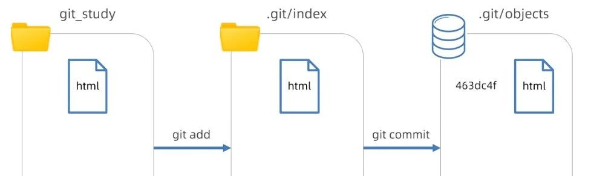
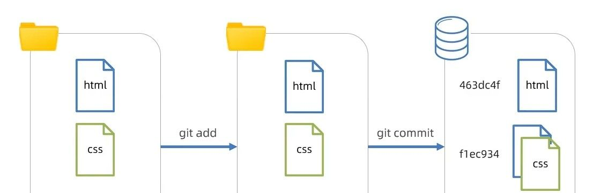
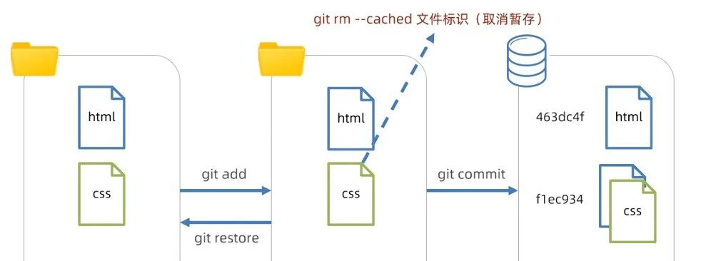
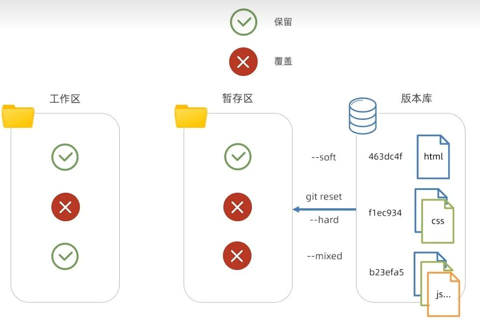
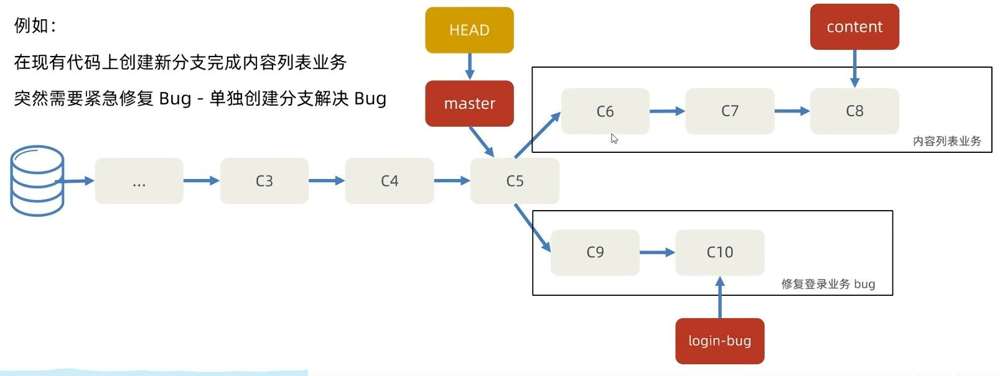

在我们还没用 Git 之前，为了减少改坏代码的风险，最直接的方式就是把整个项目文件夹整体复制一份，然后在新副本里试着改 —— 这是最原始的“版本备份”思路。


Git 做的，就是把这种“复制备份行为”变成一套完整、精准、可穿越历史的版本管理机制。

Git 是目前最流行的**分布式版本控制系统**，能够记录一个项目从开始到现在的每一次变化。它是由 Linux 之父 Linus Torvalds 开发，用来解决 Linux 内核这种大型协作工程的版本问题。

到官网下载安装，双击安装下一步即可。  
安装完之后，在任意目录右键菜单出现 Git Bash，说明安装成功。

## 初次配置

第一次使用 Git 时，需要先告诉 Git「提交记录是谁写的」。这属于全局配置，只需要设置一次即可。

**设置用户名和邮箱（全局）**

```bash
git config --global user.name "你的名字"
git config --global user.email "你的邮箱"
```

这里的 `user.name` 与 `user.email` 并不是账号注册绑定信息，Git 只是用它来标记每次提交是谁做的。  
一般建议填写你用于平台注册的邮箱，便于后续协作识别。

**查看配置内容**

```bash
git config --list
git config --global --list
```

如果能看到刚刚设置的用户名与邮箱，说明基础配置成功。

## Git 仓库

在使用 Git 管理代码之前，我们要先理解 Git 中的两个仓库存放位置：

- **本地仓库**：存放在自己电脑，本地开发、修改、提交都发生在这里
- **远程仓库**：存放在远程服务器（GitHub / Gitee 等），用于共享与协作

Git 的版本管理，本质就是「本地做改动」→「确认没问题」→「同步到远程」。



掌握 Git 的核心在于理解这三个区域，它们会在整个 Git 流程中持续出现：

1. **工作目录（Working Directory）**  
   你真正写代码的地方，未提交、未暂存的修改都发生在这里。
2. **暂存区（Staging Area）**  
   用于临时存放即将提交的变更，相当于一个「待提交清单」。
3. **版本库（Repository）**  
   已提交、已经确认的正式历史记录，都保存在 `.git` 目录下，属于永久存档。

> `.git` 这个隐藏目录，就是 Git 的核心数据库，里面包含版本记录、提交历史、对象内容等。

在 Git 的视角里，一个文件能够处于不同状态之中：

- **未跟踪(`U`标注)**：新文件，Git 还不认识它们
- **已跟踪**：Git 已经认识的文件



# 本地仓库操作

在本地开发阶段，Git 的操作本质就是三件事：

> **修改代码 → 暂存改动(add) → 提交版本(commit)**

### 将改动加入暂存区

```bash
git add 文件名        # 添加单个文件
git add .             # 添加全部改动文件
```

暂存区的作用是“先集中准备好要提交的内容”。只有进入暂存区的改动，在 commit 时才会被写进版本历史。

### 查看当前工作状态

```bash
git status
```

Git 会根据文件状态显示不同标记：

- `M`：文件已修改但未进入暂存区
- 已暂存（绿色）：已进入暂存区等待提交
- 已提交：已经写进版本库



若暂存区内容需要撤回或重新整理：

```bash
git reset 文件名          # 从暂存区撤回
git rm --cached 文件名    # 取消对某文件的版本管理
```

### 提交改动到本地仓库

```bash
git commit -m "提交说明"
```

推荐务必写 `-m`，直接用一句准确描述当前改动的含义。

如果刚提交完才发现备注信息没写好或漏了某文件，可以直接覆盖上一条提交：

```bash
git commit --amend
```

## 查看提交历史与回退版本

```bash
git log        # 查看完整提交历史
git reflog     # 查看历史操作简写记录（日常更常用）
```

`reflog` 里每一条前面都有短 hash，可以用于回退版本。

回退版本前记住：`soft` 是可逆、`hard` 是破坏性操作。

```bash
git reset --soft 提交ID   # 回退到该版本，但保留暂存区/工作区
git reset --hard 提交ID   # 丢弃该版本之后的所有改动
```



> 不确定、不完全确认安全的时候，不要轻易用 hard。

# 远程仓库操作

远程仓库用于代码同步、共享与协作。本地开发完成后，需要通过 push 将代码推送到远程仓库；从他人提交的版本中获取更新，则通过 pull。
在团队项目中，日常使用 Git 的节奏通常是这样的：

1. 来到工作环境先 `pull` 最新代码
2. 开发、调试功能
3. 改动完成 → `add` → `commit`
4. 当天离开前，将确认无误版本 `push` 到远程，让其他人能收到你的更新

## 关联远程仓库

若使用 `git clone` 克隆项目，本地仓库会自动绑定远程地址，默认名称为 `origin`：

```bash
git clone 仓库地址
```

> 仓库地址一般从 Github / Gitee 对应仓库页面右上角的 Clone 处复制获取。

若是自己本地用 `git init` 新建的仓库，则需要手动绑定远程地址：

```bash
git remote add origin 仓库地址
```

查看当前已关联的远程仓库：

```bash
git remote -v
```

绑定远程仓库（一般远程名都用 `origin`）：

```bash
git remote add origin 仓库地址
```

## 推送到远程

将本地提交的代码推送到远程仓库分支：

```bash
git push origin 分支名
```

首次 push 若提示身份验证，可以配置本地记住授权：

```bash
git config --global credential.helper store
```

推送时 Git 会比较远程与本地是否有冲突。  
原则是：**本地必须包含远程的提交，才允许推送。**

## 从远程拉取更新

```bash
git pull origin 分支名
```

日常开发一般建议：**先 pull，再开发，再 push**  
避免产生冲突与版本错位。

如果仓库不是 clone 得到，而是本地已有文件再关联远程，在 `pull` 时可能出现：

```
fatal: refusing to merge unrelated histories
```

这是因为两个仓库记录历史不同步导致，可以允许 Git 强制合并：

```bash
git pull origin 分支名 --allow-unrelated-histories
```

> 不推荐首次就这样用。更推荐从干净远程 clone。

# 忽略不需要的文件

在实际开发中，有许多文件不需要进入版本管理。例如：编译产物、日志、依赖包、甚至包含敏感信息的环境配置。

使用 `.gitignore` 文件可以告诉 Git 哪些路径、哪些文件类型不需要被跟踪。  
这样可以让仓库更干净、提交记录更纯粹，也避免把不该暴露的文件传上远程。

下例是常见的忽略内容示例：

```bash
# 忽略 node_modules 依赖目录
node_modules/

# 忽略所有 log 日志文件
*.log

# 忽略构建产物
/dist

# 忽略环境配置文件（通常包含敏感信息）
.env
```

`.gitignore` 应该在项目一开始就创建并维护，它是项目卫生管理的一部分。

# 分支管理

在项目开发中，分支是非常重要的机制。



它允许我们把某一个功能、实验、修复从主线代码中独立出来开发，使主分支保持稳定、可运行状态，而功能分支在独立空间里进行尝试与修改。

一个仓库可以拥有多个分支，每个分支都拥有自己的提交记录与独立演化路径。  
通过 `git init` 创建仓库后，默认就会创建一个主分支（过去默认是 `master`，现在更多工具默认使用 `main`）。

查看分支情况：

```bash
git branch       # 查看本地分支
git branch -r    # 查看远程分支
git branch -a    # 查看本地 + 远程所有分支
```

## 创建与切换分支

创建新分支（只在本地创建）：

```bash
git branch 分支名
```

切换到指定分支：

```bash
git switch 分支名
```

也可以一步完成「创建 + 切换」：

```bash
git switch -c 分支名
```

若要把新创建的分支推送到远程：

```bash
git push origin 分支名
```

## 标签操作

标签用于给某个特定提交打上标记。  
它常用于发布节点标记，例如：`v1.0`、`v1.1.3`、`release-2025-06` 等。

相比分支会持续演化，**标签代表的是一个确定的、固定的历史状态**。  
因此当项目有阶段性的版本完成，就可以创建一个标签，让之后需要回看该发布状态时能够迅速定位。

列出已有标签：

```bash
git tag
```

创建标签（在当前提交上打标记）：

```bash
git tag 标签名
```

创建的标签默认只存在于本地，如需同步到远程：

```bash
git push origin 标签名
```

如果想基于标签切出一个新的分支进行研究或修复：

```bash
git checkout -b 新分支名 标签名
```

Tag 的核心功能认知只有一句话：

> 分支在演化，Tag 是历史快照。
