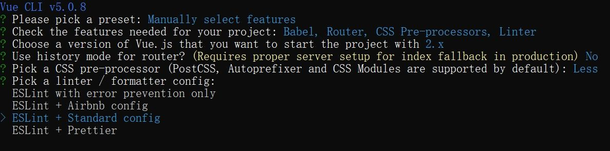

# Vuex 状态管理

Vuex 是 Vue 官方提供的状态管理工具，专为 Vue 应用程序开发的**状态管理模式**。它采用集中式存储管理应用的所有组件的状态，并以相应的规则保证状态以一种可预测的方式发生变化。

Vuex 主要解决以下场景的数据管理问题：

1. **多组件共享状态**：当某个状态需要在多个组件中使用时（如用户信息）
2. **组件间共同维护状态**：当多个组件需要共同维护和修改同一份数据时（如购物车）

> 相比于繁琐的组件传值（父传子、子传父、兄弟传值等），Vuex 为多组件数据共享提供了更简洁高效的解决方案。

## 自定义创建项目

随着我们掌握了 Vue Router、Axios 和 CSS 预处理器等工具，使用默认配置的基础脚手架项目已不能满足开发需求。我们可以通过 Vue CLI 自定义创建一个集成了路由、样式预处理和代码规范的项目架构。

**创建步骤**

使用 Vue CLI 创建自定义项目的过程如下：

1. **打开终端**，输入创建命令：

   ```bash
   vue create project-name
   ```

2. **选择自定义配置**：
   使用方向键选择最后一项 `Manually select features`，按回车确认。

   

3. **选择功能模块**：
   使用方向键移动，空格键选择/取消，为项目添加以下功能：

   - **Babel**：JavaScript 编译器，将 ES6+ 代码转换为向后兼容的版本
   - **Router**：Vue Router 路由管理
   - **CSS Pre-processors**：CSS 预处理器，如 LESS、SASS
   - **Linter / Formatter**：代码检查和格式化工具

   

4. **选择 Vue 版本**：
   选择熟悉的 Vue 2.x 版本，按回车确认。

   

5. **配置路由模式**：
   选择是否使用 history 模式，输入 `n` 选择默认的 hash 模式（URL 带 # 符号）。

   

6. **选择 CSS 预处理器**：
   推荐选择 Less，这是一个流行的 CSS 预处理器，提供变量、嵌套、混合等功能。

   

7. **选择代码规范**：
   推荐选择 `ESLint + Standard config`，这是目前最流行的无分号代码规范。

   

8. **选择代码检查方式**：
   选择 `Lint on save`，在保存文件时自动进行代码检查和修复。

   

9. **配置文件存放方式**：
   选择 `In dedicated config files`，将各种配置放在独立的文件中，而不是全部集中在 package.json 中。

   

10. **是否保存预设**：
    可以选择保存当前配置作为预设，方便下次使用。

    

完成上述步骤后，Vue CLI 会自动安装依赖并创建项目。安装完成后，可以通过以下命令启动项目：

```bash
cd project-name
npm run serve
```


通过这种方式创建的项目已经配置好了路由、样式预处理器和代码规范，可以直接进入开发阶段，显著提升开发效率。

## ESLint 与代码规范

Vue 脚手架创建项目时，可以选择添加 ESLint——这是一个 JavaScript 代码检查工具，帮助团队保持统一的代码风格。

**什么是代码规范？**

代码规范是写代码的"游戏规则"，比如：

- 赋值符号左右是否需要空格
- 语句结束是否要加分号
- 缩进用几个空格

老话说："没有规矩不成方圆"，团队协作需要统一的编码风格。

完整规则可查看：[JavaScript Standard Style](https://standardjs.com/rules-zhcn.html)

**ESLint 帮你守规矩**

有了 ESLint，不用死记硬背规则。它会像严厉但关心你的老师一样提醒你：

```javascript
// 如果你这样写
const app = new Vue({ el: "#app" });

// ESLint会提示：
// - 冒号后需要空格
// - 不允许使用分号
// - 右花括号前需要空格
```

只要配置了"Lint on save"，每次保存代码时 ESLint 就会自动检查并提示错误，甚至帮你自动修复一些问题！

**临时禁用 ESLint**

如果某些特殊情况确实需要违反规则，可以添加特殊注释暂时禁用 ESLint：

```javascript
// eslint-disable-next-line
const specialCase = "这行代码ESLint不会管";
```

## Vuex 的安装与配置

Vuex 的安装和初始化过程与 Vue Router 类似，通过以下步骤完成：

1. 安装 Vuex 依赖

注意版本对应关系：Vue 2.x 应使用 Vuex 3.x 版本

```bash
# 使用npm安装
npm install vuex@3

# 或使用yarn安装
yarn add vuex@3
```

> 可使用 `npm install vuex@3 --legacy-peer-deps` 忽略版本冲突，仅作练习

2. 创建 Store 目录结构

```
src/
├── components/    # 组件目录
├── store/         # Vuex目录
│   └── index.js   # Vuex主文件
└── main.js        # 入口文件
```

3. 配置 Store

在`store/index.js`中初始化 Vuex 仓库：

```javascript
// store/index.js
import Vue from 'vue'
import Vuex from 'vuex'

// 安装Vuex插件
Vue.use(Vuex)

// 创建Store实例
const store = new Vuex.Store({
  // 这里将添加Vuex的核心配置
})

// 导出Store
export default store
```

4. 在 Vue 实例中挂载 Store

在`main.js`中引入并挂载 Store：

```javascript
import Vue from 'vue'
import App from './App.vue'
import store from './store'  // 导入Vuex Store

Vue.config.productionTip = false

new Vue({
  render: h => h(App),
  store  // 将store挂载到Vue实例
}).$mount('#app')
```

5. 验证安装

在任意组件中，可以通过`this.$store`访问 Vuex 实例：

```javascript
export default {
  created() {
    console.log(this.$store)  // 如果不是undefined，说明Vuex已正确安装
  }
}
```

完成以上步骤后，我们成功搭建了 Vuex 的基础环境。接下来将进一步了解如何在这个环境中定义和使用状态。

# 状态管理基础架构

Vuex 采用 State + Mutations 的核心模式：State 作为数据容器存储状态，Mutations 作为唯一修改途径保证数据可追踪性。


## State - 状态管理

Vuex 的核心理念是集中式状态管理。在开始使用其他功能前，我们首先需要了解 State 这一基础概念。

State 是 Vuex 中的数据源，所有共享的数据都需要统一放到 Store 中的 State 对象里存储。

将数据放入 State 的主要优势是：

- 实现多组件间的数据共享
- 避免复杂的组件传值
- 集中管理，便于调试和追踪状态变化

### 配置示例

在`store/index.js`中通过`state`选项提供数据，类似于组件中的 data 函数：

```javascript
const store = new Vuex.Store({
  // state是所有组件共享的数据，类似于组件中的data
  state: {
    count: 100,
    title: '仓库标题'
  }
})
```

### 访问方式

State 中的数据可以通过多种方式在组件中访问，从简单到便捷依次为：

#### 直接访问

最基本的方式，通过 `$store.state` 直接获取

```javascript
   this.$store.state.count
```

#### 计算属性

为了提高可读性和代码组织，通常使用计算属性

```javascript
export default {
  computed: {
    count() {
      return this.$store.state.count
    }
  }
}
```

也可以使用辅助函数简化。

#### mapState 辅助函数

使用`mapState`辅助函数可以简化状态获取：

```javascript
// 使用前需要导入
import { mapState } from 'vuex'

export default {
  computed: {
    // 使用展开运算符将mapState返回的对象混入计算属性
    ...mapState(['count', 'title'])

    // 等价于
    // count() { return this.$store.state.count }
    // title() { return this.$store.state.title }
  }
}
```

> `mapState`返回的是一个对象，需要使用展开运算符，将这个对象的属性混入到 computed 对象中。
> 如果不用展开运算符，computed 将被整个替换。

## `Mutations` - 同步修改状态

Mutations 是 Vuex 中的数据变更工具，所有对共享数据的修改都需要统一通过 Store 中的 Mutations 方法来执行。

Vuex 遵循**单向数据流**原则，组件不能直接修改，State 数据的修改只能通过 Mutations 进行。

```javascript
// 错误方式（不要这样做）
this.$store.state.count++ // 虽然能修改成功，但不符合Vuex规范
```

**严格模式**

为了确保 state 只能通过 mutation 修改，可开启严格模式：

```javascript
const store = new Vuex.Store({
  strict: true, // 开启严格模式
  state: { /* ... */ },
  mutations: { /* ... */ }
})
```

> **注意**：严格模式会深度监测状态树，确保没有在 mutation 之外的状态变更。这会影响性能，生产环境应当关闭严格模式。

### 定义方式

在 store 中定义 mutations 对象，包含修改 state 的方法：

```javascript
const store = new Vuex.Store({
  state: {
    count: 0
  },

  mutations: {
	  // mutations中的方法第一个参数始终是state
    addCount(state) {
      state.count++
    }
  }
})
```

**传参**

mutations 可以接收额外参数（称为载荷/payload）：

```javascript
// 在store中定义
mutations: {
  addCount(state, n) {
    state.count += n
  }
}

// 在组件中调用并传参
methods: {
  increment() {
    this.$store.commit('addCount', 5) // 增加5
  }
}
```

mutations 无法直接接收多个参数，如需传递多个参数，可使用对象形式：

```javascript
// 对象形式的载荷
this.$store.commit('addCount', {
  num: 5,
  msg: '增加了5'
})

// mutation中接收
addCount(state, payload) {
  state.count += payload.num
  console.log(payload.msg)
}
```

### 调用方式

#### 直接提交

在组件中通过`commit`调用 mutations 方法：

```javascript
methods: {
  increment() {
    this.$store.commit('addCount')
  }
}
```

#### `mapMutations` 辅助函数

Vuex 提供了`mapMutations`来简化 mutations 的调用。它将 store 中的 mutations 方法映射到组件的 methods 中。

1. 在 store 中定义 mutation：

```javascript
// store/index.js
mutations: {
  subCount(state, n) {
    state.count -= n
  }
}
```

2. 在组件中映射 mutations：

```javascript
// 同样需要引入
import { mapMutations } from 'vuex'

export default {
  methods: {
    // 将mutations映射到当前组件的methods中
    ...mapMutations(['subCount'])

    // 调用时就像调用普通方法一样
    // this.subCount(10)
  }
}
```

如果想使用不同的方法名，可以使用对象形式：

```javascript
methods: {
  ...mapMutations({
    // 将this.decrease映射为this.$store.commit('subCount')
    decrease: 'subCount'
  })
}
```

**实际应用**

`mapMutations`的主要优势在于简化代码，特别是当组件需要频繁提交多个 mutation 时：

```javascript
export default {
  methods: {
    // 不使用mapMutations
    increment() {
      this.$store.commit('addCount')
    },
    decrement() {
      this.$store.commit('subCount')
    },

    // 使用mapMutations后
    ...mapMutations(['addCount', 'subCount'])
    // 直接调用：this.addCount()、this.subCount()
  }
}
```

> 对于简单的应用，直接使用`this.$store.commit()`更加明显易懂；但在大型应用中，`mapMutations`能显著减少重复代码，提高可维护性。

## Actions -  异步事务

Vuex 中的**mutations**必须是同步函数，这是为了方便调试和状态追踪。

但实际开发中，我们经常需要处理异步操作（如 API 请求）。**Actions**就是专门用来处理异步任务的，然后再通过提交 mutation 来修改状态。

### 定义方式

在 store 中定义 actions 对象，包含异步操作的方法：

```javascript
const store = new Vuex.Store({
  state: {
    count: 0
  },
  mutations: {
    changeCount(state, newCount) {
      state.count = newCount
    }
  },
  actions: {
    setAsyncCount(context, num) {
      // 模拟异步请求
      setTimeout(() => {
        // 在action中不能直接修改state，而是通过提交mutation来修改
        context.commit('changeCount', num)
      }, 1000)
    }
  }
})
```

context 是一个与 store 实例具有相同方法和属性的对象

### 调用方式

#### 直接分发

直接分发是基础调用方式，在组件中通过`dispatch`调用 actions 方法：

```javascript
methods: {
  updateCount() {
    // 触发actions中的方法
    this.$store.dispatch('setAsyncCount', 200)
  }
}
```

#### `mapActions` 辅助函数

使用`mapActions`辅助函数可以将 actions 映射到组件的 methods 中：

```javascript
import { mapActions } from 'vuex'

export default {
  methods: {
    // 将actions映射到当前组件的methods中
    ...mapActions(['setAsyncCount']),

    // 使用方法
    handleClick() {
      this.setAsyncCount(666) // 等价于this.$store.dispatch('setAsyncCount', 666)
    }
  }
}
```

**Actions 的工作流程如下**

1. 组件通过`this.$store.dispatch`分发 action
2. Action 中处理异步任务
3. Action 完成后，通过`context.commit`提交 mutation
4. Mutation 修改 state
5. 组件刷新

**实际应用场景**

Actions 最常见的应用场景是处理 API 请求：

```javascript
actions: {
  // 获取用户信息
  async getUserInfo(context) {
    try {
      // 发送请求获取用户数据
      const res = await axios.get('/api/user')

      // 请求成功后，提交mutation更新state
      context.commit('updateUserInfo', res.data)
    } catch (error) {
      console.error('获取用户信息失败', error)
    }
  }
}
```

## Getters -  派生状态

**`Getters` 计算属性**

Getters 是 Vuex 的计算属性，用来从 store 的 state 中派生出新的状态，适用于需要对原始状态进行处理的场景。

### 配置示例

在 store 中通过 getters 选项配置计算属性：

```javascript
const store = new Vuex.Store({
  state: {
    list: [1, 2, 3, 4, 5, 6, 7, 8, 9, 10]
  },
  getters: {
    // 同样的第一个参数固定是state
    filterList(state) {
      return state.list.filter(item => item > 5)
    },

    listCount(state) {
      return state.list.length
    },
  }
})
```

getters 必须有返回值

**Getters 传参**

Getters 本身不接受额外参数，但可以返回一个函数来实现：

```javascript
getters: {
  // 返回一个函数，以便接收参数
  getListById: (state) => (id) => {
    return state.list.find(item => item.id === id)
  }
}

// 在组件中调用
computed: {
  specialItem() {
    return this.$store.getters.getListById(42)
  }
}
```

### 访问方式

#### 直接访问

类似 state 可以通过 store 实例访问：

```vue
<template>
  <div>
    <!-- 在模板中直接使用 -->
    <p>过滤后的数组: {{ $store.getters.filterList }}</p>
    <p>过滤后的数量: {{ $store.getters.filteredCount }}</p>
  </div>
</template>

<script>
export default {
  methods: {
    showData() {
      // 在JavaScript中访问
      console.log(this.$store.getters.filterList)
    }
  }
}
</script>
```

#### mapGetters 辅助函数

`mapGetters`辅助函数可以将 store 中的 getters 映射到组件的计算属性中：

```javascript
import { mapGetters } from 'vuex'

export default {
  computed: {
    // 数组形式映射
    ...mapGetters(['filterList', 'listCount', 'filteredCount'])

    // 等价于:
    // filterList() { return this.$store.getters.filterList },
    // listCount() { return this.$store.getters.listCount },
    // filteredCount() { return this.$store.getters.filteredCount }
  },

  methods: {
    showFilteredData() {
      // 调用时无需再使用$store.getters前缀
      console.log(this.filterList)
    }
  }
}
```

Getters 主要用于对 state 做二次处理，避免在多个组件中重复相同的逻辑计算，提高代码复用性和可维护性。

# Module - 模块化

Vuex 采用单一状态树设计，所有（state）状态都集中在一个对象中。

当应用变得复杂时，这个状态树会变得臃肿，难以维护。模块化就像把领地分成多个区域，每个区域都有自己的管家，各司其职，让管理更加清晰高效。

**模块的基本结构**

每个模块都是一个独立的文件，包含自己的 state、mutations、actions 和 getters。模块需要开启命名空间（namespaced: true），这样才能确保模块的独立性。

```javascript
// store/modules/user.js
export default {
  namespaced: true,
  state () {
    return {
      list: []
    }
  },
  mutations: {},
  actions: {},
  getters: {}
}
```

在主 Store 中注册模块：

```javascript
// store/index.js
import user from './modules/user'

const store = new Vuex.Store({
  modules: {
    user
  }
})
```

## State 访问

虽然状态被分散到不同模块中，但子模块的状态仍然会挂载到根级别的 state 中，属性名就是模块名。

### 直接访问

通过 `$store.state.模块名.属性名` 的方式访问：

```javascript
this.$store.state.user.userInfo.name  // 'zs'
```

### 辅助函数

- 根级别映射：`mapState(['xxx'])`
- 子模块映射：`mapState('模块名', ['xxx'])` (需要开启命名空间)

```javascript
import { mapState } from 'vuex'

computed: {
  ...mapState('user', ['userInfo'])
}
```

## Getters 访问

### 直接访问

通过 `$store.getters['模块名/getter名']` 的方式访问：

```javascript
this.$store.getters['user/userAge']
```

### 辅助函数

- 根级别映射：`mapGetters(['xxx'])`
- 子模块映射：`mapGetters('模块名', ['xxx'])` (需要开启命名空间)

```javascript
import { mapGetters } from 'vuex'

computed: {
  ...mapGetters('user', ['userAge'])
}
```

## Mutations 调用

**重要说明**：默认情况下，模块中的 mutation 和 actions 会被挂载到全局。只有开启命名空间后，才会挂载到子模块中。

### 直接调用

通过 `$store.commit('模块名/mutation名', 参数)` 的方式调用：

```javascript
this.$store.commit('user/updateName', '狼人')
```

### 辅助函数

- 根级别映射：`mapMutations(['xxx'])`
- 子模块映射：`mapMutations('模块名', ['xxx'])` (需要开启命名空间)

```javascript
import { mapMutations } from 'vuex'

methods: {
  ...mapMutations('user', ['updateName'])
}
```

## Actions 调用

### 直接调用

通过 `$store.dispatch('模块名/action名', 参数)` 的方式调用：

```javascript
this.$store.dispatch('user/fetchUserInfo')
```

### 辅助函数

- 根级别映射：`mapActions(['xxx'])`
- 子模块映射：`mapActions('模块名', ['xxx'])` (需要开启命名空间)

```javascript
import { mapActions } from 'vuex'

methods: {
  ...mapActions('user', ['fetchUserInfo'])
}
```

## 模块内部的上下文

在模块内部的 actions 和 mutations 中，context 上下文默认指向当前模块：

- 在开启命名空间的模块中，`context.commit` 只会提交本模块的 mutation
- 如果需要访问全局内容，可以使用 `context.rootState` 和 `context.rootGetters`

这样的模块化设计让大型应用的状态管理变得更加清晰和可维护，每个模块都能独立管理自己的状态，同时又保持了与全局状态的连接。

# 搭建 json-server 后端环境

json-server 是一个快速搭建本地 REST API 的工具，非常适合前端开发时模拟后端接口。

**安装步骤**

1. **安装全局工具**

```bash
# 使用 yarn 安装
yarn global add json-server

# 或使用 npm 安装
npm i json-server -g
```

2. **创建数据目录**

   - 在项目根目录下创建 `db` 文件夹
   - 将准备好的 `index.json` 数据文件放入 `db` 文件夹

3. **启动服务**

```bash
# 进入 db 目录
cd db

# 启动服务
json-server index.json
```

4. **测试接口**
   - 打开浏览器访问 `http://localhost:3000/cart`
   - 如果能看到数据，说明环境搭建成功！

**小贴士**

- json-server 默认在 3000 端口运行
- 支持 RESTful API 的所有基本操作（GET、POST、PUT、DELETE）
- 数据会保存在 `index.json` 文件中，方便调试和修改

这样，我们就有了一个简单的后端环境，可以开始前端开发了！
