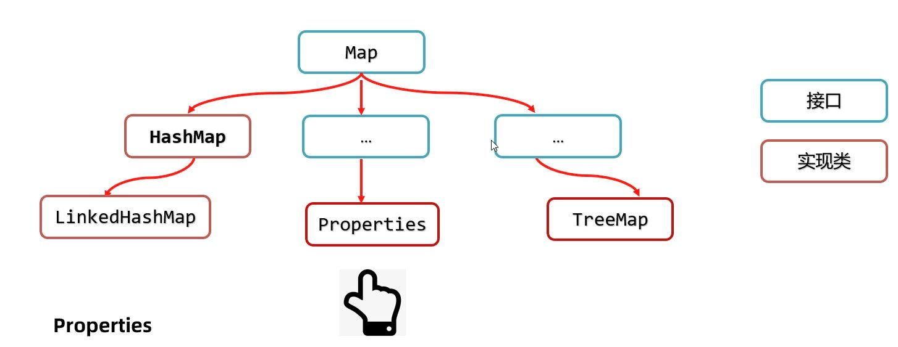
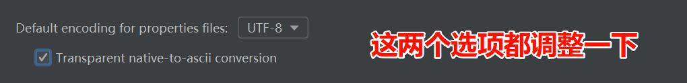
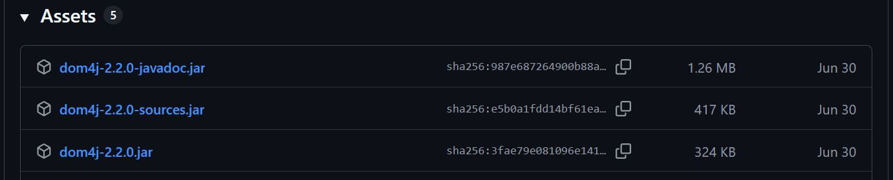

在开发中，最常见的文件就是 `.txt`。它的特点是**随意**：里面的内容想写什么就写什么，没有固定格式。

例如，我们想在一个 txt 文件里存一些用户的用户名和密码：

```txt
admin123456
wolfkingabc
zhangsan888888
```

看上去是存进去了，但问题也很明显：用户名和密码黏在一起，根本没法分辨哪里是用户名、哪里是密码。如果内容更多，读取和管理都会变得混乱。

为了让信息更清晰，我们需要一些“带规则”的文件，常见的特殊文件有以下两种：

- **properties 文件**：用来保存配置，格式轻量简单，每行都是键值对。
- **XML 文件**：用来保存复杂结构的数据，可以描述多种信息关系。

接下来，就分别看看这两类特殊文件的特点和用法。

# Properties

`.properties` 文件是一种**属性文件**，里面的内容都是 **键值对**：

- 每一行 `key=value`
- 键不能重复
- 后缀名一般是 `.properties`（叫 `.txt` 也行，只要内容格式符合规则）

```properties
# 用户名和密码配置
admin=123456
wolfking=howl666
zhangsan=888888
```

从形式上看，它就像一个 **Map 集合**，只不过 `Map` 在内存里，而 `.properties` 存在磁盘上。



在 Java 中，`Properties` 类专门用来表示这种文件。
它继承自 `Hashtable`，本质上就是一个键值对集合，但我们一般不会把它当作普通集合使用，而是借助它的核心作用： 读写属性文件中的内容。

### 构造器

用于先得到一个空容器，后面再把磁盘文件“装”进来。

```java
Properties props = new Properties();
```

此时容器是空的，这样，我们就能通过 `Properties` 对象来操作配置文件，而不是自己去一行行拆字符串。

# 读取

使用 `Properties` 读取属性文件里的键值对数据。

### `load` 加载文件

```java
props.load(new FileReader("src/users.properties"));
```

如果项目里仍出现中文乱码，可以尝试检查 IDEA：`Settings → File Encodings → Default encoding for properties files`。



（必要时可用字节流的 `load(InputStream)`，但读取中文更推荐 `Reader` 版本。）

### `getProperty` 取值

```java
String wolfPass = props.getProperty("wolfking");
```

`getProperty` 语义清晰，专用于属性文件的取值（底层还是基于 `Map`，但别混用 `get`）。

当然也可以用循环优化取值:

```java
for (String key : props.stringPropertyNames()) {
    System.out.println(key + " ==> " + props.getProperty(key));
}
```

`stringPropertyNames()` 返回所有键，配合 `getProperty()` 完成整份配置的遍历检查。

# 写入

能读就能够把内存中的键值对写回到属性文件里。

### `setProperty` 设置键值

```java
props.setProperty("wolfking", "howl666");
props.setProperty("alpha", "claw777");
props.setProperty("scout", "snow999");
```

`setProperty` 是面向属性文件的写法，比直接用 `put` 直观，也避免类型问题。

### `store` 持久化到磁盘

```java
props.store(
    new FileWriter("src/wolves.properties"),
    "wolves credentials"
);
```

这一步把容器里的键值对**写入文件**；第二个参数会生成一行注释（时间戳也会被写入）。  
写完后文件示例：

```
# wolves credentials
# Fri Aug 26 10:32:11 PST 2025
alpha=claw777
scout=snow999
wolfking=howl666
```

如果想保证编码一致，可用 `store(Writer, comments)`（推荐）而不是 `store(OutputStream, comments)`。

`store(...)` 是**覆盖写**常见场景。
如果需要“读 → 改 → 存”，流程是：

- `load(...)` → 把文件内容读进来。
- `setProperty(...)` → 修改或新增。
- `store(...)` → 覆盖写回去（底层用覆盖模式）。

虽然包装追加模式的管道可以让 `store` 追加写，但在实际使用中，**覆盖写 + 先读后改**更合理。

好 🐺，我帮你把 **XML 的第一部分（概念 + 特点 + 基本语法 + 示例 + 特殊字符/CDATA）** 梳理成你喜欢的风格：  
——流畅说明 → 小代码块 → 文字过渡。

# XML

XML，全称 Extensible Markup Language（可扩展标记语言），是一种通用的数据表示方式。  
它的本质是一种**数据格式**，适合存储复杂的数据结构和数据关系。

XML 常见用途除了存储复杂数据结构、系统配置文件，还能够用于网络数据传输（不过现在更多场景用 JSON，因为更轻量）。

和 `.properties` 不同，XML 的优势是可以自定义标签，把一组信息“包裹”起来，让数据之间的层次更清晰。

- 标签名（元素）可自定义，但必须正确嵌套。
- 必须有且只有一个**根标签**。
- 标签可以带**属性**，例如：`<user id="1">`。
- 文件后缀一般是 `.xml`。

```xml
<?xml version="1.0" encoding="UTF-8"?>
<!-- 用户信息 -->
<users>
    <user id="1">
        <name>猎风</name>
        <sex>雄</sex>
        <age>7</age>
        <hobby>嚎叫</hobby>
    </user>

    <user id="2">
        <name>雪牙</name>
        <sex>雌</sex>
        <age>5</age>
        <hobby>巡猎</hobby>
    </user>
</users>
```

一个 XML 文件通常以 **文档声明** 开头：

```xml
<?xml version="1.0" encoding="UTF-8"?>
<!-- 这是注释 -->
```

- `version` → XML 版本号（必须存在）。
- `encoding` → 文件编码。

紧接着是用户自定义的标签内容：

```xml
<users>
    <user id="1">
        <name>猎风</name>
        <sex>雄</sex>
        <age>7</age>
        <hobby>嚎叫</hobby>
    </user>

    <user id="2">
        <name>雪牙</name>
        <sex>雌</sex>
        <age>5</age>
        <hobby>巡猎</hobby>
    </user>
</users>
```

这里 `<users>` 是根标签，每个 `<user>` 是子元素。通过标签和属性，用户的信息被组织得清清楚楚。

## 特殊符号与 CDATA

有时内容里会出现特殊字符，比如 SQL 语句里的 `<`、`>`、`&`。  
在 XML 中，这些字符是保留字，必须转义：

| 原字符 | 转义写法 |
| ------ | -------- |
| `<`    | `&lt;`   |
| `>`    | `&gt;`   |
| `&`    | `&amp;`  |
| `'`    | `&apos;` |
| `"`    | `&quot;` |

例如：

```xml
<sql>select * from wolves where age &gt;= 3 &amp;&amp; age &lt;= 7</sql>
```

如果不想转义，也可以用 **CDATA 区**：

```xml
<sql><![CDATA[
    select * from wolves where age >= 3 && age <= 7
]]></sql>
```

CDATA 中的内容不会被解析，可以随意写。

# 读取

如果直接用原始 IO 去解析 XML，难度大、代码也会很繁琐。因此开发中通常用开源框架，最常见的就是 **Dom4j**。

Dom4j 的解析思想是 **文档对象模型（Document Object Model）**：  
先把整个 XML 文件读入内存，形成一个 `Document` 文档对象。这样我们就能像操作对象一样获取元素（`Element`）、属性（`Attribute`）、文本内容等。

## 准备工作

由于 dom4j 并不是 Java 官方提供的，所以我们需要[下载 dom4j](https://github.com/dom4j/dom4j/releases) 的 jar 包。



一般会提供三个文件：

- `dom4j-xxx.jar` → 主包，必须导入项目才能用，我们下载这个。
- `dom4j-xxx-sources.jar` → 源码，点进类里能看到作者写的原始代码。
- `dom4j-xxx-javadoc.jar` → 文档，查 API 的说明和用法。

接着把 jar 包放到项目 `lib` 文件夹，右键 → _Add as Library_。

## 构造器

Dom4j 提供了解析器 **`SAXReader`**，用来读取 XML。

```java
SAXReader saxReader = new SAXReader();
```

这是第一步：得到一个解析器对象。

假设我们有一个 `wolves.xml` 文件，内容如下：

```xml
<?xml version="1.0" encoding="UTF-8"?>
<users>
    <user id="1">
        <name>猎风</name>
        <sex>雄</sex>
        <age>7</age>
        <hobby>嚎叫</hobby>
    </user>

    <user id="2">
        <name>雪牙</name>
        <sex>雌</sex>
        <age>5</age>
        <hobby>巡猎</hobby>
    </user>
</users>
```

接下来我们就用 Dom4j 的 API 把这些内容解析出来。

## 常用方法

当我们得到了 `Document` 对象，就可以通过一系列方法来获取数据。

### `read` 读取文档

```java
Document document = saxReader.read("src/wolves.xml");
```

这里会把 `wolves.xml` 读成一个 `Document` 对象，内存里现在完整保存了整个 XML 文件的结构和内容。

### `getRootElement` 获取根元素

```java
Element root = document.getRootElement();
System.out.println(root.getName());
```

输出结果：

```
users
```

也就是我们 XML 文件的根标签名字。

### `element` 获取子元素

```java
Element firstUser = root.element("user");
System.out.println(firstUser.elementText("name"));
```

输出结果：

```
猎风
```

`element("xxx")` 返回的是第一个符合名字的子元素，这里拿到第一个 `<user>`，并取出里面 `<name>` 的文本。

如果想要获取多个子元素：

```java
List<Element> users = root.elements("user");

for (Element user : users) {
    System.out.println(user.getName());
}
```

输出结果：

```
user
user
```

`elements("user")` 会得到所有 `<user>` 标签，遍历时每个元素的标签名都是 `user`。如果要输出更有意义的内容，可以直接取内部字段：

```java
for (Element user : users) {
    System.out.println(user.elementText("name"));
}
```

输出结果：

```
猎风
雪牙
```

这样更直观。

### `attributeValue` 获取属性值

```java
String id = firstUser.attributeValue("id");
System.out.println("狼的编号：" + id);
```

输出结果：

```
狼的编号：1
```

用 `attributeValue("属性名")` 就能直接拿到属性的值。

### `elementText` 获取文本内容

```java
System.out.println(firstUser.elementText("hobby"));
```

输出结果：

```
嚎叫
```

`elementText("xxx")` 返回指定子元素的文本，相当于先获取子元素再调用 `getText()`。

# 写入（了解）

写 XML 的需求相对少一些。一般不会用 Dom4j 去写，而是**拼接字符串**再输出。

```java
StringBuilder sb = new StringBuilder();
sb.append("<?xml version=\"1.0\" encoding=\"UTF-8\"?>\r\n");
sb.append("<wolf>\r\n");
sb.append("\t<name>").append("荒原孤狼").append("</name>\r\n");
sb.append("\t<age>").append("7").append("</age>\r\n");
sb.append("\t<sex>").append("雄").append("</sex>\r\n");
sb.append("</wolf>\r\n");

PrintStream ps = new PrintStream("src/wolf.xml");
ps.println(sb.toString());
ps.close();
```

这样就能在 `wolf.xml` 文件中生成一只狼的配置数据。

# 限制书写

XML 的一个特点是**灵活**：标签名可以自己定义，嵌套方式也很自由。  
但是，如果一个项目已经规定了 XML 的格式，而有人写了另一种“随意风格”的 XML，那系统可能根本读不出来。

所以，XML 提供了 **约束文档** 来限制书写格式。  
常见的两种约束方式：

- **DTD（Document Type Definition）**：约束标签结构，但不约束数据类型。
- **Schema**：不仅能约束标签结构，还能限定数据类型，更加严格。

## DTD

DTD 文档的后缀是 `.dtd`，里面写的是标签的组织规则。它限制标签结构，但无法限制数据类型，适合简单场景。

1. 编写 DTD 文档

```dtd
<!ELEMENT 书架 (书+)>
<!ELEMENT 书 (书名, 作者, 售价)>
<!ELEMENT 书名 (#PCDATA)>
<!ELEMENT 作者 (#PCDATA)>
<!ELEMENT 售价 (#PCDATA)>
```

这里定义了：

- `<书架>` 下面必须有一个或多个 `<书>`。
- `<书>` 里面必须依次包含 `<书名>`、`<作者>`、`<售价>`。
- 每个标签里的内容都是普通文本（`#PCDATA`）。

2. 在 XML 中引入 DTD

```xml
<!DOCTYPE 书架 SYSTEM "data.dtd">

<书架>
    <书>
        <书名>从入门到跑路</书名>
        <作者>灰狼</作者>
        <售价>9.9</售价>
    </书>
</书架>
```

如果标签缺失、顺序错误，解析时就会报错。

但 DTD 的缺点是：**不能约束数据类型**（比如售价只能写成文本，不能严格定义为 `double`）。

## Schema

Schema 的后缀是 `.xsd`，比 DTD 更强大。它不仅能约束结构，还能定义数据类型。结构 + 类型都能限制，更强大，现代项目更常用。

1. 编写 Schema 文档

```xml
<?xml version="1.0" encoding="UTF-8"?>
<schema xmlns="http://www.w3.org/2001/XMLSchema"
        targetNamespace="http://www.itcast.cn"
        elementFormDefault="qualified">

    <element name="书架">
        <complexType>
            <sequence maxOccurs="unbounded">
                <element name="书">
                    <complexType>
                        <sequence>
                            <element name="书名" type="string"/>
                            <element name="作者" type="string"/>
                            <element name="售价" type="double"/>
                        </sequence>
                    </complexType>
                </element>
            </sequence>
        </complexType>
    </element>
</schema>
```

这里就明确规定了 `<售价>` 必须是 `double` 类型。

2. 在 XML 中引入 Schema

```xml
<?xml version="1.0" encoding="UTF-8"?>
<书架 xmlns="http://www.itcast.cn"
      xmlns:xsi="http://www.w3.org/2001/XMLSchema-instance"
      xsi:schemaLocation="http://www.itcast.cn data.xsd">

    <书>
        <书名>从入门到跑路</书名>
        <作者>灰狼</作者>
        <售价>9.9</售价>
    </书>

    <书>
        <书名>从删库到跑路</书名>
        <作者>雪牙</作者>
        <售价>19.98</售价>
    </书>
</书架>
```

这里 `xmlns` 和 `xsi:schemaLocation` 用来指定命名空间和约束文档。  
这样，解析器会按照 `data.xsd` 的规则来校验 XML。
