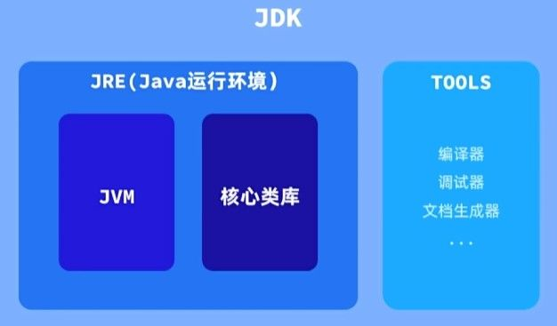
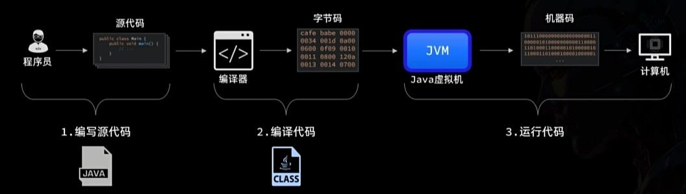
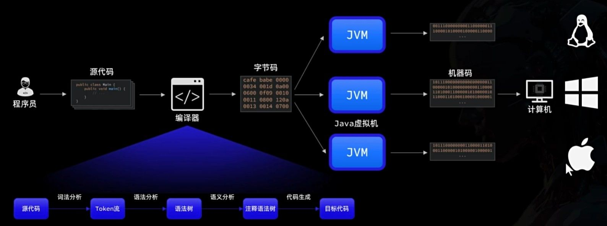

# Java 简介

**Java 是什么？** 简单来说，Java 是一门用来编写程序、解决实际问题的编程语言。我们通过它告诉计算机要做什么、按什么规则去做。

Java 是一门面向对象的语言，这意味着：在 Java 的世界里，我们更习惯用“对象”来组织和描述程序，而不是一堆零散的指令。

在后续学习中，会反复接触到三个非常重要的思想：

- 封装：把数据和操作这些数据的代码放在一起，对外只暴露必要的部分
- 继承：在已有类的基础上进行扩展，减少重复代码
- 多态：同一种操作，在不同对象身上表现出不同的行为

现在不需要完全理解它们的细节，先记住这三个词就够了。随着代码量的增加，它们会一次次自然地出现。

在此基础上，Java 根据使用场景的不同，发展出了几个常见的版本。常说的 Java 三大版本是:

| 版本                                    | 描述                                                                                                  |
| --------------------------------------- | ----------------------------------------------------------------------------------------------------- |
| **Java SE (Standard Edition)** 标准版   | 是核心的基础款，用于开发普通桌面程序。学习 Java 基本都从 SE 开始，也是后续所有方向的基础。            |
| **Java EE (Enterprise Edition)** 企业版 | 是基于 Java SE 扩展的升级版，用于构建 Web 与分布式系统。                                              |
| **Java ME(Micro Edition)** 微型版       | 面向早期资源受限设备（如功能机）的精简版本，随着智能手机与 Android 的普及已基本被淘汰，现在很少使用。 |

### 开发工具

想写 Java 程序，首先需要安装 JDK。这是一个工具箱，里面装着开发 Java 程序所需的各种工具。

- **JDK(Java Development Kit)** ｜ **开发工具包**：
  面向开发者使用，包含 Java 编译器、调试工具，以及运行 Java 程序所必需的环境。
  只要你要写 Java 代码，就必须安装 JDK。
- **JRE(Java Runtime Environment)** ｜ **运行环境**：
  用来运行已经写好的 Java 程序。JRE 内部包含 JVM（Java 虚拟机），可以理解为真正执行 Java 程序的“发动机”。
  从 Java 8 开始，JDK 已经完整包含 JRE，开发者无需单独安装。
  

在版本选择上，建议使用官方提供的 LTS（Long Term Support，长期支持）版本，更新稳定、生命周期长，更适合学习和长期使用。

[官方下载地址](https://www.oracle.com/cn/java/technologies/downloads/#java21)

# Java 程序的开发步骤

在不借助任何 IDE 的情况下，一个最原始的 Java 程序，通常要经历三个步骤：

1. 编写代码：编写 `.java` 源文件
2. 编译代码：使用 `javac` 命令，将源码编译为 `.class` 文件
3. 运行程序：使用 `java` 命令，运行编译后的程序



这也是 Java 程序最本质的开发流程。

我们写的 Java 源代码（`.java` 文件），对计算机来说其实是“看不懂的文字”。计算机真正能执行的，只有由 0 和 1 组成的机器指令。

Java 采用了一种折中的方案：

1. 先编译：
   使用 Java 编译器，将 .java 文件编译成 .class 文件（字节码）

2. 再运行：
   由 JVM（Java 虚拟机） 在运行时，把字节码转换为当前操作系统能够执行的机器码



这种方式的好处是：

- `.class` 字节码与具体操作系统无关
- 只要目标环境中安装了 JVM，同一份程序就可以运行

这也是 Java 常被描述为 “一次编写，处处运行” 的原因。为了更直观地理解这个过程，我们来使用命令行编译运行。

先新建一个文件，命名为 HelloWorld.java，并写入下面的代码：

```java
// HelloWorld.java
public class HelloWorld {
    public static void main(String[] args) {
        System.out.println("Hello World");
    }
}
```

可以使用任何文本编辑器来完成这一步，新建一个普通的 `.txt` 文本文件，编写完成后并将文件名命名为 `HelloWorld.java`
或者直接用 VS Code

然后打开命令行工具（CMD / Terminal），进入该文件所在目录，依次执行：

1. **编译源代码**

```bash
javac HelloWorld.java
```

执行成功后，会生成一个 `HelloWorld.class` 文件。

2. **运行程序**

```bash
java HelloWorld
```

java HelloWorld 不需要写 .class 后缀，JVM 会按类名自动加载字节码。如果一切正常，控制台就会输出：

```
Hello World
```

这就是一个 Java 程序从源码到运行结果的完整流程。需要注意的是，`java` / `javac` 实际上是 JDK 提供的命令行工具：

- 配置了环境变量后，可在任意目录直接使用；
- 未配置时，只能在其所在目录或通过绝对路径执行，否则命令无法被识别。

### 集成开发环境

集成开发环境（IDE）就像是一个高级的编辑器，它不仅可以让你编写代码，还能帮你分析代码、编译程序、调试问题，是开发 Java 程序的得力助手。

现在最受 Java 开发者欢迎的 IDE 非 Intellij IDEA 莫属了，这是 JetBrains 公司的明星产品。

> [IntelliJ IDEA 下载](https://www.jetbrains.com/idea/download/)  
> [IntelliJ IDEA 激活](https://3.jetbra.in/) (需要魔法上网)

IDEA 中有很多快捷键可以提高我们的开发效率，常见的有：

| 快捷键                          | 功能说明         |
| ------------------------------- | ---------------- |
| CTRL + D                        | 复制一行         |
| CTRL + Y                        | 删除当前行       |
| CTRL + ALT + L                  | 格式化代码风格   |
| ALT + SHIFT + ↑，ALT + SHIFT+ ↓ | 上下移动当前代码 |
| CTRL + /，CTRL + SHIFT + /      | 注释选中的代码   |

### Java 程序结构

每个 Java 程序都有一个"大门"，这个大门就是 main 方法。当你运行程序时，Java 会先找到这个方法，然后从这里开始执行。

无论你写多复杂的程序，都需要有一个 main 方法作为起点，它的写法是固定的：

```Java
public static void main(String[] args){
  // 你的代码从这里开始执行
}
```

# 注释

注释是写给人看的说明文字，不会被程序执行。它的作用只有一个：让代码更容易被理解，包括给未来的自己看。

Java 提供了三种不同风格的注释：

1. **单行注释**

用于对某一行代码做简短说明

```java
// 这是单行注释
```

2. **多行注释**

用于需要写一小段说明的情况

```java
/*
  这是多行注释，
  可以写多行内容
*/
```

3. **文档注释（了解）**

文档注释是一种结构化注释，主要用于类和方法说明，可以被工具提取并生成 API 文档。

```java
/**
 * 这是文档注释
 * 一般用于类或方法的说明
 */
```

入门阶段只需要认识这种注释，后续在写工具类或公共接口时会频繁用到。

**在 IDEA 中快速添加注释**

使用快捷键可以快速添加或取消注释：

- `Ctrl + /` : 单行注释
- `Ctrl + Shift + /` : 多行注释

### 常用的特殊注释

在实际开发中，IDE（如 IntelliJ IDEA）支持一些约定俗成的注释标记，用于快速定位代码中的待办事项或问题。

- `TODO:` 待办事项

  ```java
  // TODO: 实现用户登录功能
  ```

- `FIXME:` 已知问题

  ```java
  // FIXME: 这里的边界条件没处理好，可能会抛异常
  ```

IDE 会自动识别这些标记，方便统一查看和管理。

# 变量与常量

在程序中，我们既要表示数据的值，也要给这些数据起名字，变量、常量、标识符等概念，都是围绕这两件事展开的。

### 字面量（Literal）

字面量是程序中可以直接写出来的具体数据，也就是“值本身”。

```java
10
3.14
true
'a'
"Hello"
```

这些值不需要名字，本身就能表示某种数据。

### 标识符（Identifier）

标识符是程序员自己定义的名字，用来给变量、方法、类等程序元素命名。

```java
score
getUserName
StudentInfo
```

**标识符组成规则**

标识符的组成规则（必须遵守），只能由以下字符组成：

- 字母（a–z、A–Z）
- 数字（0–9，不能作为开头）
- 下划线 \_
- 美元符号 $

只要违反这些规则，程序就无法通过编译。不过，也并不是所有合法的标识符都能随便用。

- **关键字**：Java 已经赋予了特殊含义的词，不能作为标识符使用，比如 `if`、`else`、`class`。
- **保留字**：当前版本中未使用，但为未来功能预留，比如 `goto`。

**标识符命名规范**

除了必须遵守的规则，Java 还有一套推荐的命名规范。这些规范不是强制的，但遵循它们可以让代码更清晰、更专业。

- **包名**：全小写，使用点分隔

  ```java
  java.util
  ```

- **类名 / 接口名**：大驼峰（每个单词首字母大写）

  ```java
  StudentInfo
  ```

- **方法名 / 变量名**：小驼峰（首单词小写）

  ```java
  getUserName
  ```

- **常量名**：全大写，单词间用下划线

  ```java
  MAX_VALUE
  ```

### 变量

变量可以理解为内存中的一个“盒子”，它有名字、有类型，并且里面的值可以被修改。

> 语法：`数据类型 变量名 = 初始值;`

```Java
int score = 95;
score = 98;  // 修改变量的值
```

Java 要求在使用变量前声明类型，是因为 Java 是一门强类型语言。只有提前知道类型，程序才能正确分配和管理内存空间。

### 常量

常量和变量类似，但一旦赋值后就不能再修改。

> 语法：`final 数据类型 常量名 = 值;`

```Java
final double PI = 3.14159265;  // 定义一个圆周率常量
// PI = 3.14;  // 错误！常量不能被修改
```

常量通常用于表示固定不变的值。按照约定，常量名使用全大写 + 下划线，方便一眼识别。

# 数据类型

在 Java 中，所有数据类型可以分为两大类：

- 基本数据类型：
  直接存储数据的值本身，可以理解为“口袋里直接装东西”。
- 引用数据类型：
  存储的是数据所在位置的引用（地址），可以理解为“口袋里装的是仓库钥匙”。

简单来说，基本类型存的是**值本身**，而引用类型存的是**地址**，指向实际对象。

### 基本数据类型

基本数据类型用于存储最基础、最轻量的数据。它们直接保存具体数值，访问速度快，但功能相对有限。

例如：

```java
int age = 18;
```

这里的变量 `age` 中，存的就是数值 `18` 本身。

早期计算机内存有限，因此设计了多种大小不同的基本数据类型。在现代 Java 开发中，通常不再刻意区分这些差异。

实用结论：

> 整数默认用 int，小数默认用 double。

只有在需要表示超大整数或有特殊内存要求时，才会使用其他类型。

- 整数类型：用来存储整数值

| 类型    | 存储大小 | 能装多少数字 | 适用场景               |
| ------- | -------- | ------------ | ---------------------- |
| `byte`  | 1 个字节 | -128 到 127  | 节省空间的极小范围整数 |
| `short` | 2 个字节 | 约 ±3 万     | 较小范围的整数         |
| `int`   | 4 个字节 | 约 ±21 亿    | 最常用，默认整数类型   |
| `long`  | 8 个字节 | 很大         | 超大整数时使用         |

默认整数是 int 类型。如果要用 long 类型，需要在数字后加上字母 L
例如：

```Java
long bigNumber = 123456789L;
```

基本类型之间的计算会自动进行类型转换，规则是"小转大"，不会丢失精度。例如 `byte` + `int` 的结果是 int 类型。

> 特别注意：`byte`、`short`、`char` 三种类型的数据在计算时都会先转成 int 类型。

- 浮点类型：用来存储带小数点的数值

| 类型   | 存储大小 | 精度             | 适用场景               |
| ------ | -------- | ---------------- | ---------------------- |
| float  | 4 个字节 | 约 7 位有效数字  | 对精度要求不高的情况   |
| double | 8 个字节 | 约 15 位有效数字 | 默认浮点类型，精度更高 |

默认小数是 double 类型。如果要用 float 类型，需要在数字后加上字母 F
例如：

```Java
float price = 19.99F;
```

- 布尔类型：只存储 `true` 或 `false` 两种状态

| 类型    | 存储大小 | 取值       | 适用场景           |
| ------- | -------- | ---------- | ------------------ |
| boolean | 1 个字节 | true/false | 条件判断，逻辑控制 |

- 字符类型：存储单个字符

| 类型 | 存储大小 | 取值范围                      | 适用场景     |
| ---- | -------- | ----------------------------- | ------------ |
| char | 2 个字节 | 0 到 65535(所有 Unicode 字符) | 存储单个字符 |

字符值需要用单引号括起来
如：

```Java
char grade = 'A';
```

### 引用数据类型

除了基本类型，Java 里其他都是**引用类型**。最常见的就是 `String`。

- String 类：用来存储文本

```java
String name = "猎风";  // 字符串用双引号
```

这里的变量 `name` 并不直接存储字符串内容，而是保存了一个指向字符串对象的引用。

真正的字符串数据存放在内存的其他区域。

虽然 `String` 的使用方式看起来和基本类型很像，但它本质上是一个类。Java 对它做了特殊优化，让它用起来更方便。

# 从键盘录入

有时候我们希望程序能接收用户输入，而不是把数据写死在代码里。Java 提供了一个常用工具：`Scanner`，用于从键盘读取数据。

使用 Scanner 只需要三步。

```Java
import java.util.Scanner;
```

（在 IDEA 中通常会在你写第二步时，自动补全这一行）

**创建 Scanner 对象**

这里就是关键的一步：先 new 一个对象，再用它的方法做事。

```Java
Scanner scan = new Scanner(System.in);
```

这行代码表示：创建一个 Scanner 对象，用来读取键盘输入。

**注意事项**

当 `nextInt()` / `nextDouble()` 和 `nextLine()` 混用时，
可能会出现 `nextLine()` 被“跳过”的情况。

例如：

```java
int age = scan.nextInt();
String name = scan.nextLine();
```

输入：

```
18
Tom
```

你会发现 `name` 变成了空字符串。

**原因**

`nextInt()` 只会读取数字本身，不会读取输入后的回车符。

当你输入：

```
18⏎
```

实际在缓冲区里是：

```
18\n
```

- `nextInt()` 读取了 `18`
- `\n`（回车）还留在缓冲区

接下来执行 `nextLine()` 时，它会读取“直到回车为止的一整行”。但缓冲区里第一个字符就是 `\n`，所以它立刻读取完，得到一个空字符串。

**解决办法**

在两者之间手动吃掉这次回车：

```java
int age = scan.nextInt();
scan.nextLine();   // 吃掉残留的换行
String name = scan.nextLine();
```

- `nextInt()` 读数据，不读回车
- `nextLine()` 读整行，包括回车

混用时，要自己处理换行符。

# 运算符

### 算术运算符

算术运算符用于进行最基本的数学计算，和计算器上的按钮类似。

| 类型     | 运算符          | 描述                            |
| -------- | --------------- | ------------------------------- |
| 加减乘除 | `+` `-` `*` `/` | 基本的四则运算符                |
| 取模     | `%`             | 两数相除的的余数, 舍去整数部分. |

整数相除的结果还是整数，注意小数部分会被直接舍去！

```java
int a = 5;
int b = 2;
System.out.println(a / b); // 2
```

如果希望得到带小数的结果，至少有一个操作数是浮点数：

```java
System.out.println(5.0 / 2); // 2.5
```

**数字拆分：**

在实际编程中，经常需要把一个多位整数拆分成不同的数位。这是算术运算符中 `%（取模）`和 `/（整除）` 的一个典型应用场景。

核心思路只有两点：

- `% 10` 用来获取当前的个位
- `/ 10` 用来去掉已处理的个位

```java
// 将一个三位数拆分为个位、十位和百位
int number = 745;

int ones = number % 10;        // 获取个位：5
int tens = number / 10 % 10;   // 获取十位：4
int hundreds = number / 100;   // 获取百位：7

System.out.println("个位是：" + ones);
System.out.println("十位是：" + tens);
System.out.println("百位是：" + hundreds);
```

**拆分过程解析**：

1. `number % 10` → `745 % 10 = 5`（余数就是个位数）
2. `number / 10` → `745 / 10 = 74`（整除 10 后，十位变成了个位）
3. `74 % 10 = 4`（现在可以用同样的方法获取十位）
4. `number / 100` → `745 / 100 = 7`（直接得到百位）

**进阶：循环提取所有数位**

```java
int number = 9527;

while (number > 0) {
    System.out.print(number % 10 + " ");  // 输出当前个位
    number /= 10;                         // 去掉已处理的个位
}
// 输出：7 2 5 9
```

这种写法常见于一些基础算法场景，例如数字反转、各位求和、回文数判断等。入门阶段理解思路即可，不必强行记住。

### 自增 / 自减运算符

自增和自减用于对变量进行 +1 或 -1 的操作：

| 运算符 | 名称 | 效果       |
| ------ | ---- | ---------- |
| ++     | 自增 | 变量值加 1 |
| --     | 自减 | 变量值减 1 |

它们既可以放在变量前，也可以放在变量后，区别只体现在参与表达式时。

```java
int a = 5;
int b = ++a;  // a 先加 1，再赋值给 b（a=6, b=6）

int c = 5;
int d = c++;  // 先把 c 的值赋给 d，再自增（c=6, d=5）
```

- 前置++：先改变，再使用
- 后置++：先使用，再改变

### 赋值运算符

赋值运算符用于将右侧表达式的结果存入左侧变量。

| 运算符                       | 描述                   |
| ---------------------------- | ---------------------- |
| `=`                          | 简单的赋值运算符       |
| `*=`, `/=`, `%=`, `+=`, `-=` | 先计算右操作数, 再赋值 |

例如：

```java
int x = 10;
x += 3;   // 等价于 x = x + 3
```

这种写法更简洁，也更常见。注意，复合赋值运算符会自动进行类型转换。

例如：

```java
byte b = 10;
b += 5;   // 正常
```

但如果写成：

```java
b = b + 5;  // 编译报错
```

因为：

- `b + 5` 的结果类型是 `int`
- 不能直接赋值给 `byte`

而 `+=` 内部会自动强制转换。

### 关系运算符

关系运算符用于比较两个值，结果一定是布尔值（`true` / `false`）。

| 运算符    | 描述                |
| --------- | ------------------- |
| `==`      | 是否相等            |
| `!=`      | 是否不等            |
| `>` `<`   | 大于 / 小于         |
| `>=` `<=` | 大于等于 / 小于等于 |

基本数据类型（int、double、char 等）可以直接使用 `==` 比较值。而引用类型比较时，`==` 比较的是地址，而不是内容。
如果想比较引用类型的内容，应该使用 `equals()`

推荐写法：

```java
"hello".equals("hello"); // 正确
```

这样即使 `s` 为 `null` 也不会报空指针异常。

### 逻辑运算符

当需要组合多个条件时，就要使用逻辑运算符。

| 运算符 | 描述                                 |
| ------ | ------------------------------------ |
| `&`    | 两边都为 `true`，结果才为 `true`     |
| `\|`   | 两边有一个为 `true`，结果就为 `true` |
| `!`    | 取反，例如 `true` 取反变 `false`     |
| `^`    | 两边不同为 `true`，相同为 `false`    |

普通逻辑运算符（`&`、`|`）即使已经可以确定最终结果，也会继续计算右边表达式。

这不仅会造成额外的性能开销，还可能让原本不需要执行的方法被调用，甚至在某些情况下触发异常，从而带来隐藏的风险。

看这样一个例子：

```java
// 判断一个人是否成年且有驾照
int age = 16;
boolean hasLicense = checkLicense();

// 使用普通逻辑与
boolean canDrive = age >= 18 & hasLicense;
```

即使 `age >= 18` 为 `false`，`checkLicense()` 仍然会被调用。

为了解决这个问题，Java 提供了短路版本：

| 类型   | 运算符 | 描述                                           |
| ------ | ------ | ---------------------------------------------- |
| 短路与 | `&&`   | 如果左边为 false，直接返回 false，不再计算右边 |
| 短路或 | `\|\|` | 如果左边为 true，直接返回 true，不再计算右边   |

改写上面的例子：

```java
boolean canDrive = age >= 18 && hasLicense;
```

当年龄不满足时，右边不会执行。短路不仅仅是“更高效”，更重要的是**保证程序安全**。

经典场景：

```java
String str = null;

if (str != null && str.length() > 3) {
    System.out.println("长度大于3");
}
```

如果使用 `&`：

```java
if (str != null & str.length() > 3) {
```

就会抛出 `NullPointerException` ，因为右边一定会执行。

在实际开发中，无论是判断对象是否为 `null`、集合是否为空，还是校验某种状态是否合法，通常都会依赖短路运算来保证判断顺序和程序安全。因此在日常编码中，应优先使用 `&&` 和 `||`。

### 番外-位运算符

位运算符是对整数的二进制位进行操作

| 运算符 | 名称       | 作用                     |
| ------ | ---------- | ------------------------ |
| `&`    | 按位与     | 对应位都为 1 才为 1      |
| `\|`   | 按位或     | 对应位有一个为 1 即为 1  |
| `^`    | 按位异或   | 对应位不同为 1           |
| `~`    | 按位取反   | 0 变 1，1 变 0           |
| `<<`   | 左移       | 所有位左移，右侧补 0     |
| `>>`   | 右移       | 所有位右移，左侧补符号位 |
| `>>>`  | 无符号右移 | 所有位右移，左侧补 0     |

左移一位，等价于乘以 2：

```java
int a = 3;      // 0011
int b = a << 1; // 0110 -> 6
```

右移一位，等价于除以 2（向下取整）：

```java
int a = 8;      // 1000
int b = a >> 1; // 0100 -> 4
```

但负数右移会保留符号位，这是需要特别注意的地方。

在日常的 Java 后端开发中，位运算并不常作为常规手段使用，它更多出现在一些特定场景，例如通过二进制位进行权限控制、状态压缩，或在底层框架和对性能要求较高的算法实现中发挥作用。

# 类型转换

在 Java 中，不同数据类型之间有时需要相互转换。类型转换分为两种：

- 自动类型转换（隐式转换）
- 强制类型转换（显式转换）

## 自动类型转换

当把“小容量”类型赋值给“大容量”类型时，Java 会自动完成转换。例如：

```java
byte byteValue = 10;     // 1字节
int intValue = byteValue;  // 自动转成 int（4字节）
```

这种转换是安全的，因为目标类型能够完整容纳原有的数据范围，不会发生精度损失。

自动转换遵循一个固定的提升顺序，从小到大依次是：

```java
byte → short → int → long → float → double
      ↗
     char
```

`char` 本质上是无符号整数，也可以自动提升为 `int`。

有一个容易误解的地方是，虽然：

- `long` 占 8 字节
- `float` 占 4 字节

但 `long` 仍然可以自动转换为 `float`。

原因在于，自动转换看的是“数值表示范围”，而不是“字节大小”。float 能表示的数值范围比 long 更大，只是精度较低，所以转换是允许的。

## 强制类型转换

当把“大类型”转换为“小类型”时，必须手动强制转换。

```java
double doubleValue = 3.14;
int intValue = (int) doubleValue;  // 结果是 3
```

写法是在值前面加上目标类型：

```java
(目标类型) 值
```

之所以必须手动强制，是因为这种转换可能导致数据丢失。最常见的两种情况是：

- 浮点数转整数时，小数部分会被直接截断，而不是四舍五入；
- 大整数转小整数时，超出范围的高位会被截断，发生溢出。

例如：

```java
byte b = (byte)130;
```

结果不是 130，而是 -126。这是因为 byte 的取值范围是 -128 到 127，130 超出了范围，底层会按照二进制截断，只保留低 8 位，最终得到一个负数，也就是-126。

## 赋值运算中的隐式转换

在复合赋值运算符中（如 `+=`、`-=`），
Java 会自动进行一次强制转换。

```java
byte b = 10;
b += 5;   // 等价于 b = (byte)(b + 5);
```

注意：

```java
b = b + 5;   // ❌ 编译错误
```

因为：

- `b + 5` 的结果是 int
- 不能自动赋值给 byte

而 `+=` 内部会自动帮你做强制转换。

# 控制语句

如果不使用任何控制语句，程序会按照顺序结构执行——代码从上到下逐行运行，不进行任何判断或跳转。
而控制语句的作用，就是改变程序的执行流程，让程序具备“判断”和“选择”的能力。

### 条件判断

条件判断让程序根据不同情况执行不同逻辑，是最基础也是最常用的控制结构。

#### if-else

是最常见的分支结构，用于根据布尔条件决定是否执行某段代码。

```Java
if (条件) {
    // 条件为 true 时执行
} else if (另一个条件) {
    // 上一个条件为 false 且当前条件为 true 时执行
} else {
    // 所有条件都不满足时执行
}
```

执行顺序是自上而下，一旦某个条件成立，后面的分支将不再判断。当条件语句中只有一行代码时，可以省略大括号：

```java
if (score > 90) System.out.println("优秀");
```

语法上是允许的，但实际开发中不建议这样写。
保留大括号可以避免后期修改代码时产生逻辑错误，也更有利于阅读。

#### 三元运算符

当只是根据条件在两个值之间做选择时，可以使用三元运算符。

```Java
结果变量 = (条件) ? 值1 : 值2;
```

等价于一个简单的 if-else：

```Java
// 使用if-else
String result;
if (score >= 60) {
    result = "及格";
} else {
    result = "不及格";
}
```

可以写成：

```Java
String result = score >= 60 ? "及格" : "不及格";
```

三元运算符适合用于简单赋值场景。如果逻辑变复杂，就应当改回 if-else，避免代码难以理解。

#### switch-case

当需要根据一个变量的多个固定取值进行分支处理时，`switch`比大量的`if-else` 更清晰。

```Java
switch (表达式) {
    case 值1:
        // 匹配值1时执行
        break;
    case 值2:
        // 匹配值2时执行
        break;
    default:
        // 都不匹配时执行
}
```

break 的作用是防止“贯穿”执行。如果省略 break，程序会继续执行下一个 case。

例如：

```Java
int day = 3;
switch (day) {
    case 1:
        System.out.println("周一：开始新的一周");
        break;
    case 2:
    case 3:
    case 4:
    case 5:
        System.out.println("工作日：努力工作");
        break;
    case 6:
    case 7:
        System.out.println("周末：好好休息");
        break;
    default:
        System.out.println("无效的日期");
}
```

这里多个 case 共用一段逻辑，是一种常见写法。

从 JDK 12 开始，`switch` 提供了更简洁的箭头写法：

```Java
switch (day) {
    case 1 -> System.out.println("周一：开始新的一周");
    case 2, 3, 4, 5 -> System.out.println("工作日：努力工作");
    case 6, 7 -> System.out.println("周末：好好休息");
    default -> System.out.println("无效的日期");
}
```

在较新的 Java 版本（JDK 14+ 正式）中，`switch` 甚至可以直接返回值：

```Java
String plan = switch (day) {
    case 1 -> "周一：开会日";
    case 2, 3 -> "学习日";
    case 4, 5 -> "编码日";
    case 6, 7 -> "休息日";
    default -> "错误的日期";
};
```

这里的 `switch` 是一个表达式，而不是单纯的语句。

作为表达式形式的 switch，要求所有分支都必须给出结果，从而保证结构完整；它通常用于变量赋值等需要返回值的场景，相比传统写法更紧凑，也更清晰。

### 循环结构

循环结构让程序能够在满足条件的情况下重复执行代码，从而避免手动编写大量重复逻辑。Java 中常见的循环有 `for`、`while` 和 `do-while` 三种形式。

#### for 循环

`for` 适合“次数明确”或“需要计数变量”的场景。

```Java
for (初始化; 条件; 迭代) {
    // 循环体，重复执行的代码
}
```

执行顺序如下：

- 初始化：循环开始前执行一次
- 条件：每次循环前检查，为 true 才继续
- 迭代：每次循环后执行

例如：

```java
// 打印1到5的数字
for (int i = 1; i <= 5; i++) {
    System.out.println(i);
}
```

`for` 的结构集中，变量变化清晰，因此在计数循环中最常见。

#### while 循环

当无法提前确定循环次数，只知道“什么时候停止”时，可以使用 `while`。

```java
while (条件) {
    // 循环体
}
```

每次循环前都会先判断条件，如果条件为 false，则一次都不会执行。例如：

```java
int count = 10;

while (count > 0) {
    System.out.println(count);
    count--;
}
```

与 `for` 相比，`while` 更强调“条件驱动”，而不是“计数驱动”。

#### do-while 循环

`do-while` 与 `while` 的区别在于：它会先执行一次循环体，然后再判断条件。

```java
do {
    // 循环体
} while (条件);
```

因此，无论条件是否成立，循环体都会至少执行一次。
例如：

```java
int choice;
do {
    System.out.println("1. 开始游戏");
    System.out.println("2. 设置");
    System.out.println("0. 退出");
    System.out.print("请选择：");
    choice = scanner.nextInt();

    // 处理用户选择...

} while (choice != 0);  // 当用户选择0时退出循环
```

这种结构适用于控制台菜单输入、校验输入等“至少执行一次”的场景。

### break 与 continue

循环的默认行为是按照既定条件反复执行，但有时需要提前改变流程。

break 用于直接终止整个循环：

```java
for (int i = 1; i <= 10; i++) {
    if (i == 5) {
        break;  // 当i等于5时，跳出循环
    }
    System.out.println(i);  // 只会打印1、2、3、4
}
```

当 `i` 等于 `5` 时，循环立即结束。continue 则是跳过本次循环剩余部分，进入下一轮判断：

```java
  for (int i = 1; i <= 5; i++) {
      if (i == 3) {
          continue;  // 当i等于3时，跳过本次循环剩余部分
      }
      System.out.println(i);  // 会打印1、2、4、5（没有3）
  }
```

这里会跳过 3。

在多层嵌套循环中，可以通过标签控制外层循环：

```java
outerLoop: for (int i = 1; i <= 3; i++) {
    for (int j = 1; j <= 3; j++) {
        if (i * j > 4) {
            break outerLoop;  // 跳出最外层循环
        }
        System.out.println(i + " * " + j + " = " + (i * j));
    }
}
```

> ctrl + Alt + T : 快速放入循环

标签并不常用，但在需要精确控制多层循环时会发挥作用。

# 生成随机数

在 Java 中，生成随机数通常使用 `Random` 类。它的使用方式和 `Scanner` 类类似，都是先创建对象，再调用方法。
在大多数 IDE 中可以自动导包，因此一般不需要手动写 `import`。

基本用法如下：

```java
Random r = new Random();
int number = r.nextInt(10);
System.out.println("随机生成了：" + number);
```

`nextInt(n)` 用于生成一个范围在 `[0, n)` 之间的整数，也就是包含 0，但不包含 n 本身。

例如：

```java
r.nextInt(10);
```

生成的结果只会在 0 到 9 之间，不可能等于 10。

这一点在实际使用时需要特别注意，如果希望生成 1 到 10 之间的数字，可以这样写：

```java
int number = r.nextInt(10) + 1;
```

理解区间是关键：
`nextInt(n)` 永远从 0 开始，到 n-1 结束。

这种写法简洁直接，适合大多数基础随机需求，例如猜数字、小范围模拟数据等场景。

# 方法

方法是 Java 程序的基本构建块，可以把它理解为一块可重复使用的功能模块。当某段逻辑需要多次使用时，与其反复复制代码，不如封装成一个方法，在需要时直接调用。

这样做的好处是：

- 结构清晰，职责明确
- 代码可以复用
- 修改时只需要调整一处

### 方法的基本结构与使用

```java
返回类型 方法名(参数类型 参数名, ...) {
    // 方法体
    return 返回值;
}
```

返回类型决定了方法执行后会得到什么结果；如果方法只是执行操作而不需要返回值，则使用 void。

```java
// 有返回值
int sum(int a, int b) {
    return a + b;
}

// 无返回值
void printGreeting() {
    System.out.println("你好，欢迎学习Java！");
}
```

**调用方法**

方法定义之后，必须通过调用才能执行。

```java
public static void main(String[] args) {
    // 有返回值的方法
    int result = sum(10, 20);
    System.out.println("10 + 20 = " + result);

    // 无返回值的方法
    printGreeting();
}
```

有返回值的方法可以接收结果再使用；无返回值的方法则只负责执行动作。

### 方法的参数

参数用于在调用方法时传入数据，使方法具备处理不同情况的能力。

```java
// 无参方法
void sayHello() {
    System.out.println("Hello!");
}

// 单参数方法
void sayHelloTo(String name) {
    System.out.println("Hello, " + name + "!");
}

// 多参数方法
double calculateRectangleArea(double length, double width) {
    return length * width;
}
```

参数本质上就是方法内部可用的局部变量。

**方法重载**

在同一个类中，允许存在多个同名方法，只要参数列表不同即可，这种机制称为方法重载。

```java
// 计算两个整数的和
int add(int a, int b) {
    return a + b;
}

// 计算三个整数的和（参数数量不同）
int add(int a, int b, int c) {
    return a + b + c;
}

// 计算两个浮点数的和（参数类型不同）
double add(double a, double b) {
    return a + b;
}
```

重载的意义在于：

> 用同一个方法名表达同一种行为，只是处理的数据类型不同。

像 `System.out.println()` 能打印各种类型，就是通过重载实现的。

在实际开发中，经常会把一段重复逻辑提取成方法。IDEA 中可以使用：`Ctrl + Alt + M` 快速完成提取，这也是重构代码时最常见的操作之一。

### 递归调用

当一个问题 可以拆成“规模更小，但结构完全一样的问题” 时，就可以让方法调用自己来解决。

先看一个最经典的例子：阶乘。

```java
public static int factorial(int n) {
    // 基本情况（终止条件）
    if (n == 1) {
        return 1;
    }
    // 递归调用
    return n * factorial(n - 1);
}
```

这里其实只做了两件事：

1. 先把问题往更小的规模推进
2. 等最小问题算完，再一层层把结果带回来

把递归当成“任务拆分链”
调用 `factorial(5)` 时，方法不会一次算完，而是不断 挂起自己，等待更小的任务完成：

```java
factorial(5)
→ 等 factorial(4)
  → 等 factorial(3)
    → 等 factorial(2)
      → 等 factorial(1)
```

当执行到 factorial(1) 时，终于不再继续调用，开始返回结果：

```java
1
→ 2 * 1 = 2
→ 3 * 2 = 6
→ 4 * 6 = 24
→ 5 * 24 = 120
```

可以把它理解成：

一条不断向下压栈的调用链，再一层层弹栈返回结果。终止条件是递归的“刹车”，所以递归必须有明确的结束点。

使用递归时要小心这两个错误：

- **StackOverflowError**：递归太深，方法调用栈溢出了。比如：

  ```java
  // 没有正确的终止条件
  public static void broken() {
      broken(); // 无限递归，最终栈溢出
  }
  ```

- **OutOfMemoryError（OOM）**：内存不够用了。如果递归创建了大量对象，可能会耗尽内存。

递归非常消耗资源。因为每调用一次方法，都会创建一个新的栈帧，里面包含：

- 参数
- 局部变量
- 返回地址

也就是说：

递归深度越深 → 占用栈内存越多 → 方法调用开销越大

如果递归过程中还不断创建对象，就可能进一步把堆内存耗光，导致 OOM。

**一个实用判断标准**

写递归前先问自己三件事：

1. 终止条件是什么？
2. 每一层递归在做什么？
3. 规模是否在不断变小？

如果这三个问题说不清楚，递归基本就会写崩。

# 数组

在需要批量存储和处理同类型数据时，就可以用数组。数组就像一排连续的“格子”，每个格子都能存放一个数据。

### 创建数组

在 Java 中，数组的创建主要有两种方式：**静态初始化** 和 **动态初始化**。

**静态初始化**

创建的同时就把数据写死，适合一开始就知道具体内容的情况。写法干脆，数据一眼能看清：

```java
数据类型[] 数组名 = {元素1,元素2,元素3}

int[] ages = {25, 30, 18, 42};  // 声明并直接赋值（静态初始化）
```

如果你想写“完整一点”的形式，也可以这样：

```java
数据类型[] 数组名 = new 数据类型[]{元素1,元素2,元素3}
```

一般开发里更常用的是上面那种简写，够用也更清爽。

**动态初始化**

只先确定“有多少个格子”，但暂时不放具体数据。适合先定规模，后面再慢慢填值的情况。

```java
int[] numbers = new int[5];  // 创建一个长度为5的整数数组（动态初始化）
numbers[0] = 10;             // 再逐个赋值
```

这时候数组里的元素会先用默认值填充（比如 int 默认是 0）。

也可以拆开写，更贴近实际风格：

```java
int[] scores;           // 声明
scores = new int[3];    // 动态初始化
```

选择哪种方式，取决于实际需求。数据已知时用静态初始化更直观，先定结构再填内容时用动态初始化更灵活。

### 访问数组元素

如果直接打印数组名，会得到类似这样的结果：

```
[I@3f99bd52
```

这是数组对象在内存中的标识信息。

其含义：

- `[` 表示数组
- `I` 表示元素类型是 `int`
- `@` 后面是对象的地址标识

所以，打印数组名拿不到元素内容。要获取数组中的数据，必须通过 `索引[下标]` 访问。

索引从 `0` 开始，每个位置对应一个元素：

```java
int[] marks = {85, 90, 75, 95, 60};

// 读取
System.out.println(marks[0]);  // 85
System.out.println(marks[4]);  // 60

// 修改
marks[2] = 80;
```

可以把数组理解为一排固定位置的格子，通过“位置”取值。

需要注意的是，索引不能越界。
长度为 5 的数组，索引范围是 0 ~ 4。如果访问不存在的位置：

```java
marks[5];
marks[-1];
```

会直接抛出异常：

```
ArrayIndexOutOfBoundsException
```

### 访问数组元素

如果直接打印数组名，会得到类似这样的结果：

```
[I@3f99bd52
```

这并不是数组中的数据，而是数组对象在内存中的标识信息。

- `[` ：这是一个数组
- `I` ：元素类型是 int
- `@` 是分隔符
- 后面的十六进制字符串表示对象的地址标识

也就是说，直接打印数组名，只能看到“这个数组对象”，而不是里面存放的具体内容。

要获取数组中的数据，需要通过索引来访问。
数组中的每个元素都有一个`索引 [下标]`，并且是从 0 开始计数的。通过索引可以读取或修改元素：

```java
int[] marks = {85, 90, 75, 95, 60};

// 读取元素
System.out.println("第一个成绩是：" + marks[0]);  // 85
System.out.println("最后一个成绩是：" + marks[4]);  // 60

// 修改元素
marks[2] = 80;  // 将第三个成绩从 75 改为 80
```

需要注意的是，索引必须在合法范围内。

对于长度为 5 的数组，索引范围是 0 到 4。如果访问越界：

```java
marks[5];
marks[-1];
```

程序会抛出异常：

```
ArrayIndexOutOfBoundsException
```

本质上是访问了数组中不存在的位置。

### 数组遍历

遍历数组就是依次访问数组中的每个元素，常用于查找、统计、打印等场景。有几种常见方式：

#### 传统 for 循环

适用于需要知道元素位置（索引）的场景：

```java
int[] numbers = {10, 20, 30, 40, 50};

// 使用索引遍历
for (int i = 0; i < numbers.length; i++) {
    System.out.println("第" + (i+1) + "个数是：" + numbers[i]);
}
```

#### 增强 for 循环（for-each）

适合只关心元素值、不关心位置的遍历场景：

```java
int[] numbers = {10, 20, 30, 40, 50};

// 直接获取每个元素
for (int num : numbers) {
    System.out.println("数值：" + num);
}
```

增强 for 循环底层其实就是数组遍历的简化写法，语法更简洁，但无法访问索引。

### 可变参数

如果希望方法能接收不确定数量的参数，Java 提供了 **可变参数语法**：

```java
// 传入任意数量的整数，求和
int sum(int... numbers) {
    int total = 0;
    for (int num : numbers) {
        total += num;
    }
    return total;
}
```

调用时可以传入任意多个参数，甚至不传：

```java
int result1 = sum(10, 20);           // 传入2个参数
int result2 = sum(5, 10, 15, 20, 25); // 传入5个参数
int result3 = sum();                  // 不传参数也行
```

可变参数实际上是作为数组处理的。有两点需要注意：

1. 一个方法只能有一个可变参数
2. 可变参数必须是方法的最后一个参数

```java
// 正确：可变参数在最后
void printInfo(String name, int... scores) { }

// 错误：可变参数不在最后
void wrongMethod(int... numbers, String text) { } // 编译错误
```

数组一旦创建，长度不可改变。  
如果需要支持动态增删元素，应考虑使用 `ArrayList`、`LinkedList` 等集合类，后面的部分会提到。

### 二维数组

一维数组解决的是“一排数据”，但像成绩表、棋盘这类“行 + 列”的结构，一维数组就不够用了。

这时可以使用二维数组，本质就是：数组里面再放数组。

#### 创建二维数组

最直接的方式，是在定义时就写出结构：

```java
int[][] matrix = {
    {1, 2},
    {3, 4},
    {5, 6}
};
```

这段代码创建了一个 `3行2列` 的矩阵：

```
[
 [1, 2],
 [3, 4],
 [5, 6]
]
```

如果暂时不知道具体数据，也可以先定义结构，再赋值：

```java
int[][] table = new int[2][3];  // 2行3列，每个元素默认是0
table[0][1] = 42;  // 0行1列，赋值42
```

不过要注意一个容易忽略的点：

> 二维数组中存的，其实不是数据本身，而是“一维数组的地址”

#### 访问二维数组

访问时，需要两个索引`matrix[行][列]`：

```java
System.out.println(matrix[0][0]);  // 输出 1（第1行第1列）
System.out.println(matrix[2][1]);  // 输出 6（第3行第2列）
```

遍历时就是两层循环：外层控制行，内层控制列。

```java
for (int i = 0; i < matrix.length; i++) {               // 遍历每一行
    for (int j = 0; j < matrix[i].length; j++) {        // 遍历当前行的每一列
        System.out.print(matrix[i][j] + " ");
    }
    System.out.println();  // 每行结束后换行
}
```

输出结果是一个整齐的二维数据表：

```
1 2
3 4
5 6
```

- `matrix.length` 表示“总共有几行”
- `matrix[i].length` 表示“第 i 行有多少列”（支持“非规则二维数组”）

另外，二维数组不是必须要等长每行，比如：

```java
int[][] irregular = {
    {1, 2},
    {3, 4, 5},      // 第2行比第1行多一列
    {6}
};
```

这不是“矩阵”，而是一个数组，里面装着长度不同的多个数组。

实际开发中，二维数组的使用场景并不多，更多时候会用集合来处理这类结构。这里只需要理解基本用法即可。
