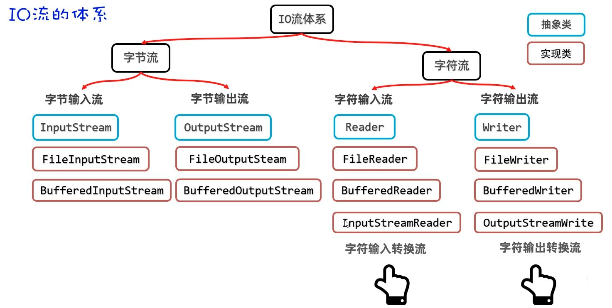
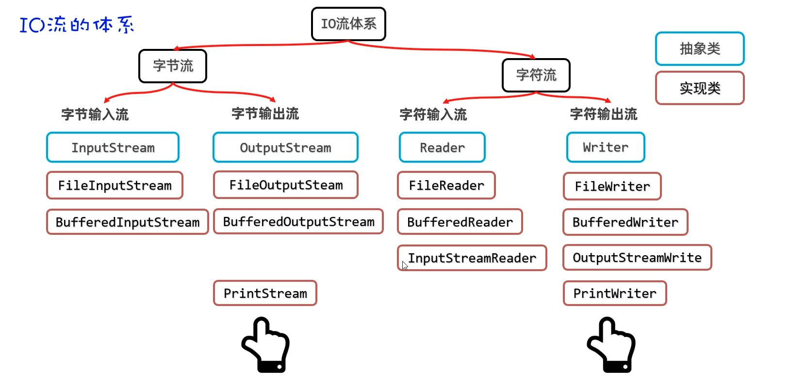
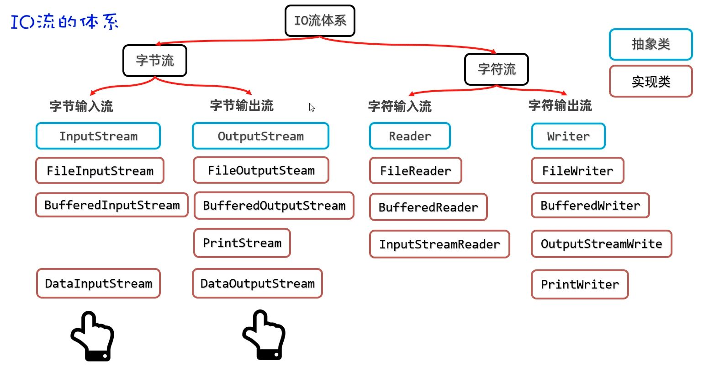

# IO 原始流

File 只负责的是“有没有、在哪、叫什么、多大”等元信息；真正把数据读进来、写出去，还得交给 IO 流。

IO（Input/Output）流可以理解为内存与外部介质（文件、网络等）之间的数据通道：输入流把外部数据读入内存，输出流把内存数据写出到外部。

从数据“怎么流动”和“以什么为单位”两个维度看更清楚：

按方向分为：

- 输入流：外部 → 内存
- 输出流：内存 → 外部

按数据单位可分为：

- 字节流：以字节为单位，适合一切类型（音视频、图片、二进制、文本复制等）
- 字符流：以字符为单位，只适合纯文本（txt、java 等）

四类流的本质就是这四种组合：

- 字节输入流（把磁盘/网络中的字节读入内存）
- 字节输出流（把内存中的字节写出到磁盘/网络）
- 字符输入流（按字符读文本）
- 字符输出流（按字符写文本）


File  代表“文件这个对象”，IO 流负责“文件里的内容”；
配合起来，才算从“有文件”走到“有数据”。接下来按这条脉络，从字节流与字符流分别展开，理解起来更清晰。

## FileInputStream

FileInputStream 是文件字节输入流，作用是以内存为基准，把磁盘文件中的数据以字节形式读入内存。

它的构造器格式如下：

```java
public FileInputStream(File file)
public FileInputStream(String pathname) // 更推荐!
```

两种构造方式都能创建字节输入流管道与源文件接通。第二种传入字符串路径更简洁，其内部会自动包装成 File 对象。

以下是 FileInputStream 的几个核心方法，方法的参数风格在其他流都是通用的：

#### `read()` 单个字节读取

```java
public int read()
```

每次读取一个字节返回，如果没有数据可读会返回 -1。

```java
InputStream is = new FileInputStream("src/wolf.txt");

// 逐个字节读取
int b1 = is.read();  // 读取第一个字节
System.out.println((char) b1);
int b2 = is.read();  // 读取第二个字节
System.out.println((char) b2);
int b3 = is.read();  // 没有更多数据
System.out.println(b3); // -1
```

因为方法有返回值，我们可以利用返回值对其使用循环改进：

```java
int b;
while ((b = is.read()) != -1) {
    System.out.print((char) b);
}
```

这种方式虽然简单，但存在明显问题：每次只操作一个字节，磁盘到内存跨区域的通信本就慢，且无法避免读取汉字时的乱码问题（会截断汉字的字节）。

#### `read(byte[] buffer)` 批量读取

```java
public int read(byte[] buffer)
```

用字节数组批量读取数据，返回实际读取的字节个数，没有数据可读时返回 -1。

```java
byte[] buffer = new byte[3];
int len1 = is.read(buffer);
System.out.println("内容：" + new String(buffer));
System.out.println("个数：" + len1);  // 内容：a60，个数：3

int len2 = is.read(buffer);
System.out.println("内容：" + new String(buffer));
System.out.println("个数：" + len2);  // 内容：ab0，个数：2
```

**注意：** 第二次读取时，a6 被 ab 覆盖，内容变成 ab0。这是因为 `new String(buffer)` 会使用整个数组，包括未覆盖的部分。

**循环改进：**

```java
byte[] buffer = new byte[3];
int len;
while ((len = is.read(buffer)) != -1) {
    String rs = new String(buffer, 0, len);  // 只转换实际读取的部分
    System.out.print(rs);
}
```

这种方式性能较好，但依然会存在截断，无法完全避免汉字乱码问题。

### `readAllBytes()` 读取全部

为了避免截断导致的乱码，可以一次性读取文件的全部字节：

```java
File f = new File("src/wolf.txt");

long size = f.length();
byte[] buffer = new byte[(int) size];
int len = is.read(buffer);

System.out.println("读取的字节：" + len);
System.out.print(new String(buffer));
```

Java 官方早在 java 9 也提供了这种思想的 API，更可以简写为：

```java
byte[] buffer = is.readAllBytes();
System.out.print(new String(buffer));
```

如果文件过大，创建的字节数组也会过大，可能引起内存溢出。读写文本内容更适合用字符流，字节流适合做数据的转移，如文件复制等。

## FileOutputStream

FileOutputStream 是文件字节输出流，作用是以内存为基准，把内存中的数据以字节形式写出到文件中去。

- 覆盖模式构造器：

FileOutputStream 的构造器如下：

```java
public FileOutputStream(File file)
public FileOutputStream(String filepath)
```

这两个构造器会覆盖原文件内容，在管道接通时立即清空文件。

```java
// 使用 File 对象
File file = new File("src/output.txt");
OutputStream os1 = new FileOutputStream(file);

// 使用字符串路径（更常用）
OutputStream os2 = new FileOutputStream("src/output.txt");
```

- 追加模式构造器：

当然，在实际开发中我们不一定期望直接清空，更希望接着之前的内容继续写。
可以使用这个构造器：

```java
public FileOutputStream(File file, boolean append)
public FileOutputStream(String filepath, boolean append)
```

通过 `append` 参数控制是否追加数据，`true` 表示追加，`false` 表示覆盖。

```java
// 覆盖模式
OutputStream os3 = new FileOutputStream("src/output.txt", false);

// 追加模式（推荐）
OutputStream os4 = new FileOutputStream("src/output.txt", true);
```

除非明确需要覆盖，否则建议使用追加模式，避免意外丢失数据。

#### `write()` 写入数据

```java
public void write(int a)                    // 写一个字节
public void write(byte[] buffer)            // 写一个字节数组
public void write(byte[] buffer, int pos, int len)  // 写字节数组的一部分
```

基本写入操作：

```java
OutputStream os = new FileOutputStream("src/output.txt");

// 写入单个字节
os.write('a');
os.write(97);  // ASCII 码

// 写入字节数组
byte[] bytes = "abc 我爱您中国 666".getBytes();
os.write(bytes);

// 换行（跨平台支持）
os.write("\r\n".getBytes());
```

> 写入中文字符时，`getBytes()` 默认使用平台编码，可能产生乱码。建议指定编码：`"中文".getBytes("UTF-8")`。

字节流非常适合做文件复制操作，因为任何文件的底层都是字节，字节流做复制是一字不漏的转移。

```java
// 1. 创建字节输入流管道与源文件接通
InputStream is = new FileInputStream("E:\\resource\\wolf.jpg");
// 2. 创建字节输出流管道与目标文件接通
OutputStream os = new FileOutputStream("E:\\resource\\wolf-bak.jpg");

// 3. 准备字节数组
byte[] buffer = new byte[1024];

// 4. 转移数据
int len;
while ((len = is.read(buffer)) != -1) {
    os.write(buffer, 0, len);
}

System.out.println("复制完成！");
```

使用字节数组作为缓冲区，循环读写直到文件结束，这是文件复制的标准做法。

## 流控制方法

字符输出流有两个重要的流控制方法，它们决定了数据何时真正写入文件。

#### `flush()` 刷新流

```java
void flush() throws IOException
```

将内存中缓存的数据立即写入文件。调用此方法后，数据会立即生效，不需要等待流关闭。

```java
fw.write("灰牙狼的传说");
fw.flush();  // 立即将缓存数据写入文件
System.out.println("数据已刷新到文件");
```

#### `close()` 关闭流

```java
void close() throws IOException
```

关闭流并释放相关资源。关闭操作会自动调用 `flush()`，确保所有缓存数据都被写入文件。

```java
fw.write("灰牙狼的传说");
fw.close();  // 关闭流，自动包含刷新操作
```

不过 `close()` 方法会自动调用 `flush()`，所以通常只需要调用 `close()` 即可。
但如果在关闭前需要确保数据立即写入，可以手动调用 `flush()`。

## 资源释放新方式

前面文件复制的代码暴露了一个问题：如果在 try 中释放资源，但 try 在释放资源之前遇到了异常，那将会直接跳过资源释放，直接进入 catch，没人关闭流了。

### try-catch-finally 方式

finally 代码区无论 try 中的程序是正常执行了，还是出现了异常，最后都一定会执行 finally 区，即便写了 return，除非 JVM 终止。

```java
try {
    System.out.println(10 / 2);
} catch (Exception e) {
    e.printStackTrace();
} finally {
    System.out.println("finally");
}
```

但是注意，在有返回值的地方不要轻易在 finally 里用 return。

```java
public static int divide() {
    try {
        return 10 / 2;
    } catch (Exception e) {
        e.printStackTrace();
        return -1;
    } finally {
        return 100;  // 这个 return 会覆盖前面的返回值
    }
}
```

实际应用在文件复制时，我们需要在 finally 中手动关闭流，确保资源被释放。

```java
try {
    InputStream is = new FileInputStream("E:\\resource\\wolf.jpg");
    OutputStream os = new FileOutputStream("E:\\resource\\wolf-bak.jpg");

    byte[] buffer = new byte[1024];
    int len;
    while ((len = is.read(buffer)) != -1) {
        os.write(buffer, 0, len);
    }
} catch (IOException e) {
    e.printStackTrace();
} finally {
    // 手动关闭资源
    try {
        if (os != null) os.close();
        if (is != null) is.close();
    } catch (Exception e) {
        e.printStackTrace();
    }
}
```

这种方式虽然能保证资源释放，但代码不够优雅，每个流都要手动判断和关闭。

### try-with-resources 方式

JDK 7 开始提供了更简单的资源释放方案：在 try 后面的括号中定义资源，用完后会自动调用 close 方法。

```java
try (
    InputStream is = new FileInputStream("E:\\resource\\wolf.jpg");
    OutputStream os = new FileOutputStream("E:\\resource\\wolf-bak.jpg")
) {
    byte[] buffer = new byte[1024];
    int len;
    while ((len = is.read(buffer)) != -1) {
        os.write(buffer, 0, len);
    }
} catch (Exception e) {
    e.printStackTrace();
}
```

这样，IO 流就自动具备了自动关闭的能力，大大简化了资源管理。

> 关键点： `()` 中只能放置资源，否则报错。

在  Java  中，资源指的是最终实现了  AutoCloseable  接口的类，这些类到合适的时机会告诉 JVM "我是资源，用完会自动关闭"。

查看源码发现 IO 流都实现了 Closeable：

```java
public abstract class InputStream implements Closeable {}
public abstract class OutputStream implements Closeable, Flushable {}
```

而 Closeable 又实现了 AutoCloseable 接口。

```java
public interface Closeable extends AutoCloseable {}
```

## FileReader

FileReader 是文件字符输入流，作用是以内存为基准，把文件中的数据以字符形式读入内存。
相比字节流，字符流专门处理文本文件，能避免汉字乱码问题。

```java
public FileReader(File file)
public FileReader(String pathname)
```

同样也是这两种构造方式，它们都能创建字符输入流管道与源文件接通。那么同样也是第二种传入字符串路径更简洁，实际开发中更常用。

### `read()` 读取单个字符

```java
public int read()
```

每次读取一个字符返回，如果没有数据可读会返回 -1。

```java
Reader fr = new FileReader("src/wolf.txt");

// 逐个字符读取
int c1 = fr.read();  // 读取第一个字符
System.out.println((char) c1);
int c2 = fr.read();  // 读取第二个字符
System.out.println((char) c2);
int c3 = fr.read();  // 没有更多数据
System.out.println(c3); // -1
```

**循环改进：**

```java
int c;
while ((c = fr.read()) != -1) {
    char ch = (char) c;
    System.out.print(ch);
}
```

`read()` 解决了截断带来的汉字乱码问题，因为字符流按字符读取，不会截断汉字的字节。
但总归还是磁盘到内存的通信，每次一个字符，性能较差。

### `read(char[] buffer)` 批量读取

```java
public int read(char[] buffer) // 注意字符流用字符数组，而不是byte
```

用字符数组批量读取数据，返回实际读取的字符个数，没有数据可读时返回 -1。

```java
char[] buffer = new char[3];
int len;

while ((len = fr.read(buffer)) != -1) {
    String rs = new String(buffer, 0, len);  // 只转换实际读取的部分
    System.out.print(rs);
}
```

`read(char[] buffer)`可以避免乱码，性能也较好。这是**目前**读取文本内容最好的方案，既解决了乱码问题，又提升了性能。

如果只是读写文本内容，优先考虑字符流；如果需要复制文件或处理二进制数据，使用字节流。

## FileWriter

FileWriter 是文件字符输出流，作用是以内存为基准，把内存中的数据以字符形式写出到文件中去。相比字节流，字符流专门处理文本内容，能避免汉字乱码问题。

FileWriter 提供了几种构造方式，可以根据需要选择：

```java
public FileWriter(File file)
public FileWriter(String filepath) // 推荐
```

通过 `append` 参数可以控制写入模式：

```java
public FileWriter(File file, boolean append)
public FileWriter(String filepath, boolean append)
```

- `true` 表示追加
- `false` 表示覆盖

```java
Writer fw2 = new FileWriter("src/output.txt", true);
```

FileWriter 提供了多种写入方式，也跟前面介绍过的流参数风格一致。

#### `write()` 写入单个字符

```java
void write(int c)
```

写入一个字符到文件中。参数可以是字符的 ASCII 码值，也可以是字符本身。

```java
Writer fw = new FileWriter("src/output.txt");

// 写入 ASCII 码
fw.write(97);  // 写入字符 'a'
fw.write(65);  // 写入字符 'A'

// 写入字符
fw.write('狼');
fw.write('爪');

// 换行（跨平台支持）
fw.write('\r\n');
```

#### `write(String str)` 写入字符串

```java
void write(String str)
```

将整个字符串写入文件。这是最常用的写入方式，适合写入完整的文本内容。

```java
// 写入完整字符串
fw.write("灰牙狼的传说");
fw.write("在遥远的森林深处...");

// 写入换行符
fw.write("\r\n");
fw.write("\n");
```

#### `write(String str, int off, int len)` 写入字符串的一部分

```java
void write(String str, int off, int len)
```

写入字符串的指定部分。`off` 是起始位置，`len` 是要写入的长度。

```java
String text = "灰牙狼的传说";
fw.write(text, 0, 3);   // 只写入 "灰牙狼"
fw.write(text, 3, 2);   // 只写入 "的传"
fw.write(text, 5, 2);   // 只写入 "说"
```

#### `write(char[] cbuf)` 写入字符数组

```java
void write(char[] cbuf)
```

将整个字符数组写入文件。适合批量写入字符数据。

```java
char[] chars = "灰牙狼的传说".toCharArray();
fw.write(chars);

// 也可以直接构造字符数组
char[] message = {'灰', '牙', '狼', '的', '传', '说'};
fw.write(message);
```

#### `write(char[] cbuf, int off, int len)` 写入字符数组的一部分

```java
void write(char[] cbuf, int off, int len)
```

写入字符数组的指定部分。`off` 是起始位置，`len` 是要写入的长度。

```java
char[] chars = "灰牙狼的传说".toCharArray();
fw.write(chars, 0, 3);   // 只写入前三个字符
fw.write(chars, 3, 2);   // 只写入中间两个字符
fw.write(chars, 5, 2);   // 只写入最后两个字符
```

# IO 缓冲流/包装流

缓冲输入输出流（Buffered Streams）是在原始 I/O 管道外再包一层约 8 KB 的内存缓冲区。把读写变成“先攒一批、再统一交付”，从而减少磁盘交互次数、提升性能。默认缓冲区大小通常为 8KB（8192）。

- 原始流直连磁盘，频繁读写；
- 缓冲流先读/写到内存桶里，桶满或刷新时再一次性与磁盘交互。


语义不变，性能更强。

### `BufferedInput/OutputStream`

与其包装的原始字节流一样，字节缓冲输入输出流（BufferedInput/OutputStream）适合于任意二进制数据（图片、音频、PDF 等）的读写。

```java
InputStream  in  = new BufferedInputStream(new FileInputStream("wolves.bin"));
OutputStream out = new BufferedOutputStream(new FileOutputStream("wolves-copy.bin"));
```

在创建高级的缓冲字节输出流时，需要传入一个低级字节输出流作为包装；使用结束后只需关闭最外层，高级流会自动负责关闭内部的低级流。

在底层流之上，读取/写出都会先走 8KB 的内存桶。增加缓冲后，单次 I/O 变少、写入更集中，配合字节数组读取通常能获得更可观的性能收益。

例如复制二进制文件：

```java
try (
	BufferedInputStream in  = new BufferedInputStream(new FileInputStream("wolves.bin"));
	BufferedOutputStream out = new BufferedOutputStream(new FileOutputStream("wolves-copy.bin"))) {

    byte[] buf = new byte[8 * 1024]; // 自定义缓冲数组，配合内部缓冲更稳
    int len;
    while ((len = in.read(buf)) != -1) {
        out.write(buf, 0, len);
    }
    // out.flush(); // 视情况可手动；try-with-resources 关闭时也会自动out.flush()
}
```

读写**数组**比逐字节更高效，因此我们在内部自定义了缓冲数组；内部缓冲 + 外部数组，双保险。
关闭 `out` 会隐式执行 `flush()`；如果要长时间运行、希望尽快落盘时可手动 `flush()`。

### `BufferedReader/Writer`

同样与其原始流对应的，字符缓冲输入输出流（BufferedReader/Writer）是面向文本的读取，其同样自带 8K（注意是 K，而不是 KB）的字符缓冲池来优化性能。

```java
public BufferedReader(Reader in)
public BufferedWriter(Writer out)
```

用法同样是使用多态，把原始流 `FileReader`/`FileWriter` 包进来：

```java
Reader  reader  = new BufferedReader(new FileReader("wolves.txt"));
Writer  writer  = new BufferedWriter(new FileWriter("wolves-out.txt"));
```

**`readLine()` 按行读取**
其拥有特别的按行处理`readLine()` ，直接给到语义化的“行”，便于逐行消费与解析。

- **`readLine()`**：一次读完整行，返回 `null` 表示读到文件末尾。返回的字符串不包含行尾分隔符。
- **`newLine()`**：写入系统相关的换行符，避免手写 `"\r\n"` 带来的跨平台问题。

例如，逐行读取文本：

```java
try (BufferedReader br = new BufferedReader(new FileReader("wolves.txt"))) {
    String line;
    while ((line = br.readLine()) != null) {   // 每次读取一行
        System.out.println(line);
    }
}
```

写出带换行的文本：

```java
try (BufferedWriter bw = new BufferedWriter(new FileWriter("wolves-out.txt"))) {
    bw.write("影牙 狼群编号 W-01");
    bw.newLine();   // 自动使用系统换行符
    bw.write("夜哨 巡猎路线 北岭-寒原");
    // bw.flush();   // 可手动落盘，关闭时也会自动 flush
}
```

过滤空行再写入新文件：

```java
try (BufferedReader br = new BufferedReader(new FileReader("wolves.txt"));
     BufferedWriter bw = new BufferedWriter(new FileWriter("wolves-clean.txt"))) {

    String line;
    while ((line = br.readLine()) != null) {
        if (line.isBlank()) continue;    // 跳过空行
        bw.write(line.trim());
        bw.newLine();
    }
}
```

这就是缓冲流最常见的用法组合：**读写更快**，并在字符流场景下获得**按行处理/跨平台换行**的便利。

```java
// 缓冲 + 字节数组拷贝二进制
try (BufferedInputStream  in  = new BufferedInputStream(new FileInputStream("den/wolf.bin"));
     BufferedOutputStream out = new BufferedOutputStream(new FileOutputStream("den/wolf.bin.copy"))) {
    byte[] buf = new byte[8 * 1024];
    int n;
    while ((n = in.read(buf)) != -1) {
        out.write(buf, 0, n);
    }
    // 关闭会隐式 flush；此处保持默认行为即可
}
```

当处理文本而非原始字节时，更合适的选择是字符流；在缓冲之外，还需要合理处理编码与按行读取。

# 原始流与缓冲流性能分析

通过保持复制逻辑不变，只切换两件事：

- 流的类型（是否带缓冲）
- 读取粒度（单字节 vs 字节数组）

得到四种组合：

1. 低级字节流 + 单字节读取
2. 低级字节流 + 字节数组读取
3. 缓冲字节流 + 单字节读取
4. 缓冲字节流 + 字节数组读取

- 低级 + 单字节

```java
long t1 = time(() -> {
    try (InputStream  in  = new FileInputStream("den/wolf.mp4");
         OutputStream out = new FileOutputStream("den/wolf.01.copy")) {
        copyByteByByte(in, out);
    }
});
System.out.println("低级+单字节: " + t1 + " ms");
```

低级 + 单字节：**极慢**（量级几十秒，随文件大小线性恶化）

- 低级 + 字节数组

```java
long t2 = time(() -> {
    try (InputStream  in  = new FileInputStream("den/wolf.mp4");
         OutputStream out = new FileOutputStream("den/wolf.02.copy")) {
        copyByBuffer(in, out, 8 * 1024); // 8 KB
    }
});
System.out.println("低级+数组: " + t2 + " ms");
```

低级 + 数组（8 KB）：**可用**（数秒量级，视磁盘/缓存波动）

- 缓冲 + 单字节

```java
long t3 = time(() -> {
    try (InputStream  in  = new BufferedInputStream(new FileInputStream("den/wolf.mp4"));
         OutputStream out = new BufferedOutputStream(new FileOutputStream("den/wolf.03.copy"))) {
        copyByteByByte(in, out);
    }
});
System.out.println("缓冲+单字节: " + t3 + " ms");
```

缓冲 + 单字节：**仍慢**（比低级单字节好一些，但仍不划算）

- 缓冲 + 字节数组（推荐）

```java
long t4 = time(() -> {
    try (InputStream  in  = new BufferedInputStream(new FileInputStream("den/wolf.mp4"));
         OutputStream out = new BufferedOutputStream(new FileOutputStream("den/wolf.04.copy"))) {
        copyByBuffer(in, out, 8 * 1024); // 8 KB
    }
});
System.out.println("缓冲+数组: " + t4 + " ms");
```

缓冲 + 数组（8 KB）：**最快且稳定**（通常亚秒到 1–2 秒区间）

通过这种方式，可以得到以下结论：

> 批量 > 单字节；
> 缓冲 + 批量 的方式通常最快且最稳

低级流并非天然更慢，`低级 + 合理数组` 能逼近 `缓冲 + 数组` 的成绩；但缓冲流在多数场景更稳、更省心。

```java
// 最推荐的构造器
try (InputStream in = new BufferedInputStream(new FileInputStream("wolf.mp4"));
     OutputStream out = new BufferedOutputStream(new FileOutputStream("wolf.copy.4"))) {
    copyByBuffer(in, out, 8 * 1024);
}
```

通过再增大数组大小进行测试，可得：

- 8–32 KB 为常用甜点区；继续增大存在**收益递减**

过大可能导致线程占用内存增多且对总时间提升有限。

在同一管道上重复套 `Buffered*` 无实益。
`close()` 会隐式 `flush`；没有阶段性落盘需求时无需频繁显式 `flush()`。

备选捷径：若仅为文件对文件复制，`Files.copy(Path, Path, REPLACE_EXISTING)` 更简洁；跨平台稳定性较好。

# IO 其他流

## 转换流

不同编码读取出现乱码的问题
如果代码编码和被读取的文本文件的编码是一致的，使用字符流读取文本文件时不会出现乱码！
如果代码编码和被读取的文本文件的编码是不一致的，使用字符流读取文本文件时就会出现乱码


InputStreamReader（字符输入转换流）

public static void main(String[] args）{
//目标：不同编码下，字符流读取文本内容的问题。
try（
//代码编码：UTF-8 文件编码：UTF-8α 我 m==>0[00o]0 不乱码
//代码编码：UTF-8 文件编码：GBKα 我 m ==>0[oo］0 乱码
//1、创建一个文件字符输入流与源文件接通。
Readerfr=new FileReader(fileName:"E:\\resource\\abc.txt");
//把原始的字符输入流包装成高级的缓冲字符输入流
BufferedReader br = new BufferedReader(fr);
StringLine；//记住每次读取的一行数据。
while （(line = br.readLine()) != null){
System.out.println(line);
}catch （Exception e){
e.printStackTrace();

乱码

● 解决不同编码时，字符流读取文本内容乱码的问题。
解决思路：先获取文件的原始字节流，再将其按真实的字符集编码转成字符输入流，这样字符输入流中的字符就不乱码了。
构造器说明
public InputStreamReader(InputStream is)把原始的字节输入流，按照代码默认编码转成字符输入流与直接用 FileReader 的效果样) 几乎不用这个！！
public InputStreamReader(InputStream is ，String charset)把原始的字节输入流，按照指定字符集编码转成字符输入流(重点)

//目标：字符输入转换流。
try（
//1、得到 GBK 文件的原始字节输入流
InputStream is = new FileInputStream( name:"E:\\resource\labc.txt");
//2、通过字符输入转换流把原始字节流按照指定编码转换成字符输入流
Reader isr = new InputStreamReader(is,charsetName: "GBK");
//3、把字符输入流包装成高级的缓冲字符输入流。
BufferedReader br = new BufferedReader(isr);
)
//4、按照行读取
String line;
while （(line = br.readLine(）)!= null){
System.out.println(line);
catch (Fxcention e){


PrintStream/PrintWriter （打印流）
作用：打印流可以实现更方便、更高效的打印数据出去，能实现打印啥出去就是啥出去

PrintStream 提供的打印数据的方案
构造器说明
public PrintStream(OutputStream/File/String)打印流直接通向字节输出流/文件/文件路径
public PrintStream(String fileName, Charset charset)可以指定写出去的字符编码
public PrintStream(OutputStream out, boolean autoFlush)可以指定实现自动刷新
public PrintStream(OutputStream out, boolean autoFlush, String encoding)可以指定实现自动刷新，并可指定字符的编码

方法说明
public void println(Xxx xx)打印任意类型的数据出去
public void write(int/byte[]/byte[]—部分)可以支持写字节数据出去

特殊流就不用多态写了
public class PrintStreamDemo1{
public static void main(String[]args){
try（
//目标：打印流：方便，高效的写数据出去。
PrintStream ps = new PrintStream( fileName:"day1o-io-code/src/ps.txt");
){
ps.println(666);
ps.println(97);
ps.println(97.9);
ps.println('a');
ps.println(true);
ps.println("深圳黑马 Java!");
}catch（Exception e）{
e.printStackTrace();
8

能够做到打印啥就是啥
输出文件:
666
97
97.9
a
true
深圳黑马 Java!(后面帮我全部换掉成狼的)

他还会自带换行.

点进去看源码:
private PrintStream(boolean autoFlush, OutputStream out) {
super(out);
this.autoFlush = autoFlush;
this.charset = out instanceof PrintStream ps ? ps.charset() : Charset.defaultcharset()
this.char0ut = new OutputStreamWriter( out:this，charset);
this.textout = new BufferedWriter(charout);
//usemonitors whenPrintStreamis sub-classed
if （getClass(） == PrintStream.class）{
lock = InternalLock.newLockorNull();
}else{
lock = null;
看关键信息, 他是基于基于 buffer,性能肯定不差的.

PrintWriter 提供的打印数据的方案
构造器说明
public Printwriter(OutputStream/writer/File/String)打印流直接通向字节输出流/文件/文件路径
public Printwriter(String fileName, Charset charset)可以指定写出去的字符编码
N
public Printwriter(OutputStream out/Writer, boolean autoFlush)可以指定实现自动刷新
public Printwriter(OutputStream out, boolean autoFlush, String encoding)可以指定实现自动刷新，并可指定字符的编码
方法说明
public void println(Xxx xx)打印任意类型的数据出去
public void write(int/String/char[]/..)可以支持写字符数据出去

用法是一样的.
不过他的写入是覆盖,如果一定要追加,还得包低级管道,打开追加模式
public static void main(String[] args）{
try（
//目标：打印流：方便，高效的写数据出去。
PrintStream ps = new PrintStream("day10-io-code/src/ps.txt");
// PrintWriter ps = new PrintWriter("day10-io-code/src/ps.txt");
PrintWriter ps = new PrintWriter(new FileWriter(fileName:"day10-io-code/src/ps.txt", append: trueD);
ps.println(666);I
ps.println(97);
ps.println(97.9);
ps.println('a');
ps.println(true);
ps.println("深圳黑马 Java!");
} catch（Exception e）{
e.printStackTrace();

打印数据的功能上是一模一样的：者都是使用方便，性能高效 (核心优势)
如果非要找区别:
PrintStream 继承自字节输出流 OutputStream 因此支持写字节数据的方法。
PrintWriter 继承自字符输出流 Writer，因此支持写字符数据出去。
但是我们一半不用他的写功能, 所以实际上他们就是没有区别.

打印流的一种应用：车输出语句的重定向
public static void main(String[] args） throws Exception {
//目标：输出语句的重定向。
System.out.println("红豆生南国");
System.out.println（"春来发几枝");
PrintStream ps = new PrintStream(new File0utputStream( name:"day10-io-code/src/ps2.txt",append: true));
System.setout（ps）；/把系统类的打印流改成我的打印流！！
T
System.out.printLn（"愿君多采");
System.out.printLn（"此物最相思")；

我们用的 sout, 其实是系统里得到的 out 对象,他是一个 System public staticfinaPrintStream out 是一个 PrintStream 打印流对象, out 调用往控制台打印的 printLn 方法.我们知道改自己的路径就行了



DataOutputStream（数据输出流）
允许把数据和其类型一并写出去。
构造器说明
public DataoutputStream(OutputStream out)创建新数据输出流包装基础的字节输出流
方法说明
public final void writeByte(int v) throws IOException 将 byte 类型的数据写入基础的字节输出流
public final void writeInt(int v) throws IOException 将 int 类型的数据写入基础的字节输出流
public final void writeDouble(Double v) throws IOException 将 double 类型的数据写入基础的字节输出流
public final void writeUTE(String str) throws IOException 将字符串数据以 UTF-8 编码成字节写入基础的字节输出流
public void write(int/byte[]/byte[]—部分)支持写字节数据出去
