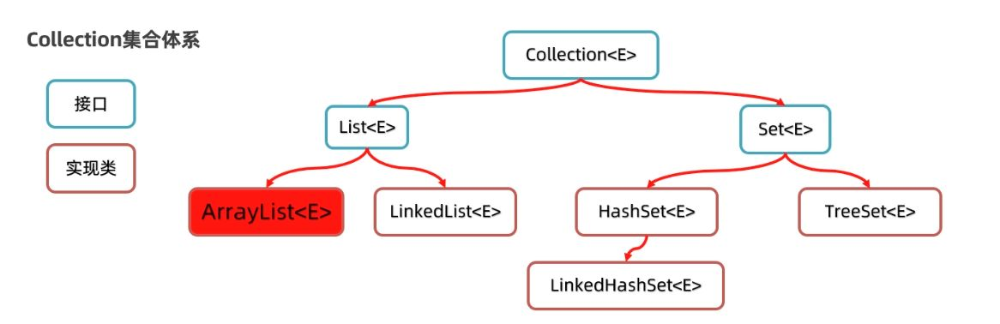
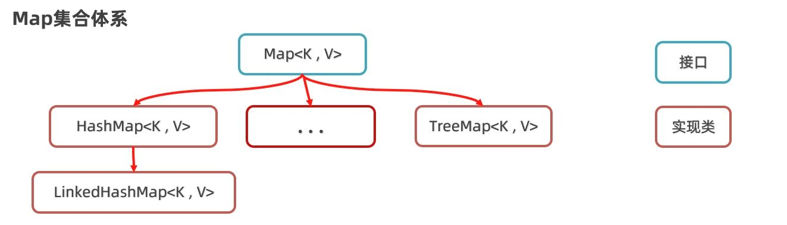

# 集合

集合是一种用来存储数据的容器，和数组类似，但比数组更灵活——集合的容量是可变的，能动态增删元素，因而在实际开发中使用频率极高。

为了满足不同的业务场景，Java 将集合划分为两大体系：

- **Collection**：单列集合，每个元素只有一个值。
- **Map**：双列集合，每个元素由一对键值对组成。

# 单列集合 Collection

Collection 是一个接口，用于定义“集合”的基本行为。它本身不能直接使用，但它下面派生出了两个核心子接口：



- **List**：有序、可重复、支持索引
- **Set**：无序、不重复、不支持索引

这两个接口也不是直接使用的重点，真正落地还得看它们的实现类：

**List 系列**

- `ArrayList`：基于数组，查询快，增删慢，适合查多改少。
- `LinkedList`：基于链表，查询慢，增删快，适合频繁插入删除。

它们都保证**元素有序、可重复、支持索引**，但底层结构不同，性能也有区别，后续再详细分析。

**Set 系列**

- `HashSet`：元素**无序、不可重复**，通过哈希表去重。
- `LinkedHashSet`：在 `HashSet` 基础上，保留了插入顺序。
- `TreeSet`：元素按自然顺序或指定规则**自动排序**，同样不可重复。

实际开发中，常用的集合主要还是 `ArrayList` 和 `HashSet`，其他集合根据具体需求使用。

## 常用方法

在 Java 的集合体系中，`Collection` 是所有单列集合（如 List、Set）的顶级接口，它定义了一批最基础的“增删查改”操作，掌握这些方法，就等于掌握了集合的基本使用套路。

下面按功能分类，逐一演示每个常用方法的使用方式。

#### `add` 增

`add(E e)` 方法用于向集合中添加一个元素。大多数集合类型都支持添加重复元素（如 List），而像 Set 则会自动去重。

```java
Collection<String> wolves = new ArrayList<>();
wolves.add("灰影");
wolves.add("血牙");
wolves.add("灰影"); // 可以重复添加
System.out.println(wolves); // [灰影, 血牙, 灰影]
```

#### `remove` 删

`remove(Object o)` 方法用于删除集合中**首次出现**的指定元素。

```java
wolves.remove("灰影"); // 只会删除第一个灰影
System.out.println(wolves); // [血牙, 灰影]
```

注意，`remove` 不是删除所有相同元素，只删第一个。要删除全部，可以搭配循环或 `removeIf`。

#### `contains` 是否包含

`contains(Object o)` 用于判断集合中是否存在某个元素，相当于“查”操作。

```java
System.out.println(wolves.contains("血牙")); // true
System.out.println(wolves.contains("银狼")); // false
```

#### `size()` 获取大小

返回当前集合中元素的数量。

```java
System.out.println(wolves.size()); // 2
```

#### `isEmpty()` 是否为空

用于判断集合当前是否为空，常用于逻辑判断、避免空操作。

```java
System.out.println(wolves.isEmpty()); // false
wolves.clear();
System.out.println(wolves.isEmpty()); // true
```

#### `clear()` 清空集合

`clear()` 方法会直接清除集合中所有元素，不是逐个删，是一口气清干净。

```java
wolves.add("苍狼");
wolves.add("影牙");
System.out.println(wolves); // [苍狼, 影牙]

wolves.clear();
System.out.println(wolves); // []
```

#### `toArray()` 集合转数组

有时候我们要把集合传递给只接受数组的方法，那就得使用 `toArray()`。它有两个常用版本：

1. **返回 `Object[]` 数组（基础版）**

```java
Collection<String> names = new ArrayList<>();
names.add("云牙");
names.add("雪踪");

Object[] arr = names.toArray();
System.out.println(Arrays.toString(arr)); // [云牙, 雪踪]
```

这返回的是一个 `Object[]` 类型的数组，需要注意类型转换。

2. **转成指定类型数组（推荐方式）**

Java 8 引入的方法引用，可以精确指定目标数组类型：

```java
String[] arr2 = names.toArray(String[]::new);
System.out.println(Arrays.toString(arr2)); // [云牙, 雪踪]
```

这种方式更安全，避免强转风险，也是现代写法推荐使用的形式。

#### `addAll()` 合并

有时候我们需要把两个集合的数据合并，就用 `addAll(Collection<? extends E> c)`。

```java
Collection<String> packA = new ArrayList<>();
packA.add("夜哨");
packA.add("影爪");

Collection<String> packB = new ArrayList<>();
packB.add("雾牙");
packB.add("白爪");

packA.addAll(packB);

System.out.println(packA); // [夜哨, 影爪, 雾牙, 白爪]
```

这个操作**不会去重**，要去重的场景请考虑 `Set` 类型。

## 遍历方式

对于容器而言，**遍历是最基本、最常见的操作之一**。无论你是想查找、统计还是处理数据，都绕不开“把集合里的元素一个个拿出来”。

而在 Collection 体系中，由于大部分集合没有索引（除了 List），所以不能只依赖传统的 `for` 循环。下面我们从通用的 `Iterator` 开始，逐步过一遍所有推荐的遍历方式。

### Iterator 迭代器

`Iterator` 是集合体系中专门用于遍历元素的对象。每一个 Collection 类型的集合都可以通过 `iterator()` 方法获取一个迭代器。

Java 中所有 `Collection` 子类，都可以通过 `.iterator()` 方法获取一个迭代器对象。

```java
Collection<String> wolves = new ArrayList<>();
wolves.add("苍牙");
wolves.add("夜爪");
wolves.add("雾鬃");

// 获取迭代器对象
Iterator<String> it = wolves.iterator();

// 一个个取（不推荐）
System.out.println(it.next()); // 苍牙
System.out.println(it.next()); // 夜爪
System.out.println(it.next()); // 雾鬃
```

此时如果再 `it.next()`，就会抛出：

```text
java.util.NoSuchElementException
```

这种方式太死板，而且容易抛异常。所以我们需要引入改进版本。

**正确方式：**
使用 `hasNext()` + `next()` 循环遍历

```java
Iterator<String> it = list.iterator();
while (it.hasNext()) {
    String ele = it.next();
    System.out.println(ele);
}
```

- **`hasNext()`**：判断是否还有元素
- **`next()`**：获取当前元素，并把迭代器指针移向下一个

看看 `ArrayList` 内部 `Itr` 迭代器的简化源码：

```java
// ArrayList 内部迭代器 Itr 的关键属性：
int cursor; // 指向下一个要访问的元素索引，默认 0
int lastRet = -1; // 上一次访问的索引，-1 表示未访问
```

`hasNext()` 源码：

```java
public boolean hasNext() {
    return cursor != size;
}
```

注意，`hasNext()` 实际问的是当前游标是否越界，而不是“下一个有没有”，这很关键

`next()` 源码逻辑：

```java
public E next() {
    if (cursor >= size) throw new NoSuchElementException();

    Object[] data = ArrayList.this.elementData;
    int i = cursor;
    cursor = i + 1;
    return (E) data[lastRet = i];
}
```

- `cursor` 初始为 0，每次调用 `next()`，就拿当前位置的数据，然后游标后移。如果越界，就会抛出 `NoSuchElementException`。
- 内部使用的是数组访问方式，即使我们没有索引，其实还是“按下标走的”

### 增强 for 循环

增强 `for` 是 Java 对迭代器（`Iterator`）的简化封装，语法更简洁，避免手动处理游标和判断逻辑。它适合**只读遍历**（不修改、不删除集合元素）场景。

**语法格式：**

```java
for (元素类型 变量名 : 集合对象) {
    // 使用变量名操作每个元素
}
```

增强 `for` 是对迭代器的封装，语法更简单，不需要手动获取迭代器对象。

```java
for (String wolf : wolves) {
    System.out.println(wolf);
}
```

这段代码背后实际上调用的是迭代器，只不过被语法糖封装掉了。

```java
for (Iterator<String> it = list.iterator(); it.hasNext();) {
    String name = it.next();
    ...
}
```

> 增强 for 只适合读数据，不能用来修改集合，否则会抛出`ConcurrentModificationException`。

为什么会抛这个异常？来看下关键机制。

迭代器创建时，会把当时的 `modCount` 拍个快照保存到 `expectedModCount`。这个值只在迭代器内部维护，不会自动更新。

```java
int expectedModCount = modCount;
```

只要你调用集合的结构性修改方法（增、删、清空、批量增删），它就会变：

```java
public boolean add(E e) {
    // ... 省略扩容等
    elementData[size++] = e;
    modCount++;          // 任何结构性修改都会 ++
    return true;
}
```

迭代器每次调用 `next()`、`hasNext()` 等方法时，都会检查：

```java
if (modCount != expectedModCount)
    throw new ConcurrentModificationException();
```

一旦发现集合的实际修改次数和当初快照不一致，就会立刻抛异常。

这就是所谓的 **快速失败（fail-fast）** 机制——用来避免在遍历过程中集合结构被外部改动导致的不可预期结果。

### Lambda 表达式遍历

从 JDK 8 开始，`Collection` 接口新增了 `forEach` 默认方法，配合 Lambda 表达式，让遍历写法更简洁。

```java
wolves.forEach(new Consumer<String>() {
    @Override
    public void accept(String wolf) {
        System.out.println(wolf);
    }
});
```

Lambda 简化写法：

```java
wolves.forEach(wolf -> System.out.println(wolf));
```

方法引用（进一步简化）：

```java
wolves.forEach(System.out::println);
```

我们并不是自己去遍历集合，而是把“打印逻辑”封装成函数交给系统，**由集合内部帮我们去遍历并回调处理逻辑**：

```java
default void forEach(Consumer<? super T> action) {
    for (T t : this) {
        action.accept(t);
    }
}
```

这就是“别人帮我们一只只把对象送过来，我们只管处理”——遍历的主控权从开发者交到了集合自身。

## 集合的并发修改异常

在使用 **迭代器** 遍历集合的同时，如果试图直接对集合进行修改（例如删除元素），就会引发 `ConcurrentModificationException` 异常。

这个“并发”指的并不是多线程，而是一边遍历集合，一边修改集合结构/增删元素。

**异常触发机制**

来看 `ArrayList` 的源码片段。在调用迭代器的 `next()` 方法时，内部会执行 `checkForComodification()` 检查集合是否被修改：

```java
public E next() {
    checkForComodification(); // 核心检查
    return (E) elementData[lastRet = cursor++];
}
```

关键方法是这个：

```java
final void checkForComodification() {
    if (modCount != expectedModCount)
        throw new ConcurrentModificationException();
}
```

其中：

- `modCount` 是集合本身的修改次数。
- `expectedModCount` 是迭代器初始化时记录的值。

一旦集合结构发生变化（比如调用了 `remove()`、`clear()` 等方法），`modCount` 就会增加。但如果你是通过集合自身来删除元素，迭代器并不会知道这一变动，于是检测到 `modCount != expectedModCount`，就直接抛出异常。

例如，集合中的 `remove()` 实际上内部会修改 `modCount`：

```java
private void fastRemove(Object[] es, int i) {
    modCount++; // 每次删除都会修改
    final int newSize;
    if ((newSize = size - 1) > i)
        System.arraycopy(es, i + 1, es, i, newSize - i);
    es[size = newSize] = null;
}
```

同样，`clear()` 也会直接修改 `modCount`：

```java
public void clear() {
    modCount++;
    final Object[] es = elementData;
    for (int to = size, i = size = 0; i < to; i++)
        es[i] = null;
}
```

因此，只要你在遍历过程中直接调用这些修改方法，**modCount 和 expectedModCount 不一致**，异常就会抛出。

### 迭代器的删除方法

要避免异常，就必须使用迭代器的 `remove()` 方法，而不是集合本身的删除方法。

```java
Iterator<String> it = list.iterator();
while (it.hasNext()) {
    String name = it.next();
    if (name.contains("枸杞")) {
        // list.remove(name); // ❌ 错误，直接操作集合
        it.remove(); // ✅ 正确，使用迭代器自身的删除
    }
}
```

迭代器的 `remove()` 方法会同步更新 `expectedModCount`，也会处理 `cursor` 的回退，因此不会抛出异常。

这套机制逻辑是清晰而合理的，关键点就是：**迭代器负责遍历，就交给它处理删除。**

这是最推荐的做法：使用迭代器 + it.remove()，最稳定、最安全。

### 其他的删除方法

**增强 for 循环删除**

```java
for (String name : list) {
    if (name.contains("枸杞")) {
        list.remove(name); // ❌ 一定会报错
    }
}
```

增强 for 本质上是基于迭代器实现的遍历，但我们拿不到那个迭代器对象，因此也就无法调用 `it.remove()`。想在循环体内直接删元素，结果就是触发并发修改异常，**无法解决**。

所以，增强 for **适合只读遍历，不适合删除操作**。

**Lambda 表达式删除**

```java
list.forEach(name -> {
    if (name.contains("枸杞")) {
        list.remove(name); // ❌ 也会报错
    }
});
```

Lambda 的底层实现同样是基于迭代器，而且是增强 for 那一套。

看源码：

```java
public void forEach(Consumer<? super E> action) {
    Objects.requireNonNull(action);
    final int expectedModCount = modCount;
    final Object[] es = elementData;
    final int size = this.size;
    for (int i = 0; modCount == expectedModCount && i < size; i++)
        action.accept(elementAt(es, i));
    if (modCount != expectedModCount)
        throw new ConcurrentModificationException();
}
```

如上，只要 `modCount` 被改动（比如删除了元素），循环终止并抛出异常。

**倒序 for 删除（仅限 ArrayList）**

如果真的非要边遍历边删，又不想用迭代器，在 `ArrayList` 这类支持索引的集合中，可以考虑倒序 for：

```java
for (int i = list.size() - 1; i >= 0; i--) {
    if (list.get(i).contains("枸杞")) {
        list.remove(i);
    }
}
```

这种方式可以避免元素索引错位的问题。但写起来略显繁琐，而且容易出错。一般不推荐使用，除非你知道自己在做什么。

# 单列有序 List

List 是 Collection 的子接口，它除了继承单列集合的基本功能（增删查改），还**具备“索引”这一特性**，可以像数组一样通过位置访问或修改元素。

这使得它在处理有序数据时，比其他集合更灵活。

## 特有方法

List 的特有方法大多都支持索引操作

#### add 增

`add(int index, E element)` 允许在集合中间插入元素，自动后移原位置及其后的所有元素。

```java
List<String> wolves = new ArrayList<>();
wolves.add("影牙");
wolves.add("雪爪");
wolves.add("赤瞳");
wolves.add("苍风");

System.out.println(wolves);
// [影牙, 雪爪, 赤瞳, 苍风]
```

现在要新增“夜哨”排在“雪爪”前头：

```java
wolves.add(1, "夜哨");
System.out.println(wolves);
// [影牙, 夜哨, 雪爪, 赤瞳, 苍风]
```

位置计算是从 0 开始的，“1” 就是“夜哨”之前。

#### `remove(int index)` 删除元素

这种删除方式比 `remove(Object o)` 更直接——**你告诉它第几位，它就动手砍第几位**。

```java
wolves.remove(2); // 移除“周芷若”
System.out.println(wolves);
// [张无忌, 赵敏, 小昭, 殷素素]
```

> 如果索引越界，会直接抛出 `IndexOutOfBoundsException`，所以动态操作前最好用 `size()` 判断一下集合长度。

#### `set(int index, E element)` 替换元素

如果想要“修改”集合中的某个数据，而不是删除再添加，可以使用 `set()`：

```java
wolves.set(2, "黑焰"); // 把“赤瞳”替换成“黑焰”
System.out.println(wolves);
// [影牙, 夜哨, 黑焰, 苍风]
```

这个方法还会返回被替换掉的那个元素，如果你要留个备份，也方便处理。

#### `get(int index)` 获取元素

要读取集合中的某一只狼，用 `get()`：

```java
String scout = wolves.get(1);
System.out.println(scout); // 夜哨
```

这是 List 最重要的差异点之一——能像数组一样用下标访问元素，而不像 Set 那样只能遍历。

明白，我们继续保持风格一致：**用狼群的例子贯穿、逻辑清晰、语言简洁流畅但不啰嗦、代码块穿插解释**。以下是你要的「遍历方式」笔记整理版：

## 遍历方式

List 因为有“索引”，所以比 Set 多了一种遍历方式，下面我们从最传统的方式讲起。

### 普通 `for` 循环

这是最基础的方式，可以访问索引，适合需要知道位置或修改某一项的场景。

```java
List<String> wolves = new ArrayList<>();
wolves.add("影牙");
wolves.add("夜哨");
wolves.add("赤瞳");

for (int i = 0; i < wolves.size(); i++) {
    String name = wolves.get(i);
    System.out.println(name);
}
// 输出：影牙 夜哨 赤瞳
```

优点是你能拿到下标 `i`，缺点是写法相对繁琐。

### 迭代器 Iterator

几乎所有的 Collection 类型都支持迭代器，是最“保险”的遍历方式。

```java
Iterator<String> it = wolves.iterator();
while (it.hasNext()) {
    String wolf = it.next();
    System.out.println(wolf);
}
// 输出：影牙 夜哨 赤瞳
```

优点是**通用、可安全删除元素**，缺点是写起来啰嗦，日常开发中用得较少，更多用于需要手动控制遍历流程的情况。

### 增强 `for-each` 循环

语法简洁，代码清爽，是绝大多数业务场景下的首选方式。

```java
for (String wolf : wolves) {
    System.out.println(wolf);
}
// 输出：影牙 夜哨 赤瞳
```

缺点是你拿不到下标，不能直接修改某一位置的值（但可以整体替换）。

### Lambda 表达式

Java 8 之后推荐的新写法，适合需要链式处理、过滤等操作的场景。

```java
wolves.forEach(wolf -> System.out.println(wolf));
// 输出：影牙 夜哨 赤瞳
```

语法极简，但不适合复杂流程控制，比如需要 `break`、`continue` 的时候就无能为力了。

# List 实现类的区别

虽然`ArrayList` 和 `LinkedList`用法几乎一模一样（都是 `List` 的实现类），但底层结构不同、适用场景也完全不同。

开发中，如果没有明确性能瓶颈，优先考虑 `ArrayList`，因为它使用更广泛，维护简单。除非你确定需要处理大量插入删除操作或有特定结构要求，才建议用 `LinkedList`。

我们分开来看——

# 动态数组 ArrayList

`ArrayList` 的底层，是一块**连续存储的动态数组**。这一点决定了它的几个核心特性：

- **查询快（尤其是按索引）**

数组寻址时，JVM 直接通过地址 + 下标偏移定位：

> 要第 5 个元素？偏移 4 个单位直接拿，不需要从头数。  
> 所以 `get(index)` 是极快的，时间复杂度 O(1)。

数组为什么从 0 开始？  
因为第 0 个位置就是数组首地址，不用偏移；  
第 n 个元素直接计算 `base + n * size`，更快，**更贴近硬件逻辑**。

- **增删慢（尤其是中间位置）**

插入、删除时，会出现两种“麻烦”：

1. 插入一个元素时，**可能要搬动后面的所有元素往后挪**；
2. 删除一个元素时，**也可能要把后面的全部搬过来填空**。

```java
List<String> wolves = new ArrayList<>();
wolves.add("影牙");
wolves.add("夜哨");
wolves.add("赤瞳");

// 在中间插入，会触发“搬家”操作
wolves.add(1, "白霜");
System.out.println(wolves);
// [影牙, 白霜, 夜哨, 赤瞳]
```

你插进去一个“白霜”，后面的狼都要依次向后挪个位置，谁都嫌烦。

- **容量不足时，会自动扩容（但代价不低）**

默认创建的 `ArrayList`，初始容量是 0：

```java
List<String> list = new ArrayList<>();
// 添加第一个元素时，触发扩容：默认变成长度 10 的数组
```

当空间不够时，集合会进行“自动扩容”：

- 一次加一个元素时，空间满了会**扩容为原来的 1.5 倍**
- 如果你一次性添加多个元素，**扩容长度以实际需要为准**

这些扩容操作，底层是通过 **新建一个更大的数组 + 拷贝旧数据过去** 实现的。

```java
// 底层源码（只留关键）：
private static final int DEFAULT_CAPACITY = 10;
private transient Object[] elementData;
```

所以频繁插入、删除，尤其是数据量大的时候，**`ArrayList` 的性能会急剧下滑**。

因此，如果预估到元素数量，可以在初始化时**指定初始容量**，以减少扩容次数：

```java
List<String> list = new ArrayList<>(20);
```

这样能直接分配出足够空间，避免反复拷贝带来的性能消耗。

# 双向链表 LinkedList

`LinkedList` 的底层是一种**双向链表结构**。和 `ArrayList` 相比，它不依赖连续内存空间，节点之间通过指针连接，独立存在。

每个节点内部维护三部分：

- 上一个节点的地址（`prev`）
- 当前元素的值（`item`）
- 下一个节点的地址（`next`）

这种结构决定了它与 `ArrayList` 的根本差异。

- **查询慢（不能跳着查）**

因为没有“索引寻址”能力，链表必须**一个个节点顺着找**：

```java
List<String> wolves = new LinkedList<>();
wolves.add("影牙");
wolves.add("夜哨");
wolves.add("赤瞳");

String name = wolves.get(2); // 会从头开始查
System.out.println(name); // 赤瞳
```

无论你要查第几个元素，它都得从头节点开始数（或者从尾节点开始数，取决于离哪边近）。

时间复杂度是 O(n)，**越往后查，越慢**。

- **增删效率高（特别是首尾）**

新增或删除元素时，只需要改几个节点的指针，不涉及数组整体的迁移或扩容。

```java
wolves.addFirst("银背");
wolves.addLast("裂爪");

System.out.println(wolves);
// [银背, 影牙, 夜哨, 赤瞳, 裂爪]

wolves.removeFirst();
wolves.removeLast();

System.out.println(wolves);
// [影牙, 夜哨, 赤瞳]
```

这对需要频繁首尾操作的场景极其有利，**时间复杂度为 O(1)**。

## 特有方法（首尾操作）

`LinkedList` 相比于普通的 `List`，多了一些专门用来处理“首尾位置”的方法。这类方法不需要你去计算下标，更适合当链表被用作队列或栈来使用。

### `addFirst/Last()` 插入

这两个方法分别把元素加到链表的最前面或最后面。相比用 `add(0, e)` 或 `add(size, e)`，这种方式更清晰，也更符合链表的用法习惯。

```java
LinkedList<String> wolves = new LinkedList<>();
wolves.add("雪爪");
wolves.addLast("影牙");
wolves.addFirst("夜哨");

System.out.println(wolves);
// [夜哨, 雪爪, 影牙]
```

- `addFirst` 把元素插在最前头
- `addLast` 等同于普通的 `add()`，插在最后

适合用在双端队列、任务调度、栈结构等场景。

### `getFirst/Last()` 查

如果你只是想**读取**第一个或最后一个元素，而不做修改，用这两个方法最方便。

```java
System.out.println(wolves.getFirst()); // 夜哨
System.out.println(wolves.getLast());  // 影牙
```

比用 `get(0)` 和 `get(size - 1)` 更直观。

> 注意：如果链表是空的，这两个方法会抛出 `NoSuchElementException`。建议先用 `isEmpty()` 检查一下。

### `removeFirst/Last()` 删除

这两个方法会移除并返回链表的第一个或最后一个元素。

```java
wolves.removeFirst(); // 移除“夜哨”
wolves.removeLast();  // 移除“影牙”

System.out.println(wolves);
// [雪爪]
```

删除的同时还能拿到被移除的元素，如果你还想处理它（比如打印、记录日志等），也方便。

总的来说：

- 这类方法语义更明确，写起来比操作下标更清楚；
- 在用 `LinkedList` 构建“先进先出”或“后进先出”的结构时，会非常常用；
- 也能让代码更少出错，逻辑更自然。

## `LinkedList` 模拟数据结构

`LinkedList` 的结构天然适合模拟两类最常见的数据结构：

- 队列（Queue）：先进先出 FIFO
- 栈（Stack）：后进先出 FILO

### 队列

队列（Queue）适合排队处理场景，例如：消息队列、任务调度、打印任务等。

用 `LinkedList` 来实现非常直接——

- **入队（添加）**：`addLast()`
- **出队（取出）**：`removeFirst()`

```java
LinkedList<String> queue = new LinkedList<>();

// 狼群排队进入猎场
queue.addLast("灰影");
queue.addLast("刃牙");
queue.addLast("影爪");

// 出队执行任务
System.out.println(queue.removeFirst()); // 灰影
System.out.println(queue.removeFirst()); // 刃牙
```

此结构**只处理两端，不关心中间**，性能稳定，O(1) 操作。

### 栈

栈（Stack）适合撤销操作、符号匹配、递归调用记录等逻辑。

Java 虽然有 `Stack` 类，但其实它早已过时，**推荐使用 `LinkedList` 模拟**，更轻便。

- **入栈（压栈）**：`push()` 等价于 `addFirst()`
- **出栈（弹栈）**：`pop()` 等价于 `removeFirst()`

```java
LinkedList<String> stack = new LinkedList<>();

// 狼群进入密林执行任务
stack.push("夜牙");
stack.push("沉影");
stack.push("雷蹄");

System.out.println(stack.pop()); // 雷蹄（最后压栈的先出来）
System.out.println(stack.pop()); // 沉影
```

这些方法的底层就是：

```java
public void push(E e) {
    addFirst(e);
}

public E pop() {
    return removeFirst();
}
```

开发中，如果没有明确性能瓶颈，优先考虑 `ArrayList`，因为它使用更广泛，维护简单。除非你确定需要处理**大量插入删除操作**或有**特定结构要求**，才建议用 `LinkedList`。

## 手写 `LinkedList`（单链表）

如果说 `ArrayList` 是一块连续的地基，那 `LinkedList` 更像是一条一节节拼接起来的链。我们先实现一个**单向链表**，也就是每个节点只知道下一个节点。

1. **定义节点类 `Node`**

链表的核心是节点，首先需要定义一个**内部静态类** `Node`，用来封装数据和指向下一个节点的引用。

```java
public static class Node<E> {
    E item;          // 当前节点存储的数据
    Node<E> next;    // 指向下一个节点的引用

    public Node(E item, Node<E> next) {
        this.item = item;
        this.next = next;
    }
}
```

- `item` 表示当前节点存的数据；`next` 是连接下一个节点的指针。
- 每次新增节点时，都会通过构造函数传入数据和下一个节点的引用。

2. **定义链表结构**

在链表类中，我们维护两个关键变量：

```java
private int size = 0;
private Node<E> first; // 头指针，指向链表第一个节点
```

- `size` 用来记录当前链表元素个数；
- `first` 是链表的起点，初始为 `null`。

3. **实现方法**

我们希望像 `List` 一样支持 `add()` 方法，这里我们只考虑尾部添加元素的情况（即 append）。

```java
public boolean add(E e) {
    Node<E> newNode = new Node<>(e, null); // 创建新节点

    if (first == null) {
        // 链表为空，直接把新节点设为头
        first = newNode;
    } else {
        // 链表不为空，遍历到最后一个节点
        Node<E> temp = first;
        while (temp.next != null) {
            temp = temp.next;
        }
        temp.next = newNode; // 将新节点挂在最后一个节点之后
    }

    size++; // 维护 size
    return true;
}
```

- 一定**不要直接操作 `first` 指针**，否则可能丢失链表起点。
- 所以我们用 `temp` 临时变量去遍历，确保头指针不被破坏。

实现 `size()` 方法，记录链表当前元素数量：

```java
public int size() {
    return size;
}
```

这个方法不需要遍历链表，而是直接返回维护的计数变量 `size`，性能更优。

为了方便查看链表结构，我们重写 `toString()` 方法，用 `StringJoiner` 来拼接输出结果：

```java
@Override
public String toString() {
    StringJoiner sb = new StringJoiner(",", "[", "]");
    Node<E> temp = first;

    while (temp != null) {
        sb.add(String.valueOf(temp.item));
        temp = temp.next;
    }

    return sb.toString();
}
```

输出示例：

```java
[狼牙, 雪爪, 赤瞳]
```

- 链表通过节点一节节连接，新增时需遍历到尾部；
- 不要直接修改 `first` 指针，用临时变量遍历；
- 手写结构时，养成拆解步骤、维护状态的习惯，比如 `size++`。

## Set

`Set` 是 Java 中另一种常用的集合类型。它的最大特点是：**不重复**。

除此之外，`Set` 还有两个很重要的特性：

- **无序**：添加和取出的顺序不一定一致；
- **无索引**：不能通过下标访问元素，只能遍历。

常见实现类如下：

| 类型            | 是否唯一 | 是否有序 | 是否可索引 | 特点说明             |
| --------------- | -------- | -------- | ---------- | -------------------- |
| `HashSet`       | ✔ 不重复 | ✖ 无序   | ✖ 无索引   | 最常用，基于哈希表   |
| `LinkedHashSet` | ✔ 不重复 | ✔ 有序   | ✖ 无索引   | 插入顺序可控         |
| `TreeSet`       | ✔ 不重复 | ✔ 排序   | ✖ 无索引   | 自动排序，基于红黑树 |

`Set` 系列基本继承自 `Collection` 接口，所以它常用的方法都来自 `Collection`，自己没怎么新增额外功能。

## HashSet

`HashSet` 是 `Set` 接口最常用的实现类，它完美继承了 Set 的三大特性：

- 不重复
- 无序
- 无索引

这就是一个原汁原味的 `Set` ——不讲秩序，不讲位置，只讲唯一性。

```java
Set<String> wolves = new HashSet<>();
wolves.add("影牙");
wolves.add("影牙");
wolves.add("雪爪");
wolves.add("夜哨");
wolves.add("夜哨");
wolves.add("赤瞳");
wolves.add("小昭");

System.out.println(wolves);
// 输出顺序可能是：[赤瞳, 夜哨, 小昭, 影牙, 雪爪]
```

可以看到：

- 重复元素自动去重
- 元素的输出顺序和添加顺序不一致

**元素不重复 ——靠的是哈希值 + equals 判断**

在加入元素前，`HashSet` 会先调用元素的 `hashCode()` 方法获取哈希值，再根据哈希值决定存储位置。

如果该位置已有元素，会进一步调用 `equals()` 判断是否“内容相等”，只有不相等才会真正插入。

所以：

- **哈希值一致但 equals 不相等**：允许插入（哈希碰撞）
- **哈希值一致且 equals 相等**：不插入，判定为重复

**元素无序 ——因为哈希算法决定了存储位置**

`HashSet` 不是按添加顺序存储元素的，而是通过哈希值计算出元素存放的数组下标位置。这个过程本身就带有“打乱顺序”的效果。

**没有索引 ——底层结构不是连续数组，而是哈希表**

因为不是线性结构，所以也就不存在“第几个元素”这个概念，不能用 `get(i)` 访问。

### 哈希值（HashCode）

要理解 `HashSet` 怎么做到这些事的，就得先聊聊它的底层：**哈希表**。

哈希值是一个 `int` 类型的整数，用来快速判断两个对象是否“可能相等”。Java 中，**每个对象都默认有一个哈希值**，它来自 `Object` 类的 `hashCode()` 方法：

```java
public int hashCode()
```

哈希值的特点如下：

- 同一个对象，多次调用 `hashCode()` 值相同；
- 不同对象，哈希值大概率不同，但也可能相同（叫哈希碰撞）。

因为 `int` 只有 32 位，最多也就 42 亿多个可能值，肯定有不同对象“撞号”的情况，这叫哈希碰撞。因此，`HashSet` 判重时要先比哈希值，再用 `equals()` 进一步确认。

### 底层实现

**JDK 8 之前的数组加链表**

> HashSet 的底层其实是一个 **HashMap**，只不过只用了键（key），值固定为一个常量对象。

构造时，会初始化一个默认长度为 **16** 的数组，称为哈希桶，这个“桶”就是用来装元素的空间。

默认负载因子是 **0.75**，它的含义是：**当填满了数组容量的 75% 时就进行扩容（即数组翻倍）**。比如默认初始容量是 16，当放入了第 13 个元素时就会触发扩容。

添加元素时的流程如下：

1. 调用元素的 `hashCode()`，计算哈希值
2. 用位运算 `hash & (length - 1)` 来确定数据存放的位置（效果等同于“哈希值对数组长度取模”，但效率更高）

   > （你理解没错，底层确实是使用位运算替代求模，原理就是快速将哈希值压缩到数组范围内）

3. 如果该位置为 `null`，直接插入
4. 如果已有元素，则比较 `equals()` 是否相等

   - 相等：不插入（视为重复）
   - 不相等：挂在该位置形成“链表”

**JDK 8 之后引入红黑树的优化**

如果某个桶的链表长度太长，会影响性能。于是 Java 当链表长度超过 **8** 且数组容量 >= **64**，会把链表转成 **红黑树** 来提升查询性能。

红黑树的结构主要是：小的往左、大的往右，能显著减少查找时间。

优点：

- 增删查快，平均时间复杂度接近 O(1)；
- 插入判断效率高，适合去重、快速查找。

缺点：

- 无序，结果顺序不可预测；
- 不适合需要精确控制顺序或索引的场景。

总之 `HashSet` 是一个**去重神器**，底层基于哈希表，用来快速判断元素是否存在，非常适合处理集合关系、去重判断等场景。
但如果想要顺序一致、元素排序，`LinkedHashSet`或者`TreeSet`会更合适。

### 去重机制

在计算机里，人类早就有“快速查找”的灵感来源——**字典**。  
如果按页码或拼音顺序存储，查找效率会比一页页翻快得多。`HashSet` 就是基于类似的思想，用哈希表来快速存储和查找元素。

但在开发中，我们不仅仅会存储简单数据类型，还会处理**对象**。  
那么问题来了：**`HashSet` 能不能去重对象？**

我们创建一个 `Wolf` 类，表示一只狼，包括名字、性别和爱好：

```java
import java.util.HashSet;
import java.util.Objects;
import java.util.Set;

public class HashSetWolfTest {
    public static void main(String[] args) {
        Set<Wolf> pack = new HashSet<>(); // 无序、不重复、无索引

        Wolf w1 = new Wolf("银牙", '公', "守护领地");
        Wolf w2 = new Wolf("黑风", '公', "追逐猎物");
        Wolf w3 = new Wolf("月影", '母', "在月光下嚎叫");
        Wolf w4 = new Wolf("月影", '母', "在月光下嚎叫"); // 内容相同

        pack.add(w1);
        pack.add(w2);
        pack.add(w3);
        pack.add(w4);

        System.out.println(pack);
    }
}

class Wolf {
    String name;
    char sex;
    String hobby;

    public Wolf(String name, char sex, String hobby) {
        this.name = name;
        this.sex = sex;
        this.hobby = hobby;
    }
}
```

运行结果：**集合中依然会出现两只相同的“月影”**。  
原因很简单：**`HashSet` 判断是否重复，首先比哈希值，再比 equals**。  
而我们没有重写 `hashCode()` 和 `equals()`，所以即使属性完全相同，两个对象的哈希值也不同，被当成了不同元素。

**重写 `hashCode()` 和 `equals()`**

要让内容相同的对象被认为是同一个，就需要**同时重写 `equals()` 和 `hashCode()`**。

```java
@Override
public boolean equals(Object o) {
    if (this == o) return true; // 比较地址值,确认是否为同一对象
    if (o == null || getClass() != o.getClass()) return false; // 确保类型相同可比
    Wolf wolf = (Wolf) o;
    return sex == wolf.sex &&
           Objects.equals(name, wolf.name) &&
           Objects.equals(hobby, wolf.hobby);
}

@Override
public int hashCode() {
    return Objects.hash(name, sex, hobby);
}
```

- **只重写 `equals()`**：哈希值不同，直接进了不同桶，不会触发 `equals()` 比较。
- **只重写 `hashCode()`**：哈希值相同会进同一桶，但 `equals()` 认为不相等，依然会插入。
- **两个都重写**：哈希值相同进入同一桶，然后 `equals()` 确认内容相同，直接拒绝插入，从而实现去重。

## LinkedHashSet

`LinkedHashSet` 是 `HashSet` 的“有序版本”：

- **有序**：按插入顺序迭代元素
- **不重复**
- **无索引**

源码片段：

```java
// 双链表头（最早插入的）
transient LinkedHashMap.Entry<K,V> head;

// 双链表尾（最近插入的）
transient LinkedHashMap.Entry<K,V> tail;

static class Entry<K,V> extends HashMap.Node<K,V> {
    Entry<K,V> before, after; // 前驱、后继
    Entry(int hash, K key, V value, Node<K,V> next) {
        super(hash, key, value, next);
    }
}
```

可见，`Entry` 继承了 `HashMap.Node`，并增加了 `before` 和 `after`，用于维护插入顺序的双向链表指针。

`LinkedHashSet` 的底层还是用的 **哈希表**，所以它具备 `HashSet` 的大部分特性（比如插入、查找效率高、不重复、无索引等）。

**那为什么能“有顺序”呢？**

关键点在于：**它在哈希表的基础上，又加了一条链 —— 双向链表，用来记录每个元素插入的先后顺序。**

也就是说，每个元素除了放在哈希桶（数组）中，还额外维护了一个前驱和后继指针，形成一条“逻辑顺序链”。

- 哈希表：保证增删查效率（接近 O(1)）
- 双向链表：维护插入顺序

## 树结构

`TreeSet` 底层是红黑树，而红黑树就是一种特殊的二叉树。所以咱们必须先把树和二叉树搞个大概清楚——不需要全懂，但得知道基本长啥样、为啥要它。

### 树与二叉树

树是一种非线性的数据结构，特点是：**一对多、层级分明、没有环**。

而我们最常接触的是二叉树 —— 也就是：**每个节点最多只有两个子节点**，这两个子节点分别叫“左子节点”和“右子节点”。

每个节点通常包含以下几个信息：

- 父节点的地址（实际编程中不常直接用）
- 当前节点的值
- 左子节点的引用
- 右子节点的引用

以下是一些概念扫一眼就行:

- **度**：一个节点拥有的子节点数量，二叉树中每个节点度都 ≤ 2
- **树的高度**：从根节点到底部最长路径的层数
- **根节点**：树的最顶层节点
- **子节点 / 子树**：某个节点下的分支，往左是“左子树”，往右是“右子树”

这些名词主要是用于描述结构，并不直接影响编程实现。

### 二叉查找树

我们关心的不是“树”本身，而是它能干嘛。二叉查找树（Binary Search Tree / BST）的核心目的就是：**让查找变快**。

它的核心规则：

- 小的往左放
- 大的往右放
- 一样的不放（Java 的 TreeSet 就是这样）

所以一旦插入了一个数据，它的相对位置就确定了，后续查找可以利用这个规则快速定位。

> 需要注意 `TreeSet` 和 `TreeMap` 本身就是有序 + 去重的集合。

插入时会通过比较器（`Comparable` 或 `Comparator`）判断两个元素是否“相等”。如果结果是相等的，就不再插入。查找树的结构本身也要求每个节点唯一，不然会破坏规则。

**查找快的关键:**

它可以用“折半”的方式查数据（像二分查找一样）！
比如你找某个值，每次都能排除一半区域，查找效率就是 O(log n)，很快。

- **查找树的最大问题：容易“歪”**

比如你依次插入这组有序数据：

```text
7 → 10 → 11 → 12 → 13
```

按照“小的左，大的右”的规则，插出来的树是这样的：

```
7
 \
  10
    \
     11
       \
        12
          \
           13
```

这不就变成一条**斜着的链表**了吗？

这样一来，查找效率就退化成 O(n)，跟用 ArrayList 查没区别，甚至还更慢。

### 平衡二叉树

为了解决“单边树”的问题，**平衡二叉树（Balanced BST）**被提了出来。

它的思路是：

> 在不破坏“小的左，大的右”这个查找规则的前提下，让整棵树尽可能矮一点，左右尽量对称。

操作方式就是“旋转”：左旋 / 右旋。结构上动一动，整体就平衡了。

思路也简单粗暴：

核心操作是：**左旋 / 右旋** —— 通过旋转，把结构“扶正”。

比如下面这棵树是平衡的（中心节点是 11）：

```
    11
   /  \
  7   13
 /      \
5        15
```

你可以看到，不论是左边子树还是右边子树，**高度差不超过 1**，这就是“平衡”的定义。

### 红黑树

红黑树（Red-Black Tree）是一种带平衡机制的二叉查找树。当插入或删除节点导致结构不平衡时，它会通过自己旋转结构 + 改颜色的方式调整回“接近平衡”。

红黑树引入了一个“颜色”标记（红 / 黑），并遵循几条强约束规则：

1. 根节点必须是黑色
2. 所有叶子节点（null）都看作是黑色
3. 红节点不能连着红节点
4. 从任一节点到其所有叶子节点的路径，黑节点数量相同

这些规则组合起来，可以控制红黑树的结构在插入/删除时不会严重偏斜，也不会太高。

```
        11B
       /   \
     7R     13R
    / \     /
  5B 9B   12B
```

`B` 表示黑色节点，`R` 表示红色节点。
这是一个红黑树满足约束规则的例子。它的存在意义就是：不管插入顺序多混乱，它都会自动保持树结构的平衡性，不用我们手动旋转。

`TreeSet` 就是基于红黑树实现的集合结构。

它的特点也就来自于红黑树：

- 会自动排序（因为是查找树）
- 查找快（因为是平衡的）
- 不允许重复元素（插入相等的就不放）

树的具体实现不用刻意记，但得知道为什么 `TreeSet` 插入快、还能排好序——靠的就是它底下这棵会自己长正的红黑树。

## TreeSet

`TreeSet` 是一个**无重复、无索引、可排序**的集合，默认按照元素的自然顺序（升序）排列。  
它底层基于红黑树实现，插入和查找性能都比较稳定，时间复杂度约为 O(log n)。

- **无重复**：和其他 Set 一样，不允许重复元素。
- **无索引**：不像 List 可以通过下标访问元素。
- **可排序**：元素按升序排列（默认）。

`TreeSet` 的排序规则因元素类型不同而异：

- **数值类型**（如 `Integer`、`Double`）默认按照数值大小升序排序。
- **字符串类型** 默认按 Unicode 编码顺序排序，即首字符的编码顺序。
- **自定义类型** 需要自己定义排序规则，否则无法直接存储。

`TreeSet` 存储自定义对象时，必须指定排序规则，常用的两种方式：

- **方式一：实现 `Comparable` 接口**

让自定义类实现 `Comparable`，重写 `compareTo()` 方法，指定自身排序规则。

```java
public class Girl implements Comparable<Girl> {
    private String name;
    private int age;
    private double height;

    // 构造器、省略 getter/setter

    @Override
    public int compareTo(Girl other) {
        return Double.compare(this.height, other.height); // 按身高升序
    }
}
```

然后用无参构造器创建 `TreeSet`：

```java
Set<Girl> set = new TreeSet<>();
```

- **方式二：传入 `Comparator` 比较器**

通过带参构造器，传入一个比较器对象，指定自定义排序逻辑：

```java
Set<Girl> set = new TreeSet<>(new Comparator<Girl>() {
    @Override
    public int compare(Girl o1, Girl o2) {
        // 按身高降序排序
        return Double.compare(o2.getHeight(), o1.getHeight());
    }
});
```

添加元素：

```java
set.add(new Girl("赵敏", 21, 169.5));
set.add(new Girl("刘亦菲", 34, 167.5));
set.add(new Girl("李若彤", 26, 168.5));
set.add(new Girl("章若楠", 19, 171.5));
set.add(new Girl("杨幂", 34, 172.5));

System.out.println(set);
```

结果会按照指定的比较器规则排序，且无重复。

好的，我看到了你的修改和括号备注，让我按照你的要求重新整理这部分：

# Collections 工具类

Collections 是一个用来操作集合的工具类，提供了许多实用的静态方法来简化集合操作。

### `addAll` 批量添加

```java
public static <T> boolean addAll(Collection<? super T> c, T... elements)
```

可以一次性为集合添加多个元素，比逐个调用 `add` 方法更高效。

```java
List<String> wolves = new ArrayList<>();
Collections.addAll(wolves, "影牙", "夜哨", "雪爪", "赤瞳");
System.out.println(wolves); // [影牙, 夜哨, 雪爪, 赤瞳]
```

**可变参数**

这里的`...`就是可变参数，它是一种特殊的形参，定义在方法、构造器的形参列表里，格式是：

```Java
数据类型...参数名称
```

可变参数可以不传数据给它；可以传一个或者同时传多个数据给它；也可以传一个数组给它。
它常常用来灵活地接收数据，让方法调用更加便捷。

例如，求任意个整数数据的和。

```java
// 可以不传参数
sum();

// 可以传一个参数
sum(10);

// 可以传多个参数
sum(20, 15, 32, 100);

// 可以传一个数组
sum(new int[]{10, 20, 30, 40});
```

可变参数在方法内部本质就是一个数组。

```java
public static void sum(int... nums) {
    System.out.println("个数：" + nums.length);
    System.out.println("内容：" + Arrays.toString(nums));
}
```

Java 的严谨性要求我们注意以下两点：

- 可变参数在形参列表中只能出现一个
- 可变参数必须放到形参列表的最后面

### `shuffle` 打乱顺序

```java
public static void shuffle(List<?> list)
```

方法可以随机打乱 List 集合中元素的顺序，底层基于随机数来交换索引位置。

```java
Collections.shuffle(wolves);
System.out.println(wolves); // 顺序随机变化
```

> 注意这个方法只适用于 List 集合，因为 Set 的顺序是计算出来的，无法打乱。

### `sort` 排序

```Java
public static <T> void sort(List<T> list)
```

方法可以对 List 集合中的元素进行升序排序。

```java
List<Wolf> pack = new ArrayList<>();
pack.add(new Wolf("影牙", 5));
pack.add(new Wolf("夜哨", 3));
pack.add(new Wolf("雪爪", 7));

Collections.sort(pack); // 需要 Wolf 类实现 Comparable 接口
System.out.println(pack);
```

**排序规则定义**

同样的要让自定义对象能够排序，需要定义比较规则，还是前面就提到过的方法：

**方式一：实现 Comparable 接口**

让自定义类实现 `Comparable` 接口，重写 `compareTo()` 方法：

```java
public class Wolf implements Comparable<Wolf> {
    private String name;
    private int age;

    // 构造器、getter/setter 省略

    @Override
    public int compareTo(Wolf other) {
        // 按年龄升序排序
        return this.age - other.age;
    }
	// 返回正数：表示左边大于右边
	// 返回负数：表示左边小于右边
	// 返回零：表示相等
}
```

**方式二：传入 Comparator 比较器**

`public static <T> void sort(List<T> list, Comparator<? super T> c)` 方法可以通过比较器对象指定自定义排序逻辑：

```java
Collections.sort(pack, (o1, o2) -> o2.getAge() - o1.getAge()); // 按年龄降序
```

### `reverse()` 反转集合

数组没有内置的 `reverse` 方法，但在集合体系中，可以借助工具类 `Collections` 来实现集合的反转。

```java
Collections.reverse(List<?> list)
```

它会将集合中的元素顺序完全翻转，常用于需要倒序展示的场景。

```java
List<String> wolves = new ArrayList<>();
wolves.add("夜爪");
wolves.add("苍牙");
wolves.add("影牙");

Collections.reverse(wolves);
System.out.println(wolves); // [影牙, 苍牙, 夜爪]
```

注意：`Collections.reverse` 的参数是 `List`，而不是数组。如果要反转数组，可以先用 `Arrays.asList` 包装，再调用 `reverse`，但仅限对象数组。

**手写反转逻辑（数组）**

如果面试要求**不用 API**，就要自己写“首尾交换”的逻辑。

**思路**：

- 用两个指针，一个指向头（`i`），一个指向尾（`j`）。
- 每次交换 `i` 和 `j` 的值，然后 `i++`，`j--`。
- 循环到两指针相遇为止。

**代码：**

```java
int[] nums = {1, 2, 3, 4, 5};

for (int i = 0, j = nums.length - 1; i < j; i++, j--) {
    int tmp = nums[i];
    nums[i] = nums[j];
    nums[j] = tmp;
}

System.out.println(Arrays.toString(nums)); // [5, 4, 3, 2, 1]
```

**分析**：

- 时间复杂度 O(n)，只需要遍历一半数组就能完成。
- 空间复杂度 O(1)，只用了一个临时变量存放交换值。
- 这种写法比“新建数组再倒着赋值”更高效。

# 双列集合 Map

Map 集合用来存储"键值对"数据，就像字典一样，通过键就能快速找到对应的值。

Map 的每个元素都是一个键值对，格式是 `{key1=value1, key2=value2, ...}`。键不能重复，但值可以重复。
就像一个商品编号只能对应一个库存数量，但不同的商品可以有相同的库存。

Map 有三种常用实现，它们的区别主要在于"键"的存储方式：

- **HashMap**：最常用，无序存储，查找最快
- **LinkedHashMap**：保持插入顺序，适合需要展示顺序的场景
- **TreeMap**：按键自动排序，适合需要有序遍历的场景



> 其实 Set 集合底层就是 Map，只是把值部分去掉了，只要键。

让我们看看 Map 是怎么工作的：

```java
Map<String, Integer> map = new HashMap<>();

// 添加键值对
map.put("华为手表", 31);
map.put("iphone15", 1);
map.put("mete60", 10);

// 重复的键会覆盖前面的值
map.put("iphone15", 31); // 现在 iphone15 对应的是 31，不是 1

System.out.println(map);
// 输出：{mete60=10, iphone15=31, 华为手表=31}
```

**关键点：**

- 值可以重复（多个商品有相同库存）
- 重复的键会覆盖前面的值（就像更新数据一样）

## 常用方法

Map 接口定义了双列集合的基本操作，所有实现类都能使用这些方法。这些方法主要围绕"键值对"进行操作，理解起来很直观。

### `put` 添加或更新

```java
V put(K key, V value)
```

添加键值对到 Map 中。如果键已存在，会覆盖旧值并返回旧值；如果是新键，返回 null。

```java
Map<String, Integer> supplies = new HashMap<>();
Integer old = supplies.put("影牙", 5);  // 返回 null，因为是新键
old = supplies.put("影牙", 8);         // 返回 5，覆盖了旧值
System.out.println(supplies);          // {影牙=8}
```

### `get` 按键取值

```java
V get(Object key)
```

根据键获取对应的值。如果键不存在，返回 null。

```java
Integer count = supplies.get("影牙");   // 8
Integer missing = supplies.get("雪爪"); // null，键不存在
```

### `remove` 按键删除

```java
V remove(Object key)
```

删除指定键的键值对，返回被删除的值。如果键不存在，返回 null。

```java
Integer removed = supplies.remove("影牙"); // 返回 8
Integer notFound = supplies.remove("雪爪"); // 返回 null
```

### `size` 和 `isEmpty` 大小判断

```java
int size()
boolean isEmpty()
```

获取当前键值对的数量，以及判断是否为空。

```java
System.out.println(supplies.size());      // 0
System.out.println(supplies.isEmpty());   // true
```

### `containsKey` 和 `containsValue` 存在性判断

```java
boolean containsKey(Object key)
boolean containsValue(Object value)
```

判断是否包含指定的键或值。注意：`containsValue` 需要遍历所有值，性能较差。

```java
supplies.put("夜哨", 3);
supplies.put("雪爪", 3);

System.out.println(supplies.containsKey("夜哨")); // true
System.out.println(supplies.containsValue(3));   // true，多个键对应值 3
```

### 获取视图

所谓 **视图**，就是“原 Map 的一个窗口”，它不是复制品，修改它会影响原 Map。

```java
Set<K> keySet()
Collection<V> values()
Set<Map.Entry<K,V>> entrySet()
```

- 只关心 **键** → `keySet()`
- 只关心 **值** → `values()`
- 同时要 **键和值** → `entrySet()`

#### `keySet()`

返回 **所有键** 的集合。  
类型是 `Set<K>`，所以不会有重复键。

```java
Set<String> keys = supplies.keySet();
for (String k : keys) {
    System.out.println(k);
}
```

#### `values()`

返回 **所有值** 的集合。  
类型是 `Collection<V>`，可能有重复。

```java
Collection<Integer> values = supplies.values();
for (Integer v : values) {
    System.out.println(v);
}
```

#### `entrySet()`

返回 **所有键值对** 的集合，每个元素是一个 `Map.Entry<K,V>`。  
这是 Map 专属的，效率最高。

```java
for (Map.Entry<String, Integer> entry : supplies.entrySet()) {
    System.out.println(entry.getKey() + " => " + entry.getValue());
}
```

其实这三个方法就是 **从 Map 中“拿不同角度的镜头”**。

```java
Set<String> names = supplies.keySet();           // [夜哨, 雪爪]
Collection<Integer> counts = supplies.values();  // [3, 3]
Set<Map.Entry<String,Integer>> entries = supplies.entrySet(); // [夜哨=3, 雪爪=3]
```

## 遍历方式

Map 集合有三种遍历方式，各有特点，选择觉得最顺手的就行。

### 键找值（最直观）

先获取所有键，再通过键来查找值。这种方式逻辑清晰，容易理解。

```java
Map<String, Integer> supplies = new HashMap<>();
supplies.put("影牙", 5);
supplies.put("夜哨", 3);
supplies.put("雪爪", 7);

// 获取所有键，再遍历
Set<String> keys = supplies.keySet();
for (String key : keys) {
    Integer value = supplies.get(key);
    System.out.println(key + " => " + value);
}
```

**用到的 Map 方法：**

- `keySet()`：获取所有键的集合
- `get(Object key)`：根据键获取对应的值

### 键值对（效率最高）

把"键值对"看成一个整体来遍历，一次就能拿到键和值，不需要重复查找。

```java
// 获取所有键值对条目
Set<Map.Entry<String, Integer>> entries = supplies.entrySet();
for (Map.Entry<String, Integer> entry : entries) {
    String key = entry.getKey();
    Integer value = entry.getValue();
    System.out.println(key + " => " + value);
}
```

**关于 Entry 类型：**
`Map.Entry<K,V>` 是 Map 接口下的内部接口，用来封装一个键值对。每个 Entry 对象包含：

- `getKey()`：获取键
- `getValue()`：获取值

这种方式在底层遍历时，把每个键值对封装成 Entry 对象，避免了重复调用 `get()` 方法。

### Lambda（最简洁）

JDK 8 引入的新方式，语法最简洁，适合现代 Java 开发。

```java
supplies.forEach((key, value) -> {
    System.out.println(key + " => " + value);
});
```

**底层原理：**
`forEach` 方法内部实际上还是调用了 `entrySet()`，把每个键值对传给我们的 Lambda 表达式处理。

三种方法本质上是一样的，只是写法不同，选择你最喜欢的就行。

# Map 实现类

接下来我们看看 Map 的几个具体实现类，它们和 Set 集合很相似。

## HashMap

HashMap 是最常用的 Map 实现，它和 HashSet 的底层原理完全一样，都是基于哈希表实现的。

- 增删改查性能都很好
- 无序、不重复、无索引
- 键依赖 `hashCode()` 和 `equals()` 方法保证唯一性

看 HashSet 的源码就能明白：

```java
public class HashSet<E> {
    private transient HashMap<E, Object> map;
    private static final Object PRESENT = new Object();

    public HashSet() {
        this.map = new HashMap<>(); // 默认容量 16，负载因子 0.75
    }
}
```

Set 系列集合的底层就是基于 Map 实现的，只是 Set 集合中的元素只要键数据，不要值数据而已。

同样也是哈希表结构，也具有以下特性：

- JDK 8 之前：数组 + 链表
- JDK 8 开始：数组 + 链表 + 红黑树（当链表长度超过 8 且数组容量 >= 64 时）

如果键存储的是自定义类型对象，可以通过重写这两个方法来保证内容相同的对象被认为是重复的。

## LinkedHashMap

LinkedHashMap 在 HashMap 基础上增加了"有序"特性，保持插入顺序。

- 有序（按插入顺序）
- 不重复、无索引
- 适合需要展示顺序的场景

底层数据结构依然是哈希表，同 `LinkHashSet` 一样，每个键值对元素额外维护了一个双向链表来记录元素顺序。

```java
static class Entry<K,V> extends HashMap.Node<K,V> {
    Entry<K,V> before, after; // 前驱、后继指针
}

// 维护双向链表的头尾
transient LinkedHashMap.Entry<K,V> head; // 最早插入的
transient LinkedHashMap.Entry<K,V> tail; // 最近插入的
```

## TreeMap

TreeMap 是一个按键自动排序的 Map 实现。

- 不重复、无索引
- 可排序（按键的大小默认升序排序，只能对键排序）

TreeMap 和 TreeSet 的底层原理完全一样，都是基于红黑树实现的排序。

```java
public TreeSet() {
    this(new TreeMap<>()); // TreeSet 内部就是 TreeMap
}
```

TreeMap 同样支持这两种方式来指定排序规则：

**方式一：实现 Comparable 接口**
让类实现 `Comparable` 接口，重写比较规则。

**方式二：传入 Comparator 比较器**
通过有参构造器，支持创建 Comparator 比较器对象来指定比较规则。

这就是 Map 的三个主要实现类。它们各有特点，选择时主要考虑：

- 需要无序且性能好 → HashMap
- 需要保持插入顺序 → LinkedHashMap
- 需要按键排序 → TreeMap
