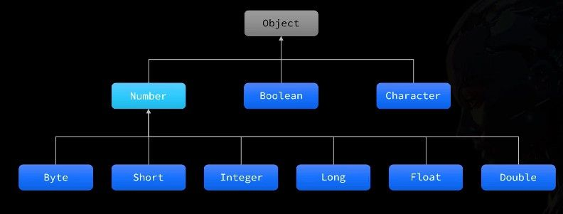

## API

API（Application Programming Interface），也就是**应用程序接口**。这个名字放到现在的学习场景里，更直接一点说就是：

> 别人提前写好的一套功能，我们按照约定的方式去调用就行。

比如前面接触过的 `Scanner`、`Random`，本质上都是 Java 已经提供好的工具类。我们不用自己从零去写“键盘录入”或者“随机数生成”的底层逻辑，而是直接调用现成代码来完成需求。

在 Java 中，官方提供的这一整套标准工具库，就叫做 **Java 核心类库**。
它里面包含了大量已经封装好的类和接口，覆盖输入输出、字符串处理、集合、时间、网络、多线程等很多常见开发场景。


也就是说，`Scanner` 和 `Random` 只是其中非常小的一部分。真正的 Java API 远不止这两个，而是多到不可能靠硬背全记住。

也完全根本没必要硬背。API 是拿来**查、拿来用、拿来在实践里慢慢混熟**的。

放到现在这个时代，现在除了文档，还有 IDEA 的代码提示、搜索引擎、教程，甚至 AI 都能帮你快速定位一个类的常见用法。

官方文档可以作为查阅入口：

[Java® 平台、标准版和 Java 开发工具包 版本 17 API 规范](https://doc.qzxdp.cn/jdk/17/zh/api/index.html)

# Object 类

Object 类是 Java 中所有类的父类，每个类都直接或间接地继承自 Object。这意味着任何 Java 对象都能使用 Object 类中定义的方法。

## toString 方法

toString 方法返回对象的字符串表示形式，让我们能够更直观地了解对象包含的数据。当我们直接打印一个对象，或者将对象与字符串进行拼接时，Java 会自动调用该对象的 toString 方法。

```java
// System.out.println(Person.toString(); // 直接输出对象时，toString可以不写
System.out.println(Person);
```

Object 类中 toString 方法的默认实现如下：

```java
public String toString() {
    return getClass().getName() + "@" + Integer.toHexString(hashCode());
}
```

这个实现会返回：

- 类的完整名称（包含包名）
- 一个@符号
- 对象哈希码的十六进制表示

例如：`com.example.Person@15db9742`

这样的输出对调试帮助有限，因为它并没有告诉我们对象的实际内容。因此，在实际开发中，我们通常会**重写 toString 方法**来展示对象的关键属性。

一个好的 toString 实现应该包括类名和关键字段的值，例如：

```java
@Override
public String toString() {
    return "Person{name='" + name + "', age=" + age + "}";
}
```

使用这种重写后的 toString 方法，打印对象时就能看到有意义的信息：`Person{name='张三', age=25}`

和前面提到的 equals 和 hashCode 方法一样，现代 IDE 也提供了自动生成 toString 方法的功能，可以根据类的字段自动生成合适的实现。

## equals 方法

`equals` 方法用于比较两个对象是否相等。`Object` 类中 `equals` 的默认实现如下：

```java
public boolean equals(Object obj) {
    return (this == obj);
}
```

因为`==`比较的是对象的引用（内存地址），而我们通常需要比较的是对象的内容。此时就可以重写父类方法,自己定制比较规则

Object 类只提供了基础实现，许多类（如 String）都重写了这个方法来实现符合业务逻辑的比较。例如：

```java
// 自定义Person类重写equals方法
@Override
public boolean equals(Object obj) {
    // 先检查是否为同一引用
    if (this == obj) return true;

    // 类型安全检查
    if (!(obj instanceof Person)) return false;

    // 强制类型转换并比较关键属性
    Person other = (Person) obj;
    return this.name.equals(other.name) && this.age == other.age;
}
```

重写 equals 方法时，通常也需要重写 hashCode 方法。

## hashCode 方法

hashCode 方法根据对象的内容生成一个整数值，这个值主要用于哈希表数据结构中（如 HashMap、HashSet）。

哈希表通过这个值快速确定对象在内部存储的位置，这也是为什么 hashCode 与 equals 关系密切。

hashCode 方法必须遵守以下规则：

- 同一个对象多次调用，必须返回相同的整数
- 如果两个对象的 equals 方法比较为 true，它们的 hashCode 必须相同
- 不同的对象应该尽量产生不同的 hashCode（虽然不是强制的）

Object 的默认 hashCode 实现使用了对象的内存地址：

```java

public native int hashCode();  // 原生方法，由JVM底层实现

```

当重写 equals 方法时，必须同时重写 hashCode 方法，确保满足上述规则。现代 IDE 提供了自动生成这两个方法的功能：


生成的代码通常如下：

```java
@Override
public boolean equals(Object o) {
    if (this == o) return true;
    if (!(o instanceof Person person)) return false;
    return age == person.age && Objects.equals(name, person.name);
}

@Override
public int hashCode() {
    return Objects.hash(name, age);  // 基于关键属性计算
}
```

# Objects 工具类

JDK 7 新增的工具类，提供了一些静态方法来操作对象，让我们能更安全地处理各种对象操作。

Object 是所有类的祖宗，每个对象都继承自它；而 Objects（注意有个 s）是专门用来安全操作对象的工具类。两者完全不同，但都很重要。

> 在 Java 中带 s 的类一般都是工具类

## equals 方法

比较两个对象是否相等，即使第一个对象是 null 也不会报错：

```java
Student t1 = null;
Student t2 = new Student("蜘蛛精", 300, 85.5);

// 传统方式，如果 t1 是 null，会抛出空指针异常
// System.out.println(t1.equals(t2));

// Objects 的 equals 方法，更安全可靠
System.out.println(Objects.equals(t1, t2)); // false
```

**底层原理**：Objects.equals 会先判断两个对象是否为同一个引用，然后再安全地调用 equals 方法。

```java
public static boolean equals(Object a, Object b) {
    return (a == b) || (a != null && a.equals(b));
}
```

这样即使第一个参数是 null，也不会抛出空指针异常，而是直接返回 false。**以后比较两个对象是否相等，建议用 Objects.equals 来判断**，更安全。

## 判断 null 的方法

Objects 还提供了两个判断对象是否为 null 的便捷方法：

```java
System.out.println(Objects.isNull(t1));   // true
System.out.println(t1 == null);           // true

System.out.println(Objects.nonNull(t1));  // false
System.out.println(t1 != null);           // false
```

虽然功能和 `== null` 或 `!= null` 一样，但在某些场景下（如 Stream 操作）使用这些方法可以让代码更简洁、更规范。

## 其他常用方法

Objects 工具类还有一些其他实用方法：

```java
// 检查对象是否为 null，如果是则抛出 NullPointerException
Objects.requireNonNull(obj);

// 检查对象是否为 null，如果是则抛出带自定义消息的异常
Objects.requireNonNull(obj, "对象不能为空");

// 返回对象的哈希码，如果对象为 null 则返回 0
Objects.hashCode(obj);

// 比较两个对象的大小，支持 null 值
Objects.compare(obj1, obj2, comparator);
```

**工具类**就是一堆静态方法的集合，不用 new 对象，直接用"类名.方法名"调用。而 Objects 工具类专门用来安全操作对象，避免常见错误。

# String 类

`String` 是 Java 中最常用的引用类型之一，用来表示字符串，也就是文本内容。

它有一个很特别的地方：
虽然 `String` 是引用类型，变量中实际保存的也是对象的地址值，但在创建字符串时，不一定非要像普通对象那样使用 `new`，也可以像基本类型那样，直接使用双引号赋值。

```java
String s1 = "Wreckloud";
String s2 = new String("Wreckloud");
```

这两种写法都能得到字符串对象，不过需要注意，它们在内存中的处理方式并不一样。

## 基本创建方式

#### 双引号创建

Java 为字符串专门准备了一块区域，叫作字符串常量池。

当代码中直接出现双引号字符串时，Java 会先到字符串常量池中查找有没有相同内容的字符串。
如果有，就直接复用；如果没有，才会把它放进去。

例如：

```java id="7g1a9w"
String s1 = "abc";
String s2 = "abc";
```

这里 `s1` 和 `s2` 的内容相同，而且都是双引号直接创建。因此它们会指向常量池中的同一个字符串对象。

```java id="8m3h0v"
System.out.println(s1 == s2); // true
```

这说明，双引号创建的字符串会优先复用常量池中的对象。

#### `new` 创建

如果使用 `new` 来创建字符串，那么情况就不一样了。

```java id="v9d2ql"
String s3 = new String("abc");
```

这一句，不仅 `new` 后面的 `"abc"` 这份内容，本身会出现在字符串常量池中，而且 `new String("abc")` 还会额外在**堆内存**中再创建一个新的字符串对象。

也就是说，`new` 创建字符串时，真正得到的是堆中的新对象，而不会直接复用常量池中的那个对象。

例如：

```java id="e84ws1"
String s1 = "abc";
String s2 = "abc";
String s3 = new String("abc");

System.out.println(s1 == s2); // true
System.out.println(s1 == s3); // false
```

这里：

`s1 == s2` 为 `true`，是因为它们指向常量池中的同一个对象。
`s1 == s3` 为 `false`，是因为 `s3` 指向的是堆中新的对象。

- 双引号创建字符串：优先使用常量池中的对象
- `new` 创建字符串：会在堆中重新创建对象

所以在实际开发中，**更推荐直接使用双引号创建字符串**。写法更简单，也能更好地利用字符串常量池。

`String` 还有一个很重要的特点：字符串对象一旦创建，内容就不能改变。所谓“修改字符串”，本质上并不是改原来的对象，而是生成一个新的字符串对象。

### `intern()`

如果确实需要手动获取常量池中的字符串引用，可以使用 `intern()` 方法。

ntern() 的作用是：
返回当前字符串在常量池中对应的那个字符串对象的引用。

- 如果常量池中已经有内容相同的字符串，就直接返回常量池中的引用
- 如果没有，就把这个字符串内容放入常量池，再返回常量池中的引用

```java id="g42ir8"
String s1 = new String("abc");
String s2 = s1.intern();
String s3 = "abc";

System.out.println(s2 == s3); // true
```

不过这个方法平时用得并不多，了解即可。

## 其他创建方式

总之，通常更推荐直接使用字符串字面量创建 `String` 对象，写法更简单，也能更好地利用字符串常量池。

```java id="n9mk6g"
String s = "hello";
```

除了这种方式，`String` 也提供了构造方法来创建字符串对象。不过需要注意，使用构造方法创建字符串时，通常都会在堆内存中再创建新的对象。

1. 根据已有字符串创建新对象

```java id="jlwm3u"
String(String original)
```

例如：

```java id="5v5rjf"
String s1 = "abc";
String s2 = new String(s1);
```

这里 `s2` 会在堆内存中创建一个新的字符串对象。这种写法实际开发中并不常用，了解即可。

2. 根据字节数组创建字符串

```java id="976khc"
String(byte[] bytes)
```

例如：

```java id="1tv8gw"
byte[] data = {72, 101, 108, 108, 111};
String s = new String(data);
```

这会把字节数组中的内容转换成字符串。

3. 按指定编码把字节数组转换成字符串

```java id="d7y8g2"
String(byte[] bytes, Charset charset)
```

例如：

```java id="qmdg7y"
byte[] data = {-28, -67, -96, -27, -91, -67};
String s = new String(data, StandardCharsets.UTF_8);
```

这种写法比上一种更常用，因为字节转换成字符串时，编码方式往往很重要。

4. 根据字符数组创建字符串

```java id="om8tnq"
String(char[] value)
```

例如：

```java id="qwurfx"
char[] chars = {'J', 'a', 'v', 'a'};
String s = new String(chars);
```

这会把字符数组中的内容转换成字符串。

## 判断与比较方法

String 类提供了一系列用于判断和比较字符串的方法，这些方法让我们能够灵活地处理各种字符串操作场景。

### 内容比较

比较字符串的内容是否相同，是最基本的字符串操作之一：

```java
// 严格比较字符串内容是否完全相同（区分大小写）
boolean equals(Object obj)

// 比较字符串内容是否相同（忽略大小写）
boolean equalsIgnoreCase(String str)
```

使用示例：

```java
String str1 = "Hello";
String str2 = "hello";

System.out.println(str1.equals(str2));         // false（大小写敏感）
System.out.println(str1.equalsIgnoreCase(str2)); // true（忽略大小写）
```

### 空值检查

检查字符串是否为空是处理用户输入或外部数据时的常见需求：

```java
// 检查字符串长度是否为0（即""）
boolean isEmpty()

// 检查字符串是否为空或全为空白字符（Java 11+）
boolean isBlank()
```

这两个方法的区别在于对空白字符的处理：

```java
System.out.println("".isEmpty());     // true
System.out.println("   ".isEmpty());  // false（含空格）

System.out.println("   ".isBlank());  // true
System.out.println(" \t\n".isBlank());// true（含制表符、换行符）
```

### 前后缀检查

判断字符串的开头或结尾是否匹配特定内容：

```java
// 判断字符串是否以指定前缀开头
boolean startsWith(String prefix)

// 判断字符串是否以指定后缀结尾
boolean endsWith(String suffix)
```

这些方法在处理文件路径、URL 等场景中特别有用：

```java
String path = "/data/images/photo.jpg";

System.out.println(path.startsWith("/data")); // true
System.out.println(path.endsWith(".jpg"));    // true
System.out.println(path.endsWith(".png"));    // false
```

### 内容匹配

检查字符串是否包含特定内容：

```java
// 判断是否包含指定子字符串
boolean contains(CharSequence cs)

// 判断是否符合正则表达式规则
boolean matches(String regex)
```

实际应用示例：

```java
// 检查文本中是否包含关键词
String text = "Java编程基础";
System.out.println(text.contains("编程"));  // true

// 使用正则表达式验证手机号格式
String phone = "13800138000";
System.out.println(phone.matches("1[3-9]\\d{9}")); // true
```

通过合理组合这些判断方法，我们可以构建出强大而灵活的字符串处理逻辑，满足各种业务场景需求。

## 获取方法

String 类提供了多种方法用于获取字符串的特定信息或提取字符串的特定部分，这些方法是字符串处理的基础。

### 基础属性获取

要获取字符串的基本属性，可以使用以下方法：

```java
// 获取字符串的长度（字符数量）
int length()

// 获取指定索引位置的字符
char charAt(int index)
```

这些方法使我们能够了解字符串的基本结构：

```java
String text = "Java编程";
System.out.println(text.length());   // 5（注意：一个中文字符的长度为1）
System.out.println(text.charAt(0));  // 'J'
System.out.println(text.charAt(4));  // '程'
```

> 注意：字符串索引从 0 开始，如果索引超出范围会抛出 StringIndexOutOfBoundsException 异常。

### 切割与截取

从字符串中提取特定部分是常见操作：

```java
// 按照正则表达式分割字符串
String[] split(String regex)

// 截取指定索引范围的子字符串（含起始，不含结束）
String substring(int beginIndex, int endIndex)

// 从指定位置截取到末尾
String substring(int beginIndex)
```

使用示例：

```java
// 分割字符串
String data = "张三,李四,王五";
String[] names = data.split(",");  // 得到["张三", "李四", "王五"]

// 截取子字符串
String url = "https://www.example.com";
String domain = url.substring(8, 21);  // "www.example"
String topDomain = url.substring(21);  // ".com"
```

### 查找定位

查找字符或子字符串在原字符串中的位置：

```java
// 查找字符/字符串首次出现的位置
int indexOf(String str)
int indexOf(int ch)  // 可以传入字符或ASCII码

// 查找字符/字符串最后一次出现的位置
int lastIndexOf(String str)

// 从指定位置开始查找
int indexOf(String str, int fromIndex)
```

使用这些方法可以帮助我们确定字符串中特定内容的位置：

```java
String sentence = "Java是一门面向对象的编程语言";

// 查找子字符串位置
int pos = sentence.indexOf("编程");  // 返回9
int notFound = sentence.indexOf("Python");  // 返回-1（未找到）

// 查找字符位置
int charPos = sentence.indexOf('向');  // 返回6

// 查找最后一次出现的位置
String repeat = "香蕉,苹果,香蕉,橙子";
int last = repeat.lastIndexOf("香蕉");  // 返回6
```

> 当查找不到指定内容时，indexOf 和 lastIndexOf 方法都返回-1。

### 类型转换

字符串可以转换为其他数据类型：

```java
// 转换为字符数组
char[] toCharArray()

// 转换为字节数组（使用平台默认编码）
byte[] getBytes()

// 使用指定编码转换为字节数组
byte[] getBytes(Charset charset)
```

这些转换方法在处理文件 IO 或网络传输时特别有用：

```java
String message = "Hello";

// 转换为字符数组
char[] chars = message.toCharArray();  // ['H', 'e', 'l', 'l', 'o']

// 转换为字节数组
byte[] bytes = message.getBytes();  // [72, 101, 108, 108, 111]

// 使用特定编码转换
byte[] utf8Bytes = message.getBytes(StandardCharsets.UTF_8);
```

掌握这些获取方法，可以让我们更高效地处理各种字符串操作任务，从简单的字符提取到复杂的文本分析都能游刃有余。

## 转换方法

String 类提供了丰富的转换方法，让我们能够轻松修改文本内容。无论是替换字符、改变大小写，还是处理空格，都可以通过这些方法实现。

### 替换操作

替换是字符串处理中最常用的操作之一：

```java
// 替换所有匹配的字符/字符串
String replace(CharSequence target, CharSequence replacement)

// 使用正则表达式替换所有匹配项
String replaceAll(String regex, String replacement)

// 只替换第一个匹配的正则表达式
String replaceFirst(String regex, String replacement)
```

这些方法的使用场景各有不同：

```java
// 简单替换
String text = "Hello World!";
String result = text.replace("l", "*");  // "He**o Wor*d!"

// 正则表达式替换
String code = "用户ID: 12345, 余额: 9876";
String masked = code.replaceAll("\\d", "*");  // "用户ID: *****, 余额: ****"

// 只替换首次出现
String date = "2023-04-05-2023";
String fixed = date.replaceFirst("2023", "2024");  // "2024-04-05-2023"
```

### 大小写转换

改变字符串的大小写是国际化应用中常见需求：

```java
// 将字符串全部转换为小写
String toLowerCase()

// 将字符串全部转换为大写
String toUpperCase()
```

这些方法会智能地处理各种语言的大小写规则：

```java
String mixed = "Java Programming";
System.out.println(mixed.toLowerCase());  // "java programming"
System.out.println(mixed.toUpperCase());  // "JAVA PROGRAMMING"

// 支持国际字符
String german = "Äpfel";  // 德语"苹果"
System.out.println(german.toLowerCase());  // "äpfel"
```

### 空格处理

处理字符串首尾的空白字符：

```java
// 删除字符串前后的空白字符（Java 11+）
String strip()

// 删除字符串前后的空格、制表符、换行符等（传统方法）
String trim()
```

这两个方法有微妙但重要的区别：

```java
// trim()只处理ASCII空白字符（空格、制表符等）
String text = "  Hello  ";
System.out.println(text.trim());  // "Hello"

// strip()能处理所有Unicode空白字符（包括全角空格等）
String textWithUnicode = "　Hello　";  // 含有全角空格
System.out.println(textWithUnicode.strip());  // "Hello"
System.out.println(textWithUnicode.trim());   // "　Hello　"（全角空格未被去除）
```

### 格式化字符串

创建格式化文本时，可以使用静态方法：

```java
// 使用指定格式创建字符串
static String format(String format, Object... args)
```

这个方法类似于 C 语言中的 printf：

```java
// 创建格式化字符串
String message = String.format("用户: %s, 年龄: %d", "张三", 25);
System.out.println(message);  // "用户: 张三, 年龄: 25"

// 格式化数值
String price = String.format("价格: %.2f元", 99.8);
System.out.println(price);  // "价格: 99.80元"
```

这些转换方法都有一个重要特点：**它们不会修改原始字符串**，而是返回一个新的字符串。这是因为 Java 中的 String 类是不可变的（immutable），确保了字符串操作的线程安全性。

## 拼接方法

Java 提供了多种字符串拼接方式，适用于不同的场景。选择合适的拼接方法可以提高代码效率和可读性。

### 使用+运算符

最简单直观的字符串拼接方式是使用加号运算符：
当包含变量拼接时
会自动调用 stringbuider 调用拼接方法， 然后把拼接完成的 stringbuider 对象自动调用 tostring 方法， 最后把转换之后的字符串地址交给变量， 注意 stringbuider 对象和最后的 string 结果分别占据了两个不同的地址值

```java
// 使用+运算符拼接字符串
String firstName = "张";
String lastName = "三";
String fullName = firstName + lastName;  // "张三"

// 可以同时拼接多个值和不同类型
int age = 25;
String info = "姓名：" + fullName + "，年龄：" + age;  // "姓名：张三，年龄：25"
```

“abc” ”“

当都是字面量拼接，java 会有字面量优化机制， 在编译的时候优化， 真正在字节码里面是一样的

虽然+运算符使用方便，但在循环中频繁拼接字符串会导致性能问题，因为每次拼接都会创建新的字符串对象。

# `StringBuilder` 高效拼接

在 Java 中，String 是不可变的，每次拼接都会创建新对象。对于频繁拼接字符串的场景，尤其是在循环中，应该使用`StringBuilder`类：

```java
// 创建空的StringBuilder对象
StringBuilder sb1 = new StringBuilder();  // 空字符串，初始容量16字符

// 创建带初始内容的StringBuilder对象
StringBuilder sb2 = new StringBuilder("Wreckloud");  // 内容为"Wreckloud"

// 创建指定容量的StringBuilder对象
StringBuilder sb3 = new StringBuilder(50);  // 空字符串，初始容量50字符
```

StringBuilder 是一个可变的字符序列，内部维护一个字符数组，支持动态增长。与 String 不同，它的操作不会创建新对象，而是在原对象上直接修改。尤其是在循环或大量拼接操作中，大大提高了性能。

### 链式调用

常用方法，例如`append`方法添加内容：

```java
sb.append("维克罗德");
sb.append("Wreckloud");
sb.append(666);
sb.append(true);

// 直接得到了内容，因为toString被重写了
System.out.println(sb);  // 输出：维克罗德Wreckloud666true
```

也可以使用链式调用（Chained Method Call），让代码更简洁：

```java
sb.append("维克罗德").append("Wreckloud").append(666);
```

查看`append`方法源码，会发现它`return this`，每个 `append()` 方法内部都返回了 `this` 对象，也就是原本的那个 `StringBuilder`。

```Java{5}
@Override
@IntrinsicCandidate
public final StringBuilder append(String str) {
    super.append(str);
    return this;
}
```

### 转成 String 返回

虽然 `StringBuilder` 很强大，但开发中我们最终使用的往往是 `String` 类型，为什么不能直接把 `StringBuilder` 传给方法？因为多数 API 都要求参数是 `String`，比如：

```java
public void print(String s) { ... } // 是不接受 StringBuilder
```

这是因为 `String` 是标准类型、不可变、可共享，几乎所有库和框架都是围绕它设计的。而 `StringBuilder` 是辅助工具，系统方法并不识别。

> 所以：**拼接完后必须 `.toString()` 转换成 String 才能交付使用。**

除了通用性，`String` 还有两个关键优势：

- **不可变性**：线程安全，可共享，适合当常量
- **常量池优化**：所有 `"文本"` 形式的字符串都会进入字符串常量池，实现复用

```java
String a = "hello";
String b = "hello";
System.out.println(a == b); // true，两个变量引用同一常量池中的对象
```

而如果你写的是：

```java
String a = new String("hello");
```

这会在堆上重新创建一个对象，不再复用常量池中的 `"hello"` 字面量，既浪费内存，也违背了常量池的优化初衷。

> 因此，对于**需要频繁拼接或修改字符串**的场景，推荐使用 `StringBuilder`，能显著提升性能，减少内存开销。
> 但如果字符串操作本身不多，或只是单纯定义变量、传参，使用 `String` 更简洁，也能充分利用字符串常量池的优势。

### 常用方法

除此之外，StringBuilder 还提供了丰富的字符串操作方法：

| 方法                          | 说明               | 示例                            |
| ----------------------------- | ------------------ | ------------------------------- |
| `append(内容)`                | 追加内容到末尾     | `builder.append(" World")`      |
| `insert(位置, 内容)`          | 在指定位置插入内容 | `builder.insert(5, ",")`        |
| `replace(开始, 结束, 字符串)` | 替换指定范围内容   | `builder.replace(0, 5, "Hi")`   |
| `delete(开始, 结束)`          | 删除指定范围内容   | `builder.delete(2, 4)`          |
| `toString()`                  | 转换为 String      | `String s = builder.toString()` |
| `length()`                    | 获取长度           | `int len = builder.length()`    |

# `StringBuffer` 线程安全

StringBuffer 是 Java 提供的线程安全版 StringBuilder，专为多线程环境下的字符串操作设计。它们在功能和用法上几乎完全相同，但在内部实现和适用场景上有重要区别。

这种差异导致：

- StringBuffer：线程安全，适合多线程环境
- StringBuilder：线程不安全，但性能更高，适合单线程环境

除此之外，StringBuffer 的创建和使用方式与 StringBuilder 完全一样。

在实际开发中，我们大多都接触的是单线程场景（方法内部的局部变量），因此几乎都应该用 StringBuilder。除非确认有多线程访问同一个对象，否则使用 StringBuilder 即可，这将在以后的内容中提到。

# `StringJoiner` 快速拼接

`StringJoiner` 是从 JDK 8 引入的字符串处理类，用来**简洁拼接多个字符串**，  
底层原理跟 `StringBuilder` 类似，但专注**格式化拼接**，比如加逗号、加括号等场景。

它的构造方式决定了输出格式：

```java
// 只指定分隔符（最常用）
new StringJoiner(",")

// 指定分隔符 + 前缀 + 后缀
new StringJoiner(",", "[", "]")
```

没有花里胡哨的操作，`StringJoiner` 的方法设计非常精炼，都是围绕"拼接"本身：

| 方法名            | 说明                     |
| ----------------- | ------------------------ |
| `add(String str)` | 添加元素，区别`append()` |
| `toString()`      | 返回最终拼接结果         |
| `length()`        | 返回拼接后字符串的长度   |

例如，将 int 数组格式化为字符串输出

**原写法（用 `StringBuilder` 拼接）**

```java
public static String getArrayData(int[] arr) {
    if (arr == null) return null;

    StringBuilder sb = new StringBuilder();
    sb.append("[");
    for (int i = 0; i < arr.length; i++) {
        sb.append(arr[i]);
        if (i != arr.length - 1) sb.append("，");
    }
    sb.append("]");
    return sb.toString();
}
```

虽然能用，但拼接逻辑零散，而且你得**手动判断**是不是最后一个元素。

**推荐（用 `StringJoiner`）**

代码一下子就干净了许多：

```java
public static String getArrayData(int[] arr) {
    if (arr == null) return null;

    StringJoiner sj = new StringJoiner("，", "[", "]");
    for (int num : arr) {
        sj.add(Integer.toString(num)); // 注意只接收 String 类型，需要转换一下
    }
    return sj.toString();
}
```

这样写不仅语义清晰，而且**不需要关心逗号位置、边界处理**，一切交给 `StringJoiner` 来做。

> `StringBuilder` 用于**自由拼接**，`StringJoiner` 用于**规则拼接**，比如加逗号、加中括号、加空格等。

# 包装类

包装类是 Java 为每种基本数据类型提供的对应引用类型，将基本类型"包装"成对象，使其能够在面向对象环境中使用。这源自 Java"万物皆对象"的理念，也是因为泛型和集合只支持引用类型。

## 基本类型与包装类对应关系

Java 中的八种基本数据类型都有对应的包装类：

| 基本类型 | 包装类        | 特别注意  |
| -------- | ------------- | --------- |
| byte     | Byte          |           |
| short    | Short         |           |
| int      | **Integer**   | 不是 Int  |
| long     | Long          |           |
| float    | Float         |           |
| double   | Double        |           |
| boolean  | Boolean       |           |
| char     | **Character** | 不是 Char |

其中大多数包装类只是把基本类型首字母大写，只有`int→Integer`和`char→Character`需要特别记忆。这些包装类都位于`java.lang`包中，可以直接使用而无需导入。



## 创建包装类对象

有两种方式可以创建包装类对象：

```java
// 方式一：使用构造方法（已过时）
// Integer num1 = new Integer(10);  // 不推荐

// 方式二：使用静态工厂方法（推荐）
Integer num2 = Integer.valueOf(10);
```

那么为什么推荐使用静态方法而不是构造方法呢？这与包装类的缓存机制有关。

## 包装类的缓存机制

当我们查看`Integer.valueOf()`方法的源码时，会发现它实现了缓存机制：

```java
public static Integer valueOf(int i) {
    if (i >= IntegerCache.low && i <= IntegerCache.high)
        return IntegerCache.cache[i + (-IntegerCache.low)];
    return new Integer(i);
}
```

为了提高性能，Java 对常用的数值(`low：-128` 到 `high：127`)进行了缓存，这样频繁使用的整数就能共享同一个对象，节省内存。

这一机制在实践中很容易看到：

```java
Integer a = 100;  // 自动装箱，实际调用Integer.valueOf(100)
Integer b = 100;  // 同上，返回相同的缓存对象
System.out.println(a == b);  // true，因为是同一个对象

Integer c = 200;  // 超出缓存范围
Integer d = 200;  // 创建新对象
System.out.println(c == d);  // false，不同对象
```

**正确比较包装类对象**

这种缓存机制导致了一个常见陷阱：使用`==`来比较包装类对象可能得到意外结果。正确的做法是：

```java
// 错误的比较方式
if (integerObj1 == integerObj2) { /* 不可靠的比较 */ }

// 正确的比较方式
// 1. 比较值是否相等
if (integerObj1.equals(integerObj2)) { /* 安全的值比较 */ }

// 2. 比较大小关系
if (integerObj1.compareTo(integerObj2) > 0) { /* 大小比较 */ }
```

不同包装类的缓存范围不同：

| 包装类    | 缓存范围      | 说明                  |
| --------- | ------------- | --------------------- |
| Integer   | -128 到 127   | 常用的整数范围        |
| Character | 0 到 127      | ASCII 字符范围        |
| Boolean   | true 和 false | 所有可能的值          |
| Byte      | -128 到 127   | Byte 的完整值范围     |
| Short     | -128 到 127   | 与 Integer 相同的范围 |
| Long      | -128 到 127   | 与 Integer 相同的范围 |
| Float     | 不缓存        | 每次都创建新对象      |
| Double    | 不缓存        | 每次都创建新对象      |

这种缓存设计是为了优化内存使用，特别是对于小范围的常用值。这也解释了为什么使用`==`比较包装类对象可能得到意外结果，因为只有在缓存范围内的对象才会指向同一引用。

> 记住：基本类型变量直接存储值，而包装类是对象，变量存储的是引用，指向堆内存中的对象。

## 自动装箱与拆箱

为了让开发者使用更方便，从 JDK 1.5 开始，Java 引入了自动装箱和拆箱机制：

```java
// 自动装箱：基本类型 -> 包装类
Integer num = 100;  // 编译器自动转换为：Integer num = Integer.valueOf(100);

// 自动拆箱：包装类 -> 基本类型
int value = num;    // 编译器自动转换为：int value = num.intValue();
```

自动装箱和拆箱的原理如下图所示：


这一机制虽然极大地简化了代码，但也带来了一些需要注意的问题。

### 空指针风险

自动拆箱最大的风险是可能导致`NullPointerException`：

```java
Integer price = null;
// 自动拆箱时，如果包装类对象为null，会抛出NullPointerException
int discount = price + 10; // 运行时错误
```

在实际开发中，应该养成先检查 null 的习惯：

```java
Integer price = getPrice(); // 可能返回null
int realPrice = (price != null) ? price : 0; // 安全的拆箱方式
```

## 常用方法

包装类之所以有存在的价值，不仅仅是因为"万物皆对象"的理念，更因为它们提供了许多实用方法。下面是一些最常用的功能：

1. **转换为字符串**

   ```java
   public static String toString(int i)    // 静态方法
   public String toString()                // 实例方法
   ```

   虽然直接拼接空字符串也能达到效果(`""+100`)，但使用方法更规范。

2. **字符串转数值**（非常有用！）

   ```java
   // 解析字符串为基本类型
   public static int parseInt(String s)

   // 解析字符串为包装类对象（推荐）
   public static Integer valueOf(String s)
   ```

这些转换方法在处理用户输入、文件数据或网络请求时非常实用，能够将字符串形式的数据转换为可计算的数值类型。

# ArrayList 类

集合又很多种，ArrayList 是最常用、最常见的一种**集合**，适合存储一组有序、可变的数据。和数组相比，它的容量可以自动扩展，操作也更灵活。

ArrayList 适合频繁查找和遍历的场景，使用时记得导入 `java.util.ArrayList`。

**创建方式**

```java
ArrayList<String> list = new ArrayList<>();
```

如果需要存储不同类型的数据，可以用泛型 `<E>` 指定类型，比如 `ArrayList<Integer>` 存整数。

### `size()` 获取长度

用 `size()` 可以获取集合中元素的个数：

```java
int count = list.size();
```

### `get()` 获取元素

用 `get(index)` 可以获取指定位置的元素，下标从 0 开始：

```java
String value = list.get(0); // 获取第一个元素
```

### `add()` 添加元素

用 `add()` 方法可以向集合末尾添加一个元素，添加成功返回  true。

```java
list.add("Java");
list.add("Python");
```

也可以在指定位置插入元素，原有元素会依次后移：

```java
list.add(1, "C++"); // 在下标1的位置插入
```

### `remove()` 删除元素

有两种方式可以删除元素：

1. 按下标删除：`remove(index)`，会删除指定位置的元素，后面的元素自动前移。

   ```java
   list.remove(1); // 删除下标为1的元素
   ```

2. 按内容删除：`remove(Object o)`，会删除集合中首次出现的指定元素。

   ```java
   list.remove("Java");
   ```

### `set()` 修改元素

用 `set(index, element)` 可以修改指定位置的元素，被替换掉的原元素。

```java
list.set(0, "Go"); // 把第一个元素改成 Go
```

### 集合遍历

在实际开发中，经常需要在遍历集合时根据条件删除某些元素。如果直接使用 for 循环从前往后遍历并删除，会导致索引混乱，容易漏删或抛出异常。为避免此类 bug，可以采用以下两种常用方法：

**方法一：每次删除元素后，手动将索引减一**

当使用 for 循环正序遍历集合时，如果删除了当前元素，后面的元素会整体前移，此时应将索引减一，确保不会跳过下一个元素。例如：

```java
for (int i = 0; i < list.size(); i++) {
    if (需要删除的条件) {
        list.remove(i);
        i--; // 删除后索引回退
    }
}
```

**方法二：倒序遍历集合进行删除**

更推荐的做法是从集合末尾向前遍历。这样删除元素时不会影响尚未遍历的元素索引，逻辑更简单，也不会漏删。例如：

```java
for (int i = list.size() - 1; i >= 0; i--) {
    if (需要删除的条件) {
        list.remove(i);
    }
}
```

遍历集合删除元素时，推荐倒序遍历，或在正序遍历时删除后索引减一，避免出现遗漏或索引越界等问题。

# Arrays 工具类

Arrays 是 Java 提供的数组操作工具类，它包含了一系列静态方法，可以帮助我们高效地处理数组。

### `.sort` 对象数组排序

基本类型数组（如 int[]）可以直接用  Arrays.sort(arr)  排序，但对象数组需要指定比较规则：

**方式一：实现 Comparable  接口**

当对象有"天然排序规则"时（如学生按年龄排序），让类实现 Comparable 接口：

```java
public class Student implements Comparable<Student> {
    private String name;
    private int age;

    @Override
    public int compareTo(Student o) {
        // 按年龄升序
        return this.age - o.age;
    }
}
```

**官方规定：**

- 返回正数：表示左边大于右边
- 返回负数：表示左边小于右边
- 返回零：表示相等

只要这么写，默认就是升序排序。

> 注意：对于浮点数比较，不要直接相减，应使用  Double.compare(this.height, o.height)

**方式二：使用  Comparator 比较器**

如果不想让类本身固定排序规则，或者排序规则经常变，可以用 `Comparator` 比较器。  
这种方式是把"比较规则"写在排序的时候，灵活切换。

```java
Arrays.sort(students, new Comparator<Student>() {
    @Override
    public int compare(Student o1, Student o2) {
        // 按年龄升序
        return o1.getAge() - o2.getAge();
    }
});
```

同样的，返回的值需要整型，如果是两个小数比较，推荐用 `Double.compare(o1.getHeight(), o2.getHeight())`。

### `binarySearch` 二分查找

```java
int binarySearch(int[] a, int key)
<T> int binarySearch(T[] a, T key)
```

在 **已排序数组** 中查找元素，返回其索引。找不到时返回负数 `-(插入点) - 1`。

```java
int[] nums = {1, 3, 5, 7, 9};
int idx = Arrays.binarySearch(nums, 5);  // 2
int notFound = Arrays.binarySearch(nums, 4); // -3（插入点是 2）
```

注意：数组必须已排序，否则结果不可靠。

### `copyOf` / `copyOfRange` 拷贝

```java
int[] copyOf(int[] original, int newLength)
int[] copyOfRange(int[] original, int from, int to)
```

- `copyOf`：整体拷贝，指定新长度
- `copyOfRange`：拷贝区间 `[from, to)`

```java
int[] nums = {1, 2, 3, 4, 5};
int[] a = Arrays.copyOf(nums, 3);       // [1, 2, 3]
int[] b = Arrays.copyOf(nums, 7);       // [1, 2, 3, 4, 5, 0, 0]
int[] c = Arrays.copyOfRange(nums, 1, 4); // [2, 3, 4]
```

### `fill` 填充

```java
void fill(int[] a, int val)
```

将数组全部填充为指定值。

```java
int[] den = new int[5];
Arrays.fill(den, -1);
System.out.println(Arrays.toString(den)); // [-1, -1, -1, -1, -1]
```

内部实现其实就是一个循环：

```java
for (int i = 0, len = a.length; i < len; i++)
    a[i] = val;
```

> 注意：`len = a.length` 先保存下来，避免每次循环都重新计算。

### `equals` 比较

```java
boolean equals(int[] a, int[] b)
```

逐个元素比较两个数组是否完全相同。

```java
int[] a = {1, 2, 3};
int[] b = {1, 2, 3};
int[] c = {3, 2, 1};

System.out.println(Arrays.equals(a, b)); // true
System.out.println(Arrays.equals(a, c)); // false
```

# Math

Math 类是 Java 提供的数学工具类，位于 java.lang 包中。它包含执行基本数学运算的静态方法，无需创建实例即可直接使用。

## `abs` 绝对值

获取参数的绝对值

```Java
public static int abs(int a)
```

```java
int num = -10;
int absValue = Math.abs(num); // 结果：10
```

## `ceil/floor` 上下取整

向上/下取整（返回大于/小于或等于参数的最小/大整数）

```Java
// 向上取整
public static double ceil(double a)
// 向下取整
public static double floor(double a)
```

```java
double num1 = 3.14;
double ceilResult = Math.ceil(num1); // 结果：4.0

double num1 = 3.85;
double floorResult = Math.floor(num1); // 结果：3.0
```

## `round` 四舍五入

四舍五入为最接近的整数

```Java
public static int round(float a)
```

```java
float num1 = 3.4f;
float num2 = 3.5f;

int roundResult1 = Math.round(num1); // 结果：3
int roundResult2 = Math.round(num2); // 结果：4
```

## `max/min` 最值

获取两个值中的较大/小值

```Java
public static int max(int a, int b)
public static int min(int a, int b)
```

```java
int a = 5;
int b = 10;
int maxValue = Math.max(a, b); // 结果：10
int minValue = Math.min(a, b); // 结果：5
```

## `pow` 幂运算

返回 a 的 b 次幂

```Java
public static double pow(double a, double b)
```

```java
double base = 2.0;
double exponent = 3.0;
double result = Math.pow(base, exponent); // 结果：8.0
```

## `random` 随机数生成

返回一个 `[0.0, 1.0)` 范围内的随机双精度浮点数

```Java
public static double random()
```

```java
// 生成 [0.0, 1.0) 之间的随机数
double randomValue = Math.random();

// 生成 [0, 100) 之间的整数随机数
int randomInt = (int)(Math.random() * 100);

// 生成 [100, 200) 之间的整数随机数
int num = rand.nextInt(200 - 100) + 100;
// 可以参考: 整数随机数 = (int)(Math.random() * (上限 - 下限)) + 下限;
```

# Runtime

Runtime 代表程序所在的运行环境。这是一个单例类，通过它可以与 Java 虚拟机进行交互，执行一些系统级操作。

## `getRuntime` 获取实例

获取与当前 Java 应用程序关联的运行时对象

```Java
public static Runtime getRuntime()
```

```java
Runtime runtime = Runtime.getRuntime();
```

## `exit` 终止虚拟机

终止当前运行的虚拟机，慎用，可能导致数据丢失

```Java
public void exit(int status)
```

```java
Runtime runtime = Runtime.getRuntime();
runtime.exit(0); // 0表示正常终止，非0表示异常终止
```

## `availableProcessors` 获取处理器数量

返回 Java 虚拟机可用的处理器数

```Java
public int availableProcessors()
```

```java
Runtime runtime = Runtime.getRuntime();
int processors = runtime.availableProcessors();
System.out.println("可用处理器数量：" + processors);
```

## `total/freeMemory` 内存管理

获取虚拟机内存信息，常用于监控和调试

```Java
public long totalMemory() // 返回 Java 虚拟机中的内存总量
public long freeMemory()  // 返回 Java 虚拟机中的可用内存
```

```java
Runtime runtime = Runtime.getRuntime();
long total = runtime.totalMemory();
long free = runtime.freeMemory();

System.out.println("总内存：" + total / 1024 / 1024 + "MB"); // 默认以字节为单位
System.out.println("可用内存：" + free / 1024 / 1024 + "MB");
System.out.println("已用内存：" + (total - free) / 1024 / 1024 + "MB");
```

## `exec` 执行外部程序

启动某个程序，并返回代表该程序的对象

```Java
public Process exec(String command)
```

```java
Runtime runtime = Runtime.getRuntime();
try {
    // 启动记事本程序
    Process process = runtime.exec("notepad.exe");

    // 等待程序执行结束
    process.waitFor();
} catch (Exception e) {
    e.printStackTrace();
}
```

Runtime 类在日常开发中使用频率不高，但在需要获取系统信息、执行垃圾回收或启动外部程序时非常有用。了解这些方法对于编写系统监控工具或性能优化有一定帮助。

# System

System 代表程序所在的系统，是一个工具类。通过 System 类可以访问系统相关的属性和方法。

## `exit` 终止虚拟机

终止当前运行的 Java 虚拟机

```Java
public static void exit(int status)
```

```java
System.exit(0); // 0表示正常终止，非0表示异常终止
```

## `currentTimeMillis` 获取系统时间

返回当前系统的时间毫秒值形式（这个比较重要）

```Java
public static long currentTimeMillis()
```

```java
// 获取当前时间戳
long start = System.currentTimeMillis();

// 执行一些操作
for (int i = 0; i < 10000; i++) {
    // 模拟操作
}

// 计算耗时
long end = System.currentTimeMillis();
System.out.println("执行耗时：" + (end - start) + "毫秒");
```

常用于性能统计，记录从 1970 年 1 月 1 日 00:00:00 到现在的毫秒值。

**为啥选择"1970 年 1 月 1 日 00:00:00"作为时间的起点？**

> 1969  年，贝尔实验室的肯·汤普逊开发了 Unix 初版。随后他与丹尼斯·里奇开发了 C  语言并用它重写了  Unix。
> 1970 年  1 月 1 日被视为 C  语言的"诞生日"，因此成为了计算机时间的起点。

## 其他常用方法

```java
// 获取系统属性
String javaVersion = System.getProperty("java.version");
System.out.println("Java 版本：" + javaVersion);

// 输出到控制台
System.out.println("标准输出");
System.err.println("错误输出");

// 复制数组
int[] arr1 = {1, 2, 3, 4, 5};
int[] arr2 = new int[5];
System.arraycopy(arr1, 0, arr2, 0, arr1.length);
```

System 类提供的方法在日常开发中使用频率较高，尤其是 currentTimeMillis() 方法，常用于性能测试和时间记录。

# BigDecimal

BigDecimal 用于解决浮点型运算时出现结果失真的问题。

浮点型运算时，直接 +、-、\*、/ 可能会出现运算结果失真：

```java
System.out.println(0.1 + 0.2);       // 输出: 0.30000000000000004
System.out.println(1.0 - 0.32);      // 输出: 0.6799999999999999
System.out.println(1.015 * 100);     // 输出: 101.49999999999999
System.out.println(1.301 / 100);     // 输出: 0.013009999999999999
```

计算机内部使用二进制表示数字，而某些小数在二进制中无法精确表示。例如，0.1 在二进制中是无限循环小数，必须截断，导致精度损失。当进行运算时，这些微小的误差会累积，造成结果失真。

## 构造器

创建 BigDecimal 对象的方法：

```Java
// 不推荐！只解决数据过大问题，不能解决精度问题
public BigDecimal(double val)

// 推荐：将字符串转为 BigDecimal，可以保持精度
public BigDecimal(String val)
```

```java
// 注意转换成字符串, 以调用正确的构造器
BigDecimal a = new BigDecimal(Double.toString(0.1));
BigDecimal b = new BigDecimal(Double.toString(0.2));
```

## `valueOf` 创建

将 double 转换为 BigDecimal 的推荐方法：

```Java
public static BigDecimal valueOf(double val)
```

```java
// 阿里巴巴推荐使用 valueOf 方法包装浮点型数据
BigDecimal a = BigDecimal.valueOf(0.1);
BigDecimal b = BigDecimal.valueOf(0.2);
```

因为其源码内部实现就是：

```java
return new BigDecimal(Double.toString(val));
```

它自动做了转字符串操作，避免使用错误的构造器。

## 运算方法

```Java
public BigDecimal add(BigDecimal b)       // 加法
public BigDecimal subtract(BigDecimal b)  // 减法
public BigDecimal multiply(BigDecimal b)  // 乘法
public BigDecimal divide(BigDecimal b)    // 除法
```

```java
BigDecimal a = BigDecimal.valueOf(0.1);
BigDecimal b = BigDecimal.valueOf(0.2);

BigDecimal sum = a.add(b);
System.out.println(sum);  // 输出：0.3
```

特别注意 BigDecimal 执行除法时，会遇到一些特殊情况。例如，当我们计算无法精确表示的小数时：

```java
BigDecimal a = BigDecimal.valueOf(0.1);
BigDecimal b = BigDecimal.valueOf(0.3);

// 尝试计算 a/b (0.1/0.3 = 1/3)
BigDecimal result = a.divide(b);
```

执行上述代码会得到一个异常：`Non-terminating decimal expansion; no exact representable decimal result`（无限小数展开，无法精确表示结果）。
这是因为 1/3 是一个无限循环小数，而 BigDecimal 默认要求结果必须精确。

针对这种情况，Java 提供了带精度控制和舍入模式的除法方法：

```java
public BigDecimal divide(BigDecimal divisor, int scale, RoundingMode roundingMode)
```

使用这个方法时，我们可以：

- 指定结果保留的小数位数(scale)
- 选择适当的舍入模式(RoundingMode)

实际应用示例：

```java
BigDecimal a = new BigDecimal("10");
BigDecimal b = new BigDecimal("3");

// 除法，保留2位小数，使用四舍五入模式
BigDecimal result = a.divide(b, 2, RoundingMode.HALF_UP);
System.out.println(result);  // 输出：3.33
```

这种方式让我们能够合理处理除法运算中的精度问题，避免异常同时保持计算结果的可控性和实用性。

## 转换回 double

我们只用 BigDecimal 处理数据，但通常不用它传递数据。这与 StringBuilder 类似，处理完后转回基本类型。

将 BigDecimal 转换为 double 类型：

```Java
public double doubleValue()
```

```java
BigDecimal bd = BigDecimal.valueOf(0.1).add(BigDecimal.valueOf(0.2));
double result = bd.doubleValue();
System.out.println(result);  // 输出：0.3
```

基本类型进栈效率高，而对象存在堆中，跨区域访问性能较差。
