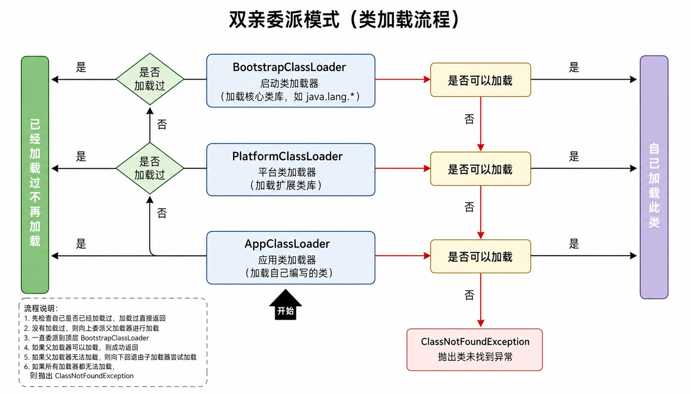

# 类加载器（ClassLoader）

在 Java 中，我们写的 `.java` 文件最终会被编译成 `.class` 字节码文件。但这些字节码并不会自动进入内存执行，它们需要通过一套专门的机制被加载到 JVM 中，这个角色就是类加载器。

类加载器负责把字节码文件读进来，并变成 JVM 可以使用的 Class 对象。

类并不是一开始就全部加载，而是遵循一个很重要的原则：**按需加载（用到才加载）**。
比如：

- 创建对象（`new`）
- 访问类的静态成员
- 初始化一个类（例如子类初始化时触发父类）
- 使用反射获取类信息

这些行为都会触发类加载。

### 类加载的完整过程

类从“磁盘上的字节码文件”变成“JVM 可用的类”，一共要经历三个阶段：加载、链接、初始化。

第一步是**加载（Loading）**。
JVM 会根据“全类名”（包名 + 类名）去定位这个类的字节码文件，然后通过输入流把 `.class` 文件读入内存。加载完成后，JVM 会在内存中生成一个对应的 `Class` 对象。

**字节码文件本身，也被抽象成了一个对象（Class）。** 这个点在后面反射里会真正用到，现在记个印象就够。

———

第二步是**链接（Linking）**。
这一阶段又拆成三个小步骤，但本质是在“把类整理好，确保能安全运行”。

- 验证：检查字节码是否合法，防止恶意代码破坏 JVM（比如结构错误、非法指令）
- 准备：为 `static` 变量分配内存，并赋**默认值**（不是你代码写的值）
- 解析：把常量池里的“符号引用”替换成“真实引用”（比如类名 → 内存地址）

这里有个容易错的点：
**static 变量在这里还没有被赋你写的值，只是先给了默认值。**

———

第三步是**初始化（Initialization）**。
这一阶段才真正执行你的代码，比如：

```java
static int a = 10;
```

在初始化阶段，`a` 才会从默认值 `0` 变成 `10`。

———

整个过程连起来就是：加载是“读进来”，链接是“整理好”，初始化是“真正执行代码”。

### 类加载器的层级

Java 并不是只有一个类加载器，而是分层设计的，这一点是后面“双亲委派”的前提。

主要有三层：

- Bootstrap ClassLoader（启动类加载器）
  负责加载核心类库，比如 `java.lang.*`（注意它是用 C++ 实现的）

- Platform ClassLoader（平台类加载器）
  负责加载一些扩展类库（JDK 的扩展部分）

- Application ClassLoader（应用类加载器）
  负责加载你自己写的代码（classpath 下的类）

如果是我们自己写类加载器，一般也是挂在 Application 下面。

### 双亲委派模型

双亲委派的核心规则是：
**类加载请求不会优先自己处理，而是先交给父加载器。**

整个流程像这样一条链：

Application → Platform → Bootstrap

谁先能加载，就由谁加载。

**例子一：加载 `String`**

`String` 是 JDK 自带类，理论上应该由 Bootstrap 加载。

实际流程是：

1. Application 收到加载请求（你代码里用到了 String）
2. 不自己加载，交给 Platform
3. Platform 也不处理，继续交给 Bootstrap
4. Bootstrap 发现自己能加载（因为是核心类库）
5. 加载完成，返回

结果：
**String 由 Bootstrap 加载**

这保证了一个非常重要的事情：
自己写一个 `java.lang.String` 是不会生效的，避免核心类被篡改。

**例子二：加载 `Student`（自己写的类）**

流程一样走：

1. Application 收到请求
2. 向上委派给 Platform
3. Platform 再给 Bootstrap
4. Bootstrap 检查：加载不了（不是核心类）
5. 返回给 Platform → 也加载不了
6. 最终回到 Application
7. Application 自己加载成功

结果：
**你的类由 Application 加载**

更完整一点可以这样理解：

- 每个类加载器内部都会先检查：**这个类我加载过没有？**

  - 加载过 → 直接返回（避免重复加载）
  - 没加载过 → 才开始走“向上委派”

- 一路向上，直到 Bootstrap

- 如果最顶层也加载不了，才开始**向下回退**，由子加载器尝试加载

- 如果最底层（Application）也加载失败
  → 抛出异常：`ClassNotFoundException`



**为什么要这样设计？**

为了安全和稳定，核心目的就两个：

1. **避免类被重复加载**
2. **防止核心类被篡改（安全性）**

所有类加载都会优先信任“更上层”的加载器，而不是自己乱来。

# 反射

反射是 Java 提供的一种机制，用于**在运行时获取类的信息并进行操作**。

它并不是直接操作字节码，而是通过一个中间对象——`Class`，来完成对类的访问。这一点很好地体现了 Java 的理念：**万物皆对象**，连“类”本身也可以作为对象存在并被操作。

使用反射时，首先需要获取类对应的 `Class` 对象。拿到这个对象后，就可以进一步获取类的结构信息，例如：

- 构造器 → `Constructor`
- 成员变量 → `Field`
- 成员方法 → `Method`

并且可以在运行时对这些成员进行创建、访问或调用。

反射就是在运行时，通过 `Class` 对象获取类结构，并动态操作类的一种方式。

# 加载获取类

在反射的第一步，我们必须先**获得表示某个类的 `Class` 对象**。只有拿到它，才能继续解析类中的构造器、字段和方法。

Java 提供了三种方式来获取 `Class` 对象，这三种方式的结果是相同的——无论哪种方式获取到的都是**同一个** `Class` 实例。

### 类名 `.class`

这是最直接的方式，在编译期就能确定类的类型。

```java
Class c1 = Wolf.class;
System.out.println(c1);
```

输出类似：

```
class com.example.Wolf
```

这里的输出并不是内存地址，而是类的全限定名/全类名（包名 + 类名）。`Class` 类重写了 `toString()` 方法，所以我们能直接看到可读的信息。

### `Class.forName(全类名)`

如果类名是运行时动态确定的（例如配置文件中写的），就不能用 `.class` 方式，这时用 `Class.forName()`。

```java
Class c2 = Class.forName("com.example.Wolf");
System.out.println(c2);
```

这种方式会触发类的加载过程，如果类中有静态代码块，也会被执行。

### 对象 `.getClass()`

当你已经有了某个对象实例，但不确定它的类型时，可以直接向它要 `Class` 对象。

```java
Wolf alpha = new Wolf();

Class c3 = alpha.getClass();
System.out.println(c3);
```

这种方式在实际业务中很常见，因为有时候我们拿到的不是类名，而是一个现成的对象。

# 获取构造器对象

拿到 `Class` 之后，下一步通常是**定位构造器并创建对象**。构造器对应的类型是 `Constructor`，可以批量拿，也可以按参数类型精确定位。

> **带 `Declared` 的方法更常用**，因为它能拿到非 `public` 的成员。

## 获取全部构造器

当你尚不确定需要哪一个签名时，可以先把构造器列表取出来，再做筛选。

- `getConstructors()`只拿 public

```java
Constructor[] getConstructors()
```

只返回 `public` 构造器，权限受限。

- `getDeclaredConstructors()`存在就能拿

```java
Constructor[] getDeclaredConstructors()
```

返回类中声明的所有构造器（包含 `private` / `protected` / 默认 / `public`），开发更常用。

遍历全部构造器：

```java
Class c = com.example.Wolf.class;
Constructor[] cons = c.getDeclaredConstructors(); // 更常用

for (Constructor con : cons) {
    System.out.println(con.getName() + " | 参数个数：" + con.getParameterCount());
}
```

## 获取指定构造器

当已知目标构造器的参数列表，例如“无参”或“`(String,int)`”时，直接精确定位更高效。

- `getConstructor(…parameterTypes)`—— 只拿 `public`

```java
Constructor getConstructor(Class... parameterTypes)
```

- `getDeclaredConstructor(…parameterTypes)`—— 存在就能拿

```java
Constructor getDeclaredConstructor(Class... parameterTypes)
```

通过参数类型列表精确定位目标构造器；常用在你明确知道要哪一个的时候。

拿指定的构造器：

```java
Class c = com.example.Wolf.class;

// 无参构造
Constructor con1 = c.getDeclaredConstructor();

// 有参构造（例如：String 名字, int 等级）
Constructor con2 = c.getDeclaredConstructor(String.class, int.class);
```

## 使用构造器创建对象

定位到构造器之后，就能通过它创建实例。无论其权限如何都可访问，非公开构造器只需要先关闭访问检查。

- `newInstance(…initargs)` 创建实例

```java
Object newInstance(Object... initargs)
```

调用该构造器完成对象初始化并返回。  
如果构造器不是 `public`，需要**关闭访问检查**：

- `setAccessible(true)` 关闭访问检查、“暴力反射”

```java
void setAccessible(boolean flag)
```

设为 `true` 后，可调用 `private` 等非公开构造器。

调用无参 + 私有有参构造：

```java
// 1) 无参构造（public）
Object w1 = con1.newInstance();
System.out.println(w1);

// 2) 私有有参构造（需要关闭访问检查）
con2.setAccessible(true);
Object w2 = con2.newInstance("影牙", 5);
System.out.println(w2);
```

正是因为可以突破封装边界（在受控前提下访问非 `public` 构造器），反射在不少关键框架里才派上大用场。现在感受可能不强，**先知道它能做到什么**，别小看这点能力。

过去是我们去找构造器再 `new`；用反射时，换成在运行期让“构造器”主动完成实例化。这种对类元信息的“反向驱动”方式，就是反射的意义所在。

# 获取成员变量对象

拿到 `Class` 之后，除了构造器，另一类常用的元信息就是**成员变量**。获取到 `Field` 的目的依旧朴素：**取值**与**赋值**。先能拿到，再谈操作。

> 同样的经验法则：**带 `Declared` 的方法更常用**，因为它不受可见性限制。

## 获取全部成员变量

当你还不清楚类里都有些什么字段时，先把列表拿出来，再决定要用哪个。

- `getFields()` —— 只拿 `public`

```java
Field[] getFields()
```

- `getDeclaredFields()` —— 存在就能拿

```java
Field[] getDeclaredFields()
```

示例：遍历全部字段，先看“都有谁”

```java
Class c = com.example.Wolf.class;
Field[] fields = c.getDeclaredFields(); // 更常用
for (Field f : fields) {
    System.out.println(f.getType() + " => " + f.getName());
}
```

这一步的价值在于“摸清家底”，输出类型与名称，便于后续精准定位。

## 获取指定成员变量

当你已经知道要操作哪个字段（例如 `name` 或 `rank`），直接按名称精确定位。

- `getField(String name)` —— 只拿 `public`

```java
Field getField(String name)
```

- `getDeclaredField(String name)` —— 存在就能拿

```java
Field getDeclaredField(String name)
```

例如定位到 `name` 字段：

```java
Class c = com.example.Wolf.class;
Field fname = c.getDeclaredField("name");
```

## 给字段赋值 / 取值

反射到字段的目的还是为了给字段赋值取值。定位到 `Field` 的下一步，就是对对象实例进行读写。
非 `public` 字段在直接访问时会报错，同样需要先关闭访问检查。

- 赋值：`set(Object obj, Object value)`
- 取值：`get(Object obj)`
- 关闭检查：`setAccessible(true)`

**示例：给 `name` 赋值并读取**

```java
com.example.Wolf w = new com.example.Wolf();

Field fname = com.example.Wolf.class.getDeclaredField("name");
fname.setAccessible(true);        // 允许访问非 public 字段

fname.set(w, "影牙");            // 赋值
String name = (String) fname.get(w); // 取值
System.out.println(name);         // 影牙
```

这就具备了通过反射“解剖并操控对象状态”的能力

# 获取成员方法对象

在拿到 `Class` 后，成员方法对应 `Method`。目的仍然直接：**定位方法 → 执行方法**。先能找到，再谈调用。

> 同样的经验法则：带 `Declared` 的方法更常用（不受可见性限制）。

## 获取全部方法

不确定需要哪一个时，先取清单再筛选。

- `getDeclaredMethods()` —— 存在就能拿（不含父类继承的方法）

```java
Method[] getDeclaredMethods()
```

示例：遍历方法名、参数个数、返回类型

```java
Class c = com.example.Wolf.class;
Method[] methods = c.getDeclaredMethods();
for (Method m : methods) {
    System.out.println(m.getName() + " | 参数：" + m.getParameterCount()
            + " | 返回：" + m.getReturnType().getSimpleName());
}
```

> 需要包含父类 `public` 方法时，可用 `getMethods()`。

## 获取指定方法

方法可以重载，因此**除了方法名，还必须提供参数类型列表**。

- `getDeclaredMethod(String name, Class... parameterTypes)` —— 存在就能拿

```java
Method getDeclaredMethod(String name, Class... parameterTypes)
```

示例：无参方法与有参方法

```java
Class c = com.example.Wolf.class;

// 无参：例如 howl()
Method howl = c.getDeclaredMethod("howl");

// 有参：例如 hunt(String target, int times)
Method hunt = c.getDeclaredMethod("hunt", String.class, int.class);
```

## 调用方法

定位到 `Method` 的最终目的是执行。非 `public` 方法同样需要先关闭访问检查。

- 执行：`invoke(Object obj, Object... args)`
- 关闭检查：`setAccessible(true)`

示例：调用无参 + 私有有参方法

```java
com.example.Wolf w = new com.example.Wolf();

// 1) 无参（public）
Object r1 = howl.invoke(w);
System.out.println(r1);

// 2) 私有有参（需要关闭访问检查）
hunt.setAccessible(true);
Object r2 = hunt.invoke(w, "寒原野鹿", 2);
System.out.println(r2);
```

返回值类型不为 `void` 时，可按需要做强制类型转换；静态方法可将 `obj` 位置传 `null` 调用。  
至此，成员方法的“拿到—定位—执行”链路与构造器、字段保持一致，形成完整的反射操作闭环。

# 注解

注解（Annotation）是写在代码里的**结构化标记**，由工具或框架在编译期或运行期读取并据此改变行为。
常见如 `@Override`（编译器做一致性检查）、`@Test`（测试运行器只执行被标记的方法）。

这些标记之所以“能被理解”，是因为注解把“说明书”写进了代码里，程序就能按说明执行。

## 自定义注解

基本语法与接口相似，但关键字是 `@interface`，属性以“无参方法”形式声明，可选 `default` 默认值。

```java
public @interface MyTest {
    String name();
    double price() default 100.0;
    String[] authors();
}
```

有了注解的定义，接下来就是把它贴到类、字段或方法上，给程序“加说明”。

注解可以标在类、字段、方法等位置，属性以“键=值”形式赋值。

```java
@MyTest(name = "群猎流程", price = 9.9, authors = {"影牙", "夜哨"})
public class WolfGuide {

    @MyTest(name = "编号", authors = {"雪爪"})
    private String code;

    @MyTest(name = "起猎", authors = {"黑焰", "裂风"})
    public static void main(String[] args) {
        // ...
    }
}
```

`value`是一个特殊属性名，当注解**只有一个**名为 `value` 的属性时，使用时可以省略 `value=`。

```java
public @interface Route {
    String value();
}
```

以下两种写法等价：

```java
@Route("hunt/start")
// @Route(value = "hunt/start")
class WolfTask { }
```

声明与使用之外，还需要知道“注解在语言层面是什么”，这决定了它能被如何解析与调用。

## 注解的本质

从语义上讲，注解像一份接口式的“元信息描述”。反编译视角可见其等价的接口形态：所有注解类型都**继承 `java.lang.annotation.Annotation`**。

```java
public @interface MyMark {
    String id();
    boolean active();
    String[] tags();
}

// 反编译等价视角
public interface MyMark extends java.lang.annotation.Annotation {
    String id();
    boolean active();
    String[] tags();
}
```

使用时：

```java
@MyMark(id = "W-01", active = true, tags = {"howl", "hunt"})
public void runPlan() { }
```

## 元注解

元注解是**修饰注解的注解**，用来回答两个问题：

- 它能贴在哪里（`@Target`）
- 它能活到什么时候（`@Retention`）

最小示例（先感受一下效果）：

```java
import java.lang.annotation.*;

@Retention(RetentionPolicy.RUNTIME)
@Target(ElementType.METHOD)
public @interface MyTest { }
```

这表示：`@MyTest` 只能贴在**方法**上，并且会一直保留到**运行期**，便于反射解析。

常用的也主要是这两个元注解。

### `@Target`-限定位置

不希望注解“到处乱贴”时，就用 `@Target` 指定作用位置。常见取值：

| `@Target` 取值               | 可标注位置 | 说明               |
| ---------------------------- | ---------- | ------------------ |
| `ElementType.TYPE`           | 类 / 接口  | 声明在类型上       |
| `ElementType.FIELD`          | 成员变量   | 包括静态/实例字段  |
| `ElementType.METHOD`         | 成员方法   | 普通方法、非构造器 |
| `ElementType.PARAMETER`      | 方法参数   | 形参位置           |
| `ElementType.CONSTRUCTOR`    | 构造器     | 构造方法           |
| `ElementType.LOCAL_VARIABLE` | 局部变量   | 方法体内的本地变量 |

例如只想允许标注在方法上：

```java
import java.lang.annotation.*;

@Target(ElementType.METHOD)
public @interface Route { }
```

### `@Retention`-限定生命周期

| `@Retention` 取值 | 保留阶段               | 编译后是否存在 | 运行期是否可反射 | 典型场景                      |
| ----------------- | ---------------------- | -------------- | ---------------- | ----------------------------- |
| `SOURCE`          | 仅源码                 | 否             | 否               | 编译器提示、代码生成标记      |
| `CLASS`（默认）   | 源码 → 字节码          | 是             | 否               | 框架不解析、仅保留到 `.class` |
| `RUNTIME`         | 源码 → 字节码 → 运行期 | 是             | 是               | 运行期反射解析（常用）        |

希望运行期还能解析到注解时，必须使用 `RUNTIME`：

```java
import java.lang.annotation.*;

@Retention(RetentionPolicy.RUNTIME)
@Target({ElementType.TYPE, ElementType.METHOD})
public @interface HuntSpec {
    String value();
}
```

应用示例（仅作演示，示例统一“狼”）：

```java
@HuntSpec("寒原")
public class Wolf {

    @HuntSpec("月夜速猎")
    public void hunt() { }
}
```

例如 junit 的 `@Test` 注解，测试框架需要在**运行期**发现哪些方法要执行，因此它的注解通常是：

```java
import java.lang.annotation.*;

@Retention(RetentionPolicy.RUNTIME)
@Target(ElementType.METHOD)
public @interface Test { }
```

设置为 `RUNTIME + METHOD`，运行器才能在运行期扫描到并执行这些测试方法。

## 解析注解

解析注解（Annotation Processing）能够判断类、方法、字段、构造器上是否存在某个注解，并把注解里的属性值读取出来。

核心思路很直接：

> 要解析谁的注解，就先拿到谁的反射对象，再从它身上读取注解。

`Class`、`Method`、`Field`、`Constructor` 都实现了 `AnnotatedElement` 接口，提供了解析注解的常用方法：

```java
Annotation[] getDeclaredAnnotations()                  // 取“本体声明”的所有注解
<T extends Annotation> T getDeclaredAnnotation(Class<T> annotationClass) // 取指定注解
boolean isAnnotationPresent(Class<? extends Annotation> annotationClass)  // 是否存在某注解
```

通常先用 `isAnnotationPresent` 试探是否存在这个注解，再用 `getDeclaredAnnotation` 取对象，最后读属性值即可。

1. 定义注解（含位置与生命周期）

目标：定义 `@MyTest4`，用于**类与方法**，在**运行期**可被解析；属性为 `value`、`aaa`（默认 100）、`bbb`（数组）。

```java
import java.lang.annotation.*;

@Target({ElementType.TYPE, ElementType.METHOD})
@Retention(RetentionPolicy.RUNTIME)
public @interface MyTest4 {
    String value();
    double aaa() default 100;
    String[] bbb();
}
```

2. 使用注解（贴到类与方法上）

演示时统一用“狼”的语境，但仅在代码内出现。

```java
@MyTest4(value = "巡猎计划", bbb = {"影牙", "夜哨"})
class Demo {

    @MyTest4(value = "夜行速猎", aaa = 999, bbb = {"黑焰", "裂风", "雪爪"})
    public void test1() { }
}
```

3. 解析类与方法上的注解

步骤：**先拿反射对象 → 判断是否存在 → 获取注解对象 → 读取属性值**。

```java
import java.lang.annotation.Annotation;
import java.lang.reflect.Method;
import java.util.Arrays;

public class AnnotationParser {

    // 解析类上的注解
    public static void parseClass() throws Exception {
        Class<?> c = Demo.class;

        if (c.isAnnotationPresent(MyTest4.class)) {
            MyTest4 a = c.getDeclaredAnnotation(MyTest4.class);
            System.out.println(a.value());
            System.out.println(a.aaa());
            System.out.println(Arrays.toString(a.bbb()));
        }
    }

    // 解析方法上的注解
    public static void parseMethod() throws Exception {
        Method m = Demo.class.getDeclaredMethod("test1");

        if (m.isAnnotationPresent(MyTest4.class)) {
            MyTest4 a = m.getDeclaredAnnotation(MyTest4.class);
            System.out.println(a.value());
            System.out.println(a.aaa());
            System.out.println(Arrays.toString(a.bbb()));
        }
    }
}
```

两个解析函数分别演示了“解析类上的注解”和“解析方法上的注解”，结构一致，易于迁移到字段、构造器等位置。
