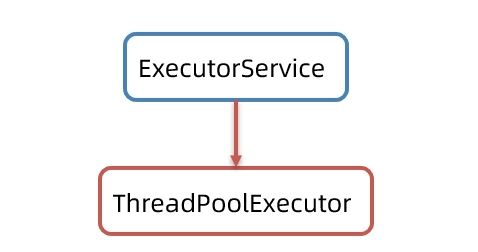
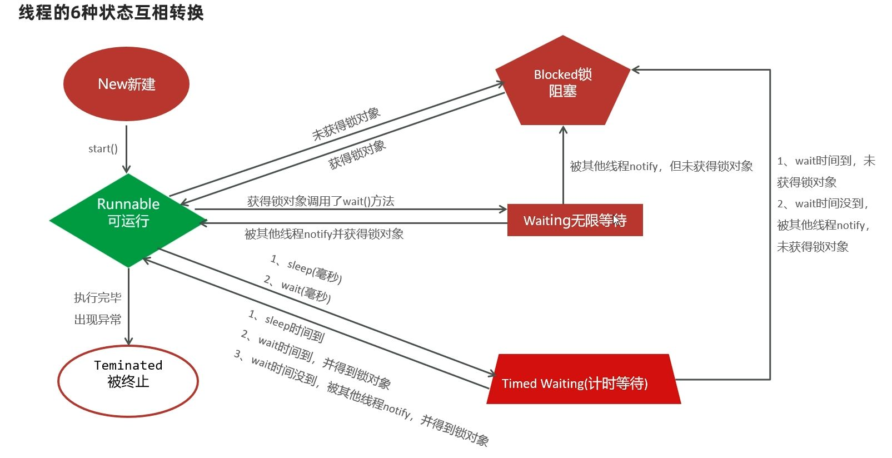

# 进程与线程

## 进程

进程（Process）可以简单理解成：**正在运行中的程序**。
也就是说，程序一旦运行起来，就不再只是一个静态文件，而会变成一个正在执行的进程。

更准确一点说，进程是程序关于某个数据集合的一次运行活动，也是系统进行**资源分配的基本单位**。

例如我们打开浏览器、音乐播放器、IDEA，这些运行起来的程序，本质上都是一个个进程。

进程有几个比较明显的特点。

第一，**独立性**。
每个进程都有自己的内存空间和运行环境，在没有允许的情况下，一个进程不能直接访问另一个进程的空间。

第二，**动态性**。
进程不是一直固定存在的，而是动态产生、动态结束的。程序启动时会产生进程，程序结束时进程也会消亡。

第三，**并发性**。
多个进程可以同时参与运行，看起来像是在一起工作。

## 并发与并行

前面提到进程具有并发性，这里就要先把两个容易混淆的概念分清楚：**并发** 和 **并行**。

**并行** 指的是：
在同一时刻，有多个指令在多个 CPU 核心上**同时执行**。

**并发** 指的是：
在同一时刻，有多个指令在单个 CPU 上**交替执行**。

也就是说：

- 并行更强调“真的同时”
- 并发更强调“看起来同时”

从程序角度看，多个任务好像是在一起跑；
但对于单核 CPU 来说，它本质上还是在多个任务之间快速轮换执行。

所以，多进程同时工作的本质，其实往往就是：

> **CPU 在多个进程之间来回切换执行。**

正因为切换速度非常快，人就会感觉它们像是同时运行的一样。

## 线程

如果说进程是“运行中的程序”，那么线程（Thread）就是**进程中的一条执行路径**。

也可以把线程理解成：**程序内部的一条执行流程**。

例如下面这个程序：

```java id="nck03j"
public class Test {
    public static void main(String[] args) {
        for (int i = 0; i < 10; i++) {
            System.out.println(i);
        }
    }
}
```

这个程序从 `main` 方法开始，一路顺序执行到底，只有一条执行路径。
所以它就是一个**单线程程序**。

但一个进程中，并不一定只有一条线程。
同一个进程里，完全可以同时存在多条执行路径，而这些执行路径就是多个线程。

因此可以这样理解：

> **进程是资源分配的基本单位，线程是程序执行的基本单位。**

换句话说，进程更像是一个“运行环境”，而线程才是真正负责执行任务的那条线。

## 多线程

多线程，指的就是：**一个程序中同时存在多条执行路径**。

这些线程由 CPU 统一调度执行。
在单核 CPU 下，它们通常是交替执行；在多核 CPU 下，则有机会真正并行执行。

随着处理器核心越来越多，现代计算机对多线程的支持也越来越强。
不过要注意，一个线程在某一时刻，仍然只能运行在一个处理器核心上。

多线程最大的意义，主要体现在两个方面。

第一，**提高执行效率**。
一些任务可以拆开处理，不必全都堵在一条执行路径上。

第二，**同时处理多个任务**。
例如一边接收消息，一边刷新界面，一边处理后台逻辑，这些都更适合交给不同线程完成。

所以多线程的价值，不只是“跑得更快”，更重要的是让程序能够同时应对多个任务，提高整体的处理能力和响应能力。

> Java 程序默认是多线程的

程序启动之后通常就已经有：

- `main` 线程
- 垃圾回收线程

`main` 线程很好理解，就是程序入口那条主执行路径。
而垃圾回收线程，则负责在合适的时候回收不再使用的对象。

在 Java 中，如果一个对象已经**没有任何引用指向它**，那么这个对象就会变成垃圾对象。

例如：

```java id="xyktte"
new Demo();
```

如果这个对象创建出来之后，没有被任何变量接收，那么后面就没有办法再访问它了。
这种对象就属于可以被回收的垃圾对象。

当垃圾对象积累到一定程度，或者内存压力变大时，垃圾回收机制就可能开始工作。
这个过程通常由垃圾回收线程参与完成。

在一些早期或教学示例中，可能会通过 `finalize()` 方法来观察对象被回收的现象，例如：

```java id="ykf2w7"
class Demo {
    @Override
    protected void finalize() throws Throwable {
        System.out.println("垃圾被清理了...");
    }
}
```

不过这里要注意：

> `finalize()` 这个方法现在已经过时了，不推荐在实际开发中使用。

这里提到它，只是为了帮助理解：
Java 程序在运行过程中，除了 `main` 线程，还可能有垃圾回收相关的线程在后台工作。

# 线程创建方式

### 方式一：继承 Thread 类

在 Java 中，最简单的一种多线程创建方式，就是继承 `Thread` 类。官方的描述是：  
将类声明为 `Thread` 的子类，覆盖 `run` 方法来定义任务，然后创建并启动该子类的实例。

具体过程可以分为四步：

1. 定义一个类继承 `Thread`，成为线程类。
2. 重写 `run` 方法，声明线程要干的事情。

```java
// 1. 定义一个线程类，继承 Thread
class MyThread extends Thread {
    @Override
    public void run() {
        // 2. 声明线程要做的事
        for (int i = 0; i < 4; i++) {
            System.out.println("子线程输出：" + i);
        }
    }
}
```

3. 在 `main` 方法中创建线程对象，代表一条具体的线程。
4. 调用 `start()` 方法启动线程，线程会自动执行 `run` 中的代码。

```java
public class ThreadDemo1 {
    public static void main(String[] args) {
        // main 方法本身就是主线程在执行
        System.out.println("main 方法开始...");

        // 3. 创建线程对象
        Thread t = new MyThread();

        // 4. 启动线程：会自动执行 run 方法
        t.start();

        for (int i = 0; i < 4; i++) {
            System.out.println("main 线程输出：" + i);
        }
    }
}
```

运行结果会看到主线程和子线程交替输出，但它们的顺序**是随机的**。原因在于，线程启动后交给 CPU 调度，程序无法保证谁先谁后。

这里有几个容易犯错的点：

- 启动线程必须用 `start()`，而不是直接调用 `run()`。如果写 `run()`，那它就是普通方法调用，依旧只在主线程里跑，相当于没有开启新线程。
- 不要把主线程的任务写在子线程启动之前，否则会导致主线程先跑完，看起来还是单线程的效果。
- Java 程序本身没有直接“开线程”的权限，实际上是通过 `Thread` 向操作系统申请，由内核去调度。

这种方式写法直观、容易上手，很适合初学者。但由于类一旦继承了 `Thread`，就不能再继承别的父类，因此在扩展性上会受到一些限制。

### 方式二：实现 Runnable 接口

继承 `Thread` 并不是唯一的选择，另一种更常见的方式是**让类去实现 `Runnable` 接口**。  
这种写法的核心思路是：把线程要执行的任务抽象成一个对象，然后交给 `Thread` 来负责调度。

步骤其实很清晰：

1. 定义一个任务类，实现 `Runnable` 接口，并重写 `run` 方法。

```java
// 1. 定义一个任务类，实现 Runnable 接口
class MyRunnable implements Runnable {
    @Override
    public void run() {
        for (int i = 0; i < 4; i++) {
            System.out.println("子线程输出：" + i);
        }
    }
}
```

2. 创建这个任务类的对象，封装线程要做的事情。
3. 把任务对象交给 `Thread` 来处理，利用 `Thread` 的构造器：

   ```java
   public Thread(Runnable target)
   ```

   这样就能把任务包装成真正的线程对象。

4. 调用 `start()` 方法，启动线程。

```java
public class ThreadDemo2 {
    public static void main(String[] args) {
        // 2. 创建任务对象
        Runnable target = new MyRunnable();

        // 3. 把任务对象交给 Thread
        Thread t = new Thread(target);

        // 4. 启动线程
        t.start();

        // 主线程继续执行
        for (int i = 0; i < 4; i++) {
            System.out.println("main 线程输出：" + i);
        }
    }
}
```

运行结果同样是主线程和子线程交替输出，顺序不固定，取决于 CPU 调度。

在实际开发中，这种方式常配合**匿名内部类**甚至 **Lambda 表达式**，可以写得更简洁：

- 匿名内部类

```java

new Thread(new Runnable() {
    @Override
    public void run() {
        for (int i = 0; i < 4; i++) {
            System.out.println("子线程 1 输出：" + i);
        }
    }
}).start();
```

- Lambda 表达式（JDK 8+）

```java

new Thread(() -> {
    for (int i = 0; i < 4; i++) {
        System.out.println("子线程 2 输出：" + i);
    }
}).start();
```

这样就不用单独写一个类了，尤其在只需要临时创建线程的场景下非常方便。

这种方式更灵活，任务和线程本身是分开的，类也不会被继承限制卡住，扩展性更好。
不过它需要额外创建一个 `Runnable` 对象，而且 `run` 方法本身没有返回值，这是它的小遗憾。

继承 `Thread` 更像是“我自己就是线程”；  
实现 `Runnable` 则是“我定义了一个任务，把它交给线程去跑”。

### 方式三：实现 Callable 接口

前两种方式（继承 `Thread`、实现 `Runnable`）有一个共同的缺点：

> 线程执行完毕后，无法直接返回结果。

为了解决这个问题，从 JDK 5.0 开始，Java 提供了 **`Callable` 接口** 和 **`FutureTask` 类**。  
这种方式的最大优势，就是能够在任务执行完毕后，获取线程的返回值。

1. 定义一个类实现 `Callable` 接口，并重写 `call()` 方法。

   - `call` 方法既可以声明任务，又能返回结果（不同于 `run`）。

2. 创建 `Callable` 对象，并用 `FutureTask` 来封装。

   - `FutureTask` 既是一个 `Runnable` 对象，可以被线程执行；
   - 又可以在任务结束后通过 `get()` 方法拿到返回结果。

```java
import java.util.concurrent.Callable;
import java.util.concurrent.FutureTask;

// 1. 定义任务类，实现 Callable
class MyCallable implements Callable<String> {
    private int n;

    public MyCallable(int n) {
        this.n = n;
    }

    // 2. 重写 call 方法，既执行任务，又返回结果
    @Override
    public String call() throws Exception {
        int sum = 0;
        for (int i = 1; i <= n; i++) {
            sum += i;
        }
        return "子线程计算 1-" + n + " 的结果是：" + sum;
    }
}
```

3. 把 `FutureTask` 对象交给 `Thread`。
4. 调用 `start()` 方法启动线程。
5. 线程执行完毕后，通过 `FutureTask.get()` 获取结果。

```java
public class ThreadDemo3 {
    public static void main(String[] args) throws Exception {
        // 3. 创建 Callable 对象
        Callable<String> call = new MyCallable(100);

        // 4. 用 FutureTask 封装
        FutureTask<String> task = new FutureTask<>(call);

        // 5. 把任务交给线程
        Thread t = new Thread(task);

        // 6. 启动线程
        t.start();

        // 7. 获取线程执行结果
        String result = task.get(); // 可能阻塞，直到子线程执行完毕
        System.out.println(result);

        System.out.println("main 线程继续执行...");
    }
}
```

### FutureTask API 补充

- 构造器：

```java
  public FutureTask<>(Callable<V> call)
```

把一个 `Callable` 封装成 `FutureTask`。

- 方法：

  ```java
  public V get() throws Exception
  ```

  用来获取线程执行完毕后 `call` 方法的返回结果。

**Callable + FutureTask** 就像给线程加了“回执”。它不仅能执行任务，还能把结果带回来。

# Thread 常用方法

`Thread` 类不止能用来创建线程，还提供了许多常见的操作方法。下面挑几个最常用的来演示。

## `run` / `start`

- `run()` 是线程的任务方法，一般不会手动去调。
- `start()` 才是真正启动线程的方法，调用后 JVM 会新开一条执行路径，然后自动执行 `run()`。

```java
Thread t1 = new MyThread();
t1.start(); // 启动线程
System.out.println(t1.getName()); // 默认名字：Thread-0
```

## 线程名称 `get/setName`

每条线程都有名字，默认是 `Thread-0`、`Thread-1` 这样。可以用 `getName()` 查看，用 `setName()` 改名。

```java
Thread t1 = new MyThread();
t1.setName("一号线程");
t1.start();
System.out.println(t1.getName());
```

构造器同样可以直接指定线程名字，相比 setName 更简洁：

```java
Thread t2 = new MyThread("二号线程");
t2.start();
System.out.println(t2.getName());
```

常见构造方法如下：

```java
Thread(String name);                  -> 指定线程名字
Thread(Runnable target);              -> 把任务包装成线程
Thread(Runnable target, String name); -> 任务 + 名字一起指定
```

## currentThread 获取当前线程

静态方法 `currentThread()` 可以拿到**正在执行的线程对象**。

```java
Thread m = Thread.currentThread();
System.out.println(m.getName()); // 在 main 方法里就是 "main"
```

更常见的用法是在循环里打印：

```java
System.out.println(Thread.currentThread().getName() + " => 输出：" + i);
```

## sleep 休眠

`sleep(long time)` 让当前线程暂停一会儿（毫秒），等到时间到了再继续。

```java
for (int i = 1; i <= 5; i++) {
    System.out.println("输出：" + i);
    Thread.sleep(1000); // 每次停 1 秒
}
```

适合用来模拟延时、控制节奏。

`sleep()` 会抛出 `InterruptedException`，因为线程可能被外部打断。
一旦收到中断信号，线程会立即抛出异常，并清除掉中断标识。如果后续逻辑还要判断是否中断，就得重新设置标识。

## join 插队

`join()` 会让调用它的线程“插队”，必须先执行完，当前线程才能继续。

```java
Thread t = new MyThread2();
t.start();

for (int i = 0; i < 4; i++) {
    System.out.println("main 线程输出：" + i);
    if (i == 2) {
        t.join(); // 等 t 执行完，再继续 main
    }
}
```

在需要等待某个线程完成再做后续逻辑时，`join` 非常好用。

# 线程安全

当我们写并发程序时，一个经典的问题就是：多个线程在同时操作同一份数据时，可能会出现错误，这就是**线程安全问题**。

一个银行账户，余额是 10 万元。小明和小红作为夫妻共用这个账户，他们各自都要取 10 万元。
理想情况下，只能有一个人取成功，另一个会提示余额不足。但在多线程并发的场景下，情况可能变得混乱。

代码演示：

```java
public class Test {
    public static void main(String[] args) {
        Account acc = new Account("ICBC-110", 100000);

        new DrawThread("小明", acc).start();
        new DrawThread("小红", acc).start();
    }
}
```

取钱的线程：

```java
public class DrawThread extends Thread {
    private Account acc;

    public DrawThread(String name, Account acc) {
        super(name);
        this.acc = acc;
    }

    @Override
    public void run() {
        acc.drawMoney(100000);
    }
}
```

账户类：

```java
public class Account {
    private String cardId;
    private double money;

    public Account(String cardId, double money) {
        this.cardId = cardId;
        this.money = money;
    }

    public void drawMoney(double money) {
        String name = Thread.currentThread().getName();

        if (this.money >= money) {
            System.out.println(name + "取钱成功，吐出：" + money);

            // 更新余额的动作放在最后，故意放大并发冲突的可能性
            this.money -= money;
            System.out.println(name + "取钱后，账户余额：" + this.money);
        } else {
            System.out.println(name + "取钱失败，余额不足！");
        }
    }
}
```

可能的运行结果：

```
小明取钱成功，吐出：100000.0
小红取钱成功，吐出：100000.0
小明取钱后，账户余额：0.0
小红取钱后，账户余额：-100000.0
```

逻辑上显然是不可能的，但程序却允许了——两个线程几乎同时判断余额够用，然后都进入扣款环节。等操作结束时，余额甚至成了负数。

这正好揭示了线程安全问题的三个要素：

1. 存在多个线程同时运行。
2. 多个线程都在访问同一个共享资源。
3. 并且对共享资源进行了修改操作。

满足这三个条件，就很容易出现线程安全问题。

要修复线程安全问题，根源在于：

> 多个线程同时修改同一个共享资源。

解决办法其实很直接——**让线程一个一个来，而不是一窝蜂地抢**。这就是线程同步的思想。

所谓“同步”，就是给共享资源加一把锁：谁先拿到锁，谁就能进来操作；操作完毕再把锁交出去，其他线程才能继续。这样就避免了混乱。

接下来，常见的加锁方式有三种：

### 同步代码块

线程安全问题往往只出现在那几行**修改共享资源的关键代码**里。  
因此，我们只需要给这些核心代码套上一把锁，就能保证同一时间只有一个线程能进来操作。

写法很直观：

```java
synchronized (锁对象) {
    // 访问共享资源的代码
}
```

线程在进入代码块前，必须先拿到这把锁；执行完毕后会自动释放锁。其他线程只有在拿到锁之后，才能继续执行。

来看一下取钱方法的改造：

```java
public void drawMoney(double money) {
    String name = Thread.currentThread().getName();

    // 使用账户对象本身作为锁
    synchronized (this) {
        if (this.money >= money) {
            System.out.println(name + "取钱成功，吐出：" + money);

            // 更新余额
            this.money -= money;
            System.out.println(name + "取钱后，账户余额：" + this.money);
        } else {
            System.out.println(name + "来取钱：余额不足！");
        }
    }
}
```

这里最关键的是**锁对象的选择**。

不推荐随便写个字符串当锁，那会导致所有线程都在抢同一把“全国通用锁”，同一时间只能一个人用，效率极低。

正确做法是：让共享资源自己当锁。

- 对于实例方法，直接用 `this`；
- 如果是静态方法，则用 `类名.class` 作为锁对象。

### 同步方法

如果一个方法的整个逻辑都会涉及共享资源，那就没必要只在局部套锁了，直接把整个方法声明为同步方法更省事。

写法也很直白：

```java
修饰符 synchronized 返回值类型 方法名(参数列表) {
    // 操作共享资源的代码
}
```

运行时效果和同步代码块类似：**同一时间只允许一个线程进入方法体**，执行完毕后自动释放锁。

比如账户取钱的改造版：

```java
public synchronized void drawMoney(double money) {
    String name = Thread.currentThread().getName();

    if (this.money >= money) {
        System.out.println(name + "取钱成功，吐出：" + money);

        // 更新余额
        this.money -= money;
        System.out.println(name + "取钱后，账户余额：" + this.money);
    } else {
        System.out.println(name + "来取钱：余额不足！");
    }
}
```

这里不用再手动写 `synchronized(this)`，因为**实例方法默认就是以 `this` 作为锁对象**。如果方法是静态的，那隐式锁就是 `类名.class`。

需要注意的一点：同步方法的锁范围是整个方法，相比于“只锁住关键几行”的同步代码块，性能略差。
但在实际开发里，这点差距并不敏感，反而因为写法简洁、可读性强，同步方法更常被用在实际开发中。

### Lock 锁

同步代码块和同步方法都是基于关键字 `synchronized` 的，但从 JDK5 开始，Java 提供了更灵活的**显示锁机制**——`Lock` 接口及其实现类。

最常用的实现类是 **ReentrantLock**，顾名思义，它支持可重入（同一个线程可以多次获得同一把锁）。

要点如下：

- `Lock lock = new ReentrantLock();` 创建锁对象
- `lock.lock()` 获取锁（加锁）
- `lock.unlock()` 释放锁（解锁）

不同于 `synchronized` 的隐式释放，`Lock` 需要**手动解锁**，所以一般会配合 `try-finally` 使用，以确保即便发生异常，也不会忘记释放。

来看账户取钱的例子：

```java
import java.util.concurrent.locks.Lock;
import java.util.concurrent.locks.ReentrantLock;

public class Account {
    private String cardId;
    private double money;
    private final Lock lock = new ReentrantLock(); // 唯一的锁对象

    public void drawMoney(double money) {
        String name = Thread.currentThread().getName();
        lock.lock(); // 加锁
        try {
            if (this.money >= money) {
                System.out.println(name + "取钱成功，吐出：" + money);
                this.money -= money;
                System.out.println(name + "取钱后，账户余额：" + this.money);
            } else {
                System.out.println(name + "来取钱：余额不足！");
            }
        } finally {
            lock.unlock(); // 解锁
        }
    }
}
```

这里的 `lock` 是一个成员变量，加上 `final` 修饰，保证整个对象只有这一把锁，避免被替换。

与 `synchronized` 相比，`Lock` 更具优势：

- **可控性更强**：加锁和解锁完全由程序员决定。
- **功能更丰富**：`ReentrantLock` 提供了公平锁、可中断锁、尝试加锁等高级特性。
- **代码粒度灵活**：你可以选择在方法任意位置加锁/解锁，而不仅限于方法或代码块的边界。

# 线程池

线程池是一种**复用线程**的技术。它的本质是提前准备一批工作线程，这些线程不会随任务完成而销毁，而是不断循环接收新任务。这样避免了频繁创建和销毁线程带来的性能开销。

如果不使用线程池，每次用户请求都要新建一个线程处理，下一个请求又得再建一个。线程创建和销毁本身代价很大，请求一多就会导致线程数量暴涨，最终严重拖慢系统性能。

所以线程池的思想就是：

- 固定数量的工作线程常驻内存，**不轻易死亡**。
- 任务被放进一个任务队列，线程从队列里取活儿干。
- 控制线程和任务的数量，做到**线程复用**。

可以简单理解为：**任务队列 + 一群复用的工作线程**。

## 创建线程池

在 Java 里，线程池的核心接口是 `ExecutorService`。但它只是个接口，不能直接创建对象。



JDK5 之后提供了 `ThreadPoolExecutor` 作为真正的实现类。

### ThreadPoolExecutor 构造器

```java
public ThreadPoolExecutor(
    int corePoolSize,              // 核心线程数
    int maximumPoolSize,           // 最大线程数
    long keepAliveTime,            // 临时线程存活时间
    TimeUnit unit,                 // 时间单位（秒、分、时、天）
    BlockingQueue<Runnable> workQueue,   // 任务队列
    ThreadFactory threadFactory,   // 线程工厂
    RejectedExecutionHandler handler // 拒绝策略
)
```

这个构造器的参数很多：

- **corePoolSize**：核心线程数。线程池中始终存活的线程数。
- **maximumPoolSize**：最大线程数。包括核心线程 + 临时线程。
- **keepAliveTime** & **unit**：临时线程的存活时间，超过时间没活干就会被回收。
- **workQueue**：存放任务的队列，可以指定链表也可以用数组。
- **threadFactory**：决定线程如何创建。
- **handler**：拒绝策略，当线程和队列都满了时如何处理新任务。

当线程池的线程和任务队列都满了时，新任务就会触发拒绝策略。常见的几种策略如下：

| 策略                    | 说明                                               |
| ----------------------- | -------------------------------------------------- |
| **AbortPolicy** (默认)  | 丢弃任务并抛出 `RejectedExecutionException` 异常。 |
| **DiscardPolicy**       | 丢弃任务，但不抛异常（一般不推荐）。               |
| **DiscardOldestPolicy** | 丢弃队列中等待最久的任务，把当前任务加入队列。     |
| **CallerRunsPolicy**    | 由调用者线程直接执行任务，绕过线程池。             |

下面来一个示例：

```java
ExecutorService pool = new ThreadPoolExecutor(
    2, 5, 1, TimeUnit.MINUTES,
    new ArrayBlockingQueue<>(3),
    Executors.defaultThreadFactory(),
    new ThreadPoolExecutor.AbortPolicy()
);
```

线程池里会始终保留 2 个核心线程，最多能扩展到 5 个线程。多出来的临时线程如果 1 分钟没活干就会被回收。
任务最多可以排队 3 个，多出来的任务就直接触发拒绝策略，这里采用的是 `AbortPolicy` ——也就是抛出异常。线程由默认工厂创建。

这样创建的线程池，就能平衡资源和性能。

### 线程池处理

JDK 提供的 `ExecutorService` 接口就是入口，它定义了提交任务的方式。

常用的两个方法：

- `void execute(Runnable command)`：执行一个 `Runnable` 任务，没有返回值。
- `<T> Future<T> submit(Callable<T> task)`：执行一个 `Callable` 任务，有返回值，结果会被包装在 `Future` 对象里。

#### 处理 Runnable 任务

先从 `Runnable` 入手。写一个简单的任务类：

```java
public class MyRunnable implements Runnable {
    @Override
    public void run() {
        for (int i = 1; i <= 3; i++) {
            System.out.println(Thread.currentThread().getName() + " 输出：" + i);
        }
    }
}
```

接着在主类中创建线程池，并提交任务：

```java
public class ThreadPoolExecutorDemo1 {
    public static void main(String[] args) {
        ExecutorService pool = new ThreadPoolExecutor(
            3, 5,
            60, TimeUnit.SECONDS,
            new ArrayBlockingQueue<>(3),
            Executors.defaultThreadFactory(),
            new ThreadPoolExecutor.AbortPolicy()
        );

        Runnable target = new MyRunnable();
        pool.execute(target);
        pool.execute(target);
        pool.execute(target);
        pool.execute(target); // 复用线程

        pool.shutdown();
    }
}
```

输出结果可以看到：线程池创建了固定数量的线程，它们交替执行任务，任务数超过线程数时，线程会被复用，而不是不断新建。这正是线程池的核心价值。

- `shutdown()`：等所有任务执行完后关闭线程池。
- `shutdownNow()`：立刻关闭，未完成的任务会被返回。

#### 处理 Callable 任务

`Callable` 和 `Runnable` 的区别在于它可以返回结果。我们可以定义一个求和任务：

```java
public class MyCallable implements Callable<String> {
    private int n;

    public MyCallable(int n) {
        this.n = n;
    }

    @Override
    public String call() throws Exception {
        int sum = 0;
        for (int i = 1; i <= n; i++) {
            sum += i;
        }
        return Thread.currentThread().getName() + " 求和 1-" + n + " 的结果是：" + sum;
    }
}
```

提交给线程池并获取结果：

```java
ExecutorService pool = new ThreadPoolExecutor(
    3, 5,
    60, TimeUnit.SECONDS,
    new ArrayBlockingQueue<>(3),
    Executors.defaultThreadFactory(),
    new ThreadPoolExecutor.AbortPolicy()
);

Future<String> f1 = pool.submit(new MyCallable(100));
Future<String> f2 = pool.submit(new MyCallable(200));
Future<String> f3 = pool.submit(new MyCallable(300));

try {
    System.out.println(f1.get());
    System.out.println(f2.get());
    System.out.println(f3.get());
} catch (Exception e) {
    e.printStackTrace();
}

pool.shutdown();
```

运行后，线程池里的线程分别计算结果并返回，`Future.get()` 用于获取任务执行的最终结果。这样，线程池不仅能控制线程数量，还能高效地处理需要返回值的任务。

好的主子。按你给的“API 单列 + 场景示例”格式，我把整篇改成更书面、礼貌、略带口语化，狼主题保留在案例里。

# 线程通信（了解）

当多个线程共同访问同一份共享资源时，需要通过“通信”来协调先后，避免空转与争抢。
典型范式是“生产者—消费者”：一方负责生产数据，另一方负责消费数据，双方围绕同一缓冲区（哪怕只有 1 个槽位）展开协作。

在 Java 中，最基础的通信手段来自 `Object` 上的等待/唤醒机制（`wait/notify/notifyAll`）。这些方法配合同步锁（监视器）使用：不满足条件时进入等待，条件满足后被唤醒，再次竞争到锁后继续执行。要点有三：**同一把锁**、**等待会释放锁**、**醒来需复查条件**。

#### `wait()`

让**当前线程**进入等待状态，并**释放**当前持有的这把监视器锁，直到在同一锁对象上被 `notify/notifyAll` 唤醒。被唤醒后仍需重新竞争该锁才能继续执行。  
**要求**：只能在**持有这把锁**的同步块/同步方法内调用，否则抛出 `IllegalMonitorStateException`。  
**建议**：与条件判断配合时用 `while (条件不满足) wait();` 以抵御虚假唤醒与竞态。

#### `wait(long timeoutMillis)`

与 `wait()` 相同，但设置**超时时间**，到时未被唤醒也将返回。常用于“最多等多久”的场景。

#### `wait(long timeoutMillis, int nanos)`

纳秒级补足的定时等待，日常极少用。

#### `notify()`

在**同一锁对象**上唤醒**一个**正在 `wait` 的线程。具体唤醒哪一个由 JVM 决定。  
**风险**：多角色/多条件混杂时，可能“叫错人”，建议谨慎使用。

#### `notifyAll()`

在**同一锁对象**上唤醒**所有**正在 `wait` 的线程。被唤醒的线程仍需重新竞争锁并各自复查条件。  
**建议**：当角色和条件较多时，优先使用 `notifyAll()`，更稳妥。

> 小结：调用这三兄弟的对象==那把用来加锁的对象；**加锁-判断-等待**与**状态变化-唤醒**要成对出现；判断条件用 `while` 而不是 `if`。

把共享缓冲区想象为狼窝里的**石台**（容量 = 1）。

- 产狼（生产者）外出叼猎物回来，若石台已有猎物则等待；放下后唤醒同伴。
- 小崽（消费者）饿了去取，若石台为空则等待；吃掉后清空石台并唤醒产狼。

下面这段代码可直接运行：3 个产狼、2 个小崽；每次只放/拿 1 份猎物。代码采用同步方法 + `while + wait/notifyAll` 的规范写法。

**共享资源：石台 `Den`**

石台相当于容量为 1 的缓冲区：

- **放置**：台上有猎物时，生产者需要等待。
- **取走**：台上为空时，消费者需要等待。

放置或取走时，先更新共享状态，再进行 `notifyAll()`，这样被唤醒的线程观察到的就是最新状态。

```java
// 容量=1 的共享缓冲
class Den {
    private String meat = null; // null 表示石台为空

    // 生产者放置
    public synchronized void put(String prey) throws InterruptedException {
        while (meat != null) {    // 满：不满足条件 → 等
            wait();               // 释放锁，挂起
        }
        meat = prey;              // 状态：空 → 满
        System.out.println("【放下】" + prey);
        notifyAll();              // 通知在等的消费者
    }

    // 消费者取走
    public synchronized String get() throws InterruptedException {
        while (meat == null) {    // 空：不满足条件 → 等
            wait();
        }
        String prey = meat;       // 状态：满 → 空
        meat = null;
        System.out.println("【吃掉】" + Thread.currentThread().getName() + " 啃了：" + prey);
        notifyAll();              // 通知在等空位的生产者
        return prey;
    }
}
```

等待与唤醒通过同一把锁完成，醒来后需要再次检查条件，因此在代码里使用 `while` 包裹 `wait()`。

**生产者线程：产狼 `Hunter`**

产狼循环“狩猎 → 尝试放置 → 短暂休息”。`times` 控制狩猎次数，便于演示结束。

```java
class Hunter extends Thread {
    private final Den den;
    private final int times;

    public Hunter(Den den, String name, int times) {
        super(name);
        this.den = den;
        this.times = times;
    }

    @Override
    public void run() {
        for (int i = 0; i < times; i++) {
            try {
                String prey = getName() + " 叼回的一只兔子";
                den.put(prey);
                Thread.sleep(10); // 模拟狩猎间隔
            } catch (InterruptedException e) {
                interrupt();
                break;
            }
        }
    }
}
```

生产者只负责“狩猎并尝试放置”。是否能放由石台当前状态决定；阻塞与唤醒逻辑封装在 `Den.put` 内部，生产者本身保持简单。

**消费者线程：小崽 `Pup`**

小崽循环“取吃 → 消化休息”。`times` 控制进食次数，避免无限运行。

```java
class Pup extends Thread {
    private final Den den;
    private final int times;

    public Pup(Den den, String name, int times) {
        super(name);
        this.den = den;
        this.times = times;
    }

    @Override
    public void run() {
        for (int i = 0; i < times; i++) {
            try {
                den.get();
                Thread.sleep(15); // 模拟进食/消化
            } catch (InterruptedException e) {
                interrupt();
                break;
            }
        }
    }
}
```

消费者只负责“取走并进食”。是否能取由石台状态决定；同样把等待与唤醒封装在 `Den.get` 内部，消费者本身保持清爽。

**启动入口：`PackDemo`**

入口只负责组装共享对象并启动线程，启动 2 个消费者与 3 个生产者即可跑通。

```java
public class PackDemo {
    public static void main(String[] args) {
        Den den = new Den();

        // 2 个消费者（小崽）
        new Pup(den, "小崽-阿灰", 8).start();
        new Pup(den, "小崽-阿斑", 8).start();

        // 3 个生产者（产狼）
        new Hunter(den, "灰背", 12).start();
        new Hunter(den, "霜牙", 12).start();
        new Hunter(den, "裂爪", 12).start();
    }
}
```

# Executors（了解）

`Executors` 是 JDK 提供的线程池工具类，可以通过静态方法快速创建不同类型的线程池对象。它的底层都基于 **`ThreadPoolExecutor`**。

虽然这些工厂方法简单易用，但在大型并发场景下不推荐直接使用，工程实践更推荐显式创建 ThreadPoolExecutor，避免资源耗尽风险。

常见的工厂方法如下：

- `newFixedThreadPool(int nThreads)`

创建一个**固定线程数**的线程池。如果某个线程因异常退出，会自动补充新的线程。

```java
ExecutorService pool = Executors.newFixedThreadPool(3);
```

底层其实是对 `ThreadPoolExecutor` 的封装：

```java
return new ThreadPoolExecutor(
    nThreads, nThreads,
    0L, TimeUnit.MILLISECONDS,
    new LinkedBlockingQueue<Runnable>()
);
```

线程数固定，没有临时线程，队列为无界 `LinkedBlockingQueue`，可能无限堆积任务。

- `newSingleThreadExecutor()`

创建一个**单线程**的线程池，始终保证顺序执行任务。线程异常退出时会新建一个补充。

```java
ExecutorService pool = Executors.newSingleThreadExecutor();
```

- `newCachedThreadPool()`

创建一个**可缓存的线程池**。遇到新任务会新建线程或复用空闲线程，空闲线程 60 秒后回收。

```java
ExecutorService pool = Executors.newCachedThreadPool();
```

- `newScheduledThreadPool(int corePoolSize)`

创建一个**定时或周期任务**的线程池，可以延迟执行或固定频率执行任务。

```java
ScheduledExecutorService pool = Executors.newScheduledThreadPool(2);
```

# 进程与线程

- **进程**：运行中的每个程序都是一个进程。
- **线程**：进程里真正“干活”的角色，是一个或多个线程。

在操作系统中，每一个运行中的软件（例如浏览器、IDE）就是一个独立的进程。线程则是属于进程的执行单元，一个进程中可以包含多个线程，这些线程共享进程的资源，但可以并发或并行地执行。

- **并发**：单核或受限资源下，通过**快速切换**让多个线程“轮流向前”。
- **并行**：多核下，**同一时刻**有多个线程**真的同时**在运行。

通常情况下，并发和并行是同时存在的：多核 CPU 可以让部分线程并行运行，其他线程则依然以并发的方式排队等待。

## 线程的生命周期



线程从“出生”到“死亡”，会经历不同的状态。Java 在 `Thread` 类内部定义了一个 `State` 枚举，总共有 6 种状态：

```java
public class Thread {
    public enum State {
        NEW,           // 新建
        RUNNABLE,      // 就绪/可运行
        BLOCKED,       // 阻塞
        WAITING,       // 等待
        TIMED_WAITING, // 计时等待
        TERMINATED;    // 终止
    }
}
```

- **NEW（新建）**：线程对象已创建，但还没调用 `start()`。
- **RUNNABLE（可运行）**：调用了 `start()`，进入就绪状态，等待 CPU 调度。
- **BLOCKED（阻塞）**：等待获取某个锁资源时，进入阻塞。
- **WAITING（等待）**：无限期等待其他线程的通知（`wait()`）。
- **TIMED_WAITING（计时等待）**：等待指定时间后自动醒来，如 `sleep()`、`join(timeout)`。
- **TERMINATED（终止）**：线程执行结束。
