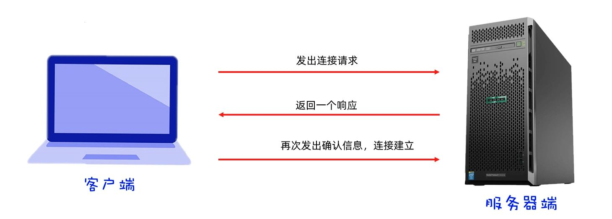
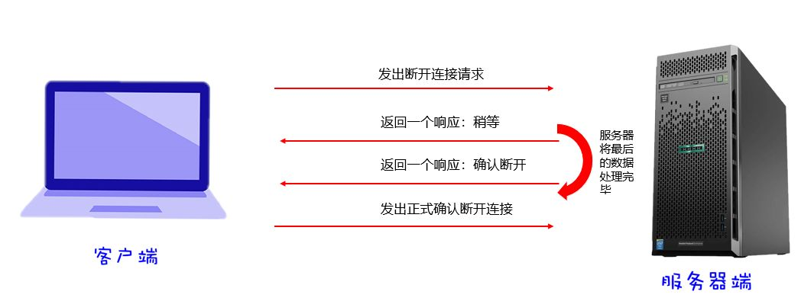

网络编程的核心目的，就是让一台设备中的程序能够与网络上另一台设备中的程序进行数据交互，实现真正意义上的“联网”。

在 Java 中，这一功能主要由 `java.net.*` 包提供解决方案。
除此之外，也有一些第三方公司基于 Java 封装了更高层的网络框架，但最基础的能力都来自 `java.net`。

网络通信主要有两种常见架构：

- **CS 架构（Client/Server）**：客户端直接与服务端交互，例如 QQ、微信。
- **BS 架构（Browser/Server）**：浏览器通过 HTTP 协议与服务端交互，例如网页应用。

无论是 CS 还是 BS，背后都必须依赖网络编程。

# 网络通信三要素

要想让不同设备之间顺利通信，必须具备三个关键要素：

1. **IP 地址** —— 定位是哪台设备。
2. **端口号** —— 定位设备上具体的应用程序。
3. **协议** —— 规定传输规则，告诉对方这份数据该如何解释。

举个例子：  
假设你要把微信的一条消息发给另一台电脑：

- **IP** 确定了消息要送到哪台电脑。
- **端口号** 确定了这条消息要交给微信程序，而不是 QQ。
- **协议** 规定了消息的数据格式，让接收方知道这是文字，而不是图片。

# IP 地址

IP（Internet Protocol，互联网协议地址）是分配给联网设备的唯一标识。
目前存在两种形式的 IP 分别是**IPv4** 和 **IPv6**。

### IPv4

最初使用的是 **IPv4**。IPv4 的地址长度为 32 位二进制，通常为了便于书写和记忆，会被拆分成四段，每段转为十进制并用点隔开。

例如下面的二进制数：

```
11000000 10101000 00000001 01000010
→ 192.168.34.79
```

转换后就是我们熟悉的 `192.168.34.79`。另外，在局域网中，IPv4 地址通常由路由器自动分配，而不是手动指定。

不过，IPv4 的数量只有大约 42 亿个，如今已经无法满足全球设备的增长。

因此又提出了 IPv6 以满足需求。

### IPv6

IPv6 的地址长度是 128 位，号称能给地球上的每一粒沙子都分配一个地址。它的写法更加复杂，通常被分成 8 段，每段以十六进制表示，并用冒号分隔，例如：

```
2001:0db8:0000:0023:0008:0800:200c:417a
```

如今大多数设备都是“双栈”的，即同时支持 IPv4 与 IPv6，以保证兼容性。

## 域名与 DNS

尽管 IP 地址的点分十进制或冒号分隔写法，已经比二进制更直观，但一长串数字依旧不方便记忆。
于是，人们引入了**域名**。例如：

```
www.wreckloud.com
```

域名本质上只是 IP 的别名。
真正通信时，计算机仍然要依赖 **DNS（域名解析系统）** 把域名转换为 IP 地址。

当你在浏览器中输入域名:

1. 系统会先查询本地 DNS 服务器，看看是否有缓存。
2. 如果没有，再去运营商的 DNS 服务器请求。
3. 运营商 DNS 如果也没有，会向全球 DNS 网络请求，最终返回真实的 IP 地址。

最终，通信还是通过浏览器用 **真实的 IP 地址** 来完成访问的。

## 公网 IP 与内网 IP

在实际使用中，IP 地址又分为两种：

- **公网 IP**：能直接连接互联网，全球唯一。
- **内网 IP**：局域网内部使用，不能直接被互联网访问。常见的范围是：

  ```
  192.168.0.0 ~ 192.168.255.255
  ```

- **本机 IP**

除此之外，还有一些特殊的 IP 地址。最常见的是 `127.0.0.1` 或 `localhost`，它们指向的不是别人，而是“我自己”，即本机。这常用于测试本地网络环境。

- **物理地址**

再往下追溯，每个设备还会有一个**物理地址（MAC 地址）**，这是出厂时写死在网卡上的唯一编号，用来区分不同的硬件设备。

## Java 中使用

在 Java 世界里，**万物皆对象**。既然 IP 地址是网络通信的核心元素，它自然也被抽象为一个对象，这个对象的类就是 **`InetAddress`**。

不过 `InetAddress` 不能通过 `new` 来直接创建。原因在于 IP 地址的获取和解析依赖于操作系统和网络环境，如果开发者随意传入一个字符串或数字，就可能得到无效对象。

因此，Java 只提供了几种**静态工厂方法**，由系统帮你生成合法的 `InetAddress` 实例：

- `getLocalHost()`：获取本机地址对象。
- `getByName(String host)`：通过域名或 IP 字符串得到地址对象。
- `getAllByName(String host)`：一次性返回一个域名下所有的 IP 地址（常用于负载均衡）。

### 通过对象获取

当我们已经拿到 `InetAddress` 对象后，就可以调用实例方法来获取更多信息。

| 方法               | 返回值   | 说明                                           |
| ------------------ | -------- | ---------------------------------------------- |
| `getHostName()`    | `String` | 获取该对象对应的主机名。                       |
| `getHostAddress()` | `String` | 获取该对象对应的 IP 地址（点分十进制字符串）。 |

获取本机地址信息：

```java
InetAddress local = InetAddress.getLocalHost();
System.out.println("本机 IP：" + local.getHostAddress()); // 192.168.1.101
System.out.println("本机名称：" + local.getHostName());  // wolf-machine
```

根据域名获取远程主机信息：

```java
InetAddress remote = InetAddress.getByName("www.baidu.com");
System.out.println("百度 IP：" + remote.getHostAddress());
System.out.println("百度主机名：" + remote.getHostName());
```

获取同一域名下的所有 IP（多节点场景，例如谷歌的负载均衡）：

```java
InetAddress[] ips = InetAddress.getAllByName("www.google.com");
for (InetAddress ip : ips) {
    System.out.println("谷歌节点 IP：" + ip.getHostAddress());
}
```

### 检查连通性

除了获取地址信息，还可以检测主机是否可达。

| 方法                       | 返回值    | 说明                                            |
| -------------------------- | --------- | ----------------------------------------------- |
| `isReachable(int timeout)` | `boolean` | 在指定毫秒内判断主机是否可达，功能类似 `ping`。 |

```java
boolean reachable = remote.isReachable(2000);
System.out.println("百度是否可达：" + reachable); // true
```

# 端口号

在网络通信中，**端口号**用来标记一台计算机设备上正在运行的具体应用程序。  
它的长度被规定为 16 位二进制，取值范围是 **0 ~ 65535**。  
同一设备上，端口号必须唯一，否则会导致冲突。

如果程序尝试使用一个已经被占用的端口，就会抛出 `BindException` 错误。

按照使用习惯，端口号大致分为三类：

### 周知端口

周知端口（Well-known Ports：0 ~ 1023），这些端口被系统预留给一些知名的应用协议使用。
例如：HTTP 占用 80 端口，FTP 占用 21 端口。一般不建议开发者在自己的程序中使用。

### 注册端口

注册端口（Registered Ports：1024 ~ 49151），分配给用户进程或某些应用程序。我们日常开发时，通常选择这个范围的端口来作为服务监听端口。
例如：Tomcat 默认使用 8080 端口。

### 动态端口

动态端口（Dynamic / Private Ports：49152 ~ 65535）也叫临时端口，通常不会固定分配给某个进程，而是由系统在需要时动态分配。
比如客户端发起一个请求时，操作系统可能会从这个范围里随机找一个空闲端口来使用。

# 通信协议

当两台设备在网络上进行通信时，如果没有统一的规则，就无法正确理解彼此传输的数据。于是，人们制定了各种**网络通信协议**，用来约定连接方式和数据传输规则。

为了让全球的上网设备都能够互联互通，国际标准化组织提出了 **OSI 网络参考模型**。它把网络通信抽象为七个层次，从应用层到物理层逐级细化。

<table>
  <tr>
    <th>OSI 网络参考模型</th>
    <th>TCP/IP 网络模型</th>
    <th>各层对应</th>
    <th>面向操作</th>
  </tr>
  <tr>
    <td>应用层</td>
    <td rowspan="3">应用层</td>
    <td rowspan="3">HTTP、FTP、SMTP...</td>
    <td rowspan="3">应用程序需要关注的：浏览器、邮箱。<br>程序员一般在这一层开发</td>
  </tr>
  <tr>
    <td>表示层</td>
  </tr>
  <tr>
    <td>会话层</td>
  </tr>
  <tr>
    <td>传输层</td>
    <td>传输层</td>
    <td>UDP、TCP...</td>
    <td>选择使用的 TCP、UDP 协议</td>
  </tr>
  <tr>
    <td>网络层</td>
    <td>网络层</td>
    <td>IP...</td>
    <td>封装源和目标 IP</td>
  </tr>
  <tr>
    <td>数据链路层</td>
    <td rowspan="2">数据链路层 + 物理层</td>
    <td rowspan="2">比特流...</td>
    <td rowspan="2">物理设备中传输</td>
  </tr>
  <tr>
    <td>物理层</td>
  </tr>
</table>

不过，OSI 模型过于理想化，在实际中我们普遍采用的是 **TCP/IP 模型**。它更加简化，仍然能涵盖通信的关键环节：

- **应用层**：面向用户的应用程序，例如浏览器使用的 HTTP 协议、邮箱使用的 SMTP 协议。程序员一般在这一层开发。
- **传输层**：负责端到端的数据传输，常见的协议是 TCP 和 UDP。
- **网络层**：负责寻址和路由，最典型的是 IP 协议。
- **网络接口层**：负责在物理设备中传输数据。

作为开发人员的我们，主要与 **应用层** 打交道，但理解传输层协议同样重要。

传输层最常见的两种协议是：

- **UDP（User Datagram Protocol，用户数据报协议）**
- **TCP（Transmission Control Protocol，传输控制协议）**

## UDP 协议

UDP 的特点是**无连接、不可靠**。

- 发送端不会提前建立连接，每次通信只是简单地把数据打包发送。
- 数据包中包含发送方和接收方的 IP、端口，以及最多 64KB 的数据。
- 如果接收方不在线，数据会直接丢失；即使收到了，也不会返回确认。

正因为不做复杂的确认和重传，UDP 的效率非常高，适合那些对速度要求远高于可靠性的场景，比如**直播、语音通话**。

在 Java 里，UDP 通信主要依赖两个类：

### `DatagramSocket` 通信端点

- `DatagramSocket()`：创建客户端的 socket 对象，系统会随机分配一个端口号。
- `DatagramSocket(int port)`：创建服务端的 socket 对象，并绑定到指定端口。

常用方法

| 方法                        | 返回值 | 说明                     |
| --------------------------- | ------ | ------------------------ |
| `send(DatagramPacket dp)`   | `void` | 发送数据包。             |
| `receive(DatagramPacket p)` | `void` | 接收数据包（阻塞等待）。 |

### `DatagramPacket` 数据包

- `DatagramPacket(byte[] buf, int length, InetAddress address, int port)`：创建一个发送用的数据包。
- `DatagramPacket(byte[] buf, int length)`：创建一个接收用的数据包。

常用方法

| 方法          | 返回值 | 说明                     |
| ------------- | ------ | ------------------------ |
| `getLength()` | `int`  | 获取实际接收到的字节数。 |

示例一：客户端发送数据

```java
import java.net.DatagramPacket;
import java.net.DatagramSocket;
import java.net.InetAddress;

public class WolfClient {
    public static void main(String[] args) throws Exception {
        // 1. 创建客户端的通信端点
        DatagramSocket socket = new DatagramSocket(); // 自动分配端口

        // 2. 准备要发送的消息
        byte[] buffer = "狼群集结，准备出发！".getBytes();

        // 3. 构造数据包，目标是本机的 8888 端口
        DatagramPacket packet = new DatagramPacket(
            buffer, buffer.length,
            InetAddress.getLocalHost(), 8888
        );

        // 4. 发送数据
        socket.send(packet);

        // 5. 释放资源
        socket.close();
        System.out.println("客户端消息已发送。");
    }
}
```

说明：  
客户端依次完成 **创建端点 → 封装数据包 → 发送 → 关闭**。逻辑简洁，适合演示单次发送。

示例二：服务端接收数据

```java
import java.net.DatagramPacket;
import java.net.DatagramSocket;

public class WolfServer {
    public static void main(String[] args) throws Exception {
        // 1. 创建服务端的通信端点，绑定端口
        DatagramSocket socket = new DatagramSocket(8888);

        // 2. 准备缓冲区和数据包对象，用于接收
        byte[] buffer = new byte[1024 * 64];
        DatagramPacket packet = new DatagramPacket(buffer, buffer.length);

        // 3. 阻塞等待接收
        socket.receive(packet);

        // 4. 解析消息
        String msg = new String(buffer, 0, packet.getLength());
        System.out.println("服务端收到消息：" + msg);

        // 5. 释放资源
        socket.close();
    }
}
```

说明：  
服务端逻辑是 **绑定端口 → 等待接收 → 解析输出 → 关闭**。因为 `receive()` 方法是阻塞的，所以会一直等待，直到有数据包到达。

UDP 通信的基本模式就是 **单发单收**：

1. 创建 `DatagramSocket`（端点）。
2. 创建 `DatagramPacket`（数据包）。
3. 使用 `send()` 或 `receive()` 完成数据传输。
4. 释放资源。

如果需要实现持续收发，可以通过循环或多线程扩展。

## TCP 协议

TCP 的特点是**面向连接、可靠传输**。它的目标是要在不可靠的信道上，尽可能保证数据完整、准确地到达。为了做到这一点，TCP 在内部维护了一个关键的数据结构：

传输控制块（TCB，Transmission Control Block）：

- 每个 TCP 连接在系统中都会对应一个 TCB。
- TCB 里保存了连接的各种状态信息：本地和对方的 IP、端口号，发送和接收的序号，窗口大小，确认号等。
- 正是因为有了这些信息，TCP 才能进行三次握手建立连接、可靠确认数据传输、四次挥手安全断开。

TCB 就是 TCP 的“大脑”，它记录了连接的上下文，让 TCP 能保证数据不会乱序、不会丢失。因此，TCP 的效率不如 UDP，但适合需要可靠性的场景，比如 **网页访问、文件下载、支付**。

TCP 的核心特点是 **面向连接、可靠通信**。它的目标是在不可靠的信道上，也能尽量保证数据完整、无误地传输。

为了实现这一点，TCP 的通信过程主要分为三个阶段：

1. **三次握手** —— 建立可靠连接。
2. **数据传输** —— 双方确认收发，确保数据不丢失、不乱序。
3. **四次挥手** —— 安全断开连接。

### 三次握手

所谓“三次握手”，就是客户端与服务端在建立连接时进行的三次消息交互，确保双方的发送和接收功能都正常。



“请求”“确认”在实际中都是通过 **TCP 报文段（Segment）** 来完成的。报文头部有几个关键字段：

- **序号（SEQ）**：标识这条报文的顺序位置。
- **确认号（ACK Number）**：表示“我已经收到你哪条报文，下一条期待的序号是哪个”。
- **控制位（Flags）**：包括 `SYN`、`ACK`、`FIN` 等，用来表示报文的用途。

在三次握手的过程中，SYN 和 ACK 的配合非常重要：

1. **第一次握手（客户端 → 服务端）**

   - 报文标志位：`SYN=1`
   - 内容：告诉服务端“我想建立连接”，证明自己能发送。同时带上客户端的初始序号，比如 `SEQ=1001`。

2. **第二次握手（服务端 → 客户端）**

   - 报文标志位：`SYN=1, ACK=1`
   - 内容：服务端同意建立连接，证明自己既能接收也能发送。带上自己的初始序号 `SEQ=2001`，并通过 `ACK=1002` 确认客户端的序号。

3. **第三次握手（客户端 → 服务端）**

   - 报文标志位：`ACK=1`
   - 内容：客户端回应确认，再发出一次回应，最终确认自己也能接收。`ACK=2002` 表示已经收到了服务端的序号。

这样一来：

- **SYN** 用来同步双方的初始序号。
- **ACK** 用来确认对方的报文确实到达。

只有在三次握手全部完成之后，双方才进入“已建立连接”状态，开始传输真实数据。

### 四次挥手

TCP 在断开连接时采用“四次挥手”，目的是确保双方的数据传输都已完成，不会中途丢失。



1. **第一次**：客户端发出断开请求，表示不再发送数据。
2. **第二次**：服务端收到后先回应一个“我知道了”，但可能还在处理未完成的数据。
3. **第三次**：等到服务端数据处理完毕，再发送一个“可以断开”的信号。
4. **第四次**：客户端收到确认后，正式关闭连接。

这种四步断开的机制，避免了数据在传输过程中被突然切断的风险。

断开的过程，其实也是 **报文段（Segment）** 的交互，只不过这里用到的控制位是 **FIN**（Finish，结束）和 **ACK**（确认）。流程如下：

1. **第一次挥手（客户端 → 服务端）**

   - 报文标志位：`FIN=1`
   - 内容：客户端告诉服务端：“我这边已经没有数据要发了，请求关闭连接。”
   - 状态：客户端进入 `FIN_WAIT_1` 状态。

2. **第二次挥手（服务端 → 客户端）**

   - 报文标志位：`ACK=1`
   - 内容：服务端确认收到了客户端的断开请求，但此时可能仍有数据要发，所以先不立即关闭。
   - 状态：客户端进入 `FIN_WAIT_2`，继续等待。

3. **第三次挥手（服务端 → 客户端）**

   - 报文标志位：`FIN=1`
   - 内容：等到服务端的数据全部发完，它再主动发出断开请求。
   - 状态：服务端进入 `LAST_ACK`。

4. **第四次挥手（客户端 → 服务端）**

   - 报文标志位：`ACK=1`
   - 内容：客户端确认收到了服务端的断开请求。此后客户端会进入 `TIME_WAIT` 状态，等待一小段时间以确保服务端收到 ACK，最后彻底关闭。

### Java 中的 TCP 通信

在 Java 中，TCP 通信主要依赖两个类：

- `Socket` —— 客户端通信类。
- `ServerSocket` —— 服务端通信类。

#### 客户端（Socket）

`Socket` 代表客户端的通信对象。当我们创建一个 `Socket` 实例时，就会尝试和服务端建立连接，客户端请求与服务端建立连接成功后，就可以通过输入/输出流来进行数据传输。

创建客户端对象：

- `Socket(String host, int port)`：根据指定的服务器 IP 和端口号，请求与服务端建立连接。连接成功后返回一个 `Socket` 对象。

常用实例方法：

| 方法                  | 返回值            | 说明              |
| ------------------- | -------------- | --------------- |
| `getOutputStream()` | `OutputStream` | 获取字节输出流，用于发送数据。 |
| `getInputStream()`  | `InputStream`  | 获取字节输入流，用于接收数据。 |

示例：客户端发送消息

```java
import java.io.OutputStream;
import java.net.Socket;

public class WolfClient {
    public static void main(String[] args) throws Exception {
        // 1. 创建客户端 Socket，连接到服务端 8888 端口
        Socket socket = new Socket("127.0.0.1", 8888);

        // 2. 获取输出流，发送消息
        OutputStream out = socket.getOutputStream();
        out.write("这是来自狼群的消息！".getBytes());

        // 3. 关闭资源
        out.close();
        socket.close();
        System.out.println("客户端消息已发送。");
    }
}
```

#### 服务端（ServerSocket）

`ServerSocket` 用于在服务端监听指定端口，需要提前监听端口，等待客户端的连接。一旦有连接建立，就会得到对应的 `Socket` 对象，通过它接收数据。

构造器（创建服务端对象）

- `ServerSocket(int port)`：创建服务端 socket，并注册到指定端口。

常用实例方法（通过对象获取）

| 方法         | 返回值      | 说明                                        |
| ---------- | -------- | ----------------------------------------- |
| `accept()` | `Socket` | 阻塞等待客户端的连接请求，一旦有客户端连接，就返回对应的 `Socket` 对象。 |

示例：服务端接收消息

```java
import java.io.InputStream;
import java.net.ServerSocket;
import java.net.Socket;

public class WolfServer {
    public static void main(String[] args) throws Exception {
        // 1. 创建服务端 ServerSocket，注册 8888 端口
        ServerSocket server = new ServerSocket(8888);

        // 2. 阻塞等待客户端连接
        Socket socket = server.accept();

        // 3. 获取输入流，读取消息
        InputStream in = socket.getInputStream();
        byte[] buffer = new byte[1024];
        int len = in.read(buffer);
        System.out.println("服务端收到消息：" + new String(buffer, 0, len));

        // 4. 关闭资源
        in.close();
        socket.close();
        server.close();
    }
}
```

### 关于并发问题

在最基础的 **阻塞 I/O** 实现里，服务端通过 `ServerSocket.accept()` 得到每一个新连接的 `Socket`，随后为它分配一个线程去处理**阻塞**的读/写流。这种“**一连接一线程**”的模型很好理解，也很好写，但在并发连接数上涨时会出现三个典型瓶颈：

1. **线程资源消耗**：线程多了会占内存（线程栈、线程对象）并带来频繁的上下文切换，调度开销显著。
2. **文件描述符/句柄上限**：每个连接都需要系统资源；到达上限会导致新连接失败。
3. **阻塞放大**：某个慢客户端会长时间占用一个线程；连接数一多，线程就被“卡死”在 I/O 上。

解决思路主要有两条：

- 用线程池约束并发的“量”
- 用 NIO 改变并发的“形”\*\*。

#### 解法一：线程池（仍然是阻塞 I/O）

思路是：不再“一个连接就新开一个线程”，而是把连接交给**固定大小**的线程池。这样能控制并发度，避免线程失控；配合超时与异常处理，保证慢连接尽快让出资源。

**最小骨架：固定线程池的阻塞 I/O 服务端**

```java
import java.io.InputStream;
import java.net.ServerSocket;
import java.net.Socket;
import java.util.concurrent.ExecutorService;
import java.util.concurrent.Executors;

public class WolfPoolServer {
    public static void main(String[] args) throws Exception {
        try (ServerSocket server = new ServerSocket(8888)) {
            ExecutorService pool = Executors.newFixedThreadPool(200); // 视机器调整
            while (true) {
                Socket client = server.accept(); // 阻塞等待
                client.setSoTimeout(10_000);     // 读超时，避免卡死
                pool.submit(() -> handle(client));
            }
        }
    }

    static void handle(Socket client) {
        try (client; InputStream in = client.getInputStream()) {
            byte[] buf = new byte[1024];
            int n = in.read(buf); // 阻塞读（有超时）
            if (n > 0) {
                System.out.println("收到：" + new String(buf, 0, n));
                // 可在此处写回响应（client.getOutputStream()）
            }
        } catch (Exception e) {
            // 记录并清理
        }
    }
}
```

**要点建议（阻塞 I/O + 线程池）**

- **限制并发**：`newFixedThreadPool` 控制上线；必要时搭配**有界队列**（自定义 `ThreadPoolExecutor`）。
- **设置超时**：`Socket#setSoTimeout` 防止慢连接长期占用。
- **快速失败**：业务层超时、大小限制、黑名单等尽早拦截。
- **分离业务**：I/O 线程只做收发，CPU 密集工作丢到后台工作池，避免阻塞 I/O 线程。

适用：**中等并发**（数百到低千级）、逻辑简单、优先快速交付的场景。

#### 解法二：NIO（非阻塞 I/O + 多路复用）

思路是：把每个连接的读写改成**非阻塞**，由一个（或少数）线程通过 `Selector` 轮询“哪条连接现在**就绪**”，对就绪的连接才读/写。这种“**少线程管多连接**”的方式能把并发连接数提升到更高数量级。

**最小骨架：Selector 轮询的 NIO 服务端**

```java
import java.net.InetSocketAddress;
import java.nio.ByteBuffer;
import java.nio.channels.*;
import java.util.Iterator;

public class WolfNioServer {
    public static void main(String[] args) throws Exception {
        Selector selector = Selector.open();

        ServerSocketChannel ssc = ServerSocketChannel.open();
        ssc.configureBlocking(false);
        ssc.bind(new InetSocketAddress(8888));
        ssc.register(selector, SelectionKey.OP_ACCEPT);

        ByteBuffer buf = ByteBuffer.allocate(1024);

        while (true) {
            selector.select(); // 阻塞，直到有就绪事件
            Iterator<SelectionKey> it = selector.selectedKeys().iterator();
            while (it.hasNext()) {
                SelectionKey key = it.next(); it.remove();

                if (key.isAcceptable()) {
                    SocketChannel ch = ssc.accept();
                    ch.configureBlocking(false);
                    ch.register(selector, SelectionKey.OP_READ);
                } else if (key.isReadable()) {
                    SocketChannel ch = (SocketChannel) key.channel();
                    buf.clear();
                    int n = ch.read(buf);
                    if (n <= 0) { ch.close(); continue; }
                    buf.flip();
                    // 简单回显
                    ch.write(buf);
                }
            }
        }
    }
}
```

**要点建议（NIO）**

- **单线程可管成千上万连接**（取决于业务与内核参数），但编码复杂度更高。
- **状态管理**：每个连接通常需要附加对象记录解包/半包、写缓冲等（可用 `SelectionKey#attach`）。
- **多核扩展**：常见策略是**多 Selector**（每核一个 I/O 线程）+ 后台业务线程池。
- **边界控制**：对每次读写设置上限，避免单连接“饿死”其他连接。

适用：**高并发长连接**、**I/O 密集**、需要更高连接承载能力的场景（如 IM、网关、推送）。
