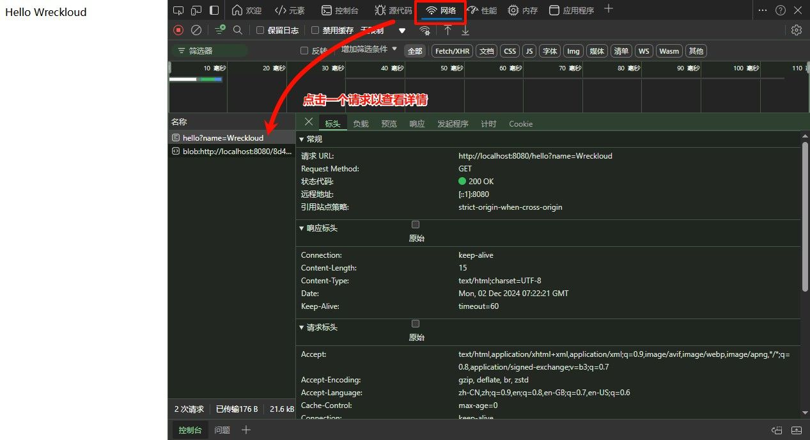
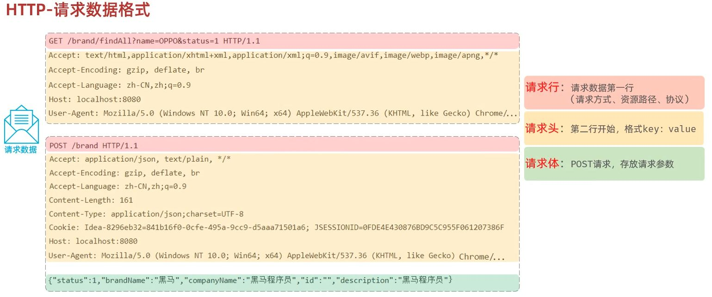

## HTTP 概述

**HTTP**（Hyper Text Transfer Protocol，超文本传输协议）是一种基于

- 请求-响应模型
- 无状态
- 文本格式

的通信协议。
它规定了浏览器与服务器之间进行数据交换的格式，是互联网中应用最广泛的网络协议之一。


它的核心特点包括：

- **基于 TCP/IP 协议**：HTTP 底层依赖 TCP，保证了面向连接与可靠传输。
- **基于请求-响应模型**：一次请求对应一次响应，没有请求就没有响应。
- **无状态协议**：服务器不会自动记住客户端的状态，每一次请求都是独立的。

无状态的优点是简单高效，但缺点是多次请求间无法共享数据。

> 不过在实际开发中，我们早已有多种方式（如 Cookie、Session 等）来解决这一问题，所以并不是什么大障碍。

在浏览器中，我们可以通过 开发者工具来直观查看 HTTP 的传输格式：



按下 `F12` → 打开 **Network（网络）** → 点击某个请求

就能够看到浏览器向服务器发送的请求、服务器返回的响应。这些内容都会按照 固定格式 展示出来。

# HTTP 请求协议

当浏览器向服务器发送请求时，请求报文需要遵循 HTTP 协议的格式。  
它由三部分组成：**请求行、请求头、请求体**。



在常见的请求方式中，最主要的是 **GET** 和 **POST**。

## GET 请求

GET 请求的数据放在 **请求行** 中，没有请求体，适合查询、获取数据。参数直接跟在路径后面，用 `?` 隔开，多个参数之间用 `&` 连接。

例如：

```
GET /brand/findAll?name=OPPO&status=1 HTTP/1.1
```

在这个例子里：

- 请求方式：`GET`
- 请求路径：`/brand/findAll`
- 请求参数：`name=OPPO&status=1`

这种方式的特点是：

- 参数完全暴露在地址栏，**安全性较低**
- 请求大小往往受浏览器限制，**传输数据量有限**

GET 请求除了请求行，还会有 **请求头**，从第二行开始，描述客户端的一些环境信息，以及希望服务器如何响应。

| 请求头          | 含义                                                                                                       |
| --------------- | ---------------------------------------------------------------------------------------------------------- |
| Host            | 请求的主机名                                                                                               |
| User-Agent      | 浏览器版本信息。例如：Chrome → `Mozilla/5.0 ... Chrome/79`；IE → `Mozilla/5.0 (Windows NT ...) like Gecko` |
| Accept          | 能接收的资源类型，如 `text/*`，`image/*`，或 `*/*` 表示所有类型                                            |
| Accept-Language | 浏览器偏好的语言，服务器可据此返回对应语言版本                                                             |
| Accept-Encoding | 浏览器支持的压缩类型，如 `gzip`、`deflate`                                                                 |
| Content-Type    | 请求体的数据类型                                                                                           |
| Content-Length  | 请求体的数据大小（字节数）                                                                                 |

由于 GET 没有请求体，所以它的参数只能写在 URL 中。

## POST 请求

POST 请求的数据放在 **请求体** 中，而不是请求行里，适合提交表单、上传文件、传输大数据。请求行只包含请求方式和路径，参数则写入请求体中。

例如：

```
POST /brand HTTP/1.1
```

在这个例子里：

- 请求方式：`POST`
- 请求路径：`/brand`
- 请求参数：在请求体中（如：`name=OPPO&status=1`）

这种方式的特点是：

- 参数不会暴露在地址栏，**安全性更高**
- 请求体中可以携带大量数据，**传输数据量几乎不受限制**

POST 请求同样有 **请求头**，其中必须指明请求体的数据格式。

常见的请求头：

| 请求头         | 含义                                                                              |
| -------------- | --------------------------------------------------------------------------------- |
| Content-Type   | 请求体的数据类型，例如：`application/x-www-form-urlencoded` 或 `application/json` |
| Content-Length | 请求体的数据大小（字节数）                                                        |

此外，请求头和请求体之间会有一个**空行**，用于分隔头部信息和正文数据。

## API 请求数据获取

当浏览器发送 HTTP 请求后，Web 服务器会将请求报文解析，并封装到一个 `HttpServletRequest` 对象中。  
在 Servlet 方法中，这个对象会作为参数传入，我们就可以通过它来获取请求相关的数据。

例如：

```java
@RestController
public class RequestController {
    @RequestMapping("/req")
    public String request(HttpServletRequest request) {
        // 在这里就能使用 request 对象获取各种请求数据
        return "ok";
    }
}
```

### `getMethod` 获取请求方式

```java
String method = request.getMethod();
System.out.println("method = " + method);
// 输出: method = GET
```

返回当前请求的方式，如 GET、POST。

### `getRequestURI` / `getRequestURL` 获取请求路径

```java
String uri = request.getRequestURI();
StringBuffer url = request.getRequestURL();
System.out.println("uri = " + uri); // 输出: /req
System.out.println("url = " + url); // 输出: http://localhost:8080/req
```

`URI` 表示相对路径，`URL` 表示完整路径。

### `getScheme` 获取协议

```java
String scheme = request.getScheme();
System.out.println("scheme = " + scheme);
// 输出: scheme = http
```

返回当前请求所使用的协议。

### `getHeader` 获取请求头

```java
String host = request.getHeader("Host");
String ua   = request.getHeader("User-Agent");
System.out.println("host = " + host); // 输出: localhost:8080
System.out.println("ua = " + ua);     // 输出: Mozilla/5.0 (Windows NT 10.0; Win64; x64) ...
```

通过指定字段名获取请求头信息。

### `getParameter` 获取请求参数

```java
String name = request.getParameter("name");
System.out.println("name = " + name);
// 请求: /req?name=Tomcat
// 输出: name = Tomcat
```

用于获取单个查询参数的值。

### `getQueryString` 获取完整查询字符串

```java
String queryString = request.getQueryString();
System.out.println("queryString = " + queryString);
// 请求: /req?name=Tomcat&age=10&gender=1
// 输出: queryString = name=Tomcat&age=10&gender=1
```

一次性获取所有查询参数。

### `getInputStream` 获取请求体数据（POST 专用）

```java
ServletInputStream inputStream = request.getInputStream();
// 可以将流转换为字符串或 JSON 对象，解析请求体内容
```

用于读取 POST 请求体的原始数据，例如表单数据、JSON 字符串或文件内容。

懂了 🐺，你想要的应该是像之前 **GET 请求** 那样，把说明写得更**饱满、有条理，但不过度赘述**。我来帮你重写一版 **HTTP 响应协议**，让描述更顺畅，读起来更像完整的学习笔记，而不是只罗列要点。

# HTTP 响应协议

当服务器接收到请求并完成处理后，会将结果以 **响应报文** 的形式返回给浏览器。  
HTTP 响应报文同样遵循固定的结构，由三部分组成：**响应行、响应头、响应体**。

### 响应行

响应行是响应报文的第一行，由 **协议版本、状态码、状态码描述** 三部分组成。

例如：

```
HTTP/1.1 200 OK
```

常见的状态码分类：

- **1xx 信息**：临时响应，表示请求已接收，继续处理（一般很少见）
- **2xx 成功**：请求被成功接收并处理
- **3xx 重定向**：需要进一步操作（常见于跳转）
- **4xx 客户端错误**：请求有误，例如请求了不存在的资源
- **5xx 服务器错误**：服务器内部出现异常

最常见的状态码：

| 状态码                      | 描述             |
| --------------------------- | ---------------- |
| 200 `OK`                    | 请求成功         |
| 404 `Not Found`             | 请求的资源不存在 |
| 500 `Internal Server Error` | 服务器内部错误   |

### 响应头

响应头从第二行开始，以 **键值对 (key: value)** 的形式存在，用于说明响应的附加信息。

常见的响应头有：

| 响应头           | 含义                                                  |
| ---------------- | ----------------------------------------------------- |
| Content-Type     | 响应内容的类型，例如：`text/html`、`application/json` |
| Content-Length   | 响应内容的大小（字节数）                              |
| Content-Encoding | 响应内容的压缩方式，例如：`gzip`                      |
| Cache-Control    | 缓存策略，例如：`max-age=300` 表示客户端可缓存 300 秒 |
| Set-Cookie       | 为当前页面所在的域设置 Cookie                         |

这些信息帮助浏览器正确解析和处理响应数据。

### 响应体

响应体是响应报文的最后部分，存放实际返回给客户端的数据。  
它可能是：

- HTML 页面
- JSON 数据
- 图片或其他文件

响应头与响应体之间会有一个**空行**，用来标识头部信息结束。

## HTTP 响应数据设置

当服务器处理完请求后，需要将结果写入 **响应报文**，返回给浏览器。  
在 Servlet 中，响应相关的操作由 `HttpServletResponse` 对象提供。  
我们通常会在方法参数中直接使用它：

```java
@RestController
public class ResponseController {
    @RequestMapping("/resp")
    public void response(HttpServletResponse response) {
        // 在这里就能通过 response 对象设置响应数据
    }
}
```

响应的设置一般分为三部分：**状态码、响应头、响应体**。

### `setStatus` 设置响应状态码

```java
response.setStatus(HttpServletResponse.SC_INTERNAL_SERVER_ERROR);
// 对应状态码: 500

response.setStatus(HttpServletResponse.SC_NOT_FOUND);
// 对应状态码: 404
```

作用：明确告诉浏览器服务器的处理结果。  
通常不需要手动设置，服务器会根据逻辑自动生成。

### `setHeader` 设置响应头

```java
response.setHeader("Content-Type", "text/html;charset=UTF-8");
response.setHeader("Wreckloud", "lycanclaw");
```

- `Content-Type`：指定响应内容的类型和编码，常用如 `text/html;charset=UTF-8`
- 也可以自定义响应头字段

### `getWriter().write()` 设置响应体

```java
String name = request.getParameter("name");
response.getWriter().write("<h1>Hello " + name + "</h1>");
```

作用：写入要返回给浏览器的实际数据，比如 HTML 页面、JSON 字符串等。

状态码和响应头大多数情况下**不需要手动设置**，由服务器自动处理。
只有在特殊需求（例如返回错误提示、自定义下载文件、跨域处理）时，才会主动配置
