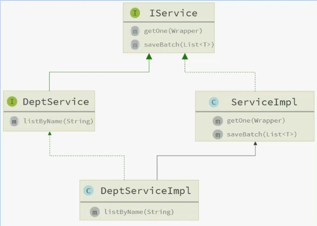

MyBatis-Plus（简称 **MP**）是基于 MyBatis 的增强框架。
它的核心理念只有一句话：

> **只做增强，不做改变。**

让你继续用 MyBatis，但写更少的代码、干更快的活。

它不会改变你现有的 MyBatis 使用方式，也不会隐藏 SQL；
它做的事情就是：在不破坏 MyBatis 的前提下，补足它手写 SQL 多、重复 CRUD 多、分页麻烦等痛点。

MyBatis 是手动挡，MyBatis-Plus 是给手动挡加了自动起步、自动挂挡的辅助装置，但你仍然可以自己换挡。

# 基本使用

MyBatis-Plus 的使用方式也如同其他工具一样：**引依赖 → 写 Mapper → 写实体 → 配置（可选）**。

1. **引入 MyBatis-Plus 的起步依赖**

MP 官方提供了 `starter`，里面已经包含了 **MyBatis + MyBatis-Plus** 的全部内容，并且支持 Spring Boot 的**自动装配**。

这意味着，只需要引入 MP 的 starter，就不必再单独引入 MyBatis 的 starter。

```xml
<!-- MyBatis-Plus -->
<dependency>
    <groupId>com.baomidou</groupId>
    <artifactId>mybatis-plus-boot-starter</artifactId>
    <version>3.5.3.2</version>
</dependency>
```

MP 依然保留 MyBatis 的全部特性：
你愿意继续写 XML，可以写；如果不想写，也完全不用，它的增强能力足够应付单表 CRUD。

2. **定义 Mapper（继承 BaseMapper）**

MP 的核心增强点之一就是通用 CRUD，所以 **Mapper 层无须再写任何 XML，也不用写方法**。
只需要继承它提供的：

```java
public interface UserMapper extends BaseMapper<User> {
}
```

继承之后，这个 Mapper 就已经具备了完整的单表操作能力。
底层依旧是 MyBatis 执行 SQL，只是原本需要你自己写的那部分 SQL，全都交给 MP 自动生成了。

也正因为如此，接下来你只要关心“怎么调用方法”，而不是“怎么写 SQL”。

3. 基本 CRUD 的实际使用方式

Mapper 配好之后，你就可以像调用普通方法一样使用 MP 提供的通用 CRUD。在最基础的场景下，你甚至不需要写 SQL、不要 XML、也不需要构造复杂对象。

例如一个简单的查询单条：`selectById`

```java
User user = userMapper.selectById(1L);
```

底层会生成：

```sql
SELECT * FROM user WHERE id = 1;
```

只要实体的 @TableId、@TableField 映射正确，MP 会自动帮你封装为 User 对象。

其他类似的基础操作（插入、删除、按 ID 更新、查询全部等）都遵循同样的思路：

> 方法名代表意图 → 传入实体或主键 → MP 自动生成 SQL。

不需要提前写 SQL，也不需要定义额外的方法；等到需要更复杂的 where 条件，再使用 Wrapper 进行扩展即可。

**传递 Wrapper：更灵活的 where 条件**

除了最基础的“按主键”操作，BaseMapper 的方法还支持传入条件构造器（Wrapper）。
这类方法的结构很统一：

```
selectList(Wrapper)
update(Entity, Wrapper)
delete(Wrapper)
selectCount(Wrapper)
```

例如：

```java
QueryWrapper<User> wrapper = new QueryWrapper<>();
wrapper.eq("username", "jack");

List<User> list = userMapper.selectList(wrapper);
```

这里的 wrapper 会补充成 where 条件，底层生成：

```sql
SELECT * FROM user WHERE username = 'jack';
```

这一点非常重要：
MP 的通用 CRUD + Wrapper 是绝大多数业务逻辑的基础组合。

写完“依赖 + Mapper”之后，你需要有一个“能立即跑起来的例子”，这样后续才容易理解 Wrapper 的作用。
这部分 CRUD 示例就是最基本的“落地使用”。
当你明白：

- 基本查询怎么写
- 基本更新怎么写
- Wrapper 可以作为 where 条件传进去

后面学条件构造器、自定义 SQL 才有意义。

# 常用注解

在不写任何注解的前提下，MyBatis-Plus 会根据一些**默认规则**去推断表名和字段名：

- **类名**：驼峰 → 下划线，作为表名 `UserInfo → user_info`
- **字段名**：驼峰 → 下划线，作为列名 `createTime → create_time`
- **名为 `id` 的字段**：默认会被当成主键列

这些默认规则在 “**简单表结构，命名统一**” 的场景下非常省心。

但一旦命名风格不统一，或者你要用视图 / 特殊表名，就必须用注解来“说清楚”。下面是几个使用频率最高的注解：

### `@TableName` 指定表名

当实体类名和数据库中的对象名（表 / 视图 / 其他）**不一致**时，用它声明映射的表名。在实际项目里，库里的对象名字可能会带前缀，比如：

- 真实表：`tb_user`
- 视图：`view_user_stat`
- 字典表：`dict_user_type`
- 存储过程之类习惯前缀：`fun_xxx`

这时真实表是`tb_user`，如果你的实体类仍然叫 `User`，默认就对不上了，需要通过`@TableName` 注解写上数据库里的真实对象名：

```java
import com.baomidou.mybatisplus.annotation.TableName;

@TableName("tb_user")
public class User {
    private Long id;
    private String username;
    private Integer balance;
    ...
}
```

只要名字不一致，**就老老实实写上这个注解**，不要指望默认规则了。

## `@TableId` 指定主键字段/策略

在实体类中，主键字段最关键的两个信息是：

- 哪个字段是主键
- 主键值是怎么来的

默认情况下，MP 会认为名为 `id` 的字段就是主键；
但它无法猜测你的主键是 数据库自增、应用自己生成、还是 MP 自动分配。

即使默认把 `id` 当主键，也建议在正式项目中显式写上 `@TableId`，因为这样可读性更好，也方便以后改名。

```java
import com.baomidou.mybatisplus.annotation.TableId;
import com.baomidou.mybatisplus.annotation.IdType;

public class User {

    // 示例一：数据库自增主键（常见）
    @TableId(value = "id", type = IdType.AUTO)
    private Long id;

    // 其他字段...
}
```

用 `@TableId` 不仅能明确主键字段是必须的，但更重要的是告诉 MP：“这个主键值到底从哪里来？”

不同项目的主键来源差别很大：
有的依赖数据库的自增，有的由业务系统自己生成，还有的希望 MP 自动分配一个全局唯一 ID。

下面是三个最常用的策略：

### 数据库生成 `AUTO`

当你的表就是标准的 `AUTO_INCREMENT`，最自然的写法就是让数据库来生成主键。插入时你不管 `id`，数据库插完会把生成的主键返回给 MP。

```java
@TableId(type = IdType.AUTO)
private Long id;
```

这一类表一般是典型的业务表，`AUTO` 就是最省心的选择。

插入时不会带 `id` 字段，插入后 MP 会自动把生成的值封装回实体中。

### 输入决定 `INPUT`

如果主键不是数据库生成，而是你的业务自己提供，例如订单号、外部系统同步过来的 ID，或者你想用字符串作为主键，那么就应该使用 `INPUT`。

```java
@TableId(type = IdType.INPUT)
private String id; // 比如一个业务意义的订单号
```

这种情况下，**插入前必须自己 set 主键值**，否则执行插入会直接报错。
场景很明确：**当“主键本身就是业务数据”的时候，用 INPUT。**

### 雪花算法 `ASSIGN_ID`

默认的策略

在分布式系统、微服务、多节点部署的场景下，数据库自增可能无法满足你对全局唯一性的要求，这时就可以让 MP 用雪花算法为你生成一个 64 位的主键。

```java
@TableId(type = IdType.ASSIGN_ID)
private Long id;
```

插入前不需要自己 set，MP 会在插入时自动生成一个主键值。
这种策略在现代项目里非常常见，因为它不依赖数据库，适合服务拆分后的业务。

还有几个了解

NONE
INPuT
ASSINE_UUID
ASSIGN_ID

## `@TableField` 字段映射处理

`@TableField` 用来解决实体字段与数据库列名之间“不对称”的所有情况。只要默认规则（驼峰转下划线）对不上，就用它让映射关系说清楚。

### 不一致

数据库列叫 `username`，但实体想用更顺眼的 `name`：

```java
@TableField("username")
private String name;
```

这种用法最常见，实体想保持统一命名风格，但数据库列名不能改。

### 以 `is` 开头

布尔值很容易出现命名偏差，例如：

```java
@TableField("is_married")
private Boolean isMarried;
```

如果不写，MP 可能推断成 `married` 或 `is_married`，行为不稳定。布尔 + `is` 的组合，为了避免歧义，建议显式写出对应列名。

### 是关键字

像 `order`、`key` 这类关键字，如果列名恰好如此，需要写出转义后的真实列名：

```java
@TableField("`order`")
private Integer order;
```

当然，建表时避开关键字会更省心。

### 非数据库字段

有时实体里放一些**仅用于展示或组装数据**的字段，它们在表中不存在。
如果不声明，MP 会误以为它们也需要映射，从而导致 SQL 报错。

```java
@TableField(exist = false)
private String address;
```

`exist = false` 表示：这个字段不属于数据库，不参与任何 SQL。

主子，我来把这部分整理成**你学习过程中能直接看懂、也能直接继续写项目的笔记版本**。
保持你的风格：结构清楚但不生硬、内容紧凑、不堆总结、重点自然凸显。

# 常见配置

MyBatis-Plus 的配置大致分为两类：

1. 延续 MyBatis 自身的基础配置（别名、XML 路径、驼峰映射等）
2. MP 自己扩展的全局配置（主键策略、更新策略等）

实际项目里，一般把这些统一写在 `application.yml` 下。下面是一个典型结构：

## 基础配置

这些配置帮助 MP 正确找到 XML、扫描实体别名、处理字段映射。

```yaml
mybatis-plus:
  type-aliases-package: com.wrekloud.mp.domain.po  # 扫描实体类包，简化写 XML 时的类型名
  mapper-locations: classpath*:/mapper/**/*.xml   # Mapper.xml 的位置（默认值通常就是这个）
```

- `type-aliases-package` ： 让 XML 中写直接可以写 `User` 而不是全限定类名` com.wrekloud.mp.domain.po.user`，让映射文件更简洁。
- `mapper-locations`：指定 mapper XML 的路径。如果你的项目没有 XML，这一项也不会影响 MP 的使用。

## 原生配置

在 MP 里依然可以使用 MyBatis 自己的配置项，比如驼峰映射、二级缓存等：

```yaml
  configuration:
    map-underscore-to-camel-case: true  # 下划线字段自动转驼峰
    cache-enabled: false                # 二级缓存是否开启（一般在 Web 项目里都是 false）
		log-impl: org.apache.ibatis.logging
```

- `map-underscore-to-camel-case`
  这是 MP 默认会帮你开启的规则：`user_name -> userName`
  只要数据库命名规范、驼峰映射一致，这里通常保持开启即可。

- `cache-enabled`
  MyBatis 的二级缓存。
  在多实例 / Web 场景下通常不开（容易数据过期），一般用 Redis 缓存替代。

## 全局配置

MP 增强出来的能力，像主键策略、字段更新策略，都在这里配置。

```yaml
  global-config:
    db-config:
      id-type: assign_id       # 全局主键策略：雪花算法（ASSIGN_ID）
      update-strategy: not_null # 更新策略：只更新非空字段
```

### `id-type`

- 全局的主键策略，不想在每个实体上写 `@TableId(type=...)` 时可以在这里统一指定。
- 常用设置是 `assign_id`，适用于不依赖数据库自增的项目。

> 一旦实体上写了 `@TableId(type=...)`，会优先使用实体的策略。

### `update-strategy`

- 控制 **更新时哪些字段参与 SQL**。
- `not_null` 是一个实际项目最常用的策略：
  **只更新非空字段，null 不会更新到数据库。**

这对“修改资料”“部分字段更新”这种场景很友好，不会出现把非空字段改成 null 的问题。

# 条件构造器 Wrapper

在 MP 里，几乎所有带条件的操作（查询、更新、删除）都离不开“条件构造器”。它的核心用途就是生成 where 子句 —— 不用写动态 SQL，不用手动拼接字符串。


在 MyBatis 原生写法里，这些 `where` 条件往往要写在 XML 里，用 `<if>` 拼接、再注意 AND 的位置，不仅繁琐，也容易写错。
MP 给出的 Wrapper 系列，就是把这些逻辑用一段 Java 代码表达出来，结构更清晰，也更容易复用和调试。

本质上，你只需要把 Wrapper 当成一个“可构建 where 条件的容器”，往里面按需求叠加条件即可。

## QueryWrappe

QueryWrapper 用来构建与查询相关的 where 条件，也能用于 delete 和 update 的条件部分。可以把它理解成一个“条件容器”。
它的工作逻辑很直观：构造对象 → 添加条件 → 交给 MP 自动生成 SQL。

### 查询

先看一个项目里很常见的查询场景：

> 查询用户名里包含 “o”，并且余额大于等于 1000 的用户，且只查部分字段。

对应 SQL：

```sql
SELECT id, username, info, balance
FROM user
WHERE username LIKE '%o%' AND balance >= 1000;
```

MP 写法如下：

```java
QueryWrapper<User> wrapper = new QueryWrapper<>();

// 选择查询的字段
wrapper.select("id", "username", "info", "balance");

// 构建 where 条件
wrapper.like("username", "o");
wrapper.ge("balance", 1000);

// 执行查询
List<User> list = userMapper.selectList(wrapper);
```

- **wrapper 就是 where 条件容器**
- select()、like()、ge() 都是在往 where 和 select 填内容
- 最终传给 MP，MP 自动拼成 SQL 执行

读起来比写动态 SQL XML 那种 `<if test="">` 方式干净得多。

### 更新

再看一个更新的场景：

> 把用户名为 “jack” 的用户余额改为 2000。

SQL：

```sql
UPDATE user SET balance = 2000 WHERE username = 'jack';
```

MP 写法：

```java
User user = new User();
user.setBalance(2000);

QueryWrapper<User> wrapper = new QueryWrapper<>();
wrapper.eq("username", "jack");

userMapper.update(user, wrapper);
```

逻辑很清晰：

- **wrapper 负责 where**
- **user 对象负责 set 的内容**

MP 会自动生成类似：

```sql
UPDATE user SET balance = 2000 WHERE username = 'jack';
```

## UpdateWrapper

UpdateWrapper 与 QueryWrapper 的使用方式几乎一样，但它主要用于处理“set 本身比较复杂”的更新场景，例如字段累加、扣减、拼接表达式等。

需求：

> 把 id 为 1, 2, 4 的用户余额扣 200。

SQL：

```sql
UPDATE user
SET balance = balance - 200
WHERE id IN (1, 2, 4);
```

MP 写法：

```java
UpdateWrapper<User> wrapper = new UpdateWrapper<>();

// 复杂的 set 语句：balance = balance - 200
wrapper.setSql("balance = balance - 200");

// where 条件
wrapper.in("id", 1, 2, 4);

// 执行更新（不需要传 entity）
userMapper.update(null, wrapper);
```

特点是：

- `setSql()` 可以写原生 SQL 片段
- 当 set 比较复杂时，用 UpdateWrapper 比 entity 更合适

## LambdaWrapper

前面使用普通 `QueryWrapper` 或 `UpdateWrapper` 时，字段名通常需要写成字符串。

```java
QueryWrapper<User> wrapper = new QueryWrapper<>();

wrapper.like("username", "o");
wrapper.ge("balance", 1000);
```

这种写法能正常使用，但有一个比较明显的问题：**字段名是字符串，写错了编译器不会提醒。**

比如把 `"username"` 写成 `"usernmae"`，代码本身不会报错，只有运行 SQL 时才可能出问题。
以后如果实体类字段改名，IDE 也不会自动帮我们修改这些字符串。项目小的时候问题不明显，一旦代码多起来，这种字符串字段就很容易变成隐藏雷点。

为了解决这个问题，MyBatis-Plus 提供了 Lambda 版本的 Wrapper。

- LambdaQueryWrapper
- LambdaUpdateWrapper

LambdaWrapper 的核心特点是：**字段不再使用字符串，而是使用实体类的 getter 方法引用。**

也就是说，原来这样写：

```java
wrapper.eq("username", "wreckloud");
```

现在可以改成：

```java
wrapper.eq(User::getUsername, "wreckloud");
```

`User::getUsername` 表示引用 `User` 类中的 `getUsername` 方法。MyBatis-Plus 会根据这个 getter 方法推断出对应的字段。

这样写更安全，因为字段和实体类方法绑定在一起。字段名改了，IDE 能跟着检查；方法不存在了，代码编译阶段就会报错，不用等到运行 SQL 时才发现。

### LambdaQueryWrapper

`LambdaQueryWrapper` 用来构造查询条件，对应的是 SQL 中的 `SELECT ... WHERE ...`。

例如查询用户名中包含 `"o"`，并且余额大于等于 `1000` 的用户：

```java
LambdaQueryWrapper<User> wrapper = new LambdaQueryWrapper<>();

wrapper.select(
        User::getId,
        User::getUsername,
        User::getInfo,
        User::getBalance
);

wrapper.like(User::getUsername, "o");
wrapper.ge(User::getBalance, 1000);

List<User> list = userMapper.selectList(wrapper);
```

这里可以按 SQL 思路理解：

```sql
SELECT id, username, info, balance
FROM user
WHERE username LIKE '%o%'
  AND balance >= 1000;
```

这段代码里有两个重点。

`select` 用来指定查询哪些字段。如果不写 `select`，默认会查询实体类对应的所有字段。
`like` 和 `ge` 用来指定查询条件，分别对应模糊查询和大于等于。

LambdaQueryWrapper 常用在根据条件查询数据的场景中，比如按用户名搜索、按状态筛选、按时间排序、按多个条件组合查询等。

常见查询条件可以这样记：

| 方法          | SQL 含义     | 示例                               |
| ------------- | ------------ | ---------------------------------- |
| `eq`          | 等于         | `eq(User::getStatus, 1)`           |
| `ne`          | 不等于       | `ne(User::getStatus, 0)`           |
| `gt`          | 大于         | `gt(User::getBalance, 1000)`       |
| `ge`          | 大于等于     | `ge(User::getBalance, 1000)`       |
| `lt`          | 小于         | `lt(User::getBalance, 1000)`       |
| `le`          | 小于等于     | `le(User::getBalance, 1000)`       |
| `like`        | 模糊查询     | `like(User::getUsername, "o")`     |
| `in`          | 在某个集合中 | `in(User::getId, ids)`             |
| `between`     | 在某个范围内 | `between(User::getAge, 18, 30)`    |
| `orderByDesc` | 降序排序     | `orderByDesc(User::getCreateTime)` |
| `orderByAsc`  | 升序排序     | `orderByAsc(User::getCreateTime)`  |

查询时要重点分清：**条件方法是在描述 WHERE 部分，排序方法是在描述 ORDER BY 部分。**

例如：

```java
LambdaQueryWrapper<User> wrapper = new LambdaQueryWrapper<>();

wrapper.eq(User::getStatus, 1);
wrapper.like(User::getUsername, "wolf");
wrapper.orderByDesc(User::getCreateTime);

List<User> list = userMapper.selectList(wrapper);
```

大致对应：

```sql
SELECT *
FROM user
WHERE status = 1
  AND username LIKE '%wolf%'
ORDER BY create_time DESC;
```

### LambdaUpdateWrapper

`LambdaUpdateWrapper` 用来构造更新语句，对应的是 SQL 中的 `UPDATE ... SET ... WHERE ...`。

查询 Wrapper 只关心“查谁”，而更新 Wrapper 需要同时关心两件事：**改什么，以及改谁。**

例如把 id 为 `1` 的用户昵称改为 `"灰狼"`：

```java
LambdaUpdateWrapper<User> wrapper = new LambdaUpdateWrapper<>();

wrapper.eq(User::getId, 1L);
wrapper.set(User::getNickname, "灰狼");

userMapper.update(null, wrapper);
```

这段代码大致对应：

```sql
UPDATE user
SET nickname = '灰狼'
WHERE id = 1;
```

这里最关键的是 `set` 和 `eq` 的分工。

| 方法                          | 作用                 |
| ----------------------------- | -------------------- |
| `set`                         | 指定要修改的字段和值 |
| `eq` / `in` / `lt` 等条件方法 | 指定哪些数据会被修改 |

所以写 `LambdaUpdateWrapper` 时，脑子里一定要有这个顺序：**先确认 WHERE 条件收住范围，再确认 SET 修改内容。**

如果只写 `set`，不写条件，就可能造成大范围更新。更新语句的危险点不在于语法难，而在于条件漏掉之后影响范围太大。

例如下面这种写法就很危险：

```java
LambdaUpdateWrapper<User> wrapper = new LambdaUpdateWrapper<>();

wrapper.set(User::getStatus, 0);

userMapper.update(null, wrapper);
```

它的意思接近于：

```sql
UPDATE user
SET status = 0;
```

如果没有其他拦截或保护机制，这可能会把整张用户表的状态都改掉。所以更新操作一定要先写条件。

更合理的写法是：

```java
LambdaUpdateWrapper<User> wrapper = new LambdaUpdateWrapper<>();

wrapper.eq(User::getId, 1L);
wrapper.set(User::getStatus, 0);

userMapper.update(null, wrapper);
```

## 注解写法

这种方式直接在 Mapper 接口里写 SQL，不依赖 XML：

```java
public interface UserMapper extends BaseMapper<User> {

    @Update("UPDATE user SET balance = balance - #{amount} ${ew.customSqlSegment}")
    void updateBalanceByWrapper(@Param("amount") int amount,
                                @Param("ew") LambdaQueryWrapper<User> wrapper);
}
```

这里有两个细节需要注意：

- **Wrapper 参数必须用 `@Param("ew")` 声明，且变量名必须叫 `ew`。**
  这是 MP 的固定规则，因为后面 SQL 中使用的 `${ew.customSqlSegment}` 会根据这个名字去取 Wrapper 生成的条件。

- **`${ew.customSqlSegment}` 用来接收 Wrapper 自动生成的 where 子句。**
  比如 Wrapper 构建了 `in(User::getId, ids)`，这里最终会展开为：
  `WHERE id IN (1,2,4)`

`ew` 是 Wrapper 在 SQL 中的固定名称，`customSqlSegment` 是 Wrapper 生成的整段 where SQL。

也就是说，前面的 Java 代码：

```java
LambdaQueryWrapper<User> wrapper = new LambdaQueryWrapper<User>()
        .in(User::getId, ids);
```

对应到 SQL 就类似：

```sql
WHERE id IN (1,2,4)
```

在注解里这样写：

```java
@Update("UPDATE user SET balance = balance - #{amount} ${ew.customSqlSegment}")
```

拼出来就等于：

```sql
UPDATE user
SET balance = balance - #{amount}
WHERE id IN (1,2,4);
```

以后你如果想再加条件，只需要在 Java 里继续改 Wrapper：

```java
wrapper.in(User::getId, ids)
       .eq(User::getStatus, 1);
```

生成的 SQL 就会自动变成：

```sql
WHERE id IN (1,2,4) AND status = 1
```

整个过程中，XML / 注解里的 SQL 不用改，只改 Wrapper 构造逻辑就行。

## XML 写法

也可以在 mapper.xml 里这么用：

```xml
<update id="updateBalanceByWrapper">
    UPDATE user
    SET balance = balance - #{amount}
    ${ew.customSqlSegment}
</update>
```

Mapper 方法签名同样是：

```java
void updateBalanceByWrapper(@Param("amount") int amount,
                            @Param("ew") QueryWrapper<User> wrapper);
```

只要你传进来的参数名是 `ew`，MP 就会自动把 Wrapper 解析成一整段 where SQL，塞进 `${ew.customSqlSegment}` 那里。

(怎么用)
原来接口 serrvice 继承 iservice

例如一个.. 编一个简单有利的例子

```

```

然后实现类, 常规本来就需要实现 service, 因为继承了 iservice, 根据继承实现的知识(详细说一下), 然后我们就得实现全部的方法, 但是呢这样肯定很麻烦啊, 我们就需要继承 servicer

```

```

(为什么可以这样)
别忘了@service 注入容器.

这样就能使用之前提到的, 很方便的方法了

(然后是一个比较实际的案例)
基于 Restful 风格实现下列接口
分析：基于 Restful 风格实现下面的接口：

编号
方式
1
新增用户
POST
/users
UserFor
mDTO
无
2
删除用户
DELE
TE
/users/{id}
用户 id
无
3
根据 id 查询
用户
GET
/users/{id}
用户 id
Uservo
4
根据 id 批量
GET
/users?ids=l,2,3
用户 id 集
Uservo
查询
合
集合
用户
根据 id 扣减
id
余额
PUT
/users/{id}/deduction/{amount}
扣减
无
金额

分析：
这些是常见的基本接口，可以直接在
controller 中调用 mybatisPlus 的 service 接口提供的方法实现；不需要再写任何业务方法

要编写具体的接口，实现 web 功能；需要引 l 入 spring-boot-starter-web;
另外；为了方便测试可以引 l 入 knife4j 的依赖；通过访问界面来测试所写的接口。因此我们可以添加如下依赖：

```
<!--swagger-<dependency>
<groupId>com.github.xiaoymin</groupId>
<artifactId>knife4j-openapi2-spring-boot-starter</artifactId><version>4.1.0</version>
</dependency><!--web--><dependency>
<groupId>org.springframework.boot</groupId><artifactId>spring-boot-starter-web</artifactId>
</dependency>
```

引入后在 applicatin.yaml 配置一下

knife4j:
enable: true 开启 swaggeropenapi:
titlc：用户接口管理
description：用户接口管理 version: 1.0.0
concal： group:
default:
group-name: defaultapi-rule: packageapi-rule-resources:

- com.itheima.mp.controlher

定义 UserController
要能够被 swagger 可访问测试接口的话；在处理编写可以设置对应注解；示例如下：
@Api (tags ="用户管理接口")@RestController
@RequestMapping("/user")@RequiredArgsConstructor
public class UserController {
private final IUserService userService;

```
@Api（"用户接口管理"）@RestController
@RequestMapping (v"/users")@RequiredArgsConstructorpublic class UserController ↑
/*@Autowired
private IuserService userService;*/
private final IuserService userservice;
@ApiOperation（"新增用户")@PostMapping
public void saveUser (@RequestBody UserFormDTo userFormDTo) 1
//转换为user
User user - BeanUtil.copyProperties(userFormDro, User.class) ;userservice.save (user) ;
```

@RequiredArgsConstructor 就不需要像以前一样写 @Autowire 了

copyProperties 是来自 hutoll 工具包的, 目的是 支支持 user 对象, 但是传进来的是 DTO

其他的删改查也差不多

@Apioperation("删除用户")@DeleteMapping (v"/{id}")
public void deleteUser(@Pathvariable("id") Long id) {
userService, removeById(id) ;
@ApiOperation("根据 id 查询用户")@GetMapping (v"/[id}")
public Uservo queryById(@PathVariable("id") Long id) {
User user = userService.getById(id) ;
return BeanUtil.copyProperties(user, Uservo.class) ;

注意这边也是一样的, 也需要转换成期望的类型

@ApiOperation("根据 id 批量查询用户")@GetMapping

```
public hist<Uservo> queryByIds (@RequestParam ("ids")List<Iong> ids) (List<User> userList = userService.listByIds(ids) ;
return BeanUtil.copyToList (userList, UserVo.class) ;
```

就是这样了, 然后用 swagger 进行一系列测试了

根据余额扣减

分析：
这个接口有特别的业务逻辑（判断用户正常（不为 2）、余额充足才能做扣减），需要再 Service 中新增方法来实现

contrller 层

```
自定义一个server
(Override  1 usage
public void deductPalanceById(Long id, int anount) f//1、判断用户是否存在
User uner - this.getById(id) ;
if (user -- null Il user.getstalusi) -- 2) [throw new RuntineExcoplion ("用户有间题");
//2 判断余额是否充足；当前的用户的余额是否大于等于要扣除的金额il (user.gotBalance(] < anount) {
Lhrow new RuntimeExeeptien ("余额不足") ;
//3扣减
userMapper.deduetBalanceByTd (amomnt, id) :

mapper层
eUpdate f"update user set balance - balanee
veid dednetRalaneeById (oParam ("amount") int. amount, eParam("id") Long id) :
```

# Iservice Lambda

`IService<T>` 是 MyBatis-Plus 提供的通用 Service 接口。

它的核心作用是：**让 Service 层天然拥有一套基础 CRUD 方法。**

比如对于用户表，如果已经有 `User` 实体类和 `UserMapper`，那么只要让自己的 `UserService` 继承 `IService<User>`，就可以直接使用 `save`、`removeById`、`updateById`、`getById`、`list`、`count` 等方法。

它解决的是基础操作重复编写的问题。真正的业务判断，比如账号是否重复、权限是否允许、状态是否能修改，仍然应该写在自己的 Service 方法里。

## Service 接口与实现类的标准写法

实际开发中，一般不会直接使用 `IService`，而是定义自己的业务 Service 接口，让它继承 `IService`。

```java
public interface UserService extends IService<User> {
    // 这里写和用户业务相关的自定义方法
}
```

然后让实现类继承 `ServiceImpl`，并实现自己的 Service 接口。

```java
@Service
public class UserServiceImpl
        extends ServiceImpl<UserMapper, User>
        implements UserService {
}
```

这里有两个泛型需要看懂：

```java
ServiceImpl<UserMapper, User>
```

`UserMapper` 表示当前 Service 底层使用哪个 Mapper 操作数据库。
`User` 表示当前 Service 主要操作哪个实体类。

这样写之后，`UserServiceImpl` 不需要手动实现 `IService` 中的基础方法，因为 `ServiceImpl` 已经帮我们实现好了。



重点是：**自己的 Service 接口负责扩展业务方法，`ServiceImpl` 负责提供基础 CRUD 实现。**

## IService 方法分类

`IService` 的方法很多，不过看方法名前缀就能判断大概用途。

| 方法前缀 | 作用         |
| -------- | ------------ |
| `save`   | 新增         |
| `remove` | 删除         |
| `update` | 修改         |
| `get`    | 查询单个结果 |
| `list`   | 查询集合结果 |
| `count`  | 统计数量     |
| `page`   | 分页查询     |

接下来一个个详细说明:

### 新增：save

新增相关方法主要以 `save` 开头。

| 方法                                                 | 作用                                   |
| ---------------------------------------------------- | -------------------------------------- |
| `save(T entity)`                                     | 新增一条数据                           |
| `saveBatch(Collection<T> entityList)`                | 批量新增                               |
| `saveBatch(Collection<T> entityList, int batchSize)` | 按指定批次大小批量新增                 |
| `saveOrUpdate(T entity)`                             | 根据主键判断，存在则更新，不存在则新增 |
| `saveOrUpdateBatch(Collection<T> entityList)`        | 批量新增或修改                         |

最基础的是 `save`，用于插入一条数据。

```java
User user = new User();
user.setUsername("wreckloud");
user.setNickname("灰狼");

userService.save(user);
```

`saveBatch` 用于批量插入。

```java
List<User> users = new ArrayList<>();

users.add(new User("wolf01", "灰狼"));
users.add(new User("wolf02", "白狼"));

userService.saveBatch(users);
```

如果数据量比较大，可以指定每批处理多少条。

```java
userService.saveBatch(users, 1000);
```

不过要注意：**使用 `saveBatch` 不代表批量插入一定已经达到最优性能。**

如果数据库使用 MySQL，通常还需要在 JDBC URL 中开启：

```properties
rewriteBatchedStatements=true
```

如果使用 `application.properties`，写法如下：

```properties
spring.datasource.url=jdbc:mysql://localhost:3306/test?useUnicode=true&characterEncoding=utf8&rewriteBatchedStatements=true
```

这个参数的作用是让 MySQL 驱动对批处理语句进行优化。开启后，驱动可能会把多条插入语句合并成更高效的批量操作。

这里可以这样理解：

- `saveBatch` : 在代码层面使用批量保存方法
- `rewriteBatchedStatements=true` : 在 MySQL 驱动层面优化批处理执行

这个参数适合数据量较大的场景，比如批量导入用户、初始化数据、批量保存日志、批量写入消息记录等。普通少量数据插入时，不需要太纠结它。

`saveOrUpdate` 用于“不确定是新增还是修改”的场景。它会根据实体对象的主键判断数据库中是否已经存在对应记录。

```java
userService.saveOrUpdate(user);
```

这里要注意：**`saveOrUpdate` 的判断依赖主键。**

如果实体对象没有主键值，通常会走新增。
如果实体对象有主键值，并且数据库中存在对应记录，通常会走更新。

所以它虽然方便，但不要无脑使用。业务语义明确时，新增就用 `save`，修改就用 `updateById`。只有在“新增或修改都合理”的场景下，才适合使用 `saveOrUpdate`。

### 删除：remove

删除相关方法主要以 `remove` 开头。

| 方法                                         | 作用                      |
| -------------------------------------------- | ------------------------- |
| `removeById(Serializable id)`                | 根据主键删除一条数据      |
| `removeByIds(Collection<?> idList)`          | 根据主键批量删除          |
| `removeByMap(Map<String, Object> columnMap)` | 根据 Map 中的字段条件删除 |
| `remove(Wrapper<T> queryWrapper)`            | 根据条件构造器删除        |

最常见的是根据 id 删除。

```java
userService.removeById(1L);
```

批量删除可以使用 `removeByIds`。

```java
List<Long> ids = List.of(1L, 2L, 3L);

userService.removeByIds(ids);
```

如果要根据字段删除，可以使用 `removeByMap`。

```java
Map<String, Object> map = new HashMap<>();
map.put("status", 0);

userService.removeByMap(map);
```

这表示删除 `status = 0` 的数据。

更复杂的删除条件，一般使用 `remove(Wrapper<T>)`。这一块会涉及条件构造器，可以先知道它存在。

删除方法最重要的点是：**先确认删除条件，再执行删除。**

尤其是条件删除，如果条件写得太宽，可能会误删大量数据。实际项目中，很多业务不会真正物理删除，而是通过状态字段做逻辑删除，比如把 `deleted` 改为 `1`，或者把状态改为“已禁用”。

### 修改：update

修改相关方法主要以 `update` 开头。

| 方法                                                       | 作用                   |
| ---------------------------------------------------------- | ---------------------- |
| `updateById(T entity)`                                     | 根据主键修改           |
| `update(T entity, Wrapper<T> updateWrapper)`               | 根据条件修改           |
| `updateBatchById(Collection<T> entityList)`                | 根据主键批量修改       |
| `updateBatchById(Collection<T> entityList, int batchSize)` | 按指定批次大小批量修改 |

最常用的是 `updateById`。

```java
User user = new User();
user.setId(1L);
user.setNickname("灰狼");

userService.updateById(user);
```

这段代码表示根据 `id = 1` 找到用户，然后把昵称修改为 `"灰狼"`。

这里的重点是：**`updateById` 必须依赖主键。** 如果实体对象里没有 id，它就不知道要修改哪一条数据。

批量修改可以使用 `updateBatchById`。

```java
userService.updateBatchById(userList);
```

它适合多条数据都已经有主键，并且要分别更新各自内容的场景。

`update(T entity, Wrapper<T> updateWrapper)` 用于根据条件修改数据。这里的 `entity` 表示要修改成什么内容，`Wrapper` 表示哪些数据需要被修改。

```java
User user = new User();
user.setStatus(0);

userService.update(user, updateWrapper);
```

这类写法需要结合条件构造器使用。修改方法最重要的点是：**先确认修改范围，再确认修改内容。**

按照 SQL 的思路看，修改永远是两部分：

```sql
UPDATE 表
SET 修改内容
WHERE 修改条件;
```

如果 `WHERE` 条件不清楚，修改就可能变成事故。

### 查询单个：get

查询单个结果的方法主要以 `get` 开头。

| 方法                                               | 作用                               |
| -------------------------------------------------- | ---------------------------------- |
| `getById(Serializable id)`                         | 根据主键查询一条数据               |
| `getOne(Wrapper<T> queryWrapper)`                  | 根据条件查询一条数据               |
| `getMap(Wrapper<T> queryWrapper)`                  | 查询一条数据并返回 Map             |
| `getObj(Wrapper<T> queryWrapper, Function mapper)` | 查询一个对象并进行结果转换         |
| `getBaseMapper()`                                  | 获取当前 Service 内部使用的 Mapper |

最常用的是 `getById`。

```java
User user = userService.getById(1L);
```

它的语义非常明确：根据主键查询一条数据。

`getOne` 用于根据条件查询一条数据。

```java
User user = userService.getOne(queryWrapper);
```

这一块先不展开条件构造器，只需要记住：**`getOne` 适合结果本来就应该唯一的场景。**

比如根据唯一用户名、唯一邮箱、唯一编号查询数据。如果条件可能查出多条记录，就不要随便使用 `getOne`，否则结果可能不符合预期。

`getMap` 会把查询结果封装成 `Map<String, Object>`。

```java
Map<String, Object> userMap = userService.getMap(queryWrapper);
```

这种写法不常作为业务主线使用，更多是在只需要临时拿字段和值时使用。

`getBaseMapper()` 可以拿到当前 Service 内部的 Mapper。

```java
UserMapper userMapper = userService.getBaseMapper();
```

这个方法在某些时候有用，比如 Mapper 里写了自定义 SQL，而当前又在 Service 层想调用它。不过一般业务中，不要频繁绕来绕去。能通过 Service 方法表达清楚的，就优先写在 Service 里。

### 查询集合：list

查询多条数据的方法主要以 `list` 开头。

| 方法                                       | 作用                      |
| ------------------------------------------ | ------------------------- |
| `list()`                                   | 查询全部数据              |
| `list(Wrapper<T> queryWrapper)`            | 根据条件查询集合          |
| `listByIds(Collection<?> idList)`          | 根据多个主键查询集合      |
| `listByMap(Map<String, Object> columnMap)` | 根据 Map 字段条件查询集合 |
| `listMaps()`                               | 查询集合并返回 Map 列表   |
| `listObjs()`                               | 查询单列结果              |

最简单的是 `list()`。

```java
List<User> users = userService.list();
```

它会查询整张表。

这里要特别注意：**`list()` 是全表查询，数据量不确定时不要随便用。**

在测试、小表、配置表中使用问题不大。但如果是用户表、消息表、帖子表这类数据量可能增长的表，直接 `list()` 就很危险，容易带来性能问题。

根据多个 id 查询，可以使用 `listByIds`。

```java
List<Long> ids = List.of(1L, 2L, 3L);

List<User> users = userService.listByIds(ids);
```

根据 Map 条件查询，可以使用 `listByMap`。

```java
Map<String, Object> map = new HashMap<>();
map.put("status", 1);

List<User> users = userService.listByMap(map);
```

这表示查询 `status = 1` 的用户。

如果查询条件比较复杂，一般使用 `list(Wrapper<T>)`。这一块同样等后面整理 Wrapper 或 LambdaQuery 时再展开。

### 统计：count

统计数量的方法主要是 `count`。

| 方法                             | 作用                   |
| -------------------------------- | ---------------------- |
| `count()`                        | 统计全部数据数量       |
| `count(Wrapper<T> queryWrapper)` | 统计符合条件的数据数量 |

统计总数：

```java
long total = userService.count();
```

根据条件统计：

```java
long count = userService.count(queryWrapper);
```

`count` 的返回值是 `long`，因为数据数量可能很大。

它常用于后台统计、分页前的数据总数计算、判断某类数据是否存在等场景。

例如注册时判断用户名是否存在，本质上就可以查数量：

```java
long count = userService.count(queryWrapper);

if (count > 0) {
    throw new RuntimeException("用户名已存在");
}
```

不过这类业务代码后面通常会配合条件构造器使用，这里先记住 `count` 的定位即可。

### 分页：page

分页查询使用 `page` 方法。

| 方法                                          | 作用             |
| --------------------------------------------- | ---------------- |
| `page(Page<T> page)`                          | 分页查询全部数据 |
| `page(Page<T> page, Wrapper<T> queryWrapper)` | 根据条件分页查询 |

分页需要先创建 `Page` 对象。

```java
Page<User> page = new Page<>(1, 10);
```

这里的两个参数分别表示：

| 参数 | 含义     |
| ---- | -------- |
| `1`  | 当前页码 |
| `10` | 每页条数 |

然后调用分页方法。

```java
Page<User> result = userService.page(page);
```

如果需要带条件，就使用第二种写法。

```java
Page<User> result = userService.page(page, queryWrapper);
```

分页结果中不仅有当前页数据，还包含总数、页码、每页条数等信息。

常用信息大概是：

| 方法           | 含义           |
| -------------- | -------------- |
| `getRecords()` | 当前页数据列表 |
| `getTotal()`   | 总记录数       |
| `getCurrent()` | 当前页码       |
| `getSize()`    | 每页条数       |
| `getPages()`   | 总页数         |

示例：

```java
List<User> records = result.getRecords();
long total = result.getTotal();
long pages = result.getPages();
```

分页查询的重点是：**列表页优先分页，不要直接全表 list。**

后台管理、用户列表、帖子列表、消息记录列表，通常都应该使用分页查询。

## 分页插件

前面已经认识了 `IService` 提供的 `page` 方法。它是我们在业务代码中发起分页查询的入口，例如：

```java
Page<User> result = userService.page(page);
```

`page` 方法负责发起分页查询，真正让 SQL 变成分页 SQL 的，是 MyBatis-Plus 的分页插件 `PaginationInnerInterceptor`。如果没有配置分页插件，分页方法就缺少底层拦截和改写 SQL 的能力。

它们的关系可以这样看：

1. `Page<T>` 保存分页参数和分页结果
2. `IService.page(...)` 在 Service 层发起分页查询
3. `PaginationInnerInterceptor` 拦截 SQL，并根据数据库生成分页 SQL
4. `mybatis-plus-jsqlparser` v3.5.9 之后分页插件需要额外引入的依赖

### 引入分页插件依赖

MyBatis-Plus 的分页插件 `PaginationInnerInterceptor` 支持 MySQL 等多种数据库，可以让分页查询写起来更简单。

需要注意的是，从 MyBatis-Plus `v3.5.9` 开始，`PaginationInnerInterceptor` 相关支持已经被拆分出来。如果项目使用的是 `3.5.9` 或之后的版本，需要额外引入 `mybatis-plus-jsqlparser` 依赖。([MyBatis-Plus][1])

当前项目使用的 MyBatis-Plus 版本是 `3.5.11`，因此在 `pom.xml` 中补充对应版本依赖：

```xml
<dependency>
    <groupId>com.baomidou</groupId>
    <artifactId>mybatis-plus-jsqlparser</artifactId>
    <version>3.5.11</version>
</dependency>
```

这里要注意：**`mybatis-plus-jsqlparser` 的版本最好和当前 MyBatis-Plus 版本保持一致。**

如果主依赖是 `3.5.11`，这里也写 `3.5.11`，这样可以减少版本冲突问题。

### 配置分页插件

依赖引入之后，还需要在项目中配置 MyBatis-Plus 插件。

可以在项目中新建配置类：

```java
com.wreckloud.config.MybatisConfig
```

完整代码如下：

```java
package com.wreckloud.config;

import com.baomidou.mybatisplus.extension.plugins.MybatisPlusInterceptor;
import com.baomidou.mybatisplus.extension.plugins.inner.PaginationInnerInterceptor;
import org.springframework.context.annotation.Bean;
import org.springframework.context.annotation.Configuration;

@Configuration
public class MybatisConfig {

    @Bean
    public MybatisPlusInterceptor mybatisPlusInterceptor() {
        // 初始化 MyBatis-Plus 核心插件对象
        MybatisPlusInterceptor interceptor = new MybatisPlusInterceptor();

        // 创建分页插件
        PaginationInnerInterceptor paginationInnerInterceptor =
                new PaginationInnerInterceptor();

        // 限制单页最大查询数量，避免一次查询过多数据
        paginationInnerInterceptor.setMaxLimit(1000L);

        // 将分页插件添加到 MyBatis-Plus 插件链中
        interceptor.addInnerInterceptor(paginationInnerInterceptor);

        return interceptor;
    }
}
```

这段配置代码比较固定，要知道它完成了两件事：

- 创建 `MybatisPlusInterceptor`初始化 MyBatis-Plus 插件容器
- 添加 `PaginationInnerInterceptor` 启用分页 SQL 拦截与改写能力

其中 `setMaxLimit(1000L)` 表示单页最多允许查询 1000 条数据。它不是必须配置，但实际项目中建议保留，避免前端传一个过大的 `pageSize`，导致一次性查询太多数据。

### 使用 page 方法完成分页

分页插件配置完成后，就可以使用 `IService` 提供的 `page` 方法进行分页查询。

先创建分页对象：

```java
Page<User> page = new Page<>(1, 10);
```

这里的两个参数分别表示：

| 参数 | 含义     |
| ---- | -------- |
| `1`  | 当前页码 |
| `10` | 每页条数 |

然后调用 `page` 方法：

```java
Page<User> result = userService.page(page);
```

如果需要带条件查询，可以传入条件构造器：

```java
Page<User> result = userService.page(page, queryWrapper);
```

分页查询结果中不仅有当前页数据，还包含总数、页码等分页信息。

| 方法           | 含义           |
| -------------- | -------------- |
| `getRecords()` | 当前页数据列表 |
| `getTotal()`   | 总记录数       |
| `getCurrent()` | 当前页码       |
| `getSize()`    | 每页条数       |
| `getPages()`   | 总页数         |

例如：

```java
List<User> records = result.getRecords();
long total = result.getTotal();
long pages = result.getPages();
```

这里的重点是：**列表页优先使用分页，不要直接全表 `list()`。**

后台管理、用户列表、帖子列表、消息记录列表，通常都应该使用分页查询。`list()` 更适合数据量很小、范围明确的场景。

### Controller 和 Service 中的分页写法

实际项目中，分页通常不会直接写在 Controller 里，而是由 Controller 接收查询参数，再交给 Service 层处理。

例如先定义一个查询参数对象：

```java
public class EmpQueryParam {

    private Long page;
    private Long pageSize;

    // 其他查询条件后面再补
}
```

Controller 层只负责接收参数并调用 Service：

```java
@GetMapping
public Result page(EmpQueryParam param) {
    log.info("员工列表查询条件：{}", param);

    PageResult<Emp> pageResult = empService.getPageResult(param);

    return Result.success(pageResult);
}
```

Service 接口中定义分页业务方法：

```java
public interface EmpService extends IService<Emp> {

    PageResult<Emp> getPageResult(EmpQueryParam param);
}
```

Service 实现类继承 `ServiceImpl`，然后实现分页方法：

```java
@Service
public class EmpServiceImpl
        extends ServiceImpl<EmpMapper, Emp>
        implements EmpService {

    @Override
    public PageResult<Emp> getPageResult(EmpQueryParam param) {
        Page<Emp> pageParam = Page.of(param.getPage(), param.getPageSize());

        pageParam.addOrder(OrderItem.desc("update_time"));

        Page<Emp> result = page(pageParam);

        return new PageResult<>(result.getTotal(), result.getRecords());
    }
}
```

这里有两个点需要特别看清楚。

第一，`EmpServiceImpl` 要继承：

```java
ServiceImpl<EmpMapper, Emp>
```

这样它才能直接使用 `IService` 中的 `page` 方法。

第二，分页对象变量建议不要也叫 `page`。如果写成：

```java
Page<Emp> page = Page.of(param.getPage(), param.getPageSize());
page = page(page);
```

虽然能看懂，但容易把变量 `page` 和方法 `page(...)` 混在一起。更推荐写成：

```java
Page<Emp> pageParam = Page.of(param.getPage(), param.getPageSize());
Page<Emp> result = page(pageParam);
```

这样读起来更清楚。

`pageParam.addOrder(OrderItem.desc("update_time"))` 表示按照最后修改时间倒序排序。它对应的 SQL 思路就是：

```sql
ORDER BY update_time DESC
```

这类列表查询通常要有一个稳定排序字段，否则不同页之间的数据顺序可能不稳定。

我看了你的原文，整体风格是“先说它解决什么问题，再给标准写法，最后补几个实际开发会踩的坑”。你前面已经写到分页插件，后面接“自动填充字段”正好很顺。下面这版可以直接接在你文章的 `# 自动填充字段` 后面用。你的笔记本身就是围绕 MP 的基本使用、注解、Wrapper、IService、分页插件一路往下展开的，所以这一节我也按同样的节奏写。

# 自动填充字段

在实际项目中，很多表都会有一些公共字段。比如：新增用户时，要记录这条数据是什么时候创建的；修改用户信息时，要记录最后一次修改时间。如果每次新增、修改都在业务代码里手动写：

```java
user.setCreateTime(LocalDateTime.now());
user.setUpdateTime(LocalDateTime.now());
```

代码就会变得很啰嗦，而且容易漏。

MyBatis-Plus 提供的自动填充字段功能，就是为了解决这类重复赋值问题。

它可以在执行插入或更新操作时，自动给指定字段设置值，比如自动填充创建时间、更新时间、创建人、修改人等。官方说明中也明确提到，自动填充功能主要就是用于插入或更新数据时自动填充某些字段。

[MyBatis-Plus 官方文档](https://baomidou.com/guides/auto-fill-field/)

它的使用分为两步：

1. 在实体类字段上声明这个字段需要自动填充
2. 编写一个填充处理器，告诉 MP 具体填什么值

## 在实体类中声明填充策略

自动填充字段是通过 `@TableField` 完成的，只不过这次用的是它的 `fill` 属性。

例如一个用户实体类中有创建时间和更新时间：

```java
import com.baomidou.mybatisplus.annotation.FieldFill;
import com.baomidou.mybatisplus.annotation.TableField;
import lombok.Data;

import java.time.LocalDateTime;

@Data
public class User {

    private Long id;

    private String username;

    @TableField(fill = FieldFill.INSERT)
    private LocalDateTime createTime;

    @TableField(fill = FieldFill.INSERT_UPDATE)
    private LocalDateTime updateTime;
}
```

这里有两个字段需要重点看：

```java
@TableField(fill = FieldFill.INSERT)
private LocalDateTime createTime;
```

表示 `createTime` 只在新增数据时自动填充。

```java
@TableField(fill = FieldFill.INSERT_UPDATE)
private LocalDateTime updateTime;
```

表示 `updateTime` 在新增和修改时都会自动填充。

也就是说：

- 第一次插入数据时，创建时间和更新时间都应该有值
- 后续修改数据时，只需要更新更新时间

这个逻辑很符合真实业务。创建时间代表这条数据“什么时候出生”，一般不应该随着修改而变化；更新时间代表这条数据“什么时候最后变动”，每次修改都应该刷新。

`FieldFill` 常用枚举大概有这几个：

| 枚举值          | 含义               |
| --------------- | ------------------ |
| `DEFAULT`       | 默认不处理         |
| `INSERT`        | 插入时填充         |
| `UPDATE`        | 更新时填充         |
| `INSERT_UPDATE` | 插入和更新时都填充 |

官方文档中也说明，字段必须声明 `@TableField`，并设置对应的 `fill` 属性，MP 才知道这个字段需要参与自动填充。

## 编写自动填充处理器

只在实体类上写 `@TableField(fill = ...)` 还不够。

这个注解只是告诉 MP：这个字段需要自动填充。

但它并不知道具体要填什么值。所以还需要写一个处理器，实现 `MetaObjectHandler` 接口。

可以新建一个类：

```java
com.wreckloud.config.MyMetaObjectHandler
```

代码如下：

```java
package com.wreckloud.config;

import com.baomidou.mybatisplus.core.handlers.MetaObjectHandler;
import org.apache.ibatis.reflection.MetaObject;
import org.springframework.stereotype.Component;

import java.time.LocalDateTime;

@Component
public class MyMetaObjectHandler implements MetaObjectHandler {

    @Override
    public void insertFill(MetaObject metaObject) {
        LocalDateTime now = LocalDateTime.now();

        this.strictInsertFill(metaObject, "createTime", LocalDateTime.class, now);
        this.strictInsertFill(metaObject, "updateTime", LocalDateTime.class, now);
    }

    @Override
    public void updateFill(MetaObject metaObject) {
        this.strictUpdateFill(metaObject, "updateTime", LocalDateTime.class, LocalDateTime.now());
    }
}
```

这段代码里，真正要理解的是两个方法：

```java
insertFill(MetaObject metaObject)
```

它会在插入数据时执行。

```java
updateFill(MetaObject metaObject)
```

它会在更新数据时执行。

所以新增数据时，会执行：

```java
this.strictInsertFill(metaObject, "createTime", LocalDateTime.class, now);
this.strictInsertFill(metaObject, "updateTime", LocalDateTime.class, now);
```

修改数据时，会执行：

```java
this.strictUpdateFill(metaObject, "updateTime", LocalDateTime.class, LocalDateTime.now());
```

这里的 `"createTime"` 和 `"updateTime"` 写的是实体类属性名，不是数据库字段名。

比如数据库字段叫：

```text
create_time
update_time
```

实体类字段叫：

```java
private LocalDateTime createTime;
private LocalDateTime updateTime;
```

那么自动填充处理器里就应该写实体类字段名：

```java
"createTime"
"updateTime"
```

因为自动填充的本质，是给实体对象的属性赋值，而不是直接操作数据库列名。

假设现在新增一个用户：

```java
User user = new User();
user.setUsername("wreckloud");

userService.save(user);
```

业务代码里没有手动设置：

```java
user.setCreateTime(...)
user.setUpdateTime(...)
```

但因为实体字段配置了自动填充，执行插入时 MP 会自动给这两个字段赋值。

最终插入的 SQL 大致相当于：

```sql
INSERT INTO user (username, create_time, update_time)
VALUES ('wreckloud', 当前时间, 当前时间);
```

这样业务层代码就干净很多。

业务层只管真正的业务字段，例如用户名、昵称、状态；创建时间、更新时间这种公共字段交给自动填充统一处理。
