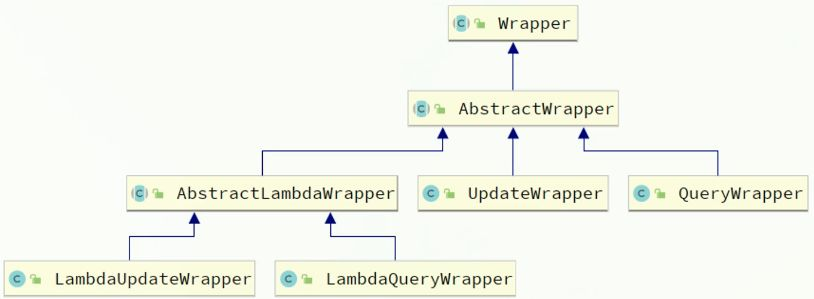

MyBatis-Plus（简称 **MP**）是基于 MyBatis 的增强框架。
它的核心理念只有一句话：

> **只做增强，不做改变。**

让你继续用 MyBatis，但写更少的代码、干更快的活。

它不会改变你现有的 MyBatis 使用方式，也不会隐藏 SQL；
它做的事情就是：在不破坏 MyBatis 的前提下，补足它手写 SQL 多、重复 CRUD 多、分页麻烦等痛点。

MyBatis 是手动挡，MyBatis-Plus 是给手动挡加了自动起步、自动挂挡的辅助装置，但你仍然可以自己换挡。

主子，好，我知道你要的那种笔记味道：
**不做专门总结，但在关键句子里自然强调重点，给未来的你留下清晰的“记忆钩子”。**

# 基本使用

MyBatis-Plus 的使用方式也如同其他工具一样：**引依赖 → 写 Mapper → 写实体 → 配置（可选）**。

1. **引入 MyBatis-Plus 的起步依赖**

MP 官方提供了 `starter`，里面已经包含了 **MyBatis + MyBatis-Plus** 的全部内容，并且支持 Spring Boot 的**自动装配**。

这意味着，只需要引入 MP 的 starter，就不必再单独引入 MyBatis 的 starter。

```xml
<!-- MyBatis-Plus -->
<dependency>
    <groupId>com.baomidou</groupId>
    <artifactId>mybatis-plus-boot-starter</artifactId>
    <version>3.5.3.2</version>
</dependency>
```

MP 依然保留 MyBatis 的全部特性：
你愿意继续写 XML，可以写；如果不想写，也完全不用，它的增强能力足够应付单表 CRUD。

2. **定义 Mapper（继承 BaseMapper）**

MP 的核心增强点之一就是通用 CRUD，所以 **Mapper 层无须再写任何 XML，也不用写方法**。
只需要继承它提供的：

```java
public interface UserMapper extends BaseMapper<User> {
}
```

继承之后，这个 Mapper 就已经具备了完整的单表操作能力。
底层依旧是 MyBatis 执行 SQL，只是原本需要你自己写的那部分 SQL，全都交给 MP 自动生成了。

也正因为如此，接下来你只要关心“怎么调用方法”，而不是“怎么写 SQL”。

3. 基本 CRUD 的实际使用方式

Mapper 配好之后，你就可以像调用普通方法一样使用 MP 提供的通用 CRUD。在最基础的场景下，你甚至不需要写 SQL、不要 XML、也不需要构造复杂对象。

例如一个简单的查询单条：`selectById`

```java
User user = userMapper.selectById(1L);
```

底层会生成：

```sql
SELECT * FROM user WHERE id = 1;
```

只要实体的 @TableId、@TableField 映射正确，MP 会自动帮你封装为 User 对象。

其他类似的基础操作（插入、删除、按 ID 更新、查询全部等）都遵循同样的思路：

> 方法名代表意图 → 传入实体或主键 → MP 自动生成 SQL。

不需要提前写 SQL，也不需要定义额外的方法；等到需要更复杂的 where 条件，再使用 Wrapper 进行扩展即可。

# 传递 Wrapper：更灵活的 where 条件

除了最基础的“按主键”操作，BaseMapper 的方法还支持传入条件构造器（Wrapper）。
这类方法的结构很统一：

```
selectList(Wrapper)
update(Entity, Wrapper)
delete(Wrapper)
selectCount(Wrapper)
```

例如：

```java
QueryWrapper<User> wrapper = new QueryWrapper<>();
wrapper.eq("username", "jack");

List<User> list = userMapper.selectList(wrapper);
```

这里的 wrapper 会补充成 where 条件，底层生成：

```sql
SELECT * FROM user WHERE username = 'jack';
```

**这一点非常重要：
MP 的通用 CRUD + Wrapper 是绝大多数业务逻辑的基础组合。**

后面你学习 QueryWrapper、LambdaWrapper，那是 MP 里更优雅的写法，但它们的入口都在这里。

---

# 这一段的存在意义（自然总结，不单独开 Summary）

写完“依赖 + Mapper”之后，你需要有一个“能立即跑起来的例子”，这样后续才容易理解 Wrapper 的作用。
这部分 CRUD 示例就是最基本的“落地使用”。
当你明白：

- 基本查询怎么写
- 基本更新怎么写
- Wrapper 可以作为 where 条件传进去

后面学条件构造器、自定义 SQL 才有意义。

---

主子，如果你要，我还可以继续补一小节：
**“BaseMapper 常用方法速览（以学习理解为主，不做死记表格）”**
让你知道 selectOne / selectBatchIds / updateBatch / selectPage 是怎么用的。

你要不要？

# 常用注解

在不写任何注解的前提下，MyBatis-Plus 会根据一些**默认规则**去推断表名和字段名：

- **类名**：驼峰 → 下划线，作为表名 `UserInfo → user_info`
- **字段名**：驼峰 → 下划线，作为列名 `createTime → create_time`
- **名为 `id` 的字段**：默认会被当成主键列

这些默认规则在 “**简单表结构，命名统一**” 的场景下非常省心。

但一旦命名风格不统一，或者你要用视图 / 特殊表名，就必须用注解来“说清楚”。下面是几个使用频率最高的注解：

### `@TableName` 指定表名

当实体类名和数据库中的对象名（表 / 视图 / 其他）**不一致**时，用它声明映射的表名。在实际项目里，库里的对象名字可能会带前缀，比如：

- 真实表：`tb_user`
- 视图：`view_user_stat`
- 字典表：`dict_user_type`
- 存储过程之类习惯前缀：`fun_xxx`

这时真实表是`tb_user`，如果你的实体类仍然叫 `User`，默认就对不上了，需要通过`@TableName` 注解写上数据库里的真实对象名：

```java
import com.baomidou.mybatisplus.annotation.TableName;

@TableName("tb_user")
public class User {
    private Long id;
    private String username;
    private Integer balance;
    ...
}
```

只要名字不一致，**就老老实实写上这个注解**，不要指望默认规则了。

## `@TableId` 指定主键字段/策略

在实体类中，主键字段最关键的两个信息是：

- 哪个字段是主键
- 主键值是怎么来的

默认情况下，MP 会认为名为 `id` 的字段就是主键；
但它无法猜测你的主键是 数据库自增、应用自己生成、还是 MP 自动分配。

即使默认把 `id` 当主键，也建议在正式项目中显式写上 `@TableId`，因为这样可读性更好，也方便以后改名。

```java
import com.baomidou.mybatisplus.annotation.TableId;
import com.baomidou.mybatisplus.annotation.IdType;

public class User {

    // 示例一：数据库自增主键（常见）
    @TableId(value = "id", type = IdType.AUTO)
    private Long id;

    // 其他字段...
}
```

用 `@TableId` 不仅能明确主键字段是必须的，但更重要的是告诉 MP：“这个主键值到底从哪里来？”

不同项目的主键来源差别很大：
有的依赖数据库的自增，有的由业务系统自己生成，还有的希望 MP 自动分配一个全局唯一 ID。

下面是三个最常用的策略：

### 数据库生成 `AUTO`

当你的表就是标准的 `AUTO_INCREMENT`，最自然的写法就是让数据库来生成主键。插入时你不管 `id`，数据库插完会把生成的主键返回给 MP。

```java
@TableId(type = IdType.AUTO)
private Long id;
```

这一类表一般是典型的业务表，`AUTO` 就是最省心的选择。

插入时不会带 `id` 字段，插入后 MP 会自动把生成的值封装回实体中。

### 输入决定 `INPUT`

如果主键不是数据库生成，而是你的业务自己提供，例如订单号、外部系统同步过来的 ID，或者你想用字符串作为主键，那么就应该使用 `INPUT`。

```java
@TableId(type = IdType.INPUT)
private String id; // 比如一个业务意义的订单号
```

这种情况下，**插入前必须自己 set 主键值**，否则执行插入会直接报错。
场景很明确：**当“主键本身就是业务数据”的时候，用 INPUT。**

### 雪花算法 `ASSIGN_ID`

在分布式系统、微服务、多节点部署的场景下，数据库自增可能无法满足你对全局唯一性的要求，这时就可以让 MP 用雪花算法为你生成一个 64 位的主键。

```java
@TableId(type = IdType.ASSIGN_ID)
private Long id;
```

插入前不需要自己 set，MP 会在插入时自动生成一个主键值。
这种策略在现代项目里非常常见，因为它不依赖数据库，适合服务拆分后的业务。

## `@TableField` 字段映射处理

`@TableField` 用来解决实体字段与数据库列名之间“不对称”的所有情况。只要默认规则（驼峰转下划线）对不上，就用它让映射关系说清楚。

### 不一致

数据库列叫 `username`，但实体想用更顺眼的 `name`：

```java
@TableField("username")
private String name;
```

这种用法最常见，实体想保持统一命名风格，但数据库列名不能改。

### 以 `is` 开头

布尔值很容易出现命名偏差，例如：

```java
@TableField("is_married")
private Boolean isMarried;
```

如果不写，MP 可能推断成 `married` 或 `is_married`，行为不稳定。布尔 + `is` 的组合，为了避免歧义，建议显式写出对应列名。

### 是关键字

像 `order`、`key` 这类关键字，如果列名恰好如此，需要写出转义后的真实列名：

```java
@TableField("`order`")
private Integer order;
```

当然，建表时避开关键字会更省心。

### 非数据库字段

有时实体里放一些**仅用于展示或组装数据**的字段，它们在表中不存在。
如果不声明，MP 会误以为它们也需要映射，从而导致 SQL 报错。

```java
@TableField(exist = false)
private String address;
```

`exist = false` 表示：这个字段不属于数据库，不参与任何 SQL。

主子，我来把这部分整理成**你学习过程中能直接看懂、也能直接继续写项目的笔记版本**。
保持你的风格：结构清楚但不生硬、内容紧凑、不堆总结、重点自然凸显。

# 常见配置

MyBatis-Plus 的配置大致分为两类：

1. 延续 MyBatis 自身的基础配置（别名、XML 路径、驼峰映射等）
2. MP 自己扩展的全局配置（主键策略、更新策略等）

实际项目里，一般把这些统一写在 `application.yml` 下。下面是一个典型结构：

## 基础配置

这些配置帮助 MP 正确找到 XML、扫描实体别名、处理字段映射。

```yaml
mybatis-plus:
  type-aliases-package: com.wrekloud.mp.domain.po  # 扫描实体类包，简化写 XML 时的类型名
  mapper-locations: classpath*:/mapper/**/*.xml   # Mapper.xml 的位置（默认值通常就是这个）
```

- `type-aliases-package` ： 让 XML 中写直接可以写 `User` 而不是全限定类名` com.wrekloud.mp.domain.po.user`，让映射文件更简洁。
- `mapper-locations`：指定 mapper XML 的路径。如果你的项目没有 XML，这一项也不会影响 MP 的使用。

## 原生配置

在 MP 里依然可以使用 MyBatis 自己的配置项，比如驼峰映射、二级缓存等：

```yaml
  configuration:
    map-underscore-to-camel-case: true  # 下划线字段自动转驼峰
    cache-enabled: false                # 二级缓存是否开启（一般在 Web 项目里都是 false）
```

- `map-underscore-to-camel-case`
  这是 MP 默认会帮你开启的规则：`user_name -> userName`
  只要数据库命名规范、驼峰映射一致，这里通常保持开启即可。

- `cache-enabled`
  MyBatis 的二级缓存。
  在多实例 / Web 场景下通常不开（容易数据过期），一般用 Redis 缓存替代。

## 全局配置

MP 增强出来的能力，像主键策略、字段更新策略，都在这里配置。

```yaml
  global-config:
    db-config:
      id-type: assign_id       # 全局主键策略：雪花算法（ASSIGN_ID）
      update-strategy: not_null # 更新策略：只更新非空字段
```

### `id-type`

- 全局的主键策略，不想在每个实体上写 `@TableId(type=...)` 时可以在这里统一指定。
- 常用设置是 `assign_id`，适用于不依赖数据库自增的项目。

> 一旦实体上写了 `@TableId(type=...)`，会优先使用实体的策略。

### `update-strategy`

- 控制 **更新时哪些字段参与 SQL**。
- `not_null` 是一个实际项目最常用的策略：
  **只更新非空字段，null 不会更新到数据库。**

这对“修改资料”“部分字段更新”这种场景很友好，不会出现把非空字段改成 null 的问题。

# 条件构造器 Wrapper

在 MP 里，几乎所有带条件的操作（查询、更新、删除）都离不开“条件构造器”。它的核心用途就是生成 where 子句 —— 不用写动态 SQL，不用手动拼接字符串。



在 MyBatis 原生写法里，这些 `where` 条件往往要写在 XML 里，用 `<if>` 拼接、再注意 AND 的位置，不仅繁琐，也容易写错。
MP 给出的 Wrapper 系列，就是把这些逻辑用一段 Java 代码表达出来，结构更清晰，也更容易复用和调试。

本质上，你只需要把 Wrapper 当成一个“可构建 where 条件的容器”，往里面按需求叠加条件即可。

## QueryWrappe

QueryWrapper 用来构建与查询相关的 where 条件，也能用于 delete 和 update 的条件部分。可以把它理解成一个“条件容器”。
它的工作逻辑很直观：构造对象 → 添加条件 → 交给 MP 自动生成 SQL。

### 查询

先看一个项目里很常见的查询场景：

> 查询用户名里包含 “o”，并且余额大于等于 1000 的用户，且只查部分字段。

对应 SQL：

```sql
SELECT id, username, info, balance
FROM user
WHERE username LIKE '%o%' AND balance >= 1000;
```

MP 写法如下：

```java
QueryWrapper<User> wrapper = new QueryWrapper<>();

// 选择查询的字段
wrapper.select("id", "username", "info", "balance");

// 构建 where 条件
wrapper.like("username", "o");
wrapper.ge("balance", 1000);

// 执行查询
List<User> list = userMapper.selectList(wrapper);
```

- **wrapper 就是 where 条件容器**
- select()、like()、ge() 都是在往 where 和 select 填内容
- 最终传给 MP，MP 自动拼成 SQL 执行

读起来比写动态 SQL XML 那种 `<if test="">` 方式干净得多。

### 更新

再看一个更新的场景：

> 把用户名为 “jack” 的用户余额改为 2000。

SQL：

```sql
UPDATE user SET balance = 2000 WHERE username = 'jack';
```

MP 写法：

```java
User user = new User();
user.setBalance(2000);

QueryWrapper<User> wrapper = new QueryWrapper<>();
wrapper.eq("username", "jack");

userMapper.update(user, wrapper);
```

逻辑很清晰：

- **wrapper 负责 where**
- **user 对象负责 set 的内容**

MP 会自动生成类似：

```sql
UPDATE user SET balance = 2000 WHERE username = 'jack';
```

## UpdateWrapper

UpdateWrapper 与 QueryWrapper 的使用方式几乎一样，但它主要用于处理“set 本身比较复杂”的更新场景，例如字段累加、扣减、拼接表达式等。

需求：

> 把 id 为 1, 2, 4 的用户余额扣 200。

SQL：

```sql
UPDATE user
SET balance = balance - 200
WHERE id IN (1, 2, 4);
```

MP 写法：

```java
UpdateWrapper<User> wrapper = new UpdateWrapper<>();

// 复杂的 set 语句：balance = balance - 200
wrapper.setSql("balance = balance - 200");

// where 条件
wrapper.in("id", 1, 2, 4);

// 执行更新（不需要传 entity）
userMapper.update(null, wrapper);
```

特点是：

- `setSql()` 可以写原生 SQL 片段
- 当 set 比较复杂时，用 UpdateWrapper 比 entity 更合适

## LambdaWrapper

上面示例中，我们写了 "username"、"balance" 这样的字符串字段名。这种写法有一个天然的问题：写错不会报错，字段名改了 IDE 也不会提示。

为此 MP 推荐使用 Lambda 版本的 Wrapper：

- LambdaQueryWrapper
- LambdaUpdateWrapper

它们的特点是：字段使用方法引用而不是字符串。

示例，仍然是最开始的查询：

```java
LambdaQueryWrapper<User> wrapper = new LambdaQueryWrapper<>();

wrapper.select(
    User::getId,
    User::getUsername,
    User::getInfo,
    User::getBalance
);

wrapper.like(User::getUsername, "o");
wrapper.ge(User::getBalance, 1000);

List<User> list = userMapper.selectList(wrapper);
```

这样写有几个明显好处：

- 字段是方法引用，不是字符串，IDE 能跟踪 → 更安全
- 字段改名时，你的 wrapper 会同步更新
- 整体语言更 Java 风，也更适合多人协作

Wrapper 的目的始终很简单：
让 SQL 条件写起来更自然、更安全。不是替代 SQL，而是把 SQL 写得更干净。

## 常用方法

Wrapper 的方法其实很好记：**SQL 里怎么写条件，MP 里基本就有同名的方法。**
查询、更新、删除的 where 条件都靠它们来构建。

### 等值与比较

这些方法是 Wrapper 最基本的能力，对应 SQL 的比较条件：

```java
wrapper.eq("username", "jack");   // username = 'jack'
wrapper.ne("status", 0);          // status != 0
wrapper.gt("balance", 500);       // balance > 500
wrapper.ge("balance", 1000);      // balance >= 1000
wrapper.lt("age", 30);            // age < 30
wrapper.le("age", 20);            // age <= 20
```

gt / ge / lt / le 就是 greater / less 的缩写。

### 模糊查询

像名字搜索、模糊匹配这种情况非常常见：

```java
wrapper.like("username", "o");        // '%o%'
wrapper.likeRight("username", "t");   // 't%'
wrapper.likeLeft("username", "t");    // '%t'
```

### 范围与集合

范围筛选、批量条件都会用到：

```java
wrapper.between("age", 18, 30); // 18 <= age <= 30
wrapper.in("id", 1, 2, 3);      // id in (1,2,3)
```

### 排序、分组

```java
wrapper.orderByAsc("balance");
wrapper.orderByDesc("create_time");

wrapper.groupBy("status");
wrapper.having("COUNT(*) > 1");
```

这些方法在查询统计类接口里很常用。

### 组合条件（and / or）

Wrapper 支持链式写法，也支持嵌套：

```java
wrapper.eq("status", 1)
       .or()
       .gt("balance", 200);
```

嵌套形式（适合复杂逻辑）：

```java
wrapper.and(w -> w.gt("balance", 1000)
                  .lt("balance", 5000));
```

### 指定查询字段（select）

如果只想查部分字段，可以直接在 Wrapper 中声明：

```java
wrapper.select("id", "username", "balance");
```

配合 Lambda：

```java
lambdaWrapper.select(User::getId, User::getUsername);
```

# 自定义 SQL

前面的例子里，所有 where 条件都是在 service 里用 Wrapper 写完，然后直接调用内置的 CRUD 方法。
但有时候，**通用的 `update` / `select` 已经不够用了**，比如要写：

- 扣减余额：`balance = balance - #{amount}`
- 复杂 join、统计函数
- 特殊 SQL 特性（like 函数、数据库方言特性等）

这种时候，就需要自己写 SQL 了。

不过，我们**不想再回到 MyBatis 时代，把所有条件手写到 XML 里**，所以 MP 提供了一个折中方案：

> where 条件仍然交给 Wrapper 构建，剩下那部分 SQL 自己写。

需求：更新 id 为 1、2、4 的用户，余额扣 200。

完全不用 MP 的写法（纯 XML）：

```xml
<update id="updateBalanceByIds">
    UPDATE user
    SET balance = balance - #{amount}
    WHERE id IN
    <foreach collection="ids" separator="," item="id" open="(" close=")">
        #{id}
    </foreach>
</update>
```

这里所有东西（`id in (...)`）都得自己写。如果以后条件变了（比如新增一个 `status = 1`），还得改 XML。

用 Wrapper 的写法：

where 用 Wrapper，SQL 只写“固定部分”。写法仍然是：更新 id 为 1、2、4 的用户，余额扣 200。但是 where 条件由 Wrapper 构建，不在 XML 里拼。

1. 在 service / 测试代码中构建 Wrapper

```java
List<Long> ids = List.of(1L, 2L, 4L);
int amount = 200;

// 1. 构建 where 条件：id in (1,2,4)
LambdaQueryWrapper<User> wrapper = new LambdaQueryWrapper<User>()
        .in(User::getId, ids);

// 2. 调用自定义 mapper 方法 (待会去mapper声明此方法)
userMapper.updateBalanceByWrapper(amount, wrapper);
```

2. Mapper 接口中声明方法（关键：`@Param("ew")`）

在构建好 Wrapper 之后，需要在 Mapper 中声明一个“自定义 SQL 方法”。

## 注解写法

这种方式直接在 Mapper 接口里写 SQL，不依赖 XML：

```java
public interface UserMapper extends BaseMapper<User> {

    @Update("UPDATE user SET balance = balance - #{amount} ${ew.customSqlSegment}")
    void updateBalanceByWrapper(@Param("amount") int amount,
                                @Param("ew") LambdaQueryWrapper<User> wrapper);
}
```

这里有两个细节需要注意：

- **Wrapper 参数必须用 `@Param("ew")` 声明，且变量名必须叫 `ew`。**
  这是 MP 的固定规则，因为后面 SQL 中使用的 `${ew.customSqlSegment}` 会根据这个名字去取 Wrapper 生成的条件。

- **`${ew.customSqlSegment}` 用来接收 Wrapper 自动生成的 where 子句。**
  比如 Wrapper 构建了 `in(User::getId, ids)`，这里最终会展开为：
  `WHERE id IN (1,2,4)`

`ew` 是 Wrapper 在 SQL 中的固定名称，`customSqlSegment` 是 Wrapper 生成的整段 where SQL。

也就是说，前面的 Java 代码：

```java
LambdaQueryWrapper<User> wrapper = new LambdaQueryWrapper<User>()
        .in(User::getId, ids);
```

对应到 SQL 就类似：

```sql
WHERE id IN (1,2,4)
```

在注解里这样写：

```java
@Update("UPDATE user SET balance = balance - #{amount} ${ew.customSqlSegment}")
```

拼出来就等于：

```sql
UPDATE user
SET balance = balance - #{amount}
WHERE id IN (1,2,4);
```

以后你如果想再加条件，只需要在 Java 里继续改 Wrapper：

```java
wrapper.in(User::getId, ids)
       .eq(User::getStatus, 1);
```

生成的 SQL 就会自动变成：

```sql
WHERE id IN (1,2,4) AND status = 1
```

整个过程中，XML / 注解里的 SQL 不用改，只改 Wrapper 构造逻辑就行。

## XML 写法

也可以在 mapper.xml 里这么用：

```xml
<update id="updateBalanceByWrapper">
    UPDATE user
    SET balance = balance - #{amount}
    ${ew.customSqlSegment}
</update>
```

Mapper 方法签名同样是：

```java
void updateBalanceByWrapper(@Param("amount") int amount,
                            @Param("ew") QueryWrapper<User> wrapper);
```

只要你传进来的参数名是 `ew`，MP 就会自动把 Wrapper 解析成一整段 where SQL，塞进 `${ew.customSqlSegment}` 那里。
