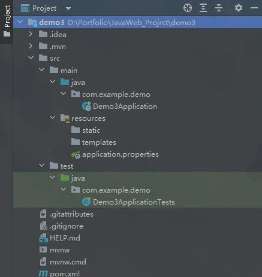
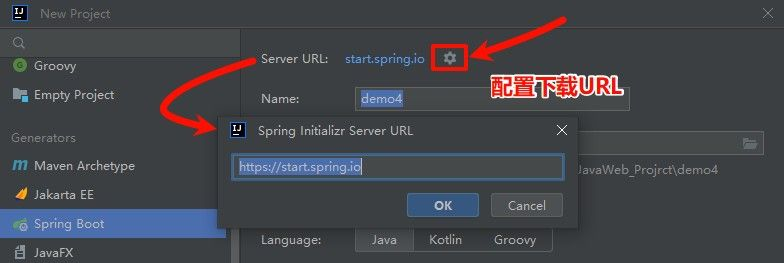
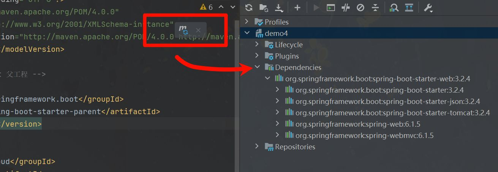
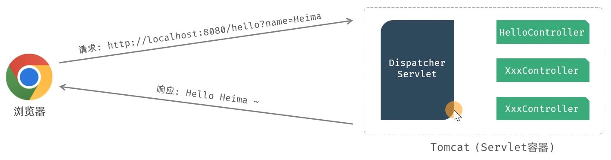

你可能已经听说过 **Spring**，这个在 Java 开发世界里几乎无处不在的名字。Spring 就像是一个超强的工具箱，里面有一堆各式各样的工具，专门用来解决开发中的各种问题。


无论是数据库、Web 应用，还是安全性管理，Spring 都能轻松搞定。

但如果你曾经尝试过使用 Spring，你应该知道它有一个“缺点”——它的配置和入门有点复杂，尤其是对于刚接触它的开发者来说，得花费不少时间去理解和配置。

这时，Spring Boot 就出现了，它是 Spring 家族中的一个新成员，简化了很多繁琐的步骤。Spring Boot 让我们像玩积木一样，通过简单的配置就能快速构建应用程序。没有繁琐的 XML 文件、没有冗长的配置，只需要少量的代码，就能快速搭建起一个可以跑起来的 Web 应用。

简单来说：**Spring Boot 更轻松**。

- **自动配置**：你不用手动配置服务器、数据库连接等，Spring Boot 会自动帮你搞定。
- **开箱即用**：大多数情况下，你启动一个 Spring Boot 项目，几乎不需要改动任何配置，系统就能跑起来。
- **快速开发**：减少了很多不必要的工作，专注于实现功能本身。

那就让我们从一个简单的 Spring Boot Web 应用案例开始，感受一下它带来的便利。

# 入门案例

目标：我们要用 Spring Boot 快速构建一个 Web 应用，浏览器发起请求 `/hello` 后，返回字符串 "Hello xxx ~"。

### 方式一：Spring 脚手架

**1). 创建 SpringBoot 工程（需要联网）**

基于 Spring 官方骨架，创建 SpringBoot 工程，注意保持网络通畅。


选择 “新建项目” -> “Spring Initializr”，然后配置好你的项目名称和存储位置。
语言选择 Java，构建工具选择 **Maven**（默认是 Gradle，记得手动切换一下）。此外，还可以选择需要的 JDK 版本和打包方式。

点击下一步，就能够看到可以选择的依赖，别忘了勾选 Web，因为我们要做一个 Web 应用。完成后，点击创建，会看到项目结构大致如下：



> 创建过程可能会需要联网下载一些资源，稍等片刻。

一般来说不需要额外配置，但由于 spring 官网并不在国内，如果下载出现问题，可以考虑使用阿里云镜像：



使用阿里云提供的脚手架，将网址：

```
https://start.aliyun.com
```

填入其中，接着正常创建即可。

**2). 定义 HelloController 类，添加方法 hello，并添加注解**

接下来要做的就是创建一个简单的控制器，处理来自浏览器的请求。在 `src\main\java\com.example.xxx\` 下新建`HelloController`一个类：

HelloController 中的内容，具体如下：

```Java
import org.springframework.web.bind.annotation.RequestMapping;
import org.springframework.web.bind.annotation.RestController;

@RestController //标识当前类是一个请求处理类
public class HelloController {

    @RequestMapping("/hello") //标识请求路径
    public String hello(String name){
        System.out.println("HelloController ... hello: " + name);
        return "Hello " + name;
    }

}
```

**3). 运行测试**

需要运行 Spring Boot 自动生成的引导类（带有 `@SpringBootApplication` 注解的类）。运行后，打开浏览器，输入以下地址：

```
http://localhost:8080/hello?name=Wreckloud
```

如果一切顺利，你会看到浏览器返回：


现在已经成功用 Spring Boot 构建了一个 Web 应用！

### 方式二：传统方式

如果你想依赖 Spring 脚手架，也可以选择手动配置 Spring Boot 项目，使用 Maven 来构建。

**1).创建 Maven 项目**

这就和创建普通的 Maven 项目差不多，只是多了些 Spring Boot 的配置。记得配置好项目的名称和存储位置，还有选择 Maven 作为构建工具。


**2). 配置 `pom.xml`**

Maven 项目准备好后才是重头戏，我们要配置 Spring Boot 相关的依赖。打开 `pom.xml` 文件，添加 Spring Boot 的父工程和 Web 启动依赖。

```xml
<!-- 继承 Spring Boot 父工程 -->
<parent>
    <groupId>org.springframework.boot</groupId>
    <artifactId>spring-boot-starter-parent</artifactId>
    <version>3.2.4</version>
</parent>
```

Spring Boot 父工程可以帮助我们自动管理版本，避免自己手动维护版本号的麻烦。

> 注意：Spring 3.0 及以上版本需要 JDK 17，如果使用的是较旧版本的 JDK，记得更新。

接下来，再在 `pom.xml` 添加 Web 启动依赖，这是让你的项目能够支持 Web 应用开发的核心依赖：

```xml
<dependencies>
	<!-- Web 起步依赖 -->
    <dependency>
        <groupId>org.springframework.boot</groupId>
        <artifactId>spring-boot-starter-web</artifactId>
    </dependency>
</dependencies>
```

以下是入门案例完整的 `pom.xml` 示例:

```xml{7-15,23-28}
<?xml version="1.0" encoding="UTF-8"?>
<project xmlns="http://maven.apache.org/POM/4.0.0"
         xmlns:xsi="http://www.w3.org/2001/XMLSchema-instance"
         xsi:schemaLocation="http://maven.apache.org/POM/4.0.0 http://maven.apache.org/xsd/maven-4.0.0.xsd">
    <modelVersion>4.0.0</modelVersion>

    <!-- 继承 Spring Boot 父工程 -->
    <parent>
        <groupId>org.springframework.boot</groupId>
        <artifactId>spring-boot-starter-parent</artifactId>
        <version>3.2.4</version>
    </parent>
    <groupId>com.wreckloud</groupId>
    <artifactId>demo4</artifactId>
    <version>1.0-SNAPSHOT</version>

    <properties>
	    <maven.compiler.source>21</maven.compiler.source>
        <maven.compiler.target>21</maven.compiler.target>
        <project.build.sourceEncoding>UTF-8</project.build.sourceEncoding>
    </properties>

    <dependencies>
	    <!-- Web 起步依赖 -->
        <dependency>
            <groupId>org.springframework.boot</groupId>
            <artifactId>spring-boot-starter-web</artifactId>
        </dependency>

    </dependencies>
</project>
```

完成这些配置后，刷新 Maven，检查一下 Dependencies 下的依赖是否都正确导入。



**3).添加启动类**

与使用 Spring 脚手架不同，手动构建的 Spring Boot 项目没有自动生成启动类。我们需要自己创建一个。启动类的作用是启动 Spring 应用上下文，类似于在传统 Java 项目中写一个 `main` 方法。

写法就是加一个 `@SpringBootApplication` 注解，并通过 `SpringApplication.run()` 来启动：

```Java
/**
 * 启动类
 */
@SpringBootApplication
public class Main {
    public static void main(String[] args) {
        SpringApplication.run(Main.class, args);
        System.out.println("HelloWorld!");
    }
}
```

这段代码中的 `@SpringBootApplication` 注解是启动 Spring Boot 应用的关键，`SpringApplication.run()` 方法会启动整个 Spring 容器。

完成后，和之前的步骤一样，定义 `HelloController` 类，处理 `/hello` 请求，同样再运行就能看到相同的结果了！

# 案例分析

如果用过 SSM 的 Spring 后，就能深刻体会到 Spring Boot 确实让开发变得更轻松，这一切的背后，离不开我们刚刚在项目中添加的 Spring Web 依赖。


可以在右侧的 Maven 面板 中看到所有的依赖。比如，Web 开发所需的起步依赖就是 `spring-boot-starter-web`，它自带了很多 Web 开发需要的功能。

web 开发的 **起步依赖** 是 `spring-boot-starter-web`。


而`spring-boot-starter-web`依赖, 又依赖了`spring-boot-starter-tomcat`。由于 maven 的依赖传递特性,，那么在我们创建的 springboot 项目中也就已经有了 tomcat 的依赖, 也就是内嵌的 tomcat。

Tomcat 是一个 Servlet 容器，它的任务就是接收 HTTP 请求并将请求分发到我们的 Controller 上。我们开发的应用程序会自动运行在这个内嵌的 Tomcat 服务器中，并监听默认的 8080 端口。

### Tomcat 的工作原理

我们通过运行引导类中的 `main` 方法启动 Spring Boot 应用，实际上就是启动了这个内嵌的 Tomcat 服务器。



而请求进入 Tomcat 后，会由 DispatcherServlet 分发给对应的 Controller。我们在代码中写的 `HelloController` 就是在这个过程中发挥作用，接收请求并返回响应。

你可以把 Tomcat 想象成一个“门卫”，它负责接收外界的请求，然后将请求交给内部的处理逻辑（比如你的 `HelloController`）。当请求得到处理后，Tomcat 再把结果返回给浏览器。

### 修改端口号

如果你不喜欢默认的 8080 端口，完全可以修改它。在使用 **Spring 脚手架** 的项目中，这个配置项一般都已经在 `application.properties` 文件里了，只需要简单修改即可：

```properties
server.port=8081  # 这里可以修改为你喜欢的端口
```

如果你是手动创建的项目，那么只需要在 `application.properties` 文件（或者没有使用脚手架时自己创建的同名文件）中添加这个配置，Tomcat 就会自动监听你指定的端口。

### 打包和分享项目

当开发完成后，想要和别人分享你的项目并让别人测试运行，你可以将项目打包成一个 `jar` 文件。在 `pom.xml` 文件中，确保有以下打包插件：

```xml
<build>
    <plugins>
        <!-- 打包插件 -->
        <plugin>
            <groupId>org.springframework.boot</groupId>
            <artifactId>spring-boot-maven-plugin</artifactId>
        </plugin>
    </plugins>
</build>
```

然后，你可以通过命令行进入项目目录，使用以下命令打包并运行：

```bash
java -jar springboot-web-quickstart01-0.0.1-SNAPSHOT.jar
```

也可以找到 Maven 生命周期 面板中的 `install` 或 `package`，点击执行它们来打包项目。


这样，你的项目就会在目标机器上启动。但是，要确保对方的机器上安装了 **JDK 环境**，否则他们无法运行 `jar` 文件。
