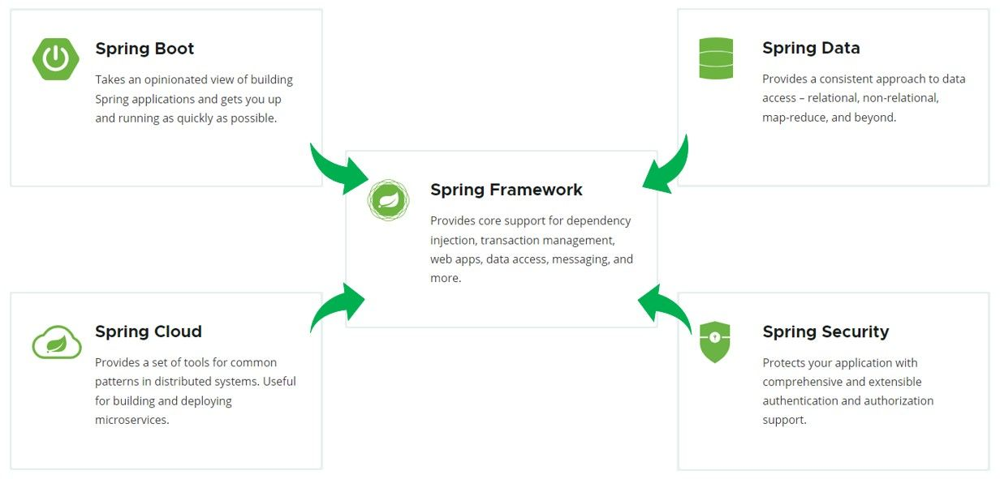
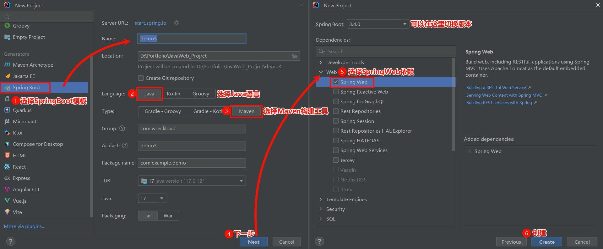
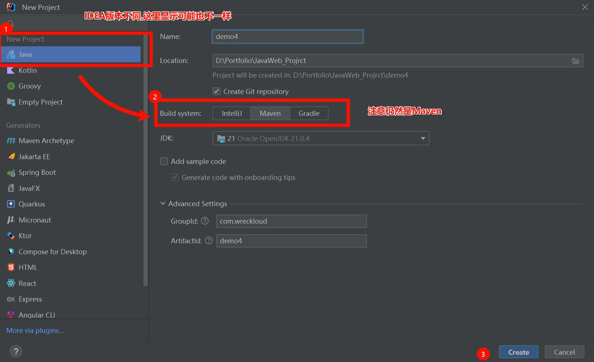
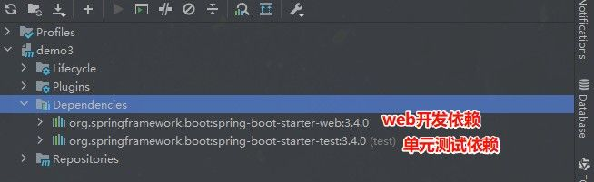
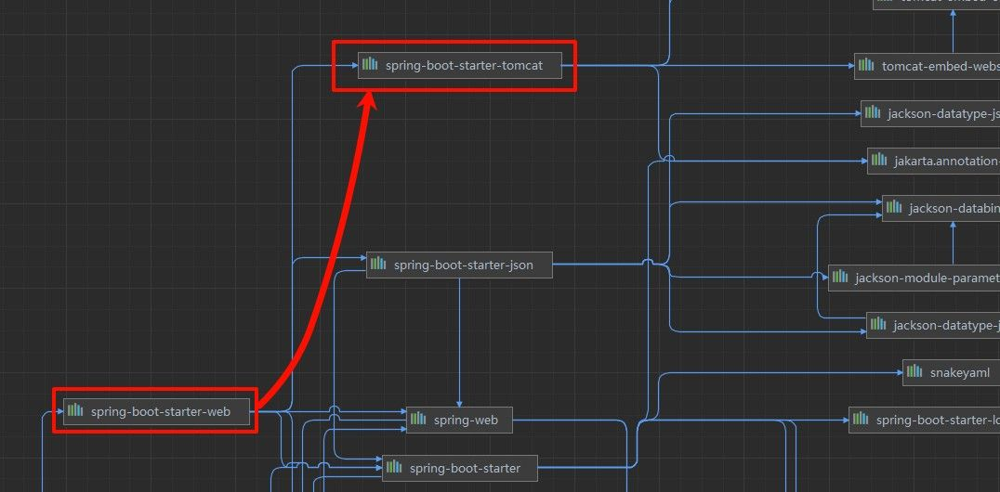
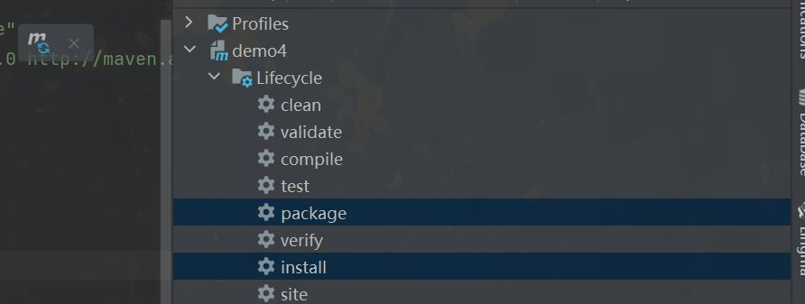

你可能已经听说过 **Spring**，这个在 Java 开发世界里几乎无处不在的名字。Spring 就像是一个超强的工具箱，里面有一堆各式各样的工具，专门用来解决开发中的各种问题。



无论是数据库、Web 应用，还是安全性管理，Spring 都能轻松搞定。

但如果你曾经尝试过使用 Spring，你应该知道它有一个“缺点”——它的配置和入门有点复杂，尤其是对于刚接触它的开发者来说，得花费不少时间去理解和配置。

这时，Spring Boot 就出现了，它是 Spring 家族中的一个新成员，简化了很多繁琐的步骤。Spring Boot 让我们像玩积木一样，通过简单的配置就能快速构建应用程序。没有繁琐的 XML 文件、没有冗长的配置，只需要少量的代码，就能快速搭建起一个可以跑起来的 Web 应用。

简单来说：**Spring Boot 更轻松**。

- **自动配置**：你不用手动配置服务器、数据库连接等，Spring Boot 会自动帮你搞定。
- **开箱即用**：大多数情况下，你启动一个 Spring Boot 项目，几乎不需要改动任何配置，系统就能跑起来。
- **快速开发**：减少了很多不必要的工作，专注于实现功能本身。

那就让我们从一个简单的 Spring Boot Web 应用案例开始，感受一下它带来的便利。

# 入门案例

目标：我们要用 Spring Boot 快速构建一个 Web 应用，浏览器发起请求 `/hello` 后，返回字符串 "Hello xxx ~"。

### 方式一：Spring 脚手架

**1). 创建 SpringBoot 工程（需要联网）**

基于 Spring 官方骨架，创建 SpringBoot 工程，注意保持网络通畅。



选择 “新建项目” -> “Spring Initializr”，然后配置好你的项目名称和存储位置。
语言选择 Java，构建工具选择 **Maven**（默认是 Gradle，记得手动切换一下）。此外，还可以选择需要的 JDK 版本和打包方式。

点击下一步，就能够看到可以选择的依赖，别忘了勾选 Web，因为我们要做一个 Web 应用。完成后，点击创建，会看到项目结构大致如下：


> 创建过程可能会需要联网下载一些资源，稍等片刻。

一般来说不需要额外配置，但由于 spring 官网并不在国内，如果下载出现问题，可以考虑使用阿里云镜像：


使用阿里云提供的脚手架，将网址：

```
https://start.aliyun.com
```

填入其中，接着正常创建即可。

**2). 定义 HelloController 类，添加方法 hello，并添加注解**

接下来要做的就是创建一个简单的控制器，处理来自浏览器的请求。在 `src\main\java\com.example.xxx\` 下新建`HelloController`一个类：

HelloController 中的内容，具体如下：

```Java
import org.springframework.web.bind.annotation.RequestMapping;
import org.springframework.web.bind.annotation.RestController;

@RestController //标识当前类是一个请求处理类
public class HelloController {

    @RequestMapping("/hello") //标识请求路径
    public String hello(String name){
        System.out.println("HelloController ... hello: " + name);
        return "Hello " + name;
    }

}
```

**3). 运行测试**

需要运行 Spring Boot 自动生成的引导类（带有 `@SpringBootApplication` 注解的类）。运行后，打开浏览器，输入以下地址：

```
http://localhost:8080/hello?name=Wreckloud
```

如果一切顺利，你会看到浏览器返回：


现在已经成功用 Spring Boot 构建了一个 Web 应用！

### 方式二：传统方式

如果你想依赖 Spring 脚手架，也可以选择手动配置 Spring Boot 项目，使用 Maven 来构建。

**1).创建 Maven 项目**

这就和创建普通的 Maven 项目差不多，只是多了些 Spring Boot 的配置。记得配置好项目的名称和存储位置，还有选择 Maven 作为构建工具。



**2). 配置 `pom.xml`**

Maven 项目准备好后才是重头戏，我们要配置 Spring Boot 相关的依赖。打开 `pom.xml` 文件，添加 Spring Boot 的父工程和 Web 启动依赖。

```xml
<!-- 继承 Spring Boot 父工程 -->
<parent>
    <groupId>org.springframework.boot</groupId>
    <artifactId>spring-boot-starter-parent</artifactId>
    <version>3.2.4</version>
</parent>
```

Spring Boot 父工程可以帮助我们自动管理版本，避免自己手动维护版本号的麻烦。

> 注意：Spring 3.0 及以上版本需要 JDK 17，如果使用的是较旧版本的 JDK，记得更新。

接下来，再在 `pom.xml` 添加 Web 启动依赖，这是让你的项目能够支持 Web 应用开发的核心依赖：

```xml
<dependencies>
	<!-- Web 起步依赖 -->
    <dependency>
        <groupId>org.springframework.boot</groupId>
        <artifactId>spring-boot-starter-web</artifactId>
    </dependency>
</dependencies>
```

以下是入门案例完整的 `pom.xml` 示例:

```xml{7-15,23-28}
<?xml version="1.0" encoding="UTF-8"?>
<project xmlns="http://maven.apache.org/POM/4.0.0"
         xmlns:xsi="http://www.w3.org/2001/XMLSchema-instance"
         xsi:schemaLocation="http://maven.apache.org/POM/4.0.0 http://maven.apache.org/xsd/maven-4.0.0.xsd">
    <modelVersion>4.0.0</modelVersion>

    <!-- 继承 Spring Boot 父工程 -->
    <parent>
        <groupId>org.springframework.boot</groupId>
        <artifactId>spring-boot-starter-parent</artifactId>
        <version>3.2.4</version>
    </parent>
    <groupId>com.wreckloud</groupId>
    <artifactId>demo4</artifactId>
    <version>1.0-SNAPSHOT</version>

    <properties>
	    <maven.compiler.source>21</maven.compiler.source>
        <maven.compiler.target>21</maven.compiler.target>
        <project.build.sourceEncoding>UTF-8</project.build.sourceEncoding>
    </properties>

    <dependencies>
	    <!-- Web 起步依赖 -->
        <dependency>
            <groupId>org.springframework.boot</groupId>
            <artifactId>spring-boot-starter-web</artifactId>
        </dependency>

    </dependencies>
</project>
```

完成这些配置后，刷新 Maven，检查一下 Dependencies 下的依赖是否都正确导入。


**3).添加启动类**

与使用 Spring 脚手架不同，手动构建的 Spring Boot 项目没有自动生成启动类。我们需要自己创建一个。启动类的作用是启动 Spring 应用上下文，类似于在传统 Java 项目中写一个 `main` 方法。

写法就是加一个 `@SpringBootApplication` 注解，并通过 `SpringApplication.run()` 来启动：

```Java
/**
 * 启动类
 */
@SpringBootApplication
public class Main {
    public static void main(String[] args) {
        SpringApplication.run(Main.class, args);
        System.out.println("HelloWorld!");
    }
}
```

这段代码中的 `@SpringBootApplication` 注解是启动 Spring Boot 应用的关键，`SpringApplication.run()` 方法会启动整个 Spring 容器。

完成后，和之前的步骤一样，定义 `HelloController` 类，处理 `/hello` 请求，同样再运行就能看到相同的结果了！

# 案例分析

如果用过 SSM 的 Spring 后，就能深刻体会到 Spring Boot 确实让开发变得更轻松，这一切的背后，离不开我们刚刚在项目中添加的 Spring Web 依赖。



可以在右侧的 Maven 面板 中看到所有的依赖。比如，Web 开发所需的起步依赖就是 `spring-boot-starter-web`，它自带了很多 Web 开发需要的功能。

web 开发的 **起步依赖** 是 `spring-boot-starter-web`。



而`spring-boot-starter-web`依赖, 又依赖了`spring-boot-starter-tomcat`。由于 maven 的依赖传递特性,，那么在我们创建的 springboot 项目中也就已经有了 tomcat 的依赖, 也就是内嵌的 tomcat。

Tomcat 是一个 Servlet 容器，它的任务就是接收 HTTP 请求并将请求分发到我们的 Controller 上。我们开发的应用程序会自动运行在这个内嵌的 Tomcat 服务器中，并监听默认的 8080 端口。

### Tomcat 的工作原理

我们通过运行引导类中的 `main` 方法启动 Spring Boot 应用，实际上就是启动了这个内嵌的 Tomcat 服务器。


而请求进入 Tomcat 后，会由 DispatcherServlet 分发给对应的 Controller。我们在代码中写的 `HelloController` 就是在这个过程中发挥作用，接收请求并返回响应。

你可以把 Tomcat 想象成一个“门卫”，它负责接收外界的请求，然后将请求交给内部的处理逻辑（比如你的 `HelloController`）。当请求得到处理后，Tomcat 再把结果返回给浏览器。

### 修改端口号

如果你不喜欢默认的 8080 端口，完全可以修改它。在使用 **Spring 脚手架** 的项目中，这个配置项一般都已经在 `application.properties` 文件里了，只需要简单修改即可：

```properties
server.port=8081  # 这里可以修改为你喜欢的端口
```

如果你是手动创建的项目，那么只需要在 `application.properties` 文件（或者没有使用脚手架时自己创建的同名文件）中添加这个配置，Tomcat 就会自动监听你指定的端口。

### 打包和分享项目

当开发完成后，想要和别人分享你的项目并让别人测试运行，你可以将项目打包成一个 `jar` 文件。在 `pom.xml` 文件中，确保有以下打包插件：

```xml
<build>
    <plugins>
        <!-- 打包插件 -->
        <plugin>
            <groupId>org.springframework.boot</groupId>
            <artifactId>spring-boot-maven-plugin</artifactId>
        </plugin>
    </plugins>
</build>
```

然后，你可以通过命令行进入项目目录，使用以下命令打包并运行：

```bash
java -jar springboot-web-quickstart01-0.0.1-SNAPSHOT.jar
```

也可以找到 Maven 生命周期 面板中的 `install` 或 `package`，点击执行它们来打包项目。



这样，你的项目就会在目标机器上启动。但是，要确保对方的机器上安装了 **JDK 环境**，否则他们无法运行 `jar` 文件。

# Web 开发形式

在软件开发的演进过程中，前后端的关系经历了明显的变化。

**前后端不分离（混合开发）**

在早期的项目中，常见做法是前端和后端代码写在一起，比如 JSP、PHP 时代，页面展示和业务逻辑混合在同一套工程里。  
这种模式的问题很多：

- 前后端分工模糊，代码耦合严重；
- 沟通成本高，前端改动往往牵一发动全身；
- 维护和扩展都不方便。

所以，这类“前后端混合”的方式一般只存在于十几二十年前的老项目里，现代项目几乎很少使用。

**前后端分离**

现代主流的模式是 前后端分离。前端和后端成为两套独立的工程：

- **前端工程师** 负责编写页面交互和用户体验相关的代码，部署到前端服务器；
- **后端工程师** 负责编写接口和业务逻辑，部署到后端服务器；
- 前端通过 HTTP 请求访问后端接口，后端返回 JSON 等数据格式给前端。

这样做的好处是职责清晰，前后端可以并行开发，联调时只需要对照接口交互。

# 接口设计与接口文档

在前后端分离的开发模式下，接口文档是前后端协作的“契约”。它明确规定了前端如何发请求，后端如何返回数据，避免了两边各自为政。

接口文档一般包含四个核心要素：

- **请求路径**：接口地址
- **请求方式**：GET、POST、PUT、DELETE 等
- **请求参数**：请求时需要传递的字段
- **响应数据**：后端返回的内容（通常为 JSON）

接口文档通常由需求文档和原型推导而来，是前后端协作的重要桥梁。

### RESTful 风格

REST（**RE**presentational **S**tate **T**ransfer，表述性状态转换）是一种软件架构风格。在接口设计中，它通过 `资源 + 请求方法` 来表达操作，使得接口更加统一、简洁。

**传统风格（以动词命名接口）**

在早期的接口里，常见做法是直接把操作写进路径，例如：

| 请求方式 | URL                     | 含义             |
| -------- | ----------------------- | ---------------- |
| GET      | `/user/getById?id=1`    | 查询 id=1 的用户 |
| POST     | `/user/saveUser`        | 新增用户         |
| POST     | `/user/updateUser`      | 修改用户         |
| GET      | `/user/deleteUser?id=1` | 删除 id=1 的用户 |

这种方式直观，但存在问题：见名知意没错，却容易导致 100 个人写出 100 种风格，缺乏统一规范，维护成本高。

**RESTful 风格（以资源为核心）**

REST 风格的接口把 **资源（名词）** 放在路径里，通过 **HTTP 方法** 来区分操作：

| 请求方式 | URL        | 含义             |
| -------- | ---------- | ---------------- |
| GET      | `/users/1` | 查询 id=1 的用户 |
| DELETE   | `/users/1` | 删除 id=1 的用户 |
| POST     | `/users`   | 新增用户         |
| PUT      | `/users`   | 修改用户         |

虽然只看 `/users` 可能不知道是干什么的，但配合 **请求方式**，就能明确区分操作，接口风格更简洁统一。

REST 是一种 **风格**，不是强制规定，可以在必要时灵活调整。功能模块一般使用 **复数形式**（如 `users`, `books`），表示对一类资源的操作，而非单个资源。

## **后端实现基础**

在 Spring Boot 里，后端接口的开发通常围绕 **注解驱动** 和 **统一响应结果** 两个核心点展开。

- **`@ResponseBody`**：可以标注在类或方法上，表示方法返回值会直接写入 HTTP 响应体。如果返回的是对象或集合，会自动转换为 JSON 格式。
- **`@RestController`**：是 `@Controller + @ResponseBody` 的组合注解。更常用，因为它能让整个类的所有方法默认都返回 JSON。

举例：

```java
@Controller
public class DeptController {
    @ResponseBody
    @GetMapping("/depts")
    public List<String> list() {
        return Arrays.asList("人事部", "技术部", "市场部");
    }
}
```

这段代码返回的就是 JSON 数组。如果换成 `@RestController`，就不需要在每个方法上单独写 `@ResponseBody` 了：

```java
@RestController
public class DeptController {
    @GetMapping("/depts")
    public List<String> list() {
        return Arrays.asList("人事部", "技术部", "市场部");
    }
}
```

### 统一响应结果

如果每个接口都直接返回数据，前端拿到的结构可能各不相同，解析起来就很麻烦。  
比如有的接口返回布尔值，有的返回集合，有的返回实体对象。这样前端需要写很多额外的判断逻辑。

因此，我们通常会定义一个 **统一的返回结果类**，让所有接口的响应都有相同的外壳，包含：

1. 执行结果（成功或失败的状态码）
2. 错误提示信息（如果有的话）
3. 实际返回的数据

这样无论是增删改查，前端都能用统一的方式来解析。一个基础的统一响应结果类写法如下：

```java
@Data
public class Result {
    private Integer code;   // 1 成功，0 失败
    private String msg;     // 错误信息
    private Object data;    // 返回数据

    // 静态方法：快速生成成功或失败的响应
    public static Result success(Object data) {
        Result r = new Result();
        r.setCode(1);
        r.setMsg("success");
        r.setData(data);
        return r;
    }

    public static Result error(String msg) {
        Result r = new Result();
        r.setCode(0);
        r.setMsg(msg);
        return r;
    }
}
```

一般在 Controller 使用，很方便：

```java
@RestController
public class DeptController {
    @GetMapping("/depts")
    public Result list() {
        List<String> list = Arrays.asList("人事部", "技术部", "市场部");
        return Result.success(list);
    }
}
```

这样返回结果始终是统一的 JSON 结构：

```json
{
  "code": 1,
  "msg": "success",
  "data": ["人事部", "技术部", "市场部"]
}
```

**进阶优化：泛型 + 静态工厂方法**

在基础写法中，`data` 用的是 `Object`，类型不够安全。常见的优化方式是：

1. 把 `data` 改成泛型 `T`，让返回值更明确；
2. 构造器设为 `private`，避免外部随意 new；
3. 用静态工厂方法 `success`、`fail` 生成对象，既直观又统一。

```java
public class Result<T> {
    private Integer code;   // 1 成功，0 失败
    private String message;
    private T data;

    private Result(Integer code, String message, T data) {
        this.code = code;
        this.message = message;
        this.data = data;
    }

    public static <T> Result<T> success(T data) {
        return new Result<>(1, "成功", data);
    }

    public static <T> Result<T> success() {
        return new Result<>(1, "成功", null);
    }

    public static <T> Result<T> fail(String message) {
        return new Result<>(0, "失败: " + message, null);
    }
}
```

这样返回时就能直接写成：

```java
Result<User> r1 = Result.success(user);
Result<Void> r2 = Result.fail("部门已存在");
```

静态方法的 `static <T>` 表示这是一个泛型方法，静态方法不能直接使用类上的泛型参数。所以方法需要自己声明一个 `<T>`，调用时由传入的实参类型自动推断。

虽然也可以用 Lombok 的 `@AllArgsConstructor`、`@NoArgsConstructor` 自动生成构造器自动生成构造器，但像这种关键的公共类，手写会更稳妥，避免兼容问题。

### `@RequestMapping` 请求映射注解

在 Spring MVC 里，最基本的注解是 `@RequestMapping`，可以指定路径和请求方式：

```java
@RequestMapping(value = "/users", method = RequestMethod.GET)
public List<User> listUsers() { ... }
```

当用户访问 `/users` 这个地址时，就会执行 `list()` 方法。它可以放在 **类上** 或 **方法上**：

- 放类上：给整个控制器加一个统一前缀。
- 放方法上：具体到某个接口的路径。

为了简化 `method = RequestMethod.GET` 这么一长串，Spring 提供了更直观的 `@RequestMapping` 衍生注解：

| 注解             | 对应请求方式 |
| ---------------- | ------------ |
| `@GetMapping`    | GET 请求     |
| `@PostMapping`   | POST 请求    |
| `@PutMapping`    | PUT 请求     |
| `@DeleteMapping` | DELETE 请求  |

这些注解底层还是 `@RequestMapping`，只是写法更简洁。

```java
@RestController // 等价于 @Controller + @ResponseBody
@RequestMapping("/users") // 类级别映射
public class UserController {

    @GetMapping("/{id}")
    public Result getById(@PathVariable Integer id) {
        return Result.success("查询到用户：" + id);
    }

    @PostMapping
    public Result save(@RequestBody User user) {
        return Result.success("新增用户成功");
    }
}
```

示例中的`@RestController`是 Spring 提供的一个组合注解。等价于`@Controller + @ResponseBody`,它的作用是:

1. `@Controller`把类标记为一个 **控制器**，可以接收 HTTP 请求。
2. `@ResponseBody`默认把方法的返回值直接写入 HTTP 响应体（通常是 JSON），而不是去找一个 JSP 或模板页面。

## **前后端联调与 Nginx 反向代理**

在前端调用后端接口时，请求的地址可能是 `http://localhost:90/api/depts`。实际上，它会先到 Nginx，由 Nginx 转发到后端的 Tomcat。

这种转发方式叫 **反向代理**。

**反向代理的好处**：

- 安全：隐藏后端真实地址
- 灵活：可以做路径转发和重写
- 负载均衡：把请求分发到多个后端

**Nginx 配置示例**：

```nginx
location /api/ {
    rewrite ^/api/(.*)$ /$1 break;       # 路径重写
    proxy_pass http://localhost:8080;    # 转发到后端
}
```

当访问 `/api/depts` 时，Nginx 会去掉前缀 `/api/`，然后把请求转发到后端的 `/depts` 接口。

Nginx 还可以配置 `upstream` 模块实现负载均衡，把请求分发给多个后端实例。
格

# 三层架构

在开发一个 Web 项目时，最常见的需求就是增删改查。无论是管理用户、部门还是订单，本质上都逃不开三个部分：

1. **数据访问** —— 从数据库中增删改查数据。
2. **逻辑处理** —— 把业务规则写进去，比如“删除部门之前要先判断是否有员工”。
3. **请求响应** —— 前端发请求，后端给响应。

如果把这三块逻辑混在一起写，当然也能跑，但后期维护就会非常麻烦。为了遵守**单一职责原则**，我们一般把它们拆开：

- **Controller（控制层）**：负责接收前端请求，并返回数据。
- **Service（业务逻辑层）**：负责具体的业务逻辑。
- **DAO/ Mapper（数据访问层）**：全称 Data Access Object，专门操作数据库，MyBatis 的官方叫法是 Mapper。

> 这里就有一个问题：如果以后 DAO 层的实现方式要更换，该怎么办？

在实际开发中，DAO 层的实现方式可能有多种，比如：

- 有的项目直接用 JDBC；
- 有的用 MyBatis；
- 甚至你可能想换一种持久化框架。

如果 Controller 和 Service 直接依赖某个固定实现类，那么一旦要更换实现方式，就会牵一发动全身。为了增强扩展性，我们引入**接口**。接口的思想就是：

- 定义好规则（接口）。
- 具体实现谁来干（实现类）。

上层只依赖接口，不关心具体实现。这样，哪怕将来 DAO 层的实现从 JDBC 改成 MyBatis，Controller 和 Service 层的代码也几乎不用改。

我们以部门查询为例，来演示三层架构的分工。

### DAO/Mapper 层

```java
public interface DeptDao {
    List<String> queryDeptList();
}
```

DAO/Mapper 接口，定义了数据访问的规范。

```java
public class DeptDaoImpl implements DeptDao {
    @Override
    public List<String> queryDeptList() {
        return List.of("研发部", "市场部", "财务部");
    }
}
```

DAO 实现类，负责和数据库交互，这里简单模拟查询数据。

### Service 层

```java
public interface DeptService {
    List<String> queryDeptList();
}
```

业务逻辑接口，定义部门查询的规范。

```java
public class DeptServiceImpl implements DeptService {
    private DeptDao deptDao = new DeptDaoImpl();

    @Override
    public List<String> queryDeptList() {
        return deptDao.queryDeptList();
    }
}
```

业务逻辑实现类，调用 DAO，完成业务逻辑处理。

### Controller 层

```java
@RestController
public class DeptController {
    private DeptService deptService = new DeptServiceImpl();

    @RequestMapping("/depts")
    public List<String> list() {
        return deptService.queryDeptList();
    }
}
```

控制层，接收请求并返回结果。

通过上面的案例，我们可以清晰地看到三层的职责：

- **DAO** 专注数据访问；
- **Service** 负责业务逻辑；
- **Controller** 面向请求和响应。

接口把这三层隔开，使它们各自独立。如果未来更换 DAO 的实现方式（比如从 JDBC 改为 MyBatis），只需要替换实现类，上层调用无需改动。

这就是三层架构带来的好处——**解耦与扩展性**。

# 分层解耦

前面我们虽然通过接口把三层分开了，但还有一个问题：**Controller 里还是手动** `**new` **实现类**。如果以后 ServiceImpl 换成 ServiceImpl2，每次都要在 Controller 里改代码，这就是**强耦合**。

- **耦合**：层与层之间的依赖程度。
- **内聚**：模块内部功能的紧密度。

良好的设计原则是 **高内聚，低耦合**。

那该怎么做？我们可以准备一个“容器”，把对象都放进去。Controller 需要的时候，不再自己创建，而是直接从容器里取。这就是 **Spring 的 IoC 思想**。

接下来，我们就通过实际代码看看 Spring 是如何帮我们解耦的。

## IoC 与依赖注入

- **IoC（Inversion of Control，控制反转）**：对象的创建控制权交给容器，而不是程序自己。
- **DI（Dependency Injection，依赖注入）**：容器在运行时把需要的对象注入进来。
- **Bean**：由 IoC 容器创建和管理的对象。

有了 IoC 容器，我们不再手动 `new` 对象，也不用亲自把依赖一个个塞进去，而是让容器负责创建和装配——我们只管“声明需要”，到用的时候向容器要即可。

下面用同一条示例链路，展示两种主流做法。

### 注解方式

Spring 提供了两类核心注解：

- `@Component`：把类交给 IoC 容器管理，声明为 Bean。
- `@Autowired`：在需要的地方注入容器中已有的 Bean。

1. 将类交给容器管理

```java
@Component
public class DeptDaoImpl implements DeptDao {
    @Override
    public List<String> queryDeptList() {
        return List.of("研发部", "市场部", "财务部");
    }
}
```

这里 `@Component` 的作用是告诉 Spring：请管理这个类的对象。

除了 `@Component`，Spring 还提供了三种常用衍生注解，用来标注分层架构中的不同角色：

- `@Controller`：控制层类
- `@Service`：业务逻辑层类
- `@Repository`：数据访问层类（与 MyBatis 集成后使用较少）

它们的效果本质同`@Component`一样，都是把类注册到容器，只是语义上更清晰。

2. 在 Service 中注入 Dao

```java
@Service
public class DeptServiceImpl implements DeptService {
    @Autowired
    private DeptDao deptDao;

    @Override
    public List<String> queryDeptList() {
        return deptDao.queryDeptList();
    }
}
```

这里 `@Autowired` 会自动找到容器里的 `DeptDaoImpl` 并注入。

3. 在 Controller 中注入 Service

```java
@RestController // 等价于 @Controller + @ResponseBody
public class DeptController {
    @Autowired
    private DeptService deptService;

    @RequestMapping("/depts")
    public List<String> list() {
        return deptService.queryDeptList();
    }
}
```

Controller 不再关心具体实现类，完全依赖接口。对象的创建与依赖关系交由 IoC 容器负责。

### XML 配置方式

在注解普及之前，Spring 是通过 XML 来告诉容器“哪些类要托管、它们之间怎么装配”。虽然现代项目更倾向于注解，但理解 XML 配置能帮我们看懂老项目，也能更直观地感受到 IoC 的核心思想：

> 由容器统一创建和装配对象。

首先，我们需要一个专门的 XML 文件来描述 Bean，可以放在 `src/main/resources/` 目录下。

在 IDEA 中：

1. 在 `resources` 目录右键 → **New → File** → 输入 `applicationContext.xml`
2. 如果安装了 Spring 插件，可以选择 **Spring Config** 模板，这样会自动生成文件头。

已经创建了空文件也没关系，可以手动补上标准头部，IDEA 有智能提示补全：

```xml
<?xml version="1.0" encoding="UTF-8"?>
<beans xmlns="http://www.springframework.org/schema/beans"
       xmlns:xsi="http://www.w3.org/2001/XMLSchema-instance"
       xsi:schemaLocation="http://www.springframework.org/schema/beans
           https://www.springframework.org/schema/beans/spring-beans.xsd">

</beans>
```

- `<beans>` 是根标签
- `xmlns` 和 `xsi:schemaLocation` 告诉 Spring 这是一个 Bean 配置文件，并指向官方 XSD（约束），IDE 才能校验和提示。

1. 注册 Bean

在 `<beans>` 里面用 `<bean>` 注册要托管的类：

```xml
<bean id="deptDao" class="com.wreckloud.dao.impl.DeptDaoImpl"/>
```

- `id`：这个 Bean 在容器中的名字，用来取对象。
- `class`：这个 Bean 的全限定类名，Spring 用反射去 new 出实例。

> 全限定类名：  包名 + 类名

2. 注入依赖

IoC 的核心不是只帮助 new 对象，还能把对象之间的依赖关系也装配好，常见的注入方式有：

- `<property/>` setter 注入

最常见的方式是 **setter 注入**，先用无参构造器创建对象，再调用 setter 方法完成依赖注入：

```xml
<bean id="deptService" class="com.wreckloud.service.impl.DeptServiceImpl">
    <property name="deptDao" ref="deptDao"/>
</bean>
```

- `<property>` 对应 `setDeptDao()` 方法，把 `deptDao` 这个 Bean 注入进去。
- `ref` 用来引用前面注册的 Bean。

对应的 Java 类：

```java
public class DeptServiceImpl implements DeptService {
    private DeptDao deptDao;

    public void setDeptDao(DeptDao deptDao) {
        this.deptDao = deptDao;
    }

    public List<String> queryDeptList() {
        return deptDao.queryDeptList();
    }
}
```

Setter 注入的好处是依赖可以后期替换，但缺点是对象创建时不是“完备”的，如果忘记调用 setter 可能导致 NPE。

- `<constructor-arg/>`构造器注入

另一种方式是直接通过构造器注入，保证对象创建时就提供完整依赖：

```xml
<bean id="deptService" class="com.wreckloud.service.impl.DeptServiceImpl">
    <constructor-arg ref="deptDao"/>
</bean>
```

类改成只有带参构造器：

```java
public class DeptServiceImpl implements DeptService {
    private final DeptDao deptDao;

    public DeptServiceImpl(DeptDao deptDao) { // 构造器注入
        this.deptDao = deptDao;
    }

    public List<String> queryDeptList() {
        return deptDao.queryDeptList();
    }
}
```

构造器注入更安全：对象一创建就“完备”，不会出现忘记 set 而导致空指针的情况。

- 如果有多个参数，可以用 `index` 或 `type` 指定顺序和类型，避免歧义：

```xml
<constructor-arg index="0" ref="deptDao"/>
<constructor-arg index="1" value="3000"/>
```

4. 从容器中取 Bean 使用

配置好 XML 后，就可以在代码里通过容器拿对象：

```java
ClassPathXmlApplicationContext ctx = new ClassPathXmlApplicationContext("applicationContext.xml");
DeptService deptService = ctx.getBean("deptService", DeptService.class);
System.out.println(deptService.queryDeptList());
ctx.close();
```

- `ClassPathXmlApplicationContext` 会读取 XML → 反射创建对象 → 按 `<property>` 或 `<constructor-arg>` 注入依赖 → 放入容器。
- `getBean` 从容器里按 id 或类型取出 Bean，直接使用。

只要改 XML 里的 `ref`，就能无侵入切换不同实现类，业务代码完全不用动。

## 依赖注入的冲突解决

### 注解方式

当容器中存在多个同类型的 Bean 时，`@Autowired` 默认会报错。Spring 提供了三种常见方案：

- **方案一：@Primary**

在实现类上添加 `@Primary`，表示这是首选的 Bean。

```java
@Primary
@Service
public class DeptServiceImpl implements DeptService {
    // ...
}
```

这样当有多个实现时，Spring 会优先选择带有 `@Primary` 的类。

- **方案二：@Qualifier**

使用 `@Qualifier` 明确指定 Bean 的名字。

```java
@RestController
public class DeptController {
    @Autowired
    @Qualifier("deptServiceImpl")
    private DeptService deptService;
}
```

这里的 `deptServiceImpl` 就是 Bean 的名字（默认是类名首字母小写，当然也可以通过注解的 `value` 属性自定义）。

- **方案三：@Resource**

使用 JSR-250 提供的 `@Resource` 注解，根据名字进行注入。

```java
@RestController
public class DeptController {
    @Resource(name = "deptServiceImpl")
    private DeptService deptService;
}
```

它相当于 `@Autowired` + `@Qualifier` 的组合。

通过 IoC 容器与依赖注入：

- 对象的创建和依赖关系都交给 Spring 管理。
- Controller、Service、DAO 之间实现了解耦。
- 遇到多实现类的情况，可以通过 `@Primary`、`@Qualifier`、`@Resource` 来灵活解决。

这就是 Spring 提供的 IoC 与 DI 的强大之处，也是三层架构能够真正高内聚、低耦合的关键所在。

### XML 方式

在 XML 配置里，也有对应的解决办法。

- **方案一：指定 `primary="true"`**

直接在 `<bean>` 上加 `primary="true"`，表示这是默认选用的 Bean。

```xml
<bean id="deptDaoMysql" class="com.wreckloud.dao.impl.DeptDao4MysqlImpl" primary="true"/>
<bean id="deptDaoOracle" class="com.wreckloud.dao.impl.DeptDao4OracleImpl"/>
```

容器遇到按类型注入时，优先注入标记了 `primary="true"` 的那个 Bean。

- **指定 `ref` 或 `constructor-arg`**

在 Service 的 `<property>` 或 `<constructor-arg>` 里直接指明要注入哪一个 Bean：

```xml
<bean id="deptService" class="com.wreckloud.service.impl.DeptServiceImpl">
    <property name="deptDao" ref="deptDaoOracle"/>
</bean>
```

这种方式等价于注解里的 `@Qualifier("deptDaoOracle")`，是最明确、最不歧义的写法。

- **方案三：别名（alias）**

如果某个类有多个名字，可以给它起别名，调用方直接按别名取就不会冲突：

```xml
<bean id="deptDaoMysql" class="com.wreckloud.dao.impl.DeptDao4MysqlImpl"/>
<alias name="deptDaoMysql" alias="defaultDeptDao"/>
```

然后在注入时：

```xml
<property name="deptDao" ref="defaultDeptDao"/>
```

这种写法适合把具体实现抽象成一个统一的“逻辑名字”，以后只要改 alias 指向的实现，就能切换依赖。

# 核心注解

学了 XML 配置之后就会发现，它固然直观，但要手动写 `<bean>`、`<property>`，项目一大就变成配置地狱。
现代项目更推荐注解驱动：直接在代码里标注“谁是 Bean、谁需要注入”，让 Spring 自己去扫描、注册、装配。

### 容器管理类注解

核心只有一个：**`@Component`**，意思是“把这个类交给 IoC 容器管理”。

为了语义更清晰，Spring 给常用分层加了三个派生注解——底层效果和 `@Component` 一样，差别只在于名字更能说明角色。

| 注解          | 用途           | 备注                                                                               |
| ------------- | -------------- | ---------------------------------------------------------------------------------- |
| `@Controller` | 控制层（Web）  | 标记这是 MVC 控制器，用来接收请求和返回结果                                        |
| `@Service`    | 业务逻辑层     | 标记这是业务实现类，写具体的业务流程                                               |
| `@Repository` | DAO/数据访问层 | 标记这是数据访问对象，额外自带异常翻译功能，把 JDBC 异常转成 Spring 的统一异常体系 |

不过在 MyBatis/MyBatis-Plus 项目里，DAO/mapper 层通常是接口，不用手写实现类，而是交给 MyBatis 自动生成动态代理。
这种场景下我们一般用 `@Mapper`（或在配置类加 `@MapperScan`），这样接口就会自动注册到容器里，相当于完成了 `@Repository` 的工作。

如果不使用 boot, 在 spring 项目里还需要在 xml 中配置

```xml
<context:component-scan base-package="xxx"/>
```

## 依赖注入注解

有了 IoC 容器，下一步就是怎么把容器里的 Bean 注入到需要的地方，这些注解的作用类似：告诉容器“请把合适的 Bean 塞给我”。

实际开发里用得最多的是 **`@Autowired`**，因为它和 Spring 集成得最好、功能最全，还能在多实现时用 `@Qualifier` 点名，或者在默认实现上加 `@Primary`。

| 注解         | 注入方式             | 说明                                                        |
| ------------ | -------------------- | ----------------------------------------------------------- |
| `@Autowired` | 按类型（byType）     | Spring 独有，能配合 `@Qualifier` 精确指定 Bean 名           |
| `@Resource`  | 优先按名字（byName） | JSR-250 标准，不依赖 Spring，兼容性好，名字不匹配时再按类型 |
| `@Inject`    | 按类型（byType）     | JSR-330 标准，语义几乎和 `@Autowired` 一样，用得少          |

## AOP 与事务相关注解

到这里，已经能把三层跑通了，接下来有两个常见的痛点：

1. 横切逻辑到处写：比如每个 Service 方法都要打日志、检查权限、统计耗时，写来写去都是重复代码。
2. 多步数据库操作容易“半成功”：扣金币成功了但发道具失败，导致数据不一致。

Spring 给的答案就是 AOP + 事务管理，两者都是“框架层的外挂”，帮你在不改业务逻辑的情况下插入额外功能。

### AOP：横向切入逻辑

AOP（面向切面编程）让我们把通用逻辑抽出来，统一织入目标方法执行的前后，不用在每个类手动写重复代码。

| 注解      | 作用场景                           | 常见用途                             |
| --------- | ---------------------------------- | ------------------------------------ |
| `@Aspect` | 标记切面类                         | 告诉 Spring 这是要织入横切逻辑的地方 |
| `@Before` | 方法执行前触发                     | 记录日志、参数校验                   |
| `@After`  | 方法执行结束后触发（无论成功失败） | 收尾清理、写操作日志                 |
| `@Around` | 方法前后都能插入，还能决定是否执行 | 性能监控、动态拦截                   |

示例：给所有 Service 方法打日志

```java
@Aspect
@Component
public class LogAspect {

    @Before("execution(* com.wreckloud.service.*.*(..))")
    public void logBefore() {
        System.out.println("[LOG] 即将执行方法");
    }

    @After("execution(* com.wreckloud.service.*.*(..))")
    public void logAfter() {
        System.out.println("[LOG] 方法执行结束");
    }
}
```

这样不用在每个 Service 里写 `System.out.println()`，切面会自动帮你插入日志。

### @Transactional：声明事务边界

事务就是“一组要么全成，要么全撤的操作”。在业务里很常见：

> 购买道具：扣金币 → 生成订单 → 发道具

如果扣了金币但订单没生成就会出 bug，所以必须三个操作都成功才提交，否则回滚到没发生前。

用 Spring 事务就能一行搞定，一般加在 **Service 层方法** 或类上。

```java
@Service
public class OrderService {

    @Transactional
    public void placeOrder() {
        userDao.deductGold(100);
        orderDao.createOrder();
        itemDao.giveItem(); // 这里如果抛异常，整个事务都会回滚
    }
}
```

`@Transactional` 默认遇到 **运行时异常** 回滚，受检异常要加 `rollbackFor = Exception.class`。
自调用无效：同一个类里方法互调不会走代理，事务不会生效。方法必须是 `public` 才会被代理织入事务逻辑。

## Spring Boot 组合注解

Spring Boot 的一大特点就是“少配置、快启动”，而组合注解就是它偷懒的秘诀。它把常用的一堆注解打包成一个，让你一行就能开箱即用。

### `@SpringBootApplication`

几乎所有 Boot 项目的入口类都会写这个注解。它其实是三个注解的组合：

- `@Configuration`：声明这是一个配置类，可以注册 Bean。
- `@EnableAutoConfiguration`：打开自动配置，根据依赖自动帮你装好常用组件。
- `@ComponentScan`：从启动类所在包向下扫描所有 `@Component`、`@Service`、`@Controller` 等。

这意味着你只要写好启动类，不用手动配置一大堆 XML 或 JavaConfig，Spring Boot 就能自动发现和装配你的 Bean。

```java
@SpringBootApplication
public class WolfApp {
    public static void main(String[] args) {
        SpringApplication.run(WolfApp.class, args);
    }
}
```

### `@RestController`

这是后端接口开发最常用的注解，相当于 `@Controller + @ResponseBody`，意思是：

> 这个类的所有方法都直接把返回值写进 HTTP 响应体，而不是去找 JSP 或模板页面。

所以写接口时推荐直接用它，省得每个方法都手写 `@ResponseBody`。

```java
@RestController
@RequestMapping("/wolves")
public class WolfController {
    @GetMapping("/{id}")
    public String getWolf(@PathVariable Integer id) {
        return "狼编号：" + id;
    }
}
```

### @RequestMapping

| 注解             | 对应 HTTP 方法 | 典型用途             |
| ---------------- | -------------- | -------------------- |
| `@GetMapping`    | **GET**        | 查询数据、获取资源   |
| `@PostMapping`   | **POST**       | 新增数据、提交表单   |
| `@PutMapping`    | **PUT**        | 修改数据（整体更新） |
| `@DeleteMapping` | **DELETE**     | 删除资源             |

这些是 `@RequestMapping` 的语义糖，更直观好记：

```java
@GetMapping("/howl")
public String howl() { ... }

@PostMapping("/hunt")
public String hunt() { ... }
```

比起 `@RequestMapping(value = "/howl", method = RequestMethod.GET)` 简洁很多，现代项目基本都用它们。

### `@EnableXXX`

这一类注解用来显式打开某个功能，比如：

- `@EnableScheduling`：启用定时任务（配合 `@Scheduled`）。
- `@EnableAsync`：启用异步调用（配合 `@Async`）。

一般写在配置类或启动类上就行。
