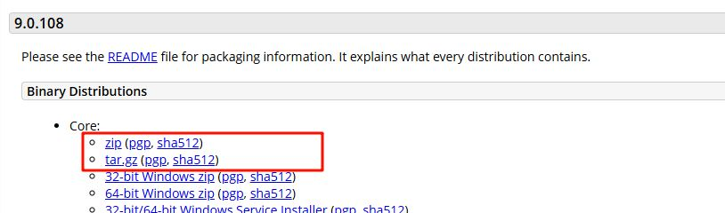

当我们谈到 Java Web 开发，第一个绕不开的就是 **Tomcat**。  
它是由 Apache 基金会维护的开源软件，定位是 **轻量级 Web 服务器**，更准确地说，是一个 **Servlet/JSP 容器**。

在 Web 世界里，服务器的职责并不相同：

- **Web 服务器**（如 Nginx、Apache httpd）：偏重于提供静态资源，例如 HTML、CSS、图片文件。
- **应用服务器**（如 JBoss/WildFly、GlassFish）：完整实现 Jakarta EE （Java EE）规范，功能齐全，能处理事务、消息、远程调用等复杂企业需求。

而 Tomcat 处于两者之间，**只实现 Jakarta EE 中最核心的 Servlet/JSP 部分**。它不追求“大而全”，而是专注于让 Java Web 程序能跑起来。

所以我们称 Tomcat 为 Servlet 容器。它的工作方式很直接：

1. 接收浏览器发来的 HTTP 请求；
2. 根据请求找到对应的 Servlet 程序，并调用其中的方法；
3. 将结果再封装为 HTTP 响应返回给浏览器。

Servlet 程序离开 Tomcat，就无法单独运行。

Tomcat 只实现了 Servlet 与 JSP，足够支持大部分 Web 开发需求。不过其他如 EJB、JMS、JTA 等，需要更重型的应用服务器才能用。

这使它保持了轻量、简单、易用的特性。

# Tomcat 基本使用

Tomcat 的使用非常简单，它是一个“解压即用”的软件，不需要复杂的安装过程。

### 下载与安装

前往 [Tomcat 9 下载页](https://tomcat.apache.org/download-90.cgi)，在页面中找到 **Binary Distributions（二进制发行版）** 区域，这是下载入口。



在该区域的 **Core** 分类下，会列出几种不同的分发格式，直接聚焦我们需要的文件：

- **`zip`** —— 通用压缩包，适合 Windows、macOS、Linux，下载后解压即可使用。
- **`tar.gz`** —— Linux/macOS 常用的压缩格式。

通常推荐选择 **`zip` 包**，方便“绿色版”直接解压使用。如果需要安装为服务运行，可以使用 **Windows Installer**。

如果你需要下载不同版本（例如 Tomcat 8、Tomcat 10），可以在 [Tomcat 官网首页](https://tomcat.apache.org/) 的 **Download** 菜单下找到对应版本的入口：

- [Tomcat 10](https://tomcat.apache.org/download-10.cgi)（支持 Jakarta 命名空间，适配 Spring Boot 3 等新框架）
- [Tomcat 8](https://tomcat.apache.org/download-80.cgi)（老版本，适配较旧的 Servlet/JSP 规范）
- [Tomcat Archive](https://archive.apache.org/dist/tomcat/)（历史归档，包含所有已发布的旧版本）

## 启动、关闭与部署

Tomcat 是“解压即用”的软件，启动和关闭都依赖于 `bin` 目录下的脚本文件。

**Windows 平台**：使用 `.bat` 脚本。

- 启动：双击 `bin/startup.bat`
- 正常关闭：执行 `bin/shutdown.bat`，或在运行窗口中按下 `Ctrl + C`
- 强制关闭：直接关闭命令行窗口（可能导致端口未释放）

**Linux / macOS 平台**：使用 `.sh` 脚本。

- 启动：`bin/startup.sh`
- 关闭：`bin/shutdown.sh`

项目部署后，Tomcat 默认会监控 `webapps/` 目录，：

- **部署 war 包**：将打包好的 `xxx.war` 文件放入 `webapps/` 中，Tomcat 启动时会自动解压并加载。
- **部署目录**：也可以直接将项目目录放入 `webapps/`，效果与 war 包相同。

无论采用哪种方式，只要 Tomcat 成功启动，对应的项目就能通过浏览器访问。

## 配置 Tomcat

- 乱码问题

第一次启动 Tomcat 时，控制台输出一般都会出现中文乱码，通常是日志编码设置不对。
在 `conf/logging.properties` 中，将以下配置行的编码设置为 UTF‑8：

```properties
java.util.logging.ConsoleHandler.encoding = UTF-8
```

这样控制台输出（尤其是中文）就会正常显示，不再乱码。

- 端口占用

若启动 Tomcat 后出现如下错误：

```
java.net.BindException: Address already in use
```

那是因为默认监听的端口（通常是 8080）已被其他程序占用，或者之前的 Tomcat 实例未正常关闭。解决方式有两种：

1. **终止占用端口的进程**  
   Windows 上使用命令查看占用情况，并记下 PID：

   ```bash
   netstat -ano | find "8080"
   ```

   然后打开任务管理器找到该 PID 并结束它。

2. **修改监听端口**  
   打开 `conf/server.xml`，找到 Connector 配置，例如：

   ```xml
   <Connector port="8080" protocol="HTTP/1.1"
              connectionTimeout="20000"
              redirectPort="8443" />
   ```

   将 `port="8080"` 改为如 `9090` 的其他端口，保存文件后重启 Tomcat 即可。

# Servlet 入门

**Servlet** 是运行在 Web 服务器中的小型 Java 程序，是 Java 提供的一种 **动态 Web 资源开发技术**。  
它的工作方式：通过 HTTP 协议接收客户端请求 → 在服务器端处理 → 再返回响应。

在规范层面上，Servlet 属于 **Jakarta EE（原 Java EE）** 的一部分。本质上它只是一个接口：

- 开发者可以 **实现 `Servlet` 接口**，或更常见的是 **继承 `HttpServlet` 类**。
- Servlet 的运行需要依赖 Web 容器（如 Tomcat），容器负责管理 Servlet 的生命周期和调用。

总之，Servlet 不能单独运行，必须交给 Tomcat 这样的容器来调度。

## 实现一个 Servlet

**需求**：编写一个 Servlet，当浏览器访问 `/hello` 时，返回 `"Hello, xxx"`。这里使用的 Tomcat 版本为 11，JDK 17。

### 1. 创建 Maven 项目并引入依赖

在 `pom.xml` 中设置打包方式为 `war`：

```xml
<packaging>war</packaging>
```

添加 Servlet API 依赖，这是给编译器看的 Servlet 接口定义（provided 范围，不会打进包里，运行时由 Servlet 容器提供）：

```xml
<!-- 用 jakarta.servlet-api 6.0，并且 provided -->
<dependency>
    <groupId>jakarta.servlet</groupId>
    <artifactId>jakarta.servlet-api</artifactId>
    <version>6.0.0</version>
    <scope>provided</scope>
</dependency>
```

添加 Servlet API 依赖，这是给编译器看的 Servlet 接口定义（`provided` 范围，不会打进包里，运行时由 Servlet 容器提供）。

> 注意版本和命名空间要和 Tomcat 匹配，否则可能 404 或无法启动：

```xml
<!-- Tomcat 10+ 使用 jakarta.* 命名空间，所以要用 jakarta.servlet-api -->
<dependency>
    <groupId>jakarta.servlet</groupId>
    <artifactId>jakarta.servlet-api</artifactId>
    <version>6.0.0</version> <!-- 对应 Servlet 6.0，适配 Tomcat 11 -->
    <scope>provided</scope>
</dependency>
```

- Tomcat 9 及更早：用 `javax.servlet:javax.servlet-api:4.0.1`（Servlet 4.0，包名是 `javax.servlet.*`）
- Tomcat 10 及以上：必须用 `jakarta.servlet:jakarta.servlet-api:5.x/6.x`（Servlet 5/6，包名换成 `jakarta.servlet.*`）

注意类中的 `import` 也必须匹配。

配置一下 `<finalName>` 就是告诉 Maven 打包出来的文件名。

```xml
<build>
  <finalName>wolfboard</finalName>
</build>
```

- 没有写 `<finalName>`Maven 会默认用 `<artifactId>-<version>`，比如：`wolfboard-1.0-SNAPSHOT.war`
- 写了 `<finalName>wolfboard</finalName>`打包出来的就是 `wolfboard.war`。

访问路径就是

```
http://localhost:8080/wolfboard/hello
```

而不是带版本号的

```
http://localhost:8080/wolfboard-1.0-SNAPSHOT/hello
```

Tomcat 部署时，会用 war 包名作为上下文路径（context path）。手动统一成 `wolfboard`，以后升级版本打包时路径不会乱掉。

### 2. 编写 Servlet 类

定义一个类继承 `HttpServlet`，重写 `doGet` 方法，并通过注解映射访问路径：

```java
public class HelloServlet extends HttpServlet {
    @Override
    protected void doGet(HttpServletRequest req, HttpServletResponse resp)
            throws ServletException, IOException {
        resp.setContentType("text/html; charset=UTF-8");
        String name = req.getParameter("name");
        if (name == null) name = "狼崽";
        resp.getWriter().write("<h1>嗷——欢迎，" + name + "！</h1>");
    }
}
```

在 Servlet 中最常接触的两个对象：

- **`HttpServletRequest`**：请求对象，封装了客户端发来的请求数据（如参数、请求头、URL 等）。
- **`HttpServletResponse`**：响应对象，封装了服务器返回给客户端的数据（如状态码、响应头、响应体）。

容器在调用 `doGet` 或 `doPost` 方法时，会自动把这两个对象传递给我们。

**现代方式：注解映射**

Servlet 3.0 以后可以直接用 `@WebServlet` 注解完成映射，不用再写 `web.xml`，非常方便：

```java
@WebServlet("/hello")
public class HelloServlet extends HttpServlet {
    @Override
    protected void doGet(HttpServletRequest req, HttpServletResponse resp)
            throws ServletException, IOException {
        resp.setContentType("text/html; charset=UTF-8");
        String name = req.getParameter("name");
        resp.getWriter().write("<h1>嗷——欢迎，" + name + "！</h1>");
    }
}
```

这种写法被称为 **“零配置”**，因为不需要再去修改 `web.xml`。

**传统方式：web.xml 配置**

如果不加注解，就要在 `web.xml` 里手动声明和映射 Servlet。`web.xml` 是 Web 应用的 **部署描述符**，放在 `src/main/webapp/WEB-INF/` 下。
Tomcat 启动时会先读它，看看里面写了哪些：

- **Servlet 映射**（URL → 哪个类）
- **过滤器**（Filter 链顺序）
- **监听器**（Listener）
- **欢迎页、错误页、上下文参数**等等

简单说这就是 Tomcat 路由和初始化的“菜单”。

```xml
<web-app xmlns="https://jakarta.ee/xml/ns/jakartaee"
         xmlns:xsi="http://www.w3.org/2001/XMLSchema-instance"
         xsi:schemaLocation="https://jakarta.ee/xml/ns/jakartaee
         https://jakarta.ee/xml/ns/jakartaee/web-app_6_0.xsd"
         version="6.0">

  <!-- 1. 声明Servlet -->
  <servlet>
    <servlet-name>HelloServlet</servlet-name>
    <servlet-class>com.wreckloud.hello.HelloServlet</servlet-class>
  </servlet>

  <!-- 2. 映射URL -->
  <servlet-mapping>
    <servlet-name>HelloServlet</servlet-name>
    <url-pattern>/hello</url-pattern>
  </servlet-mapping>

</web-app>
```

- `<servlet>`：告诉容器有个叫 HelloServlet 的类要托管。
- `<servlet-mapping>`：把 URL `/hello` 交给这个类处理。
- `<url-pattern>`：可以是具体路径，也可以写通配符，比如 `/wolf/*`。

所以，`web.xml` 就是我们告诉 Tomcat：

> “喂，这里有个 Servlet，它的全限定类名是啥，匹配到哪个 URL 时交给它。”

### 3. 打包 & 部署

编写完 Servlet 之后，需要让 Tomcat 能够找到它并运行，这一步叫“部署”。我们先看两种常见做法：

**现代方式：IDEA 直接部署**

在开发阶段，我们更常用 IDEA 直接把项目部署到 Tomcat，这样改完代码就能立刻调试。

1. 打开 **Edit Configurations** → 点击左上角 **+** → 选择 **Tomcat Server → Local**  
   IDEA 会要求你选择 Tomcat 的安装目录，填上 Tomcat 11 的根目录。
2. 在 **Server** 选项卡：

   - 配置好端口（默认 8080，可改成别的避免冲突）
   - 可以设置 JVM 参数、日志输出目录，方便调试

3. 在 **Deployment** 选项卡：

   - 点击 **+** 添加部署，选择 `Artifact`，挑选你项目打出来的 `war` 或 `war exploded`
   - `war exploded` 是解压状态的部署，改了代码可以热更新，非常适合开发调试

4. **Application context**：

   - 这里决定了 URL 的上下文路径，比如填 `/wolfboard`，访问时就是：

```
http://localhost:8080/wolfboard/hello
```

5. 点击运行/调试按钮，IDEA 会自动打包并把项目发布到 Tomcat，再帮你启动服务器。

一键启动、调试方便、改完代码不用手动重启 Tomcat。 不过依赖 IDEA 环境，真正上线还得手动打 war 包。

**传统方式：手动打包 + 拷贝部署**

这种方式更贴近真实生产环境，也能帮你理解 Tomcat 的部署原理。

1. 在项目根目录执行：

   ```bash
   mvn clean package
   ```

   生成的 `wolfboard.war` 会出现在 `target/` 目录下。

2. 拷贝 war 包到 Tomcat 安装目录的 `webapps/` 里：

   ```
   tomcat/
     └── webapps/
          └── wolfboard.war
   ```

3. 启动 Tomcat：

   - Windows：`bin/startup.bat`
   - Linux/Mac：`bin/startup.sh`

   Tomcat 会自动解压 war 包成同名文件夹，并把里面的 `web.xml` 读出来，注册你的 Servlet。

4. 访问：

   ```
   http://localhost:8080/wolfboard/hello
   ```

5. 如果需要更新，只要重新打包、替换 war，再重启 Tomcat 即可。

跟生产环境一致，容易部署到服务器。 不过每次都要手动打包+替换+重启，开发阶段效率较低。

### 4. 访问

当我们完成代码编写、配置并启动 Tomcat 后，就可以在浏览器中访问 Servlet。  
例如：

```
http://localhost:8080/servlet-demo/hello?name=Wreckloud
```

这个 URL 可以拆解为：

- `http` → 使用的协议
- `localhost` → 服务器地址（本机）
- `8080` → Tomcat 默认端口
- `/servlet-demo` → Web 应用的上下文路径（Application Context）
- `/hello` → Servlet 的访问路径（由 `@WebServlet("/hello")` 指定）
- `?name=Wreckloud` → 请求参数

## 容器的处理过程

1. **Tomcat 接收请求**  
   浏览器发送请求后，Tomcat 作为 Servlet 容器会先接收并解析请求。
2. **定位 Servlet**  
   容器根据 URL 中的访问路径（如 `/hello`），找到对应的 Servlet 类。
3. **调用方法**

   - 如果请求方式是 **GET**，容器会调用该类的 `doGet()` 方法。
   - 如果请求方式是 **POST**，则调用 `doPost()` 方法。
   - 其他如 DELETE、PUT 等，对应调用 `doDelete()`、`doPut()`。

4. **执行逻辑并生成响应**  
   Servlet 方法内部会处理请求数据，并通过 `HttpServletResponse` 对象将结果写回。
5. **Tomcat 返回响应**  
   容器将响应数据封装成标准的 HTTP 响应报文，返回给浏览器。

一句话概括：

```
浏览器请求 → Tomcat 接收并解析 → 找到目标 Servlet → 调用相应方法(doGet/doPost...) → 返回响应
```

## 统一编码过滤器

**目的**：统一处理**请求体编码**与**响应的 Content-Type/字符集**，避免中文乱码与各处重复配置。

### 1. 编写 Filter 类

在前面的 `HelloServlet` 里我们写过：

```java
resp.setContentType("text/html; charset=UTF-8");
```

这句话分两半的含义：

- `text/html`：告诉浏览器响应是 HTML（MIME 类型）。
- `charset=UTF-8`：告诉浏览器响应的文本编码是 UTF-8。

把这句写在每个 `doGet/doPost` 里当然可行，更稳的做法是使用 Filter：所有请求先进过滤器，统一入口设置好请求与响应的编码策略；需要特殊类型（比如 JSON、文件下载）时，再在具体 Servlet 里覆盖。

```java
public class CharacterEncodingFilter implements Filter {

    @Override
    public void doFilter(ServletRequest request, ServletResponse response, FilterChain chain)
            throws IOException, ServletException {

        // 请求体编码（POST/JSON）
        request.setCharacterEncoding("UTF-8");

        // 响应头默认值（文本类内容用 UTF-8）
        HttpServletResponse resp = (HttpServletResponse) response;
        if (resp.getContentType() == null) {
            resp.setContentType("text/html; charset=UTF-8");
        }

        // 放行：没有这句，请求就卡死在门口
        chain.doFilter(request, response);
    }
}
```

我们通过实现接口 `jakarta.servlet.Filter`，让过滤器像一扇“门神”，所有请求和响应在到达或离开目标 Servlet 之前，都会先经过它。

过滤器有三个生命周期方法：

| 方法         | 触发时机           | 作用                                             | 必要性   |
| ------------ | ------------------ | ------------------------------------------------ | -------- |
| `init()`     | 应用启动时调用一次 | 读取参数、预热资源                               | 可选     |
| `doFilter()` | 每次请求都会执行   | 核心处理逻辑；**必须调用 `chain.doFilter`** 放行 | **必须** |
| `destroy()`  | 应用停止或卸载时   | 释放资源                                         | 可选     |

因此，只要实现 `doFilter` 就能让过滤器工作，`init` 和 `destroy` 按需补充即可。

**现代方式：注解注册**

同样在 Servlet 3.0 以后可以直接用 `@WebFilter` 注解完成注册，不用再写 `web.xml`，非常方便：

```java
@WebFilter("/*")
public class CharacterEncodingFilter implements Filter {
    @Override
    public void doFilter(ServletRequest request, ServletResponse response, FilterChain chain)
            throws IOException, ServletException {
        request.setCharacterEncoding("UTF-8");

        // 兼容 JDK 8+的写法
        HttpServletResponse resp = (HttpServletResponse) response;
        if (resp.getContentType() == null) {
            resp.setContentType("text/html; charset=UTF-8");
        }

        // 如果项目语言级别是 16+，也可以用 instanceof 模式变量更简洁
        /*
        if (response instanceof HttpServletResponse resp) {
            if (resp.getContentType() == null) {
                resp.setContentType("text/html; charset=UTF-8");
            }
        }
        */

        chain.doFilter(request, response);
    }
}
```

**传统方式：web.xml 配置**

如果不加注解，就要在 `web.xml` 里手动声明和映射 Filter。

```xml
<web-app xmlns="https://jakarta.ee/xml/ns/jakartaee"
         xmlns:xsi="http://www.w3.org/2001/XMLSchema-instance"
         xsi:schemaLocation="https://jakarta.ee/xml/ns/jakartaee
         https://jakarta.ee/xml/ns/jakartaee/web-app_6_0.xsd"
         version="6.0">

  <!-- 1. 声明 Filter -->
  <filter>
    <filter-name>CharacterEncodingFilter</filter-name>
    <filter-class>com.wreckloud.filter.CharacterEncodingFilter</filter-class>
  </filter>

  <!-- 2. 映射路径 -->
  <filter-mapping>
    <filter-name>CharacterEncodingFilter</filter-name>
    <url-pattern>/*</url-pattern>
  </filter-mapping>

</web-app>
```

- `<filter>`：告诉容器有个 Filter 类要托管。
- `<filter-mapping>`：配置它拦截哪些 URL，这里是全局 `/*`。

总之在 Servlet 3.0 以后，都可以通过对应的注解来省去配置 `web.xml` 的过程，非常方便。

### 2. 准备前端页面

我们需要一个最简单的前端页面，放在 `src/main/webapp/index.html`，用来提交表单到服务器：

```html
<!DOCTYPE html>
<html lang="zh">
<head><meta charset="UTF-8"><title>表单测试</title></head>
<body>
<form action="echo" method="post">
  <label>说点什么：<input type="text" name="msg"></label>
  <button type="submit">提交</button>
</form>
</body>
</html>
```

HTML 的 `<form>` 标签就是定义一个表单，我们使用了两个常用的属性：

- `action`：提交目标（请求的 URL）
- `method`：提交方式，常见值：
  - `get`：参数拼在 URL 后面，适合查询。
  - `post`：参数放在请求体里，适合提交表单数据。

这里写：`action="echo" method="post"` ，表示当用户点“提交”时，浏览器会向服务器发一个 **POST 请求**，目标路径是 `/echo`， 这是我们待会要定义的类，来处理 POST 请求。

### 3. 编写 EchoServlet 处理 POST 请求

前端表单已经能发请求了，现在我们要写一个后端 Servlet 来接住它，同样使用注解而不去配置繁琐的 xml，新建类：

```java
@WebServlet("/echo")
public class EchoServlet extends HttpServlet {

    @Override
    protected void doPost(HttpServletRequest req, HttpServletResponse resp)
            throws ServletException, IOException {

        // 1. 取出表单字段
        String msg = req.getParameter("msg");

        // 2. 设置响应类型
        resp.setContentType("text/html; charset=UTF-8");

        // 3. 回显给浏览器
        resp.getWriter().write("<h2>你刚才说：" + msg + "</h2>");
    }
}
```

我们重写 `doPost()` 处理 POST 请求，直接用注解 `@WebServlet("/echo")` 完成映射，当浏览器访问 `/echo` 时，Tomcat 就会调用这个类。

### 运行测试

1. 启动 Tomcat，访问 `http://localhost:8080/wolfboard/index.html`
2. 输入任意内容 → 点击提交
3. 浏览器跳转到 `/echo`，页面显示：

```
你刚才说：狼崽最帅！
```

说明前端表单 + 后端 Servlet 已经打通。
