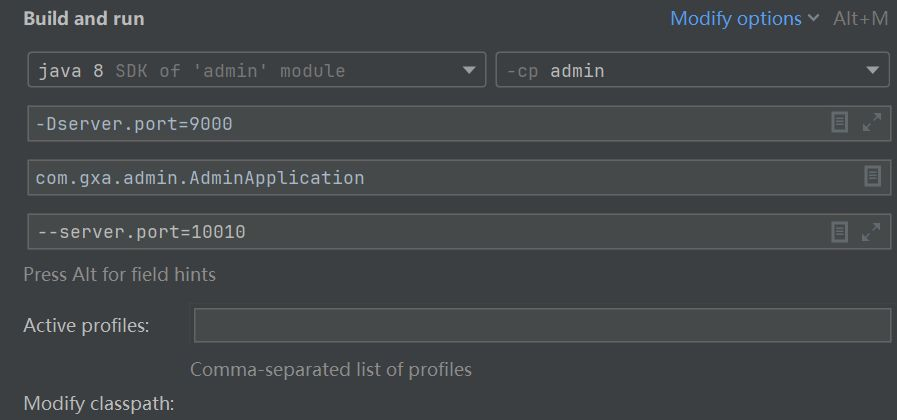
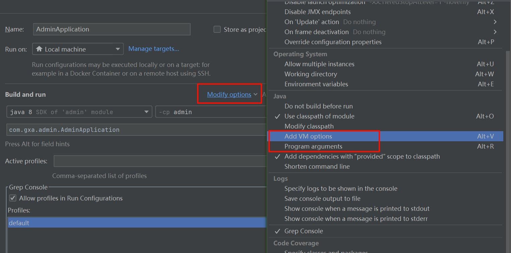

约定大于配置

# 配置优先级

SpringBoot中支持三种格式的配置文件：
application.properties 第一
server.port=8081
application.yml 第二
server:
port: 8082
application.yaml 第三
server:
port: 8083

虽然springboot支持多种格式配置文件，但是在项目开发时，推荐统一使用一种格式的配置(yml是主流）。

pringBoot除了支持配置文件属性配置，还支持Java系统属性和命令行参数的方式进行属性配置。

》Java系统属性 -D开头
-Dserver.port=9000

1命令行参数 --开头
-server.port=10010



在idea配置 打开 Run?debug configiurations, 配置, 如果没有, 点击Modify option
勾选这两项



这五个配置, 的先后顺序. 是啥?


为什么要这个呢? 比如同事跟你不在一个局域网, 也想要测试, 总不可能让别人也安装一个idea. 我们可以执行maven的pacakaeg, 例如我们写完了wolfpack, 打包成wolfpack snapov1(乱写的, 请帮我纠正).jar然后他执行这个指令

```
Java -jar 名字
```

然后前端让你换端口, 你不在本身就是休假了, 你还要打开idea, 改配置? 
这个就能在控制台改, 想换啥就换啥 >java -jar -Dserver.port=9999

剋用来临时的测试方式.


意：Springboot项目进行打包时，需要引l入插件spring-boot-maven-plugin（基于官网骨架创建项目，会自动添加该插件）
如果遇到 没有主清单属性, lias-web-manager-0.0.1-SNAPSHOT.jar中没有主清单属性 就是pom里没有:
plug
```
<build>
<plugins>
<!--maven打包插件-
Tplugin>
<groupId>org.springframework.boot</groupId>
<artifactId>spring-boot-maven-plugin</artifactId>
<configuration>
```
# Bean 管理

在前面讲 就是在容器管理的对象. 我们在类的上面加@Component来让容器管理.
还有conmponet的yanshengzhujie,controller serverce. 
Bean还有别的用法,比如手动获取 作用域


### 获取bean

默认情况下，Spring项目启动时，会把bean都创建好放在Ioc容器中。如果要获取到容器对象，可以通过如下方式：
@Autowired
private ApplicationContext applicationContext;

拿到这个对象就能调用api了

如果想要主动获取道些bead可以通过如下方式：
1．根据name获取bean: Object getBean(String name) bean默认名字就是类命小写

示例代码和打印输出的结果

2。根据类型获取bean:<T>T getBean(Class<T> requiredType)
3．根据name获取bean（带类型转换）<T>T getBean(String name,Class<T> requiredType)

观察到他们拿到的地址是一致的, 所以默认是单例的.


在IDEA中， 点击Actuator就能查看spring容器的bean， 高版本需要点击一下得到依赖

### bean作用域

刚刚提到获取到的bean是单例, 当然也支持配置
Spring支持五种作用域，
singleton容器内同名称的bean只有一个实例（单例）（默认）
prototype每次使用该bean时会创建新的实例（非单例）

不过其实大部分情况都不会改的

后三种在web环境才生效：
作用域说明
request每个请求范围内会创建新的实例（web环境中，了解）
session每个会话范围内会创建新的实例（web环境中，了解）
application每个应用范围内会创建新的实例（web环境中，了解）

(具体的配置方法)在controller上
@Scope("prototype")
@RequestMapping("/depts")
@RestController
public class Deptcontroller
注意1:默认singleton的bean，在容器启动时被创建，可以使用aLazy注解来延迟初始化（延迟到第一次使用时）。

非延迟加载 就是你启动程序的时候他就会吧这个bena创建出来. 

women启动spring的时候挺慢的, 就是因为他底层在初始化很多bean对象 用默认值就够了, 所以没什么用(( ))
A注意2：prototype的bean，每一次使用该bean的时候都会创建一个新的实例。
注意3：实际开发当中，绝大部分的Bean是单例的，也就是说绝大部分Bean不需要配置scope属性。


### 循环依赖

什么是循环依赖, 举例

如果是先版本的springboot, 运行起来控制台会说:
Description:
The dependencies of some of the beans in the application context form a cycle:

Action:
Relying upon circular referencesTis discouraged and they are prohibited by default. Update your application to remove the dependency cycle
between beans. As a last resort，it may be possible to break the cycle automatically by setting spring.main.allow-circular-references to
true.

意思是说

解决方法方法
1. 删除B的依赖注入, 但是我们本来引入就是要使用B啊, 治标不治本

2. 上面还写了一种方案, 在配置文件里配置属性 allow-circular-references


3. 还有一种是@lazy ,在依赖循环注入上作用,也能解决
 在两边其中的一边加上就行 @Service
public class ServiceA {
@Lazy//解决循环依赖问题
@Autowired
private ServiceB serviceB;
public void add(){
serviceB.getById();

虽然有解决方式, 但是平时写的时候我们还是应该避免循环依赖

### 第三方bean

不是自己写的, 也不是spring的 其他框架的.

例如, 我们准备一个xml对象,
(xml对象)

然后来一个依赖, 就可以解析他了
```
<!--Dom4j-->
<dependency>
<groupId>org.dom4j</groupId>
<artifactId>dom4j</artifactId>
<version>2.1.3</yersion>
</dependency>
```

SAXReader 对象就能解析xml对象.

public_void testThirdBean()throws Exception{
SAKReader saxReader=new SAXReader();
Document document = saxReader.read(this.getClass().getClassLoader().getResource(name:"1.)
Element rootElement = document.getRootElement();
String name = rootElement.element( name:"name").getText();
String age = rootElement.element( name: "age").getText();
System.out.println(name +"+age）；

之前是这么用的, 自己niwe对象, 那我们学springbot不就是不想自己new?

尝试在@Autowired
private SAxReader saxReader;
发现爆红了, 空指针

这种就是第三方的. 
如果要管理的bean对象来自于第三方（不是自定义的），是无法用@Component及衍生注解声明bean的，就需要用
到@Bean注解。
若要管理的第三方bean对象，建议对这些bean进行集中分类配置，可以通过aConfiguration注解声明一个配置类。

启动类（不推荐）
@SpringBootApplication
public class SpringbootWebConfigApplication{
@Bean//将方法返回值交给Ioc容器管理，成为Ioc容器的bean对象
public SAXReader saxReader(）{
return new SAXReader();

配置类（推荐）
aConfiguration
public class CommonConfig{
@Bean
public SAxReader saxReader(){
return new SAXReader();

配置完成发现@Autowired
private SAxReader saxReader;不报错了

通过aBean注解的name或value属性可以声明bean的名称，如果不指定，默认bean的名称就是方法名。
如果第三方bean需要依赖其它bean对象，直接在bean定义方法中设置形参即可，容器会根据类型自动装配。

# 起步依赖原理

spring framework 配置繁琐，springboot就是为了简化配置，快速搭建。约定大于配置。

为甚摸这么快捷
1.起步以来
2.自动装配

### 起步依赖

springfamework要引入一大堆依赖， 而springboot引入，起步就可以了， 起步依赖就包含了那些必须的依赖， 因为以来具有传递性。

pringBoot中，为什么引l入了起步依赖，其他相关依赖都有了？
·起步依赖的原理是Maven的依赖传递

### 自动装配

这个才是boot的重中之重

自动配置
SpringBoot的自动配置就是当spring容器启动后，一些配置类、bean对象就自动存入到了Ioc容器中，不需要我们
手动去声明，从而简化了开发，省去了繁琐的配置操作。

为什么可以这样呢？

#### 实现方案

自动配置实现方案一
使用aComponentScan组件扫描注解，手动扫描引入的第三方依赖中的bean。
o
@ComponentScan({"com.example","com.itheima"})
@SpringBootApplication
public class SpringbootwebConfigApplication {

但是这种方式一旦引入大量依赖， 数组就会很长， 使用繁琐 性能低


自动配置实现方案二这种是重点。
●方案二：@Import导入。使用aImport导入的类会被Spring加载到Ioc容器中，导入形式主要有以下几种：
1。导入普通类
2.导入配置类
3。导入ImportSelector 接口实现类

最终的 EnableXxxx注解，封装@Import注解解

什么第三方依赖中使用@component及其衍生注解声明bean不生效？
·基于aComponent及其衍生注解声明的bean要想生效，需要被组件扫描注解扫描到。
2.有哪些方案可以使其生效呢？
a。通过aComponentScan注解扫描指定的包
b.通过aImport注解将其导入到Ioc容器中（四种常见方式）

普通类、配置类、ImportSelector实现列、@EnableXxx


#### 源码跟踪

怎么阅读源码，找到主线， 找到入口。经验之谈，因为你第一次看你也不知道那个是主线

自动配置-源码跟踪
@SpringBootApplication
public class SpringbootWebConfigApplication{
public static void main(String[]rgs）{
SpringApplication.run(SpringbootWebConfigApplication.class，args);

@SpringBootApplication是核心， 最最最神奇的注解， 点进去发现他是一个复合注解
@SpringBootConuration
@EnableAutoConfiguration
@ComponentScan(excludeFilters=@Filter(type =FilterType.CUSTOM，classes=TypeExcludeFilter.class)，
@Filter(type =FilterType.CUSToM，classes =AutoConfigurationExcludeFilter.class)})
public@interface SpringBootApplication

该注解标识在SpringBoot工程引导类上，是SpringBoot中最最最重要的注解。该注解由三个部分组成：
1.aSpringBootConfiguration：该注解与@Configuration注解作用相同，用来声明当前也是一个配置类。
2.aComponentScan：组件扫描，默认扫描当前引导类所在包及其子包。
3.@EnableAutoConfiguration：SpringBoot实现自动化配置的核心注解。


这其中重要的又是 @EnableAutoConfiguration， 点开看看
@AutoConfigurationPackage
@Impor(AutoConfigurationImpoector.class)
public@interface EnableAutoConfiguration{
发现 全类名， 在META-INF/spring/org.springframework.lNot.autoconfigure.AutoConfiguration.imp
spring在这个文件里提前准备了一些依赖。

在低版本（2.7.o以前)的springboot中，自动配置类（XxxAutoConfiguration)是定义在spring.factories文件中。

不过这里有152个依赖， 我们使用的时候会全都使用吗？ 
不会， 因为还有条件注解，只有满足一些条件才会被加载

#### 条件注解

condition打头的就是

自动配置原理-@Conditional
●作用：按照一定的条件进行判断，在满足给定条件后才会注册对应的bean对象到SpringIOc容器中。
●位置：方法、类
+aConditional本身是一个父注解，派生出大量的子注解：
@ConditionaLOnClass：判断环境中是否有对应字节码文件，才注册bean到Ioc容器。
@ConditionaLOnMissingBean：判断环境中没有对应的bean（类型或名称），才注册bean到Ioc容器。
@ConditionaLonProperty：判断配置文件中有对应属性和值，才注册bean到Ioc容器。

当然还有很多， 不过大体上也是跟上面的注解差不多

@Bean
aConditionalonClass（name="io.jsonwebtoken.Jwts"）//当前环境存在指定的这个类时，才声明该bean
public HeaderParser headerParser(){...}
@Bean
aConditionalonMissingBean//当不存在当前类型的bean时，才声明该bean
public HeaderParser headerParser(){...}
。
@Bean
aConditionalonProperty（name="name"，havingValue="itheima"）//配置文件中存在对应的属性和值，才注册bean到Ioc容器
public HeaderP通Java147