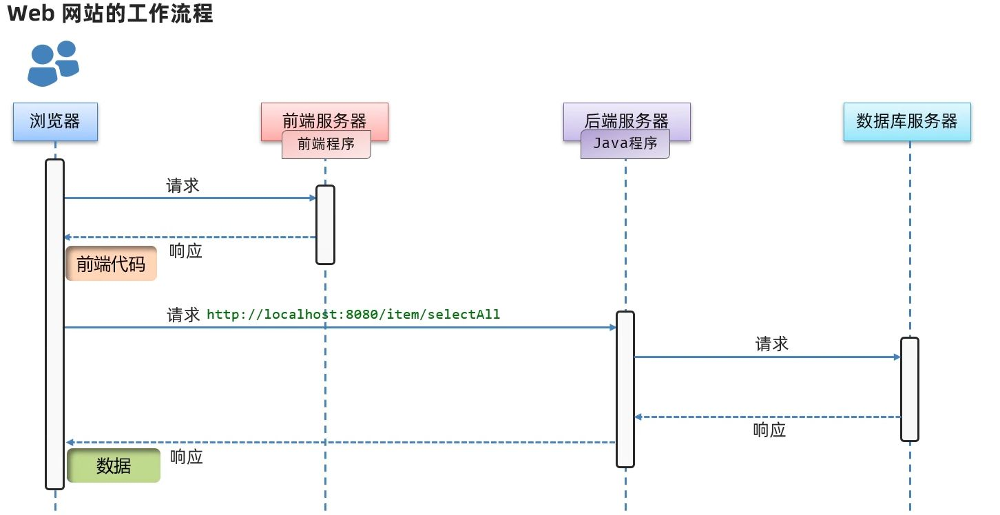
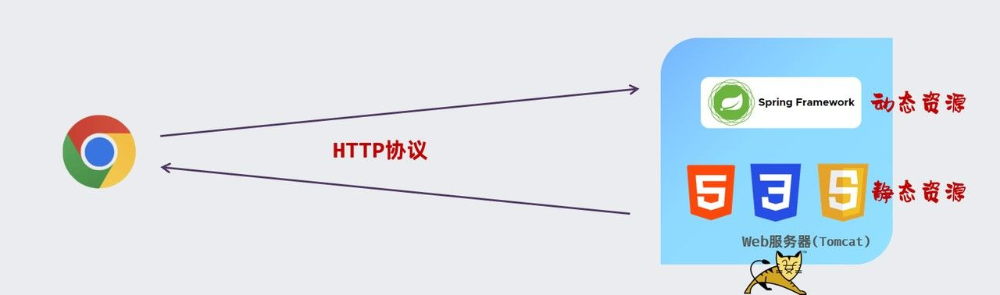

# 序

**Web（万维网，World Wide Web）**，指的就是我们能在浏览器里访问到的网站。  
无论是淘宝的商品页、B 站的视频，还是知乎的问答，点开就能看到页面、文字、图片、视频，这些都属于 Web。

Web 建立在互联网之上，它让信息不只是“在网上传输”，而是以页面的形式**可视化、可交互**。  
当你输入一个网址（URL），按下回车，立刻跳出一个页面，这就是 Web 的直观体验。

但在背后，能让这个页面出现并正常运行，其实依赖的是一整套技术结构——这就是我们要聊的：

# Web 网站结构

一个 Web 网站的核心，可以拆成三部分：

- **前端程序**：把数据用好看的界面呈现给用户。
- **后端/服务端程序**：处理具体的业务逻辑。
- **数据库**：存储和管理数据。

当你在浏览器地址栏输入 URL 并敲下回车：

1. **首先访问到的是前端程序**，它负责页面的展示，但数据本身并不在这里。
2. 前端会发送请求，去找 **后端程序**。
3. 后端从 **数据库** 查询到真实的数据，再返回给前端。
4. 前端拿到数据后渲染页面，由浏览器解析并展示给你。

这种流程，就是现代常见的 **前后端分离开发模式**。

# Web 前端

前端的使命很直接：**把数据以直观、美观、可操作的方式展示给用户**。

前端开发最核心的“三件套”是：

- **HTML**：网页的**骨架**，决定内容的结构，比如文字、图片、按钮放在哪。
- **CSS**：网页的**外衣**，决定外观的样式，比如颜色、字体、布局。
- **JavaScript**：网页的**大脑**，赋予交互逻辑，比如点击按钮后弹出提示、表单动态校验。

三者结合，就能从“纯文字”搭建出一个既有外形、又能动起来的网页。

另外，随着网站越来越复杂，前端也进化出了许多新工具：

- **Ajax**：让网页能在不刷新整个页面的情况下向后端请求数据，实现“无感加载”。
- **框架（Vue、React 等）**：把复杂页面拆分成模块，让开发更高效、更可维护。
- **UI 框架（Element Plus、Tlias 等）**：提供现成的组件库，像搭积木一样快速拼出按钮、表单、弹窗。

# Web 后端

Web 后端开发，主要负责处理前端发送的请求、执行业务逻辑、与数据库交互以及管理服务器.
后端是网站和应用程序的"指挥官"，它处理着数据的存储、检索和业务逻辑。

后端的主要职责：

- 接收并处理前端的请求（比如登录、下单）。
- 执行业务逻辑（验证账号、生成订单）。
- 读取或更新数据库中的数据。
- 把处理结果返回给前端。

用户日常访问的网页内容，大致分两类：

- **静态资源**：写死的内容，比如 HTML、CSS、JS、图片、音视频。无论谁访问，结果都一样。
- **动态资源**：根据请求实时生成的内容，比如个性化推荐、订单详情，每个人看到的可能都不同。

早期 Java 后端常用 **Servlet、JSP** 来处理动态资源，如今这些基本已经退出舞台。  
现代企业开发的主角是 **Spring 框架**，它帮我们更高效、更优雅地管理请求和业务逻辑。

这些后端程序最终会部署在 **Web 服务器**（比如 Tomcat）上，对外提供服务。  
浏览器与服务器的交流，主要依赖

> HTTP 协议

——这就是 Web 世界里数据传输的通用规则。

# BS 架构 vs CS 架构

在谈网站系统时，我们其实是在讨论一种**架构模式**。

- **BS 架构**（Browser/Server）：用户只需要一个浏览器，就能直接访问服务器上的资源和服务，无需额外安装软件。大多数现代网站和系统都是基于 BS 的。

而相对的还有：

- **CS 架构**（Client/Server）：客户端—服务器架构。  
  用户需要专门下载安装客户端程序来访问服务，比如早期的软件系统、QQ PC 版等。

# 末

Web 就是浏览器访问的万维网世界，它由前端、后端和数据库构成，前端负责展示，后端负责处理，数据库负责存储，一起合作，让我们得以看到和使用各种网站服务。

如果想学习 Web 开发，前端三件套是起点，而了解整个 Web 的工作流程，是打基础的第一步。
