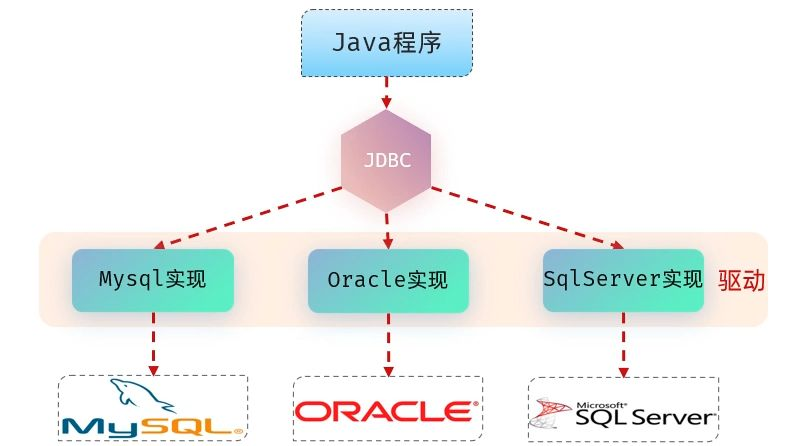

# JDBC 入门

在 Java 中操作数据库的方式有很多，而最底层、最核心的一种就是 **JDBC**。  
JDBC（**Java DataBase Connectivity**）是由 Sun 公司制定的一套 **统一规范**，主要体现在 `java.sql` 和 `javax.sql` 这两个包中。本质上，它只是一组定义了如何操作关系型数据库的 **接口 API**。

接口本身不带实现，各大数据库厂商（如 MySQL、Oracle、SQL Server）会根据这套规范提供各自的 **驱动 jar 包**。

所以，开发者写的 JDBC 程序只是调用接口，真正与数据库打交道、执行 SQL 的工作，其实是由 **驱动包中的实现类**来完成的。



换句话说：

- Sun 定义了规范；
- 驱动厂商提供实现；
- 我们调用接口，驱动来“翻译”并执行。

既然驱动如此关键，下面就看看获取驱动的两种最稳定方式：

1. **Maven/Gradle 依赖管理**  
   如果你的项目用 Maven 或 Gradle 管理依赖，直接在 `pom.xml` 或 `build.gradle` 里添加依赖即可，自动从中央仓库下载，安全又省心。  
   Maven 示例：

```xml
<dependency>
  <groupId>mysql</groupId>
  <artifactId>mysql-connector-java</artifactId>
  <version>8.0.33</version>
</dependency>
```

Gradle 示例：

```groovy
implementation 'mysql:mysql-connector-java:8.0.33'
```

这样不用手动下载，版本也能随时切换。

2. **MySQL 官方网站**  
   如果你需要手动下载 jar 包，建议直接去 MySQL 官网：[MySQL Connector/J 官方下载页](https://dev.mysql.com/downloads/connector/j/)

选择对应版本，下载 Platform Independent 的 zip 包，解压后里面就有 `mysql-connector-java-x.x.xx.jar` 文件。

## 使用 JDBC

在引入了依赖以后，JDBC 的用法套路固定，基本流程就是：

```
注册驱动 → 建立连接 → 执行 SQL → 处理结果 → 释放资源。
```

来看个最基础的示例：

```java
// 1. 注册驱动
Class.forName("com.mysql.cj.jdbc.Driver");

// 2. 获取数据库连接
Connection conn = DriverManager.getConnection(
    "jdbc:mysql://localhost:3306/jdbc?useUnicode=true&characterEncoding=utf-8",
    "root", "root"
);

// 3. 创建 PreparedStatement 对象（使用 ? 占位符）
String sql = "select * from user where id = ?";
PreparedStatement ps = conn.prepareStatement(sql);
ps.setInt(1, 1); // 设置第 1 个占位符的值

// 4. 执行 SQL 查询
ResultSet rs = ps.executeQuery();

// 5. 处理查询结果
if (rs.next()) {
    System.out.println(rs.getInt("id"));
    System.out.println(rs.getString("username"));
    System.out.println(rs.getString("password"));
}

// 6. 释放资源
rs.close();
ps.close();
conn.close();
```

先加载驱动，再连数据库，写 SQL 查数据，最后别忘了把用过的资源都关掉。

### 注册驱动

注册驱动的方式如下：

- 传统写法（过时，不推荐）：

  ```java
  DriverManager.registerDriver(new com.mysql.jdbc.Driver());
  ```

  这种方式容易导致驱动被注册两次，还强依赖具体驱动类，不够灵活。

- 一般写法：

```java
// MySQL 5.x 老版本常见写法
Class.forName("com.mysql.jdbc.Driver");

// MySQL 8.x 之后的正确类名
Class.forName("com.mysql.cj.jdbc.Driver");
```

这种方式用类加载机制自动注册驱动，简单又解耦。写了能确保驱动一定被加载，不会翻车。

- 现代写法：

不过在使用 Maven/Gradle 的项目中，其实可以什么都不写，驱动会通过 **SPI 机制** 自动注册。但写上 `Class.forName(...)` 更直观、也更保险。

### 连接数据库

获取连接的标准写法是：

```java
Connection conn = DriverManager.getConnection(
    "jdbc:mysql://localhost:3306/db_demo?useSSL=false&serverTimezone=UTC",
    "root", "password"
);
```

URL 结构一般是：

```
jdbc:数据库类型://IP:端口/数据库名?参数
```

以 MySQL 为例，不同版本的连接 URL 写法略有区别，下面是两个常见版本的示例：

**MySQL 5.1 常用连接写法：**

```java
String url = "jdbc:mysql://localhost:3306/db_demo?useUnicode=true&characterEncoding=utf-8";
```

这种写法适用于 MySQL 5.x，参数主要用于设置字符集，保证中文不乱码。

**MySQL 8.0 常用连接写法：**

```java
String url = "jdbc:mysql://localhost:3306/db_demo?useSSL=false&serverTimezone=UTC&characterEncoding=utf-8";
```

MySQL 8.x 之后，官方要求加上 `serverTimezone`（时区）参数，否则容易报错。`useSSL=false` 用于关闭 SSL 警告，`characterEncoding=utf-8` 依然是设置字符集。

### 使用 PreparedStatement

`PreparedStatement` 是 JDBC 中推荐使用的 SQL 执行对象。常用方法有：

- `executeUpdate()`：执行 `insert`、`update`、`delete`，返回影响的行数
- `executeQuery()`：执行 `select`，返回结果集 `ResultSet`

```java
String sql = "select * from user where id = ?";
PreparedStatement ps = conn.prepareStatement(sql);
ps.setInt(1, 1); // 设置第 1 个 ? 占位符的值

ResultSet rs = ps.executeQuery();
while (rs.next()) {
    System.out.println(rs.getInt("id"));
    System.out.println(rs.getString("username"));
    System.out.println(rs.getString("password"));
}
```

先准备 SQL 模板，再绑定参数，最后执行并处理结果。

## API 详解

以上我们已经跑通了一个最基础的 JDBC 流程。不过光会“用”还不够，如果想写得更稳、更灵活，就需要对几个核心 API 的作用和细节有更清楚的认识。

### DriverManager

`DriverManager`（驱动管理器）在 JDBC 中主要承担两个职责：

- 注册驱动：负责“登记”有哪些数据库驱动
- 获取连接：帮我们“要一条通道”去连数据库

**注册驱动**

驱动是厂商提供的 jar 包（比如 `mysql-connector-java`）。JDBC 要用它，就得先告诉 DriverManager：  
“我这里有个 MySQL 驱动，记住它！”

传统做法是直接写：

```java
DriverManager.registerDriver(new com.mysql.cj.jdbc.Driver());
```

意思就是：手动注册。但这样写麻烦，而且可能导致重复注册。

于是更常见的写法是：

```java
Class.forName("com.mysql.cj.jdbc.Driver");
```

这行代码不是在“创建对象”，而是在“加载类”。当驱动类被加载时，它里面的 **静态代码块** 会自动调用 传统的写法，帮你完成注册。

再往现代一点（MySQL 8.x + Maven/Gradle），连这行都可以直接不写，因为 jar 包里用了 **SPI 机制**。  
SPI 就像一个“自动登记簿”，只要驱动 jar 在 classpath 里，JVM 启动时就能发现并注册，不用我们管。

**获取连接**

驱动注册完了，接下来我们就能向 DriverManager 要一条通道（Connection）：

```java
Connection conn = DriverManager.getConnection(url, user, password);
```

- **url**：告诉它你要连哪个数据库。
- **user / password**：数据库用户名和密码。

url 的写法有规律：

```
jdbc:mysql://ip地址:端口号/数据库名?参数
```

举例：

- 最完整写法：

```
  jdbc:mysql://localhost:3306/test?useSSL=false&serverTimezone=UTC
```

- 如果数据库就在本机，端口是默认的 3306，还能写成简洁版：

```
  jdbc:mysql:///test
```

### Connection & Statement

在 JDBC 里，**Connection** 表示一次数据库连接。它不仅仅是“通道”，还负责帮我们创建各种执行 SQL 的对象。通过 Connection 可以获得执行 SQL 的对象：

常见的有两种：

1. **Statement**：用于执行普通 SQL
2. **PreparedStatement**：用于执行预编译 SQL（推荐）

```java
// 普通执行对象
Statement st = conn.createStatement();

// 预编译执行对象
PreparedStatement ps = conn.prepareStatement("select * from user where id=?");
```

`Statement` 适合写一些简单的 SQL 直接执行，常见方法有：

- `executeUpdate(sql)`：执行 `insert`、`update`、`delete` 等更新操作，返回受影响的行数
- `executeQuery(sql)`：执行 `select` 查询，返回 `ResultSet` 结果集

示例：

```java
Statement st = conn.createStatement();
ResultSet rs = st.executeQuery("select * from user");
```

### ResultSet

执行查询语句后，返回的结果会被封装在 `ResultSet` 对象中。你可以把它理解为一个“数据表游标”，用来逐行读取查询结果。

常用方法：

**`next()`**：将光标移动到下一行，并判断是否还有数据。

- 返回 `true`：当前位置有效，有数据。
- 返回 `false`：没有更多数据。

**`getXxx(...)`**：获取当前行的字段值。

- 可以通过 **列名** 获取（推荐）。
- 也可以通过 **列的编号** 获取（从 1 开始计数）。

例如模拟根据用户名和密码查询用户信息

```java
String sql = "select * from user where username=? and password=?";
PreparedStatement ps = conn.prepareStatement(sql);
ps.setString(1, "wolf");
ps.setString(2, "123456");

ResultSet rs = ps.executeQuery();

// 遍历结果集
while (rs.next()) {
    // 通过列名获取
    int id = rs.getInt("id");
    String username = rs.getString("username");
    String password = rs.getString("password");
    String name = rs.getString("name");
    int age = rs.getInt("age");

    User user = new User(id, username, password, name, age);
    System.out.println(user);
}
```

这样我们就能把查询结果一行行取出，封装成 Java 对象，完成模拟登录的操作。

### PreparedStatement

`PreparedStatement` 的作用是：**预编译 SQL 语句并执行**。  
它相比 `Statement` 的最大优势有两个：

1. **安全**：能防止 SQL 注入
2. **高效**：SQL 会被预编译和缓存，性能更好

所谓 SQL 注入，就是攻击者通过构造特殊输入，改变了原本 SQL 的语义。

举个例子：

如果直接把表单数据拼接进 SQL：

```java
String sql = "select * from emp where username='" + uname +
             "' and password='" + pass + "'";
```

正常情况下，输入 `uname=wolf`，`pass=123456`，SQL 是安全的：

```sql
select * from emp where username='wolf' and password='123456'
```

但黑客可能输入：

```
uname = wolf
pass = ' or '1'='1
```

拼接后变成：

```sql
select * from emp where username='wolf' and password='' or '1'='1'
```

由于 `'1'='1'` 永远为真，这样不论密码是什么都能“登录成功”。  
这就是典型的 SQL 注入攻击。

**PreparedStatement 如何防注入？**

用 `PreparedStatement` 时，SQL 里不再直接拼接字符串，而是用 `?` 占位：

```java
PreparedStatement ps = conn.prepareStatement(
    "select * from emp where username=? and password=?"
);
ps.setString(1, uname);
ps.setString(2, pass);
ResultSet rs = ps.executeQuery();
```

这样做的关键是：

- **SQL 模板会先被编译**
- **参数会被当作纯粹的值绑定进去**（即使输入里带 `'or '1'='1` 这样的内容，也只会被当成普通字符串处理）

底层会自动转义特殊字符，因此无法再篡改 SQL 逻辑。

**性能优势**

除了安全性，`PreparedStatement` 还有性能优势。

普通 SQL 每次执行的过程：

```sql
delete from emp where id=1;
delete from emp where id=2;
delete from emp where id=3;
```

1. 语法检查
2. 优化 SQL
3. 编译 SQL

每一条 SQL 都要走一遍完整流程，即使只是参数不同。

PreparedStatement 的执行过程：

```sql
delete from emp where id=?;
```

1. 第一次执行时编译 SQL 模板
2. 后续只需要传不同参数，直接复用编译结果

只需要编译一次，之后循环传入不同参数即可。这种方式在批量执行时效率更高。

# 数据库连接池

在实际开发中，如果每次执行 SQL 都要重新创建和销毁数据库连接，会非常消耗性能，还可能导致数据库被压垮。**数据库连接池**就是为了解决这个问题——它会提前准备好一定数量的连接放在“池子”里，需要时取出，用完再放回去。

这样做的好处：

- **连接复用**：避免频繁创建销毁，响应更快。
- **统一管理**：通过限制最大连接数，防止高并发下数据库过载。
- **自动回收**：检测并回收无效连接，降低泄漏风险。

现在主流的连接池有：

- **HikariCP**（Spring Boot 默认）
- **Druid**（阿里开源，功能强大，监控能力好）
- 其他：DBCP、C3P0 等（现代项目中较少用）

## Spring Boot 中的连接池

在 Spring Boot 项目里，无论你是用 **JDBC** 还是 **MyBatis**，其实都已经默认集成了连接池。常见情况：

- 默认使用 **HikariCP**，性能优秀，线程优化良好。
- 如果想换成 **Druid** 等其他连接池，可以通过添加依赖并修改配置来实现。

1. 引入 Druid 依赖（可选）

```xml
<dependency>
  <groupId>com.alibaba</groupId>
  <artifactId>druid</artifactId>
  <version>1.2.16</version>
</dependency>
```

2.  配置连接池参数

```properties
spring.datasource.url=jdbc:mysql://localhost:3306/test
spring.datasource.username=root
spring.datasource.password=123456
spring.datasource.driver-class-name=com.mysql.cj.jdbc.Driver

# 使用 Druid 作为连接池
spring.datasource.type=com.alibaba.druid.pool.DruidDataSource

# 初始连接数、最大连接数、最小空闲连接数
spring.datasource.druid.initial-size=5
spring.datasource.druid.max-active=20
spring.datasource.druid.min-idle=5
```

配置完成后，Spring Boot 会自动帮你管理连接池，无需手动操作。

## 原理演示

理解原理后，你会发现连接池的思路其实很简单：

- 用一个集合保存多个连接
- 取连接 → 用连接 → 还连接

示例（简化版）：

```java
public class SimpleConnectionPool {
    private List<Connection> pool = new ArrayList<>();

    // 初始化时创建固定数量的连接
    public SimpleConnectionPool(int size) throws Exception {
        for (int i = 0; i < size; i++) {
            Connection conn = DriverManager.getConnection(
                "jdbc:mysql://localhost:3306/test", "root", "123456"
            );
            pool.add(conn);
        }
    }

    // 获取连接
    public Connection getConnection() {
        if (pool.isEmpty()) throw new RuntimeException("连接已用完");
        return pool.remove(0);
    }

    // 归还连接
    public void returnConnection(Connection conn) {
        pool.add(conn);
    }
}
```

> 真实生产环境下的连接池会考虑线程安全、连接失效检测等问题，所以一般直接用成熟产品（HikariCP / Druid），而不会自己手写。

常见问题

- **连接泄漏**：忘记关闭连接会导致连接池耗尽。主流框架会帮忙管理，但自己写 JDBC 时要记得 `close()`。
- **最大连接数配置不合理**：过小会“抢不到连接”，过大会把数据库压垮，需要根据业务和服务器性能调整。
- **监控与调试**：Druid 自带监控页面，可以实时查看连接池状态，非常方便排查问题。

在现代 MyBatis / Spring Boot 项目中，连接池是默认启用且优化过的。我们只需要了解其作用和基本配置即可，除非有特殊需求，否则无需过度关注底层细节。

# SqlSession

`SqlSession` 可以把它想象成“一次面向数据库的会话”：拿着连接，接住你这一段调用链里的所有数据库请求，负责找到要执行的语句，绑定参数去跑，拿回结果再按映射规则装配成对象。

> 拿连接 → 找语句 → 绑参数 → 执行 → 映射结果 → 决定提交/回滚 → 释放资源。

原生 JDBC 那些体力活（拿连接、填参数、跑 SQL、遍历 `ResultSet`、封装对象、关资源）都被包在它的生命周期里，程序员把精力放在 **SQL + 映射** 上就够了。

注意`SqlSession` 不是线程安全的；一次请求/一次事务里用一个，用完就关，或交给容器托管。

## 两种使用形态

1. 原生 MyBatis：

不用 Spring 的时候，就需要显式创建工厂、打开会话、手动处理事务：

```java
try (InputStream in = Resources.getResourceAsStream("mybatis-config.xml")) { // 文件名惯例用这个
    SqlSessionFactory factory = new SqlSessionFactoryBuilder().build(in);
    try (SqlSession session = factory.openSession()) { // 默认不自动提交
        UserMapper mapper = session.getMapper(UserMapper.class);
        List<User> list = mapper.queryAll();
        // 写操作需要你自己决定：
        // session.commit(); // 正常提交
        // session.rollback(); // 出错回滚
    }
}
```

- 提交：`insert/update/delete` 不 `commit()` 就是没改。
- 资源收尾：`close()` 才会释放连接，try-with-resources 最省心。

2. Spring Boot + MyBatis（含 MyBatis-Plus）：

整合 Spring 之后，会话交给 `SqlSessionTemplate` 与事务管理器；手里只有 Mapper 接口的代理。

```java
@Service
public class UserService {
    @Resource private UserMapper userMapper;

    @Transactional
    public void create(User u){
        userMapper.insert(u); // 同一事务期间复用同一个 SqlSession
        // 正常返回自动提交；异常按规则自动回滚
    }
}
```

- 提交谁来拍板：Spring 事务；`@Transactional` 标注的方法正常结束 → 提交，异常 → 回滚。
- 资源回收：容器；方法结束后自动释放。

# 使用方式

目标很小：用**原生 MyBatis** 做两件事——先**查询全部任务标题**，再**插入一条新任务并提交事务**。所有关键词（Mapper 代理如何定位 SQL、`namespace/id` 的由来、参数绑定、驼峰映射、`commit()` 的必要性、会话的生命周期）都在这个过程中顺势出现。

## 一、数据库与依赖（把舞台先搭好）

下面的表只保留我们示例真正需要的字段：一个主键 `id`、一个标题 `title`，再加上一个 `create_time` 用来演示“下划线 → 驼峰”的自动映射。

```sql
create table if not exists mission (
  id int primary key auto_increment,
  title varchar(100) not null,
  create_time datetime not null default current_timestamp
);

insert into mission (title) values ('清剿哥布林洞窟'), ('护送银月学者');
```

工程依赖保持最小，只引入 MyBatis 和 MySQL 驱动：

```xml
<dependencies>
  <dependency>
    <groupId>org.mybatis</groupId>
    <artifactId>mybatis</artifactId>
    <version>3.5.16</version>
  </dependency>
  <dependency>
    <groupId>com.mysql</groupId>
    <artifactId>mysql-connector-j</artifactId>
    <version>9.0.0</version>
  </dependency>
</dependencies>
```

这里我们**不使用 Spring**，也就没有 `@Transactional` 和 `SqlSessionTemplate`。会话的创建、提交、回滚与关闭，都由我们自己掌舵。

---

## 二、MyBatis 全局配置（一次把调试与映射开关拨好）

`src/main/resources/mybatis-config.xml`

```xml
<?xml version="1.0" encoding="UTF-8" ?>
<!DOCTYPE configuration PUBLIC "-//mybatis.org//DTD Config 3.0//EN" "http://mybatis.org/dtd/mybatis-3-config.dtd">
<configuration>
  <settings>
    <setting name="mapUnderscoreToCamelCase" value="true"/>
    <setting name="logImpl" value="STDOUT_LOGGING"/>
  </settings>

  <environments default="dev">
    <environment id="dev">
      <transactionManager type="JDBC"/>
      <dataSource type="POOLED">
        <property name="driver"   value="com.mysql.cj.jdbc.Driver"/>
        <property name="url"      value="jdbc:mysql://localhost:3306/wolfpack?useSSL=false&serverTimezone=Asia/Shanghai&characterEncoding=utf8"/>
        <property name="username" value="root"/>
        <property name="password" value="root"/>
      </dataSource>
    </environment>
  </environments>

  <mappers>
    <mapper resource="mapper/MissionMapper.xml"/>
  </mappers>
</configuration>
```

这份配置做了三件与示例息息相关的事。第一，选择 `JDBC` 事务管理，这意味着稍后做写操作时**必须**显式调用 `commit()`；不提交，数据库不会改变。第二，打开日志输出，控制台会打印**最终 SQL 与参数**，这样“写的是什么、跑成了什么”一眼可见。第三，开启“下划线 → 驼峰”，稍后我们在实体里用 `createTime`，无需在 SQL 里到处起别名。

---

## 三、实体与 Mapper 契约（先把边界画清）

`com.demo.domain.Mission`

```java
package com.demo.domain;

import java.time.LocalDateTime;

public class Mission {
  private Integer id;
  private String title;
  private LocalDateTime createTime;
  // getter/setter/toString 省略
}
```

`com.demo.mapper.MissionMapper`

```java
package com.demo.mapper;

import com.demo.domain.Mission;
import java.util.List;

public interface MissionMapper {
  List<Mission> findAll();
  int insert(Mission m);
}
```

在这一刻，接口还没有实现类。真正的实现会在运行时由 MyBatis 通过**动态代理**生成；关键在于它如何**定位到我们的 SQL**，这就轮到 XML 登场了。

---

## 四、把 SQL 放进 XML（让“接口方法”落到“具体语句”）

`src/main/resources/mapper/MissionMapper.xml`

```xml
<?xml version="1.0" encoding="UTF-8" ?>
<!DOCTYPE mapper PUBLIC "-//mybatis.org//DTD Mapper 3.0//EN" "http://mybatis.org/dtd/mybatis-3-mapper.dtd">
<mapper namespace="com.demo.mapper.MissionMapper">

  <select id="findAll" resultType="com.demo.domain.Mission">
    select id, title, create_time createTime
    from mission
  </select>

  <insert id="insert" parameterType="com.demo.domain.Mission"
          useGeneratedKeys="true" keyProperty="id">
    insert into mission(title, create_time)
    values(#{title}, now())
  </insert>

</mapper>
```

`namespace` 必须写成接口的**全限定名**，`id` 必须与接口方法名一致。这样当我们调用 `mapper.findAll()` 时，MyBatis 会把它解析为一个唯一的 `statementId`：`com.demo.mapper.MissionMapper.findAll`，从而精确命中这条 `<select>`。插入语句打开了 `useGeneratedKeys`，数据库生成的自增主键会自动**回填到 `Mission.id`**，等会儿你能直接打印出来。

---

## 五、用 SqlSession 跑两步：先查，再插入并提交

`com.demo.MainRunner`

```java
package com.demo;

import com.demo.domain.Mission;
import com.demo.mapper.MissionMapper;
import org.apache.ibatis.io.Resources;
import org.apache.ibatis.session.SqlSession;
import org.apache.ibatis.session.SqlSessionFactory;
import org.apache.ibatis.session.SqlSessionFactoryBuilder;

import java.io.InputStream;
import java.util.List;

public class MainRunner {
  public static void main(String[] args) throws Exception {
    try (InputStream in = Resources.getResourceAsStream("mybatis-config.xml")) {
      SqlSessionFactory factory = new SqlSessionFactoryBuilder().build(in);

      // 第一步：查询（读操作无需提交）
      try (SqlSession session = factory.openSession()) {
        MissionMapper mapper = session.getMapper(MissionMapper.class);
        List<Mission> list = mapper.findAll();
        list.forEach(m -> System.out.println("[LIST] " + m.getId() + " - " + m.getTitle()));
      }

      // 第二步：插入并提交（写操作必须提交）
      try (SqlSession session = factory.openSession()) {
        MissionMapper mapper = session.getMapper(MissionMapper.class);
        Mission m = new Mission();
        m.setTitle("修复古塔符阵");
        int rows = mapper.insert(m);
        System.out.println("[INSERT] rows=" + rows + ", newId=" + m.getId());
        session.commit(); // 不调用这句，库里不会有新记录
      }
    }
  }
}
```

第一段会话只做查询，控制台会先显示 MyBatis 打印的 `Preparing` 与 `Parameters`，随后看到我们格式化后的输出。第二段会话进行插入，如果把 `session.commit()` 注释掉，再次查询数据库你将**看不到新行**，这就是 `JDBC` 事务管理下“提交由你拍板”的直观表现。每个 `try (SqlSession …)` 都标志着**一次独立的会话**，会话关闭时连接被释放；这也是为什么不要在多线程之间共享同一个 `SqlSession`。

---

## 六、到这里你应该已经“记住了什么”

此时再回头看几个名词，都会和你的手感直接对上。所谓“Mapper 动态代理”，就是把 `mapper.findAll()` 映射为 `namespace.id` 这条唯一语句；所谓“下划线 → 驼峰”，就是把表里的 `create_time` 自然落到实体的 `createTime`；所谓“事务边界”，在原生 MyBatis 下，就是你打开会话、执行语句、决定是否 `commit()`，最后关闭会话的这一段。把这三点真正跑过一遍，记忆就从抽象名词变成肌肉反应。

# MyBatis 入门

如果说 JDBC 是最底层的数据库操作方式，那么 MyBatis 就是在它之上封装的一款优秀的 **持久层框架**。  
它的目标就是——**简化 JDBC 的开发**。

MyBatis 最初是 Apache 的一个开源项目 **iBatis**，2010 年迁移到 Google Code 并更名为 MyBatis，2013 年又迁到 GitHub 上继续维护。

> 官网地址：[MyBatis 官方文档](https://mybatis.net.cn/getting-started.html)

用 JDBC 写 SQL 虽然灵活，但免不了一些重复工作：

- 手动拼接 SQL、传参
- 手动解析 `ResultSet`、封装对象
- 配置和管理比较繁琐

MyBatis 的出现就是为了解决这些麻烦，让我们能把精力更多放在 **SQL 语句本身**。它本质上是一个 **持久层框架**，对 JDBC 进行封装，提供了 **基于接口编程** 的方式来操作数据库。

MyBatis 提供两种常见的开发方式：

1. 基于注解
2. 基于 XML 映射

下面我们就分别梳理这两种方式的具体步骤。

好的，主子。我把这一节按你的口味梳顺了：文字先把路讲清楚，代码紧跟着能跑得起来；案例统一成“中世纪魔法任务管理”，目标是——**查询全部任务（含创建/修改时间）**。

## 准备工作

目标很简单：先把工程骨架立住、库表和实体对上号、配置好 MyBatis 打印 SQL 和“下划线 → 驼峰”映射。之后再上手写 Mapper / Service / Controller。

**1) 新建工程与依赖（`pom.xml`）**

```xml
    <parent>
        <groupId>org.springframework.boot</groupId>
        <artifactId>spring-boot-starter-parent</artifactId>
        <version>3.5.6</version>
        <relativePath/>
    </parent>

    <properties>
        <java.version>17</java.version>
        <lombok.version>1.18.34</lombok.version>
    </properties>

    <dependencies>
        <!-- Web 基础 -->
        <dependency>
            <groupId>org.springframework.boot</groupId>
            <artifactId>spring-boot-starter-web</artifactId>
        </dependency>

        <!-- MyBatis -->
        <dependency>
            <groupId>org.mybatis.spring.boot</groupId>
            <artifactId>mybatis-spring-boot-starter</artifactId>
            <version>3.0.3</version>
        </dependency>

        <!-- MySQL 驱动 -->
        <dependency>
            <groupId>com.mysql</groupId>
            <artifactId>mysql-connector-j</artifactId>
            <scope>runtime</scope>
        </dependency>

        <!-- Lombok：编译期生效 -->
        <dependency>
            <groupId>org.projectlombok</groupId>
            <artifactId>lombok</artifactId>
            <version>${lombok.version}</version>
            <scope>provided</scope>
        </dependency>

        <!-- 分页插件（可选） -->
        <dependency>
            <groupId>com.github.pagehelper</groupId>
            <artifactId>pagehelper-spring-boot-starter</artifactId>
            <version>1.4.7</version>
        </dependency>

        <!-- 校验注解 -->
        <dependency>
            <groupId>org.springframework.boot</groupId>
            <artifactId>spring-boot-starter-validation</artifactId>
        </dependency>

        <!-- Java 8+ 时间序列化支持 -->
        <dependency>
            <groupId>com.fasterxml.jackson.datatype</groupId>
            <artifactId>jackson-datatype-jsr310</artifactId>
        </dependency>

        <!-- 测试 -->
        <dependency>
            <groupId>org.springframework.boot</groupId>
            <artifactId>spring-boot-starter-test</artifactId>
            <scope>test</scope>
        </dependency>
    </dependencies>

    <build>
        <plugins>
            <!-- 编译插件 -->
            <plugin>
                <groupId>org.apache.maven.plugins</groupId>
                <artifactId>maven-compiler-plugin</artifactId>
                <version>3.11.0</version>
                <configuration>
                    <source>${java.version}</source>
                    <target>${java.version}</target>
                    <encoding>UTF-8</encoding>
                    <annotationProcessorPaths>
                        <path>
                            <groupId>org.projectlombok</groupId>
                            <artifactId>lombok</artifactId>
                            <version>${lombok.version}</version>
                        </path>
                    </annotationProcessorPaths>
                </configuration>
            </plugin>

            <!-- Spring Boot 打包插件 -->
            <plugin>
                <groupId>org.springframework.boot</groupId>
                <artifactId>spring-boot-maven-plugin</artifactId>
            </plugin>
        </plugins>
    </build>
```

也可以通过脚手架创建项目时勾选：

**2) 数据库表与测试数据**

我们用 `mission` 表来装“任务”，包含创建/修改时间字段：

```sql
create table mission (
  id           int primary key auto_increment,
  title        varchar(100) not null comment '任务标题',
  detail       varchar(255)     null comment '任务说明',
  state        tinyint not null default 0 comment '0未开始 1进行中 2已完成',
  create_time  datetime not null default current_timestamp comment '创建时间',
  update_time  datetime not null default current_timestamp on update current_timestamp comment '修改时间'
) comment='王国告示板·任务';

-- 测试数据（中世纪魔法风）
insert into mission (title, detail, state) values
('清剿哥布林洞窟', '雪松林北侧洞窟捣乱，悬赏清剿', 1),
('护送银月学者',   '护送学者穿越迷雾峡湾，防范盗匪与兽影', 0),
('修复古塔符阵',   '古塔心室符阵残缺，需重绘三环纹刻', 2);
```

**3) 实体类对齐（`Mission`）**

在 Java 代码里，我们通常遵循 **驼峰命名**，比如 `createTime`。对应的数据库字段则是下划线风格 `create_time`。类似地，`updateTime` ↔ `update_time`。

```java
package com.wreckloud.wolfpack.domain.entity;

import lombok.Data;
import java.time.LocalDateTime;

@Data
public class Mission {
    private Integer id;
    private String title;
    private String detail;
    private Integer state;
    private LocalDateTime createTime;
    private LocalDateTime updateTime;
```

这里有两个类型上的注意点：

1. **`id` 推荐用 `Integer` 而不是 `int`**

   - `int` 是基本类型，默认值是 `0`，但数据库里的主键自增通常不会从 0 开始，这样容易造成误解。
   - `Integer` 是包装类，可以为 `null`，就能很好地区分“还没生成”与“已经有值”。这对主键这种敏感字段尤其重要。

2. **时间字段用 `LocalDateTime` 而不是 `Date`**

   - `LocalDateTime` 是 Java 8 引入的新时间 API，操作方法丰富，能直接做加减、比较。打印结果一目了然，比如：`2025-09-09T12:34:56`。
   - 老的 `Date` 实际上只是一个时间戳，输出格式不直观，通常还要额外转换，使用起来麻烦。

**4) 应用与 MyBatis 配置（`application.properties`）**

把连接、日志、驼峰映射一次性配好。URL 里顺手把常见告警参数写上（时区/编码/公钥）：

```properties
# --- 数据源 ---
spring.datasource.url=jdbc:mysql://localhost:3306/数据库名?useSSL=false&serverTimezone=Asia/Shanghai&allowPublicKeyRetrieval=true&characterEncoding=utf8
spring.datasource.driver-class-name=com.mysql.cj.jdbc.Driver
spring.datasource.username=你的账号
spring.datasource.password=你的密码

# --- MyBatis ---
# 控制台打印执行的 SQL（开发期很有用）
mybatis.configuration.log-impl=org.apache.ibatis.logging.stdout.StdOutImpl
# 下划线字段自动映射到驼峰属性：create_time -> createTime
mybatis.configuration.map-underscore-to-camel-case=true

# 如果后面要用 XML 映射，再放开这一行
# mybatis.mapper-locations=classpath*:mapper/**/*.xml
```

## 思路分析

围绕“查询全部任务”，三层遵守单一职责，各干各的：

- **Mapper（数据访问）**：只关心 SQL 和映射。这里需要的 SQL 是 `select * from mission`。
- **Service（业务逻辑）**：如果有规则（比如“只返回进行中的任务”或“按更新时间倒序”），写在这里；本节先直出。
- **Controller（请求响应）**：接请求 `/missions`，调 Service，返回 JSON。

1. **Mapper 层（数据访问层）**

直接操作数据库。你可以把它想象成“翻译官”，专门把 Java 的方法调用翻译成 SQL 去数据库执行。在我们这个需求里，Mapper 要写的就是一句 SQL：

```sql
select * from mission;
```

然后它会帮我们把查出来的结果一条条封装成 `Mission` 对象。

2. **Service 层（业务逻辑层）**

负责规则和逻辑。它站在业务的角度来决定要不要对 Mapper 的结果做“加工”。比如：

- 只返回 **进行中的任务**（state = 1）。
- 查询结果要按 **更新时间倒序** 排一下。

在最简单的情况下，没有额外规则，那 Service 就直接把 Mapper 的结果“原样送出”。

3. **Controller 层（请求响应层）**

处理前端请求、返回响应数据。当浏览器或前端调用 `/missions` 接口时，Controller 收到请求：

1. 去调用 Service 里的方法拿到任务列表；
2. 再把结果转成 JSON，返回给前端。

所以 Controller 就像一个“门面”，它自己不写 SQL、不写业务逻辑，只负责把请求转进去、把结果送出来。

# 基于注解的方式

我们要暴露一个只读接口：查询王国告示板上的全部任务。目标接口的要素规定如下：

1. **接口地址（URL）**：`GET /missions`
2. **请求参数**：无
3. **响应体**：`200 OK`，返回 `List<Mission>` 的 JSON 数组

- 字段：`id, title, detail, state, createTime, updateTime`
- 时间格式：ISO-8601（例如 `2025-09-09T12:34:56`）

读取数据库 `mission` 表全部记录，按数据库默认顺序返回（需要排序时交由 Service 扩展）

> 统一使用包名 `com.wreckloud.wolfpack`，文件路径均按 Maven 标准目录编写，代码中工具类的 `import` 已省略。

### 1) Mapper 数据访问层

Mapper 只干数据库这件事，方法名直指 SQL 意图。

```java
package com.wreckloud.wolfpack.mapper;

import com.wreckloud.wolfpack.domain.entity.Mission;

@Mapper // 启动时由 MyBatis 生成代理实现，交给 Spring 管理
public interface MissionMapper {

    // 这里专注 SQL 与结果映射：查出所有任务
    @Select("select * from mission")
    List<Mission> findAll();
}
```

### 2) Service 业务逻辑层

业务规则写在这里。比如你要“只看 state=1 的任务”，就在这里加筛选/改 Mapper。

接口类：

```java
package com.wreckloud.wolfpack.service;

import com.wreckloud.wolfpack.domain.entity.Mission;

public interface MissionService {
    /**
     * 查询全部任务
     * 后续若有规则（如仅返回进行中、按更新时间倒序等），在实现类里扩展
     */
    List<Mission> findAll();
}
```

实现类：

```java
package com.wreckloud.wolfpack.service.impl;

import com.wreckloud.wolfpack.domain.entity.Mission;
import com.wreckloud.wolfpack.mapper.MissionMapper;
import com.wreckloud.wolfpack.service.MissionService;

@Service
public class MissionServiceImpl implements MissionService {

    @Resource
    private MissionMapper missionMapper;

    @Override
    public List<Mission> findAll() {
        // 目前无额外业务规则，原样返回
        return missionMapper.findAll();
    }
}
```

### 3) Controller 请求响应层

Controller 不写 SQL、不写规则，只负责“进出口”。

```java
package com.wreckloud.wolfpack.controller;

import com.wreckloud.wolfpack.domain.entity.Mission;
import com.wreckloud.wolfpack.service.MissionService;

@RestController // 等价于 @Controller + @ResponseBody
public class MissionController {

    @Resource
    private MissionService missionService;

    /**
     * GET /missions
     * 接受前端请求 → 调 Service → 返回 JSON
     */
    @GetMapping("/missions")
    public List<Mission> list() {
        // 如果你项目有统一的 Result 包装，这里替换成 Result.success(...)
        return missionService.findAll();
    }
}
```

这里拓展一个新的注解：

- **`@Autowired`**：Spring 专用，习惯按类型找。更贴合 Spring，用得更多。
- **`@Resource`**：JDK 标准注解，习惯按名字找，找不到再按类型。更符合规范，跨框架也能用。

两个都能用，效果大多时候一样，只是默认匹配规则不一样。

### 字段与属性不一致的问题

到这里，一个基于注解的查询功能就能跑了。  
不过这里有个常见坑：

如果 **数据库字段名** 与 **实体类属性名** 完全一致，MyBatis 会自动封装结果。但现实里，Java 习惯小驼峰（`createTime`），数据库习惯下划线（`create_time`）。
这时 MyBatis 就无法自动对应，查询结果会出现字段没映射上的情况。

那该怎么解决呢？有三种思路：

1. **手动结果映射**

在 Mapper 方法上通过 `@Results` 指定映射关系：

```java
@Results({
    @Result(column = "create_time", property = "createTime"),
    @Result(column = "update_time", property = "updateTime")
})
@Select("select * from mission")
List<Mission> findAll();
```

优点：精确可控。缺点：写起来比较繁琐，每个字段都要声明。

2. **在 SQL 里起别名**

直接在 SQL 语句里把列名改成实体类属性名：

```java
@Select("select id, title, detail, state, create_time createTime, update_time updateTime from mission")
List<Mission> findAll();
```

这样查询结果返回的字段名就是 `createTime`、`updateTime`，能直接映射到实体类。

3. **开启驼峰命名映射（推荐）**

MyBatis 提供了官方配置，只要字段名和属性名符合驼峰规则，就能自动映射：

**`application.properties`**

```properties
mybatis.configuration.map-underscore-to-camel-case=true
```

配置开启后，`create_time → createTime`，`update_time → updateTime` 都会自动识别，不需要额外注解或别名。

### 批量扫描 Mapper 方式

- `@Mapper`：逐个接口点名，告诉 Spring “这个是 Mapper，要生成代理”。
- `@MapperScan`：批量指定目录，把该目录下的接口一网打尽，都交给 MyBatis 管理。

如果你不想在每个 Mapper 上都写 `@Mapper`，可以在启动类加 `@MapperScan`：

```java
@SpringBootApplication
@MapperScan("com.wreckloud.wolfpack.mapper")
public class WolfpackApplication {
    public static void main(String[] args) {
        SpringApplication.run(WolfpackApplication.class, args);
    }
}
```

在 MyBatis 里，Mapper 接口本身没有实现类。Spring Boot 启动时，MyBatis 会扫描这些接口，为它们动态生成代理对象并交给 Spring 容器管理，所以我们才能在 Service 中直接注入并调用。

如果每个接口都写 `@Mapper`，既重复又容易漏掉。为此 MyBatis 提供了 **`@MapperScan`**，只需指定一个包路径（如 `com.wreckloud.wolfpack.mapper`），框架就会批量识别并注册其中的所有接口，效果等同于逐个加 `@Mapper`，但更简洁省心。

# 基于 XML 的方式

当 SQL 比较复杂（例如多表关联、动态拼接条件）时，使用 XML 映射会更直观，也便于维护。相比注解方式，XML 能把 SQL 与 Java 代码彻底分离。

这里我们还是以“查询全部任务”为例。

### 1) 定义 Mapper 接口

接口依然放在 `mapper` 包下。与注解方式不同的是，这里**不在方法上写 SQL**，而是把 SQL 放到 另一个地方的 XML 文件里。

```java
package com.wreckloud.wolfpack.mapper;

import com.wreckloud.wolfpack.domain.entity.Mission;

@Mapper
public interface MissionMapper {
    // 只声明方法，不写 SQL
    List<Mission> findAll();
}
```

注意接口方法名要和 XML 中的 `<select id="...">` 保持一致。这里就像立了一个“契约”，具体 SQL 写在 XML。

### 2) 编写 XML 映射文件

XML 文件需要放在 `resources/mapper` 目录下（常见规范）。

在使用 XML 映射时，一般有以下约定：

- 接口与 XML 文件同名，方便对应和维护。

例如接口是 `MissionMapper.java`，对应的 XML 就放在 `resources/mapper/MissionMapper.xml`。
其中，`namespace` 必须写接口的 **全限定类名**（包名 + 类名），比如：

```xml
<mapper namespace="com.wreckloud.wolfpack.mapper.MissionMapper">
```

- 接口的方法名要和 XML 中的语句 `id` 保持一致。

比如接口里定义：

```java
List<Mission> findAll();
```

则 XML 中要写：

```xml
<select id="findAll" resultType="com.wreckloud.wolfpack.domain.entity.Mission">
    select * from mission
</select>
```

这样接口、XML 文件、`namespace` 和方法才能正确绑定在一起。

```xml
<?xml version="1.0" encoding="UTF-8" ?>
<!DOCTYPE mapper
  PUBLIC "-//mybatis.org//DTD Mapper 3.0//EN"
  "http://mybatis.org/dtd/mybatis-3-mapper.dtd">

<mapper namespace="com.wreckloud.wolfpack.mapper.MissionMapper">

    <!-- id 与接口方法名对应，resultType 指定返回的实体类全限定名 -->
    <select id="findAll" resultType="com.wreckloud.wolfpack.domain.entity.Mission">
        select id, title, detail, state, create_time createTime, update_time updateTime
        from mission
    </select>

</mapper>
```

- `resultType` 指定返回的实体类路径，MyBatis 会自动封装结果集。
- 这里顺手用了**列别名**（`create_time createTime`），保证能正确映射到 `Mission` 类的驼峰属性。

### 3) 配置映射文件路径

让 MyBatis 知道 XML 文件在哪里。

在配置文件 `src/main/resources/application.properties` 里添加这句：

```properties
# 让 MyBatis 扫描 mapper 目录下的所有 XML
mybatis.mapper-locations=classpath:mapper/*.xml
```

`classpath:` 表示从 **类路径的根目录** 开始查找资源，也就是 `src/main/resources` 和 `src/main/java` 编译后输出到 `target/classes` 的位置。

所以写 `mapper/*.xml`，指的就是去 `resources/mapper` 目录下找 XML 文件。比如我们放的 `MissionMapper.xml` 就能被扫描到。这样 MyBatis 启动时就会加载这些 XML，与接口方法一一对应。

XML 方式的核心思路：

1. **接口只写方法，不写 SQL**。
2. **SQL 全放在 XML**，通过 `namespace + id` 与接口方法绑定。
3. **配置 mapper-locations**，让框架能找到这些 XML。

# 细节补充

## Controller 接收参数的方式

**场景**：DELETE `/missions?id=8`

### 原始方式

直接用 `HttpServletRequest` 取参数，再手动转型。能说明白底层流程，但繁琐且易错，不推荐在业务代码中使用。

```java
@RestController
@RequestMapping("/missions") // 类级别前缀
public class MissionController {

    @DeleteMapping
    public Object deleteLegacy(HttpServletRequest request) {
        String idStr = request.getParameter("id");
        Integer id = Integer.valueOf(idStr);
        System.out.println("根据 ID 删除任务：" + id);
        // return Result.success();
        return "ok";
    }
}
```

### `@RequestParam` 注解方式（推荐）

Spring 帮我们把查询参数绑定到方法形参，省去了手动解析与转型。

```java
@DeleteMapping
public Object delete(@RequestParam("id") Integer missionId) {
    System.out.println("根据 ID 删除任务：" + missionId);
    // return Result.success();
    return "ok";
}
```

`@RequestParam` 的 `required` 默认为 `true`，表示该参数必须提供；如果可能缺省，可写成：

```java
@DeleteMapping
public Object deleteMaybe(@RequestParam(value = "id", required = false) Integer missionId) {
    if (missionId == null) {
        // 处理未传 id 的分支
        return "id is optional in this demo";
    }
    System.out.println("根据 ID 删除任务：" + missionId);
    return "ok";
}
```

**等价写法**：如果“请求参数名”与“形参名”相同，可省略 `@RequestParam`：

```java
@DeleteMapping
public Object delete(Integer id) {
    System.out.println("根据 ID 删除任务：" + id);
    return "ok";
}
```

如果是 LocalDate 就要用@DataTimeFormat ,因为前端传来的就是字符串, 还要用(pattern ="")把格式指定清楚, 这样才能解析

方式二：在 Controller 方法中通过实体对象封装多个参数。（实体属性与请求参数名保持一致）

@Data
public class EmpQueryParam {
private Integer page = 1;//页码
privateIntegerpageSize=10；//每页展示记录数
private Stringgname；//姓名
private Integer gender;//性别
@DateTimeFormat(pattern = "yyyy-MM-dd")
privateLocalDatebegin；//入职开始时间
@DateTimeFormat(pattern = "yyyy-MM-dd")
privateLocalDateend；//入职结束时间

## `@RequestBody` 接收 JSON 请求体：

**场景**：POST `/missions`

以 JSON 形式提交一个任务对象；键名需与实体类属性一致。Controller 只接收并转交，**创建时间/修改时间建议在 Service 层补齐**（体现分层职责）。

```java
@PostMapping
public Object create(@RequestBody Mission mission) {
    // 这里只负责接收与转发，业务字段补充放到 Service
    System.out.println("准备新增任务：" + mission.getTitle());
    // return Result.success();
    return "ok";
}
```

- JSON 示例：

```json
{
  "title": "修复古塔符阵",
  "detail": "古塔心室符阵残缺，需重绘三环纹刻",
  "state": 0
}
```

`createTime`、`updateTime` 这些信息一般不从前端传；由 Service 在入库前统一设置。

```java
@Service
public class MissionServiceImpl implements MissionService {

    @Resource
    private MissionMapper missionMapper;

    @Override
    public void create(Mission mission) {
        // 1. 补充时间字段
        mission.setCreateTime(LocalDateTime.now());
        mission.setUpdateTime(LocalDateTime.now());

        // 2. 调用 Mapper 入库
        missionMapper.insert(mission);
    }
}
```

## `@PathVariable` 接收路径参数：

**场景**：GET `/missions/1`

路径参数直接写进 URL，没有 `key=value` 形式，用花括号 `{}` 声明占位符。

```java
@GetMapping("/{id}")
public Object getById(@PathVariable Integer id) {
    System.out.println("根据 ID 查询任务：" + id);
    // Mission mission = missionService.getById(id);
    // return Result.success(mission);
    return "ok";
}
```

查询参数是 `?id=1`，路径参数是 `/1`。二者都能传值，但 REST 场景下，获取单个资源更常用路径参数。

## 类级别与方法级别映射的组合

为避免在每个方法上都重复 `/missions`，把“公共前缀”放在类上：

```java
@RestController
@RequestMapping("/missions")
public class MissionController {

    @GetMapping("/{id}")           // GET /missions/{id}
    public Object getById(@PathVariable Integer id) { return "ok"; }

    @PostMapping                    // POST /missions
    public Object create(@RequestBody Mission mission) { return "ok"; }

    @DeleteMapping                 // DELETE /missions?id=8
    public Object delete(@RequestParam("id") Integer id) { return "ok"; }
}
```

因此，完整路径 = 类上的 `@RequestMapping` 前缀 **+** 方法上的相对路径。

# 功能优化

在实际业务中，前端经常只修改部分字段，比如只改任务标题。

如果用固定 SQL 去更新所有列，没传的字段就会被改成 `null`，显然不合理。**动态 SQL** 可以解决这个问题，它能在运行时按条件拼接 SQL，只更新真正有值的字段。

控制层：接收部分字段更新

接口语义建议用 **PATCH**，表示“部分更新”。路径参数接收任务 ID，请求体接收要修改的字段。

```java
@PatchMapping("/{id}")
public Object patch(@PathVariable Integer id, @RequestBody Mission mission) {
    mission.setId(id); // 把路径参数写回实体
    int changed = missionService.updateSelective(mission);
    return changed > 0 ? "ok" : "not modified";
}
```

示例请求：

```http
PATCH /missions/10
{
  "title": "银月学者护送·改道北岭"
}
```

业务层：补齐通用字段，做简单校验

在 Service 层补充 `updateTime`，并确保至少有一个字段可更新，避免拼出无效 SQL。

```java
@Override
public int updateSelective(Mission mission) {
    mission.setUpdateTime(LocalDateTime.now());
    boolean nothingToUpdate = mission.getTitle() == null &&
                              mission.getDetail() == null &&
                              mission.getState() == null;
    if (nothingToUpdate) {
        return 0; // 可选择直接返回或抛出业务异常
    }
    return missionMapper.updateSelective(mission);
}
```

持久层：XML 动态 SQL

接口方法只声明一次，具体 SQL 放在 XML，用 `<set>` 和 `<if>` 实现动态拼接：

```xml
<update id="updateSelective">
  update mission
  <set>
    <if test="title != null and title != ''">
      title = #{title},
    </if>
    <if test="detail != null and detail != ''">
      detail = #{detail},
    </if>
    <if test="state != null">
      state = #{state},
    </if>
    <if test="updateTime != null">
      update_time = #{updateTime}
    </if>
  </set>
  where id = #{id}
</update>
```

- `<set>` 自动补上 `SET` 并去掉最后多余的逗号，防止语法错误。
- `<if>` 控制条件成立才拼接该列。
- 依旧用 `#{}` 作为占位符，防止 SQL 注入。
