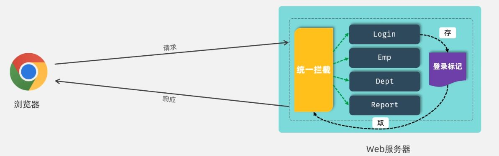
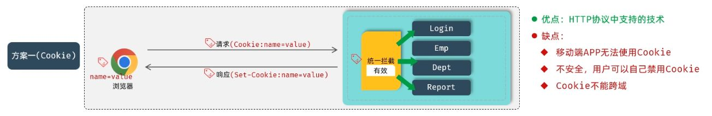
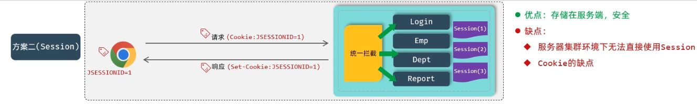
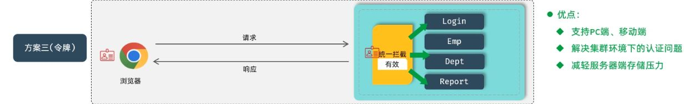
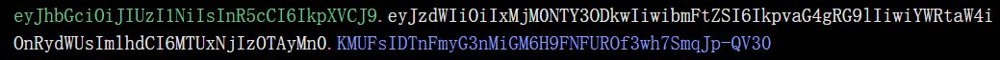

# 基础登录

最朴素的登录，其实就是一条简单的查询语句。用户在页面输入用户名和密码，服务端接收后去数据库查一遍：

```sql
SELECT * FROM emp WHERE username = 'zhangsan' AND password = '123456';
```

查不到，就说明要么用户名错了，要么密码错了；查到了，就能放行进入系统。这就是最基础的登录逻辑。

虽然登录场景中的数据量并不大，但我们依旧会使用 `POST` 请求来提交登录信息——这不仅符合接口设计的规范，也能避免用户名和密码直接暴露在 URL 里。

与常规的增删改查不同，登录的处理逻辑更偏向于“判断和标记”：

```java
@Override
public LoginInfo login(Emp emp) {
    Emp empLogin = empMapper.getUsernameAndPassword(emp);
    if (empLogin != null) {
        Map<String, Object> dataMap = new HashMap<>();
        dataMap.put("id", empLogin.getId());
        dataMap.put("username", empLogin.getUsername());

        LoginInfo loginInfo = new LoginInfo(
                empLogin.getId(),
                empLogin.getUsername(),
                empLogin.getName(),
        );
        return loginInfo;
    }
    return null;
}
```

1. 用 Mapper 查询用户信息
2. 判断是否查到数据（为空说明用户名或密码不匹配）
3. 查到则封装登录信息对象返回

到这里，系统已经能“识别”登录用户，但问题也立刻出现了：  
即便没登录，我们依然可以直接访问系统业务接口——这意味着，系统根本没有“记住”登录状态。

# 会话技术

当用户成功登录后，如果不做任何处理，服务器其实转眼就“忘了”他是谁。  
这是因为 HTTP 协议本身是**无状态**的。每一次请求都是一次全新的交互，不会自动携带任何登录信息。

而让服务器能分清“这几次请求是不是同一个人”，就是**会话跟踪**。它是一种让服务器识别并维持浏览器状态的机制，让数据能够在多次请求中共享。



当用户第一次登录成功时，服务器要给他一个“通行证”——一个能标识身份的标记。之后的每一次访问，只要这个标记还在，系统就能认出这是同一个人。  
反之，如果没有标记、标记不对、标记过期，系统就会把你拦在门外。

这套机制的总称，就是会话技术。它是所有登录校验的基础，几乎贯穿后端开发的每一个环节。

不同的方案只是在“标记存哪”这件事上不一样：

- 把标记存到客户端，就是 Cookie；
- 把标记存到服务端，就是 Session；
- 彻底抛弃状态，交给令牌（Token），就是现代主流的无状态方案。

在早期，常用的跟踪方式主要是 Cookie 和 Session，而现代更多是 Token 方案。无论是哪一种，本质都是在一条“无状态”的通信线上，**人为地建立状态**。

## 跨域问题

说到“通行证”，还不得不提一个经常让人头疼的老问题——跨域。  
浏览器在请求后端接口时，会根据“同源策略”来判断这是不是一次“安全”的访问。

所谓“源”，由三个部分构成：

- 协议
- 域名（或 IP）
- 端口

只要这三者中任意一个不同，就算是跨域。比如：

- `http://localhost:8080`
- `http://localhost:8081`

这两个端口不同，就已经跨域了。

跨域并不是后端的 bug，而是浏览器的安全限制。  
一旦遇到跨域，登录态、标记、会话信息都可能失效，甚至根本拿不到响应结果。

因此，前后端分离项目中，跨域处理几乎是必修课。常见的解决方式包括服务端允许跨域访问、反向代理转发、设置 CORS 头等。  
它不是会话技术的一部分，但**与会话共存，是实际开发中绕不开的搭档问题**。

## 早期标记

在早期的 Web 开发中，如果想让服务器“记住”用户的身份，最常用的就是 **Cookie** 和 **Session**。  
这两种方式其实是一脉相承的：一个在客户端存数据，一个在服务端存数据，本质上都靠浏览器的机制来维持状态。

### Cookie

Cookie 是浏览器自带的能力。  
当用户成功登录后，服务器可以在响应头中写入一段 `Set-Cookie` 信息，浏览器会自动保存下来。  


此后用户每发起一次请求，浏览器都会自动把这段 Cookie 附在请求头里，服务端就能识别出这是同一个用户。

```http
响应头：Set-Cookie: name=value
请求头：Cookie: name=value
```

这一切都是 HTTP 协议层面完成的，不需要额外的代码介入。  
不过，它的缺点也很明显：

- 用户可以禁用 Cookie；
- 移动端原生 APP 不支持；
- 跨域场景下 Cookie 可能失效；
- 存在安全风险。

Cookie 的优势在于“轻便”，但局限性太多。现代 Web 项目中，它更多被用作基础机制，而不是认证的最终手段。

### Session

Session 的出现，就是为了弥补 Cookie 的不足。  
它的核心思路是：**把敏感数据从客户端拿走，放回服务端**。客户端只保留一个轻量的“身份牌”——`SessionID`。



当用户第一次登录时，服务器生成一个唯一的 SessionID，存储对应的会话信息，然后通过 `Set-Cookie` 把这个 ID 发给浏览器。  
之后浏览器每次访问时，再把这个 ID 带回来，服务器根据它找到对应的 Session 数据，从而识别用户身份。

```http
响应头：Set-Cookie: JSESSIONID=1
请求头：Cookie: JSESSIONID=1
```

相比 Cookie，Session 更安全，因为真正的身份信息并不在客户端。但它的代价也不小：  
服务器要负责维护状态，存储所有用户的 Session。  
当系统规模扩大、服务器变多时，共享 Session 就成了麻烦事。

简单来说，它的优缺点很直白：

- 优点：数据存服务端，安全性更好。
- 缺点：有状态，不利于分布式和集群；仍然依赖 Cookie；占用服务器资源。

现代 Web 项目中，Cookie 和 Session 已经不再是主流。  
更灵活、更高效、支持分布式的方案是 —— **令牌（Token）技术**。

## 令牌技术

它的本质，是用户登录成功后由服务器签发一段加密的字符串。  
这段字符串里存着足够识别用户的信息。后续请求无需依赖服务端 Session，只要客户端带上 Token，服务器就能验证身份。



与前面的方式相比，它直接把“状态”交还给客户端，而服务端只负责校验。  
这种机制天然适配移动端，也适合集群和微服务环境，几乎把传统会话方案的痛点一网打尽：

- 跨平台，不依赖浏览器
- 适合分布式和集群
- 服务器无状态，压力更小
- Token 固定长度，传输轻量

而在众多 Token 方案中，使用最广的一种就是 **JWT**。

JWT，全称 **JSON Web Token**，是一种使用 JSON 作为载体的令牌格式。  
它的设计理念很简单：信息写在里面，签名保证完整性，谁都能读，但没人能改。

它由三部分组成，中间用 `.` 分隔，例如：

```
xxxxx.yyyyy.zzzzz
```



1. **第一部分：Header**  
   描述 Token 的类型和签名算法，例如：

   ```json
   {"alg": "HS256", "typ": "JWT"}
   ```

2. **第二部分：Payload**  
   记录实际承载的信息，比如用户 id、用户名、过期时间等：

   ```json
   {"sub": "1234567890","name": "John Doe","admin": true,"iat": 1516239022}
   ```

3. **第三部分：Signature**  
   签名部分，是最关键的安全保障。  
   它通过对 Header 和 Payload 进行加密计算得来，用来防止令牌被篡改。

三部分都经过 Base64 编码后拼成一串，浏览器或移动端保存下来，在后续请求时附加在请求头里。  
这种方式实现了“无状态认证”，服务器只需通过密钥验证签名，就能信任令牌携带的信息。

> Token 虽然加密了，但并不意味着保密。通常只放必要信息作为标记，比如用户 ID，而不会放敏感数据。

### 引入依赖

我们使用 jjwt 来处理 JWT，它提供了方便的 API 来生成和解析令牌：

```xml
<dependency>
    <groupId>io.jsonwebtoken</groupId>
    <artifactId>jjwt</artifactId>
    <version>0.9.1</version>
</dependency>
```

引入后，就可以直接调用它的工具类。

### 生成令牌

JWT 的生成过程非常固定。  
只需准备载荷（Payload），然后用密钥签名即可：

```java
@Test
public void testGenJwt() {
    Map<String, Object> claims = new HashMap<>();
    claims.put("id", 10);
    claims.put("username", "wreckloud");

    String jwt = Jwts.builder()
            .signWith(SignatureAlgorithm.HS256, "SVRIRULNQQ==")  // 签名算法 + 密钥
            .addClaims(claims)                                    // 自定义载荷
            .setExpiration(new Date(System.currentTimeMillis() + 12 * 3600 * 1000)) // 过期时间
            .compact();                                           // 生成令牌

    System.out.println(jwt);
}
```

- `signWith`：选择签名算法 + 指定密钥
- `addClaims`：添加业务相关信息
- `setExpiration`：设置令牌过期时间
- `compact`：生成最终的字符串

这串字符串就是“身份牌”。

### 解析令牌

验证令牌同样简单。只要令牌没被改过、没过期，就能正确解析出载荷：

```java
@Test
public void testParseJwt() {
    Claims claims = Jwts.parser()
            .setSigningKey("SVRIRULNQQ==")  // 密钥必须一致
            .parseClaimsJws("你的token字符串")
            .getBody();

    System.out.println(claims);
}
```

- **令牌被篡改**： `SignatureException` —— 签名不匹配，说明令牌内容被改或密钥错误。
- **令牌过期**：`ExpiredJwtException` —— 超过有效期，需要重新登录或刷新令牌。
- **密钥不一致**：`SecurityException` —— 签发和解析时使用的密钥不同。
- **格式错误**： `MalformedJwtException` —— 令牌结构损坏或为空，通常是请求头没带。

可以在 [https://jwt.io](https://jwt.io/) 测试生成和解析过程。网站会把令牌三部分拆开显示，让你直观理解 JWT 的结构。

## 令牌登录

令牌（JWT）准备就两件事：**生成**与**解析**。落到代码，就是一个小工具类，两个静态方法：

```java
// com/wreckloud/utils/JwtUtils.java

public class JwtUtils {
    // 生产项目请改为安全来源（环境变量/配置中心），且不要重复使用示例明文
    private static final String KEY = "SVRIRULNQQ==";

    /** 生成 JWT：携带 claims 与过期时间 */
    public static String generateJwt(Map<String, Object> claims, long ttlMillis) {
        return Jwts.builder()
                .signWith(SignatureAlgorithm.HS256, KEY)
                .addClaims(claims)
                .setExpiration(new Date(System.currentTimeMillis() + ttlMillis))
                .compact();
    }

    /** 解析 JWT：成功返回 Claims，失败抛异常 */
    public static Claims parseJwt(String token) throws JwtException {
        return Jwts.parser()
                .setSigningKey(KEY)
                .parseClaimsJws(token)
                .getBody();
    }
}
```

登录接口里，查到用户就签发令牌，把它随登录信息一起返回即可。`claims` 里只放必要字段，常见是 `id / username`。

```java
@Override
public LoginInfo login(Emp form) {
    Emp empDB = empMapper.getUsernameAndPassword(form);
    if (empDB == null) return null;

    Map<String,Object> claims = new HashMap<>();
    claims.put("id", empDB.getId());
    claims.put("username", empDB.getUsername());

    String jwt = JwtUtils.generateJwt(claims, 12 * 3600 * 1000); // 12h

    return new LoginInfo(
            empDB.getId(),
            empDB.getUsername(),
            empDB.getName(),
            jwt
    );
}
```

到这里，“登录即获得令牌”已经打通。但没登录也能访问系统的业务接口。  
这不是 JWT 不工作，而是我们还没有在每次请求时检查令牌。HTTP 是无状态的，服务端不会自动替你“记住”任何东西。

所以下一步要做的，就是把“令牌校验”放到请求入口。常见的两种入口：

- **过滤器（Filter）**：在到达 SpringMVC 之前统一拦截，适合做“所有请求都要过一遍”的粗粒度校验。
- **拦截器（Interceptor）**：在进入 Controller 前后拦截，贴近业务路由，更灵活地“挑 URL 校验”。

做法不绕：登录接口本身放行；其他受保护的接口，强制要求请求头携带 `token`，且能被解析通过。解析失败、缺失、过期——直接拒绝。

# 过滤器（Filter）

过滤器是 JavaWeb 三大组件之一（Servlet、Filter、Listener），由 **Servlet 规范** 提供，是 JavaEE 标准的一部分。  
它本身不属于 Spring，而是 运行在 Web 容器层（比如 Apache Tomcat）的组件。

它的职责就是**拦截请求**，并在需要时进行处理，比如登录状态检查、统一编码、XSS 过滤、敏感词过滤等等。  
一旦拦截，只有明确放行了，请求才会继续往后走。

### 基本用法

想要定义一个过滤器，通常有两步：

1. 定义一个类，实现 `Filter` 接口，并重写其中的三个方法。
2. 使用 `@WebFilter` 注解标注拦截路径，在启动类上加 `@ServletComponentScan` 让过滤器生效。

```java
@WebFilter(urlPatterns = "/*")
public class DemoFilter implements Filter {

    @Override
    public void init(FilterConfig filterConfig) throws ServletException {
        System.out.println("init ...");
    }

    @Override
    public void doFilter(ServletRequest request,
                         ServletResponse response,
                         FilterChain chain) throws IOException, ServletException {
        System.out.println("拦截到了请求...");
        chain.doFilter(request, response); // 放行
    }

    @Override
    public void destroy() {
        System.out.println("destroy...");
    }
}
```

过滤器只有三个生命周期方法：

- `init`：服务器启动时调用，一次
- `doFilter`：每次请求经过时调用，多次
- `destroy`：服务器关闭时调用，一次

真正“干活”的就是 `doFilter`，只要拦截到了请求，这个方法一定会被执行。  
如果在里面不调用 `chain.doFilter(request, response)`，请求就到此为止，无法访问后续资源。

### 执行与拦截规则

过滤器支持灵活的拦截路径：

- `/login` →  只拦截登录接口
- `/emps/*` →  拦截 `emps` 下的所有资源
- `/*` →  拦截所有请求（最常用）

只要加上 `@WebFilter`，它就会生效；注释掉则会使过滤器失效。多个过滤器共存时，会形成一条**过滤器链**，执行顺序按照类名的自然排序决定。

### 登录校验

在全局拦截的场景下，请求一旦经过过滤器，就可以在这里统一做登录检查。  
核心逻辑如下：

- 登录接口本身放行；
- 其他接口，检查请求头是否携带合法的令牌；
- 如果解析成功，就继续放行；
- 如果缺失或无效，直接拒绝访问，返回“未登录”。

这一段校验不会写在 Controller 中，而是**放在入口**，这就是过滤器的意义所在。  
它是全局的第一道门，决定谁能进系统、谁得被拦在外面。

整个校验流程六步就能走完：

1. 获取请求 URL

请求过来时，`ServletRequest` 本身不带我们想要的信息，所以需要先强转成 `HttpServletRequest` 和 `HttpServletResponse`，才能方便地拿到路径、头信息等内容。

```java
HttpServletRequest req = (HttpServletRequest) request;
HttpServletResponse resp = (HttpServletResponse) response;

String uri = req.getRequestURI(); // /login
String url = req.getRequestURL().toString(); // http://localhost:8080/login
```

URL 和 URI 的区别在于，一个是完整路径，一个是资源路径。  
这里判断资源路径就够用了。

2. 放行登录请求

令牌是通过登录接口签发的，如果连登录接口本身也要带令牌，那就死循环了。  
所以，遇到登录请求时，直接放行。

```java
if (uri.contains("login")) {
    chain.doFilter(request, response);
    return; // 放行后必须 return，防止继续往下执行
}
```

3. 获取请求头中的令牌

前后端约定好，令牌会放在请求头的 `token` 字段中。  
过滤器要做的，就是先把它拿出来。

```java
String token = req.getHeader("token");
```

4. 判断令牌是否存在

如果请求头里根本没有令牌，那就是没登录。  
直接响应 401（未授权），不再往后执行。

```java
if (token == null) {
    resp.setStatus(401);
    throw new BusinessException("未登录，请先登录！");
}
```

5. 解析令牌

有令牌不代表合法，还得解析校验。  
只要令牌被篡改、密钥不对、已经过期，解析就会失败，同样返回 401。

```java
try {
    Claims claims = JwtUtils.parseJwt(token);
    log.info("令牌解析成功：{}", claims);
} catch (Exception e) {
    resp.setStatus(401);
    log.error("令牌解析失败：{}", e.getMessage());
    throw new BusinessException("未登录，请先登录！");
}
```

6. 放行

令牌合法才放行，让请求继续进入业务层。

```java
chain.doFilter(request, response);
```

这六步，就是过滤器层面完成的登录校验逻辑。  
它简单、直接、集中在入口处，不用在每个 Controller 里重复写一遍。

### 完整示例

```java
// com/wreckloud/filer/LoginCheckFilter.java

/**
 * 登录校验过滤器
 * 拦截所有请求，检查是否携带合法令牌
 */
@Slf4j
@WebFilter(urlPatterns = "/*") // 拦截所有请求
public class LoginCheckFilter implements Filter {

    @Override
    public void init(FilterConfig filterConfig) throws ServletException {
        log.info("登录校验过滤器初始化完成...");
    }

    @Override
    public void doFilter(ServletRequest request, ServletResponse response, FilterChain chain)
            throws IOException, ServletException {

        // 1. 强转，获取 HTTP 请求对象
        HttpServletRequest req = (HttpServletRequest) request;
        HttpServletResponse resp = (HttpServletResponse) response;

        String uri = req.getRequestURI();
        log.debug("拦截到请求：{}", uri);

        // 2. 放行登录请求
        if (uri.contains("/login")) {
            chain.doFilter(request, response);
            return;
        }

        // 3. 获取请求头中的 token
        String token = req.getHeader("token");
        if (token == null || token.isEmpty()) {
            log.warn("请求未携带令牌，拒绝访问");
            resp.setStatus(HttpServletResponse.SC_UNAUTHORIZED); // 401
            return;
        }

        // 4. 校验令牌
        try {
            Claims claims = JwtUtils.parseJwt(token);
            log.debug("令牌解析成功：{}", claims);
        } catch (Exception e) {
            log.error("令牌解析失败：{}", e.getMessage());
            resp.setStatus(HttpServletResponse.SC_UNAUTHORIZED);
            return;
        }

        // 5. 放行
        chain.doFilter(request, response);
    }

    @Override
    public void dest
```

# 拦截器（Interceptor）

拦截器是一种 **动态拦截方法调用** 的机制，和过滤器很像，但它不属于 Servlet 层，而是 **SpringMVC 提供** 的功能，位置更靠近 Controller。  
它的作用是在请求真正进入 Controller 之前、之后，甚至整个请求完成后，**插入一段自定义逻辑**。

常见应用场景包括：

- 登录状态校验
- 权限拦截
- 接口访问统计
- 日志记录与追踪

与过滤器相比，拦截器粒度更细，也更贴近业务逻辑。

`HandlerInterceptor` 接口定义了拦截器的执行流程，主要有三个回调方法。每个方法对应请求生命周期的一个时机：

```java
public interface HandlerInterceptor {

    // 目标方法执行前调用
    boolean preHandle(HttpServletRequest request, HttpServletResponse response, Object handler);

    // 目标方法执行后，视图渲染前调用
    void postHandle(HttpServletRequest request, HttpServletResponse response, Object handler, ModelAndView modelAndView);

    // 整个请求完成后调用（包括视图渲染完毕）
    void afterCompletion(HttpServletRequest request, HttpServletResponse response, Object handler, Exception ex);
}
```

- `preHandle` 是“门口检查”
- `postHandle` 是“方法执行后补刀”
- `afterCompletion` 是“收尾擦屁股”

### 基本用法

想要定义一个拦截器，需要完成以下两步

1. **定义拦截器**：实现 `HandlerInterceptor` 接口，重写三个方法。
2. **注册拦截器**：通过配置类，将它加入 SpringMVC 的执行链中（与过滤器不同，不用注解声明路径）。

首先，实现 `HandlerInterceptor` 接口，并重写其中的核心方法。  
最常用的其实就是 `preHandle`，它在 Controller 方法执行前触发，用来做登录校验、权限拦截等。`postHandle` 和 `afterCompletion` 可按业务需要选择性使用。

```java
@Slf4j
@Component
public class DemoInterceptor implements HandlerInterceptor {

    // 目标方法执行前触发
    @Override
    public boolean preHandle(HttpServletRequest request,
                             HttpServletResponse response,
                             Object handler) throws Exception {
        log.info("DemoInterceptor... preHandle");
        // 返回 true 表示放行，false 表示拦截
        return true;
    }

    // 目标方法执行后触发（视图渲染前）
    @Override
    public void postHandle(HttpServletRequest request,
                           HttpServletResponse response,
                           Object handler,
                           ModelAndView modelAndView) throws Exception {
        log.info("DemoInterceptor... postHandle");
    }

    // 整个请求完成后执行（包括视图渲染完成）
    @Override
    public void afterCompletion(HttpServletRequest request,
                                HttpServletResponse response,
                                Object handler,
                                Exception ex) throws Exception {
        log.info("DemoInterceptor... afterCompletion");
    }
}
```

- `preHandle` 是请求入口 → 登录校验、权限控制
- `postHandle` 是响应加工 → 加日志或数据处理
- `afterCompletion` 是收尾 → 资源释放、链路追踪

定义好拦截器后，需要把它注册进 SpringMVC 的拦截链中。  
与过滤器不同的是：拦截器不通过注解声明路径，而是通过配置类注册。

```java
@Configuration // 声明当前类为配置类
public class WebConfig implements WebMvcConfigurer {

    @Autowired
    private DemoInterceptor demoInterceptor;

    @Override
    public void addInterceptors(InterceptorRegistry registry) {
        registry.addInterceptor(demoInterceptor)
                .addPathPatterns("/**")        // 拦截所有请求
                .excludePathPatterns("/login"); // 排除登录接口
    }
}
```

📌 这里有两点和过滤器不一样：

1. 过滤器用 `@WebFilter` 注解声明路径；
2. 拦截器通过配置类的 `addInterceptors()` 方法设置路径；
3. 还可以用 `excludePathPatterns()` 精确排除不需要拦截的接口。

SpringMVC 的路径匹配支持通配符，常见规则如下：

| 表达式      | 含义                                  |
| ----------- | ------------------------------------- |
| `/login`    | 仅拦截 `/login` 路径                  |
| `/*`        | 拦截一级路径（如 `/depts`），不含多级 |
| `/**`       | 拦截任意级路径（如 `/depts/1/2`）     |
| `/depts/*`  | 拦截 `/depts` 下一级路径，不含多级    |
| `/depts/**` | 拦截 `/depts` 下任意级路径            |

📌 举例：

- `/*` 能匹配 `/depts`、`/login`，但不能匹配 `/depts/1`
- `/**` 能匹配 `/depts`、`/depts/1`、`/depts/1/2`
- `/depts/*` 只匹配 `/depts/1`，不匹配 `/depts/1/2`
- `/depts/**` 能匹配 `/depts`、`/depts/1`、`/depts/1/2`，但不匹配 `/emps/1`

## 登录校验

在真实项目中，拦截器最常见的应用场景就是 **登录状态校验**。  
和过滤器一样，它的核心逻辑就是在请求进入 Controller 之前，统一拦截检查是否“有令牌、令牌是否有效”，从而保护受限资源。

整个流程非常固定，六步走就能串起来：

1. 获取请求 URL

第一步先拿到本次请求的路径，便于判断是否需要校验。  
`HttpServletRequest` 本身就提供了 `getRequestURI()` 方法。

```java
String uri = request.getRequestURI();
log.debug("拦截到请求：{}", uri);
```

2. 登录请求放行

令牌是在登录时签发的，因此登录接口本身不能拦截。  
常见做法是判断 URL 中是否包含 `/login`，是则直接放行。

```java
if (uri.contains("/login")) {
    return true; // 放行
}
```

这一点非常关键，否则你会遇到“还没登录就被拦截”的死循环。

3. 获取请求头中的 Token

前后端约定，令牌会放在请求头的 `token` 字段里。  
在拦截器中直接取即可：

```java
String token = request.getHeader("token");
```

4. 判断 Token 是否存在

如果没有携带令牌，说明用户没有登录或请求不合法，直接拒绝访问并返回 `401 Unauthorized` 状态码。

```java
if (token == null || token.isEmpty()) {
    log.warn("请求未携带令牌，拒绝访问");
    response.setStatus(HttpServletResponse.SC_UNAUTHORIZED);
    return false;
}
```

5. 解析 Token

携带了令牌不代表合法，还必须校验它的有效性。  
解析失败、密钥不匹配、令牌过期，都会被拒绝访问。

```java
try {
    JwtUtils.parseJwt(token);
    log.debug("令牌解析成功");
} catch (Exception e) {
    log.error("令牌解析失败：{}", e.getMessage());
    response.setStatus(HttpServletResponse.SC_UNAUTHORIZED);
    return false;
}
```

6. 放行请求

如果令牌存在且解析成功，就可以放行请求，让它进入 Controller 执行业务逻辑。

```java
return true;
```

## 完整示例

```java
@Slf4j
@Component
public class LoginInterceptor implements HandlerInterceptor {

    @Override
    public boolean preHandle(HttpServletRequest request,
                             HttpServletResponse response,
                             Object handler) throws Exception {

        // 1. 获取请求 URL
        String uri = request.getRequestURI();
        log.debug("拦截到请求：{}", uri);

        // 2. 登录接口放行
        if (uri.contains("/login")) {
            return true;
        }

        // 3. 获取 token
        String token = request.getHeader("token");

        // 4. 判断 token 是否存在
        if (token == null || token.isEmpty()) {
            log.warn("未携带令牌，拒绝访问");
            response.setStatus(HttpServletResponse.SC_UNAUTHORIZED);
            return false;
        }

        // 5. 校验 token
        try {
            JwtUtils.parseJwt(token);
            log.debug("令牌解析成功");
        } catch (Exception e) {
            log.error("令牌解析失败：{}", e.getMessage());
            response.setStatus(HttpServletResponse.SC_UNAUTHORIZED);
            return false;
        }

        // 6. 放行
        return true;
    }
}
```

先判断是不是登录请求 → 检查有没有 token → 校验 token 是否有效 → 有效才放行。

# 从明文改为 MD5

项目里登录模块一开始是直接存明文密码，这种方式风险太高，只要库一泄露，所有账号几乎等同于裸奔，所以必须改成密文存储。

我们可以使用 MD5 对明文密码进行加密。  
MD5 是一种单向哈希算法，会把明文转成固定长度的密文，具有不可逆性：无法通过密文反推出明文。  
密码校验时，只需要对用户输入再执行一次 MD5，与数据库里的密文进行对比即可。

但这里有一个经常让人困惑的点：  
明明说不可逆，为什么网上还有 MD5 在线“解密”工具例如：[https://www.sojson.com/md5](https://www.sojson.com/md5/%EF%BC%89%EF%BC%9F)

原因不是它真的能解密，而是依靠了“彩虹表”。彩虹表里存了大量“明文 → MD5”对应关系，所以工具是通过查表来匹配出明文，而不是反推计算出来的。如果密码足够复杂、表中没有对应记录，那这种“解密”就无法成功。

### 使用 MD5 加密

在项目中使用 MD5 并不复杂，目标就两件事：  
把明文转密文、然后用密文做对比。

数据库层本身就有内置函数：

```sql
SELECT MD5('123456');
```

这个可以用来做临时验证、排错，或者在一次性迁移明文时使用。

例如可以用 SQL 更新语句来批量更新：

```sql
UPDATE employee
SET password = MD5(password)
WHERE password IS NOT NULL
  AND CHAR_LENGTH(password) < 32;
```

这样只会把明显不是 MD5 的内容更新为密文（长度小于 32 的通常是明文）。

在 Spring 项目中，直接使用 `DigestUtils` 就能完成 MD5 计算：

```java
String cipher = DigestUtils.md5DigestAsHex(password.getBytes());
```

上述返回值就是 MD5 的 32 位密文，把这个存到数据库中即可。  
之后无论是注册、改密还是登录校验，都是先对明文做一次 MD5，再进行比对。

整个流程只需要记住一点：业务代码永远只对「密文」做对比，而不是尝试把它算回明文。

### 完整示例

第一步先把加密动作封装统一，让业务代码只负责提交明文并拿密文，这样后面无论继续用 MD5 还是换成 BCrypt，都不影响调用。

```java
public final class PasswordHasher {
    public static String md5(String raw) {
        return DigestUtils.md5DigestAsHex(raw.getBytes(StandardCharsets.UTF_8));
    }
}
```

接下来把登录闭环打通。注册、修改密码时入库前先做一次 MD5；登录校验时对输入再做同样的 MD5 并与库里密文对比，不涉及“解密”。

```java
// 写入
form.setPassword(PasswordHasher.md5(form.getPassword()));
empMapper.insert(form);

// 校验
String cipher = PasswordHasher.md5(rawPassword);
Emp emp = empMapper.selectByUsernameAndPassword(username, cipher);
```

如果库里之前存的是明文，可以先做一次性迁移，把旧数据统一转成 MD5 密文。执行前要先做备份，防止重复哈希。

```sql
UPDATE emp
SET password = MD5(password)
WHERE password IS NOT NULL
  AND CHAR_LENGTH(password) < 32;
```

最后做一些基础防护。MD5 本身是哈希，但计算速度很快，弱口令容易被彩虹表撞中，所以密码尽量使用复杂一些，必要时可以加盐，把盐与密文一起存储，提升撞库成本。

```java
public static String md5WithSalt(String raw, String salt) {
    return DigestUtils.md5DigestAsHex((salt + raw).getBytes(StandardCharsets.UTF_8));
}
```

通过以上过程，可以先平稳完成从明文到密文的过渡；后续如果需要提升安全级别，再替换成 BCrypt 也是平滑可控的。
