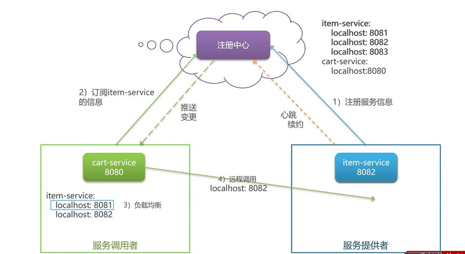

单体架构是一种将业务的所有功能集中在**一个项目**中开发，最终打成**一个包**统一部署。

这种方式在项目早期非常常见，也很好理解：功能都在一起，开发和部署都比较简单，问题也容易排查。

随着业务规模扩大，单体架构的局限性会逐渐显现。
当系统并发量升高、功能模块不断增多时，单体服务开始变得难以维护，整体扩展能力也受到限制。

一般来说，当**单体服务已经明显承受不住并发压力，或者开发、部署成本开始变高**时，就会考虑进行架构拆分。

**微服务架构**是一种软件架构风格。
它的核心思路是：
把一个复杂的大型应用，拆分成**多个只关注单一职责的小型项目**，再通过服务之间的协作，对外提供完整功能。

在微服务架构下，每个服务通常都是一个**独立项目**，可以单独开发、部署和扩展。

---

从单体拆分为微服务之后，系统会立刻面临新的问题。

最直接的变化是：
原来在同一个项目中的**本地方法调用**，变成了**服务之间的调用**。

因此，服务拆分之后，首先遇到的就是：

- 服务拆分本身
- 服务之间的远程调用问题

---

随着服务数量进一步增加，还会逐渐引出更多分布式场景下的问题，例如：

- 身份认证
- 配置管理
- 服务保护（限流、熔断、降级）
- 分布式事务
- 异步通信
- 消息可靠性
- 延迟消息
- 分布式搜索
- 倒排索引
- 数据聚合

这些问题并不是一开始就全部出现，而是随着系统复杂度提升逐步暴露出来的，也是后续微服务学习需要重点关注的内容。

---

总体来看，从单体架构到微服务架构的过程，本质上是：
**用拆分换取系统扩展能力，同时引入分布式带来的复杂性。**

这一阶段的重点并不是解决所有问题，而是先对整个变化过程有一个大体认知。

---

## 技术栈：Spring Cloud

**Spring Cloud** 是目前国内使用较为广泛的一套微服务框架体系。

Spring Cloud 集成了多种常见的微服务能力，并基于 Spring Boot 提供自动装配，整体使用体验相对友好，常见组件包括：

- **服务注册与发现**：Eureka、Nacos、Consul
- **服务远程调用**：OpenFeign、Dubbo
- **服务链路监控**：Zipkin、Sleuth
- **统一配置管理**：Spring Cloud Config、Nacos
- **统一网关路由**：Spring Cloud Gateway、Zuul
- **流控、降级与服务保护**：Hystrix、Sentinel

---

由于 Spring Cloud 基于 Spring Boot 构建，因此两者在版本上需要进行匹配，否则容易出现兼容问题。
常见的版本对应关系如下：

- Spring Cloud **2023.0.x（Leyton）** → Spring Boot **3.2.x**
- Spring Cloud **2022.0.x（Kilburn）** → Spring Boot **3.0.x**
- Spring Cloud **2021.0.x（Jubilee）** → Spring Boot **2.6.x / 2.7.x**
- Spring Cloud **2020.0.x（Hoxton）** → Spring Boot **2.4.x / 2.5.x / 2.3.x**
- Greenwich → Spring Boot 2.1.x
- Finchley → Spring Boot 2.0.x
- Edgware / Dalston → Spring Boot 1.5.x

这些版本代号来源于**伦敦地铁站名称**。

---

如果我说一句狼味一点但不矫情的评价：

> 这一节不是“学会微服务”，
> 而是**知道自己接下来要被哪些问题折磨**。

你现在这部分**已经很适合放在“微服务入门”的开头**了。
下一节如果你愿意，我们可以继续用这个风格，直接写：
**服务拆分 → 为什么需要远程调用 → RestTemplate / Feign 的引入动机**。

单体架构：将业务的所有功能集中在一个项目中开发，打成一个包部署。

微服务是一种软件架构风格，它是以专注于单一职责的很多小型项目为基础，组合出复杂的大型应用。

引入微服务之后服务之间的调用问题

服务拆分 远程调用

出现这些问题, 还包括 身份认证
。配置管理
·服务保护
。分布式事务
·异步通信
。消息可靠性
·延迟消息
。分布式搜索
·倒排索引引
。数据聚合
这都是接下来要学习的.
(从单体到微服务的引入, 然后有个大体的认知)

一般来说, 当单体服务承受不住并发量, 就可以拆成微服务
微服务架构，是服务立项目。
● 粒度小团队自治服务自治

## 技术栈 SpringCloud

SpringCloud
SpringCloud 是目前国内使用最广泛的微服务框架。官网地址：https://spring.io/projects/spring-cloud.SpringCloud集成了各种微服务功能组件，并基于SpringBoot实现了这些组件的自动装配，从而提供了良好的开箱即用体验：
服务注册发现
Fureka、Nacos、 Consul
服务远程调用
OpenFeign、Dubbo
服务链路监控
Zipkin、Sleuth
统一配置管理
SpringCloudConfig、Nacos
统一网关路由
SpringCloudGateway、Zuul
流控、降级、保护
Hystrix、 Sentinel

SpringCloud 基于 SpringBoot 实现了微服务组件的自动装配，从而提供了良好的开箱即用体验。但对于 SpringBoot 的版本也有要求：
SpringCloud 版本
2023.0.x aka Leyton
3.2.x
2022.0.x aka Kilburn
3.0.x
2021.0.x aka Jubilee
2.6.x, 2.7.x (Starting with 2021.0.3)
2020.0.x aka IlfordHoxton
2.4.x, 2.5.x (Starting with 2020.0.3)
2.2.x, 2.3.x (Starting with SR5)
Greenwich
2.1.x
Finchley
2.0.x
Edgware
1.5.x
Dalston
1.5.x

这之前是伦敦地铁站的站名

### 服务拆分原则

什么时候拆分？
● 创业型项目：先采用单体架构，快速开发，快速试错。随着规模扩大，逐渐拆分。
● 确定的大型项目：资金充足，目标明确，可以直接选择微服务架构，避免后续拆分的麻烦。
么拆分？
从拆分目标来说，要做到：
● 高内聚：每个微服务的职责要尽量单一，包含的业务相互关联度高、完整度高。
● 低耦合：每个微服务的功能要相对独立，尽量减少对其它微服务的依赖。

纵向拆分 功能拆分
横向拆分, 公共模块

不过以上都太学术化了, 以后实际情况, 只要能做到高内聚地耦合,能跑就差不多了

具体的拆分方法

工程结构有两种:
● 独立 Project 甚至能做到语言都用不一样的 < -大的都用这种

- Maven 聚合 中大型
-

# 远程调用

拆分时发现(比较简单又合适的例子) 比如拆分后的购物车? 商品
问题

解决问题.

RestTemplate
Spring 给我们提供了一个 RestTemplate 的 APl， 可以方便的实现 Http 请求的发送。

其中提供了大量的方法

远程调用
Spring 给我们提供了一个 RestTemplate 工具，可以方便的实现 Http 请求的发送。使用步骤如下:① 注入 RestTemplate 到 Spring 容器。编写 RemoteCallConfig 类，添加如下方法:
@Bean
public RestTemplate restTemplate(){return new RestTemplate();
发起远程调用。改造查看购物车的方法获取商品信息
public <T> ResponseEntity<T> exchange(
String url，// 请求路径
"http: //localhost:8081/items?ids={ids}""
HttpMethod method， // 请求方式
HttpMethod.GET
@Nullable HttpEntity<?> requestEntity， // 请求实体, 可以为空
Class<T> responseType, // 返回值类型 new ParameterizedTypeReference<List<ItemDTo>>() {}Map<String, ?> urivariables // 请求参数

## 注册中心

在刚刚的例子中, 我们是把 url 写进源码的, 这样肯定不合适(为什么?)
能不能把地址提出来,?

涉及服务治理. 单点故障, 解决了

注册中心原理

集群
服务的提供者, 把自己的信息 注册到 注册服务中心, 记录到一个 map 集合当中去

服务调用者
订阅提供者的信息, 调用者拿到信息, 可以做负载均衡, 就能动态.

服务崩溃
每隔 15 秒 心跳续约(也就是一个带信息的 http, 就像 ping 一样), 有问题的话注册中心就会自动排除,i 然后向调用者推送变更

轮询调用等算法,

早期的教eurika Nacos注册中心
Nacos是目前国内企业中占比最多的注册中心组件。它是阿里巴巴的产品，目前已经加入SpringCloudAlibaba中。

nacos 配置.

naocos