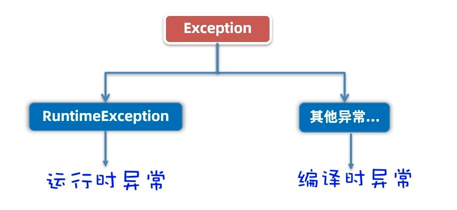

# 异常

程序运行过程中总会遇到各种"意外情况"，这些情况如果不妥善处理，轻则程序崩溃，重则让维护成本成倍增长。
Java 的异常处理机制就是专门用来应对这些"意外"的，是构建稳定系统的关键保障。

**异常体系结构**

Java 的异常体系以`Throwable`为根，分为两大类：`Error`和`Exception`。


**Error**：表示严重的系统级错误，通常无法在程序中处理，因此作为开发人员不用管它
**Exception**：表示程序级异常，可以在程序中捕获和处理，是重点关注的对象

- **运行时异常**（RuntimeException）：编译器不强制处理，常见于编程逻辑错误

```java
// 常见运行时异常
NullPointerException        // 空指针异常
ArrayIndexOutOfBoundsException  // 数组索引越界异常
ClassCastException          // 类型转换异常
ArithmeticException         // 算术异常（如除以零）
```

- 编译时异常（CheckedException）：编译器要求必须处理或声明抛出，也称为受检异常

```java
// 常见受检异常
IOException                 // 输入输出异常
SQLException                // 数据库操作异常
ClassNotFoundException      // 类未找到异常
```

异常不仅是定位 Bug 的关键线索，更是方法内部与调用者之间传递错误状态的重要机制。

### 异常的作用

**定位 Bug 的关键依据**

异常信息通常包含详细的错误类型、堆栈跟踪和出错位置。例如：

```
Exception in thread "main" java.lang.ArrayIndexOutOfBoundsException: Index 3 out of bounds for length 3
    at com.itheima.d3_exception.ExceptionTest1.main(ExceptionTest1.java:9)
```

通过异常信息，开发者可以迅速定位问题根源，提升调试效率。

**作为方法的特殊返回值**

在早期开发中，常用特殊返回值（如 `-1`）表示方法执行失败：

```java
public static int divide(int a, int b) {
    if (b == 0) {
        System.out.println("参数有问题~~");
        // 用特殊值表示出错
        return -1;
    }
    int c = a / b;
    return c;
}
```

但这种方式存在歧义：如果正常操作本身就可能返回 `-1`，调用者难以区分是正常结果还是异常。

更优雅的做法是直接抛出异常，让调用者明确感知到错误：

```java
public static int divide(int a, int b) {
    if (b == 0) {
        System.out.println("参数有问题~~~");
        // 抛出异常，通知上层调用者
        throw new RuntimeException("/ by zero!");
    }
    int c = a / b;
    return c;
}
```

这样，异常成为方法中的“特殊返回值”，调用者必须显式处理，避免错误被忽略。

## 异常捕获

Java 提供了完善的异常捕获与处理机制，帮助开发者在程序运行过程中优雅地应对各种意外情况，提升系统的健壮性和可维护性。

### 基本的捕获方式

Java 使用 `try-catch-finally` 语法结构来捕获和处理异常：

```java
try {
    // 可能抛出异常的代码
} catch (具体异常类型1 e) {
    // 针对具体异常的处理逻辑
} catch (具体异常类型2 e) {
    // 针对另一种异常的处理逻辑
} finally {
    // 无论是否发生异常，都会执行的收尾操作（如关闭资源）
}
```

- **try 块**：放置可能抛出异常的代码。
- **catch 块**：捕获并处理异常。建议优先捕获具体异常类型，最后再捕获通用的 `Exception`。
- **finally 块**：用于资源释放，无论是否发生异常都会执行。

> 可以使用 `Ctrl + Alt + T` 或 万能的 `Alt + Enter` 快捷键，快速生成 try-catch 代码结构

### 番外-拓展的捕获方式

随着 Java 版本的演进，异常处理机制也得到了进一步优化。下面介绍的几种更为简洁和高效的异常处理方式，需要在  Java 7 及以上版本中使用。

**多异常合并捕获**

当多个异常的处理逻辑一致时，可以使用“多异常捕获”语法，提升代码简洁性：

```java
try {
    // 可能抛出多种异常的代码
} catch (FileNotFoundException | EOFException e) {
    System.out.println("文件操作失败: " + e.getMessage());
}
```

**try-with-resources 自动资源管理**

对于需要显式关闭的资源（如文件、数据库连接等），推荐使用 try-with-resources 语法，避免资源泄漏：

```java
try (
    FileInputStream file = new FileInputStream("data.txt");
    BufferedReader reader = new BufferedReader(new InputStreamReader(file))
) {
    String line = reader.readLine();
    // ... 处理数据
} catch (IOException e) {
    System.out.println("文件读取失败: " + e.getMessage());
}
// 资源会自动关闭，无需手动调用 close()
```

- 只要资源实现了 `AutoCloseable` 接口（如大多数 IO 类），就能自动关闭。
- 这种结构极大简化了资源管理代码，提高了可靠性。

## 异常处理

在实际开发中，异常处理需要遵循一定的策略和模式，以确保程序既能优雅地处理错误，又能保持良好的用户体验和系统稳定性。

以下两种方式是业内最常见的处理方式。

### 分层处理

**核心思想**：底层方法专注业务逻辑，把异常往上抛；上层方法统一捕获，记录日志，给用户友好提示。

- 底层方法：专注业务逻辑，遇到异常就往上抛

```java
// 底层方法：专注业务，异常往上抛
public static void parseDate(String s) throws Exception {
    // 可能抛出 ParseException, FileNotFoundException 等
    // 但不用逐个声明，直接用父类 Exception
}
```

- 上层方法：统一捕获所有异常，记录日志，给用户一个友好的错误提示

```java
try {
    parseDate("2023-11-11 11:11:11");
    System.out.println("成功了");
} catch (Exception e) { // 用父类接收所有的异常
    e.printStackTrace();
    System.out.println("失败了！");
}
```

为什么要用父类  Exception？

如果底层方法可能抛出  10 种不同的异常，难道要在方法签名里写 10  个 throws  吗？那方法签名得多长啊！

直接用父类  Exception，简单粗暴，上层就知道成功还是失败了。

**处理流程**：

1. 底层方法将具体异常向上抛出
2. 上层方法统一捕获并记录异常信息
3. 向用户提供友好的错误提示

即便没异常，今后做项目也推荐这样规范处理。

### 异常恢复

当遇到可恢复的错误时（如网络超时、用户输入错误等），可以采用捕获异常并尝试修复的策略。

比如之前的 Scanner，接受到一个不合法的输入，Scanner  就会立马抛出错误，然后给虚拟机，虚拟机直接把程序干掉了。

**解决思路：**
不要让程序直接崩溃，而是捕获异常后，提示用户重新输入，让程序继续运行。

```java
while (true) {
    try {
        double price = getPrice();
        System.out.println("本商品定价是：" + price);
        break;  // 成功获取价格，退出循环
    } catch (Exception e) {
        System.out.println("您输入的价格格式不正确，请重新输入！");
        // 继续循环，让用户重新输入
    }
}
```

这样就没问题了，这就是拦截完异常尝试重新修复。

## 自定义异常

Java 无法为这个世界上全部的问题都提供异常类来代表，如果企业自己的某种问题，想通过异常来表示，以便用异常来管理该问题，那就需要自己来定义异常类了。



异常分为两种，同样的，自定义异常也有两种。

### 自定义运行时异常

自定义运行时异常的步骤很简单：

1. 定义一个异常类继承 `RuntimeException`
2. 重写构造器

在重写时，只需要重写这两个方法即可

```java
public class AgeIllegalRuntimeException extends RuntimeException {
    public AgeIllegalRuntimeException() {
    }

    public AgeIllegalRuntimeException(String message) {
        super(message);
    }
}
```

使用的时候，直接  `throw new`  异常类来创建异常对象并抛出：

```java
public static void save(int age) {
    if (age <= 0 || age > 150) {
        // 这个年龄非法！创建异常对象并立即抛出去
        throw new AgeIllegalRuntimeException("age is illegal!");
    }
    System.out.println("年龄保存成功了，年龄是：" + age);
}
```

**这么做有很多好处**：

- 如果真出这个 bug，会有这样详细的输出，项目上线是没用控制台的
- 上层调用者必须要知道底层的执行情况
- 通过 `throw new` 异常类来创建异常对象并抛出
- 编译阶段不报错，提醒不强烈，运行时才可能出现

### 自定义编译时异常

自定义编译时异常的步骤和运行时异常一样：定义一个异常类继承  Exception，然后重写构造器。

1. 定义一个异常类继承 `Exception`
2. 重写构造器

```java
public class AgeIllegalException extends Exception {
    public AgeIllegalException() {
    }

    public AgeIllegalException(String message) {
        super(message);
    }
}
```

但是注意调用时不一样了。如果直接`throw new` ：

```java
public static void save(int age) {
    if (age <= 0 || age > 150) {
        throw new AgeIllegalException("age is illegal!");
    }
    System.out.println("年龄保存成功了，年龄是：" + age);
}
```

是不给通过的，编译时异常是一定要处理的！
**必须在方法上用 throws 抛出**：

```java
public static void save(int age) throws AgeIllegalException {
    if (age <= 0 || age > 150) {
        throw new AgeIllegalException("age is illegal!");
    }
    System.out.println("年龄保存成功了，年龄是：" + age);
}
```

这里有个重要的区别：

- `throw`：方法内部使用的，创建异常并从此点抛出去
- `throws`：方法上声明的，抛出方法内部的异常给调用者

通过 `throw new` 异常类来创建异常对象并抛出，编译阶段就报错，提醒更加强烈！

### 如何选择自定义异常

**应该用运行时异常**

为什么呢？不是编译时提醒更强烈吗？

其实就连 Sun 公司都在全面淘汰编译时异常，就是因为它提醒的太强烈，耦合严重。如果我有一百层，这一百层都没 `throws`，底层出错，上面全部白给，过都不准过，谁接到谁报错。

所以以后尽量使用运行时异常，这对我们程序员影响较小。
