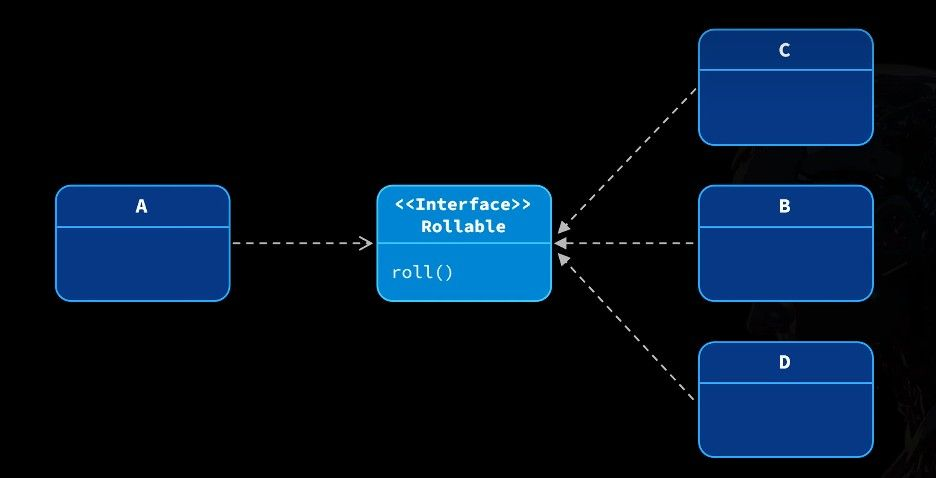

# 类

想象一下"蛋糕模具"和"蛋糕"的关系：

- 类就像是一个蛋糕模具：它定义了形状、大小等特征，但本身不能吃。
- 对象就像是用模具做出来的一个个实际的蛋糕：可以有各种口味，可以真正享用。

在 Java 中：

- 类中的变量叫成员变量，描述事物的特征（比如蛋糕的大小、颜色）
- 类中的方法叫成员方法，描述事物能做什么（比如蛋糕可以切开、可以品尝）

### 类的语法格式

```Java
修饰符 class 类名 {
    // 属性（成员变量）- 不用初始化，会有默认值
    数据类型 变量名;

    // 行为（成员方法）
    public 返回类型 方法名(参数列表) {
        // 方法体：做什么事情
    }
}
```

### 对象创建

有了类（模具），就可以"生产"出具体的对象：

- 创建对象（实例化）：

```Java
类名 对象名 = new 类名();
```

- 使用对象的方法

```Java
对象名.方法名(参数);
```

- 访问对象的属性

```Java
对象名.属性名;
```

变量和对象在内存中存储的位置不同

- 局部变量存在 **栈** 中  - 存取快，空间小
- 对象实体存在 **堆** 中  - 空间大，生命周期长
- 对象的引用（地址）存在栈中 - 相当于"门牌号"，方便快速找到对象

# 封装

封装（Encapsulation）是面向对象的第一大特性，简单来说，就是：

> 合理隐藏，合理暴露

- 把相关的数据和操作这些数据的方法打包在一起
- 对外隐藏实现细节，只公开必要的接口

就像手机一样，你只需要知道怎么按按钮，不需要知道内部电路怎么工作。

## 从过程式到面向对象的转变

看一个计算薪资的例子：

**过程式风格**（所有数据和方法分离）：

```java
public class SalaryDemo {
    public static void main(String[] args) {
        // 数据散落各处
        int baseSalary = 5000;
        int bonus = 10000;
        char grade = 'B';

        // 独立的方法处理数据
        int salary = calculateSalary(baseSalary, bonus, grade);
        System.out.println(salary);
    }

    public static int calculateSalary(int baseSalary, int bonus, char grade) {
        double rate = switch (grade) {
            case 'A' -> 1.0;
            case 'B' -> 0.8;
            case 'C' -> 0.6;
            case 'D' -> 0.4;
            default -> 0;
        };
        return baseSalary + (int)(bonus * rate);
    }
}
```

**面向对象风格**（数据和方法封装在一起）：

```java
// 定义员工类
public class Employee {
    // 数据（属性）和方法放在一起
    int baseSalary;
    int bonus;

    // 计算薪资的方法直接访问类内部的数据
    public int calculateSalary(char grade) {
        double rate = switch (grade) {
            case 'A' -> 1.0;
            case 'B' -> 0.8;
            case 'C' -> 0.6;
            case 'D' -> 0.4;
            default -> 0;
        };
        return baseSalary + (int)(bonus * rate);
    }
}
```

使用这个员工类：

```java
public static void main(String[] args) {
    // 创建员工对象
    Employee employee = new Employee();

    // 设置属性值
    employee.baseSalary = 5000;
    employee.bonus = 10000;

    // 调用方法计算薪资
    int salary = employee.calculateSalary('A');
    System.out.println(salary);
}
```

在 IDEA 中，选中表达式后按`Alt + Enter`可以快速创建变量来保存结果。

## Getter 和 Setter

现在的问题是：员工的属性可以被任意修改，没有任何限制。比如可能会设置负数的工资！

解决方案是：

1. 将属性设为私有（private）
2. 提供公开的方法来访问和修改这些私有属性

```java
public class Employee {
    // 私有化属性，外部不能直接访问
    private int baseSalary;
    private int bonus;

    // 提供设置基本工资的方法，可以添加验证逻辑
    public void setBaseSalary(int baseSalary) {
        // 添加验证逻辑
        if (baseSalary < 0) {
            System.out.println("基本工资不能为负数！");
            return;
        }
        // 通过this关键字区分成员变量和参数
        this.baseSalary = baseSalary;
    }

    // 提供获取基本工资的方法
    public int getBaseSalary() {
        return baseSalary;
    }

    // 同样方式处理bonus属性
    // ...
}
```

`this`关键字表示"当前对象"，用来区分成员变量和同名的局部变量。

## 构造方法

在 Java 中，**构造方法**是一种特殊的方法，用于在创建对象时执行初始化操作。与普通方法不同，它的名称必须与类名**完全一致**，而且**没有返回值**（连 `void` 也不能写）。

当我们使用`new`关键字创建对象时，其实是在调用**构造方法**：

```java
Employee employee = new Employee(); // 调用了构造方法
```

**无参构造方法**

如果你**没有定义任何构造方法**，Java 会自动提供一个**默认的无参构造方法**，让你能创建对象而不传入任何参数：

```java
public class Employee {
    // Java 会自动生成如下的构造方法：
    // public Employee() { }
}
```

但要注意：
一旦你手动定义了任意构造方法（哪怕是有参的），这个默认的构造方法就不会再自动生成。

如果你还需要无参构造，就必须自己显式写出来：

```java
public class Employee {
    public Employee() {
        // 显式定义无参构造方法
    }
}
```

**有参构造方法**

构造方法可以定义参数，用于在创建对象时顺便完成属性赋值。这类构造方法被称为有参构造方法：

```java
public class Employee {
    private int baseSalary;
    private int bonus;

    public Employee(int baseSalary, int bonus) {
        this.baseSalary = baseSalary;
        this.bonus = bonus;
    }
}
```

通过参数构造对象，可以直接初始化字段：

```java
Employee emp = new Employee(10000, 2000);
```

这样，在需要创建多个对象时，比 `对象.属性` 的初始化方式方便很多。

# 继承

在现实生活中，孩子会继承父母的特征。在 Java 中，继承是一种让一个类（子类）获得另一个类（父类）的属性和方法的机制。

**继承的核心好处**：代码复用 + 类的层次结构。

想象一个电商系统，有各种各样的商品：

```
商品（共有：名称、价格）
├── 实体商品（特有：重量）
└── 虚拟商品（特有：卡密）
```

如果不使用继承，每种商品类都需要重复编写名称和价格的代码。但有了继承，我们可以：

## 实现继承

首先定义一个父类：

```java
// 父类：Product
public class Product {
    private String name;    // 商品名称
    private double price;   // 商品价格

    // 显示商品信息的方法
    public String displayInfo() {
        return "商品名称：" + name + "，商品价格：" + price;
    }

    // getter和setter方法
    public String getName() { return name; }
    public void setName(String name) { this.name = name; }

    public double getPrice() { return price; }
    public void setPrice(double price) { this.price = price; }

    // 构造方法
    public Product() { }

    public Product(String name, double price) {
        this.name = name;
        this.price = price;
    }
}
```

然后定义子类，使用`extends`关键字继承父类：

```java
// 子类：PhysicalProduct
public class PhysicalProduct extends Product {
    private double weight;  // 特有属性：重量

    // 只需要添加子类特有的属性和方法
    public double getWeight() { return weight; }
    public void setWeight(double weight) { this.weight = weight; }
}
```

> 在 Java 中，所有的类都直接或间接继承自`Object`类。如果没有明确指定父类，则默认继承 Object 类。

## super 关键字

父类的属性（name、price）都是 private 的，子类无法直接访问它们。那怎么才能在创建子类对象时，同时初始化这些父类的属性呢？

如果子类和父类有同名的成员，使用`super`关键字可以明确指定访问父类的成员：

- `super.变量名`：访问父类的成员变量
- `super.方法名()`：调用父类的方法

子类构造器有一个重要特性：**必须先调用父类的构造器，再执行自己的代码**。

这就像盖房子，必须先有地基（父类），才能建房子（子类）。

```java
public class Child extends Parent {
    private int age;

    public Child() {
        // 这里有一行隐式的代码：super()
        System.out.println("Child构造器执行");
    }
}
```

**默认情况下**，子类所有构造器的第一行代码都有一个隐式的`super()`调用，即使你没写，Java 也会自动帮你添加。它会调用父类的无参数构造器。

如果父类没有无参构造器，就必须手动调用父类的有参构造器：

```java
public class Parent {
    private String name;

    // 只有有参构造器
    public Parent(String name) {
        this.name = name;
    }
}

public class Child extends Parent {
    private int age;

    public Child(String name, int age) {
        super(name);  // 必须显式调用父类构造器
        this.age = age;
    }
}
```

- `this()`：调用同一个类中的其他构造器
- `super()`：调用父类的构造器

这两个关键字都必须放在构造器的第一行，所以它们不能同时使用于同一个构造器。

```java
public class Child extends Parent {
    public Child() {
        super("默认名字");  // 调用父类构造器
    }

    public Child(String name, int age) {
        this();  // 调用本类的无参构造器，间接调用了super
        // 不能再写super()，因为this()已经在第一行了
    }
}
```

**记住**：如果父类没有无参构造器，子类构造器必须通过`super(...)`明确指定调用父类的哪个构造器。否则编译会报错！

## 权限修饰符

Java 提供了四种权限修饰符，控制类成员的可访问范围：

| 修饰符       | 本类内部 | 同一个包 | 子类 | 其他包的类 |
| ------------ | -------- | -------- | ---- | ---------- |
| `private`    | ✓        | ✗        | ✗    | ✗          |
| 默认（不写） | ✓        | ✓        | ✗    | ✗          |
| `protected`  | ✓        | ✓        | ✓    | ✗          |
| `public`     | ✓        | ✓        | ✓    | ✓          |

> 设计类时，遵循"最小权限原则"，只给必要的访问权限。

## 方法的覆写（Override）

子类可以重新定义父类的方法，这称为方法覆写或重写：

比如，父类的 displayInfo() 方法只显示名称和价格，但实体商品还应该显示重量：

```java
@Override
public String displayInfo() {
    // 调用父类的方法，获取基本信息
    return super.displayInfo() + "，商品重量：" + weight + "g";
}
```

`@Override`注解不是必须的，但建议使用，它可以帮助编译器检查是否正确覆写了父类方法。

> IDEA 快捷键：`Ctrl + O` 可以快速覆写父类的方法

如果不希望某个方法被子类覆写，可以使用`final`关键字：

```java
public final void doNotOverrideMe() {
    // 这个方法不能被子类覆写
}
```

# 多态

多态（Polymorphism）是面向对象的第三大特性，简单说就是：同一种操作作用于不同的对象，可以有不同的解释和结果。

比如"按下按钮"这个动作：

- 在电视遥控器上 → 换台
- 在电梯里 → 选择楼层
- 在门铃上 → 发出声音

## 实现多态

Java 中实现多态的基础是：父类引用指向子类对象。

```java
// 父类引用指向子类对象
Product product = new PhysicalProduct("手机", 1999, 672);
// 或者
Product anotherProduct = new DigitalProduct("充值卡", 99.9, "123456");
```

然后通过这个父类引用调用方法，实际执行的是子类中的方法：

```java
// 这里调用的displayInfo实际上是子类重写的版本
System.out.println(product.displayInfo());
```

多态非常适合处理一组相似但不完全相同的对象：

```java
// 创建订单的方法接收任何Product类型
public static void createOrder(Product product) {
    System.out.println(product.displayInfo());
    System.out.println("订单已确认");
}

// 使用时可以传入任何Product的子类
createOrder(new PhysicalProduct("手机", 1999, 672));
createOrder(new DigitalProduct("充值卡", 99.9, "123456"));
```

通过父类引用，只能调用父类中定义的方法，不能直接调用子类特有的方法。如果需要调用子类特有方法，需要向下转型。

## 向上转型和向下转型

- **向上转型**：子类对象赋给父类引用，自动进行。

  ```java
  Product p = new PhysicalProduct(); // 自动向上转型
  ```

- **向下转型**：父类引用转为子类引用，需要显式转换，且有风险。
  ```java
  // 需要先判断是否可以安全转换
  if (product instanceof PhysicalProduct) {
      PhysicalProduct pp = (PhysicalProduct) product;
      pp.setWeight(586.0);
  }
  ```

> 进行向下转型前必须用`instanceof`检查，否则可能出现`ClassCastException`异常！

## 抽象类和抽象方法

有时候，父类只提供一个"大纲"，具体实现由子类完成。这时候可以使用抽象类：

```java
// 抽象类
public abstract class Product {
    private String name;
    private double price;

    // 普通方法
    public String displayInfo() {
        return "商品名称：" + name + "，商品价格：" + price;
    }

    // 抽象方法 - 没有方法体，必须由子类实现
    public abstract void sendProduct();
}
```

抽象类的特点：

- 不能被实例化（不能用`new`创建对象）
- 可以包含普通方法，也可以包含抽象方法
- 子类必须实现所有抽象方法，除非子类也是抽象类

各个子类可以根据自己的特点实现抽象方法：

```java
// 实体商品
public class PhysicalProduct extends Product {
    @Override
    public void sendProduct() {
        System.out.println("通过物流发货");
    }
}

// 虚拟商品
public class DigitalProduct extends Product {
    @Override
    public void sendProduct() {
        System.out.println("通过网络发送卡密");
    }
}
```

> 在 IDEA 中，输入需要遍历的变量名，然后输入`.fori`并按回车，可以自动生成 for 循环代码。

好的，我会按照您的要求，从 "static 静态" 部分开始优化笔记，参考您确认的风格。

# static 静态

你有没有想过，为什么我们可以直接使用 `Math.PI` 而不需要先创建一个 Math 对象？
Java 里的 `static` 是“静态”的意思，用它修饰的东西，不归某个对象所有，而是归整个类。

### static 修饰变量

在 Java 中，静态变量是用 `static` 关键字修饰的变量，它属于类而非对象。

先说变量。Java 的成员变量有两种：

**实例变量（没有 `static`）**

实例变量属于某个对象，每个对象一份。必须先创建对象（new）之后才能访问。

```java
public class Student {
    int age; // 实例变量
}
```

**类变量（有 `static`）**

类变量属于类本身，全体对象共用一份。**不需要 new 对象，就能访问。**

```java
public class Student {
    static String schoolName; // 类变量
}
```

怎么访问？

```java
Student.schoolName = "中学"; // 推荐：类名.变量
new Student().schoolName = "改学校"; // 不推荐，但语法允许 对象.变量
```

类变量只有一份，共享；实例变量每个对象一份，独立。

### static 修饰方法

方法也分两类：

**实例方法（没 static）**

实例方法依附于对象，调用前必须先 `new`。它既能访问实例变量，也能访问类变量，并支持使用 `this` 引用当前对象。

```java
public class Demo {
    public void sayHello() {
        System.out.println("Hello from object.");
    }

    public static void main(String[] args) {
        Demo d = new Demo();
        d.sayHello(); // 调用实例方法
    }
}
```

**类方法（有 static）**

类方法属于类本身，不依赖具体对象，因此无需 `new` 就能调用。它无法访问实例变量，也不能使用 `this`。

```java
public class Demo {
    public static void printHelp() {
        System.out.println("静态方法，用类名调用");
    }

    public static void main(String[] args) {
        Demo.printHelp(); // 推荐：用类名调用
        new Demo().printHelp(); // 不推荐：也能调用，但违背设计初衷
    }
}
```

类方法适合做“工具函数”——执行一段逻辑，但不依赖某个对象的状态。

# 工具类

静态特性最常见的应用就是创建工具类。想一想，你不会为了用一次计算器就买一个新的吧？

工具类是用来封装某一领域的通用方法的类，这些方法通常不需要对象状态，只是纯粹的功能服务，所以一般都设计成静态的。

工具类的标准写法:

```java
public class MathUtil {
    private MathUtil() {} // 构造器私有，禁止创建对象

    public static int add(int a, int b) {
        return a + b;
    }
}
```

用法：

```java
int sum = MathUtil.add(3, 5);
```

## 单例模式

你有没有想过，为什么电脑里只能打开一个任务管理器？无论你点击多少次，系统都只会显示同一个窗口？
这就是**单例模式**的应用！单例模式解决的问题很简单：**确保一个类只能产生一个对象**。

设计模式就像是编程世界的"食谱"，针对常见问题提供最佳解决方案。单例模式就是其中一种，它确保某个类在整个应用中只有**一个**实例。

想象一下，如果任务管理器可以打开多个，每个都在监控系统资源，那会多浪费内存啊！

**如何实现单例？**

实现单例模式有三个关键步骤：

1. **把构造器私有化**（防止别人直接 new 对象）
2. **定义一个类变量**存储这个唯一的对象
3. **提供一个公共的静态方法**返回这个对象

```java
public class A {
    // 使用静态变量记录唯一对象
    private static A a = new A();

    // 构造器私有化，外部无法new
    private A() {
        System.out.println("A()");
    }

    // 提供静态方法返回唯一对象
    public static A getInstance() {
        return a;
    }
}
```

使用时：

```java
// 获取唯一实例
A instance1 = A.getInstance();
A instance2 = A.getInstance();

// instance1和instance2是同一个对象！
```

## 常见实现方式

单例模式有两种主要实现方式：

### 饿汉式单例

特点：类加载时就创建好对象，**不管你用不用，我都先创建好了等你来拿**。

```java
public class EagerSingleton {
    // 在类加载时就创建实例
    private static EagerSingleton instance = new EagerSingleton();

    private EagerSingleton() {}

    public static EagerSingleton getInstance() {
        return instance;  // 直接返回已创建好的实例
    }
}
```

### 懒汉式单例

特点：第一次使用时才创建对象，**需要的时候才创建，不需要不创建**。

```java
public class LazySingleton {
    // 一开始不创建实例
    private static LazySingleton instance;

    private LazySingleton() {}

    public static LazySingleton getInstance() {
        // 第一次调用时才创建实例
        if (instance == null) {
            instance = new LazySingleton();
        }
        return instance;
    }
}
```

这些对象创建和管理成本较高，且全局只需要一个实例，使用单例可以节省系统资源。

> IDEA 快捷技巧:  
> 选中代码后按 `Alt + Enter` 可以快速生成变量  
> 在表达式后输入 `.var` 再按回车，也能达到同样效果

### 代码块

代码块就像是特殊的"迷你方法"，它不需要被调用，代码块会在对象或类被创建、加载时，提前执行一些初始化逻辑。

Java 中有两种主要的代码块：

**静态代码块 `static {}`**

- 类加载的时候执行（整个程序生命周期中**只执行一次**）
- 常用来初始化类变量

```java
public class Demo {
    static {
        System.out.println("类加载：初始化数据库连接池");
    }
}
```

**实例代码块 `{}`**

- 每次创建对象时执行，**先于构造器执行**。
- 用来初始化一些所有构造器共用的逻辑。

```java
public class Demo {
    {
        System.out.println("创建对象前执行：统一初始化流程");
    }

    public Demo() {
        System.out.println("构造器执行");
    }
}
```

执行顺序是：

> 静态代码块（只一次） → 实例代码块（每次） → 构造器（每次）

来看一个更完整的执行顺序示例：

```java
public class CodeBlock {
    // 静态成员变量
    public static int num = 100;

    // 普通成员变量
    public int num2 = 10;

    // 构造方法
    public CodeBlock() {
        System.out.println("num2 = " + num2);
        System.out.println("执行构造方法");
    }

    public void func() {
        System.out.println("普通方法");
    }

    // 构造代码块
    {
        System.out.println("num2的初始值: " + num2);
        num2 = 20;  // 修改成员变量值
        System.out.println("执行构造代码块");
    }

    // 静态代码块
    static {
        System.out.println("num的初始值: " + num);
        num++;  // 修改静态变量值
        System.out.println("执行静态代码块");
    }
}
```

测试执行顺序：

```java
public class CodeBlockDemo {
    public static void main(String[] args) {
        System.out.println("num = " + CodeBlock.num);  // 不创建对象，只访问静态变量
        System.out.println("再次访问 num = " + CodeBlock.num);
        System.out.println("======================");
        CodeBlock cb1 = new CodeBlock();  // 创建第一个对象
        cb1.func();
        System.out.println("======================");
        CodeBlock cb2 = new CodeBlock();  // 创建第二个对象
        cb2.func();
    }
}
```

运行结果：

```
num的初始值: 100
执行静态代码块
num = 101          // 静态代码块执行后，num值已增加
再次访问 num = 101  // 只执行一次静态代码块
======================
num2的初始值: 10
执行构造代码块
num2 = 20        // 构造代码块修改了num2的值
执行构造方法
普通方法
======================
num2的初始值: 10  // 第二个对象，重新开始
执行构造代码块
num2 = 20
执行构造方法
普通方法
```

类加载和对象创建的完整流程如下：

1. 类加载
   - 静态成员变量初始化
   - 静态代码块执行（只执行一次）
2. 对象创建
   - 普通成员变量初始化
   - 构造代码块执行（每个对象都会执行）
   - 构造方法执行

#### 静态代码块案例

看一个实际的例子：设计一个交通信号灯类，要求信号灯之间有顺序关联。

```java
public class TrafficLight {
    private String label;          // 灯的颜色标签
    private TrafficLight nextLight; // 下一个亮的灯

    // 私有构造方法
    private TrafficLight(String label) {
        this.label = label;
    }

    // 预定义的三种灯
    public static final TrafficLight RED;
    public static final TrafficLight YELLOW;
    public static final TrafficLight GREEN;

    // 使用静态代码块初始化对象并设置它们之间的关系
    static {
        RED = new TrafficLight("红");
        YELLOW = new TrafficLight("黄");
        GREEN = new TrafficLight("绿");

        // 设置灯的切换顺序：红→绿→黄→红...
        RED.nextLight = GREEN;
        GREEN.nextLight = YELLOW;
        YELLOW.nextLight = RED;
    }

    public String getLabel() {
        return label;
    }

    public TrafficLight getNextLight() {
        return nextLight;
    }
}
```

使用这个类：

```java
public static void main(String[] args) {
    // 模拟信号灯切换
    TrafficLight current = TrafficLight.RED;

    for (int i = 0; i < 10; i++) {
        System.out.println("当前是" + current.getLabel() + "灯");
        current = current.getNextLight();  // 切换到下一个灯
    }
}
```

这个例子展示了静态代码块的强大之处：它不仅创建了对象，还在类加载时就建立了对象之间的关联，确保了系统状态的一致性和完整性。

# 接口

想象一下你去咖啡店点咖啡。你不关心咖啡师是谁，也不在意咖啡机是什么型号，你只关心一件事：我要一杯**好喝的**咖啡！

这就是接口的精髓：定义"做什么"，而不关心"怎么做"。

**为什么需要接口？**

在面向对象编程中，你会发现一个大问题：**耦合**。

什么是耦合？简单说，就是两个模块（类、方法等）之间相互依赖的程度。耦合越高，修改一个模块就越可能影响到其他模块，代码就越难维护。


上图中，类 A 直接依赖于类 B，这是高耦合的设计。如果 B 的实现发生变化，A 也必须跟着修改。

接口就是专门用来解决这个问题的！

### 接口的基本概念

接口（Interface）是一种类似于 class 的类型，但它只定义方法的"长相"（签名），不定义具体实现：

```java
public interface Rollable {
    void roll(); // 只有方法声明，没有方法体
}
```

接口就像是一份"契约"，实现这个接口的类必须遵守这份契约，提供所有接口中定义的方法。

回到擀饺子皮的例子，重点在于"擀"这个动作，而不是用什么工具。"擀"就是接口中的方法，具体用擀面杖、酒瓶、还是保温杯来擀，是接口实现类要考虑的事情。

通过引入接口，我们可以将 A 与具体实现解耦：



类 A 不再直接依赖具体类，而是依赖于"Rollable"接口（定义了 roll()方法）。类 B、C、D 都实现了这个接口。这样 A 只需要知道"能滚动"这个能力，而不关心具体是哪个类实现了这个能力。

### 创建和实现接口

接口的创建很简单：

```java
public interface Coupon {
    // 接口中的方法默认是public abstract的，可以省略
    int calculateDiscount(double totalPrice);
}
```

实现接口使用`implements`关键字：

```java
public class PriceDiscountCoupon implements Coupon {
    private int threshold; // 满多少金额
    private int discount;  // 减多少金额

    public PriceDiscountCoupon(int threshold, int discount) {
        this.threshold = threshold;
        this.discount = discount;
    }

    @Override // 这个注解是可选的，但推荐加上，便于发现错误
    public int calculateDiscount(double totalPrice) {
        // 满足条件时才给予折扣
        return totalPrice >= threshold ? discount : 0;
    }
}
```

使用接口：

```java
public class Order {
    private Product product;
    private int amount;
    // 使用接口类型，而不是具体实现类
    private Coupon coupon;

    public Order(Product product, int amount, Coupon coupon) {
        this.product = product;
        this.amount = amount;
        this.coupon = coupon;
    }

    public double calculateTotal() {
        double total = product.getPrice() * amount;
        int discount = coupon.calculateDiscount(total);
        return total - discount;
    }
}
```

### 依赖注入

依赖注入（Dependency Injection）是一种让类不再自己创建依赖对象，而是接收外部传入依赖的设计模式。这种方式有效降低了类之间的耦合度。

依赖注入有几种常见方式：

#### 1. 构造函数注入

通过构造函数传入依赖对象：

```java
public Order(Product product, int amount, Coupon coupon) {
    this.product = product;
    this.amount = amount;
    this.coupon = coupon; // 通过构造函数注入优惠券
}
```

使用时：

```java
// 创建具体的优惠券
Coupon coupon = new PriceDiscountCoupon(9000, 1000); // 满9000减1000

// 将优惠券注入到订单中
Order order = new Order(product, 2, coupon);
```

这种方式的优点是：创建对象的那一刻，所有必需的依赖就到位了，对象状态完整。适用于依赖不会变化的场景。

#### 2. Setter 注入

通过 setter 方法传入依赖对象：

```java
public void setCoupon(Coupon coupon) {
    this.coupon = coupon;
}
```

使用时：

```java
Order order = new Order(product, 2, null); // 先创建订单，暂不设置优惠券

// 后续根据条件设置不同的优惠券
if (isVip) {
    Coupon vipCoupon = new RateDiscountCoupon(0, 85); // 直接85折
    order.setCoupon(vipCoupon);
} else if (total >= 9000) {
    Coupon normalCoupon = new PriceDiscountCoupon(9000, 1000);
    order.setCoupon(normalCoupon);
}
```

这种方式的优点是：灵活性高，可以在对象创建后动态替换依赖。适用于依赖可能变化的场景。

### 接口分离原则

接口分离原则（Interface Segregation Principle）是一个重要的设计原则：一个接口应该只包含客户端需要的方法，不应该强迫客户端依赖它不用的方法。

通俗地说：接口应该小而精，专注于一个特定的功能领域，而不是大而全。

比如我们定义一个事件监听的接口：

```java
public interface EventListener {
    void onClick();      // 处理用户鼠标点击
    void onKeyDown(String key);  // 处理用户按下键盘
    void onChange();     // 监控用户输入内容变化
}
```

问题来了：如果一个类只需要处理鼠标点击，但不关心键盘和输入变化，使用这个接口就必须实现所有方法：

```java
public class PackageEventListener implements EventListener {
    @Override
    public void onClick() {
        System.out.println("展开包中的文件");
    }

    @Override
    public void onKeyDown(String key) {
        // 空实现，浪费代码
    }

    @Override
    public void onChange() {
        // 空实现，浪费代码
    }
}
```

遵循接口分离原则，应该将接口拆分：

```java
public interface MouseEventListener {
    void onClick();
}

public interface KeyEventListener {
    void onKeyDown(String key);
}

public interface InputChangeListener {
    void onChange();
}
```

这样，类就可以只实现它需要的接口：

```java
public class PackageEventListener implements MouseEventListener {
    @Override
    public void onClick() {
        System.out.println("展开包中的文件");
    }
}
```

### 多接口实现

Java 中一个类可以同时实现多个接口，这是 Java 实现"多继承"的方式：

```java
public class FileExplorer implements MouseEventListener, KeyEventListener {
    @Override
    public void onClick() {
        System.out.println("选中文件");
    }

    @Override
    public void onKeyDown(String key) {
        if ("Delete".equals(key)) {
            System.out.println("删除文件");
        }
    }
}
```

接口也可以继承其他接口，甚至可以多继承：

```java
public interface FullEventListener extends MouseEventListener, KeyEventListener, InputChangeListener {
    // 可以添加新的方法
    void onDoubleClick();
}
```

### 接口的特性演进(了解)

随着 Java 的发展，接口的功能逐渐增强，打破了"只能有方法声明"的传统限制：

- **常量**：接口中可以定义常量（默认是`public static final`）

  ```java
  public interface MathConstants {
      double PI = 3.14159265354979323846; // 等价于public static final double PI
  }
  ```

- **静态方法**：Java 8 开始，接口可以有静态方法实现

  ```java
  public interface Shape {
      double PI = 3.14159265354979323846;

      static double calculateCircumference(double radius) {
          return 2 * PI * radius;
      }
  }
  ```

- **默认方法**：Java 8 开始，接口可以提供默认实现

  ```java
  public interface Greetable {
      default void greet() {
          System.out.println("Hello!");
      }

      void greetBy(String name); // 仍需子类实现
  }
  ```

这些新特性使接口更加灵活，但也模糊了接口和抽象类的界限。在实际应用中，还是应该遵循"接口定义协议，抽象类提供部分实现"的原则。
