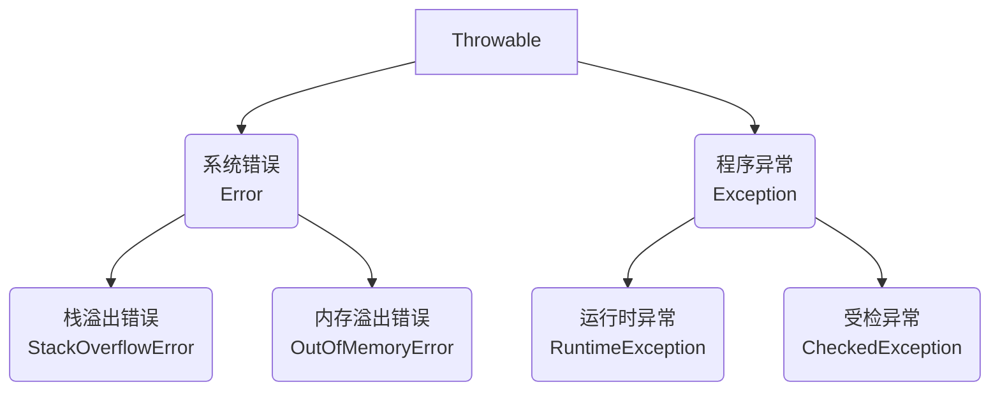
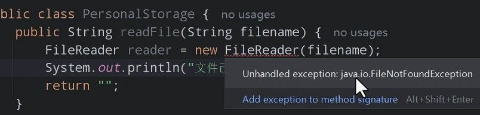

# Arrays 工具类

Arrays 是 Java 提供的数组操作工具类，它包含了一系列静态方法，可以帮助我们高效地处理数组。

### `.sort` 对象数组排序

基本类型数组（如 int[]）可以直接用  Arrays.sort(arr)  排序，但对象数组需要指定比较规则：

**方式一：实现 Comparable  接口**

当对象有"天然排序规则"时（如学生按年龄排序），让类实现 Comparable 接口：

```java
public class Student implements Comparable<Student> {
    private String name;
    private int age;

    @Override
    public int compareTo(Student o) {
        // 按年龄升序
        return this.age - o.age;
    }
}
```

**官方规定：**

- 返回正数：表示左边大于右边
- 返回负数：表示左边小于右边
- 返回零：表示相等

只要这么写，默认就是升序排序。

> 注意：对于浮点数比较，不要直接相减，应使用  Double.compare(this.height, o.height)

**方式二：使用  Comparator 比较器**

如果不想让类本身固定排序规则，或者排序规则经常变，可以用 `Comparator` 比较器。  
这种方式是把“比较规则”写在排序的时候，灵活切换。

```java
Arrays.sort(students, new Comparator<Student>() {
    @Override
    public int compare(Student o1, Student o2) {
        // 按年龄升序
        return o1.getAge() - o2.getAge();
    }
});
```

同样的，返回的值需要整型，如果是两个小数比较，推荐用 `Double.compare(o1.getHeight(), o2.getHeight())`。

# Lambda 表达式

在  Java 8 之前，实现接口需要写匿名内部类的写法正如我们前面介绍的那样：

```java
Arrays.sort(students, new Comparator<Student>() {
    @Override
    public int compare(Student o1, Student o2) {
        // 按年龄升序
        return o1.getAge() - o2.getAge();
    }
});
```

Lambda 表达式让这种"一次性"的功能实现变得简洁，让上面的代码简化成这样：

```java
Arrays.sort(students, (o1, o2) -> o1.getAge() - o2.getAge());
```

Lambda 的标准格式长这样：

```java
(参数列表) -> { 方法体 }
```

它本质上就是把“接口里唯一的抽象方法”用一行语法快速实现了。比如：

```java
// 传统写法：匿名内部类
Animal a1 = new Animal() {
    @Override
    public void run() {
        System.out.println("跑的贼快~~~~");
    }
};
a1.run();
```

如果 Animal 是一个只有一个抽象方法的接口（也叫“函数式接口”），就能用 Lambda 简化：

```java
Animal a2 = () -> System.out.println("跑的贼快~~~~");
a2.run();
```

### 使用条件

需要特别注意的是，Lambda 并不能简化所有匿名内部类的代码，它只能用于简化"函数式接口"的匿名内部类实现。

什么是函数式接口？

- 有且仅有一个抽象方法的接口
- 通常会有  @FunctionalInterface  注解标记（有这个注解的接口必定是函数式接口）

例如，抽象类就不能使用  Lambda：

```java
abstract class Animal {
    public abstract void run();
}
// 这里不能用 Lambda，因为 Animal 是抽象类而非接口
```

而函数式接口则可以：

```java
@FunctionalInterface  // 函数式接口中有且仅有一个抽象方法
interface Swimming {
    void swim();
}

// 传统方式
Swimming s1 = new Swimming() {
    @Override
    public void swim() {
        System.out.println("学生贼溜~~~~");
    }
};
s1.swim();

// Lambda 简化方式
Swimming s2 = () -> System.out.println("学生贼溜~~~~");
s2.swim();
```

### 工作原理

Lambda 之所以能这样简化代码，是因为 Java  编译器能够通过上下文推断出真实的代码形式。编译器根据接口定义自动补全了必要的代码结构。

这在 API 调用中特别有用：

```Java
// 传统方式
Arrays.setAll(scores, new IntToDoubleFunction() {
    @Override
    public double applyAsDouble(int index) {
        return scores[index] + 10;
    }
});

// Lambda 简化方式
Arrays.setAll(scores, (int index) -> {
    return scores[index] + 10;
});
```

### 进阶写法

Lambda 表达式还可以进一步简化，遵循以下规则：

1. 参数类型可以省略不写
2. 如果只有一个参数，参数类型可以省略，同时括号()也可以省略
3. 如果方法体只有一行代码，可以省略大括号，同时如果这行代码是  return 语句，必须去掉  return 关键字

让我们看看同一个例子的逐步简化过程：

```java
// 原始形式
Arrays.setAll(scores, new IntToDoubleFunction() {
    @Override
    public double applyAsDouble(int index) {
        return scores[index] + 10;
    }
});

// 基本 Lambda 形式
Arrays.setAll(scores, (int index) -> {
    return scores[index] + 10;
});

// 省略参数类型
Arrays.setAll(scores, (index) -> {
    return scores[index] + 10;
});

// 单参数省略括号
Arrays.setAll(scores, index -> {
    return scores[index] + 10;
});

// 单行方法体省略大括号和 return
Arrays.setAll(scores, index -> scores[index] + 10);
```

这就是 Lambda 的全部精髓：让“只用一次的小功能”写起来又快又清楚，代码更聚焦于业务本身。

抱歉，我没有很好地遵循您的规则。让我重新整理这部分内容，保持专业风格但带点口语化表达，突出"是什么、为什么、怎么用"，并保持与前面内容一致的风格。

### 方法引用

方法引用是 Java 8 的另一个新特性，它的目的是让已经很简洁的 Lambda 表达式变得更加精简。其实 Lambda 表达式已经足够简洁了，方法引用更多是一种"锦上添花"的语法，了解即可。

#### 静态方法引用

**语法格式：`类名::静态方法`**

当我们的 Lambda 表达式里只是在调用一个静态方法，并且参数完全一致时，就可以使用静态方法引用：

```java
// 假设有个静态方法用于比较学生身高
public static int compareByHeight(Student o1, Student o2) {
    return Double.compare(o1.getHeight(), o2.getHeight());
}

// Lambda 写法
Arrays.sort(students, (o1, o2) -> Student.compareByHeight(o1, o2));

// 静态方法引用写法
Arrays.sort(students, Student::compareByHeight);
```

这种写法虽然简洁，但有时为了使用方法引用而专门定义静态方法:

```
额外定义的静态方法
```

反而会增加代码量。直接使用 `Double.compare()` 可能更加直观。

#### 实例方法引用

**语法格式：`对象::实例方法`**

如果 Lambda 表达式里调用的是某个对象的实例方法，参数列表一致，就可以使用实例方法引用：

```java
// 假设有个比较器对象
Test2 t = new Test2();

// Lambda 写法
Arrays.sort(students, (o1, o2) -> t.compare(o1, o2));

// 实例方法引用
Arrays.sort(students, t::compare);
```

这种方式在实际开发中使用较少，可读性也相对较差，更多是在 JDK 内部使用。

#### 特定类型方法引用

**语法格式：`类型::方法`**

这种形式比较特殊：Lambda 表达式的第一个参数是方法的调用者，剩余参数是方法的参数。这时可以使用特定类型方法引用：

```java
// 需要对字符串数组进行忽略大小写排序
String[] names = {"dlei", "Angela", "baby", "Coach", "andy"};

// Lambda 写法
Arrays.sort(names, (o1, o2) -> o1.compareToIgnoreCase(o2));

// 特定类型方法引用
Arrays.sort(names, String::compareToIgnoreCase);
```

这个例子中，`o1.compareToIgnoreCase(o2)` 正好符合特定类型方法引用的模式，所以可以简化为 `String::compareToIgnoreCase`。

#### 构造器引用

**语法格式：`类名::new`**

当 Lambda 表达式只是用来创建对象时，可以使用构造器引用：

```java
// 定义一个函数式接口
@FunctionalInterface
interface Create {
    Car createCar(String name);
}

// Lambda 写法
Create c1 = name -> new Car(name);

// 构造器引用
Create c1 = Car::new;

// 使用
Car car = c1.createCar("布加迪威龙");
```

构造器引用虽然简洁，但实际应用场景相对有限，更多出现在框架内部或工厂模式中。

方法引用是一种高级语法糖，它让代码在特定场景下更加简洁。但也要注意，过度追求简洁可能会降低代码可读性，所以在实际开发中应当根据团队习惯和代码上下文灵活使用。

# 异常处理

异常是程序执行过程中出现的非正常情况，会导致程序中断，不妥善处理更会使维护成本成倍增长。Java 的异常处理机制为开发者提供了有效应对各种意外情况的工具，是构建稳定且易维护系统的关键保障。

## 异常体系结构

Java 的异常体系以`Throwable`为根，分为两大类：`Error`和`Exception`。


**Error**：表示严重的系统级错误，通常无法在程序中处理，因此作为开发人员不用管它

**Exception**：表示程序级异常，可以在程序中捕获和处理，是重点关注的对象

- **运行时异常**（RuntimeException）：编译器不强制处理，常见于编程逻辑错误
- 编译时异常（CheckedException）：编译器要求必须处理或声明抛出，也称为受检异常

常见的异常类型：

```java
// 常见运行时异常
NullPointerException        // 空指针异常
ArrayIndexOutOfBoundsException  // 数组索引越界异常
ClassCastException          // 类型转换异常
ArithmeticException         // 算术异常（如除以零）

// 常见受检异常
IOException                 // 输入输出异常
SQLException                // 数据库操作异常
ClassNotFoundException      // 类未找到异常
```

## 异常捕获

Java 使用`try-catch-finally`语法结构来捕获和处理异常：

```java
try {
    // 可能产生异常的代码
    FileInputStream file = new FileInputStream("config.txt");
    // ...处理文件
} catch (FileNotFoundException e) {
    // 处理文件未找到异常
    System.out.println("配置文件不存在: " + e.getMessage());
    // 记录日志或提供用户友好的错误信息，而不是简单地忽略异常
} catch (IOException e) {
    // 处理其他IO异常
    System.out.println("读取文件失败: " + e.getMessage());
} finally {
    // 无论是否发生异常，都会执行
    // 在此处关闭资源，确保释放
    if (file != null) {
        try {
            file.close();
        } catch (IOException e) {
            System.out.println("关闭文件失败");
        }
    }
}
```

应当使用具体的异常类型而非泛泛的 Exception，这样可以针对不同错误情况提供更精确的处理：

```java
// 优先捕获具体异常，再捕获更一般的异常
try {
    // 可能产生多种异常的代码
} catch (FileNotFoundException e) {  // 具体异常
    // 针对文件不存在的特定处理
} catch (IOException e) {  // 更一般的异常
    // 处理其他IO问题
}
```

**多异常捕获**（Java 7 及以上版本）：

```java
// 如果多个异常处理方式相同，可以合并捕获
try {
    // 可能产生多种异常的代码
} catch (FileNotFoundException | EOFException e) {
    System.out.println("文件操作失败: " + e.getMessage());
    // 提供有意义的异常信息，帮助诊断问题
}
```

### try-with-resources 语法

Java 7 引入了`try-with-resources`语法，简化了资源管理，避免资源泄漏：

```java
// 自动关闭资源（实现了AutoCloseable接口的对象）
try (FileInputStream file = new FileInputStream("data.txt");
     BufferedReader reader = new BufferedReader(new InputStreamReader(file))) {

    String line = reader.readLine();
    // 处理数据...

} catch (IOException e) {
    // 提供具体的错误信息
    System.out.println("文件读取失败: " + e.getMessage());
}
// 资源会自动关闭，不需要显式调用close()方法
```

这种结构特别适用于文件、数据库连接等需要显式关闭的资源，能够大大简化代码并提高可靠性。

## 异常抛出

当方法无法处理某个异常，可以选择将其抛出，让调用者来处理：

### throws 关键字

在方法声明中使用`throws`关键字声明方法可能抛出的受检异常：

```java
/**
 * 读取配置文件
 * @throws FileNotFoundException 如果配置文件不存在
 * @throws IOException 如果读取过程中发生IO错误
 */
public void readConfig() throws FileNotFoundException, IOException {
    FileInputStream file = new FileInputStream("config.txt");
    // 读取配置文件...
}
```

方法的调用者必须处理这些可能抛出的受检异常：

```java
try {
    readConfig();  // 调用可能抛出异常的方法
} catch (FileNotFoundException e) {
    // 针对文件不存在提供恰当的处理
    System.out.println("配置文件不存在，将使用默认配置");
} catch (IOException e) {
    // 处理其他IO异常
    System.out.println("读取配置失败: " + e.getMessage());
}
```

### throw 关键字

使用`throw`关键字手动抛出异常，通常用于参数验证或业务规则检查：

```java
/**
 * 存款操作
 * @param amount 存款金额
 * @throws IllegalArgumentException 如果存款金额不是正数
 */
public void deposit(double amount) {
    if (amount <= 0) {
        // 提供清晰具体的异常消息，说明问题原因
        throw new IllegalArgumentException("存款金额必须大于0，当前金额: " + amount);
    }

    this.balance += amount;
}
```

抛出异常时提供有意义的异常信息，可以帮助调用者更好地理解和解决问题。

## 自定义异常

当 Java 提供的标准异常不能满足业务需求时，可以创建自定义异常类，使异常的语义更加明确：

```java
/**
 * 余额不足异常
 */
public class InsufficientFundsException extends Exception {  // 选择受检或非受检异常取决于业务需要
    private double balance;
    private double withdrawAmount;

    public InsufficientFundsException(double balance, double withdrawAmount) {
        // 提供详细的异常信息
        super(String.format("余额不足，当前余额: %.2f，取款金额: %.2f", balance, withdrawAmount));
        this.balance = balance;
        this.withdrawAmount = withdrawAmount;
    }

    // 提供getter方法，便于异常处理代码获取额外信息
    public double getBalance() {
        return balance;
    }

    public double getWithdrawAmount() {
        return withdrawAmount;
    }
}
```

使用自定义异常可以创建业务领域相关的异常层次结构：

```java
// 创建基础业务异常
public class BankingException extends Exception {
    public BankingException(String message) {
        super(message);
    }
}

// 特定业务异常继承自基础异常
public class AccountLockedException extends BankingException {
    private String accountId;

    public AccountLockedException(String accountId) {
        super("账户已锁定: " + accountId);
        this.accountId = accountId;
    }

    public String getAccountId() {
        return accountId;
    }
}
```

使用自定义异常：

```java
/**
 * 取款操作
 * @param amount 取款金额
 * @throws AccountLockedException 如果账户已锁定
 * @throws InsufficientFundsException 如果余额不足
 */
public void withdraw(double amount) throws AccountLockedException, InsufficientFundsException {
    // 检查账户状态
    if (locked) {
        throw new AccountLockedException(this.accountId);
    }

    // 检查余额
    if (amount > balance) {
        throw new InsufficientFundsException(balance, amount);
    }

    // 执行取款
    this.balance -= amount;
}
```

自定义异常应当遵循命名约定，通常以"Exception"结尾，并提供足够的上下文信息以便于调试和处理。通过设计良好的异常层次结构，可以使代码更易于理解和维护。

通过合理使用 Java 的异常处理机制，我们可以编写出更加健壮的代码，有效地处理各种意外情况，提高程序的可靠性和用户体验。

# 异常处理

异常就是程序执行过程中导致程序正常执行流程被中断的不确定事件.

Java 对异常进行了总结归类, 然后把他们封装成了不同的类, 形成了一整套的异常继承体系.
其中, 最顶级的父类是 `Throwable` .



Error 是程序之外的错误, 例如:

- StackOverflowError: 栈溢出错误.
- OutOfMemoryFeeoe: 内存溢出错误

Exception 是程序本身的异常, 可以分为

- 运行期异常, 也叫 unchecked 异常
- 编译期异常, 也叫 checked 异常

**高频异常类型**：

```java
// 运行时异常（无需提前处理）
NullPointerException // 空指针
ArrayIndexOutOfBoundsException // 数组越界

// 受检异常（必须处理）
IOException // 文件操作异常
SQLException // 数据库操作异常
```

### 异常捕获

编译期异常, 也就是**受检异常**(checked Exception) 是需要在开发时显式处理的, 不然程序编译不会通过.



处理方案之一就是 `try-carch` 捕获异常.

**基础模板**：

```java
try {
    // 可能出问题的代码
    FileInputStream fis = new FileInputStream("data.txt");
} catch (FileNotFoundException e) {
    // 处理文件未找到的情况
    System.out.println("文件不存在！");
    e.printStackTrace(); // 打印错误栈
} finally {
    // 无论是否异常都会执行
    System.out.println("资源清理操作");
}
```

**多异常处理**：

```java
try {
    int[] arr = new int[3];
    System.out.println(arr[5]); // 可能数组越界
    Integer num = null;
    num.toString(); // 可能空指针
} catch (ArrayIndexOutOfBoundsException | NullPointerException e) {
    System.out.println("发生运行时异常：" + e.getClass().getSimpleName());
}
```

### 异常抛出

异常除了 `try-catch` 捕获以外, 也可通过 `throw` 抛出.
如果抛出的是编译期异常, 还需要再抛出的方法上用 `throws` 声明抛出的异常.

**方法声明抛出**：

```java
// 读取配置文件方法
public static String readConfig() throws IOException {
    return Files.readString(Path.of("config.cfg"));
}
```

**手动抛出异常**：

```java
public class BankAccount {
    private double balance;

    public void withdraw(double amount) throws InsufficientFundsException {
        if(amount > balance) {
            throw new InsufficientFundsException("余额不足");
        }
        balance -= amount;
    }
}
```

### 自定义异常

自定义异常 就是自定义类并继承 `Exception` 或 `Runtime Exception`.
自定义异常有以下好处:

- 能够针对不同业务定义不同异常
- 避免了臃肿的方法声明
- 简化异常处理逻辑
- 更清晰地展示错误信息

**创建自定义异常**：

```java
// 继承RuntimeException（非受检异常）
class InvalidAgeException extends RuntimeException {
    public InvalidAgeException(String message) {
        super(message);
    }
}

// 继承Exception（受检异常）
class PaymentFailedException extends Exception {
    public PaymentFailedException(String errorCode) {
        super("支付失败，错误码：" + errorCode);
    }
}
```

**实际使用**：

```java
public class UserService {
    public void register(int age) {
        if(age < 18) {
            throw new InvalidAgeException("年龄必须≥18岁");
        }
        // 注册逻辑...
    }
}
```

### 总结

1. **不要吞掉异常**

   ```java
   // 错误做法
   try {
       riskyOperation();
   } catch (Exception e) {
       // 空catch块隐藏问题！
   }
   ```

2. **精准捕获原则**

   ```java
   try {
       parseData();
   } catch (NumberFormatException e) {  // 明确异常类型
       handleNumberError();
   } catch (IOException e) {
       handleIOError();
   }
   ```

3. **finally 资源释放**
   ```java
   BufferedReader br = null;
   try {
       br = new BufferedReader(new FileReader("data.txt"));
       // 读取操作...
   } finally {
       if(br != null) {
           br.close(); // 确保文件流关闭
       }
   }
   ```
