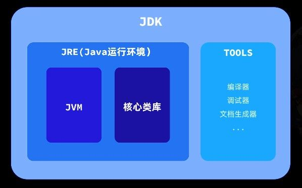
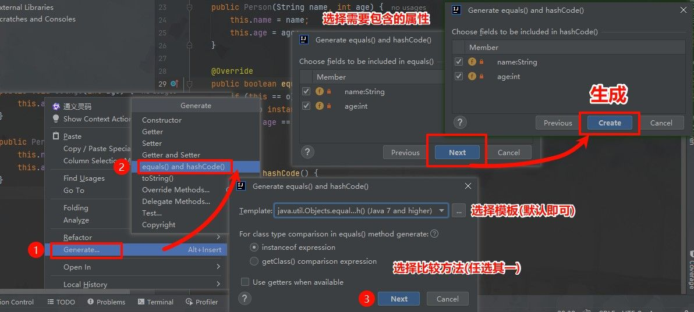
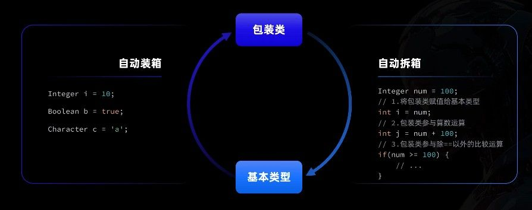
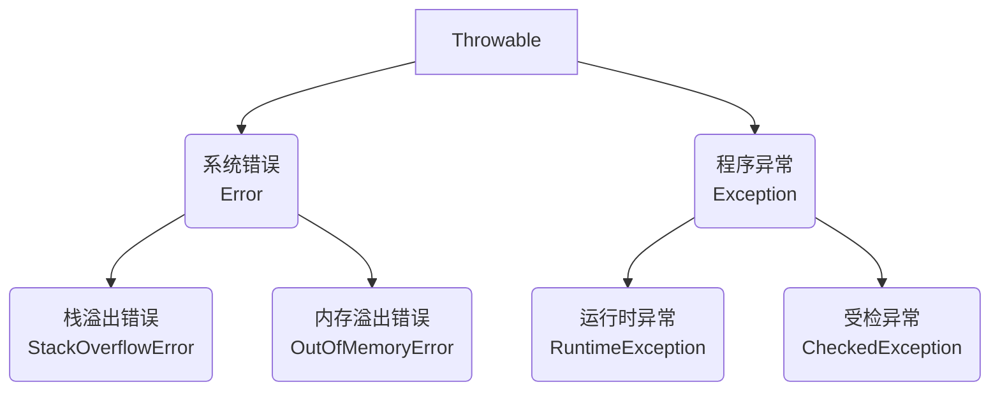

API(Application Programming Interface)，即应用程序接口，是预先定义好的一套规则和标准，使不同的应用程序能够互相通信和协作。

想象一下，API 就像餐厅的菜单，告诉你可以点什么菜（功能），但不会告诉你厨师是如何做这道菜的（实现细节）。

在 Java 中，核心类库就是 Java 官方为开发者提供的一套标准 API。掌握这些 API，就像拥有了一整箱精密工具，能够更高效地构建应用程序。



[Java® 平台、标准版和 Java 开发工具包 版本 17 API 规范](https://doc.qzxdp.cn/jdk/17/zh/api/index.html)

# Object 类

Object 类是 Java 中所有类的父类，每个类都直接或间接地继承自 Object。这意味着任何 Java 对象都能使用 Object 类中定义的方法。

## equals 方法

equals 方法用于比较两个对象是否相等。比较对象时，应该使用`equals()`而不是`==`操作符。

因为`==`比较的是对象的引用（内存地址），而我们通常需要比较的是对象的内容。

Object 类中 equals 的默认实现：

```java
public boolean equals(Object obj) {
    return (this == obj);
}
```

> 在 IDE 中，按住 Ctrl 点击方法名可以跳转到其实现类。

Object 类只提供了基础实现，许多类（如 String）都重写了这个方法来实现符合业务逻辑的比较。例如：

```java
// 自定义Person类重写equals方法
@Override
public boolean equals(Object obj) {
    // 先检查是否为同一引用
    if (this == obj) return true;

    // 类型安全检查
    if (!(obj instanceof Person)) return false;

    // 强制类型转换并比较关键属性
    Person other = (Person) obj;
    return this.name.equals(other.name) && this.age == other.age;
}
```

重写 equals 方法时，通常也需要重写 hashCode 方法。

## hashCode 方法

hashCode 方法根据对象的内容生成一个整数值，这个值主要用于哈希表数据结构中（如 HashMap、HashSet）。

哈希表通过这个值快速确定对象在内部存储的位置，这也是为什么 hashCode 与 equals 关系密切。

hashCode 方法必须遵守以下规则：

- 同一个对象多次调用，必须返回相同的整数
- 如果两个对象的 equals 方法比较为 true，它们的 hashCode 必须相同
- 不同的对象应该尽量产生不同的 hashCode（虽然不是强制的）

Object 的默认 hashCode 实现使用了对象的内存地址：

```java

public native int hashCode();  // 原生方法，由JVM底层实现

```

当重写 equals 方法时，必须同时重写 hashCode 方法，确保满足上述规则。现代 IDE 提供了自动生成这两个方法的功能：



生成的代码通常如下：

```java
@Override
public boolean equals(Object o) {
    if (this == o) return true;
    if (!(o instanceof Person person)) return false;
    return age == person.age && Objects.equals(name, person.name);
}

@Override
public int hashCode() {
    return Objects.hash(name, age);  // 基于关键属性计算
}
```

## toString 方法

toString 方法返回对象的字符串表示形式，让我们能够更直观地了解对象包含的数据。当我们直接打印一个对象，或者将对象与字符串进行拼接时，Java 会自动调用该对象的 toString 方法。

Object 类中 toString 方法的默认实现如下：

```java
public String toString() {
    return getClass().getName() + "@" + Integer.toHexString(hashCode());
}
```

这个实现会返回：

- 类的完整名称（包含包名）
- 一个@符号
- 对象哈希码的十六进制表示

例如：`com.example.Person@15db9742`

这样的输出对调试帮助有限，因为它并没有告诉我们对象的实际内容。因此，在实际开发中，我们通常会重写 toString 方法来展示对象的关键属性。

一个好的 toString 实现应该包括类名和关键字段的值，例如：

```java
@Override
public String toString() {
    return "Person{name='" + name + "', age=" + age + "}";
}
```

使用这种重写后的 toString 方法，打印对象时就能看到有意义的信息：`Person{name='张三', age=25}`

和前面提到的 equals 和 hashCode 方法一样，现代 IDE 也提供了自动生成 toString 方法的功能，可以根据类的字段自动生成合适的实现。

# String 类

String 是 Java 中使用频率最高的引用类型之一，用于表示文本内容。它有一个重要特点：可以直接使用字符串字面量创建对象，而不必像其他引用类型那样必须使用`new`关键字。

```java
// 直接使用字符串字面量创建
String name = "Java学习";

// 普通引用类型的创建方式
StringBuilder sb = new StringBuilder();
```

## 创建方式（拓展）

实际开发中，**推荐使用字符串字面量的方式创建字符串**，这样更加简洁。

除了使用字面量，String 类还提供了多种构造方法。下面是几种常见的构造方法：

**1. 根据现有字符串创建新的字符串对象**

```java
String(String original)
// 示例
String copy = new String("原始字符串");
```

**2. 使用平台默认编码将字节数组转换为字符串**

```java
String(byte[] bytes)
// 示例
byte[] data = {72, 101, 108, 108, 111}; // ASCII码对应Hello
String text = new String(data);
```

**3. 使用指定编码将字节数组转换为字符串**

```java
String(byte[] bytes, Charset charset)
// 示例
byte[] data = {-28, -67, -96, -27, -91, -67}; // UTF-8编码的"中文"
String text = new String(data, StandardCharsets.UTF_8);
```

**4. 将字符数组转换为字符串**

```java
String(char[] value)
// 示例
char[] chars = {'J', 'a', 'v', 'a'};
String language = new String(chars);
```

## 字符串常量池

Java 中的字符串字面量会被存储在一个特殊的内存区域，称为"字符串常量池"。这种设计有助于节省内存，因为相同内容的字符串可以共享同一个实例。


**字面量创建与 new 创建的区别**：

- 使用字面量创建字符串时，JVM 会先检查常量池中是否存在相同内容的字符串

  - 如果存在，则直接返回常量池中的引用
  - 如果不存在，则在常量池中创建新的字符串对象

- 使用 new 创建字符串时，无论常量池中是否存在相同内容的字符串，都会在堆内存中创建新的对象

这种区别可以通过一个简单示例展示：

```java
// 字符串常量池示例
String s1 = "Hello";  // 在常量池中创建"Hello"
String s2 = "Hello";  // 复用常量池中的"Hello"
String s3 = new String("Hello");  // 在堆内存中创建新对象

// 比较引用是否相同
System.out.println(s1 == s2);  // true (同一个对象)
System.out.println(s1 == s3);  // false (不同对象)

// 比较内容是否相同
System.out.println(s1.equals(s3)); // true (内容相同)
```

这也是推荐使用字面量的一个原因，其能够利用字符串常量池提高内存使用效率。

## intern 方法

当我们需要手动将字符串添加到常量池中时，可以使用`intern()`方法：

```java
// intern方法示例
String str1 = new String("计算机");  // 堆内存中的对象
String str2 = str1.intern();         // 获取常量池中的引用
String str3 = "计算机";              // 直接从常量池获取
```

这个方法的工作原理是：

- 检查常量池中是否已存在内容相同的字符串
- 若存在，返回常量池中的引用
- 若不存在，将此字符串添加到常量池并返回其引用

验证效果：

```java
// 验证intern的效果
System.out.println(str1 == str2);  // false，str1指向堆内存，str2指向常量池
System.out.println(str2 == str3);  // true，str2和str3都指向常量池中的同一对象
```

通过合理使用字符串常量池和 intern 方法，可以在处理大量重复字符串时优化内存使用。不过，除非有特殊需求，否则一般**不需要**手动调用 intern 方法。

## 判断与比较方法

String 类提供了一系列用于判断和比较字符串的方法，这些方法让我们能够灵活地处理各种字符串操作场景。

### 内容比较

比较字符串的内容是否相同，是最基本的字符串操作之一：

```java
// 严格比较字符串内容是否完全相同（区分大小写）
boolean equals(Object obj)

// 比较字符串内容是否相同（忽略大小写）
boolean equalsIgnoreCase(String str)
```

使用示例：

```java
String str1 = "Hello";
String str2 = "hello";

System.out.println(str1.equals(str2));         // false（大小写敏感）
System.out.println(str1.equalsIgnoreCase(str2)); // true（忽略大小写）
```

### 空值检查

检查字符串是否为空是处理用户输入或外部数据时的常见需求：

```java
// 检查字符串长度是否为0（即""）
boolean isEmpty()

// 检查字符串是否为空或全为空白字符（Java 11+）
boolean isBlank()
```

这两个方法的区别在于对空白字符的处理：

```java
System.out.println("".isEmpty());     // true
System.out.println("   ".isEmpty());  // false（含空格）

System.out.println("   ".isBlank());  // true
System.out.println(" \t\n".isBlank());// true（含制表符、换行符）
```

### 前后缀检查

判断字符串的开头或结尾是否匹配特定内容：

```java
// 判断字符串是否以指定前缀开头
boolean startsWith(String prefix)

// 判断字符串是否以指定后缀结尾
boolean endsWith(String suffix)
```

这些方法在处理文件路径、URL 等场景中特别有用：

```java
String path = "/data/images/photo.jpg";

System.out.println(path.startsWith("/data")); // true
System.out.println(path.endsWith(".jpg"));    // true
System.out.println(path.endsWith(".png"));    // false
```

### 内容匹配

检查字符串是否包含特定内容：

```java
// 判断是否包含指定子字符串
boolean contains(CharSequence cs)

// 判断是否符合正则表达式规则
boolean matches(String regex)
```

实际应用示例：

```java
// 检查文本中是否包含关键词
String text = "Java编程基础";
System.out.println(text.contains("编程"));  // true

// 使用正则表达式验证手机号格式
String phone = "13800138000";
System.out.println(phone.matches("1[3-9]\\d{9}")); // true
```

通过合理组合这些判断方法，我们可以构建出强大而灵活的字符串处理逻辑，满足各种业务场景需求。

## 获取方法

String 类提供了多种方法用于获取字符串的特定信息或提取字符串的特定部分，这些方法是字符串处理的基础。

### 基础属性获取

要获取字符串的基本属性，可以使用以下方法：

```java
// 获取字符串的长度（字符数量）
int length()

// 获取指定索引位置的字符
char charAt(int index)
```

这些方法使我们能够了解字符串的基本结构：

```java
String text = "Java编程";
System.out.println(text.length());   // 5（注意：一个中文字符的长度为1）
System.out.println(text.charAt(0));  // 'J'
System.out.println(text.charAt(4));  // '程'
```

> 注意：字符串索引从 0 开始，如果索引超出范围会抛出 StringIndexOutOfBoundsException 异常。

### 切割与截取

从字符串中提取特定部分是常见操作：

```java
// 按照正则表达式分割字符串
String[] split(String regex)

// 截取指定索引范围的子字符串（含起始，不含结束）
String substring(int beginIndex, int endIndex)

// 从指定位置截取到末尾
String substring(int beginIndex)
```

使用示例：

```java
// 分割字符串
String data = "张三,李四,王五";
String[] names = data.split(",");  // 得到["张三", "李四", "王五"]

// 截取子字符串
String url = "https://www.example.com";
String domain = url.substring(8, 21);  // "www.example"
String topDomain = url.substring(21);  // ".com"
```

### 查找定位

查找字符或子字符串在原字符串中的位置：

```java
// 查找字符/字符串首次出现的位置
int indexOf(String str)
int indexOf(int ch)  // 可以传入字符或ASCII码

// 查找字符/字符串最后一次出现的位置
int lastIndexOf(String str)

// 从指定位置开始查找
int indexOf(String str, int fromIndex)
```

使用这些方法可以帮助我们确定字符串中特定内容的位置：

```java
String sentence = "Java是一门面向对象的编程语言";

// 查找子字符串位置
int pos = sentence.indexOf("编程");  // 返回9
int notFound = sentence.indexOf("Python");  // 返回-1（未找到）

// 查找字符位置
int charPos = sentence.indexOf('向');  // 返回6

// 查找最后一次出现的位置
String repeat = "香蕉,苹果,香蕉,橙子";
int last = repeat.lastIndexOf("香蕉");  // 返回6
```

> 当查找不到指定内容时，indexOf 和 lastIndexOf 方法都返回-1。

### 类型转换

字符串可以转换为其他数据类型：

```java
// 转换为字符数组
char[] toCharArray()

// 转换为字节数组（使用平台默认编码）
byte[] getBytes()

// 使用指定编码转换为字节数组
byte[] getBytes(Charset charset)
```

这些转换方法在处理文件 IO 或网络传输时特别有用：

```java
String message = "Hello";

// 转换为字符数组
char[] chars = message.toCharArray();  // ['H', 'e', 'l', 'l', 'o']

// 转换为字节数组
byte[] bytes = message.getBytes();  // [72, 101, 108, 108, 111]

// 使用特定编码转换
byte[] utf8Bytes = message.getBytes(StandardCharsets.UTF_8);
```

掌握这些获取方法，可以让我们更高效地处理各种字符串操作任务，从简单的字符提取到复杂的文本分析都能游刃有余。

## 转换方法

String 类提供了丰富的转换方法，让我们能够轻松修改文本内容。无论是替换字符、改变大小写，还是处理空格，都可以通过这些方法实现。

### 替换操作

替换是字符串处理中最常用的操作之一：

```java
// 替换所有匹配的字符/字符串
String replace(CharSequence target, CharSequence replacement)

// 使用正则表达式替换所有匹配项
String replaceAll(String regex, String replacement)

// 只替换第一个匹配的正则表达式
String replaceFirst(String regex, String replacement)
```

这些方法的使用场景各有不同：

```java
// 简单替换
String text = "Hello World!";
String result = text.replace("l", "*");  // "He**o Wor*d!"

// 正则表达式替换
String code = "用户ID: 12345, 余额: 9876";
String masked = code.replaceAll("\\d", "*");  // "用户ID: *****, 余额: ****"

// 只替换首次出现
String date = "2023-04-05-2023";
String fixed = date.replaceFirst("2023", "2024");  // "2024-04-05-2023"
```

### 大小写转换

改变字符串的大小写是国际化应用中常见需求：

```java
// 将字符串全部转换为小写
String toLowerCase()

// 将字符串全部转换为大写
String toUpperCase()
```

这些方法会智能地处理各种语言的大小写规则：

```java
String mixed = "Java Programming";
System.out.println(mixed.toLowerCase());  // "java programming"
System.out.println(mixed.toUpperCase());  // "JAVA PROGRAMMING"

// 支持国际字符
String german = "Äpfel";  // 德语"苹果"
System.out.println(german.toLowerCase());  // "äpfel"
```

### 空格处理

处理字符串首尾的空白字符：

```java
// 删除字符串前后的空白字符（Java 11+）
String strip()

// 删除字符串前后的空格、制表符、换行符等（传统方法）
String trim()
```

这两个方法有微妙但重要的区别：

```java
// trim()只处理ASCII空白字符（空格、制表符等）
String text = "  Hello  ";
System.out.println(text.trim());  // "Hello"

// strip()能处理所有Unicode空白字符（包括全角空格等）
String textWithUnicode = "　Hello　";  // 含有全角空格
System.out.println(textWithUnicode.strip());  // "Hello"
System.out.println(textWithUnicode.trim());   // "　Hello　"（全角空格未被去除）
```

### 格式化字符串

创建格式化文本时，可以使用静态方法：

```java
// 使用指定格式创建字符串
static String format(String format, Object... args)
```

这个方法类似于 C 语言中的 printf：

```java
// 创建格式化字符串
String message = String.format("用户: %s, 年龄: %d", "张三", 25);
System.out.println(message);  // "用户: 张三, 年龄: 25"

// 格式化数值
String price = String.format("价格: %.2f元", 99.8);
System.out.println(price);  // "价格: 99.80元"
```

这些转换方法都有一个重要特点：**它们不会修改原始字符串**，而是返回一个新的字符串。这是因为 Java 中的 String 类是不可变的（immutable），确保了字符串操作的线程安全性。

## 拼接方法

Java 提供了多种字符串拼接方式，适用于不同的场景。选择合适的拼接方法可以提高代码效率和可读性。

### 使用+运算符

最简单直观的字符串拼接方式是使用加号运算符：

```java
// 使用+运算符拼接字符串
String firstName = "张";
String lastName = "三";
String fullName = firstName + lastName;  // "张三"

// 可以同时拼接多个值和不同类型
int age = 25;
String info = "姓名：" + fullName + "，年龄：" + age;  // "姓名：张三，年龄：25"
```

虽然+运算符使用方便，但在循环中频繁拼接字符串会导致性能问题，因为每次拼接都会创建新的字符串对象。

### 静态拼接方法：String.join()

Java 8 引入了`String.join()`方法，可以使用指定的分隔符拼接多个字符串：

```java
// 使用分隔符拼接多个元素
String result = String.join("-", "2023", "10", "05");
System.out.println(result);  // "2023-10-05"

// 拼接集合或数组中的元素
List<String> colors = Arrays.asList("红", "橙", "黄", "绿");
String colorList = String.join("、", colors);
System.out.println(colorList);  // "红、橙、黄、绿"
```

这种方法特别适合将集合或数组中的多个元素拼接成一个带分隔符的字符串。

### 高效拼接工具：StringBuilder

对于需要频繁拼接字符串的场景，尤其是在循环中，应该使用`StringBuilder`类：

```java
// 创建StringBuilder对象
StringBuilder sb = new StringBuilder();

// 添加内容
sb.append("订单信息：")
  .append("\n商品名称：手机")
  .append("\n价格：").append(3999)
  .append("\n数量：").append(2);

// 获取最终字符串
String orderInfo = sb.toString();
```

StringBuilder 提供了多种方法操作字符串内容：

```java
// 常用方法示例
StringBuilder builder = new StringBuilder("Hello");

// 追加内容
builder.append(" World");  // "Hello World"

// 插入内容
builder.insert(5, ",");    // "Hello, World"

// 替换内容
builder.replace(0, 5, "Hi");  // "Hi, World"

// 删除内容
builder.delete(2, 4);      // "Hi World"
```

### 线程安全替代方案：StringBuffer

在多线程环境中，`StringBuilder`不是线程安全的，此时应使用`StringBuffer`：

```java
// 用法与StringBuilder基本相同，但线程安全
StringBuffer buffer = new StringBuffer();
buffer.append("多线程");
buffer.append("环境");
```

`StringBuffer`的所有方法都是同步的，可以安全地在多线程环境中使用，但同步操作会带来一些性能开销。

### 性能考虑

在不同场景下，字符串拼接的性能差异显著：

```java
// 低效示例：在循环中使用+拼接
String result = "";
for (int i = 0; i < 10000; i++) {
    result += i;  // 每次循环创建新对象，效率低下
}

// 高效示例：使用StringBuilder
StringBuilder sb = new StringBuilder();
for (int i = 0; i < 10000; i++) {
    sb.append(i);  // 操作同一个对象，效率高
}
String efficientResult = sb.toString();
```

在实际开发中：

- 简单拼接少量字符串：使用+运算符
- 拼接数组或集合元素：使用 String.join()
- 复杂或循环拼接：使用 StringBuilder
- 多线程环境：使用 StringBuffer

字符串拼接是 Java 编程中非常常见的操作，掌握这些方法能够帮助我们编写更高效、更优雅的代码。

# 包装类

包装类是 Java 为每种基本数据类型提供的对应引用类型。它们将基本类型"包装"成对象，使其能够在面向对象的环境中使用。

## 基本类型与包装类对应关系

Java 中的八种基本数据类型都有对应的包装类：

```java
// 基本类型 -> 包装类
byte -> Byte
short -> Short
int -> Integer
long -> Long
float -> Float
double -> Double
boolean -> Boolean
char -> Character
```

这些包装类都位于`java.lang`包中，可以直接使用而无需导入。


## 包装类的作用

包装类存在的主要目的是：

1. **支持面向对象编程**：基本类型不是对象，无法调用方法，而包装类是对象，可以调用方法
2. **作为泛型类型参数**：泛型不支持基本数据类型，只能使用包装类
3. **支持 null 值**：基本类型不能为 null，而包装类可以
4. **提供实用工具方法**：如类型转换、数值比较、进制转换等

```java
// 无法对基本类型使用泛型
// ArrayList<int> list1 = new ArrayList<>(); // 编译错误

// 使用包装类作为泛型类型参数
ArrayList<Integer> list2 = new ArrayList<>(); // 正确

// 包装类可以表示null值
Integer nullValue = null; // 合法
```

## 内存结构差异

基本类型和包装类在内存存储方面有明显区别：

```java
int primitive = 10;     // 直接在栈中存储值10
Integer wrapper = 10;   // 在堆中创建Integer对象，栈中存储引用
```

基本类型变量直接存储值，而包装类变量存储的是引用，指向堆内存中的对象。

## 自动装箱与拆箱

自 JDK 1.5 起，Java 引入了自动装箱和拆箱机制，简化了基本类型和包装类的相互转换：

```java
// 自动装箱：基本类型 -> 包装类
Integer num = 100;  // 编译器自动转换为：Integer num = Integer.valueOf(100);

// 自动拆箱：包装类 -> 基本类型
int value = num;    // 编译器自动转换为：int value = num.intValue();
```

自动装箱和拆箱的原理如下图所示：



这一机制极大地简化了代码，但也带来了一些需要注意的问题。

### 空指针风险

自动拆箱最大的风险是可能导致`NullPointerException`：

```java
Integer price = null;
// 自动拆箱时，如果包装类对象为null，会抛出NullPointerException
int discount = price + 10; // 运行时错误
```

在实际开发中，应该养成先检查 null 的习惯：

```java
Integer price = getPrice(); // 可能返回null
int realPrice = (price != null) ? price : 0; // 安全的拆箱方式
```

## 常用方法

包装类提供了丰富的工具方法，常用的有：

### 类型转换方法

```java
// 字符串转换为基本类型
int i = Integer.parseInt("123");      // 123
double d = Double.parseDouble("3.14"); // 3.14

// 字符串转换为包装类
Integer integer = Integer.valueOf("123");
Boolean bool = Boolean.valueOf("true");

// 包装类转字符串
String s1 = integer.toString();  // "123"
```

### 进制转换方法

```java
// 十进制转二进制表示
String binary = Integer.toBinaryString(10);  // "1010"

// 十进制转十六进制表示
String hex = Integer.toHexString(255);  // "ff"

// 十进制转八进制表示
String octal = Integer.toOctalString(8);  // "10"

// 其他进制转十进制
int decimal = Integer.parseInt("1010", 2);  // 10，将二进制"1010"转为十进制
```

### 数值范围常量

每个数值包装类都提供了表示其范围的常量：

```java
// 最大值和最小值常量
int maxInt = Integer.MAX_VALUE;  // 2147483647
int minInt = Integer.MIN_VALUE;  // -2147483648
double maxDouble = Double.MAX_VALUE;  // 1.7976931348623157E308
```

这些常量在需要边界值检查时非常有用。

## 对象缓存机制

Java 中的包装类为了提高性能，实现了一个重要的优化策略——对象缓存机制。这个机制预先创建并缓存了一定范围内的包装类对象，当需要这些值时直接返回缓存的对象，而不是创建新实例。

### 缓存范围

不同包装类的缓存范围不同：

```java
// Integer缓存范围：-128到127
Integer.valueOf(-128) == Integer.valueOf(-128);  // true
Integer.valueOf(127) == Integer.valueOf(127);    // true
Integer.valueOf(128) == Integer.valueOf(128);    // false

// Character缓存范围：0到127（ASCII范围）
Character.valueOf((char)0) == Character.valueOf((char)0);    // true
Character.valueOf((char)127) == Character.valueOf((char)127);  // true

// Boolean全部缓存：只有true和false两个值
Boolean.valueOf(true) == Boolean.valueOf(true);   // true
Boolean.valueOf(false) == Boolean.valueOf(false); // true

// Byte全部缓存：-128到127（Byte的完整范围）
Byte.valueOf((byte)10) == Byte.valueOf((byte)10); // true
```

### 缓存原理与陷阱

自动装箱实际上是调用包装类的`valueOf()`方法，而该方法会使用缓存：

```java
// 这两条语句在缓存范围内返回相同对象
Integer a = 100;  // 自动装箱，实际调用了Integer.valueOf(100)
Integer b = 100;  // 同上，返回相同的缓存对象

System.out.println(a == b);  // true，因为是同一个对象

// 超出缓存范围，创建新对象
Integer c = 200;
Integer d = 200;

System.out.println(c == d);  // false，不同对象
```

这种机制可能导致一个常见的陷阱：使用`==`来比较包装类对象。

### 正确比较包装类对象

由于缓存机制，在代码中**不应该使用`==`比较包装类对象**：

```java
// 错误的比较方式
if (integerObj1 == integerObj2) { /* 不可靠的比较 */ }

// 正确的比较方式
// 1. 比较值是否相等
if (integerObj1.equals(integerObj2)) { /* 安全的值比较 */ }

// 2. 比较大小关系
if (integerObj1.compareTo(integerObj2) > 0) { /* 大小比较 */ }
```

`equals()`方法比较对象的值是否相同，而`compareTo()`方法比较对象的大小关系，两者都是安全可靠的。

### 性能优化建议

基于对象缓存机制和装箱拆箱特性，在编码时可以遵循以下建议：

```java
// 1. 在性能敏感场景优先使用基本类型
long sum = 0L;  // 而不是 Long sum = 0L;
for (int i = 0; i < 10000; i++) {
    sum += i;   // 如果使用Long，每次循环都有装箱拆箱开销
}

// 2. 避免频繁的自动装箱和拆箱
// 不推荐
Integer total = 0;
for (int i = 0; i < 1000; i++) {
    total = total + i;  // 每次循环都会创建新的Integer对象
}

// 推荐
int total = 0;
for (int i = 0; i < 1000; i++) {
    total += i;  // 没有对象创建的开销
}
Integer result = total;  // 只装箱一次
```

通过理解包装类的对象缓存机制，我们可以避免常见陷阱，并编写更高效的 Java 代码。

# 异常处理

异常是程序执行过程中出现的非正常情况，会导致程序中断。Java 通过一套完善的异常处理机制，让开发者能够有效地处理各种意外情况，提高程序的健壮性。

## 异常体系结构

Java 的异常体系以`Throwable`为根，分为两大类：`Error`和`Exception`。



- **Error**：表示严重的系统级错误，通常无法在程序中处理
  - 例如：`StackOverflowError`（栈溢出）、`OutOfMemoryError`（内存溢出）
- **Exception**：表示程序级异常，可以在程序中捕获和处理
  - **运行时异常**（RuntimeException）：编译器不强制处理，常见于编程逻辑错误
  - **受检异常**（CheckedException）：编译器要求必须处理或声明抛出

常见的异常类型：

```java
// 常见运行时异常
NullPointerException        // 空指针异常
ArrayIndexOutOfBoundsException  // 数组索引越界异常
ClassCastException          // 类型转换异常
ArithmeticException         // 算术异常（如除以零）

// 常见受检异常
IOException                 // 输入输出异常
SQLException                // 数据库操作异常
ClassNotFoundException      // 类未找到异常
```

## 异常捕获

Java 使用`try-catch-finally`语法结构来捕获和处理异常：

```java
try {
    // 可能产生异常的代码
    FileInputStream file = new FileInputStream("config.txt");
    // ...处理文件
} catch (FileNotFoundException e) {
    // 处理文件未找到异常
    System.out.println("配置文件不存在: " + e.getMessage());
    // 记录日志或提供用户友好的错误信息，而不是简单地忽略异常
} catch (IOException e) {
    // 处理其他IO异常
    System.out.println("读取文件失败: " + e.getMessage());
} finally {
    // 无论是否发生异常，都会执行
    // 在此处关闭资源，确保释放
    if (file != null) {
        try {
            file.close();
        } catch (IOException e) {
            System.out.println("关闭文件失败");
        }
    }
}
```

应当使用具体的异常类型而非泛泛的 Exception，这样可以针对不同错误情况提供更精确的处理：

```java
// 优先捕获具体异常，再捕获更一般的异常
try {
    // 可能产生多种异常的代码
} catch (FileNotFoundException e) {  // 具体异常
    // 针对文件不存在的特定处理
} catch (IOException e) {  // 更一般的异常
    // 处理其他IO问题
}
```

**多异常捕获**（Java 7 及以上版本）：

```java
// 如果多个异常处理方式相同，可以合并捕获
try {
    // 可能产生多种异常的代码
} catch (FileNotFoundException | EOFException e) {
    System.out.println("文件操作失败: " + e.getMessage());
    // 提供有意义的异常信息，帮助诊断问题
}
```

### try-with-resources 语法

Java 7 引入了`try-with-resources`语法，简化了资源管理，避免资源泄漏：

```java
// 自动关闭资源（实现了AutoCloseable接口的对象）
try (FileInputStream file = new FileInputStream("data.txt");
     BufferedReader reader = new BufferedReader(new InputStreamReader(file))) {

    String line = reader.readLine();
    // 处理数据...

} catch (IOException e) {
    // 提供具体的错误信息
    System.out.println("文件读取失败: " + e.getMessage());
}
// 资源会自动关闭，不需要显式调用close()方法
```

这种结构特别适用于文件、数据库连接等需要显式关闭的资源，能够大大简化代码并提高可靠性。

## 异常抛出

当方法无法处理某个异常，可以选择将其抛出，让调用者来处理：

### throws 关键字

在方法声明中使用`throws`关键字声明方法可能抛出的受检异常：

```java
/**
 * 读取配置文件
 * @throws FileNotFoundException 如果配置文件不存在
 * @throws IOException 如果读取过程中发生IO错误
 */
public void readConfig() throws FileNotFoundException, IOException {
    FileInputStream file = new FileInputStream("config.txt");
    // 读取配置文件...
}
```

方法的调用者必须处理这些可能抛出的受检异常：

```java
try {
    readConfig();  // 调用可能抛出异常的方法
} catch (FileNotFoundException e) {
    // 针对文件不存在提供恰当的处理
    System.out.println("配置文件不存在，将使用默认配置");
} catch (IOException e) {
    // 处理其他IO异常
    System.out.println("读取配置失败: " + e.getMessage());
}
```

### throw 关键字

使用`throw`关键字手动抛出异常，通常用于参数验证或业务规则检查：

```java
/**
 * 存款操作
 * @param amount 存款金额
 * @throws IllegalArgumentException 如果存款金额不是正数
 */
public void deposit(double amount) {
    if (amount <= 0) {
        // 提供清晰具体的异常消息，说明问题原因
        throw new IllegalArgumentException("存款金额必须大于0，当前金额: " + amount);
    }

    this.balance += amount;
}
```

抛出异常时提供有意义的异常信息，可以帮助调用者更好地理解和解决问题。

## 自定义异常

当 Java 提供的标准异常不能满足业务需求时，可以创建自定义异常类，使异常的语义更加明确：

```java
/**
 * 余额不足异常
 */
public class InsufficientFundsException extends Exception {  // 选择受检或非受检异常取决于业务需要
    private double balance;
    private double withdrawAmount;

    public InsufficientFundsException(double balance, double withdrawAmount) {
        // 提供详细的异常信息
        super(String.format("余额不足，当前余额: %.2f，取款金额: %.2f", balance, withdrawAmount));
        this.balance = balance;
        this.withdrawAmount = withdrawAmount;
    }

    // 提供getter方法，便于异常处理代码获取额外信息
    public double getBalance() {
        return balance;
    }

    public double getWithdrawAmount() {
        return withdrawAmount;
    }
}
```

使用自定义异常可以创建业务领域相关的异常层次结构：

```java
// 创建基础业务异常
public class BankingException extends Exception {
    public BankingException(String message) {
        super(message);
    }
}

// 特定业务异常继承自基础异常
public class AccountLockedException extends BankingException {
    private String accountId;

    public AccountLockedException(String accountId) {
        super("账户已锁定: " + accountId);
        this.accountId = accountId;
    }

    public String getAccountId() {
        return accountId;
    }
}
```

使用自定义异常：

```java
/**
 * 取款操作
 * @param amount 取款金额
 * @throws AccountLockedException 如果账户已锁定
 * @throws InsufficientFundsException 如果余额不足
 */
public void withdraw(double amount) throws AccountLockedException, InsufficientFundsException {
    // 检查账户状态
    if (locked) {
        throw new AccountLockedException(this.accountId);
    }

    // 检查余额
    if (amount > balance) {
        throw new InsufficientFundsException(balance, amount);
    }

    // 执行取款
    this.balance -= amount;
}
```

自定义异常应当遵循命名约定，通常以"Exception"结尾，并提供足够的上下文信息以便于调试和处理。通过设计良好的异常层次结构，可以使代码更易于理解和维护。

通过合理使用 Java 的异常处理机制，我们可以编写出更加健壮的代码，有效地处理各种意外情况，提高程序的可靠性和用户体验。

# 异常处理

异常就是程序执行过程中导致程序正常执行流程被中断的不确定事件.

Java 对异常进行了总结归类, 然后把他们封装成了不同的类, 形成了一整套的异常继承体系.
其中, 最顶级的父类是 `Throwable` .


Error 是程序之外的错误, 例如:

- StackOverflowError: 栈溢出错误.
- OutOfMemoryFeeoe: 内存溢出错误

Exception 是程序本身的异常, 可以分为

- 运行期异常, 也叫 unchecked 异常
- 编译期异常, 也叫 checked 异常

**高频异常类型**：

```java
// 运行时异常（无需提前处理）
NullPointerException // 空指针
ArrayIndexOutOfBoundsException // 数组越界

// 受检异常（必须处理）
IOException // 文件操作异常
SQLException // 数据库操作异常
```

### 异常捕获

编译期异常, 也就是**受检异常**(checked Exception) 是需要在开发时显式处理的, 不然程序编译不会通过.


处理方案之一就是 `try-carch` 捕获异常.

**基础模板**：

```java
try {
    // 可能出问题的代码
    FileInputStream fis = new FileInputStream("data.txt");
} catch (FileNotFoundException e) {
    // 处理文件未找到的情况
    System.out.println("文件不存在！");
    e.printStackTrace(); // 打印错误栈
} finally {
    // 无论是否异常都会执行
    System.out.println("资源清理操作");
}
```

**多异常处理**：

```java
try {
    int[] arr = new int[3];
    System.out.println(arr[5]); // 可能数组越界
    Integer num = null;
    num.toString(); // 可能空指针
} catch (ArrayIndexOutOfBoundsException | NullPointerException e) {
    System.out.println("发生运行时异常：" + e.getClass().getSimpleName());
}
```

### 异常抛出

异常除了 `try-catch` 捕获以外, 也可通过 `throw` 抛出.
如果抛出的是编译期异常, 还需要再抛出的方法上用 `throws` 声明抛出的异常.

**方法声明抛出**：

```java
// 读取配置文件方法
public static String readConfig() throws IOException {
    return Files.readString(Path.of("config.cfg"));
}
```

**手动抛出异常**：

```java
public class BankAccount {
    private double balance;

    public void withdraw(double amount) throws InsufficientFundsException {
        if(amount > balance) {
            throw new InsufficientFundsException("余额不足");
        }
        balance -= amount;
    }
}
```

### 自定义异常

自定义异常 就是自定义类并继承 `Exception` 或 `Runtime Exception`.
自定义异常有以下好处:

- 能够针对不同业务定义不同异常
- 避免了臃肿的方法声明
- 简化异常处理逻辑
- 更清晰地展示错误信息

**创建自定义异常**：

```java
// 继承RuntimeException（非受检异常）
class InvalidAgeException extends RuntimeException {
    public InvalidAgeException(String message) {
        super(message);
    }
}

// 继承Exception（受检异常）
class PaymentFailedException extends Exception {
    public PaymentFailedException(String errorCode) {
        super("支付失败，错误码：" + errorCode);
    }
}
```

**实际使用**：

```java
public class UserService {
    public void register(int age) {
        if(age < 18) {
            throw new InvalidAgeException("年龄必须≥18岁");
        }
        // 注册逻辑...
    }
}
```

### 总结

1. **不要吞掉异常**

   ```java
   // 错误做法
   try {
       riskyOperation();
   } catch (Exception e) {
       // 空catch块隐藏问题！
   }
   ```

2. **精准捕获原则**

   ```java
   try {
       parseData();
   } catch (NumberFormatException e) {  // 明确异常类型
       handleNumberError();
   } catch (IOException e) {
       handleIOError();
   }
   ```

3. **finally 资源释放**
   ```java
   BufferedReader br = null;
   try {
       br = new BufferedReader(new FileReader("data.txt"));
       // 读取操作...
   } finally {
       if(br != null) {
           br.close(); // 确保文件流关闭
       }
   }
   ```

# 日期时间 API

Java 提供了多种处理日期和时间的 API，从早期的 Date 类到现代的 java.time 包，都有各自的应用场景。

## Date 类（旧版 API）

Date 类是 Java 初期提供的日期时间 API，表示一个时间点，精确到毫秒。虽然仍被广泛使用，但有许多设计缺陷，如线程不安全、API 设计混乱等。

```java
// 创建表示当前时间的 Date 对象
Date now = new Date();

// 创建表示特定时间戳的 Date 对象
Date specificDate = new Date(1672531200000L);  // 2023-01-01 00:00:00 GMT
```

常用方法包括：

```java
// 获取时间戳（毫秒数）
long timestamp = now.getTime();  // 自1970-01-01 00:00:00 GMT起的毫秒数

// 比较时间先后
boolean isAfter = now.after(specificDate);  // true
boolean isBefore = specificDate.before(now);  // true

// Date 对象的默认字符串表示
System.out.println(now.toString());  // 输出如：Thu Jul 20 10:30:45 CST 2023
```

> 注意：Date 类的大多数方法已被废弃，现代 Java 开发推荐使用 java.time 包下的类。

## 现代日期时间 API（Java 8+）

从 Java 8 开始，提供了更强大、更合理的日期时间 API，位于 java.time 包中。

### LocalDate 类（处理日期）

LocalDate 表示不带时区的日期（年-月-日）：

```java
// 获取今天的日期
LocalDate today = LocalDate.now();

// 创建特定日期
LocalDate birthday = LocalDate.of(1999, 12, 31);
LocalDate festival = LocalDate.parse("2023-10-01");  // 国庆节

// 日期计算
LocalDate futureDay = today.plusDays(30);  // 30天后
LocalDate lastMonth = today.minusMonths(1);  // 上个月同一天

// 日期比较
boolean isBefore = birthday.isBefore(today);  // true
```

### LocalTime 类（处理时间）

LocalTime 表示不带日期和时区的时间（时:分:秒.纳秒）：

```java
// 获取当前时间
LocalTime now = LocalTime.now();  // 如 14:30:15.123

// 创建特定时间
LocalTime noon = LocalTime.of(12, 0);  // 中午12点
LocalTime meeting = LocalTime.parse("14:30");  // 下午2点半

// 时间调整
LocalTime oneHourLater = now.plusHours(1);
```

### LocalDateTime 类（日期+时间）

LocalDateTime 结合了 LocalDate 和 LocalTime 的功能：

```java
// 当前日期和时间
LocalDateTime now = LocalDateTime.now();

// 创建特定日期时间
LocalDateTime meeting = LocalDateTime.of(2023, 8, 15, 14, 30);
LocalDateTime deadline = LocalDateTime.parse("2023-12-31T23:59:59");

// 获取部分信息
int year = now.getYear();
Month month = now.getMonth();  // 返回Month枚举值
int day = now.getDayOfMonth();
DayOfWeek weekday = now.getDayOfWeek();  // 返回DayOfWeek枚举值
```

### 格式化与解析

DateTimeFormatter 类用于格式化和解析日期时间：

```java
// 使用预定义格式
String formatted = now.format(DateTimeFormatter.ISO_DATE_TIME);

// 自定义格式
DateTimeFormatter formatter = DateTimeFormatter.ofPattern("yyyy年MM月dd日 HH:mm:ss");
String chineseFormat = now.format(formatter);  // "2023年07月20日 14:30:45"

// 解析日期时间
String dateText = "2023年12月25日 08:30:00";
LocalDateTime christmas = LocalDateTime.parse(dateText, formatter);
```

### 时间间隔计算

Duration 和 Period 类分别用于计算时间和日期的间隔：

```java
// 计算两个时间点之间的间隔
LocalDateTime start = LocalDateTime.now();
// ... 执行一些操作 ...
LocalDateTime end = LocalDateTime.now();
Duration duration = Duration.between(start, end);

System.out.println("耗时：" + duration.toMillis() + " 毫秒");
System.out.println("耗时：" + duration.getSeconds() + " 秒");

// 计算两个日期之间的间隔
LocalDate startDate = LocalDate.of(2023, 1, 1);
LocalDate endDate = LocalDate.of(2023, 12, 31);
Period period = Period.between(startDate, endDate);

System.out.println("间隔：" + period.getYears() + " 年 " +
                  period.getMonths() + " 月 " +
                  period.getDays() + " 天");
```

## 时区处理

对于需要处理时区的场景，可以使用 ZonedDateTime：

```java
// 获取特定时区的当前时间
ZonedDateTime tokyoTime = ZonedDateTime.now(ZoneId.of("Asia/Tokyo"));
ZonedDateTime newYorkTime = ZonedDateTime.now(ZoneId.of("America/New_York"));

// 时区转换
ZonedDateTime localTimeInTokyo = ZonedDateTime.of(LocalDateTime.now(), ZoneId.of("Asia/Tokyo"));
ZonedDateTime sameTimeInNewYork = localTimeInTokyo.withZoneSameInstant(ZoneId.of("America/New_York"));

System.out.println("东京时间：" + localTimeInTokyo);
System.out.println("纽约时间：" + sameTimeInNewYork);
```

> 提示：在处理时区敏感的应用（如国际航班预订、跨国视频会议）时，始终使用带时区的日期时间类。
