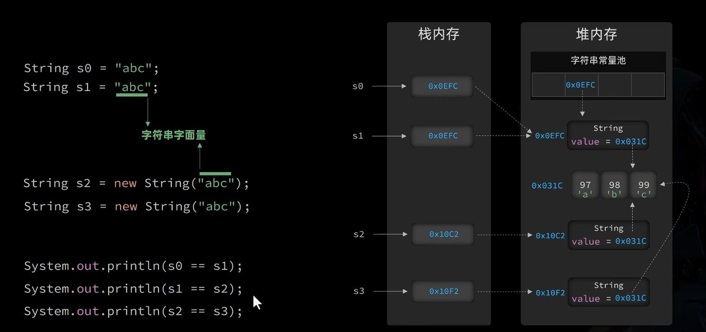
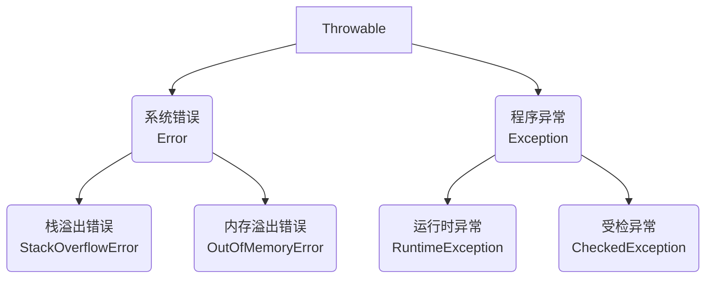

API(Application Programming Interface)，即应用程序接口，是预先定义好的一套规则和标准，使不同的应用程序能够互相通信和协作。

想象一下，API 就像餐厅的菜单，告诉你可以点什么菜（功能），但不会告诉你厨师是如何做这道菜的（实现细节）。

在 Java 中，核心类库就是 Java 官方为开发者提供的一套标准 API。掌握这些 API，就像拥有了一整箱精密工具，能够更高效地构建应用程序。


[Java® 平台、标准版和 Java 开发工具包 版本 17 API 规范](https://doc.qzxdp.cn/jdk/17/zh/api/index.html)

# Object 类

Object 类是 Java 中所有类的父类，每个类都直接或间接地继承自 Object。这意味着任何 Java 对象都能使用 Object 类中定义的方法。

## toString 方法

toString 方法返回对象的字符串表示形式，让我们能够更直观地了解对象包含的数据。当我们直接打印一个对象，或者将对象与字符串进行拼接时，Java 会自动调用该对象的 toString 方法。

```java
// System.out.println(Person.toString(); // 直接输出对象时，toString可以不写
System.out.println(Person);
```

Object 类中 toString 方法的默认实现如下：

```java
public String toString() {
    return getClass().getName() + "@" + Integer.toHexString(hashCode());
}
```

这个实现会返回：

- 类的完整名称（包含包名）
- 一个@符号
- 对象哈希码的十六进制表示

例如：`com.example.Person@15db9742`

这样的输出对调试帮助有限，因为它并没有告诉我们对象的实际内容。因此，在实际开发中，我们通常会**重写 toString 方法**来展示对象的关键属性。

一个好的 toString 实现应该包括类名和关键字段的值，例如：

```java
@Override
public String toString() {
    return "Person{name='" + name + "', age=" + age + "}";
}
```

使用这种重写后的 toString 方法，打印对象时就能看到有意义的信息：`Person{name='张三', age=25}`

和前面提到的 equals 和 hashCode 方法一样，现代 IDE 也提供了自动生成 toString 方法的功能，可以根据类的字段自动生成合适的实现。

## equals 方法

`equals` 方法用于比较两个对象是否相等。比较对象时，应该使用`equals()`而不是`==`操作符。

因为`==`比较的是对象的引用（内存地址），而我们通常需要比较的是对象的内容。

Object 类中 equals 的默认实现：

```java
public boolean equals(Object obj) {
    return (this == obj);
}
```

> 在 IDE 中，按住 Ctrl 点击方法名可以跳转到其实现类。

Object 类只提供了基础实现，许多类（如 String）都重写了这个方法来实现符合业务逻辑的比较。例如：

```java
// 自定义Person类重写equals方法
@Override
public boolean equals(Object obj) {
    // 先检查是否为同一引用
    if (this == obj) return true;

    // 类型安全检查
    if (!(obj instanceof Person)) return false;

    // 强制类型转换并比较关键属性
    Person other = (Person) obj;
    return this.name.equals(other.name) && this.age == other.age;
}
```

重写 equals 方法时，通常也需要重写 hashCode 方法。

## hashCode 方法

hashCode 方法根据对象的内容生成一个整数值，这个值主要用于哈希表数据结构中（如 HashMap、HashSet）。

哈希表通过这个值快速确定对象在内部存储的位置，这也是为什么 hashCode 与 equals 关系密切。

hashCode 方法必须遵守以下规则：

- 同一个对象多次调用，必须返回相同的整数
- 如果两个对象的 equals 方法比较为 true，它们的 hashCode 必须相同
- 不同的对象应该尽量产生不同的 hashCode（虽然不是强制的）

Object 的默认 hashCode 实现使用了对象的内存地址：

```java

public native int hashCode();  // 原生方法，由JVM底层实现

```

当重写 equals 方法时，必须同时重写 hashCode 方法，确保满足上述规则。现代 IDE 提供了自动生成这两个方法的功能：


生成的代码通常如下：

```java
@Override
public boolean equals(Object o) {
    if (this == o) return true;
    if (!(o instanceof Person person)) return false;
    return age == person.age && Objects.equals(name, person.name);
}

@Override
public int hashCode() {
    return Objects.hash(name, age);  // 基于关键属性计算
}
```

# Objects 工具类

JDK 7 新增的工具类，提供了一些静态方法来操作对象，让我们能更安全地处理各种对象操作。

Object 是所有类的祖宗，每个对象都继承自它；而 Objects（注意有个 s）是专门用来安全操作对象的工具类。两者完全不同，但都很重要。

## equals 方法

比较两个对象是否相等，即使第一个对象是 null 也不会报错：

```java
Student t1 = null;
Student t2 = new Student("蜘蛛精", 300, 85.5);

// 传统方式，如果 t1 是 null，会抛出空指针异常
// System.out.println(t1.equals(t2));

// Objects 的 equals 方法，更安全可靠
System.out.println(Objects.equals(t1, t2)); // false
```

**底层原理**：Objects.equals 会先判断两个对象是否为同一个引用，然后再安全地调用 equals 方法。

```java
public static boolean equals(Object a, Object b) {
    return (a == b) || (a != null && a.equals(b));
}
```

这样即使第一个参数是 null，也不会抛出空指针异常，而是直接返回 false。**以后比较两个对象是否相等，建议用 Objects.equals 来判断**，更安全。

## 判断 null 的方法

Objects 还提供了两个判断对象是否为 null 的便捷方法：

```java
System.out.println(Objects.isNull(t1));   // true
System.out.println(t1 == null);           // true

System.out.println(Objects.nonNull(t1));  // false
System.out.println(t1 != null);           // false
```

虽然功能和 `== null` 或 `!= null` 一样，但在某些场景下（如 Stream 操作）使用这些方法可以让代码更简洁、更规范。

## 其他常用方法

Objects 工具类还有一些其他实用方法：

```java
// 检查对象是否为 null，如果是则抛出 NullPointerException
Objects.requireNonNull(obj);

// 检查对象是否为 null，如果是则抛出带自定义消息的异常
Objects.requireNonNull(obj, "对象不能为空");

// 返回对象的哈希码，如果对象为 null 则返回 0
Objects.hashCode(obj);

// 比较两个对象的大小，支持 null 值
Objects.compare(obj1, obj2, comparator);
```

**工具类**就是一堆静态方法的集合，不用 new 对象，直接用"类名.方法名"调用。而 Objects 工具类专门用来安全操作对象，避免常见错误。

# 包装类

包装类是 Java 为每种基本数据类型提供的对应引用类型，将基本类型"包装"成对象，使其能够在面向对象环境中使用。这源自 Java"万物皆对象"的理念，也是因为泛型和集合只支持引用类型。

## 基本类型与包装类对应关系

Java 中的八种基本数据类型都有对应的包装类：

| 基本类型 | 包装类        | 特别注意  |
| -------- | ------------- | --------- |
| byte     | Byte          |           |
| short    | Short         |           |
| int      | **Integer**   | 不是 Int  |
| long     | Long          |           |
| float    | Float         |           |
| double   | Double        |           |
| boolean  | Boolean       |           |
| char     | **Character** | 不是 Char |

其中大多数包装类只是把基本类型首字母大写，只有`int→Integer`和`char→Character`需要特别记忆。这些包装类都位于`java.lang`包中，可以直接使用而无需导入。


## 创建包装类对象

有两种方式可以创建包装类对象：

```java
// 方式一：使用构造方法（已过时）
// Integer num1 = new Integer(10);  // 不推荐

// 方式二：使用静态工厂方法（推荐）
Integer num2 = Integer.valueOf(10);
```

那么为什么推荐使用静态方法而不是构造方法呢？这与包装类的缓存机制有关。

## 包装类的缓存机制

当我们查看`Integer.valueOf()`方法的源码时，会发现它实现了缓存机制：

```java
public static Integer valueOf(int i) {
    if (i >= IntegerCache.low && i <= IntegerCache.high)
        return IntegerCache.cache[i + (-IntegerCache.low)];
    return new Integer(i);
}
```

为了提高性能，Java 对常用的数值(`low：-128` 到 `high：127`)进行了缓存，这样频繁使用的整数就能共享同一个对象，节省内存。

这一机制在实践中很容易看到：

```java
Integer a = 100;  // 自动装箱，实际调用Integer.valueOf(100)
Integer b = 100;  // 同上，返回相同的缓存对象
System.out.println(a == b);  // true，因为是同一个对象

Integer c = 200;  // 超出缓存范围
Integer d = 200;  // 创建新对象
System.out.println(c == d);  // false，不同对象
```

**正确比较包装类对象**

这种缓存机制导致了一个常见陷阱：使用`==`来比较包装类对象可能得到意外结果。正确的做法是：

```java
// 错误的比较方式
if (integerObj1 == integerObj2) { /* 不可靠的比较 */ }

// 正确的比较方式
// 1. 比较值是否相等
if (integerObj1.equals(integerObj2)) { /* 安全的值比较 */ }

// 2. 比较大小关系
if (integerObj1.compareTo(integerObj2) > 0) { /* 大小比较 */ }
```

不同包装类的缓存范围不同：

| 包装类    | 缓存范围      | 说明                  |
| --------- | ------------- | --------------------- |
| Integer   | -128 到 127   | 常用的整数范围        |
| Character | 0 到 127      | ASCII 字符范围        |
| Boolean   | true 和 false | 所有可能的值          |
| Byte      | -128 到 127   | Byte 的完整值范围     |
| Short     | -128 到 127   | 与 Integer 相同的范围 |
| Long      | -128 到 127   | 与 Integer 相同的范围 |
| Float     | 不缓存        | 每次都创建新对象      |
| Double    | 不缓存        | 每次都创建新对象      |

这种缓存设计是为了优化内存使用，特别是对于小范围的常用值。这也解释了为什么使用`==`比较包装类对象可能得到意外结果，因为只有在缓存范围内的对象才会指向同一引用。

> 记住：基本类型变量直接存储值，而包装类是对象，变量存储的是引用，指向堆内存中的对象。

## 自动装箱与拆箱

为了让开发者使用更方便，从 JDK 1.5 开始，Java 引入了自动装箱和拆箱机制：

```java
// 自动装箱：基本类型 -> 包装类
Integer num = 100;  // 编译器自动转换为：Integer num = Integer.valueOf(100);

// 自动拆箱：包装类 -> 基本类型
int value = num;    // 编译器自动转换为：int value = num.intValue();
```

自动装箱和拆箱的原理如下图所示：


这一机制虽然极大地简化了代码，但也带来了一些需要注意的问题。

### 空指针风险

自动拆箱最大的风险是可能导致`NullPointerException`：

```java
Integer price = null;
// 自动拆箱时，如果包装类对象为null，会抛出NullPointerException
int discount = price + 10; // 运行时错误
```

在实际开发中，应该养成先检查 null 的习惯：

```java
Integer price = getPrice(); // 可能返回null
int realPrice = (price != null) ? price : 0; // 安全的拆箱方式
```

## 常用方法

包装类之所以有存在的价值，不仅仅是因为"万物皆对象"的理念，更因为它们提供了许多实用方法。下面是一些最常用的功能：

1. **转换为字符串**

   ```java
   public static String toString(int i)    // 静态方法
   public String toString()                // 实例方法
   ```

   虽然直接拼接空字符串也能达到效果(`""+100`)，但使用方法更规范。

2. **字符串转数值**（非常有用！）

   ```java
   // 解析字符串为基本类型
   public static int parseInt(String s)

   // 解析字符串为包装类对象（推荐）
   public static Integer valueOf(String s)
   ```

这些转换方法在处理用户输入、文件数据或网络请求时非常实用，能够将字符串形式的数据转换为可计算的数值类型。

# ArrayList 类

集合又很多种，ArrayList 是最常用、最常见的一种**集合**，适合存储一组有序、可变的数据。和数组相比，它的容量可以自动扩展，操作也更灵活。

ArrayList 适合频繁查找和遍历的场景，使用时记得导入 `java.util.ArrayList`。

**创建方式**

```java
ArrayList<String> list = new ArrayList<>();
```

如果需要存储不同类型的数据，可以用泛型 `<E>` 指定类型，比如 `ArrayList<Integer>` 存整数。

### `size()` 获取长度

用 `size()` 可以获取集合中元素的个数：

```java
int count = list.size();
```

### `get()` 获取元素

用 `get(index)` 可以获取指定位置的元素，下标从 0 开始：

```java
String value = list.get(0); // 获取第一个元素
```

### `add()` 添加元素

用 `add()` 方法可以向集合末尾添加一个元素，添加成功返回  true。

```java
list.add("Java");
list.add("Python");
```

也可以在指定位置插入元素，原有元素会依次后移：

```java
list.add(1, "C++"); // 在下标1的位置插入
```

### `remove()` 删除元素

有两种方式可以删除元素：

1. 按下标删除：`remove(index)`，会删除指定位置的元素，后面的元素自动前移。

   ```java
   list.remove(1); // 删除下标为1的元素
   ```

2. 按内容删除：`remove(Object o)`，会删除集合中首次出现的指定元素。

   ```java
   list.remove("Java");
   ```

### `set()` 修改元素

用 `set(index, element)` 可以修改指定位置的元素，被替换掉的原元素。

```java
list.set(0, "Go"); // 把第一个元素改成 Go
```

### 集合遍历

在实际开发中，经常需要在遍历集合时根据条件删除某些元素。如果直接使用 for 循环从前往后遍历并删除，会导致索引混乱，容易漏删或抛出异常。为避免此类 bug，可以采用以下两种常用方法：

**方法一：每次删除元素后，手动将索引减一**

当使用 for 循环正序遍历集合时，如果删除了当前元素，后面的元素会整体前移，此时应将索引减一，确保不会跳过下一个元素。例如：

```java
for (int i = 0; i < list.size(); i++) {
    if (需要删除的条件) {
        list.remove(i);
        i--; // 删除后索引回退
    }
}
```

**方法二：倒序遍历集合进行删除**

更推荐的做法是从集合末尾向前遍历。这样删除元素时不会影响尚未遍历的元素索引，逻辑更简单，也不会漏删。例如：

```java
for (int i = list.size() - 1; i >= 0; i--) {
    if (需要删除的条件) {
        list.remove(i);
    }
}
```

遍历集合删除元素时，推荐倒序遍历，或在正序遍历时删除后索引减一，避免出现遗漏或索引越界等问题。

# String 类

String 是 Java 中使用频率最高的引用类型之一，用于表示文本内容。它有一个重要特点：可以直接使用字符串字面量创建对象，而不必像其他引用类型那样必须使用`new`关键字。

> String 是不可变的，每次修改其实都是生成了一个新对象，原内容不会变。

```java
// 直接使用字符串字面量创建
String name = "Java学习";

// 普通引用类型的创建方式
StringBuilder sb = new StringBuilder();
```

## 创建方式（拓展）

实际开发中，**推荐使用字符串字面量的方式创建字符串**，这样更加简洁。

除了使用字面量，String 类还提供了多种构造方法。下面是几种常见的构造方法：

1. 根据现有字符串创建新的字符串对象

```java
String(String original)
// 示例
String copy = new String("原始字符串");
```

2. 使用平台默认编码将字节数组转换为字符串

```java
String(byte[] bytes)
// 示例
byte[] data = {72, 101, 108, 108, 111}; // ASCII码对应Hello
String text = new String(data);
```

3. 使用指定编码将字节数组转换为字符串

```java
String(byte[] bytes, Charset charset)
// 示例
byte[] data = {-28, -67, -96, -27, -91, -67}; // UTF-8编码的"中文"
String text = new String(data, StandardCharsets.UTF_8);
```

4. 将字符数组转换为字符串

```java
String(char[] value)
// 示例
char[] chars = {'J', 'a', 'v', 'a'};
String language = new String(chars);
```

## 字符串常量池

Java 中的字符串字面量会被存储在一个特殊的内存区域，称为"字符串常量池"。这种设计有助于节省内存，因为相同内容的字符串可以共享同一个实例。



**字面量创建与 new 创建的区别**：

- 使用字面量创建字符串时，JVM 会先检查常量池中是否存在相同内容的字符串

  - 如果存在，则直接返回常量池中的引用
  - 如果不存在，则在常量池中创建新的字符串对象

- 使用 new 创建字符串时，无论常量池中是否存在相同内容的字符串，都会在堆内存中创建新的对象

这种区别可以通过一个简单示例展示：

```java
// 字符串常量池示例
String s1 = "Hello";  // 在常量池中创建"Hello"
String s2 = "Hello";  // 复用常量池中的"Hello"
String s3 = new String("Hello");  // 在堆内存中创建新对象

// 比较引用是否相同
System.out.println(s1 == s2);  // true (同一个对象)
System.out.println(s1 == s3);  // false (不同对象)

// 比较内容是否相同
System.out.println(s1.equals(s3)); // true (内容相同)
```

这也是推荐使用字面量的一个原因，其能够利用字符串常量池提高内存使用效率。

## intern 方法

当我们需要手动将字符串添加到常量池中时，可以使用`intern()`方法：

```java
// intern方法示例
String str1 = new String("计算机");  // 堆内存中的对象
String str2 = str1.intern();         // 获取常量池中的引用
String str3 = "计算机";              // 直接从常量池获取
```

这个方法的工作原理是：

- 检查常量池中是否已存在内容相同的字符串
- 若存在，返回常量池中的引用
- 若不存在，将此字符串添加到常量池并返回其引用

验证效果：

```java
// 验证intern的效果
System.out.println(str1 == str2);  // false，str1指向堆内存，str2指向常量池
System.out.println(str2 == str3);  // true，str2和str3都指向常量池中的同一对象
```

通过合理使用字符串常量池和 intern 方法，可以在处理大量重复字符串时优化内存使用。不过，除非有特殊需求，否则一般**不需要**手动调用 intern 方法。

## 判断与比较方法

String 类提供了一系列用于判断和比较字符串的方法，这些方法让我们能够灵活地处理各种字符串操作场景。

### 内容比较

比较字符串的内容是否相同，是最基本的字符串操作之一：

```java
// 严格比较字符串内容是否完全相同（区分大小写）
boolean equals(Object obj)

// 比较字符串内容是否相同（忽略大小写）
boolean equalsIgnoreCase(String str)
```

使用示例：

```java
String str1 = "Hello";
String str2 = "hello";

System.out.println(str1.equals(str2));         // false（大小写敏感）
System.out.println(str1.equalsIgnoreCase(str2)); // true（忽略大小写）
```

### 空值检查

检查字符串是否为空是处理用户输入或外部数据时的常见需求：

```java
// 检查字符串长度是否为0（即""）
boolean isEmpty()

// 检查字符串是否为空或全为空白字符（Java 11+）
boolean isBlank()
```

这两个方法的区别在于对空白字符的处理：

```java
System.out.println("".isEmpty());     // true
System.out.println("   ".isEmpty());  // false（含空格）

System.out.println("   ".isBlank());  // true
System.out.println(" \t\n".isBlank());// true（含制表符、换行符）
```

### 前后缀检查

判断字符串的开头或结尾是否匹配特定内容：

```java
// 判断字符串是否以指定前缀开头
boolean startsWith(String prefix)

// 判断字符串是否以指定后缀结尾
boolean endsWith(String suffix)
```

这些方法在处理文件路径、URL 等场景中特别有用：

```java
String path = "/data/images/photo.jpg";

System.out.println(path.startsWith("/data")); // true
System.out.println(path.endsWith(".jpg"));    // true
System.out.println(path.endsWith(".png"));    // false
```

### 内容匹配

检查字符串是否包含特定内容：

```java
// 判断是否包含指定子字符串
boolean contains(CharSequence cs)

// 判断是否符合正则表达式规则
boolean matches(String regex)
```

实际应用示例：

```java
// 检查文本中是否包含关键词
String text = "Java编程基础";
System.out.println(text.contains("编程"));  // true

// 使用正则表达式验证手机号格式
String phone = "13800138000";
System.out.println(phone.matches("1[3-9]\\d{9}")); // true
```

通过合理组合这些判断方法，我们可以构建出强大而灵活的字符串处理逻辑，满足各种业务场景需求。

## 获取方法

String 类提供了多种方法用于获取字符串的特定信息或提取字符串的特定部分，这些方法是字符串处理的基础。

### 基础属性获取

要获取字符串的基本属性，可以使用以下方法：

```java
// 获取字符串的长度（字符数量）
int length()

// 获取指定索引位置的字符
char charAt(int index)
```

这些方法使我们能够了解字符串的基本结构：

```java
String text = "Java编程";
System.out.println(text.length());   // 5（注意：一个中文字符的长度为1）
System.out.println(text.charAt(0));  // 'J'
System.out.println(text.charAt(4));  // '程'
```

> 注意：字符串索引从 0 开始，如果索引超出范围会抛出 StringIndexOutOfBoundsException 异常。

### 切割与截取

从字符串中提取特定部分是常见操作：

```java
// 按照正则表达式分割字符串
String[] split(String regex)

// 截取指定索引范围的子字符串（含起始，不含结束）
String substring(int beginIndex, int endIndex)

// 从指定位置截取到末尾
String substring(int beginIndex)
```

使用示例：

```java
// 分割字符串
String data = "张三,李四,王五";
String[] names = data.split(",");  // 得到["张三", "李四", "王五"]

// 截取子字符串
String url = "https://www.example.com";
String domain = url.substring(8, 21);  // "www.example"
String topDomain = url.substring(21);  // ".com"
```

### 查找定位

查找字符或子字符串在原字符串中的位置：

```java
// 查找字符/字符串首次出现的位置
int indexOf(String str)
int indexOf(int ch)  // 可以传入字符或ASCII码

// 查找字符/字符串最后一次出现的位置
int lastIndexOf(String str)

// 从指定位置开始查找
int indexOf(String str, int fromIndex)
```

使用这些方法可以帮助我们确定字符串中特定内容的位置：

```java
String sentence = "Java是一门面向对象的编程语言";

// 查找子字符串位置
int pos = sentence.indexOf("编程");  // 返回9
int notFound = sentence.indexOf("Python");  // 返回-1（未找到）

// 查找字符位置
int charPos = sentence.indexOf('向');  // 返回6

// 查找最后一次出现的位置
String repeat = "香蕉,苹果,香蕉,橙子";
int last = repeat.lastIndexOf("香蕉");  // 返回6
```

> 当查找不到指定内容时，indexOf 和 lastIndexOf 方法都返回-1。

### 类型转换

字符串可以转换为其他数据类型：

```java
// 转换为字符数组
char[] toCharArray()

// 转换为字节数组（使用平台默认编码）
byte[] getBytes()

// 使用指定编码转换为字节数组
byte[] getBytes(Charset charset)
```

这些转换方法在处理文件 IO 或网络传输时特别有用：

```java
String message = "Hello";

// 转换为字符数组
char[] chars = message.toCharArray();  // ['H', 'e', 'l', 'l', 'o']

// 转换为字节数组
byte[] bytes = message.getBytes();  // [72, 101, 108, 108, 111]

// 使用特定编码转换
byte[] utf8Bytes = message.getBytes(StandardCharsets.UTF_8);
```

掌握这些获取方法，可以让我们更高效地处理各种字符串操作任务，从简单的字符提取到复杂的文本分析都能游刃有余。

## 转换方法

String 类提供了丰富的转换方法，让我们能够轻松修改文本内容。无论是替换字符、改变大小写，还是处理空格，都可以通过这些方法实现。

### 替换操作

替换是字符串处理中最常用的操作之一：

```java
// 替换所有匹配的字符/字符串
String replace(CharSequence target, CharSequence replacement)

// 使用正则表达式替换所有匹配项
String replaceAll(String regex, String replacement)

// 只替换第一个匹配的正则表达式
String replaceFirst(String regex, String replacement)
```

这些方法的使用场景各有不同：

```java
// 简单替换
String text = "Hello World!";
String result = text.replace("l", "*");  // "He**o Wor*d!"

// 正则表达式替换
String code = "用户ID: 12345, 余额: 9876";
String masked = code.replaceAll("\\d", "*");  // "用户ID: *****, 余额: ****"

// 只替换首次出现
String date = "2023-04-05-2023";
String fixed = date.replaceFirst("2023", "2024");  // "2024-04-05-2023"
```

### 大小写转换

改变字符串的大小写是国际化应用中常见需求：

```java
// 将字符串全部转换为小写
String toLowerCase()

// 将字符串全部转换为大写
String toUpperCase()
```

这些方法会智能地处理各种语言的大小写规则：

```java
String mixed = "Java Programming";
System.out.println(mixed.toLowerCase());  // "java programming"
System.out.println(mixed.toUpperCase());  // "JAVA PROGRAMMING"

// 支持国际字符
String german = "Äpfel";  // 德语"苹果"
System.out.println(german.toLowerCase());  // "äpfel"
```

### 空格处理

处理字符串首尾的空白字符：

```java
// 删除字符串前后的空白字符（Java 11+）
String strip()

// 删除字符串前后的空格、制表符、换行符等（传统方法）
String trim()
```

这两个方法有微妙但重要的区别：

```java
// trim()只处理ASCII空白字符（空格、制表符等）
String text = "  Hello  ";
System.out.println(text.trim());  // "Hello"

// strip()能处理所有Unicode空白字符（包括全角空格等）
String textWithUnicode = "　Hello　";  // 含有全角空格
System.out.println(textWithUnicode.strip());  // "Hello"
System.out.println(textWithUnicode.trim());   // "　Hello　"（全角空格未被去除）
```

### 格式化字符串

创建格式化文本时，可以使用静态方法：

```java
// 使用指定格式创建字符串
static String format(String format, Object... args)
```

这个方法类似于 C 语言中的 printf：

```java
// 创建格式化字符串
String message = String.format("用户: %s, 年龄: %d", "张三", 25);
System.out.println(message);  // "用户: 张三, 年龄: 25"

// 格式化数值
String price = String.format("价格: %.2f元", 99.8);
System.out.println(price);  // "价格: 99.80元"
```

这些转换方法都有一个重要特点：**它们不会修改原始字符串**，而是返回一个新的字符串。这是因为 Java 中的 String 类是不可变的（immutable），确保了字符串操作的线程安全性。

## 拼接方法

Java 提供了多种字符串拼接方式，适用于不同的场景。选择合适的拼接方法可以提高代码效率和可读性。

### 使用+运算符

最简单直观的字符串拼接方式是使用加号运算符：

```java
// 使用+运算符拼接字符串
String firstName = "张";
String lastName = "三";
String fullName = firstName + lastName;  // "张三"

// 可以同时拼接多个值和不同类型
int age = 25;
String info = "姓名：" + fullName + "，年龄：" + age;  // "姓名：张三，年龄：25"
```

虽然+运算符使用方便，但在循环中频繁拼接字符串会导致性能问题，因为每次拼接都会创建新的字符串对象。

### 静态拼接方法：String.join()

Java 8 引入了`String.join()`方法，可以使用指定的分隔符拼接多个字符串：

```java
// 使用分隔符拼接多个元素
String result = String.join("-", "2023", "10", "05");
System.out.println(result);  // "2023-10-05"

// 拼接集合或数组中的元素
List<String> colors = Arrays.asList("红", "橙", "黄", "绿");
String colorList = String.join("、", colors);
System.out.println(colorList);  // "红、橙、黄、绿"
```

这种方法特别适合将集合或数组中的多个元素拼接成一个带分隔符的字符串。

# `StringBuilder` 高效拼接

在 Java 中，String 是不可变的，每次拼接都会创建新对象。对于频繁拼接字符串的场景，尤其是在循环中，应该使用`StringBuilder`类：

```java
// 创建空的StringBuilder对象
StringBuilder sb1 = new StringBuilder();  // 空字符串，初始容量16字符

// 创建带初始内容的StringBuilder对象
StringBuilder sb2 = new StringBuilder("Wreckloud");  // 内容为"Wreckloud"

// 创建指定容量的StringBuilder对象
StringBuilder sb3 = new StringBuilder(50);  // 空字符串，初始容量50字符
```

StringBuilder 是一个可变的字符序列，内部维护一个字符数组，支持动态增长。与 String 不同，它的操作不会创建新对象，而是在原对象上直接修改。尤其是在循环或大量拼接操作中，大大提高了性能。

### 链式调用

常用方法，例如`append`方法添加内容：

```java
sb.append("维克罗德");
sb.append("Wreckloud");
sb.append(666);
sb.append(true);

// 直接得到了内容，因为toString被重写了
System.out.println(sb);  // 输出：维克罗德Wreckloud666true
```

也可以使用链式调用（Chained Method Call），让代码更简洁：

```java
sb.append("维克罗德").append("Wreckloud").append(666);
```

查看`append`方法源码，会发现它`return this`，每个 `append()` 方法内部都返回了 `this` 对象，也就是原本的那个 `StringBuilder`。

```Java{5}
@Override
@IntrinsicCandidate
public final StringBuilder append(String str) {
    super.append(str);
    return this;
}
```

### 转成 String 返回

虽然 `StringBuilder` 很强大，但开发中我们最终使用的往往是 `String` 类型，为什么不能直接把 `StringBuilder` 传给方法？因为多数 API 都要求参数是 `String`，比如：

```java
public void print(String s) { ... } // 是不接受 StringBuilder
```

这是因为 `String` 是标准类型、不可变、可共享，几乎所有库和框架都是围绕它设计的。而 `StringBuilder` 是辅助工具，系统方法并不识别。

> 所以：**拼接完后必须 `.toString()` 转换成 String 才能交付使用。**

除了通用性，`String` 还有两个关键优势：

- **不可变性**：线程安全，可共享，适合当常量
- **常量池优化**：所有 `"文本"` 形式的字符串都会进入字符串常量池，实现复用

```java
String a = "hello";
String b = "hello";
System.out.println(a == b); // true，两个变量引用同一常量池中的对象
```

而如果你写的是：

```java
String a = new String("hello");
```

这会在堆上重新创建一个对象，不再复用常量池中的 `"hello"` 字面量，既浪费内存，也违背了常量池的优化初衷。

> 因此，对于**需要频繁拼接或修改字符串**的场景，推荐使用 `StringBuilder`，能显著提升性能，减少内存开销。
> 但如果字符串操作本身不多，或只是单纯定义变量、传参，使用 `String` 更简洁，也能充分利用字符串常量池的优势。

### 常用方法

除此之外，StringBuilder 还提供了丰富的字符串操作方法：

| 方法                          | 说明               | 示例                            |
| ----------------------------- | ------------------ | ------------------------------- |
| `append(内容)`                | 追加内容到末尾     | `builder.append(" World")`      |
| `insert(位置, 内容)`          | 在指定位置插入内容 | `builder.insert(5, ",")`        |
| `replace(开始, 结束, 字符串)` | 替换指定范围内容   | `builder.replace(0, 5, "Hi")`   |
| `delete(开始, 结束)`          | 删除指定范围内容   | `builder.delete(2, 4)`          |
| `toString()`                  | 转换为 String      | `String s = builder.toString()` |
| `length()`                    | 获取长度           | `int len = builder.length()`    |

# `StringBuffer` 线程安全

StringBuffer 是 Java 提供的线程安全版 StringBuilder，专为多线程环境下的字符串操作设计。它们在功能和用法上几乎完全相同，但在内部实现和适用场景上有重要区别。

这种差异导致：

- StringBuffer：线程安全，适合多线程环境
- StringBuilder：线程不安全，但性能更高，适合单线程环境

除此之外，StringBuffer 的创建和使用方式与 StringBuilder 完全一样。

在实际开发中，我们大多都接触的是单线程场景（方法内部的局部变量），因此几乎都应该用 StringBuilder。除非确认有多线程访问同一个对象，否则使用 StringBuilder 即可，这将在以后的内容中提到。

# `StringJoiner` 快速拼接

`StringJoiner` 是从 JDK 8 引入的字符串处理类，用来**简洁拼接多个字符串**，  
底层原理跟 `StringBuilder` 类似，但专注**格式化拼接**，比如加逗号、加括号等场景。

它的构造方式决定了输出格式：

```java
// 只指定分隔符（最常用）
new StringJoiner(",")

// 指定分隔符 + 前缀 + 后缀
new StringJoiner(",", "[", "]")
```

没有花里胡哨的操作，`StringJoiner` 的方法设计非常精炼，都是围绕“拼接”本身：

| 方法名            | 说明                     |
| ----------------- | ------------------------ |
| `add(String str)` | 添加元素，区别`append()` |
| `toString()`      | 返回最终拼接结果         |
| `length()`        | 返回拼接后字符串的长度   |

例如，将 int 数组格式化为字符串输出

**原写法（用 `StringBuilder` 拼接）**

```java
public static String getArrayData(int[] arr) {
    if (arr == null) return null;

    StringBuilder sb = new StringBuilder();
    sb.append("[");
    for (int i = 0; i < arr.length; i++) {
        sb.append(arr[i]);
        if (i != arr.length - 1) sb.append("，");
    }
    sb.append("]");
    return sb.toString();
}
```

虽然能用，但拼接逻辑零散，而且你得**手动判断**是不是最后一个元素。

**推荐（用 `StringJoiner`）**

代码一下子就干净了许多：

```java
public static String getArrayData(int[] arr) {
    if (arr == null) return null;

    StringJoiner sj = new StringJoiner("，", "[", "]");
    for (int num : arr) {
        sj.add(Integer.toString(num)); // 注意只接收 String 类型，需要转换一下
    }
    return sj.toString();
}
```

这样写不仅语义清晰，而且**不需要关心逗号位置、边界处理**，一切交给 `StringJoiner` 来做。

> `StringBuilder` 用于**自由拼接**，`StringJoiner` 用于**规则拼接**，比如加逗号、加中括号、加空格等。

# Math

Math 类是 Java 提供的数学工具类，位于 java.lang 包中。它包含执行基本数学运算的静态方法，无需创建实例即可直接使用。

## `abs` 绝对值

获取参数的绝对值

```Java
public static int abs(int a)
```

```java
int num = -10;
int absValue = Math.abs(num); // 结果：10
```

## `ceil/floor` 上下取整

向上/下取整（返回大于/小于或等于参数的最小/大整数）

```Java
// 向上取整
public static double ceil(double a)
// 向下取整
public static double floor(double a)
```

```java
double num1 = 3.14;
double ceilResult = Math.ceil(num1); // 结果：4.0

double num1 = 3.85;
double floorResult = Math.floor(num1); // 结果：3.0
```

## `round` 四舍五入

四舍五入为最接近的整数

```Java
public static int round(float a)
```

```java
float num1 = 3.4f;
float num2 = 3.5f;

int roundResult1 = Math.round(num1); // 结果：3
int roundResult2 = Math.round(num2); // 结果：4
```

## `max/min` 最值

获取两个值中的较大/小值

```Java
public static int max(int a, int b)
public static int min(int a, int b)
```

```java
int a = 5;
int b = 10;
int maxValue = Math.max(a, b); // 结果：10
int minValue = Math.min(a, b); // 结果：5
```

## `pow` 幂运算

返回 a 的 b 次幂

```Java
public static double pow(double a, double b)
```

```java
double base = 2.0;
double exponent = 3.0;
double result = Math.pow(base, exponent); // 结果：8.0
```

## `random` 随机数生成

返回一个 `[0.0, 1.0)` 范围内的随机双精度浮点数

```Java
public static double random()
```

```java
// 生成 [0.0, 1.0) 之间的随机数
double randomValue = Math.random();

// 生成 [0, 100) 之间的整数随机数
int randomInt = (int)(Math.random() * 100);

// 生成 [100, 200) 之间的整数随机数
int num = rand.nextInt(200 - 100) + 100;
// 可以参考: 整数随机数 = (int)(Math.random() * (上限 - 下限)) + 下限;
```

# Runtime

Runtime 代表程序所在的运行环境。这是一个单例类，通过它可以与 Java 虚拟机进行交互，执行一些系统级操作。

## `getRuntime` 获取实例

获取与当前 Java 应用程序关联的运行时对象

```Java
public static Runtime getRuntime()
```

```java
Runtime runtime = Runtime.getRuntime();
```

## `exit` 终止虚拟机

终止当前运行的虚拟机，慎用，可能导致数据丢失

```Java
public void exit(int status)
```

```java
Runtime runtime = Runtime.getRuntime();
runtime.exit(0); // 0表示正常终止，非0表示异常终止
```

## `availableProcessors` 获取处理器数量

返回 Java 虚拟机可用的处理器数

```Java
public int availableProcessors()
```

```java
Runtime runtime = Runtime.getRuntime();
int processors = runtime.availableProcessors();
System.out.println("可用处理器数量：" + processors);
```

## `total/freeMemory` 内存管理

获取虚拟机内存信息，常用于监控和调试

```Java
public long totalMemory() // 返回 Java 虚拟机中的内存总量
public long freeMemory()  // 返回 Java 虚拟机中的可用内存
```

```java
Runtime runtime = Runtime.getRuntime();
long total = runtime.totalMemory();
long free = runtime.freeMemory();

System.out.println("总内存：" + total / 1024 / 1024 + "MB"); // 默认以字节为单位
System.out.println("可用内存：" + free / 1024 / 1024 + "MB");
System.out.println("已用内存：" + (total - free) / 1024 / 1024 + "MB");
```

## `exec` 执行外部程序

启动某个程序，并返回代表该程序的对象

```Java
public Process exec(String command)
```

```java
Runtime runtime = Runtime.getRuntime();
try {
    // 启动记事本程序
    Process process = runtime.exec("notepad.exe");

    // 等待程序执行结束
    process.waitFor();
} catch (Exception e) {
    e.printStackTrace();
}
```

Runtime 类在日常开发中使用频率不高，但在需要获取系统信息、执行垃圾回收或启动外部程序时非常有用。了解这些方法对于编写系统监控工具或性能优化有一定帮助。

# System

System 代表程序所在的系统，是一个工具类。通过 System 类可以访问系统相关的属性和方法。

## `exit` 终止虚拟机

终止当前运行的 Java 虚拟机

```Java
public static void exit(int status)
```

```java
System.exit(0); // 0表示正常终止，非0表示异常终止
```

## `currentTimeMillis` 获取系统时间

返回当前系统的时间毫秒值形式（这个比较重要）

```Java
public static long currentTimeMillis()
```

```java
// 获取当前时间戳
long start = System.currentTimeMillis();

// 执行一些操作
for (int i = 0; i < 10000; i++) {
    // 模拟操作
}

// 计算耗时
long end = System.currentTimeMillis();
System.out.println("执行耗时：" + (end - start) + "毫秒");
```

常用于性能统计，记录从 1970 年 1 月 1 日 00:00:00 到现在的毫秒值。

**为啥选择"1970 年 1 月 1 日 00:00:00"作为时间的起点？**

> 1969  年，贝尔实验室的肯·汤普逊开发了 Unix 初版。随后他与丹尼斯·里奇开发了 C  语言并用它重写了  Unix。
> 1970 年  1 月 1 日被视为 C  语言的"诞生日"，因此成为了计算机时间的起点。

## 其他常用方法

```java
// 获取系统属性
String javaVersion = System.getProperty("java.version");
System.out.println("Java 版本：" + javaVersion);

// 输出到控制台
System.out.println("标准输出");
System.err.println("错误输出");

// 复制数组
int[] arr1 = {1, 2, 3, 4, 5};
int[] arr2 = new int[5];
System.arraycopy(arr1, 0, arr2, 0, arr1.length);
```

System 类提供的方法在日常开发中使用频率较高，尤其是 currentTimeMillis() 方法，常用于性能测试和时间记录。

# BigDecimal

BigDecimal 用于解决浮点型运算时出现结果失真的问题。

浮点型运算时，直接 +、-、\*、/ 可能会出现运算结果失真：

```java
System.out.println(0.1 + 0.2);       // 输出: 0.30000000000000004
System.out.println(1.0 - 0.32);      // 输出: 0.6799999999999999
System.out.println(1.015 * 100);     // 输出: 101.49999999999999
System.out.println(1.301 / 100);     // 输出: 0.013009999999999999
```

计算机内部使用二进制表示数字，而某些小数在二进制中无法精确表示。例如，0.1 在二进制中是无限循环小数，必须截断，导致精度损失。当进行运算时，这些微小的误差会累积，造成结果失真。

## 构造器

创建 BigDecimal 对象的方法：

```Java
// 不推荐！只解决数据过大问题，不能解决精度问题
public BigDecimal(double val)

// 推荐：将字符串转为 BigDecimal，可以保持精度
public BigDecimal(String val)
```

```java
// 注意转换成字符串, 以调用正确的构造器
BigDecimal a = new BigDecimal(Double.toString(0.1));
BigDecimal b = new BigDecimal(Double.toString(0.2));
```

## `valueOf` 创建

将 double 转换为 BigDecimal 的推荐方法：

```Java
public static BigDecimal valueOf(double val)
```

```java
// 阿里巴巴推荐使用 valueOf 方法包装浮点型数据
BigDecimal a = BigDecimal.valueOf(0.1);
BigDecimal b = BigDecimal.valueOf(0.2);
```

因为其源码内部实现就是：

```java
return new BigDecimal(Double.toString(val));
```

它自动做了转字符串操作，避免使用错误的构造器。

## 运算方法

```Java
public BigDecimal add(BigDecimal b)       // 加法
public BigDecimal subtract(BigDecimal b)  // 减法
public BigDecimal multiply(BigDecimal b)  // 乘法
public BigDecimal divide(BigDecimal b)    // 除法
```

```java
BigDecimal a = BigDecimal.valueOf(0.1);
BigDecimal b = BigDecimal.valueOf(0.2);

BigDecimal sum = a.add(b);
System.out.println(sum);  // 输出：0.3
```

特别注意 BigDecimal 执行除法时，会遇到一些特殊情况。例如，当我们计算无法精确表示的小数时：

```java
BigDecimal a = BigDecimal.valueOf(0.1);
BigDecimal b = BigDecimal.valueOf(0.3);

// 尝试计算 a/b (0.1/0.3 = 1/3)
BigDecimal result = a.divide(b);
```

执行上述代码会得到一个异常：`Non-terminating decimal expansion; no exact representable decimal result`（无限小数展开，无法精确表示结果）。
这是因为 1/3 是一个无限循环小数，而 BigDecimal 默认要求结果必须精确。

针对这种情况，Java 提供了带精度控制和舍入模式的除法方法：

```java
public BigDecimal divide(BigDecimal divisor, int scale, RoundingMode roundingMode)
```

使用这个方法时，我们可以：

- 指定结果保留的小数位数(scale)
- 选择适当的舍入模式(RoundingMode)

实际应用示例：

```java
BigDecimal a = new BigDecimal("10");
BigDecimal b = new BigDecimal("3");

// 除法，保留2位小数，使用四舍五入模式
BigDecimal result = a.divide(b, 2, RoundingMode.HALF_UP);
System.out.println(result);  // 输出：3.33
```

这种方式让我们能够合理处理除法运算中的精度问题，避免异常同时保持计算结果的可控性和实用性。

## 转换回 double

我们只用 BigDecimal 处理数据，但通常不用它传递数据。这与 StringBuilder 类似，处理完后转回基本类型。

将 BigDecimal 转换为 double 类型：

```Java
public double doubleValue()
```

```java
BigDecimal bd = BigDecimal.valueOf(0.1).add(BigDecimal.valueOf(0.2));
double result = bd.doubleValue();
System.out.println(result);  // 输出：0.3
```

基本类型进栈效率高，而对象存在堆中，跨区域访问性能较差。

# 现代日期时间

在 Java 8 之前，日期时间处理一直是 Java 开发中的痛点。旧的`Date`和`Calendar`类设计不合理，使用繁琐且容易出错。为此，Java 8 引入了全新的`java.time`包，提供了更加直观、易用且线程安全的日期时间 API。

新 API 的核心类主要有：

- **LocalDate**：处理日期（年、月、日、星期）
- **LocalTime**：处理时间（时、分、秒、纳秒）
- **LocalDateTime**：同时处理日期和时间

这些类都是**不可变对象**，意味着一旦创建就不能修改，所有修改操作都会返回新的对象，这确保了线程安全性。

## 创建日期时间对象

创建这些对象有两种基本方式：

```java
// 方式一：获取当前系统时间
LocalDate today = LocalDate.now();         // 当前日期
LocalTime currentTime = LocalTime.now();   // 当前时间
LocalDateTime current = LocalDateTime.now(); // 当前日期时间

// 方式二：指定具体时间创建
LocalDate birthday = LocalDate.of(1999, 12, 31); // 1999年12月31日
LocalTime meetingTime = LocalTime.of(14, 30, 0); // 14:30:00
LocalDateTime deadline = LocalDateTime.of(2023, 5, 20, 23, 59, 59); // 2023年5月20日 23:59:59
```

## LocalDate 日期处理

`LocalDate`专注于处理年、月、日、星期信息，不包含时间和时区。

### 获取日期信息

```java
LocalDate today = LocalDate.now();

// 获取年、月、日信息
int year = today.getYear();              // 年份，如2024
int month = today.getMonthValue();       // 月份(1-12)
int day = today.getDayOfMonth();         // 当月第几天
int dayOfYear = today.getDayOfYear();    // 当年第几天
int dayOfWeek = today.getDayOfWeek().getValue(); // 星期几(1-7，周一到周日)

System.out.println("今天是" + year + "年" + month + "月" + day + "日，星期" + dayOfWeek);
```

### 修改日期

所有修改操作都会返回新对象，不会改变原对象：

```java
LocalDate today = LocalDate.now(); // 假设今天是2024-03-19

// 直接修改某个字段
LocalDate nextYear = today.withYear(2025);   // 2025-03-19
LocalDate nextMonth = today.withMonth(4);    // 2024-04-19

// 增加日期
LocalDate after2Years = today.plusYears(2);  // 2026-03-19
LocalDate after3Months = today.plusMonths(3); // 2024-06-19
LocalDate nextWeek = today.plusWeeks(1);     // 2024-03-26

// 减少日期
LocalDate before1Year = today.minusYears(1);  // 2023-03-19
LocalDate lastMonth = today.minusMonths(1);   // 2024-02-19
```

### 日期比较

```java
LocalDate date1 = LocalDate.of(2024, 1, 1);
LocalDate date2 = LocalDate.of(2024, 12, 31);

boolean isEqual = date1.equals(date2);     // false，判断是否相等
boolean isBefore = date1.isBefore(date2);  // true，date1是否在date2之前
boolean isAfter = date1.isAfter(date2);    // false，date1是否在date2之后
```

## LocalTime 时间处理

`LocalTime`专注于处理时、分、秒、纳秒信息，不包含日期和时区。

### 获取时间信息

```java
LocalTime now = LocalTime.now();

// 获取时、分、秒、纳秒
int hour = now.getHour();        // 小时(0-23)
int minute = now.getMinute();    // 分钟(0-59)
int second = now.getSecond();    // 秒(0-59)
int nano = now.getNano();        // 纳秒

System.out.println("当前时间是" + hour + ":" + minute + ":" + second);
```

### 修改时间

```java
LocalTime now = LocalTime.now(); // 假设现在是14:30:20

// 直接修改某个字段
LocalTime atNoon = now.withHour(12);       // 12:30:20
LocalTime noSeconds = now.withSecond(0);   // 14:30:00

// 增加时间
LocalTime after2Hours = now.plusHours(2);   // 16:30:20
LocalTime after30Mins = now.plusMinutes(30); // 15:00:20

// 减少时间
LocalTime before1Hour = now.minusHours(1);   // 13:30:20
LocalTime before15Mins = now.minusMinutes(15); // 14:15:20
```

### 时间比较

```java
LocalTime time1 = LocalTime.of(9, 0);  // 9:00
LocalTime time2 = LocalTime.of(18, 0); // 18:00

boolean isEqual = time1.equals(time2);     // false
boolean isBefore = time1.isBefore(time2);  // true
boolean isAfter = time1.isAfter(time2);    // false
```

## LocalDateTime 日期时间处理

`LocalDateTime`结合了`LocalDate`和`LocalTime`的功能，可以同时处理日期和时间信息。

### 获取和修改信息

`LocalDateTime`包含了`LocalDate`和`LocalTime`的所有方法，因此可以获取或修改任何日期时间字段：

```java
LocalDateTime now = LocalDateTime.now();

// 获取日期时间信息
int year = now.getYear();
int month = now.getMonthValue();
int day = now.getDayOfMonth();
int hour = now.getHour();
int minute = now.getMinute();

// 修改信息
LocalDateTime tomorrow = now.plusDays(1);
LocalDateTime lastWeek = now.minusWeeks(1);
LocalDateTime christmas = now.withMonth(12).withDayOfMonth(25);
```

## 类型转换

`LocalDateTime`可以方便地转换为`LocalDate`或`LocalTime`，反之亦然：

```java
LocalDateTime now = LocalDateTime.now();

// LocalDateTime → LocalDate 和 LocalTime
LocalDate date = now.toLocalDate();  // 提取日期部分
LocalTime time = now.toLocalTime();  // 提取时间部分

// LocalDate + LocalTime → LocalDateTime
LocalDateTime combined = LocalDateTime.of(date, time); // 重新合并
```

这种转换特性非常实用，比如当你需要单独处理日期或时间部分时，可以先提取出来，处理完再合并回去。

# 时区处理

前面介绍的`LocalDate`、`LocalTime`和`LocalDateTime`都不包含时区信息。在处理国际业务或需要考虑不同地区时间差异时，我们需要使用带时区的日期时间 API。

**什么是时区？**

由于地球自转，世界各地的日出、日落时间不同，人们将地球划分为 24 个时区。各个国家和地区根据其地理位置采用不同的标准时间：

- **世界标准时间(UTC)**：作为全球时间协调的基准
- **中国标准时间**：UTC+8 小时，也就是比世界标准时间快 8 小时

## ZoneId 时区标识

`ZoneId`是 Java 中表示时区的核心类，它有三种主要表示方式：

1. 洲名/城市名：`Asia/Shanghai`、`Asia/Chongqing`
2. 国家名/城市名：`America/New_York`
3. 偏移量：`UTC+8`

```java
// 1. 以洲名/城市名表示
ZoneId shanghai = ZoneId.of("Asia/Shanghai");

// 2. 以国家/城市名表示
ZoneId newYork = ZoneId.of("America/New_York");

// 3. 以UTC偏移量表示
ZoneId utcPlus8 = ZoneId.of("UTC+8");
```

获取时区信息非常简单：

```java
// 获取系统默认时区
ZoneId defaultZone = ZoneId.systemDefault();
System.out.println("当前系统时区：" + defaultZone);  // 例如输出：Asia/Shanghai

// 查看Java支持的所有时区
Set<String> allZones = ZoneId.getAvailableZoneIds();
System.out.println("Java支持" + allZones.size() + "个时区");  // 大约600个时区
```

## ZonedDateTime 带时区的日期时间

`ZonedDateTime`是`LocalDateTime`的增强版，它不仅知道"几点几分"，还知道"在哪个时区的几点几分"。

### 创建对象

```java
// 获取当前系统时区的日期时间
ZonedDateTime now = ZonedDateTime.now();
System.out.println(now);  // 输出：2024-03-19T15:30:45.123+08:00[Asia/Shanghai]

// 获取特定时区的当前时间
ZonedDateTime newYorkNow = ZonedDateTime.now(ZoneId.of("America/New_York"));
System.out.println("纽约现在是：" + newYorkNow);
```

从输出格式可以看出，`ZonedDateTime`包含了完整信息：日期、时间、偏移量和时区 ID。

### 在时区之间转换

跨时区业务的一大痛点是时区转换，而`ZonedDateTime`让这变得异常简单：

```java
// 东京现在的时间
ZonedDateTime tokyoTime = ZonedDateTime.now(ZoneId.of("Asia/Tokyo"));

// 将东京时间转换为纽约时间（同一时刻，不同时区的表示）
ZonedDateTime sameTimeInNY = tokyoTime.withZoneSameInstant(ZoneId.of("America/New_York"));
System.out.println("东京：" + tokyoTime.getHour() + "点");
System.out.println("纽约：" + sameTimeInNY.getHour() + "点");
```

这段代码展示了同一时刻在两个时区的不同表现形式，非常适合处理国际会议时间等场景。

### 日期时间操作

`ZonedDateTime`保留了`LocalDateTime`的所有便捷操作，并自动处理时区问题：

```java
ZonedDateTime meeting = ZonedDateTime.now();

// 计算一周后的会议时间
ZonedDateTime nextMeeting = meeting.plusWeeks(1);

// 调整为当天上午10点的会议
ZonedDateTime morningMeeting = meeting.withHour(10).withMinute(0).withSecond(0);

// 查看这个时间在伦敦是几点
ZonedDateTime londonTime = morningMeeting.withZoneSameInstant(ZoneId.of("Europe/London"));
System.out.println("伦敦对应时间：" + londonTime);
```

# Instant 精确时间戳

Instant 类是 Java 8 引入的时间 API，它代表时间线上的一个精确时刻，本质上是一个高精度的时间戳。它的内部实现由两部分组成：

- 从 1970-01-01 00:00:00 UTC（Unix 纪元）开始累计的**秒数**
- 不足一秒的**纳秒部分**

这种设计让 Instant 能够提供纳秒级的时间精度，非常适合需要高精确度时间测量的场景。

### 创建 Instant 对象

最常用的方式是获取当前时间点：

```java
// 获取当前时刻的Instant对象（世界标准时间）
Instant now = Instant.now();
System.out.println(now);  // 输出格式：2023-07-15T08:45:30.123456789Z
```

### 获取时间信息

从 Instant 对象中可以轻松获取时间组成部分：

```java
Instant now = Instant.now();
// 获取从Unix纪元开始的总秒数
long seconds = now.getEpochSecond();
System.out.println("总秒数：" + seconds);

// 获取不足一秒的纳秒部分
int nanos = now.getNano();
System.out.println("纳秒部分：" + nanos);
```

### 时间计算

Instant 提供了丰富的时间计算方法：

```java
Instant now = Instant.now();
// 增加时间
Instant future = now.plusSeconds(60)      // 增加60秒
                    .plusMillis(500)      // 再增加500毫秒
                    .plusNanos(1000);     // 再增加1000纳秒

// 减少时间
Instant past = now.minusSeconds(60)       // 减少60秒
                  .minusMillis(500)       // 再减少500毫秒
                  .minusNanos(1000);      // 再减少1000纳秒
```

### 时间比较

可以方便地进行时间先后比较：

```java
Instant time1 = Instant.now();
// 模拟一些耗时操作
Thread.sleep(100);
Instant time2 = Instant.now();

// 比较两个时间点
boolean isAfter = time2.isAfter(time1);    // true
boolean isBefore = time1.isBefore(time2);  // true
boolean isEqual = time1.equals(time2);     // false

// 计算时间差（以毫秒为单位）
long durationMillis = time2.toEpochMilli() - time1.toEpochMilli();
System.out.println("操作耗时：" + durationMillis + "毫秒");
```

无论是性能分析、用户操作记录，还是其他需要高精度时间测量的场景，Instant 都是更现代、更可靠的选择。

## DateTimeFormatter 日期时间格式化

Java 8 之后，日期时间的格式化和解析终于变得优雅又安全了。`DateTimeFormatter` 就是专门为了解决老版 `SimpleDateFormat` 线程不安全、用起来别扭的问题。

### 创建格式化对象

想自定义日期时间的显示格式？直接用 `ofPattern` 静态方法搞定：

```java
DateTimeFormatter dtf = DateTimeFormatter.ofPattern("yyyy-MM-dd HH:mm:ss");
```

这样就能定义出你想要的格式模板。

### 格式化时间对象

假设我们有一个当前时间的 `LocalDateTime` 对象：

```java
LocalDateTime now = LocalDateTime.now();
```

要把它格式化成字符串，有两种常用写法，任选其一。

**写法一：格式化器.format(时间对象)**

```java
String str1 = dtf.format(now);
System.out.println(str1); // 2024-07-01 15:30:00
```

**写法二：时间对象.format(格式化器)**

```java
String str2 = now.format(dtf);
System.out.println(str2); // 2024-07-01 15:30:00
```

推荐用第二种，更直观。

### 字符串转时间对象

有字符串想转成 `LocalDateTime`？用 `parse` 方法：

```java
String dateStr = "2023-11-11 11:11:11";
DateTimeFormatter dtf2 = DateTimeFormatter.ofPattern("yyyy-MM-dd HH:mm:ss");
LocalDateTime ldt2 = LocalDateTime.parse(dateStr, dtf2);
System.out.println(ldt2); // 2023-11-11T11:11:11
```

只要格式模板和字符串内容对得上，解析就很丝滑。

非常赞同！直接给模板其实没太大帮助，最实用的是搞清楚每个格式符号到底代表什么，这样遇到任何需求都能自己写模板。下面我用你的风格，整理一份常用日期时间格式符号的“是什么、怎么用”说明：

### 常用格式符号

在自定义日期时间格式时，最关键的是搞懂每个字母代表什么。下面这些符号，基本能覆盖绝大多数场景：

| 符号      | 作用/含义                       | 示例输出          |
| --------- | ------------------------------- | ----------------- |
| yyyy / yy | 年（四位/两位）                 | 2024 / 24         |
| MM / M    | 月（两位/不补零）               | 07 / 7            |
| dd / d    | 日（两位/不补零）               | 05 / 5            |
| HH / H    | 小时（24 小时制，两位/不补零）  | 09 / 9            |
| hh / h    | 小时（12 小时制，两位/不补零）  | 03 / 3            |
| mm / m    | 分钟（两位/不补零）             | 04 / 4            |
| ss / s    | 秒（两位/不补零）               | 09 / 9            |
| SSS       | 毫秒（三位）                    | 235               |
| a         | 上下午标记                      | AM / PM           |
| E / EEEE  | 星期（缩写/全称，英文）         | Tue / Tuesday     |
| G         | 公元/纪元                       | AD / BC           |
| D / w     | 一年中的第几天/第几周           | 189 / 27          |
| z / Z / X | 时区缩写/偏移（RFC822/ISO8601） | CST / +0800 / +08 |
| '字符串'  | 文字原样输出（单引号包裹）      | '年' → 年         |

比如你想要“2024 年 07 月 05 日 18:30:15”这种格式，可以这样写：

```java
DateTimeFormatter dtf = DateTimeFormatter.ofPattern("yyyy年MM月dd日 HH:mm:ss");
```

如果想加上星期几：

```java
DateTimeFormatter dtf = DateTimeFormatter.ofPattern("yyyy-MM-dd EEEE");
```

输出就是：2024-07-05 星期五

## Period & Duration 计算时间间隔

在实际开发中，经常需要计算两个时间点之间相差多少天、多少月、多少年，或者精确到小时、分钟、秒。Java 8 提供了两个专门的类来搞定这件事：

- **Period**：专注于“日期”间隔（年、月、日）
- **Duration**：专注于“时间”间隔（天、小时、分钟、秒、毫秒、纳秒）

### Period 日期差

Period 适合用来比较两个 LocalDate（只关心年月日，不管具体时分秒）。

**用法很简单，先用 between 得到 Period 对象：**

```java
LocalDate start = LocalDate.of(2020, 1, 1);
LocalDate end = LocalDate.of(2024, 7, 5);
Period period = Period.between(start, end);
```

**然后可以分别获取年、月、天的差值：**

```java
int years = period.getYears();   // 相差几年
int months = period.getMonths(); // 相差几个月（不含年）
int days = period.getDays();     // 相差几天（不含年和月）
```

比如上面例子，years=4，months=6，days=4。

### Duration 时间差

Duration 适合用来比较两个时间点，支持 LocalTime、LocalDateTime、Instant 等类型。

同样，先用 between 得到 Duration 对象：

```java
LocalDateTime start = LocalDateTime.of(2024, 7, 5, 8, 0, 0);
LocalDateTime end = LocalDateTime.of(2024, 7, 5, 18, 30, 0);
Duration duration = Duration.between(start, end);
```

然后可以直接获取各种单位的间隔：

```java
long hours = duration.toHours();     // 相差多少小时
long minutes = duration.toMinutes(); // 相差多少分钟
long seconds = duration.toSeconds(); // 相差多少秒
```

如果你想要更细的单位，比如毫秒、纳秒，也有对应方法：

```java
long millis = duration.toMillis(); // 毫秒
long nanos = duration.toNanos();   // 纳秒
```

**场景案例：距离下班还有多久**

比如现在是 17:20:15，下班时间是 18:30:00，想输出“1 小时 9 分 45 秒”：

```java
LocalTime now = LocalTime.of(17, 20, 15);
LocalTime offWork = LocalTime.of(18, 30, 0);
Duration duration = Duration.between(now, offWork);

long hours = duration.toHoursPart();
long minutes = duration.toMinutesPart();
long seconds = duration.toSecondsPart();

System.out.println(hours + "小时" + minutes + "分" + seconds + "秒");
```

输出效果：  
`1小时9分45秒`

- `toHours()` 得到的是“总小时数”，比如 1 小时 9 分 45 秒会变成 1（不足 1 小时不算）。
- `toHoursPart()`、`toMinutesPart()`、`toSecondsPart()` 得到的是“分段剩余”，比如 1 小时 9 分 45 秒，分别是 1、9、45。

这样写，日常生活里的“倒计时”需求就能一行代码解决，非常直观！

# 异常处理

异常是程序执行过程中出现的非正常情况，会导致程序中断。Java 通过一套完善的异常处理机制，让开发者能够有效地处理各种意外情况，提高程序的健壮性。

## 异常体系结构

Java 的异常体系以`Throwable`为根，分为两大类：`Error`和`Exception`。



- **Error**：表示严重的系统级错误，通常无法在程序中处理
  - 例如：`StackOverflowError`（栈溢出）、`OutOfMemoryError`（内存溢出）
- **Exception**：表示程序级异常，可以在程序中捕获和处理
  - **运行时异常**（RuntimeException）：编译器不强制处理，常见于编程逻辑错误
  - **受检异常**（CheckedException）：编译器要求必须处理或声明抛出

常见的异常类型：

```java
// 常见运行时异常
NullPointerException        // 空指针异常
ArrayIndexOutOfBoundsException  // 数组索引越界异常
ClassCastException          // 类型转换异常
ArithmeticException         // 算术异常（如除以零）

// 常见受检异常
IOException                 // 输入输出异常
SQLException                // 数据库操作异常
ClassNotFoundException      // 类未找到异常
```

## 异常捕获

Java 使用`try-catch-finally`语法结构来捕获和处理异常：

```java
try {
    // 可能产生异常的代码
    FileInputStream file = new FileInputStream("config.txt");
    // ...处理文件
} catch (FileNotFoundException e) {
    // 处理文件未找到异常
    System.out.println("配置文件不存在: " + e.getMessage());
    // 记录日志或提供用户友好的错误信息，而不是简单地忽略异常
} catch (IOException e) {
    // 处理其他IO异常
    System.out.println("读取文件失败: " + e.getMessage());
} finally {
    // 无论是否发生异常，都会执行
    // 在此处关闭资源，确保释放
    if (file != null) {
        try {
            file.close();
        } catch (IOException e) {
            System.out.println("关闭文件失败");
        }
    }
}
```

应当使用具体的异常类型而非泛泛的 Exception，这样可以针对不同错误情况提供更精确的处理：

```java
// 优先捕获具体异常，再捕获更一般的异常
try {
    // 可能产生多种异常的代码
} catch (FileNotFoundException e) {  // 具体异常
    // 针对文件不存在的特定处理
} catch (IOException e) {  // 更一般的异常
    // 处理其他IO问题
}
```

**多异常捕获**（Java 7 及以上版本）：

```java
// 如果多个异常处理方式相同，可以合并捕获
try {
    // 可能产生多种异常的代码
} catch (FileNotFoundException | EOFException e) {
    System.out.println("文件操作失败: " + e.getMessage());
    // 提供有意义的异常信息，帮助诊断问题
}
```

### try-with-resources 语法

Java 7 引入了`try-with-resources`语法，简化了资源管理，避免资源泄漏：

```java
// 自动关闭资源（实现了AutoCloseable接口的对象）
try (FileInputStream file = new FileInputStream("data.txt");
     BufferedReader reader = new BufferedReader(new InputStreamReader(file))) {

    String line = reader.readLine();
    // 处理数据...

} catch (IOException e) {
    // 提供具体的错误信息
    System.out.println("文件读取失败: " + e.getMessage());
}
// 资源会自动关闭，不需要显式调用close()方法
```

这种结构特别适用于文件、数据库连接等需要显式关闭的资源，能够大大简化代码并提高可靠性。

## 异常抛出

当方法无法处理某个异常，可以选择将其抛出，让调用者来处理：

### throws 关键字

在方法声明中使用`throws`关键字声明方法可能抛出的受检异常：

```java
/**
 * 读取配置文件
 * @throws FileNotFoundException 如果配置文件不存在
 * @throws IOException 如果读取过程中发生IO错误
 */
public void readConfig() throws FileNotFoundException, IOException {
    FileInputStream file = new FileInputStream("config.txt");
    // 读取配置文件...
}
```

方法的调用者必须处理这些可能抛出的受检异常：

```java
try {
    readConfig();  // 调用可能抛出异常的方法
} catch (FileNotFoundException e) {
    // 针对文件不存在提供恰当的处理
    System.out.println("配置文件不存在，将使用默认配置");
} catch (IOException e) {
    // 处理其他IO异常
    System.out.println("读取配置失败: " + e.getMessage());
}
```

### throw 关键字

使用`throw`关键字手动抛出异常，通常用于参数验证或业务规则检查：

```java
/**
 * 存款操作
 * @param amount 存款金额
 * @throws IllegalArgumentException 如果存款金额不是正数
 */
public void deposit(double amount) {
    if (amount <= 0) {
        // 提供清晰具体的异常消息，说明问题原因
        throw new IllegalArgumentException("存款金额必须大于0，当前金额: " + amount);
    }

    this.balance += amount;
}
```

抛出异常时提供有意义的异常信息，可以帮助调用者更好地理解和解决问题。

## 自定义异常

当 Java 提供的标准异常不能满足业务需求时，可以创建自定义异常类，使异常的语义更加明确：

```java
/**
 * 余额不足异常
 */
public class InsufficientFundsException extends Exception {  // 选择受检或非受检异常取决于业务需要
    private double balance;
    private double withdrawAmount;

    public InsufficientFundsException(double balance, double withdrawAmount) {
        // 提供详细的异常信息
        super(String.format("余额不足，当前余额: %.2f，取款金额: %.2f", balance, withdrawAmount));
        this.balance = balance;
        this.withdrawAmount = withdrawAmount;
    }

    // 提供getter方法，便于异常处理代码获取额外信息
    public double getBalance() {
        return balance;
    }

    public double getWithdrawAmount() {
        return withdrawAmount;
    }
}
```

使用自定义异常可以创建业务领域相关的异常层次结构：

```java
// 创建基础业务异常
public class BankingException extends Exception {
    public BankingException(String message) {
        super(message);
    }
}

// 特定业务异常继承自基础异常
public class AccountLockedException extends BankingException {
    private String accountId;

    public AccountLockedException(String accountId) {
        super("账户已锁定: " + accountId);
        this.accountId = accountId;
    }

    public String getAccountId() {
        return accountId;
    }
}
```

使用自定义异常：

```java
/**
 * 取款操作
 * @param amount 取款金额
 * @throws AccountLockedException 如果账户已锁定
 * @throws InsufficientFundsException 如果余额不足
 */
public void withdraw(double amount) throws AccountLockedException, InsufficientFundsException {
    // 检查账户状态
    if (locked) {
        throw new AccountLockedException(this.accountId);
    }

    // 检查余额
    if (amount > balance) {
        throw new InsufficientFundsException(balance, amount);
    }

    // 执行取款
    this.balance -= amount;
}
```

自定义异常应当遵循命名约定，通常以"Exception"结尾，并提供足够的上下文信息以便于调试和处理。通过设计良好的异常层次结构，可以使代码更易于理解和维护。

通过合理使用 Java 的异常处理机制，我们可以编写出更加健壮的代码，有效地处理各种意外情况，提高程序的可靠性和用户体验。

# 异常处理

异常就是程序执行过程中导致程序正常执行流程被中断的不确定事件.

Java 对异常进行了总结归类, 然后把他们封装成了不同的类, 形成了一整套的异常继承体系.
其中, 最顶级的父类是 `Throwable` .


Error 是程序之外的错误, 例如:

- StackOverflowError: 栈溢出错误.
- OutOfMemoryFeeoe: 内存溢出错误

Exception 是程序本身的异常, 可以分为

- 运行期异常, 也叫 unchecked 异常
- 编译期异常, 也叫 checked 异常

**高频异常类型**：

```java
// 运行时异常（无需提前处理）
NullPointerException // 空指针
ArrayIndexOutOfBoundsException // 数组越界

// 受检异常（必须处理）
IOException // 文件操作异常
SQLException // 数据库操作异常
```

### 异常捕获

编译期异常, 也就是**受检异常**(checked Exception) 是需要在开发时显式处理的, 不然程序编译不会通过.


处理方案之一就是 `try-carch` 捕获异常.

**基础模板**：

```java
try {
    // 可能出问题的代码
    FileInputStream fis = new FileInputStream("data.txt");
} catch (FileNotFoundException e) {
    // 处理文件未找到的情况
    System.out.println("文件不存在！");
    e.printStackTrace(); // 打印错误栈
} finally {
    // 无论是否异常都会执行
    System.out.println("资源清理操作");
}
```

**多异常处理**：

```java
try {
    int[] arr = new int[3];
    System.out.println(arr[5]); // 可能数组越界
    Integer num = null;
    num.toString(); // 可能空指针
} catch (ArrayIndexOutOfBoundsException | NullPointerException e) {
    System.out.println("发生运行时异常：" + e.getClass().getSimpleName());
}
```

### 异常抛出

异常除了 `try-catch` 捕获以外, 也可通过 `throw` 抛出.
如果抛出的是编译期异常, 还需要再抛出的方法上用 `throws` 声明抛出的异常.

**方法声明抛出**：

```java
// 读取配置文件方法
public static String readConfig() throws IOException {
    return Files.readString(Path.of("config.cfg"));
}
```

**手动抛出异常**：

```java
public class BankAccount {
    private double balance;

    public void withdraw(double amount) throws InsufficientFundsException {
        if(amount > balance) {
            throw new InsufficientFundsException("余额不足");
        }
        balance -= amount;
    }
}
```

### 自定义异常

自定义异常 就是自定义类并继承 `Exception` 或 `Runtime Exception`.
自定义异常有以下好处:

- 能够针对不同业务定义不同异常
- 避免了臃肿的方法声明
- 简化异常处理逻辑
- 更清晰地展示错误信息

**创建自定义异常**：

```java
// 继承RuntimeException（非受检异常）
class InvalidAgeException extends RuntimeException {
    public InvalidAgeException(String message) {
        super(message);
    }
}

// 继承Exception（受检异常）
class PaymentFailedException extends Exception {
    public PaymentFailedException(String errorCode) {
        super("支付失败，错误码：" + errorCode);
    }
}
```

**实际使用**：

```java
public class UserService {
    public void register(int age) {
        if(age < 18) {
            throw new InvalidAgeException("年龄必须≥18岁");
        }
        // 注册逻辑...
    }
}
```

### 总结

1. **不要吞掉异常**

   ```java
   // 错误做法
   try {
       riskyOperation();
   } catch (Exception e) {
       // 空catch块隐藏问题！
   }
   ```

2. **精准捕获原则**

   ```java
   try {
       parseData();
   } catch (NumberFormatException e) {  // 明确异常类型
       handleNumberError();
   } catch (IOException e) {
       handleIOError();
   }
   ```

3. **finally 资源释放**
   ```java
   BufferedReader br = null;
   try {
       br = new BufferedReader(new FileReader("data.txt"));
       // 读取操作...
   } finally {
       if(br != null) {
           br.close(); // 确保文件流关闭
       }
   }
   ```
