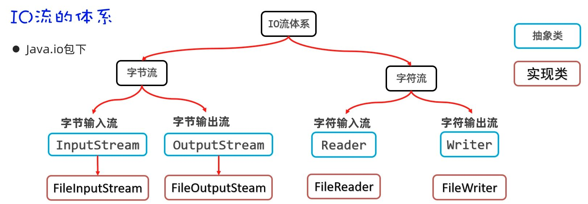
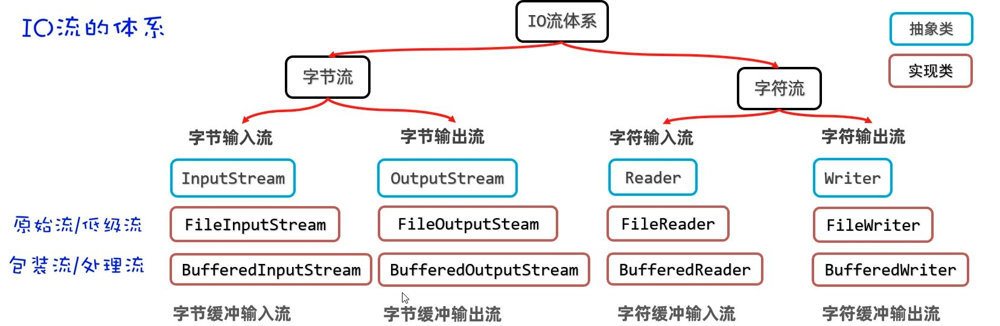

# 字节与字符编码

计算机本质上只认二进制。

最早，英文字符（包括大小写字母、数字、标点等）用 ASCII 编码，每个字符用 1 个字节（8 位）存储，能表示 128 个字符。这对英语世界来说绰绰有余。

但中文字符远比这多得多。为了解决中文存储问题，出现了 GBK 编码。GBK 能表示两万多个汉字，每个中文字符用 2 个字节存储，而且兼容 ASCII。GBK 规定：

- 如果字节的首位是 1，就是汉字（向后读两个字节）；
- 首位是 0，就是英文或数字（向后读一个字节）。

后来，Unicode 字符集横空出世，目标是囊括全世界所有文字和符号。它用 4 个字节表示一个字符，虽然通用但有点**浪费空间**。

真正实用的是 UTF-8。它是 Unicode 的一种编码方式，采用**可变长度**：

- 英文、数字等只占 1 个字节，
- 中文字符占 3 个字节。

这样既兼容 ASCII，又能高效存储多语言内容。现在写代码，也推荐统一用 UTF-8 编码，避免乱码和兼容性问题。

在 Java 里，字符和字节的相互转换，就是所谓的“编码”和“解码”。
### `getBytes()` 编码

`getBytes()` 方法可以把字符串按照指定字符集编码成字节数组。常见用法有两种：

- `byte[] getBytes()`：使用平台默认字符集（通常是 UTF-8）
- `byte[] getBytes(String charsetName)`：使用指定字符集（如 "GBK"）

```java
String wolfName = "灰牙狼";

// 默认编码（UTF-8）
byte[] bytes = wolfName.getBytes();

// 指定编码（GBK）
byte[] bytesGBK = wolfName.getBytes("GBK");
```

这样就能把字符串转成字节数组，便于后续存储或网络传输。

### `new String(byte[] bytes)` 解码

`String` 构造方法可以把字节数组还原成字符串。常见用法：

- `new String(byte[] bytes)`：用平台默认字符集解码
- `new String(byte[] bytes, String charsetName)`：用指定字符集解码

```java
// 假设 bytes 和 bytesGBK 是上面编码得到的字节数组

// 默认解码（UTF-8）
String decodedUTF8 = new String(bytes);
System.out.println(decodedUTF8);

// 指定解码（GBK）
String decodedGBK = new String(bytesGBK, "GBK");
System.out.println(decodedGBK);
```

只要编码和解码时用的字符集一致，内容就不会乱码。

# IO 原始流

File 只负责的是“有没有、在哪、叫什么、多大”等元信息；真正把数据读进来、写出去，还得交给 IO 流。

IO（Input/Output）流可以理解为内存与外部介质（文件、网络等）之间的数据通道：输入流把外部数据读入内存，输出流把内存数据写出到外部。

从数据“怎么流动”和“以什么为单位”两个维度看更清楚：

按方向分为：

- 输入流：外部 → 内存
- 输出流：内存 → 外部

按数据单位可分为：

- 字节流：以字节为单位，适合一切类型（音视频、图片、二进制、文本复制等）
- 字符流：以字符为单位，只适合纯文本（txt、java 等）

四类流的本质就是这四种组合：

- 字节输入流（把磁盘/网络中的字节读入内存）
- 字节输出流（把内存中的字节写出到磁盘/网络）
- 字符输入流（按字符读文本）
- 字符输出流（按字符写文本）



File  代表“文件这个对象”，IO 流负责“文件里的内容”；
配合起来，才算从“有文件”走到“有数据”。接下来按这条脉络，从字节流与字符流分别展开，理解起来更清晰。

## FileInputStream

FileInputStream 是文件字节输入流，作用是以内存为基准，把磁盘文件中的数据以字节形式读入内存。

它的构造器格式如下：

```java
public FileInputStream(File file)
public FileInputStream(String pathname) // 更推荐!
```

两种构造方式都能创建字节输入流管道与源文件接通。第二种传入字符串路径更简洁，其内部会自动包装成 File 对象。

以下是 FileInputStream 的几个核心方法:

#### `read()` 单个字节读取

```java
public int read()
```

每次读取一个字节返回，如果没有数据可读会返回 -1。

```java
InputStream is = new FileInputStream("src/wolf.txt");

// 逐个字节读取
int b1 = is.read();  // 读取第一个字节
System.out.println((char) b1);
int b2 = is.read();  // 读取第二个字节
System.out.println((char) b2);
int b3 = is.read();  // 没有更多数据
System.out.println(b3); // -1
```

**循环改进：**

```java
int b;
while ((b = is.read()) != -1) {
    System.out.print((char) b);
}
```

这种方式虽然简单，但存在明显问题：每次只操作一个字节，磁盘到内存通信本就慢，且无法避免读取汉字时的乱码问题（会截断汉字的字节）。

#### `read(byte[] buffer)` 批量读取

```java
public int read(byte[] buffer)
```

用字节数组批量读取数据，返回实际读取的字节个数，没有数据可读时返回 -1。

```java
byte[] buffer = new byte[3];
int len1 = is.read(buffer);
System.out.println("内容：" + new String(buffer));
System.out.println("个数：" + len1);  // 内容：a60，个数：3

int len2 = is.read(buffer);
System.out.println("内容：" + new String(buffer));
System.out.println("个数：" + len2);  // 内容：ab0，个数：2
```

**注意：** 第二次读取时，a6 被 ab 覆盖，内容变成 ab0。这是因为 `new String(buffer)` 会使用整个数组，包括未覆盖的部分。

**循环改进：**

```java
byte[] buffer = new byte[3];
int len;
while ((len = is.read(buffer)) != -1) {
    String rs = new String(buffer, 0, len);  // 只转换实际读取的部分
    System.out.print(rs);
}
```

这种方式性能较好，但依然会存在截断，无法完全避免汉字乱码问题。

### `readAllBytes()` 读取全部

为了避免截断导致的乱码，可以一次性读取文件的全部字节：

```java
File f = new File("src/wolf.txt");
long size = f.length();
byte[] buffer = new byte[(int) size];
int len = is.read(buffer);
System.out.println("读取的字节：" + len);
System.out.print(new String(buffer));
```

Java 官方早在 java 9 也提供了这种思想的 API，更可以简写为：

```java
byte[] buffer = is.readAllBytes();
System.out.print(new String(buffer));
```

如果文件过大，创建的字节数组也会过大，可能引起内存溢出。读写文本内容更适合用字符流，字节流适合做数据的转移，如文件复制等。

好的！让我重新整理，专注于 OutputStream 本身，构造器拆分成几个代码块仔细说明：

## FileOutputStream

FileOutputStream 是文件字节输出流，作用是以内存为基准，把内存中的数据以字节形式写出到文件中去。

FileOutputStream 的构造器如下：

```java
public FileOutputStream(File file)
public FileOutputStream(String filepath)
```

这两个构造器会覆盖原文件内容，在管道接通时立即清空文件。

```java
// 使用 File 对象
File file = new File("src/output.txt");
OutputStream os1 = new FileOutputStream(file);

// 使用字符串路径（更常用）
OutputStream os2 = new FileOutputStream("src/output.txt");
```

当然，在实际开发中我们肯定不期望直接清空，更希望接着之前的内容继续写。
可以使用这个构造器：

```java
public FileOutputStream(File file, boolean append)
public FileOutputStream(String filepath, boolean append)
```

通过 `append` 参数控制是否追加数据，`true` 表示追加，`false` 表示覆盖。

```java
// 覆盖模式
OutputStream os3 = new FileOutputStream("src/output.txt", false);

// 追加模式（推荐）
OutputStream os4 = new FileOutputStream("src/output.txt", true);
```

除非明确需要覆盖，否则建议使用追加模式，避免意外丢失数据。

以下是 FileInputStream 的几个核心方法:

#### `write()` 写入数据

```java
public void write(int a)                    // 写一个字节
public void write(byte[] buffer)            // 写一个字节数组
public void write(byte[] buffer, int pos, int len)  // 写字节数组的一部分
```

**基本写入操作：**

```java
OutputStream os = new FileOutputStream("src/output.txt");

// 写入单个字节
os.write('a');
os.write(97);  // ASCII 码

// 写入字节数组
byte[] bytes = "abc 我爱您中国 666".getBytes();
os.write(bytes);

// 换行（跨平台支持）
os.write("\r\n".getBytes());
```

**注意：** 写入中文字符时，`getBytes()` 默认使用平台编码，可能产生乱码。建议指定编码：`"中文".getBytes("UTF-8")`。

字节流非常适合做文件复制操作，因为任何文件的底层都是字节，字节流做复制是一字不漏的转移。

```java
// 1. 创建字节输入流管道与源文件接通
InputStream is = new FileInputStream("E:\\resource\\wolf.jpg");
// 2. 创建字节输出流管道与目标文件接通
OutputStream os = new FileOutputStream("E:\\resource\\wolf-bak.jpg");

// 3. 准备字节数组
byte[] buffer = new byte[1024];

// 4. 转移数据
int len;
while ((len = is.read(buffer)) != -1) {
    os.write(buffer, 0, len);
}

System.out.println("复制完成！");
```

使用字节数组作为缓冲区，循环读写直到文件结束，这是文件复制的标准做法。

你说得对！让我重新优化，让文字更连贯，代码块更精简：

## 资源释放新方式

前面文件复制的代码暴露了一个问题：如果在 try 中释放资源，但 try 在释放资源之前遇到了异常，那将会直接跳过资源释放，直接进入 catch，没人关闭流了。

### try-catch-finally 方式

finally 代码区无论 try 中的程序是正常执行了，还是出现了异常，最后都一定会执行 finally 区，即便写了 return，除非 JVM 终止。

```java
try {
    System.out.println(10 / 2);
} catch (Exception e) {
    e.printStackTrace();
} finally {
    System.out.println("finally");
}
```

但是注意，在有返回值的地方不要轻易在 finally 里用 return。

```java
public static int divide() {
    try {
        return 10 / 2;
    } catch (Exception e) {
        e.printStackTrace();
        return -1;
    } finally {
        return 100;  // 这个 return 会覆盖前面的返回值
    }
}
```

实际应用在文件复制时，我们需要在 finally 中手动关闭流，确保资源被释放。

```java
try {
    InputStream is = new FileInputStream("E:\\resource\\wolf.jpg");
    OutputStream os = new FileOutputStream("E:\\resource\\wolf-bak.jpg");

    byte[] buffer = new byte[1024];
    int len;
    while ((len = is.read(buffer)) != -1) {
        os.write(buffer, 0, len);
    }
} catch (IOException e) {
    e.printStackTrace();
} finally {
    // 手动关闭资源
    try {
        if (os != null) os.close();
        if (is != null) is.close();
    } catch (Exception e) {
        e.printStackTrace();
    }
}
```

这种方式虽然能保证资源释放，但代码不够优雅，每个流都要手动判断和关闭。

### try-with-resources 方式

JDK 7 开始提供了更简单的资源释放方案：在 try 后面的括号中定义资源，用完后会自动调用 close 方法。

```java
try (
    InputStream is = new FileInputStream("E:\\resource\\wolf.jpg");
    OutputStream os = new FileOutputStream("E:\\resource\\wolf-bak.jpg")
) {
    byte[] buffer = new byte[1024];
    int len;
    while ((len = is.read(buffer)) != -1) {
        os.write(buffer, 0, len);
    }
} catch (Exception e) {
    e.printStackTrace();
}
```

这样，IO 流就自动具备了自动关闭的能力，大大简化了资源管理。

**关键点：** `()` 中只能放置资源，否则报错。

在  Java  中，资源指的是最终实现了  AutoCloseable  接口的类，这些类到合适的时机会告诉 JVM "我是资源，用完会自动关闭"。

```java
public abstract class InputStream implements Closeable {}
public abstract class OutputStream implements Closeable, Flushable {}
```

查看源码确实发现 IO 流都实现了 Closeable：

```java
public interface Closeable extends AutoCloseable {}
```

而 Closeable 又实现了 AutoCloseable 接口。

## FileReader

FileReader 是文件字符输入流，作用是以内存为基准，把文件中的数据以字符形式读入内存。
相比字节流，字符流专门处理文本文件，能避免汉字乱码问题。

```java
public FileReader(File file)
public FileReader(String pathname)
```

同样也是这两种构造方式，它们都能创建字符输入流管道与源文件接通。那么同样也是第二种传入字符串路径更简洁，实际开发中更常用。

### `read()` 读取单个字符

```java
public int read()
```

每次读取一个字符返回，如果没有数据可读会返回 -1。

```java
Reader fr = new FileReader("src/wolf.txt");

// 逐个字符读取
int c1 = fr.read();  // 读取第一个字符
System.out.println((char) c1);
int c2 = fr.read();  // 读取第二个字符
System.out.println((char) c2);
int c3 = fr.read();  // 没有更多数据
System.out.println(c3); // -1
```

**循环改进：**

```java
int c;
while ((c = fr.read()) != -1) {
    char ch = (char) c;
    System.out.print(ch);
}
```

`read()` 解决了截断带来的汉字乱码问题，因为字符流按字符读取，不会截断汉字的字节。
但总归还是磁盘到内存的通信，每次一个字符，性能较差。

### `read(char[] buffer)` 批量读取

```java
public int read(char[] buffer)
```

用字符数组批量读取数据，返回实际读取的字符个数，没有数据可读时返回 -1。

```java
char[] buffer = new char[3];
int len;
while ((len = fr.read(buffer)) != -1) {
    String rs = new String(buffer, 0, len);  // 只转换实际读取的部分
    System.out.print(rs);
}
```

`read(char[] buffer)`可以避免乱码，性能也较好。这是目前学过的读取文本内容最好的方案，既解决了乱码问题，又提升了性能。

如果只是读写文本内容，优先考虑字符流；如果需要复制文件或处理二进制数据，使用字节流。

我来帮你整理这部分笔记，让它更符合前面部分的风格和表达方式。让我先看看前面部分的笔记风格，然后重新整理这部分内容。

Read file: docs/knowledge/后端基础/第三部分-File 与 IO 流.md
基于前面部分的风格，我来重新整理这部分笔记：

## FileWriter

FileWriter 是文件字符输出流，作用是以内存为基准，把内存中的数据以字符形式写出到文件中去。相比字节流，字符流专门处理文本内容，能避免汉字乱码问题。

FileWriter 提供了几种构造方式，可以根据需要选择：

```java
public FileWriter(File file)
public FileWriter(String filepath) // 推荐
```

通过 `append` 参数可以控制写入模式：

```java
public FileWriter(File file, boolean append)
public FileWriter(String filepath, boolean append)
```

- `true` 表示追加
- `false` 表示覆盖

除非明确需要覆盖，否则建议使用追加模式，避免意外丢失数据。

```java
Writer fw2 = new FileWriter("src/output.txt", true);
```

FileWriter 提供了多种写入方式，满足不同的写入需求。

#### `write()` 写入单个字符

```java
void write(int c)
```

写入一个字符到文件中。参数可以是字符的 ASCII 码值，也可以是字符本身。

```java
Writer fw = new FileWriter("src/output.txt");

// 写入 ASCII 码
fw.write(97);  // 写入字符 'a'
fw.write(65);  // 写入字符 'A'

// 写入字符
fw.write('狼');
fw.write('爪');

// 换行（跨平台支持）
fw.write('\n');
```

#### `write(String str)` 写入字符串

```java
void write(String str)
```

将整个字符串写入文件。这是最常用的写入方式，适合写入完整的文本内容。

```java
// 写入完整字符串
fw.write("灰牙狼的传说");
fw.write("在遥远的森林深处...");

// 写入换行符
fw.write("\r\n");
fw.write("\n");
```

#### `write(String str, int off, int len)` 写入字符串的一部分

```java
void write(String str, int off, int len)
```

写入字符串的指定部分。`off` 是起始位置，`len` 是要写入的长度。

```java
String text = "灰牙狼的传说";
fw.write(text, 0, 3);   // 只写入 "灰牙狼"
fw.write(text, 3, 2);   // 只写入 "的传"
fw.write(text, 5, 2);   // 只写入 "说"
```

#### `write(char[] cbuf)` 写入字符数组

```java
void write(char[] cbuf)
```

将整个字符数组写入文件。适合批量写入字符数据。

```java
char[] chars = "灰牙狼的传说".toCharArray();
fw.write(chars);

// 也可以直接构造字符数组
char[] message = {'灰', '牙', '狼', '的', '传', '说'};
fw.write(message);
```

#### `write(char[] cbuf, int off, int len)` 写入字符数组的一部分

```java
void write(char[] cbuf, int off, int len)
```

写入字符数组的指定部分。`off` 是起始位置，`len` 是要写入的长度。

```java
char[] chars = "灰牙狼的传说".toCharArray();
fw.write(chars, 0, 3);   // 只写入前三个字符
fw.write(chars, 3, 2);   // 只写入中间两个字符
fw.write(chars, 5, 2);   // 只写入最后两个字符
```

## 流控制方法

字符输出流有两个重要的流控制方法，它们决定了数据何时真正写入文件。

#### `flush()` 刷新流

```java
void flush() throws IOException
```

将内存中缓存的数据立即写入文件。调用此方法后，数据会立即生效，不需要等待流关闭。

```java
fw.write("灰牙狼的传说");
fw.flush();  // 立即将缓存数据写入文件
System.out.println("数据已刷新到文件");
```

#### `close()` 关闭流

```java
void close() throws IOException
```

关闭流并释放相关资源。关闭操作会自动调用 `flush()`，确保所有缓存数据都被写入文件。

```java
fw.write("灰牙狼的传说");
fw.close();  // 关闭流，自动包含刷新操作
```

不过 `close()` 方法会自动调用 `flush()`，所以通常只需要调用 `close()` 即可。
但如果在关闭前需要确保数据立即写入，可以手动调用 `flush()`。

# IO 缓冲流

**作用**：在原始流（文件流、字节流、字符流）外再套一层“缓冲桶”，把读写变成“先攒一批、再统一交付”，从而减少磁盘交互次数、提升性能。默认缓冲区大小通常为 **8KB（8192）**。

> 思路：原始流直连磁盘，频繁读写；缓冲流先读/写到内存桶里，桶满或刷新时再一次性与磁盘交互。语义不变，只是更快。

## 字节缓冲流

**类**：`BufferedInputStream`、`BufferedOutputStream`  
**适用**：任意二进制数据（图片、音频、PDF 等）

```java
InputStream  in  = new BufferedInputStream(new FileInputStream("wolves.bin"));
OutputStream out = new BufferedOutputStream(new FileOutputStream("wolves-copy.bin"));
```

把“低级字节流”包装成“缓冲字节流”，读取/写出都会先走 8KB 的内存桶。

例如复制二进制文件：

```java
try (BufferedInputStream in  = new BufferedInputStream(new FileInputStream("wolves.bin"));
     BufferedOutputStream out = new BufferedOutputStream(new FileOutputStream("wolves-copy.bin"))) {

    byte[] buf = new byte[8 * 1024]; // 自定义缓冲数组，配合内部缓冲更稳
    int len;
    while ((len = in.read(buf)) != -1) {
        out.write(buf, 0, len);
    }
    // out.flush(); // 视情况可手动；try-with-resources 关闭时也会刷出
}
```

**要点**

- 读写**数组**比逐字节更高效；内部缓冲 + 外部数组，双保险。
- 关闭 `out` 会隐式 `flush`；长时间运行、希望尽快落盘时可手动 `flush()`。

---

## 二、字符缓冲流

**类**：`BufferedReader`、`BufferedWriter`  
**适用**：文本数据（按字符/行处理），常用于日志、配置、CSV 等。

### `BufferedReader`：按行读取（新增能力）

```java
try (BufferedReader br = new BufferedReader(new FileReader("wolves.txt"))) {
    String line;
    while ((line = br.readLine()) != null) {   // 每次读取一整行（不含行尾分隔符）
        System.out.println(line);
    }
}
```

**说明**

- `readLine()` 是字符缓冲输入流的“独有方法”，**需要用具体类型引用**（不要写成 `Reader br`，否则拿不到该方法）。
- 行尾分隔符被丢弃；如需保留，需自行追加。

### `BufferedWriter`：跨平台换行（新增能力）

```java
try (BufferedWriter bw = new BufferedWriter(new FileWriter("wolves-out.txt"))) {
    bw.write("影牙 狼群编号 W-01");
    bw.newLine();       // 使用系统行分隔符，优于手写 "\r\n"
    bw.write("夜哨 巡猎路线 北岭-寒原");
    // bw.flush();      // 需要立即落盘时可手动
}
```

**说明**

- `newLine()` 使用系统默认行分隔符，避免手写 `\r\n` 带来的跨平台问题。
- 同理，使用 `BufferedWriter` 的具体类型，才能调用 `newLine()`。

---

## 三、几点实用建议

- **何时选字节流 / 字符流**  
   二进制文件用字节流；纯文本用字符流。文本涉及编码，`FileReader/FileWriter` 使用平台默认编码，**需要指定编码时**考虑 `InputStreamReader/OutputStreamWriter` 搭配 `BufferedReader/BufferedWriter`：
  ```java
  try (BufferedReader br = new BufferedReader(
           new InputStreamReader(new FileInputStream("wolves.txt"), "UTF-8"))) {
      // ...
  }
  ```
- **引用类型怎么写**  
   需要 `readLine()` / `newLine()` 等**独有方法**时，用具体类型（`BufferedReader/BufferedWriter`）；否则可用父类型（`Reader/Writer`）保持灵活。
- **不要混搭两种读法**  
   同一个 `BufferedReader` 上，**选一种方式**：要么 `read(char[])` 批量读，要么 `readLine()` 行读。混用容易处理不好边界。
- **缓冲区大小**  
   默认 8KB 已足够；大文件或高吞吐场景可适当调大外部数组（例如 16KB/32KB），观察实际效果。

---

## 四、简短对照

- **字节缓冲**：`BufferedInputStream` / `BufferedOutputStream` → 面向二进制，性能提升，语义不变。
- **字符缓冲**：`BufferedReader` / `BufferedWriter` → 性能提升 + **新增**：`readLine()`、`newLine()`。

---

## 五、小示例：文本“行读—写出”

读取 `wolves.txt`，过滤空行后写入 `wolves-clean.txt`：

```java
try (BufferedReader br  = new BufferedReader(new FileReader("wolves.txt"));
     BufferedWriter bw  = new BufferedWriter(new FileWriter("wolves-clean.txt"))) {

    String line;
    while ((line = br.readLine()) != null) {
        if (line.isBlank()) continue;
        bw.write(line.trim());
        bw.newLine();
    }
}
```

这就是缓冲流最常见的用法组合：**读写更快**，并在字符流场景下获得**按行处理/跨平台换行**的便利。

# 缓冲输入输出流

缓冲输入输出流（Buffered Streams）是在原始 I/O 管道外再包一层约 8 KB 的内存缓冲区。
先批量聚合数据再读写，从而显著减少磁盘与系统调用的次数，整体吞吐更稳定。

直接对磁盘逐字节操作成本高、抖动大；
引入缓冲后，数据先进入“桶”，满桶再倒出或装入，访问节奏更友好，CPU 与存储的配合也更顺滑。



### `BufferedInput/OutputStream`

```java
public BufferedInputStream(InputStream in)
public BufferedOutputStream(OutputStream out)
```

适用于二进制数据（如视频、图片、压缩包）的高频读写场景；
在底层流之上增加缓冲后，单次 I/O 变少、写入更集中，配合字节数组读取通常能获得更可观的性能收益。

```java
// 狼示例：缓冲 + 字节数组拷贝二进制
try (BufferedInputStream  in  = new BufferedInputStream(new FileInputStream("den/wolf.bin"));
     BufferedOutputStream out = new BufferedOutputStream(new FileOutputStream("den/wolf.bin.copy"))) {
    byte[] buf = new byte[8 * 1024];
    int n;
    while ((n = in.read(buf)) != -1) {
        out.write(buf, 0, n);
    }
    // 关闭会隐式 flush；此处保持默认行为即可
}
```

当处理文本而非原始字节时，更合适的选择是字符流；在缓冲之外，还需要合理处理编码与按行读取。

### `BufferedReader`字符缓冲输入

```java
public BufferedReader(Reader in)
public String readLine() // 按行读取，读尽返回 null
```

面向文本的读取，按行处理更自然；缓冲使读取批量化，`readLine()` 直接给到语义化的“行”，便于逐行消费与解析。

```java
// 狼示例：按行读取 UTF-8 文本
try (BufferedReader br = new BufferedReader(new InputStreamReader(
         new FileInputStream("den/wolf.txt"), StandardCharsets.UTF_8))) {
    String line;
    while ((line = br.readLine()) != null) {
        System.out.println(line);
    }
}
```

文本写出同理受益于缓冲，同时需要一个可移植的换行方式，以避免不同平台的换行差异导致的显示异常。

### `BufferedWriter`字符缓冲输出

```java
public BufferedWriter(Writer out)
public void newLine() // 跨平台换行
```

当输出大量文本时，通过缓冲把零碎写入合并为更少的磁盘操作；`newLine()` 根据平台生成合适的换行序列，避免硬编码 `\r\n` 或 `\n` 带来的兼容问题。

```java
// 狼示例：写出文本并使用跨平台换行
try (BufferedWriter bw = new BufferedWriter(new OutputStreamWriter(
         new FileOutputStream("den/howl.txt"), StandardCharsets.UTF_8))) {
    bw.write("狼火在夜里。");
    bw.newLine();
}
```

二进制复制选用 `BufferedInputStream/BufferedOutputStream` 并搭配固定大小的字节数组；
文本读写选用 `BufferedReader/BufferedWriter`，中间通过 `InputStreamReader/OutputStreamWriter` 明确指定 `Charset`，以确保跨环境的一致性与可预期性。

```java
// 读取一行文本，处理后写出为新文件
try (BufferedReader br = new BufferedReader(new InputStreamReader(
         new FileInputStream("den/wolf.in.txt"), StandardCharsets.UTF_8));
     BufferedWriter bw = new BufferedWriter(new OutputStreamWriter(
         new FileOutputStream("den/wolf.out.txt"), StandardCharsets.UTF_8))) {

    String s = br.readLine();               // 最小读取单元：一行
    if (s != null) {
        bw.write(s.toUpperCase());          // 演示：简单处理后写出
        bw.newLine();
    }
}
```

注意：

- 仅包一层缓冲即可；在同一管道上重复套接 `Buffered*` 并不会带来实际收益，反而增加心智负担。
- 文本读写务必显式指定编码；默认编码随环境变化而变化，造成的乱码问题往往难以及时定位。
- 单字节循环读写速度极慢；更合理的做法是使用 `byte[]` 作为缓存，或在字符流中按行处理。
- `close()` 会触发缓冲区刷新；除非有明确的阶段性落盘需求，否则无需频繁手动 `flush()`。

在二进制与文本两类场景中，采用“缓冲层 + 合理批量”的通用策略，既能降低磁盘压力，也能平滑 I/O 抖动，最终体现为更稳定、更可控的工程表现。

# 性能分析（重点）：原始流 vs 缓冲流

一句话目的：在相同拷贝逻辑下，仅更换“是否缓冲、是否按数组批量”的策略，评估磁盘大文件复制的性能差异与稳定性。

过渡：I/O 的瓶颈常在系统调用次数与页缓存命中率。单字节循环使调用频繁且不稳定；引入缓冲与批量读取后，调用更集中，吞吐与抖动都更可控。

## 测试对象与步骤

- 对象：一个较大的二进制文件（视频）。
- 步骤：以完全相同的复制逻辑为基线，只替换“流类型 + 读取粒度”，形成四种组合：
  1. 低级字节流 + 单字节读取
  2. 低级字节流 + 字节数组读取
  3. 缓冲字节流 + 单字节读取
  4. 缓冲字节流 + 字节数组读取

过渡：先给到最小可复用的复制函数，随后分别演示四种流构造方式。

## 基线复制函数

```java
// 狼工具：单字节搬运（极慢，用作对照）
static void copyByteByByte(InputStream in, OutputStream out) throws IOException {
    for (int b; (b = in.read()) != -1; ) out.write(b);
}

// 狼工具：数组搬运（常用方案）
static void copyByBuffer(InputStream in, OutputStream out, int size) throws IOException {
    byte[] buf = new byte[size];
    for (int n; (n = in.read(buf)) != -1; ) out.write(buf, 0, n);
}

// 狼工具：计时包装
static long time(RunnableWithIOException r) {
    long t0 = System.nanoTime();
    try { r.run(); } catch (IOException e) { throw new UncheckedIOException(e); }
    return (System.nanoTime() - t0) / 1_000_000; // ms
}

@FunctionalInterface interface RunnableWithIOException { void run() throws IOException; }
```

## 四种组合

### 1) 低级 + 单字节

```java
long t1 = time(() -> {
    try (InputStream  in  = new FileInputStream("den/wolf.mp4");
         OutputStream out = new FileOutputStream("den/wolf.01.copy")) {
        copyByteByByte(in, out);
    }
});
System.out.println("低级+单字节: " + t1 + " ms");
```

低级 + 单字节：**极慢**（量级几十秒，随文件大小线性恶化）

### 2) 低级 + 字节数组

```java
long t2 = time(() -> {
    try (InputStream  in  = new FileInputStream("den/wolf.mp4");
         OutputStream out = new FileOutputStream("den/wolf.02.copy")) {
        copyByBuffer(in, out, 8 * 1024); // 8 KB
    }
});
System.out.println("低级+数组: " + t2 + " ms");
```

低级 + 数组（8 KB）：**可用**（数秒量级，视磁盘/缓存波动）

### 3) 缓冲 + 单字节

```java
long t3 = time(() -> {
    try (InputStream  in  = new BufferedInputStream(new FileInputStream("den/wolf.mp4"));
         OutputStream out = new BufferedOutputStream(new FileOutputStream("den/wolf.03.copy"))) {
        copyByteByByte(in, out);
    }
});
System.out.println("缓冲+单字节: " + t3 + " ms");
```

缓冲 + 单字节：**仍慢**（比低级单字节好一些，但仍不划算）

### 4) 缓冲 + 字节数组（推荐）

```java
long t4 = time(() -> {
    try (InputStream  in  = new BufferedInputStream(new FileInputStream("den/wolf.mp4"));
         OutputStream out = new BufferedOutputStream(new FileOutputStream("den/wolf.04.copy"))) {
        copyByBuffer(in, out, 8 * 1024); // 8 KB
    }
});
System.out.println("缓冲+数组: " + t4 + " ms");
```

缓冲 + 数组（8 KB）：**最快且稳定**（通常亚秒到 1–2 秒区间）

## 经验与结论

- 规律：**批量胜过单字节**，**缓冲 + 批量最佳**。
- 数组大小：8–32 KB 为常用甜点区；继续增大存在**收益递减**，过大可能导致线程占用内存增多且对总时间提升有限。
- 低级流并非天然更慢：**低级 + 合理数组**能逼近“缓冲 + 数组”的成绩；但缓冲流在多数场景更稳、更省心。
- 只包一层缓冲：在同一管道上重复套 `Buffered*` 无实益。
- `flush` 语义：`close()` 会隐式 `flush`；没有阶段性落盘需求时无需频繁显式 `flush()`。
- 波动来源：操作系统页缓存、SSD 写放大、杀毒扫描与并发 I/O 都会影响结果，单次数据仅作趋势参考。
- 备选捷径：若仅为文件对文件复制，`Files.copy(Path, Path, REPLACE_EXISTING)` 更简洁；跨平台稳定性较好。
