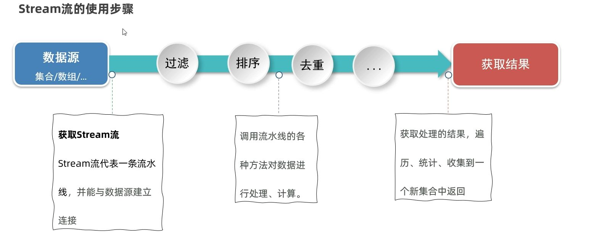

# Stream 流

Stream 流是 Java 8 新增的一套 API（`java.util.stream.*`），用于操作集合或数组的数据。它结合了 Lambda 表达式的语法风格，让数据处理逻辑更紧凑，避免传统循环中过多的样板代码。

流有一个重要特性——**只能用一次**。这是因为它内部有一个指针，每经过一次处理，指针就向前移动，不会回头。

传统的集合处理往往需要：

- 手动创建临时集合
- 遍历元素
- 写条件判断并添加符合条件的结果

这样的代码不仅冗长，而且逻辑分散。Stream 则把这些步骤整合成链式调用，把“数据来源—加工—结果收集”放在一条线上完成，逻辑更集中，结构更直观。

例如集合存储了一群名字，我们要筛选出名字以“灰”开头且名字长度为三个字的对象。

传统写法：

```java
List<String> wolfPack = new ArrayList<>();
wolfPack.add("灰牙狼");
wolfPack.add("白牙狼");
wolfPack.add("黑牙狼");
wolfPack.add("红狼王");
wolfPack.add("灰狼王");

List<String> grayWolves = new ArrayList<>();
for (String wolf : wolfPack) {
    if (wolf.startsWith("灰") && wolf.length() == 3) {
        grayWolves.add(wolf);
    }
}
System.out.println(grayWolves);
```

Stream 改写：

```java
List<String> wolfPack = new ArrayList<>();
wolfPack.add("灰牙狼");
wolfPack.add("白牙狼");
wolfPack.add("黑牙狼");
wolfPack.add("红狼王");
wolfPack.add("灰狼王");

List<String> grayWolves = wolfPack.stream()
    .filter(wolf -> wolf.startsWith("灰") && wolf.length() == 3)
    .collect(Collectors.toList());

System.out.println(grayWolves);
```

改写后的代码，将数据的处理过程清晰地拆成三步：

1. **获取流**：`wolfPack.stream()`
2. **中间操作**：`.filter(...)` 筛选符合条件的元素
3. **终端操作**：`.collect(...)` 收集为新的集合

Stream 像一条数据流水线：



- **起点**：数据源（集合、数组等）进入流
- **中间环节**：过滤、映射、排序等加工步骤（延迟执行）
- **终点**：终端操作触发，返回最终结果

这种结构让你在处理数据时保持思路集中，修改或扩展步骤也很方便。比如在 `.filter()` 之后加上 `.sorted()`，就能在筛选的同时完成排序。

# 获取 Stream 流

在 Java 中，要使用 Stream API 进行数据处理，第一步就是**获取流**。  
不同的数据源（集合、数组、Map 等）提供了各自的获取方式。掌握这些入口方法，就等于打通了“流水线”的进水口。

下面按数据源类型，逐一演示常用的获取方式。

### `stream()` 从集合获取流

所有实现了 `Collection` 接口的集合（如 `List`、`Set`）都可以直接调用 `stream()` 方法，得到一个顺序流。

```java
List<String> wolves = new ArrayList<>();
Collections.addAll(wolves, "灰牙狼", "白牙狼", "黑牙狼", "红狼王", "灰狼王");

Stream<String> wolfStream = wolves.stream();
System.out.println(wolfStream.count()); // 输出 5
```

注意，`stream()` 返回的是一个 **Stream 对象**，流只能使用一次，像上面 `count()` 这种**终端操作**统计之后，这个流就失效了。

### 从 Map 获取流

`Map` 不是 `Collection` 的子接口，所以它没有直接的 `stream()` 方法。要获取流，需要先将其转换成键、值或键值对的集合。

- **键流**（Key Stream）

  ```java
  Map<String, Integer> wolfAges = new HashMap<>();
  wolfAges.put("灰牙狼", 5);
  wolfAges.put("白牙狼", 4);

  Stream<String> keyStream = wolfAges.keySet().stream();
  keyStream.forEach(System.out::println); // 输出所有狼的名字
  ```

- **值流**（Value Stream）

```java
  Stream<Integer> valueStream = wolfAges.values().stream();
  valueStream.forEach(System.out::println); // 输出所有狼的年龄
```

- **键值对流**（Entry Stream）

```java
  Stream<Map.Entry<String, Integer>> entryStream = wolfAges.entrySet().stream();
  entryStream.forEach(entry -> System.out.println(entry.getKey() + " - " + entry.getValue()));
```

### 从数组获取流

数组并不直接拥有 `stream()` 方法，但可以通过以下两种方式获取流：

1. **`Arrays.stream(T[] array)`**

   ```java
   String[] wolfNames = {"灰牙狼", "白牙狼", "黑牙狼"};
   Stream<String> arrayStream1 = Arrays.stream(wolfNames);
   arrayStream1.forEach(System.out::println);
   ```

2. **`Stream.of(T... values)`**

   ```java
   String[] wolfNames = {"灰牙狼", "白牙狼", "黑牙狼"};
   Stream<String> arrayStream2 = Stream.of(wolfNames);
   arrayStream2.forEach(System.out::println);
   ```

两种方式在大多数情况下等效，选择哪一种主要看个人习惯。

获取流的核心就是根据数据源选择入口方法：

- 集合 → `.stream()`
- Map → 转成键/值/键值对集合再 `.stream()`
- 数组 → `Arrays.stream()` 或 `Stream.of()`

只要能把数据源转成流，就能接上 Stream 的“流水线”，后续就可以用各种中间操作去加工数据。

# 中间方法

中间方法能够调用后会返回**新的 Stream 对象**的方法，这使得我们可以把多个操作“链”在一起使用（链式编程）。  
中间方法本身不会触发数据的终端处理，只有终端方法（如 `forEach`、`collect` 等）才会让流水线真正执行。

### `filter` 过滤

`filter(Predicate<? super T> predicate)` 用于对流中的元素进行条件过滤，保留满足条件的元素。

```java
list.stream()
    .filter(s -> s.length() == 3)
    .forEach(System.out::println);
```

适合筛选名字长度、属性值等符合条件的元素。

### `sorted` 排序

无参数的 `sorted()` 会对元素进行**自然顺序**排序（元素需实现 `Comparable` 接口）。  
带参数的 `sorted(Comparator<? super T> comparator)` 则按指定规则排序。

```java
// 自然排序
movies.stream()
      .sorted()
      .forEach(System.out::println);

// 按分数降序
movies.stream()
      .sorted((m1, m2) -> Double.compare(m2.getScore(), m1.getScore()))
      .forEach(System.out::println);
```

### `limit` 截取前 N 个

`limit(long maxSize)` 会截取流中的前 N 个元素，多用于获取“前几名”数据。

```java
movies.stream()
      .sorted((m1, m2) -> Double.compare(m2.getScore(), m1.getScore()))
      .limit(3)
      .forEach(System.out::println);
```

### `skip` 跳过前 N 个

`skip(long n)` 会跳过流中的前 N 个元素。

```java
movies.stream()
      .sorted((m1, m2) -> Double.compare(m2.getScore(), m1.getScore()))
      .skip(3)
      .forEach(System.out::println);
```

### `distinct` 去重

`distinct()` 会去除流中重复的元素，依赖 `hashCode` 和 `equals` 方法判断是否相等。  
如果是对象，需要先在类中重写这两个方法。

```java
movies.stream()
      .distinct()
      .forEach(System.out::println);
```

### `map` 数据加工

`map(Function<? super T, ? extends R> mapper)` 用于将流中的每个元素转换成新元素，返回新的流。  
它常用于提取对象的某个属性，或对数据进行计算、拼接等加工。

```java
movies.stream()
      .map(m -> m.getName() + " - " + m.getScore())
      .forEach(System.out::println);
```

### `concat` 合并流

`Stream.concat(Stream<? extends T> a, Stream<? extends T> b)` 会将两个流合并成一个流。

```java
Stream<String> s1 = Stream.of("张三", "楚留香", "西门吹牛");
Stream<String> s2 = Stream.of("李四", "石观音");

Stream<String> allStream = Stream.concat(s1, s2);
System.out.println(allStream.count()); // 5
```

# 终结方法

终结方法一旦调用就会触发整个流的最终执行，并且不会返回新的 Stream 流，因此无法继续链式调用。
它的作用是把前面所有中间操作的结果真正落实下来，比如打印、统计、收集等，只有终结方法才会真正让流开始遍历数据。

下面按功能逐一介绍常用的终结方法及使用方式。

### `forEach` 遍历输出

`forEach(Consumer action)` 会对流中每个元素执行给定的操作，通常用于直接打印或进行简单处理。

```java
movies.stream()
      .forEach(System.out::println);
```

上面会将 `movies` 集合中的所有元素逐一输出。注意，这种遍历是终结操作，流用过就不能再用了。

### `count` 统计元素个数

`count()` 用于统计流中元素的数量，返回一个 `long` 类型结果。可以搭配中间方法，比如 `skip`、`filter`。

```java
long count = movies.stream()
                   .skip(2) // 跳过前两个
                   .count();
System.out.println(count);
```

上例中，`skip(2)` 先跳过两个元素，`count()` 再统计剩余的数量。

### `max` / `min` 获取最大值和最小值

`max(Comparator comparator)` 和 `min(Comparator comparator)` 分别用来找出流中的最大值和最小值，返回 `Optional`，因此通常会在后面加 `.get()` 获取具体元素。

```java
Movie max = movies.stream()
                  .max((o1, o2) -> Double.compare(o1.getScore(), o2.getScore()))
                  .get();
System.out.println(max);

Movie min = movies.stream()
                  .min((o1, o2) -> Double.compare(o1.getScore(), o2.getScore()))
                  .get();
System.out.println(min);
```

这里通过 `Double.compare` 按评分进行比较，取出评分最高和最低的电影。

### `collect` 收集结果

`collect(Collector collector)` 用于将流中的数据重新收集到集合或其他容器中去，这通常是开发中的最终目的之一。`Collectors` 工具类提供了多种现成的收集方式：

- `Collectors.toList()` 收集到 `List`
- `Collectors.toSet()` 收集到 `Set`
- `Collectors.toMap(Function keyMapper, Function valueMapper)` 收集到 `Map`

```java
List<String> names = movies.stream()
                           .map(Movie::getName) // 提取电影名
                           .collect(Collectors.toList());

Set<Double> scores = movies.stream()
                           .map(Movie::getScore)
                           .collect(Collectors.toSet());

Map<String, Double> movieMap = movies.stream()
                                     .collect(Collectors.toMap(Movie::getName, Movie::getScore));
```

### `toArray` 转换为数组

`toArray()` 会将流中的元素收集到一个数组中。默认返回 `Object[]`，可以通过 `toArray(IntFunction<A[]>)` 指定数组类型。

```java
Object[] arr = movies.stream()
                     .map(Movie::getName)
                     .toArray();

String[] nameArr = movies.stream()
                         .map(Movie::getName)
                         .toArray(String[]::new);
```

这样就能把流的结果转回原始的数组形式。
