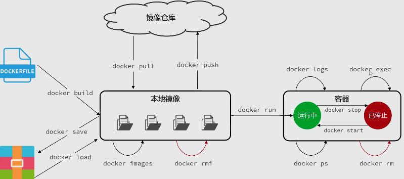

写项目时，代码能跑起来只是第一步，真正麻烦的往往是部署。

Docker 主要解决的就是这类环境问题。它可以把程序运行需要的环境整理成一套相对独立的东西，让项目换到别的机器上时，也能尽量保持一致的运行方式。
想要理解 Docker，先抓住三个概念就够了：

- **容器** ：可以理解成一个轻量的运行空间。比如一个 MySQL 容器里就跑着 MySQL，一个 Redis 容器里就跑着 Redis。

- **镜像**：是创建容器的模板。比如有了 MySQL 镜像，就可以根据它启动出一个 MySQL 容器。

- **镜像仓库** ：就是存放镜像的地方。Docker 官方的镜像仓库是 Docker Hub，里面可以找到 MySQL、Redis、Nginx 等常见软件的官方镜像。

镜像用来创建容器，容器用来运行服务，镜像仓库用来保存和下载镜像。

# 使用 Docker 部署 MySQL

在开始操作之前，有一点需要先强调：学习 Docker 部署，最好直接使用 Linux 环境。
Docker 本身是更偏向 Linux 下的容器化技术。在 Windows 或 macOS 上使用 Docker 时，底层通常也要借助 Linux 虚拟化环境来运行。为了减少这些额外干扰，后面的示例统一以 Linux 虚拟机 为环境进行演示。

Docker 的安装方式可以参考官方文档。学习阶段也可以使用 [get.docker.com](https://get.docker.com) 提供的安装脚本快速安装：

```bash
curl -fsSL https://get.docker.com | bash
```

安装完成后，启动 Docker：

```bash
systemctl start docker
```

设置 Docker 开机自启：

```bash
systemctl enable docker
```

可以通过下面的命令检查 Docker 是否安装成功：

```bash
docker -v
```

如果虚拟机里原本已经安装了 MySQL，需要先停掉原来的 MySQL 服务，避免占用 `3306` 端口。然后执行下面的命令，就可以通过 Docker 启动一个 MySQL 容器：

```bash
docker run -d \
  --name mysql \
  -p 3306:3306 \
  -e TZ=Asia/Shanghai \
  -e MYSQL_ROOT_PASSWORD=123456 \
  mysql:8.0
```

这条命令会做几件事：从镜像启动一个 MySQL 容器，把容器的 `3306` 端口映射到虚拟机的 `3306` 端口，并设置 MySQL 的 root 密码。

如果本地没有 `mysql:8.0` 镜像，Docker 会自动从镜像仓库下载。也可以先手动拉取镜像：

```bash
docker pull mysql:8.0
```

如果服务器不能联网，也可以提前准备好镜像文件，再通过离线方式导入：

```bash
docker load -i mysql.tar
```

启动完成后，可以查看正在运行的容器：

```bash
docker ps
```

如果能看到名为 `mysql` 的容器，并且状态为 `Up`，就说明 MySQL 已经通过 Docker 跑起来了。

如果连接不上 MySQL，还要检查服务器防火墙是否放行了 `3306` 端口。学习环境中也可以临时关闭防火墙：

```bash
systemctl stop firewalld
```

如果希望重启后防火墙也不自动启动：

```bash
systemctl disable firewalld
```

不过关闭防火墙只适合本地虚拟机或学习环境。真正的服务器更推荐开放指定端口，而不是直接把防火墙关掉。

到这里，先通过部署 MySQL 感受一下 Docker 的使用方式：原本需要手动安装和配置的服务，现在可以通过一条 `docker run` 命令启动起来。

接下来会把刚刚用到的这些 Docker 指令拆开说明，包括镜像下载、容器创建、端口映射、环境变量设置和容器查看等内容。先知道它们大概在做什么就行。

# 常用命令

前面通过 `docker run` 快速启动了一个 MySQL 容器，但这条命令背后其实涉及镜像下载、容器创建、端口映射、环境变量配置等多个动作。



接下来就把常用命令拆开看。先从镜像下载开始。

## docker pull

`docker pull` 用来从镜像仓库中下载镜像。

比如下载 MySQL 8.0 镜像，可以执行：

```bash
docker pull mysql:8.0
```

这里的 `mysql:8.0` 表示镜像名称和版本号，其中 `mysql` 是镜像名，`8.0` 是镜像标签，也就是常说的 tag。

如果不写版本号，Docker 默认会拉取 `latest` 标签：

```bash
docker pull mysql
```

它等价于：

```bash
docker pull mysql:latest
```

不过实际使用时，通常更推荐写清楚版本号。好处是版本更明确，后面重新部署时也更容易保持一致。否则直接使用 `latest`，可能会因为镜像版本变化导致环境不稳定。

MySQL 这类常见镜像可以在 [Docker Hub](https://hub.docker.com/) 上找到。Docker Hub 是 Docker 官方提供的镜像仓库，里面有很多常用软件的官方镜像，比如 MySQL、Redis、Nginx、OpenJDK 等。

另外，镜像名称还有一些省略规则。比如：

```bash
docker pull mysql:8.0
```

完整写法其实可以理解为：

```bash
docker pull docker.io/library/mysql:8.0
```

其中：

- `docker.io` 表示默认使用 Docker Hub。
- `library` 表示官方镜像所在的默认命名空间。
- `mysql` 是镜像名称。
- `8.0` 是镜像标签。

所以我们平时拉取官方镜像时，一般直接写：

```bash
docker pull mysql:8.0
```

就够了。

在国内网络环境下，使用 `docker pull` 时可能会遇到下载很慢、连接超时、拉取失败等问题。比较常见的处理方式是给 Docker 配置镜像加速地址，也就是让 Docker 优先从镜像站拉取内容。

Docker 官方文档也说明，Linux 常规安装下 Docker 守护进程的配置文件一般位于 `/etc/docker/daemon.json`，可以通过这个 JSON 配置文件集中管理 Docker daemon 的配置。([Docker Documentation][1])

可以编辑这个文件：

```bash
vi /etc/docker/daemon.json
```

写入类似配置：

```json
{
  "registry-mirrors": [
    "https://你的镜像站地址"
  ]
}
```

保存后重新加载配置，并重启 Docker：

```bash
systemctl daemon-reload
systemctl restart docker
```

镜像站地址也可能会失效，不同网络环境下可用情况也不一样。

国内 Docker Hub 镜像源近几年变化比较频繁，有些旧的加速地址已经不能稳定使用，所以笔记里不建议死记某一个固定地址。遇到拉取失败时，再根据当前可用的镜像站进行替换。([比邻][2])

### docker images

镜像下载完成后，可以使用下面的命令查看本机已有镜像：

```bash
docker images
```

### docker rmi

如果某个镜像不再需要，可以通过 `docker rmi` 删除：

```bash
docker rmi mysql:8.0
```

也可以根据镜像 ID 删除：

```bash
docker rmi 镜像ID
```

[1]: https://docs.docker.com/engine/daemon/?utm_source=chatgpt.com "Docker daemon configuration overview"
[2]: https://eastondev.com/blog/en/posts/dev/20251217-docker-mirror-guide-2025/?utm_source=chatgpt.com "Best Docker Registry Mirror China 2026: Fix Pull Timeout in 5 ..."

## docker run

`docker run` 用来**根据镜像创建并运行容器**。

```bash
docker run mysql:8.0
```

这条命令表示使用 `mysql:8.0` 这个镜像创建并启动一个容器。先看一个更简单的例子，这里可以换成 Nginx：

```bash
docker run nginx
```

执行后，Docker 会基于 `nginx` 镜像启动一个容器。
如果本机没有这个镜像，Docker 会先自动从镜像仓库中拉取镜像，然后再创建并运行容器。

也就是说，下面两步：

```bash
docker pull nginx
docker run nginx
```

在很多情况下可以简化成一步：

```bash
docker run nginx
```

如果镜像不存在，Docker 会自动下载；如果镜像已经存在，就会直接使用本地镜像创建容器。

### -d 容器后台运行

不过，直接执行 `docker run nginx` 时，会发现一个问题：**当前控制台被容器占用了**。

这时控制台会一直显示容器运行过程中的输出，不能继续输入其他命令。对于数据库、Nginx 这类长期运行的服务来说，这显然不太方便。

所以实际使用时，通常会加上 `-d` 参数：

```bash
docker run -d nginx
```

`-d` 是 `detach` 的意思，表示让容器在后台运行。
这样启动容器后，控制台不会被阻塞，可以继续执行其他命令。相应地，容器后续产生的日志也不会直接打印在当前控制台中。

### docker ps

容器启动后，可以使用 `docker ps` 查看正在运行的容器：

```bash
docker ps
```

有些 Linux 环境中，如果当前用户没有直接操作 Docker 的权限，需要在前面加上 `sudo`：

```bash
sudo docker ps
```

执行后大概会看到类似结果：

```bash
CONTAINER ID   IMAGE     COMMAND                  CREATED          STATUS          PORTS     NAMES
a1b2c3d4e5f6   nginx     "/docker-entrypoint.…"   10 seconds ago   Up 9 seconds    80/tcp    bold_wolf
```

| 字段           | 说明                                                         |
| -------------- | ------------------------------------------------------------ |
| `CONTAINER ID` | 容器 ID，可以用来操作这个容器。                              |
| `IMAGE`        | 该容器使用的镜像。                                           |
| `COMMAND`      | 容器启动时执行的命令，初学阶段不用太细看。                   |
| `CREATED`      | 容器创建时间。                                               |
| `STATUS`       | 容器当前状态，例如 `Up` 表示正在运行。                       |
| `PORTS`        | 容器暴露或映射的端口。                                       |
| `NAMES`        | 容器名称。默认情况下 Docker 会随机生成，后面也可以手动指定。 |

至此 `docker run` 最基本的理解就是：

```bash
docker run 镜像名
```

它会根据指定镜像创建并运行一个新的容器。
如果镜像不存在，Docker 会先尝试自动拉取镜像；如果镜像已经存在，就直接使用本地镜像。

#### -p 端口映射

前面虽然已经通过 `docker run -d nginx` 启动了一个 Nginx 容器，但这时直接访问宿主机的端口，不一定能访问到容器里的 Nginx 服务。

因为默认情况下，容器网络和宿主机网络是隔离的。
Nginx 在容器内部监听的是 `80` 端口，但宿主机并不会自动把自己的 `80` 端口转发给这个容器。

这时就需要使用 `-p` 参数进行端口映射：

```bash id="tjfoww"
docker run -d -p 80:80 nginx
```

`-p` 用来把宿主机端口和容器端口绑定起来，基本格式是：

```bash id="t13uq9"
-p 宿主机端口:容器内端口
```

注意顺序是 **先外后内**。
前面的端口是宿主机端口，也就是外部访问时使用的端口；后面的端口是容器内部服务实际监听的端口。

所以这条命令表示把宿主机的 `80` 端口映射到容器内部的 `80` 端口。这样访问宿主机的 `80` 端口时，请求就会被转发到 Nginx 容器中。

如果不想占用宿主机的 `80` 端口，也可以换成其他端口，比如：

```bash id="2x3wr8"
docker run -d -p 8080:80 nginx
```

这表示把宿主机的 `8080` 端口映射到容器内部的 `80` 端口。
此时访问宿主机的 `8080` 端口，实际访问到的就是容器里的 Nginx 服务。

也就是：

```bash id="16pwfo"
访问宿主机 8080 端口 → 转发到容器内部 80 端口
```

所以，`-p` 的作用就是给容器里的服务开一个“外部入口”。
容器内部服务监听哪个端口，就把宿主机的某个端口映射到它上面。这样宿主机或外部机器才能正常访问容器中的服务。

#### -v 挂载卷

除了端口映射，`docker run` 中还有一个很重要的参数是 `-v`。

`-v` 用来把宿主机中的目录或 Docker 管理的存储卷，挂载到容器内部。这样容器内产生的数据就可以保存到容器外部，避免容器删除后数据一起丢失。

例如 MySQL 容器中的数据默认保存在容器内部。如果没有挂载卷，删除容器后，这些数据也会跟着消失。为了让数据持久化保存，可以把 MySQL 的数据目录挂载出来。

`-v` 的基本格式是：

```bash id="h0d9ir"
-v 宿主机目录:容器内目录
```

例如：

```bash id="klb2rq"
docker run -d \
  --name mysql \
  -p 3306:3306 \
  -v /data/mysql:/var/lib/mysql \
  -e MYSQL_ROOT_PASSWORD=123456 \
  mysql:8.0
```

这条命令中：

```bash id="zi5y89"
-v /data/mysql:/var/lib/mysql
```

表示把宿主机的 `/data/mysql` 目录挂载到容器内部的 `/var/lib/mysql` 目录。MySQL 写入的数据，最终会保存在宿主机的 `/data/mysql` 中。

这种直接指定宿主机目录的方式，叫做**绑定挂载**。

除了绑定挂载，也可以使用 Docker 自己管理的存储卷，也就是 **volume**：

```bash id="4z4c4g"
-v mysql-data:/var/lib/mysql
```

例如：

```bash id="94rzc5"
docker run -d \
  --name mysql \
  -p 3306:3306 \
  -v mysql-data:/var/lib/mysql \
  -e MYSQL_ROOT_PASSWORD=123456 \
  mysql:8.0
```

这里的 `mysql-data` 不是宿主机上的具体路径，而是 Docker 创建并管理的一个命名卷。
这种方式叫做**命名卷挂载**。

两种方式可以简单这样区分：

| 挂载方式   | 写法                       | 说明                     |
| ---------- | -------------------------- | ------------------------ |
| 绑定挂载   | `-v 宿主机目录:容器内目录` | 明确指定宿主机中的目录。 |
| 命名卷挂载 | `-v 卷名:容器内目录`       | 由 Docker 管理存储位置。 |

如果想查看当前已有的 volume，可以使用：

```bash id="5pjad1"
docker volume list
```

删除指定 volume：

```bash id="83kag5"
docker volume rm mysql-data
```

`rm` 也可以写成完整形式：

```bash id="gu6aja"
docker volume remove mysql-data
```

如果想清理没有被容器使用的 volume，可以使用：

```bash id="65y5fq"
docker volume prune -a
```

不过清理 volume 前要确认里面没有需要保留的数据。对于 MySQL 这类服务，卷里往往保存着数据库文件，别手快乱删。

#### -e 环境变量

`-e` 用来给容器传递环境变量。

有些镜像在启动时需要通过环境变量完成初始化配置。比如 MySQL 容器启动时，就可以通过 `MYSQL_ROOT_PASSWORD` 设置 root 用户密码：

```bash id="0s6ke4"
docker run -d \
  --name mysql \
  -p 3306:3306 \
  -e MYSQL_ROOT_PASSWORD=123456 \
  mysql:8.0
```

这里的：

```bash id="6c7haj"
-e MYSQL_ROOT_PASSWORD=123456
```

就是把 `MYSQL_ROOT_PASSWORD` 这个环境变量传给容器。MySQL 镜像启动时会读取它，并用它设置 root 密码。

#### --name 指定容器名称

`--name` 用来给容器指定名称。

如果不写 `--name`，Docker 会自动生成一个随机名称。虽然也能用，但不方便记。

例如：

```bash id="8b9cuo"
docker run -d --name mysql mysql:8.0
```

这样创建出来的容器名称就是 `mysql`。

后面使用 `docker ps` 查看容器时，可以在 `NAMES` 字段中看到这个名字。操作容器时，容器名和容器 ID 都可以使用：

```bash id="80okqb"
docker stop mysql
docker start mysql
```

相比容器 ID，名字的可读性更高，实际使用时也更方便。

#### -it 交互式运行容器

`-it` 通常用于让控制台进入容器，获得一个可交互的命令环境。

它一般会和 `--rm` 一起使用：

```bash id="vq7my3"
docker run -it --rm ubuntu bash
```

这里的：

```bash id="bkagez"
-it
```

表示以交互方式运行容器。

```bash id="84qzjt"
--rm
```

表示容器停止后自动删除。

这类命令一般用于临时测试、临时进入某个 Linux 环境，或者快速验证一些命令。因为加了 `--rm`，容器退出后会自动清理，不会留下没用的容器。

#### --restart 重启策略

`--restart` 用来配置容器的重启策略。

比如希望容器异常停止后自动重启，可以写：

```bash id="w7h4sh"
docker run -d \
  --name nginx \
  --restart always \
  nginx
```

常见参数可以简单记这几个：

| 参数             | 说明                         |
| ---------------- | ---------------------------- |
| `no`             | 默认值，不自动重启容器。     |
| `always`         | 容器停止后总是自动重启。     |
| `unless-stopped` | 除非手动停止，否则自动重启。 |
| `on-failure`     | 只有容器异常退出时才重启。   |

对于 MySQL、Redis、Nginx 这类长期运行的服务，比较常见的是：

```bash id="9u9eyv"
--restart always
```

或者：

```bash id="ulsz14"
--restart unless-stopped
```

### start/stop 容器启停

启动已经存在的容器：

```bash id="vthrv2"
docker start 容器ID或容器名
```

停止正在运行的容器：

```bash id="ubxxan"
docker stop 容器ID或容器名
```

例如：

```bash id="mpdkts"
docker stop mysql
docker start mysql
```

如果想查看正在运行的容器：

```bash id="5dh0ts"
docker ps
```

如果想查看所有容器，包括已经停止的容器：

```bash id="v55m6y"
docker ps -a
```

正常使用 `docker start` 和 `docker stop` 启停容器时，之前配置好的端口映射、挂载卷、环境变量等信息不会丢失。它们属于这个容器的创建配置，会跟着容器保存下来。

### inspect 查看容器信息

如果忘记某个容器当初配置了哪些端口映射、挂载卷或环境变量，可以使用 `docker inspect` 查看详细信息：

```bash id="b2eau3"
docker inspect 容器ID或容器名
```

例如：

```bash id="uv5ukf"
docker inspect mysql
```

这个命令返回的内容很多，里面会包含容器的网络、端口、挂载卷、环境变量等详细配置。

### create 创建但不立即运行容器

`docker create` 和 `docker run` 很像，都可以根据镜像创建容器。

区别是：`docker create` 只创建容器，不会立即启动。

```bash id="wjp39r"
docker create --name nginx nginx
```

创建后如果想运行它，再使用：

```bash id="da6d9k"
docker start nginx
```

而 `docker run` 可以理解成：

```bash id="cfc97j"
docker create + docker start
```

也就是创建并启动。

### logs 查看容器日志

容器在后台运行后，日志不会直接打印在当前控制台。
如果想查看容器日志，可以使用：

```bash id="vdjeao"
docker logs 容器ID或容器名
```

例如：

```bash id="fq6s50"
docker logs mysql
```

如果想持续查看日志变化，可以加上 `-f`：

```bash id="wvih3w"
docker logs -f mysql
```

这里的 `-f` 表示持续跟随日志输出，适合排查服务启动失败、运行报错等问题。

### rm 删除容器

如果某个容器不再需要，可以使用 `docker rm` 删除：

```bash id="8wixg0"
docker rm 容器ID或容器名
```

例如：

```bash id="3nngyn"
docker rm mysql
```

如果容器还在运行，直接删除会失败。
这时可以先停止容器：

```bash id="msnztm"
docker stop mysql
docker rm mysql
```

也可以使用 `-f` 强制删除：

```bash id="c0amct"
docker rm -f mysql
```

这里要注意区分：

```bash id="eh5jn9"
docker rm
```

删除的是容器。

```bash id="mb4d65"
docker rmi
```

删除的是镜像。

容器是由镜像创建出来的运行实例，二者不是一个东西。

### exec 进入容器执行命令

每个容器看起来都像一个相对独立的运行环境。
如果想在容器内部执行 Linux 命令，可以使用 `docker exec`。

比如查看容器内部的进程：

```bash id="y9bqio"
docker exec mysql ps -ef
```

如果想进入正在运行的容器内部，获得一个交互式命令环境，可以使用：

```bash id="04794u"
docker exec -it mysql bash
```

有些精简镜像里可能没有 `bash`，这时可以尝试使用 `sh`：

```bash id="bp2ty9"
docker exec -it mysql sh
```

进入容器后，就可以像在 Linux 终端里一样执行命令。

比如查看容器内的系统版本信息：

```bash id="vqhwz1"
cat /etc/os-release
```

如果不想进入容器，也可以直接执行：

```bash id="8qsc66"
docker exec mysql cat /etc/os-release
```

`docker exec` 适合临时查看容器内部状态、排查问题，或者执行少量维护命令。真正长期运行的服务配置，还是应该尽量写在 `docker run` 参数、挂载文件或后续的 Docker Compose 配置中。

# build 构建镜像

前面使用的 MySQL、Redis、Nginx 镜像，都是别人已经构建好并发布到镜像仓库中的。
在实际开发中，我们还需要把自己的项目打包成镜像。这样项目就不再只是一份源代码，而是可以像 MySQL 镜像一样，被 Docker 直接运行。

Docker 构建镜像时，主要会读取一个名为 `Dockerfile` 的文件。这个文件中记录了项目使用什么运行环境、需要复制哪些文件、安装哪些依赖，以及容器启动时执行什么命令。

先通过一个简单的 Python Web 服务，把完整过程跑一遍，看看一个项目是怎样被构建成镜像并运行起来的。

1. 初始化项目

创建一个项目目录：

```bash
mkdir docker-python-demo
cd docker-python-demo
```

在项目目录中创建 `main.py`：

```python
from flask import Flask

app = Flask(__name__)


@app.get("/")
def index():
    return "Hello Docker!"


if __name__ == "__main__":
    app.run(host="0.0.0.0", port=8000)
```

这个程序会启动一个简单的 Web 服务，并监听 `8000` 端口。`host="0.0.0.0"` 表示程序监听所有网络接口。

如果只监听默认的 `127.0.0.1`，程序虽然能在容器内部运行，但容器外部可能无法通过端口映射访问它。

接着创建 `requirements.txt`，文件中记录项目依赖：

```text
flask
```

最后，在同一目录下创建一个名为 `Dockerfile` 的文件：

```dockerfile
FROM python:3.12-slim

WORKDIR /app

COPY requirements.txt .

RUN pip install --no-cache-dir -r requirements.txt

COPY . .

EXPOSE 8000

CMD ["python3", "main.py"]
```

此时项目目录大概是：

```text
docker-python-demo/
├── Dockerfile
├── main.py
└── requirements.txt
```

`Dockerfile` 通常就叫做 `Dockerfile`，没有 `.txt`、`.dockerfile` 之类的文件后缀。

2. 构建镜像

在 `Dockerfile` 所在目录执行：

```bash
docker build -t python-demo:1.0 .
```

这条命令会读取当前目录中的 `Dockerfile`，然后按照其中的指令构建镜像。

其中：

```bash
-t python-demo:1.0
```

用于给镜像设置名称和标签。

- `python-demo`：镜像名称。
- `1.0`：镜像标签，也可以暂时理解成版本号。

命令最后的：

```bash
.
```

表示使用当前目录作为本次构建的上下文。

构建完成后，可以查看本机镜像：

```bash
docker images
```

如果列表中出现了 `python-demo`，并且标签为 `1.0`，就说明镜像已经构建成功。

3. 运行自己构建的镜像

镜像构建完成后，就可以像运行 MySQL、Nginx 镜像一样启动它：

```bash
docker run -d \
  --name python-demo \
  -p 8000:8000 \
  python-demo:1.0
```

这里：

```bash
-p 8000:8000
```

表示把宿主机的 `8000` 端口映射到容器内部的 `8000` 端口。

启动后访问：

```text
http://服务器地址:8000
```

如果看到：

```text
Hello Docker!
```

就说明这个 Python 项目已经被成功构建成镜像，并通过容器运行起来了。接我们来了解 `Dockerfile` 中的内容。

## Dockerfile

`Dockerfile` 是用来描述镜像构建过程的文本文件。Docker 会按照其中的指令，从上到下逐步构建镜像。

前面项目使用的 `Dockerfile` 如下：

```dockerfile
FROM python:3.12-slim

WORKDIR /app

COPY requirements.txt .

RUN pip install --no-cache-dir -r requirements.txt

COPY . .

EXPOSE 8000

CMD ["python3", "main.py"]
```

它所做的事情可以简单概括为：

1. 准备 Python 运行环境。
2. 设置镜像内的工作目录。
3. 复制并安装项目依赖。
4. 复制项目代码。
5. 声明应用使用的端口。
6. 设置容器启动时执行的命令。

下面依次看这些指令。

### FROM 指定基础镜像

```dockerfile
FROM python:3.12-slim
```

`FROM` 用来指定基础镜像。

这里使用的是包含 Python 3.12 的精简镜像，因此后面可以直接执行 Python 和 pip 命令。

我们构建自己的镜像时，通常不会从完全空白的环境开始，而是选择一个已经包含所需运行环境的镜像作为基础。

如果本地没有这个镜像，Docker 会在构建时自动尝试拉取。

### WORKDIR 设置工作目录

```dockerfile
WORKDIR /app
```

`WORKDIR` 用来设置镜像内部的工作目录，可以先把它理解成：

```bash
cd /app
```

后面的 `COPY`、`RUN`、`CMD` 等指令，都会以 `/app` 作为当前目录。

如果 `/app` 不存在，Docker 会自动创建。

### COPY 复制文件

`COPY` 用来把构建上下文中的文件复制到镜像内部，基本格式是：

```dockerfile
COPY 源路径 目标路径
```

例如：

```dockerfile
COPY requirements.txt .
```

前面的 `requirements.txt` 是项目中的文件，后面的 `.` 表示镜像内部当前的工作目录。

由于前面设置了：

```dockerfile
WORKDIR /app
```

所以这条指令会把文件复制到：

```text
/app/requirements.txt
```

后面还有一条：

```dockerfile
COPY . .
```

这里前后两个 `.` 的含义不同：

- 第一个 `.` 表示构建上下文中的全部内容。
- 第二个 `.` 表示镜像内部当前的工作目录 `/app`。

因此，它表示把项目文件复制到镜像内部的 `/app` 目录。

在示例中先复制依赖文件：

```dockerfile
COPY requirements.txt .
RUN pip install --no-cache-dir -r requirements.txt
```

安装依赖后，才复制剩余代码：

```dockerfile
COPY . .
```

这是为了利用 Docker 的构建缓存。

项目代码可能经常修改，但依赖文件不一定发生变化。只要 `requirements.txt` 没变，重新构建时就可能复用之前安装依赖的结果，不必每次都重新下载。

### RUN 执行构建命令

```dockerfile
RUN pip install --no-cache-dir -r requirements.txt
```

`RUN` 用来在构建镜像的过程中执行命令。

这里会在镜像中执行 `pip install`，把项目依赖安装进去。

需要注意，`RUN` 是在执行 `docker build` 时运行的。镜像构建完成后，安装好的依赖已经成为镜像的一部分，启动容器时不会重新安装。

### EXPOSE 声明端口

```dockerfile
EXPOSE 8000
```

`EXPOSE` 用来声明镜像中的应用会使用 `8000` 端口。

它只是对镜像端口用途的说明，不会自动把端口开放到宿主机。

真正运行容器时，仍然需要通过 `-p` 建立端口映射：

```bash
docker run -d -p 8000:8000 python-demo:1.0
```

### CMD 设置默认启动命令

```dockerfile
CMD ["python3", "main.py"]
```

`CMD` 用来设置容器启动时默认执行的命令。

因此运行：

```bash
docker run python-demo:1.0
```

容器内部会自动执行：

```bash
python3 main.py
```

`CMD` 通常使用这种数组形式，其中命令和参数分别写成独立字符串。一个构建阶段中一般只保留一个 `CMD`。如果写了多个，只有最后一个会生效。

此外，`CMD` 只是默认命令，也可以在运行容器时被其他命令覆盖：

```bash
docker run --rm python-demo:1.0 python3 --version
```

这时容器执行的是 `python3 --version`，而不是默认的 `python3 main.py`。

**ENTRYPOINT（拓展）**

除了 `CMD`，Dockerfile 中还有一个相似的指令叫做 `ENTRYPOINT`。

`ENTRYPOINT` 更适合设置镜像固定运行的主程序，而 `CMD` 更适合提供默认命令或默认参数。二者还可以配合使用，但当前这个简单项目只需要使用 `CMD`。

关于它们更具体的覆盖和组合规则，等实际需要自定义容器启动方式时再进一步了解即可。

## docker build 构建镜像

写好 `Dockerfile` 后，可以使用 `docker build` 构建镜像。

基本格式是：

```bash
docker build -t 镜像名:标签 构建上下文
```

例如：

```bash
docker build -t python-demo:1.0 .
```

这条命令会读取 `Dockerfile`，并构建一个名为 `python-demo:1.0` 的镜像。

### -t 设置镜像名称和标签

```bash
-t python-demo:1.0
```

`-t` 是 `--tag` 的简写，用来设置镜像的名称和标签。

其中：

- `python-demo`：镜像名称。
- `1.0`：是镜像标签，可以用来区分不同版本。

标签不一定必须是数字，也可以写成：

`python-demo:test`
`python-demo:dev`
`python-demo:release`

如果不写标签，Docker 会默认使用：

```text
python-demo:latest
```

不过 `latest` 只是默认标签，并不代表 Docker 会自动判断它是不是最新版本。实际部署时，通常更推荐明确写出版本：

```bash
docker build -t python-demo:1.0 .
```

这样重新部署或回退版本时更加清楚。

### 构建上下文

命令最后的：

```bash
.
```

表示把当前目录作为构建上下文。构建上下文可以理解成：Docker 在本次构建中能够使用的文件范围。

例如当前目录为：

```text
docker-python-demo/
├── Dockerfile
├── main.py
└── requirements.txt
```

在该目录执行：

```bash
docker build -t python-demo:1.0 .
```

Docker 就可以在构建过程中访问这些文件。

Dockerfile 中的：

```dockerfile
COPY . .
```

第一个 `.` 指的就是构建上下文中的内容。需要注意，`COPY` 只能复制构建上下文内的文件，不能随意读取宿主机上的其他目录。

构建上下文也可以指定为其他路径：

```bash
docker build -t python-demo:1.0 /home/project
```

不过最常见的方式还是先进入项目目录，再执行：

```bash
docker build -t python-demo:1.0 .
```

所以最后的 `.` 不是“在当前目录生成镜像”，而是“把当前目录交给 Docker，作为构建时可使用的文件范围”。

### 指定其他 Dockerfile

默认情况下，Docker 会在构建上下文的根目录查找名为 `Dockerfile` 的文件。

如果使用了其他文件名，可以通过 `-f` 指定：

```bash
docker build \
  -f Dockerfile.dev \
  -t python-demo:dev \
  .
```

这里使用的是 `Dockerfile.dev`，但构建上下文仍然是最后的 `.`。

### .dockerignore 排除文件

项目目录中可能包含一些不需要参与构建的文件，例如：

```text
.git
.idea
__pycache__
*.log
.env
```

这些文件可能增加构建上下文的大小，也可能被 `COPY . .` 一起复制进镜像。

可以在项目根目录创建 `.dockerignore`：

```text
.git
.idea
__pycache__
*.pyc
*.log
.env
```

它的作用和 `.gitignore` 类似，用来排除不需要进入构建上下文的文件。

这样做主要是为了：

- 减少构建时需要处理的文件。
- 避免把缓存、开发工具配置和敏感文件复制进镜像。

真实项目中，通常都应该准备一份合适的 `.dockerignore`。

## 修改代码后重新构建

项目代码或 Dockerfile 修改后，已经构建好的镜像不会自动更新，已经创建的容器也不会自动变化。

需要重新构建镜像：

```bash
docker build -t python-demo:1.1 .
```

然后删除原来的容器：

```bash
docker rm -f python-demo
```

再使用新镜像创建容器：

```bash
docker run -d \
  --name python-demo \
  -p 8000:8000 \
  python-demo:1.1
```

Dockerfile 用来构建镜像，镜像再用来创建容器。因此，修改源代码不会直接改变已经存在的镜像和容器。

## 推送镜像到 Docker Hub

本地构建的镜像默认只保存在当前机器。如果希望其他机器也能通过 `docker pull` 获取镜像，可以将它推送到 Docker Hub。

推送前，需要先登录，：

```bash
docker login
```

如果还没有账号，可以先前往 [Docker Hub](https://app.docker.com/signup) 官网注册。注册时需要记住自己的 Docker ID，后面给镜像命名时会用到。

### 镜像名称

推送到 Docker Hub 的镜像通常使用下面的命名方式：

```text
用户名/仓库名:标签
```

假设 Docker Hub 用户名是 `wreckloud`，镜像仓库名是 `python-demo`，那么完整镜像名为：

```text
wreckloud/python-demo:1.0
```

可以在构建时直接使用这个名称：

```bash
docker build \
  -t wreckloud/python-demo:1.0 \
  .
```

然后 `docker push` 推送：

```bash
docker push wreckloud/python-demo:1.0
```

其他机器就可以 `docker pull` 拉取：

```bash
docker pull wreckloud/python-demo:1.0
```

也可以直接运行：

```bash
docker run -d \
  -p 8000:8000 \
  wreckloud/python-demo:1.0
```

如果本地没有该镜像，Docker 会先自动拉取，再创建容器。

### docker tag 给已有镜像增加名称

如果已经构建了本地镜像：

```text
python-demo:1.0
```

但是名称中没有 Docker Hub 用户名，不需要重新构建，可以使用 `docker tag` 增加一个新名称：

```bash
docker tag \
  python-demo:1.0 \
  wreckloud/python-demo:1.0
```

执行后查看镜像：

```bash
docker images
```

可能会看到：

```text
REPOSITORY                 TAG       IMAGE ID
python-demo                1.0       abc123
wreckloud/python-demo      1.0       abc123
```

两个名称的 `IMAGE ID` 相同，说明它们指向的是同一个镜像。

`docker tag` 不会重新构建镜像，也不会复制一份完整的镜像数据，只是给已有镜像增加一个新的名称和标签。

然后就可以推送：

```bash
docker push wreckloud/python-demo:1.0
```

所以推送镜像有两种常见方式。

构建时直接使用完整名称：

```bash
docker build -t wreckloud/python-demo:1.0 .
docker push wreckloud/python-demo:1.0
```

或者先构建普通名称，再添加用于推送的标签：

```bash
docker build -t python-demo:1.0 .

docker tag \
  python-demo:1.0 \
  wreckloud/python-demo:1.0

docker push wreckloud/python-demo:1.0
```

两种方式最终推送的是同一个镜像。

## 构建流程

构建并运行镜像：

```bash
docker build \
  -t wreckloud/python-demo:1.0 \
  .

docker run -d \
  --name python-demo \
  -p 8000:8000 \
  wreckloud/python-demo:1.0
```

推送到 Docker Hub：

```bash
docker login

docker push wreckloud/python-demo:1.0
```

其他机器拉取并运行：

```bash
docker pull wreckloud/python-demo:1.0

docker run -d \
  --name python-demo \
  -p 8000:8000 \
  wreckloud/python-demo:1.0
```

整个过程可以概括成：

```text
项目代码 + Dockerfile
          ↓
      docker build
          ↓
        镜像
       ↙    ↘
docker run  docker push
    ↓          ↓
  容器      Docker Hub
                 ↓
             docker pull
                 ↓
              其他机器
```

通过 Dockerfile 和镜像，项目代码、运行环境、依赖和启动方式可以被一起保存。

在其他安装了 Docker 的机器上，只需要拉取镜像并创建容器，就能获得相对一致的运行环境。

# Docker 网络

容器之间经常需要互相访问。

例如，一个后端项目运行在 `backend` 容器中，MySQL 运行在 `mysql` 容器中。后端需要连接 MySQL，这时就要通过 Docker 网络建立通信。

Docker 提供了多种网络模式，其中最常用的是：

* `bridge`：桥接网络，也是普通容器最常用的模式。
* `host`：容器直接使用宿主机网络。
* `none`：不给容器配置外部网络。

此外还有 `overlay`、`macvlan` 等网络模式，主要用于跨主机容器通信或特殊网络环境，在此先不展开。

## bridge 桥接网络

不特别指定网络时，Docker 容器默认使用 `bridge` 网络。可以查看 Docker 当前的网络：

```bash
docker network ls
```

一般会看到：

```text
NETWORK ID     NAME      DRIVER
...            bridge    bridge
...            host      host
...            none      null
```

这里名为 `bridge` 的网络，就是 Docker 默认创建的桥接网络。

在 bridge 模式下，Docker 会为容器分配一个内部 IP。这个 IP 经常类似：

```text
172.17.0.2
```

处于同一桥接网络中的容器，可以通过内部网络互相访问。

不过容器内部 IP 是由 Docker 分配的，容器重新创建后可能发生变化，所以实际项目中不应该把它直接写进配置文件。

bridge 网络与宿主机网络相对隔离。容器中的服务如果需要被宿主机或外部机器访问，通常需要通过 `-p` 进行端口映射：

```bash
docker run -d \
  --name nginx \
  -p 8080:80 \
  nginx
```

这里访问宿主机的 `8080` 端口，请求会被转发到容器内部的 `80` 端口。

### 自定义 bridge 网络

虽然 Docker 自带一个默认的 `bridge` 网络，但实际项目中更推荐为项目创建自己的网络：

```bash
docker network create project-network
```

如果不指定网络驱动，`docker network create` 默认创建的也是 bridge 网络。

查看网络：

```bash
docker network ls
```

创建容器时，可以通过 `--network` 指定它加入哪个网络：

```bash
docker run -d \
  --name mysql \
  --network project-network \
  -e MYSQL_ROOT_PASSWORD=123456 \
  mysql:8.0
```

再启动一个后端容器，并加入同一个网络：

```bash
docker run -d \
  --name backend \
  --network project-network \
  -p 8080:8080 \
  backend:1.0
```

此时 `mysql` 和 `backend` 处于同一个自定义网络中，可以直接互相通信。

自定义网络的主要意义是：

* 把同一个项目的容器组织到一起。
* 让容器之间能够通过名称访问。
* 隔离不同项目中的容器。

## 通过容器名访问服务

在自定义 bridge 网络中，Docker 提供了内部 DNS。

它可以把容器名解析成对应的内部 IP，因此同一个网络中的容器不需要记住对方不断变化的 IP 地址。

前面的两个容器分别叫：

```text
backend
mysql
```

那么 `backend` 容器连接 MySQL 时，可以把数据库地址写成：

```text
mysql:3306
```

例如：

```properties
spring.datasource.url=jdbc:mysql://mysql:3306/demo
```

这里的 `mysql` 不是宿主机域名，也不是固定 IP，而是 MySQL 的容器名。

当后端访问：

```text
mysql
```

Docker 内部 DNS 会将它解析成 `mysql` 容器当前的内部 IP。

整个过程可以理解为：

```text
backend 容器访问 mysql:3306
              ↓
Docker 内部 DNS 解析 mysql
              ↓
找到 mysql 容器的内部 IP
              ↓
访问 MySQL 的 3306 端口
```

因此，在同一个自定义网络中，容器之间通常应该通过容器名访问，而不是直接使用内部 IP。

需要注意，这种自动通过容器名解析的能力是自定义 bridge 网络的重要特性。Docker 默认的 `bridge` 网络不适合依赖容器名进行通信。

## 网络之间的隔离

不同的自定义 bridge 网络默认相互隔离。

例如创建两个网络：

```bash
docker network create project-a
docker network create project-b
```

然后分别启动容器：

```bash
docker run -d \
  --name container-a \
  --network project-a \
  nginx
```

```bash
docker run -d \
  --name container-b \
  --network project-b \
  nginx
```

`container-a` 和 `container-b` 不在同一个网络中，不能直接通过内部地址或容器名互相访问。

如果某个容器确实需要同时与两个网络中的容器通信，可以让它加入多个网络：

```bash
docker network connect project-b container-a
```

这时 `container-a` 同时连接了 `project-a` 和 `project-b`。

可以通过下面的命令查看网络的详细信息：

```bash
docker network inspect project-a
```

其中会包含网络的地址范围，以及当前连接到该网络的容器。

## 容器之间需要使用 -p 吗

同一个 Docker 网络中的容器互相访问时，通常不需要使用 `-p`。

例如后端容器通过：

```text
mysql:3306
```

访问 MySQL，直接使用的是 MySQL 容器内部监听的 `3306` 端口。

`-p` 的作用是把容器端口发布到宿主机，主要用于宿主机或外部机器访问容器：

```text
容器访问容器：使用容器名和容器内部端口
外部访问容器：通常需要通过 -p 发布端口
```

例如：

```bash
docker run -d \
  --name mysql \
  --network project-network \
  -e MYSQL_ROOT_PASSWORD=123456 \
  mysql:8.0
```

即使没有配置：

```bash
-p 3306:3306
```

同一网络中的 `backend` 容器仍然可以通过：

```text
mysql:3306
```

连接 MySQL。

但是宿主机上的数据库工具无法通过宿主机的 `3306` 端口连接它。

如果还需要从宿主机访问 MySQL，就要增加端口映射：

```bash
docker run -d \
  --name mysql \
  --network project-network \
  -p 3306:3306 \
  -e MYSQL_ROOT_PASSWORD=123456 \
  mysql:8.0
```

## host 网络模式

使用 host 模式时，容器直接共享宿主机的网络。

启动方式是：

```bash
docker run -d \
  --name nginx \
  --network host \
  nginx
```

在这种模式下，容器没有独立的网络地址，而是直接使用宿主机的网络接口和端口。

如果容器中的 Nginx 监听 `80` 端口，那么它实际占用的就是宿主机的 `80` 端口，可以直接通过下面的地址访问：

```text
宿主机IP:80
```

host 模式下不需要使用 `-p`：

```bash
-p 8080:80
```

因为容器和宿主机之间已经没有独立端口需要映射。即使写了 `-p`，端口发布也不会按 bridge 模式那样生效。

host 模式常用于：

* 对网络性能比较敏感的程序。
* 需要监听大量端口的程序。
* 某些依赖宿主机网络环境的特殊服务。
* 排查因端口映射或网络隔离导致的问题。

不过它也会减弱容器的网络隔离。

例如，容器中的程序监听宿主机已经被占用的端口时，会直接发生端口冲突。多个 host 模式的容器也不能同时监听同一个宿主机端口。

因此，普通 Web 服务、数据库和中间件仍然更适合使用自定义 bridge 网络。只有确实需要直接使用宿主机网络时，再考虑 host 模式。

## none 网络模式

如果希望容器完全不连接外部网络，可以使用 none 模式：

```bash
docker run -it \
  --name isolated \
  --network none \
  ubuntu
```

这种模式下，容器只有本地回环接口，也就是：

```text
127.0.0.1
```

容器不能访问外部网络，也不能通过 Docker 网络访问其他容器。

none 模式适合：

* 不需要联网的离线任务。
* 对网络隔离要求较高的任务。
* 测试程序在断网环境下的行为。

这里的模式名称是 `none`，不是 `null`。在 `docker network ls` 的输出中，`none` 网络对应的驱动可能显示为 `null`。

## 常用网络命令

查看 Docker 网络：

```bash
docker network ls
```

`ls` 也可以写成：

```bash
docker network list
```

创建网络：

```bash
docker network create project-network
```

不指定驱动时，默认创建 bridge 网络。

也可以明确指定：

```bash
docker network create \
  --driver bridge \
  project-network
```

查看网络详细信息：

```bash
docker network inspect project-network
```

将一个已有容器加入网络：

```bash
docker network connect project-network 容器名
```

让容器断开网络：

```bash
docker network disconnect project-network 容器名
```

删除网络：

```bash
docker network rm project-network
```

`rm` 也可以写成：

```bash
docker network remove project-network
```

如果仍有容器连接到这个网络，需要先断开或删除相关容器，才能删除网络。

## 一个完整示例

创建项目网络：

```bash
docker network create demo-network
```

启动 MySQL：

```bash
docker run -d \
  --name mysql \
  --network demo-network \
  -e MYSQL_ROOT_PASSWORD=123456 \
  -e MYSQL_DATABASE=demo \
  mysql:8.0
```

启动后端服务：

```bash
docker run -d \
  --name backend \
  --network demo-network \
  -p 8080:8080 \
  backend:1.0
```

后端中的数据库连接地址应该使用：

```text
mysql:3306
```

而不是：

```text
localhost:3306
```

因为在 `backend` 容器中，`localhost` 表示 `backend` 容器自己，并不表示 MySQL 容器，也不表示宿主机。

这也是容器网络中最容易混淆的地方：

```text
localhost
```

始终表示当前程序所在的网络环境。

后端运行在容器里时：

```text
localhost = backend 容器自己
mysql     = 同一自定义网络中的 MySQL 容器
```

整个网络关系可以理解为：

```text
外部请求
    ↓
宿主机 8080 端口
    ↓  -p 8080:8080
backend 容器
    ↓  mysql:3306
Docker 内部 DNS
    ↓
mysql 容器
```

在普通的单机 Docker 项目中，最常见的做法就是：

1. 为项目创建一个自定义 bridge 网络。
2. 把需要互相通信的容器加入同一个网络。
3. 容器之间使用容器名和内部端口访问。
4. 只有需要被宿主机或外部访问的服务，才通过 `-p` 发布端口。
