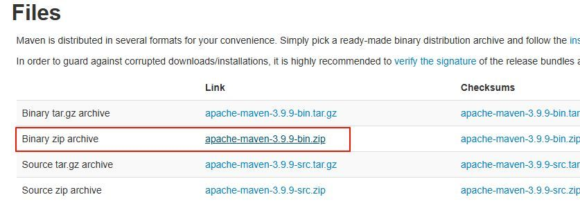
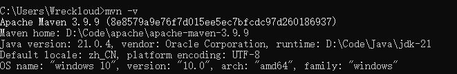
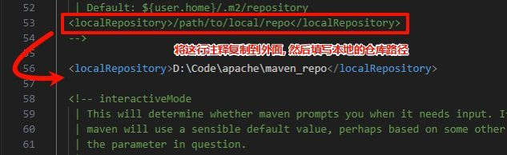
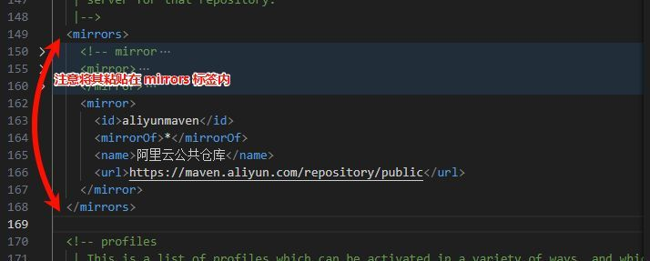
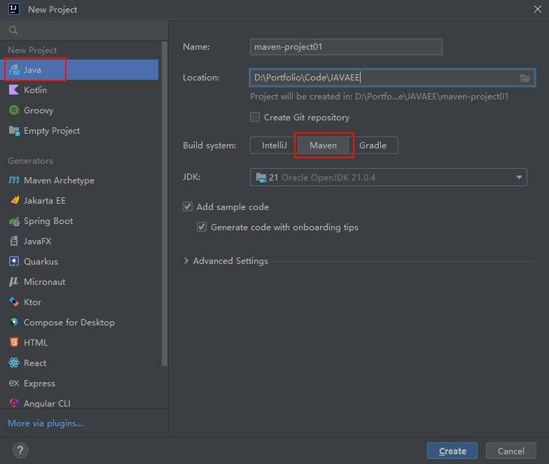
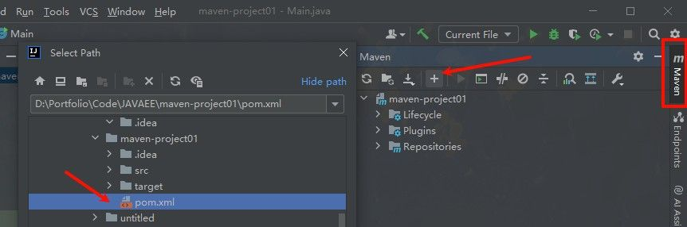
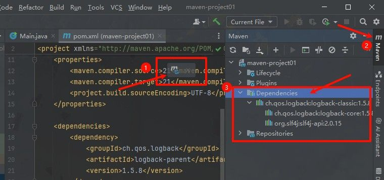
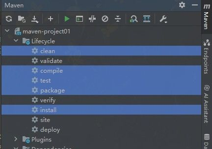

# Maven 简介

Maven 是 Java 项目中常用的构建和依赖管理工具。
它最直接的作用，是把项目中原本需要手动处理的事情规范化，比如下载依赖、编译代码、运行测试、打包项目等。


以前如果项目需要使用第三方库，通常要自己去下载对应的 JAR 包，再手动添加到项目里。
项目一大，依赖之间还可能互相依赖，版本也容易乱。

Maven 解决的就是这类问题：只要在 `pom.xml` 中声明依赖，Maven 就会根据配置自动下载对应的库，并处理它们之间的传递依赖关系。

例如：

```xml
<dependency>
    <groupId>org.springframework</groupId>
    <artifactId>spring-core</artifactId>
    <version>5.3.20</version>
</dependency>
```

这段配置表示项目需要使用 `spring-core`。Maven 会根据这组坐标去仓库中查找对应版本的依赖，并下载到本地仓库中，供项目使用。

除此之外，Maven 做到了 Java 项目的统一管理规范。它主要解决三件事：

**1）统一依赖管理**

项目需要什么库，就在 `pom.xml` 中声明什么依赖。

Maven 会负责下载依赖，并处理依赖之间的关系，避免手动管理 JAR 包带来的混乱。

**2）统一构建流程**

Maven 把项目构建拆成了一套固定流程，例如清理、编译、测试、打包、安装等。
开发者可以通过统一的命令执行这些操作，例如：

```bash
mvn clean install
```

这条命令会清理旧的构建结果，重新编译项目，运行测试，打包项目，并将构建结果安装到本地仓库。

**3）统一项目结构**

Maven 对项目目录有一套默认约定。

常见结构如下：

```text
src/main/java        主代码
src/main/resources   主资源文件
src/test/java        测试代码
src/test/resources   测试资源文件
```

有了这套结构，不同项目之间的组织方式会更加统一。无论是 IDEA、Maven 命令，还是其他构建工具，都能按照约定识别项目中的代码、资源和测试内容。


简单来说，Maven 的核心价值就是：用统一的 `pom.xml` 管理项目依赖，用固定的生命周期管理构建流程，用标准目录结构管理项目代码。

# Maven 环境配置

## 使用 IDEA 自带 Maven（推荐）

现在使用 IDEA 开发 Maven 项目时，一般不需要再手动下载安装 Maven。IDEA 本身已经内置了 Maven，日常学习、普通 Java 项目和 Spring Boot 项目，直接使用 IDEA 自带的 Maven 就够了。

进入 IDEA 设置：

```text
Settings / Preferences
→ Build, Execution, Deployment
→ Build Tools
→ Maven
```

常见配置项包括：

- `Maven home path`：Maven 的位置，可以选择 IDEA 自带的 Bundled Maven，也可以选择自己安装的 Maven
- `User settings file`：Maven 的用户配置文件，通常是 `settings.xml`
- `Local repository`：本地仓库位置，默认一般是 `用户目录/.m2/repository`

如果只是学习和普通开发，`Maven home path` 选择 IDEA 自带的 Bundled Maven 即可，不需要额外下载安装 Maven。


## 手动安装 Maven

手动安装 Maven 不是不能用，而是现在已经不再是必选步骤。只有在需要命令行执行 `mvn`、团队统一 Maven 版本、服务器部署、CI/CD 构建，或者项目明确要求某个 Maven 版本时，才需要单独安装 Maven。

如果希望在命令行中的任意位置使用 `mvn` 命令，就需要手动安装 Maven，并配置环境变量。

访问 [Maven 官方下载页面](https://maven.apache.org/download.cgi)，下载 `Binary zip archive` 压缩包。



下载完成后，将压缩包解压到一个方便管理的目录，例如：

```
D:\Code\apache\apache-maven-3.9.9
```

路径尽量不要包含中文或空格，避免后续某些工具识别路径时出现问题。

### 配置环境变量

如果要在命令行中直接使用 `mvn`，需要把 Maven 的 `bin` 目录加入系统环境变量。

先新建一个系统变量，例如：

```text
MAVEN_HOME = D:\Code\apache\apache-maven-3.9.9
```


然后在 `Path` 中添加：

```text
%MAVEN_HOME%\bin
```


这里变量名要和引用时保持一致。如果变量名叫 `MAVEN_HOME`，那么 Path 中就写 `%MAVEN_HOME%\bin`；如果变量名叫 `MAVEN`，就写 `%MAVEN%\bin`。

配置完成后，打开命令提示符或 PowerShell，输入：

```bash
mvn -v
```

如果能看到 Maven 版本、Java 版本和系统信息，就说明命令行环境配置成功。



## settings.xml 配置文件

`settings.xml` 是 Maven 的配置文件，常用于配置本地仓库、镜像源、代理、私服账号等信息。

它常见有两个位置：

```text
用户级配置：用户目录/.m2/settings.xml
全局配置：Maven安装目录/conf/settings.xml
```

日常开发更推荐使用用户级配置，因为它只影响当前用户，不会直接修改 Maven 安装目录。使用 IDEA 时，也可以在 Maven 设置中手动指定 `settings.xml` 文件的位置。

### 配置本地仓库

Maven 下载的依赖默认会存放在本地仓库中。默认位置一般是：

```text
用户目录/.m2/repository
```

如果希望把依赖统一放到其他磁盘，可以在 `settings.xml` 中配置 `localRepository`：

```xml
<localRepository>D:\Code\apache\maven_repo</localRepository>
```



这一步不是必须的。如果默认仓库位置够用，可以不改。

### 配置镜像源

Maven 默认会从中央仓库下载依赖。如果下载速度比较慢，可以在 `settings.xml` 中配置国内镜像源。

例如配置阿里云 Maven 镜像：

```xml
<mirror>
    <id>aliyunmaven</id>
    <name>Aliyun Maven</name>
    <url>https://maven.aliyun.com/repository/public</url>
    <mirrorOf>central</mirrorOf>
</mirror>
```



镜像源的作用是加快依赖下载速度。如果默认中央仓库访问正常，也可以不配置。

## 配置 Maven 使用的 Java 版本

Maven 项目还需要注意 Java 版本。这里要区分两个概念：

一个是 Maven 运行时使用的 JDK，另一个是项目源码编译时使用的 JDK。

在 IDEA 中，可以在 Maven 设置的 `Runner` 页面配置 Maven 运行时使用的 JRE，也可以在 `Java Compiler` 中配置项目编译版本。


日常开发时，IDEA 项目 SDK、Maven Runner 使用的 JDK、Java Compiler 编译版本最好保持一致。否则可能出现 IDEA 中能运行，但 Maven 打包失败的情况。

如果是 Spring Boot 3 项目，通常使用 Java 17 或更高版本；如果是旧项目，就按项目要求选择 Java 8、Java 11 或其他版本。

## 创建 Maven 项目

在 IDEA 中创建 Maven 项目时，可以直接在新建项目页面选择构建工具为 Maven。

操作路径：

```text
File
→ New
→ Project
```

然后在项目类型中选择 `Java`，并将构建工具选择为 `Maven`。



创建完成后，IDEA 会生成 Maven 项目的基础结构，并自动识别 `pom.xml` 文件。

常见目录结构如下：

```text
src/main/java        主代码
src/main/resources   主资源文件
src/test/java        测试代码
src/test/resources   测试资源文件
pom.xml              Maven 项目配置文件
```


第一次创建或打开 Maven 项目时，IDEA 可能会下载必要的插件和依赖，等待下载完成即可。

## 导入已有 Maven 项目

接手已有 Maven 项目时，关键是找到项目中的 `pom.xml` 文件。只要 IDEA 正确识别了 `pom.xml`，就能把项目作为 Maven 项目导入。

### 方式一：通过 Maven 工具窗口导入

在 IDEA 右侧找到 Maven 工具窗口，点击 `+`，选择目标项目的 `pom.xml` 文件。



如果右侧没有 Maven 工具栏，可以在菜单中打开：

```text
View
→ Appearance
→ Tool Windows Bar
```


### 方式二：通过项目结构导入模块

也可以通过项目结构导入已有 Maven 模块：

```text
File
→ Project Structure
→ Modules
→ +
→ Import Module
```

然后选择目标项目的 `pom.xml` 文件。


一般情况下，直接打开包含 `pom.xml` 的项目目录，IDEA 就会自动识别 Maven 项目。只有在识别失败、模块丢失，或者需要手动添加子模块时，才需要使用上面这些导入方式。

# Maven 核心特性

## 依赖管理

Maven 的核心功能是依赖管理，通过在 `pom.xml` 中声明依赖坐标，Maven 会自动解析和下载所需的库文件。

### 坐标系统

Maven 使用三个主要元素（称为"坐标"）来唯一标识一个库：

- **groupId**：组织或项目的标识（通常是反向域名）
- **artifactId**：库的名称
- **version**：版本号
  - SNAPSHOT：开发中的快照版本
  - RELEASE：正式发布版本

这三个元素共同构成了 Maven 仓库中资源的唯一标识。

### 添加依赖

在 `pom.xml` 文件中的 `<project>` 标签内添加 `<dependencies>` 节点：

```xml
<dependencies>
    <dependency>
        <groupId>ch.qos.logback</groupId>
        <artifactId>logback-classic</artifactId>
        <version>1.5.8</version>
    </dependency>
</dependencies>
```

IDEA 提供智能提示和自动补全功能，输入前几个字符就可以看到候选项。

如果 IDEA 不提供自动补全，可以访问 [Maven 中央仓库](https://mvnrepository.com/) 搜索需要的库，然后复制依赖配置。


添加依赖后，点击工具栏中的"重新加载"按钮更新项目：



## 依赖传递

Maven 的一大优势是能够自动处理传递依赖关系。当你添加一个库时，Maven 会自动引入该库所依赖的其他库。

例如，添加 `logback-classic` 后，Maven 会自动引入它所依赖的 `logback-core` 和 `slf4j-api`：


**查看依赖树**

要查看完整的依赖关系，右键点击 `pom.xml` 文件，选择"Show Dependencies"或"Diagrams" → "Show Diagram"：


依赖可视化帮助你了解项目的依赖结构，识别潜在的版本冲突。

## 生命周期

Maven 定义了标准化的构建过程，称为"生命周期"。每个生命周期包含一系列有序的阶段(phase)。

Maven 有三套独立的生命周期：

1. **clean**：清理项目
2. **default**：构建项目
3. **site**：生成项目文档


**核心构建阶段**

日常开发中最常用的构建阶段：

- **clean**：清除之前构建生成的所有文件
- **compile**：编译主源代码
- **test**：运行测试
- **package**：将编译后的代码打包（如 JAR 或 WAR）
- **install**：将包安装到本地仓库

重要特性：**执行某个阶段时，会自动执行同一生命周期中的所有前置阶段**。

> 例如：执行 `mvn package` 会自动依次执行 compile、test 和 package 阶段，但不会执行其他生命周期中的阶段（如 clean 或 install）。

在 IDEA 中，可以通过 Maven 工具窗口直接执行这些生命周期阶段：



## 高级依赖管理

### 排除依赖

有时，你可能希望排除某个传递依赖，比如：

- 避免版本冲突
- 排除不需要的库
- 手动管理特定依赖

使用 `<exclusions>` 标签排除不需要的依赖：

```xml
<dependency>
    <groupId>ch.qos.logback</groupId>
    <artifactId>logback-classic</artifactId>
    <version>1.5.8</version>

    <exclusions>
        <exclusion>
            <groupId>ch.qos.logback</groupId>
            <artifactId>logback-core</artifactId>
            <!-- 不用添加版本坐标信息 -->
        </exclusion>
    </exclusions>
</dependency>
```

每次修改 `pom.xml` 后，记得点击"重新加载"按钮使更改生效。

### 依赖范围

依赖范围(scope)控制依赖在不同构建阶段的可见性。通过 `<scope>` 标签设置：

```xml
<dependency>
    <groupId>junit</groupId>
    <artifactId>junit</artifactId>
    <version>4.13.2</version>
    <scope>test</scope>
</dependency>
```

主要的依赖范围：

|   范围值 | 主程序 | 测试程序 | 运行时(打包) | 典型用例                             |
| -------: | :----: | :------: | :----------: | ------------------------------------ |
|  compile |   ✓    |    ✓     |      ✓       | 默认值，适用于大多数依赖             |
|     test |   ✗    |    ✓     |      ✗       | 仅测试用库（如 JUnit）               |
| provided |   ✓    |    ✓     |      ✗       | 运行环境提供的 API（如 Servlet API） |
|  runtime |   ✗    |    ✓     |      ✓       | 仅运行时需要（如 JDBC 驱动）         |

选择正确的依赖范围可以使构建更高效，并减小最终产品的体积。例如，将测试库限定在 `test` 范围可以避免将其打包到生产代码中。
