# Maven 简介

Maven 是 [Apache 软件基金会](https://www.apache.org/) 推出的一个强大的 **项目管理和构建自动化工具**，专为 Java 项目设计。

它的名称来源于意第绪语，意为"知识积累者"，正如其名，Maven 帮助开发者管理项目的复杂性和依赖关系。

> [查看 Apache 所有开源项目](https://www.apache.org/index.html#projects-list)

Maven 基于项目对象模型 (Project Object Model, POM) 的概念，通过一个简单的描述文件 (pom.xml)，就能自动完成项目的构建、测试和部署等复杂工作。

Maven 的核心架构由三大块组成：

- 项目对象模型 (Project Object Model)：定义项目的基本信息
- 依赖管理系统 (Dependency Management)：处理项目间的依赖关系
- 构建生命周期/阶段 (Build Lifecycle & Phases)：规范化构建过程

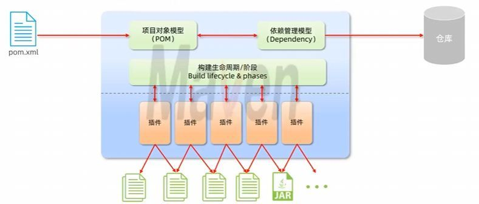

### 依赖管理

没有 Maven 之前，我们需要手动下载每个库的 JAR 文件，然后添加到项目的类路径中——这个过程既繁琐又容易出错。

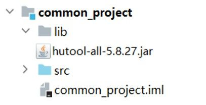

而使用 Maven 时，只需在 `pom.xml` 文件中添加简单的配置：

```xml
<dependency>
    <groupId>org.springframework</groupId>    <!-- 组织ID -->
    <artifactId>spring-core</artifactId>      <!-- 项目ID -->
    <version>5.3.20</version>                 <!-- 版本号 -->
</dependency>
```

Maven 会自动下载这个库以及它所需的所有其他库，解决了"依赖地狱"问题。

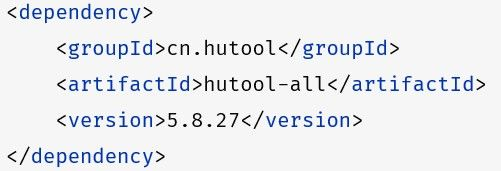

### 标准化构建流程

Maven 提供了标准化的项目构建流程，无论项目规模大小，都可以用相同的命令完成构建。


通过简单的命令如 `mvn clean install`，Maven 就能自动完成编译代码、运行测试、打包和部署等一系列操作，大大提高了开发效率。

### 统一项目结构

过去，不同 IDE 创建的项目结构差异很大，项目迁移十分痛苦。

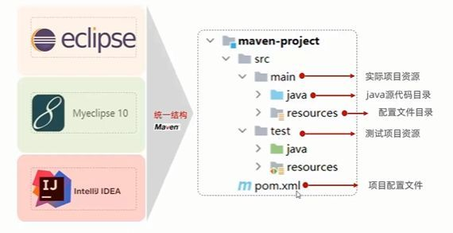

Maven 定义了一套标准的项目目录结构，使得任何人接手项目都能快速理解项目组织方式：

- `src/main/java`：主代码
- `src/main/resources`：主资源文件
- `src/test/java`：测试代码
- `src/test/resources`：测试资源文件

这种标准化不仅便于团队协作，也让工具能更智能地处理项目内容。

# Maven 安装

## 下载并解压 Maven

访问 [Maven 官方下载页面](https://maven.apache.org/download.cgi)，获取最新的 `Binary zip archive` 压缩包。

在官网页面下滑至 Files 区域：


将下载的压缩包解压到一个便于管理的目录。

> 重要提示：为避免兼容性问题，路径中请不要包含中文或空格。

以下以路径 `D:\Code\apache\apache-maven-3.9.9` 为例进行配置。

## 配置 Maven 仓库

Maven 仓库用于存储所有依赖的 JAR 包和插件，是 Maven 工作的核心。

首先，创建一个专门的文件夹作为本地仓库，例如：

> `D:\Code\apache\maven_repo`

### 配置本地仓库

1. 打开 Maven 安装目录下的 `conf/settings.xml` 文件
2. 找到 `<localRepository>` 标签（可以用 Ctrl+F 搜索）
3. 在注释外添加本地仓库路径


配置示例：

```xml
<localRepository>D:\Code\apache\maven_repo</localRepository>
```

### 配置远程镜像仓库

Maven 官方的中央仓库在国外，访问速度较慢，可以配置国内镜像提升下载速度。

在 `conf/settings.xml` 文件中的 `<mirrors>` 标签下添加阿里云镜像：

```xml
<mirror>
    <id>alimaven</id>
    <name>aliyun maven</name>
    <url>http://maven.aliyun.com/nexus/content/groups/public/</url>
    <mirrorOf>central</mirrorOf>
</mirror>
```


更多镜像信息可参考 [阿里云 Maven 镜像站使用指南](https://developer.aliyun.com/mvn/guide)。

## 配置环境变量

为了在命令行中的任何位置使用 Maven 命令，需要将 Maven 加入环境变量。

> 注意：修改系统环境变量前请谨慎操作，错误配置可能影响系统稳定性。

**配置步骤：**

1. 打开系统设置，进入"关于"→"系统高级设置"→"环境变量"

   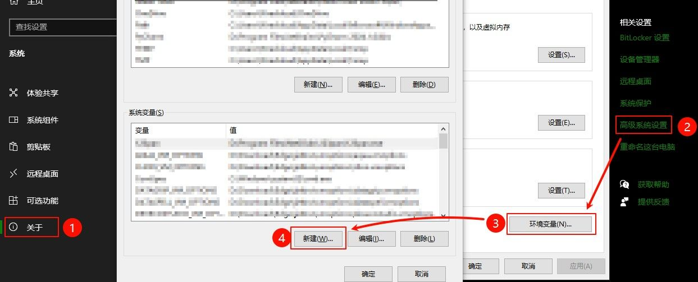

2. 在"系统变量"区域，点击"新建"，创建名为 `Maven_Home` 的变量，值为 Maven 的安装目录

   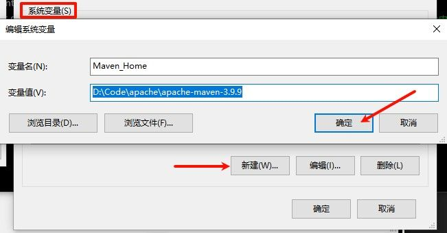

3. 找到 `Path` 变量，点击"编辑"，添加新条目 `%Maven_Home%\bin`

   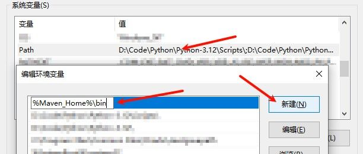

4. 依次点击"确定"保存所有设置

> 提示：变量名和使用的占位符必须一致。例如，如果变量名设置为 `MAVEN`，引用时应写作 `%MAVEN%\bin`。

## 验证安装

打开命令提示符或 PowerShell，输入：

```bash
mvn -v
```

如果看到类似下图的 Maven 版本信息，说明安装成功：


# 在 IDEA 集成 Maven

IntelliJ IDEA 提供了对 Maven 的强大支持，可以直接在 IDE 中使用 Maven 的所有功能。

## 配置 Maven 环境

建议配置全局 Maven 设置，这样所有项目都能使用相同的 Maven 配置。

### 关联外部 Maven

1. 在 IDEA 启动页面，选择"Customize"选项卡，点击"All settings..."

   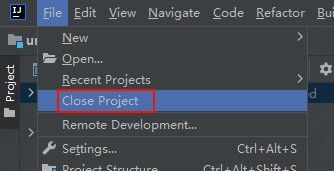

2. 导航至"Build, Execution, Deployment" → "Build Tools" → "Maven"

3. 配置以下项目：

   - Maven home path：选择 Maven 安装目录
   - User settings file：选择 settings.xml 文件
   - Local repository：确认本地仓库位置

   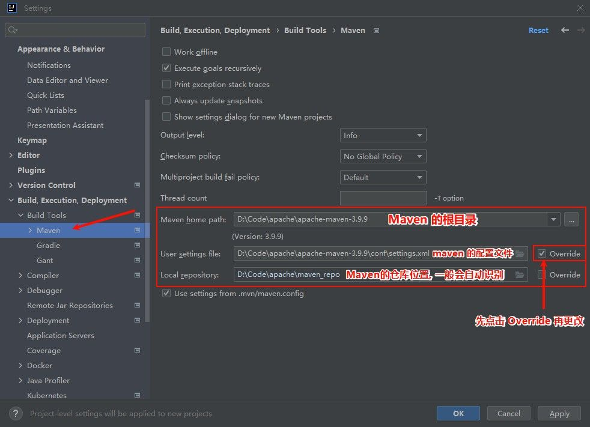

4. 点击"Apply"应用设置

### 配置 Java 版本

Maven 项目需要匹配适当的 Java 版本：

1. 在同一设置窗口，切换到"Runner"选项卡设置运行时 JRE 版本
2. 导航至"Build Tools" → "Maven" → "Java Compiler"设置编译器版本

> 推荐：Maven 3.9.x 版本建议使用 Java 17 或更高版本

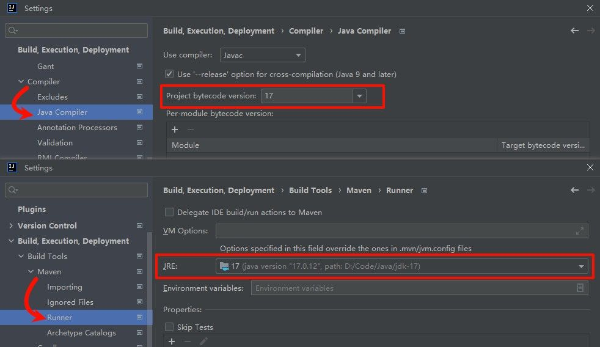

别忘记点击"Apply"保存设置！

## 创建 Maven 项目

Maven 项目遵循标准的目录结构，IDEA 提供了简单的向导来创建新的 Maven 项目。

1. 选择"New Project"或"File" → "New" → "Project..."
2. 在项目类型中选择"Java"，然后在构建工具(Build tool)中选择"Maven"

   

3. 填写项目信息后点击"Create"

首次创建时，Maven 会下载必要的依赖和插件，可能需要等待片刻。创建完成后，你会看到标准的 Maven 项目结构：

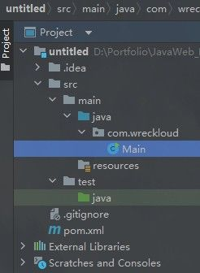

## 导入已有项目

接手已有的 Maven 项目时，IDEA 提供了多种方式导入。关键是定位到项目的 `pom.xml` 文件。

### 方式一

1. 在 IDEA 右侧边栏找到 Maven 图标

   

2. 点击"+"按钮，找到目标 Maven 项目的 `pom.xml` 文件，双击导入

> 如果没有显示，可在"View" → "Appearance" → "Tool Windows Bar"中打开
> 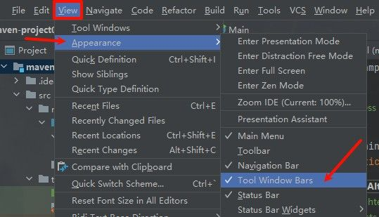

### 方式二

1. 选择"File" → "Project Structure"打开项目结构对话框
2. 在左侧面板选择"Modules"，点击"+"添加模块
3. 选择"Import Module"，找到目标 `pom.xml` 文件

   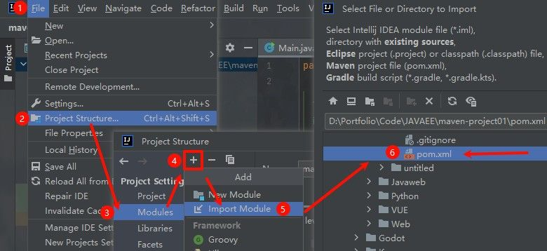

# Maven 核心特性

## 依赖管理

Maven 的核心功能是依赖管理，通过在 `pom.xml` 中声明依赖坐标，Maven 会自动解析和下载所需的库文件。

### 坐标系统

Maven 使用三个主要元素（称为"坐标"）来唯一标识一个库：

- **groupId**：组织或项目的标识（通常是反向域名）
- **artifactId**：库的名称
- **version**：版本号
  - SNAPSHOT：开发中的快照版本
  - RELEASE：正式发布版本

这三个元素共同构成了 Maven 仓库中资源的唯一标识。

### 添加依赖

在 `pom.xml` 文件中的 `<project>` 标签内添加 `<dependencies>` 节点：

```xml
<dependencies>
    <dependency>
        <groupId>ch.qos.logback</groupId>
        <artifactId>logback-classic</artifactId>
        <version>1.5.8</version>
    </dependency>
</dependencies>
```

IDEA 提供智能提示和自动补全功能，输入前几个字符就可以看到候选项。

如果 IDEA 不提供自动补全，可以访问 [Maven 中央仓库](https://mvnrepository.com/) 搜索需要的库，然后复制依赖配置。

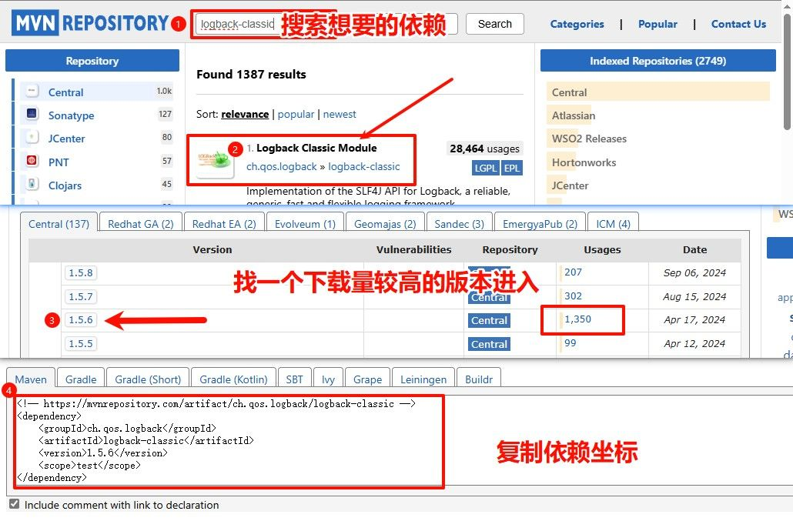

添加依赖后，点击工具栏中的"重新加载"按钮更新项目：


## 依赖传递

Maven 的一大优势是能够自动处理传递依赖关系。当你添加一个库时，Maven 会自动引入该库所依赖的其他库。

例如，添加 `logback-classic` 后，Maven 会自动引入它所依赖的 `logback-core` 和 `slf4j-api`：

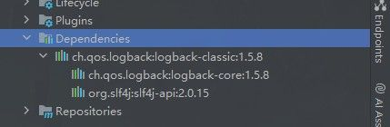

**查看依赖树**

要查看完整的依赖关系，右键点击 `pom.xml` 文件，选择"Show Dependencies"或"Diagrams" → "Show Diagram"：

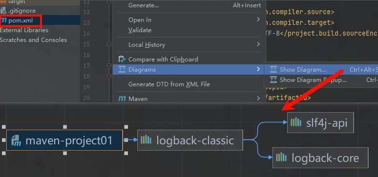

依赖可视化帮助你了解项目的依赖结构，识别潜在的版本冲突。

## 生命周期

Maven 定义了标准化的构建过程，称为"生命周期"。每个生命周期包含一系列有序的阶段(phase)。

Maven 有三套独立的生命周期：

1. **clean**：清理项目
2. **default**：构建项目
3. **site**：生成项目文档

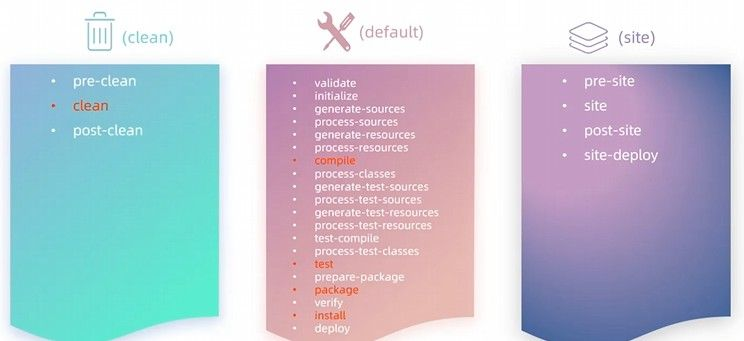

**核心构建阶段**

日常开发中最常用的构建阶段：

- **clean**：清除之前构建生成的所有文件
- **compile**：编译主源代码
- **test**：运行测试
- **package**：将编译后的代码打包（如 JAR 或 WAR）
- **install**：将包安装到本地仓库

重要特性：**执行某个阶段时，会自动执行同一生命周期中的所有前置阶段**。

> 例如：执行 `mvn package` 会自动依次执行 compile、test 和 package 阶段，但不会执行其他生命周期中的阶段（如 clean 或 install）。

在 IDEA 中，可以通过 Maven 工具窗口直接执行这些生命周期阶段：


## 高级依赖管理

### 排除依赖

有时，你可能希望排除某个传递依赖，比如：

- 避免版本冲突
- 排除不需要的库
- 手动管理特定依赖

使用 `<exclusions>` 标签排除不需要的依赖：

```xml
<dependency>
    <groupId>ch.qos.logback</groupId>
    <artifactId>logback-classic</artifactId>
    <version>1.5.8</version>

    <exclusions>
        <exclusion>
            <groupId>ch.qos.logback</groupId>
            <artifactId>logback-core</artifactId>
            <!-- 不用添加版本坐标信息 -->
        </exclusion>
    </exclusions>
</dependency>
```

每次修改 `pom.xml` 后，记得点击"重新加载"按钮使更改生效。

### 依赖范围

依赖范围(scope)控制依赖在不同构建阶段的可见性。通过 `<scope>` 标签设置：

```xml
<dependency>
    <groupId>junit</groupId>
    <artifactId>junit</artifactId>
    <version>4.13.2</version>
    <scope>test</scope>
</dependency>
```

主要的依赖范围：

|   范围值 | 主程序 | 测试程序 | 运行时(打包) | 典型用例                             |
| -------: | :----: | :------: | :----------: | ------------------------------------ |
|  compile |   ✓    |    ✓     |      ✓       | 默认值，适用于大多数依赖             |
|     test |   ✗    |    ✓     |      ✗       | 仅测试用库（如 JUnit）               |
| provided |   ✓    |    ✓     |      ✗       | 运行环境提供的 API（如 Servlet API） |
|  runtime |   ✗    |    ✓     |      ✓       | 仅运行时需要（如 JDBC 驱动）         |

选择正确的依赖范围可以使构建更高效，并减小最终产品的体积。例如，将测试库限定在 `test` 范围可以避免将其打包到生产代码中。
