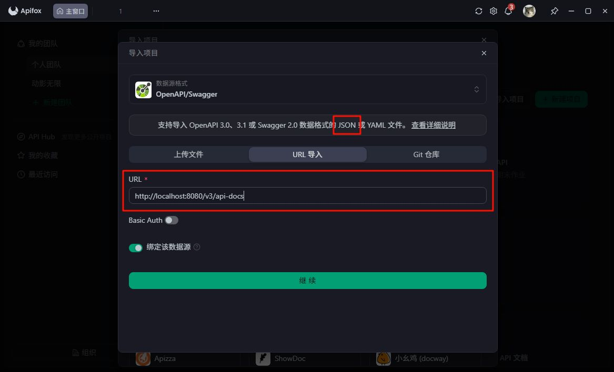
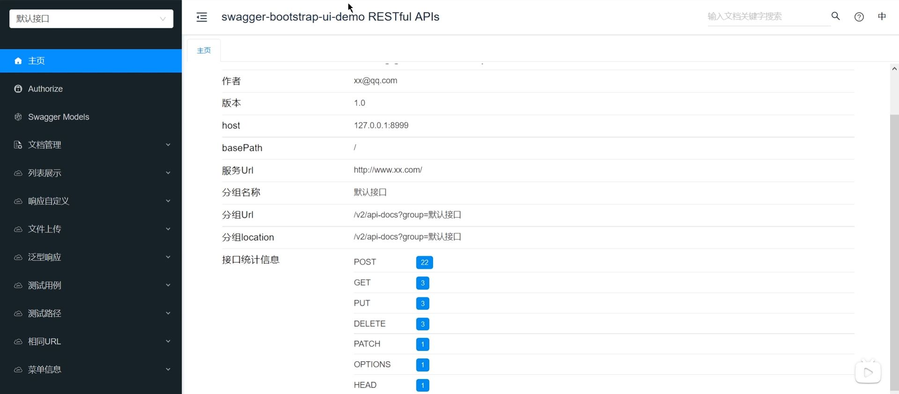

在实际开发过程中，后端接口通常会提供给前端、测试人员，或者其他系统调用。Swagger 的作用，就是让接口信息尽量回到代码本身。
它可以根据 Controller、请求路径、参数、返回类型以及补充注解，自动生成接口文档，并提供在线调试页面。

总之，Swagger 主要解决两个问题：

1. 自动生成接口文档，减少手写文档的成本；
2. 提供在线调试页面，方便开发和测试直接调用接口。

在 Spring Boot 项目中，通常还会搭配 Knife4j 来增强美化界面。Knife4j 能在原有接口文档基础上提供更友好的展示效果和更方便的调试体验。

Swagger 官网：[swagger 官网](https://swagger.io/)

# 使用方式

如果项目使用的是 Spring Boot 3 + Knife4j 4.x，一般接入的是 OpenAPI 3 文档体系。
这一套底层通常由 springdoc-openapi 生成接口文档，Knife4j 主要负责提供更好用的文档页面。

首先，在 `pom.xml` 中引入 Knife4j 依赖：

```xml
<dependency>
    <groupId>com.github.xiaoymin</groupId>
    <artifactId>knife4j-openapi3-jakarta-spring-boot-starter</artifactId>
    <version>4.4.0</version>
</dependency>
```

引入这个依赖后，Maven 会自动下载它所需要的 Swagger 相关组件。一般情况下，不需要再额外单独导入 `swagger2` 依赖。

这里要注意，`knife4j-openapi3-jakarta-spring-boot-starter` 是新版写法，适合 Spring Boot 3。
它和以前的 `knife4j-spring-boot-starter`、`Docket`、`DocumentationType.SWAGGER_2` 不是一套东西，不要混着记。

## 基础配置

在 OpenAPI 3 写法中，接口文档路径、扫描包、分组信息通常配置在 `application.yml` 中。

```yaml
springdoc:
  api-docs:
    path: /v3/api-docs
  swagger-ui:
    path: /swagger-ui.html
    tags-sorter: alpha
    operations-sorter: alpha
  group-configs:
    - group: default
      paths-to-match: /**
      packages-to-scan: com.wreckloud.wolfpack.controller

knife4j:
  enable: true
  setting:
    language: zh_cn
```

这几个配置分别负责不同的事情。

`springdoc.api-docs.path` 用来指定 OpenAPI 原始 JSON 文档地址。
比如这里配置后，接口原始文档地址就是：

```text
http://localhost:8080/v3/api-docs
```

`springdoc.swagger-ui.path` 用来指定 Swagger UI 页面地址。

`springdoc.group-configs` 用来配置接口分组、扫描路径和扫描包。
其中 `packages-to-scan` 最关键，它决定扫描哪个包下面的 Controller。

```yaml
packages-to-scan: com.wreckloud.wolfpack.controller
```

一般只扫描业务接口所在的 Controller 包，不建议直接扫描整个项目。
否则一些内部组件、测试接口或无关接口也可能被加入文档。

`paths-to-match` 用来指定匹配哪些接口路径：

```yaml
paths-to-match: /**
```

这里表示匹配扫描包下的所有接口路径。

`knife4j.enable` 表示开启 Knife4j 增强功能。
`knife4j.setting.language` 用来设置 Knife4j 页面语言，比如 `zh_cn` 表示中文界面。

## 文档基本信息配置

旧版 Swagger2 里，常用 `Docket` 配置文档标题、描述、版本和扫描包。
不过在 **Spring Boot 3 + Knife4j 4.x + OpenAPI 3** 中，是通过核心的 `OpenAPI` Bean 配置文档基本信息。

可以在 `com.wreckloud.config` 包下新建 `SwaggerConfig` 类：

```java
package com.wreckloud.config;

import io.swagger.v3.oas.models.OpenAPI;
import io.swagger.v3.oas.models.info.Info;
import org.springframework.context.annotation.Bean;
import org.springframework.context.annotation.Configuration;

@Configuration
public class SwaggerConfig {

    @Bean
    public OpenAPI wolfPackOpenApi() {
        return new OpenAPI()
                .info(new Info()
                        .title("狼群任务系统接口文档")
                        .description("提供狼群内部任务系统的 API 说明与调试页面")
                        .version("1.0.0"));
    }
}
```

这段配置主要负责设置接口文档首页展示的基本信息。

`title` 表示文档标题。
`description` 表示文档描述。
`version` 表示接口文档版本。

`@Configuration` 表示这是一个 Spring 配置类，项目启动时会被 Spring 扫描并加载。
`@Bean` 表示把 `wolfPackOpenApi()` 方法返回的 `OpenAPI` 对象交给 Spring 容器管理。

## 访问接口文档

启动 Spring Boot 项目后，可以访问 Knife4j 页面：

```text
http://localhost:8080/doc.html
```

也可以查看 OpenAPI 原始 JSON 文档：

```text
http://localhost:8080/v3/api-docs
```

不过这个 JSON 不是给日常阅读用的，而是给类似于 Apifox 这种工具识别的。



Knife4j 页面本质上就是基于这些 OpenAPI 数据做了更友好的展示和调试界面。

进入 Knife4j 页面后，通常可以看到接口分组、接口路径、请求方式、请求参数、响应结果等信息。



如果 Controller、DTO、VO 上补充了合适的 OpenAPI 注解，文档展示会更加清楚。

# 【拓展】新旧写法编写配置类

不过在一些老项目里，还可能看到 Swagger2 / Springfox 时代的配置方式，所以这里简单补充一下旧写法，能看懂即可。

旧版 Swagger2 / Springfox 常见配置类里会出现这些对象：

```java
Docket
ApiInfoBuilder
DocumentationType.SWAGGER_2
RequestHandlerSelectors
PathSelectors
```

这套写法多见于 Spring Boot 2 项目。
它通常需要手动声明一个 `Docket` Bean，用来配置接口文档的标题、描述、版本、扫描包和路径规则。

例如：

```java
@Configuration
public class SwaggerConfig {

    @Bean
    public Docket docket() {
        ApiInfo apiInfo = new ApiInfoBuilder()
                .title("狼群任务系统接口文档")
                .description("提供狼群内部任务系统的 API 说明与调试页面")
                .version("1.0")
                .build();

        return new Docket(DocumentationType.SWAGGER_2)
                .apiInfo(apiInfo)
                .select()
                .apis(RequestHandlerSelectors.basePackage("com.wreckloud.wolfpack.controller"))
                .paths(PathSelectors.any())
                .build();
    }
}
```

这段配置的核心是 `Docket`。
它可以理解为旧版 Swagger 的文档配置对象，负责把“文档基本信息”和“接口扫描规则”组织起来。

其中：

```java
apiInfo(apiInfo)
```

用来设置文档标题、描述、版本等信息。

```java
select()
```

表示开始配置接口扫描规则。

```java
apis(RequestHandlerSelectors.basePackage("com.wreckloud.wolfpack.controller"))
```

用来指定要扫描的 Controller 包。一般只扫描业务接口所在的包，不建议直接扫描整个项目，否则一些内部接口也可能被放进文档里。

```java
paths(PathSelectors.any())
```

表示匹配扫描范围内的所有接口路径。

`@Configuration` 表示这是一个 Spring 配置类，`@Bean` 表示把 `docket()` 方法返回的 `Docket` 对象交给 Spring 容器管理。

不过需要注意：如果当前项目使用的是下面这个依赖：

```xml
<dependency>
    <groupId>com.github.xiaoymin</groupId>
    <artifactId>knife4j-openapi3-jakarta-spring-boot-starter</artifactId>
    <version>4.4.0</version>
</dependency>
```

那说明项目走的是 **OpenAPI 3** 体系，而不是旧的 Swagger2 / Springfox 体系。这时候就不应该再使用 `Docket`、`ApiInfoBuilder`、`DocumentationType.SWAGGER_2` 这套配置。

新写法的分工更清楚：

```text
文档路径、扫描包、分组信息：写在 application.yml
文档标题、描述、版本：用 OpenAPI Bean 配置
接口、参数、模型说明：用 OpenAPI 3 注解补充
```

旧写法则更倾向于把标题、扫描包、路径规则都写进 Java 配置类里。能用，但配置会更集中，也更偏老版本项目的习惯。

# 常用注解

接口文档接入完成后，默认生成出来的信息比较基础。Swagger 能识别接口路径、请求方式、参数类型，但它并不知道这个接口真正的业务含义。

如果项目使用的是 **Knife4j + SpringDoc + OpenAPI 3**，重点使用这一套注解：

```java
io.swagger.v3.oas.annotations.*
```

常用注解主要记住这几个就够了：

```java
@Tag        // Controller 分组
@Operation  // 接口功能说明
@Parameter  // 单个请求参数说明
@Schema     // DTO / VO / 字段说明
```

它们已经能覆盖大部分接口文档场景。
其他注解比如 `@ApiResponse`、`@Hidden`、`@SecurityRequirement`、Knife4j 的排序注解，可以了解一下，遇到特殊场景再用。

### @Tag

`@Tag` 标注在 Controller 类上，用来说明这个接口模块是做什么的。它主要决定 Knife4j 左侧接口列表里的分组名称。

```java
@Tag(name = "狼群任务管理", description = "提供狼群任务的发布、查询、修改与删除功能")
@RestController
@RequestMapping("/mission")
public class MissionController {
}
```

`name` 是模块名称，通常会直接显示在 Knife4j 左侧列表中。
`description` 是模块说明，用来补充这个 Controller 负责的业务范围。

比如这里的 `狼群任务管理` 就是一个接口分组。
这个分组下面可以放发布任务、查询任务列表、查看任务详情、修改任务、删除任务等接口。

对应老 Swagger2 注解 `@Api` 。旧写法是：

```java
@Api(tags = "狼群任务管理接口")
@RestController
@RequestMapping("/mission")
public class MissionController {
}
```

现在 OpenAPI 3 更推荐使用 `@Tag`。

一般来说，每个 Controller 都建议写 `@Tag`。
否则接口多起来以后，Knife4j 左侧列表会比较混乱，不容易区分每个模块是干什么的。

### @Operation

`@Operation` 标注在 Controller 的方法上，用来说明具体接口的功能。

```java
@Operation(summary = "发布新任务")
@PostMapping
public Result publish(@RequestBody MissionDTO missionDTO) {
    ...
}
```

`summary` 是接口的简短说明，最常用。
它应该用一句话说清楚这个接口做什么。

如果接口规则稍微复杂一点，可以再加 `description`：

```java
@Operation(
        summary = "查询任务列表",
        description = "分页查询狼群任务，可根据任务标题、任务状态进行筛选"
)
@GetMapping("/list")
public TableDataInfo list(MissionQueryDTO queryDTO) {
    ...
}
```

`summary` 偏标题，适合短。
`description` 偏补充说明，适合写筛选条件、业务规则、注意事项。

对应老 Swagger2 注解：

```java
@ApiOperation
```

旧写法类似：

```java
@ApiOperation("发布新任务")
@PostMapping
public Result publish(@RequestBody MissionDTO missionDTO) {
    ...
}
```

`@Operation` 是接口文档里最常用、也最该认真写的注解。
一个接口有没有用、给谁用、做什么，基本都靠它第一眼说明白。

### @Parameter

`@Parameter` 用来说明单个请求参数。
它更适合描述 `@PathVariable`、`@RequestParam`、请求头参数这类直接写在方法参数上的内容。

比如根据任务 ID 查询详情：

```java
@Operation(summary = "获取任务详情")
@GetMapping("/{id}")
public Result getInfo(
        @Parameter(description = "任务ID", required = true, example = "1024")
        @PathVariable Long id
) {
    ...
}
```

这里的 `description` 用来说明参数含义。
`required` 表示是否必填。
`example` 用来提供示例值。

如果是普通查询参数，也可以这样写：

```java
@Operation(summary = "根据状态查询任务")
@GetMapping("/status")
public Result listByStatus(
        @Parameter(description = "任务状态：PENDING 待处理，DONE 已完成", example = "PENDING")
        @RequestParam String status
) {
    ...
}
```

如果一个接口有多个简单参数，也可以使用 `@Parameters` 统一写在方法上：

```java
@Operation(summary = "查询任务列表")
@Parameters({
        @Parameter(name = "title", description = "任务标题"),
        @Parameter(name = "status", description = "任务状态：PENDING 待处理，DONE 已完成")
})
@GetMapping("/list")
public TableDataInfo list(String title, String status) {
    ...
}
```

不过实际开发里，如果查询条件比较多，更推荐封装成 DTO，然后在 DTO 字段上使用 `@Schema`。

对应老 Swagger2 注解：

```java
@ApiParam
```

简单记：

```java
@PathVariable / @RequestParam 这类单个参数，用 @Parameter；
DTO / VO / 实体类里的字段说明，用 @Schema。
```

不要什么参数都硬塞 `@Parameter`，那样会乱。
对象字段交给对象自己描述，接口参数交给接口方法描述。

### @Schema

`@Schema` 用来说明实体类、DTO、VO 以及它们的字段。
Knife4j 里的“模型”展示是否清楚，主要就靠它。

比如任务发布请求对象：

```java
@Schema(description = "任务发布请求数据模型")
public class MissionDTO {

    @Schema(description = "任务标题", example = "巡逻北部森林", requiredMode = Schema.RequiredMode.REQUIRED)
    private String title;

    @Schema(description = "任务内容", example = "今晚八点前完成北部森林边界巡逻")
    private String content;

    @Schema(description = "任务优先级：LOW 低，NORMAL 普通，HIGH 高", example = "HIGH")
    private String priority;
}
```

类上的 `@Schema` 用来说明这个对象整体是什么。
字段上的 `@Schema` 用来说明每个字段的含义、示例值、是否必填、可选范围等。

常用属性主要有这些：

```java
description      // 字段说明
example          // 示例值
allowableValues  // 可选值 / 枚举值
hidden           // 是否隐藏
requiredMode     // 是否必填
```

比如任务状态这种字段，就适合写清楚可选值：

```java
@Schema(
        description = "任务状态",
        example = "PENDING",
        allowableValues = {"PENDING", "DOING", "DONE", "CANCELLED"}
)
private String status;
```

如果字段必填，可以这样写：

```java
@Schema(description = "任务标题", requiredMode = Schema.RequiredMode.REQUIRED)
private String title;
```

如果某个字段是系统内部使用，不希望展示在接口文档里，可以隐藏：

```java
@Schema(hidden = true)
private String internalRemark;
```

返回对象也可以用 `@Schema` 描述：

```java
@Schema(description = "狼群任务数据返回模型")
public class MissionVO {

    @Schema(description = "任务ID", example = "1024")
    private Long id;

    @Schema(description = "任务标题", example = "巡逻北部森林")
    private String title;

    @Schema(description = "发布者名称", example = "AlphaWolf")
    private String sender;

    @Schema(description = "任务状态", example = "PENDING")
    private String status;
}
```

对应老 Swagger2 注解：

```java
@ApiModel
@ApiModelProperty
```

旧写法类似：

```java
@ApiModel("狼任务数据返回模型")
public class MissionVO {

    @ApiModelProperty(value = "任务ID", example = "1024")
    private Long id;

    @ApiModelProperty(value = "发布者名称", example = "AlphaWolf")
    private String sender;

    @ApiModelProperty(value = "任务当前状态", example = "PENDING")
    private String status;
}
```

现在使用 OpenAPI 3 时，统一用 `@Schema` 就够了。
字段说明很重要，因为字段名往往只能说明“它叫什么”，但说明不了“它怎么用”。尤其是 `status`、`type`、`flag` 这种字段，不写清楚就是给后面的人埋坑。

### @ApiResponse / @ApiResponses

`@ApiResponse` 用来说明接口的响应结果。
它不是每个接口都必须写，但在登录、上传、权限校验、复杂返回结构这类接口上比较有用。

比如查询任务详情时，可以说明几种常见返回情况：

```java
@ApiResponses({
        @ApiResponse(responseCode = "200", description = "查询成功"),
        @ApiResponse(responseCode = "401", description = "未登录或 token 失效"),
        @ApiResponse(responseCode = "404", description = "任务不存在")
})
@Operation(summary = "获取任务详情")
@GetMapping("/{id}")
public Result getInfo(@PathVariable Long id) {
    ...
}
```

如果只说明一种响应，也可以单独写：

```java
@ApiResponse(responseCode = "200", description = "发布成功")
@Operation(summary = "发布新任务")
@PostMapping
public Result publish(@RequestBody MissionDTO missionDTO) {
    ...
}
```

如果需要指定返回模型，可以配合 `@Content` 和 `@Schema`：

```java
@ApiResponse(
        responseCode = "200",
        description = "查询成功",
        content = @Content(schema = @Schema(implementation = MissionVO.class))
)
@Operation(summary = "获取任务详情")
@GetMapping("/{id}")
public Result getInfo(@PathVariable Long id) {
    ...
}
```

不过在很多后台管理系统里，返回结构通常统一包了一层，比如：

```java
Result
AjaxResult
TableDataInfo
```

这种情况下，不一定要给每个普通增删改查接口都写完整响应说明。
否则注解会越来越厚，代码反而不好读。

比较推荐的做法是：普通接口重点写 `@Operation` 和 `@Schema`；特殊接口再补 `@ApiResponse`。

### @RequestBody 文档注解

这里容易混，注意有两个 `RequestBody`。

Spring 的 `RequestBody`：

```java
org.springframework.web.bind.annotation.RequestBody
```

它负责真正接收前端传来的 JSON 请求体。

OpenAPI 的 `RequestBody`：

```java
io.swagger.v3.oas.annotations.parameters.RequestBody
```

它只负责描述文档里的请求体说明。

普通开发里，通常只写 Spring 的 `@RequestBody` 就够了：

```java
@Operation(summary = "发布新任务")
@PostMapping
public Result publish(@RequestBody MissionDTO missionDTO) {
    ...
}
```

只要 `MissionDTO` 里的字段用 `@Schema` 写清楚，Knife4j 一般就能展示出请求体结构。

如果想让请求体说明更完整，可以额外加 OpenAPI 的 RequestBody。为了避免和 Spring 的 `@RequestBody` 冲突，通常直接写全限定名：

```java
@Operation(summary = "发布新任务")
@io.swagger.v3.oas.annotations.parameters.RequestBody(
        description = "任务发布请求参数",
        required = true
)
@PostMapping
public Result publish(@RequestBody MissionDTO missionDTO) {
    ...
}
```

简单记：

```java
Spring 的 @RequestBody：负责接收请求数据；
OpenAPI 的 @RequestBody：负责生成文档说明。
```

这个注解了解即可。
多数普通接口不需要专门写 OpenAPI 的 `@RequestBody`，把 DTO 字段上的 `@Schema` 写好更重要。

### @Hidden

`@Hidden` 用来隐藏不想展示在 Knife4j 文档里的接口、类或方法。

比如内部测试接口：

```java
@Hidden
@GetMapping("/internal/check")
public Result internalCheck() {
    ...
}
```

如果只是隐藏模型里的某个字段，更常用的是：

```java
@Schema(hidden = true)
private String internalRemark;
```

`@Hidden` 适合隐藏整个接口或 Controller。
`@Schema(hidden = true)` 适合隐藏对象中的某个字段。

这个注解不算核心，但很实用。
内部接口、临时接口、系统调试接口，不想暴露在文档里时，就可以用它藏起来。

### @SecurityRequirement

`@SecurityRequirement` 用来标记接口需要认证信息，比如 token、Authorization 请求头。

```java
@SecurityRequirement(name = "apikey")
@Operation(summary = "发布新任务")
@PostMapping
public Result publish(@RequestBody MissionDTO missionDTO) {
    ...
}
```

这里的 `name = "apikey"` 要和 Swagger / OpenAPI 配置中定义的安全方案名称对应。

如果项目里已经在 SwaggerConfig 中全局配置了 Authorization 请求头，一般不需要每个接口都写 `@SecurityRequirement`。

它适合这类场景：
有些接口是公开访问的，比如登录、注册；有些接口必须登录后才能访问，比如发布任务、修改任务、删除任务。
如果需要在接口文档里明确区分认证要求，就可以使用它。

平时学习阶段了解即可，不用一开始就急着给每个接口都加。

### Knife4j 增强注解

Knife4j 还提供了一些自己的增强注解。
它们不属于 OpenAPI 标准注解，主要用于优化文档展示效果。

比较常见的是：

```java
import com.github.xiaoymin.knife4j.annotations.ApiSupport;
import com.github.xiaoymin.knife4j.annotations.ApiOperationSupport;
```

`@ApiSupport` 一般写在 Controller 上，用来控制模块排序、作者等信息：

```java
@ApiSupport(order = 1, author = "wreck")
@Tag(name = "狼群任务管理")
@RestController
@RequestMapping("/mission")
public class MissionController {
}
```

`@ApiOperationSupport` 一般写在方法上，用来控制接口排序：

```java
@ApiOperationSupport(order = 1)
@Operation(summary = "查询任务列表")
@GetMapping("/list")
public TableDataInfo list(MissionQueryDTO queryDTO) {
    ...
}
```

如果一个 Controller 里有多个接口，可以通过 `order` 让它们按更舒服的顺序展示：

```java
查询任务列表
获取任务详情
发布新任务
修改任务
删除任务
```

这类注解属于锦上添花。
项目接口少的时候，不写也没问题；接口多了以后，排序会让文档看起来更规整。

### 新旧注解对应关系

现在更推荐使用 OpenAPI 3 的注解，但老项目里经常还能看到 Swagger2 的写法，对应关系是：

```java
Swagger2             OpenAPI 3
@Api                 @Tag
@ApiOperation        @Operation
@ApiParam            @Parameter
@ApiModel            @Schema
@ApiModelProperty    @Schema
```

日常写接口文档，不需要把所有注解都堆上去。
最重要的是让别人看懂接口，而不是让代码上长满注解。

优先写好这四个：

```java
@Tag        // Controller 分组
@Operation  // 接口功能说明
@Parameter  // 单个请求参数说明
@Schema     // DTO / VO / 字段说明
```

普通任务管理接口，大概写成这样就已经比较清楚了：

```java
@Tag(name = "狼群任务管理", description = "提供狼群任务的发布、查询、修改与删除功能")
@RestController
@RequestMapping("/mission")
public class MissionController {

    @Operation(summary = "发布新任务")
    @PostMapping
    public Result publish(@RequestBody MissionDTO missionDTO) {
        ...
    }

    @Operation(summary = "获取任务详情")
    @GetMapping("/{id}")
    public Result getInfo(
            @Parameter(description = "任务ID", required = true, example = "1024")
            @PathVariable Long id
    ) {
        ...
    }
}
```

配合 DTO：

```java
@Schema(description = "任务发布请求数据模型")
public class MissionDTO {

    @Schema(description = "任务标题", example = "巡逻北部森林", requiredMode = Schema.RequiredMode.REQUIRED)
    private String title;

    @Schema(description = "任务内容", example = "今晚八点前完成北部森林边界巡逻")
    private String content;

    @Schema(description = "任务优先级：LOW 低，NORMAL 普通，HIGH 高", example = "HIGH")
    private String priority;
}
```

这已经能让 Knife4j 页面展示出比较完整的模块、接口、参数和模型说明。

至于下面这些，按需使用就行：

```java
@ApiResponse / @ApiResponses     // 特殊响应说明
@Hidden                          // 隐藏内部接口
@SecurityRequirement             // 标记接口认证要求
@ApiSupport / @ApiOperationSupport // Knife4j 展示排序
```
