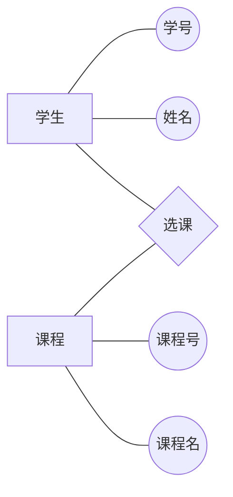
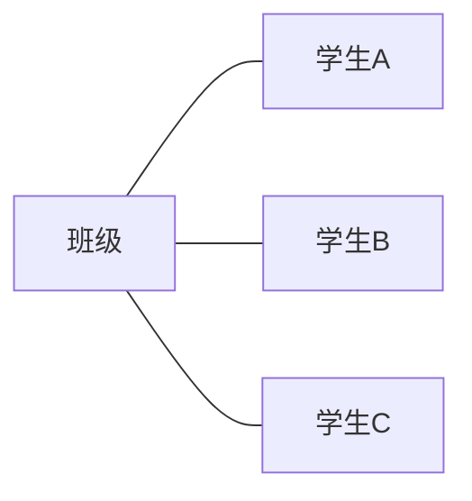
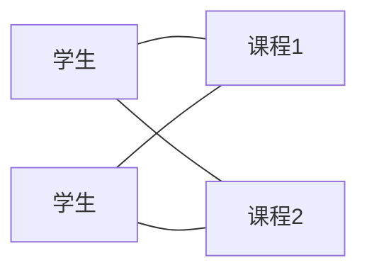
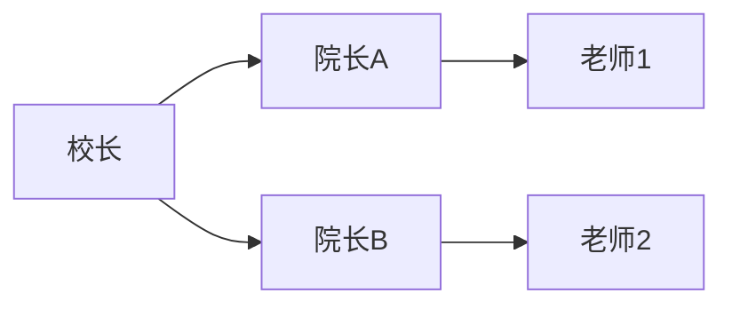
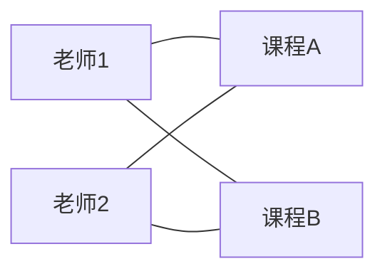

## 数据库基础概念

| 名词   | 含义                                         |
| ------ | -------------------------------------------- |
| DB     | 数据库（DataBase）                           |
| DBMS   | 数据库管理系统(ManageSystem)                 |
| DBS    | 数据库系统(System)                           |
| SQL    | 结构化查询语言                               |
| 数据   | 描述事物的符号记录                           |
| 数据库 | 长期存储在计算机中、有组织、可共享的数据集合 |

## 数据模型与 E-R

实体（一个学生）、属性（这个学生的学号、姓名、年龄、性别等）、联系（学生和学生、学生和课程之间的关系）是数据库的三大核心概念。

- E-R 图：矩形=实体，椭圆=属性，菱形=联系



# 实体间关系类型

现实关系类型 一共就三种:

- 一对一
- 一对多
- 多对多

1:1 一对一(每个学生只有一个学号)


1:N 一对多(一个班 → 多个学生)



N:M(一个学生选多门课，一门课也有很多学生) 多对多



### 数据库存这些关系的方式

计算机内部用什么结构去表达刚刚这三种关系

- 层次模型是“树形”



- 网状模型是“图形”



所以：

- 树模型 → 适合 1:N
- 网模型 → 勉强能搞 N:M
- 表模型(拓展的) → 所有关系都能优雅表示

## 关系模型术语与完整性

### 第一层 关系模型在干嘛？

关系模型就是：

> 用表来装世界。

所以它所有的词，其实都围着“表”在打转。

就像 Excel 一样：

| 学号 | 姓名 | 班级 |
| ---- | ---- | ---- |
| 1001 | 张三 | 一班 |

- 这整个表是一个 **关系**
- 这一行是一个 **元组**
- “学号”是一个 **属性**

### 第二层 怎么操作表？

操作表爱用这三个词装逼，其实意思很土：

- 选择=从表里 **挑行**
- 投影=从表里 **挑列**
- 连接=把两张表 **拼成一张新表**

### 第三层 键是什么？

候选键/关键字 是表的“身份证系统”：是能唯一认出一个人的最小信息

- 主键：在候选键里，选一个最权威的用；主键 **不允许为空**、**不允许重复**
- 外键：别的表里，用来指向这个主键的字段

### 第四层 什么是完整性？

完整性指的是这个系统不能乱,它体现在四条规则上：

- 实体完整性:主键不能是空
- 参照完整性:外键必须指向一个真的存在的人
- 域完整性:每个字段的值必须合法（比如分数 0–100）
- 用户定义完整性: 自己定的规则

## Access 表设计重点

### 主键

刚刚提到主键, 主键 = 表里的“身份证”. 它的作用只有一个: 唯一锁定一条记录

Access 里常用的主键类型：

> 自动编号（AutoNumber）

考试里只要看到: “Access 主键常用类型”
直接选：自动编号

### 常用字段类型

你可以把字段类型当成：这个格子允许你填什么

① 填字的

短文本：姓名、账号（最多 255 个字）

长文本：备注、简介（很多字）

② 填数字的

数字：年龄、分数
（Byte / Short / Long / Single / Double 是不同大小）

③ 当身份证用的

自动编号：主键用，自增

④ 填时间的

日期/时间：日期、时间
Access 里写日期要用 `#2026-01-15#`

⑤ 填真假

是/否：True / False
Access 里：True = -1，False = 0（考试爱考这个）

⑥ 填钱

货币：金额

⑦ 填文件

附件 / OLE：图片、文件（二进制）

一般来说: 名字用短文本，备注用长文本，钱用货币，主键用自动编号。

### 字段属性

字段属性，其实就是在给“这个格子”加规矩。

| 属性       | 人话                                             |
| ---------- | ------------------------------------------------ |
| 字段大小   | 这个格子最多能装多大                             |
| 默认值     | 没填时自动给什么                                 |
| 必填       | 不准为空                                         |
| 有效性规则 | 填错就不让存（比如 `>=0`、`Between 60 And 100`） |
| 索引       | 查得更快，但可能不让重复                         |

大小管能装多少，默认管自动填，必填管不能空，规则管能不能存，索引管快不快。

## Access 对象

一个 Access 数据库，本质就是一个文件

> 一个 .accdb 文件 = 一个完整的小系统

这个系统里有六种“零件”，叫 对象：

| 对象 | 你可以把它当成               |
| ---- | ---------------------------- |
| 表   | 数据仓库（存原始数据）       |
| 查询 | 数据筛选器（查、算、拼数据） |
| 窗体 | 输入和操作界面               |
| 报表 | 打印和展示用                 |
| 宏   | 自动化小脚本                 |
| 模块 | 写 VBA 程序的地方            |

表存数据，查询算数据，窗体让人用，报表给人看，宏和模块让它自动干活。

# SQL

SQL 在 Access 里就干一件事: 对表做“增删改查”。

所有看起来很学术的分类，本质是：

| 名字 | 在干嘛               |
| ---- | -------------------- |
| DDL  | 建表、改表、删表     |
| DML  | 往表里塞、改、删数据 |
| DQL  | 查数据（Select）     |

只要记得：

- Select 是查
- Create / Alter / Drop 是造表
- Insert / Update / Delete 是改数据

基本就已经会了一大半了, 接下来只是补一些语法细节.

## 查询（SELECT）

### 基本查询

```sql
SELECT 字段1, 字段2
FROM 表名;
```

> **SELECT 后面写的不是“字段名”，而是：表达式（expression）**

也就是说，`SELECT` 定义的不是“表头”，
而是 **结果表中每一列的“计算规则”**。

1. 直接写字段（最简单的表达式）

```sql
SELECT 学号, 姓名
FROM 学生;
```

含义是：

- 对于**每一行**
- 这一列的值 = 该行的 `学号`
- 下一列的值 = 该行的 `姓名`

这是**最基础的表达式**，只是“原样取值”。

2. 写计算表达式（不是原表字段）

```sql
SELECT 成绩, 成绩 + 5
FROM 成绩表;
```

含义是：

- 第一列：原始成绩
- 第二列：**用原始成绩算出来的新值**

第二列 **不是表里的字段**，而是**现场计算出来的结果**。

3. 使用函数作为表达式

```sql
SELECT Avg(成绩)
FROM 成绩表;
```

含义是：

- 用整张表的数据
- 算出一个平均值
- 作为结果表的一列

`Avg(成绩)` 本身就是一个**合法的表达式**(聚合函数)。

4. 使用 IIf 动态判断生成新列

```sql
SELECT IIf(成绩 >= 60, "及格", "不及格")
FROM 成绩表;
```

含义是：

- 对**每一行**
- 如果该行成绩 ≥ 60 → 输出“及格”
- 否则 → 输出“不及格”

这是**按行计算的新字段**，不是原表字段。

#### 起别名 (AS)

As 只是给“计算结果”起名字

```sql
SELECT IIf(成绩 >= 60, "及格", "不及格") AS 等级
FROM 成绩表;
```

- `IIf(...)`：决定这一列 **怎么算**
- `AS 等级`：决定这一列 **叫什么名字**

#### 去重（Distinct）

```sql
SELECT DISTINCT 字段
FROM 表;
```

把重复的值压成一个

### 条件查询（WHERE）

```sql
SELECT 字段1, 字段2
FROM 表名
WHERE 条件;
```

- 等于：`=`
- 大小：`<  >  <=  >=`
- 不等：`<>`
- 并且：`AND` 条件必须同时满足
- 或者：`OR` 满足任意一个即可

- 模糊查询（Like）

```sql
WHERE 字段 Like "*关键字*"
```

### 排序（ORDER BY）

```sql
ORDER BY 字段 ASC
ORDER BY 字段 DESC
```

> 默认 ASC（升序）

### 聚合查询（统计）

```sql
SELECT Count(*)
FROM 表名;
```

- `Count` 数量
- `Sum` 求和
- `Avg` 平均
- `Max / Min`

### 分组（GROUP BY + HAVING）

```sql
SELECT 字段, Count(*)
FROM 表名
GROUP BY 字段
HAVING 条件;
```

分组（GROUP BY）就是把表里的行，按某个字段“分堆”，
然后每一堆只算一个结果。

GROUP BY 告诉数据库“以后不按行算了，按这个字段的值，把行分成一堆一堆地算

### 表连接（Join）

```sql
SELECT A.字段, B.字段
FROM A INNER JOIN B
ON A.主键 = B.外键;
```

有的时候需要的信息分散在两张表上.
表连接的作用是拿 A 表的一行，去 B 表里找“能对上号”的行，然后拼在一起。

- `INNER JOIN`：两边都存在，才拼； 对不上号的，直接不要。(常用)
- `LEFT JOIN`：左表全要，右表没有就空

### 子查询

```sql
SELECT 字段
FROM 表
WHERE 字段 NOT IN (
    SELECT 字段 FROM 另一张表
);
```

子查询就是，先算出一份“名单”，再拿这份名单当条件用。

普通 WHERE 是这样的

```sql
WHERE 成绩 >= 60
```

条件是一个**固定值**（60），但有些问题，条件不是固定的，比如这句话：

> “没被任何学生选过的课程”

“没被选过”，那怎么写 `WHERE 课程号 = ?`，所以必须分两步走（这是子查询的本质）

### 第一步：

**先算出“被选过的课程号有哪些”**

```sql
SELECT 课程号
FROM 选课;
```

这一步的结果是一个**列表**，比如：

```
C01
C02
C03
```

这就是一份“名单”

### 第二步：

**在课程表里，排除这份名单**

```sql
SELECT *
FROM 课程
WHERE 课程号 NOT IN (上面那份名单);
```

## 把两步“塞进一句话”——这就是子查询

```sql
SELECT *
FROM 课程
WHERE 课程号 NOT IN (
    SELECT 课程号
    FROM 选课
);
```

## 子查询常见搭配是 `IN / NOT IN`

因为子查询常返回：

- 一列
- 多行

也就是：

```
值1
值2
值3
```

👉 这天然就是一个“集合”

所以你会经常看到：

- `IN (子查询)`
- `NOT IN (子查询)`

当你看到一句题目里出现这些词：

- “没有……的”
- “高于平均……的”
- “不在……之中的”
- “比本组……的”

  **就是子查询**

### UNION 合并

```sql
SELECT 字段 FROM 表1
UNION
SELECT 字段 FROM 表2;
```

作用：
把两个查询结果**上下拼成一个结果**

## 更新（UPDATE）

```sql
UPDATE 表名
SET 字段 = 新值
WHERE 条件;
```

加法更新（常考）：

```sql
SET 数量 = 数量 + 4
```

## 插入（INSERT）

### 全字段插入

```sql
INSERT INTO 表名
VALUES (值1, 值2, 值3);
```

### 指定字段插入

```sql
INSERT INTO 表名 (字段1, 字段2)
VALUES (值1, 值2);
```

## 删除（DELETE）

```sql
DELETE FROM 表名
WHERE 条件;
```

- **没有 WHERE → 全表删**

## 建表（CREATE TABLE）

```sql
CREATE TABLE 表名 (
  字段1 类型,
  字段2 类型,
  字段3 类型
);
```

- 文本：`Char / Text / LongText`
- 数字：`Byte / Short / Long / Double`
- 日期：`Date / DateTime`
- 是非：`Logical`
- 主键：`Primary`
- 自动编号：`AutoIncrement`

## SELECT 查询

90% 的题都长这样：

```sql
SELECT 字段
FROM 表
WHERE 条件
GROUP BY 分组字段
HAVING 分组条件
ORDER BY 排序字段;
```

可以把它记成一条流程：

> 从哪张表 → 要什么 → 先筛 → 再分组 → 再筛 → 最后指定排序规则

例如: 统计每门课中，成绩 ≥ 60 的学生人数，并按人数从多到少排序

```sql
SELECT 课程号, Count(*) AS 及格人数
FROM 成绩
WHERE 成绩 >= 60
GROUP BY 课程号
HAVING Count(*) > 1
ORDER BY Count(*) DESC;
```

考试题不管怎么变，
就是在这个骨架上加减零件。

# VBA（Access）编程

Access 的“编程题”基本都长这样：

1. 从窗体控件读输入（TextBox）
2. 用变量算（If / For）
3. 把结果写回控件（TextBox）
4. 结构完整（If…Else…End If / For…Next）

你把它当成：**按钮一按，执行一段小脚本。**

## 最小骨架：按钮 Click 事件

```vb
Private Sub cmdCalc_Click()
    ' 1) 读输入
    ' 2) 计算
    ' 3) 写输出
End Sub
```

常见按钮名：`cmdCalc`、`Command1`，不重要，关键是 `Private Sub xxx_Click()`。

## 控件取值与赋值

### 文本框的值：`.Value`

读输入：

```vb
N = TextN.Value
```

写输出：

```vb
TextJC.Value = JC
TextJCH.Value = JCH
```

考试里经常把“控件名”和“字段名”混着出现，你只盯一件事：

- **在 VBA 里，TextA / Text1 这种是控件**
- **`.Value` 才是控件里的值**

**字符串要加引号**

```vb
Text1.Value = "无实数解!"
```

## 变量声明：Dim + 类型

```vb
Dim i As Integer
Dim N As Integer
Dim JC As Long
Dim JCH As Long
Dim a As Single, b As Single, c As Single
```

只需要记住这些类型：

- `Integer`：整数（一般够用）
- `Long`：更大的整数（阶乘/累加常用）
- `Single/Double`：小数（方程/根号更常用）
- `String`：字符串（等级、提示语）
- `Boolean`：真假（True/False）

## 分支结构

```vb
If 条件 Then
    ...
ElseIf 条件 Then
    ...
Else
    ...
End If
```

条件里常用运算符

- 等于 `=`
- 不等于 `<>`
- 大于小于 `> < >= <=`
- 并且 `And`
- 或者 `Or`

## For 循环 For…Next

```vb
For i = 1 To N
    ...
Next
```

循环结束必须 `Next`，否则结构不完整。

## 常用内置函数

### IIf：条件表达式（Access/VBA 常见）

```vb
IIf(条件, 真时返回, 假时返回)
```

用来在 SELECT 里生成“等级/标签”，或者在 VBA 里赋值。

例：成绩及格/不及格：

```vb
level = IIf(score >= 60, "及格", "不及格")
```
