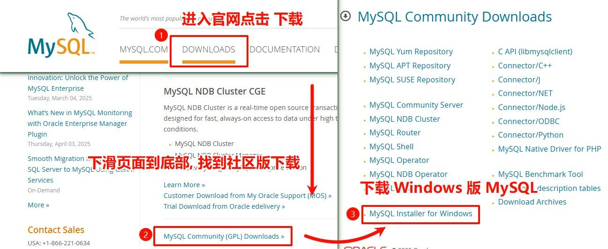
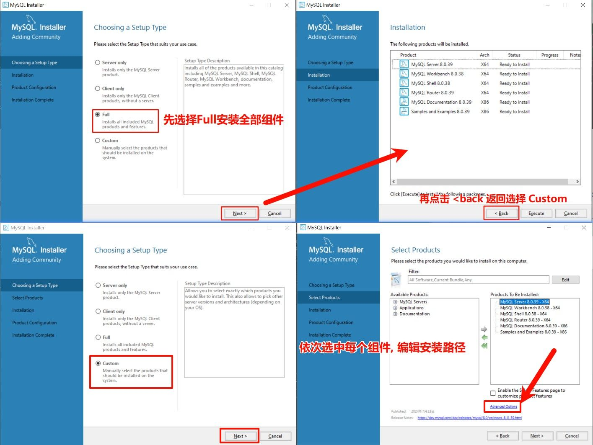
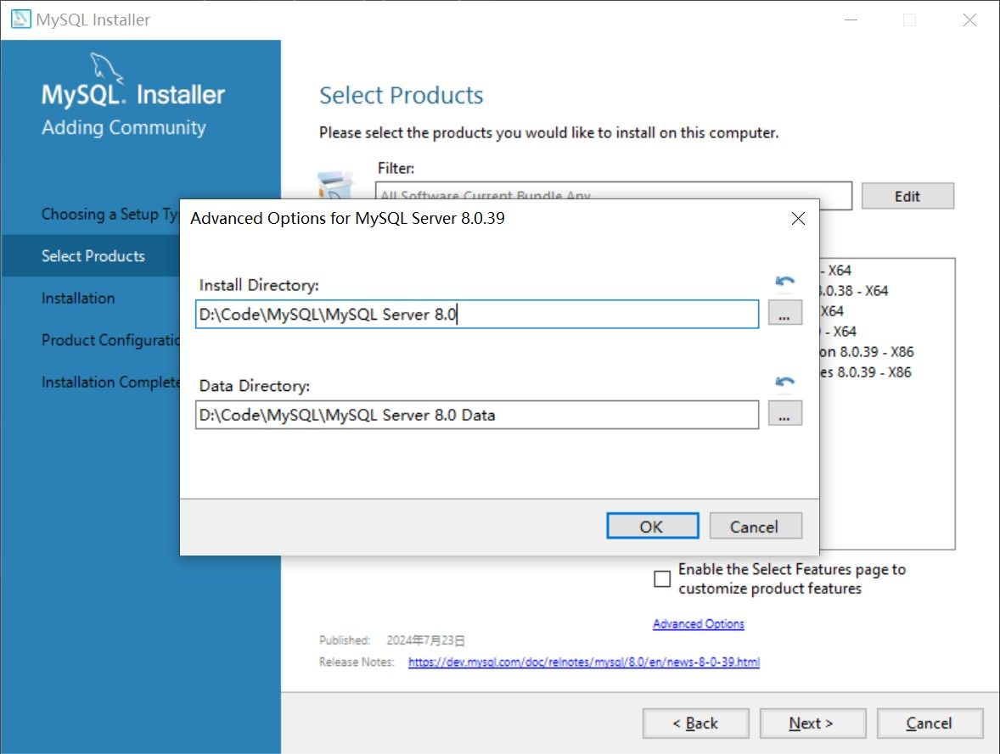
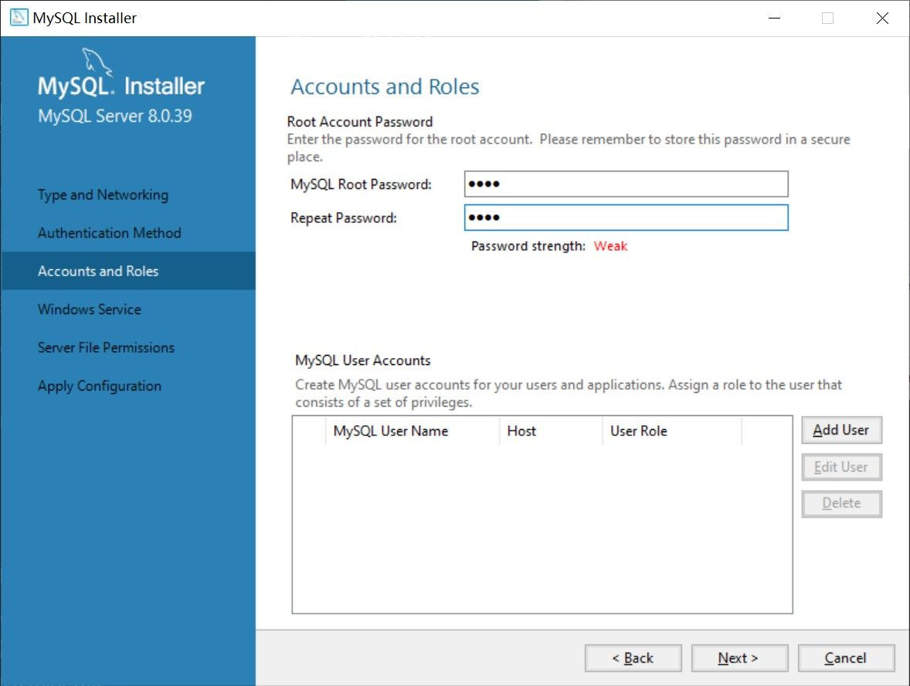
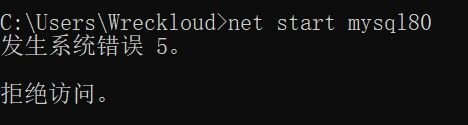
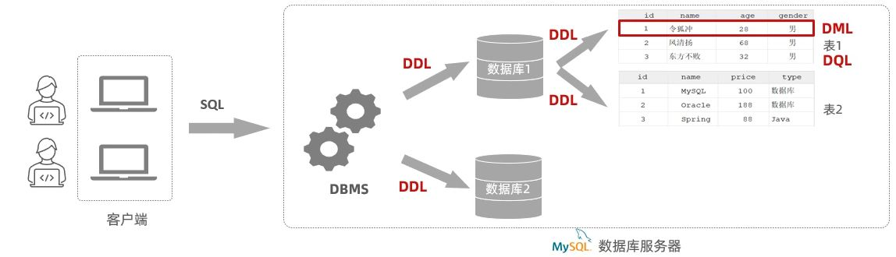

# 数据库简介

学习数据库，先要把几个核心概念捋清楚。数据库的世界看似庞杂，但实际上可以归纳为三个关键点：

- **DB 数据库（DataBase）**  
   数据库本身：数据存储和管理的仓库，本质上只是数据的集合。
- **DBMS 数据库管理系统（DataBase Management System）**  
   管理数据库的软件：负责操纵和管理数据库的大型软件，是人与数据库之间的中介。
- **SQL（Structured Query Language）**  
   统一的操作语言：操作关系型数据库的编程语言。它定义了一套统一的标准，所以不同厂商的数据库，虽然产品各异，但都离不开 SQL。

不同厂商在 SQL 标准之上开发了各自的数据库产品，定位各不相同。

| 名称           | 类型/定位    | 特点与背景                                          |
| -------------- | ------------ | --------------------------------------------------- |
| **Oracle**     | 大型、收费   | Oracle 公司出品，功能强大，常用于企业级项目         |
| **MySQL**      | 中小型、开源 | 免费、易用，最早被 Sun 收购，后来随 Sun 并入 Oracle |
| **SQL Server** | 中型、收费   | 微软出品，常与 C#、.NET 配合使用                    |
| **PostgreSQL** | 中小型、开源 | 功能全面，被称为“最先进的开源数据库”                |
| **DB2**        | 大型、收费   | IBM 出品，常见于金融、电信等行业                    |
| **SQLite**     | 微型、嵌入式 | 轻量化，Android 内置数据库                          |
| **MariaDB**    | 中小型、开源 | MySQL 的分支，保持兼容，继续社区化发展              |

这里再顺带说一下“关系型”和“非关系型”的区别：

- 关系型数据库（RDBMS）：以 **表格**（二维表）的形式来存储数据，不同表之间可以建立关系。适合结构化数据，比如用户信息、订单记录。常见代表：MySQL、Oracle、SQL Server。
- 非关系型数据库（NoSQL）：不一定用表格，数据可能以 **文档、键值对、图结构** 等形式存储，更灵活，适合高并发、大数据场景。常见代表：MongoDB、Redis。

MySQL 就是关系型数据库的代表。它由多张相互连接的二维表组成，结构统一、维护方便；同时，它使用标准 SQL 来操作，语法清晰，支持复杂查询，入门和进阶都很合适。

# 安装 MySQL

### 1. 从官网获取 MySQL

访问 MySQL 官网, 点击 DOWNLOADS 选择下载 MySQL Community Server(社区版), 下载最新版本的 MySQL 安装程序.

[MySQL 官网](https://www.mysql.com/)



或者直接点击这里 -> [MySQL 下载地址](https://dev.mysql.com/downloads/installer/)

也可直接前往下载页面:


前往下载页后, 推荐选择第二个下载项.
然后点击这里直接下载.


### 2. 安装 MySQL

下载完安装程序后, 双击运行安装程序.

如果安装方式直接选择 `Full` , 虽然会自动选择核心组件, 但是无法指定安装路径(默认为 C 盘).  
直接选择 `Custom` 就能指定安装路径, 但是直接选择后不会自动选择核心组件, 需要手动勾选组件(有点麻烦).

于是, 我们先选择 `Full` 安装方式, 先让安装程序为我们自动勾选核心组件.然后点击 `<back` 按钮, 选择 `Custom` 来自定义安装路径.

> 如果不在乎安装路径, 直接选择 `Full` 就行.



更改安装路径, 将安装路径从默认的  
`C:\Program Files\MySQL\...`  
设置为  
`任意路径\MySQL\...`  
(根据自己的实际情况更改).



每一个组件都需要修改路径, 修改完成后点击 `Next>` 按钮.  
接着无脑下一步, 等待组件安装.

直到设置密码的界面, 推荐使用**简单密码**, 因为到头来还是防自己的(



接着无脑下一步, 这个界面得注意一下:


不过还是保持默认比较好.
MySQL 本身也不太占内存, 每次手动启动还是有点麻烦.
因此, 保持 `Start the MySQL Server at System Startup` 为勾选状态即可.

注意 Windows Service Name 项配置的名称, 启动需要此名称.
这里默认是 `MySQL80` , 如果变更记得在后面的步骤中替换.

### 3. 配置环境变量

介绍一下[[环境变量]]

配置环境变量的过程都是通用的.

# 常用 MySQL 指令

- 启动

```bash
net start mysql80
```

- 停止

```bash
net stop mysql80
```

要注意的是 cmd 必须以管理员身份运行才能正常启动, 否则会提示拒绝访问.



- 登录

```bash
mysql -uroot -p
```

回车后输入密码即可登录。

- 连接

```bash
mysql -u用户名 -p密码 [-h数据库服务器IP地址 -P端口号]
```

# SQL 语句

SQL（Structured Query Language）是一门专门用于操作关系型数据库的编程语言。它为所有关系型数据库定义了一套统一的标准，所以无论使用的是 MySQL、Oracle 还是 SQL Server，核心语法和思想都是一致的。

按照功能，SQL 可以分成四大类：

| 分类    | 全称                       | 说明                                                 |
| ------- | -------------------------- | ---------------------------------------------------- |
| **DDL** | Data Definition Language   | 数据定义语言，用来定义数据库对象（数据库、表、字段） |
| **DML** | Data Manipulation Language | 数据操作语言，用来对表中的数据进行增、删、改         |
| **DQL** | Data Query Language        | 数据查询语言，用来查询表中的记录                     |
| **DCL** | Data Control Language      | 数据控制语言，用来创建数据库用户、管理权限           |

这些分类并不是互相割裂的，而是配合使用：



先用 DDL 建立结构，再用 DML 操作数据，DQL 负责查询，而 DCL 则保证数据库的安全与权限。

SQL 的语法在不同数据库系统中大体一致，有几个基本规则需要记住：

- 语句可以单行或多行书写，但必须以 **分号** 结尾。
- 可以使用空格或缩进来增强可读性。
- 在 MySQL 中，SQL **不区分大小写**。不过实际开发里一般推荐把关键字写成大写（如 `SELECT`、`FROM`），这样可读性更好。

> 各个数据库在 SQL 上可能有细节差异，这些被称为 **方言**，比如 MySQL 有自己独特的写法。

注释的写法也有几种，最常见的有：

```sql
-- 单行注释
# 单行注释（MySQL 特有）
/* 多行注释 */
```

# DDL

在 SQL 中，DDL（Data Definition Language，数据定义语言） 用来定义数据库对象，包括数据库本身、表，以及表中的字段。可以理解为“搭建地基和框架”的部分。

## 数据库操作

在语法上，下面的 `database` 也可以替换为 `schema`，效果是一样的。

### `show databases` 查看所有数据库

用于查看当前 MySQL 服务器中存在的所有数据库。

```sql
show databases;
```

执行后会列出所有数据库的名称。

### `select database()` 查询当前数据库

用于查看当前正在使用的数据库。

```sql
select database();
```

只有在先通过 `use` 选择了数据库后，这里才会返回对应的数据库名称。

### `use` 切换数据库

用于指定或切换当前要操作的数据库。

```sql
use 数据库名称;
```

执行后，之后的 SQL 语句都会作用在这个数据库中。

### `create database` 创建数据库

用于新建一个数据库。

```sql
create database [if not exists] 数据库名称 [default charset utf8mb4];
```

- `if not exists`：可选，避免重复创建。
- `default charset utf8mb4`：可选，用于指定默认编码。在 MySQL 8 中，默认字符集就是 `utf8mb4`。

假设要建立一个叫做 `wolf_clan` 的数据库，推荐的写法是：

```sql
create database if not exists wolf_clan default charset utf8mb4;
```

这段代码的含义是：

- 如果还没有名为 **wolf_clan** 的数据库，就创建一个；
- 并且把默认字符集设为 `utf8mb4`，以支持中文和表情等多字节字符。

这里的 数据库名称（`wolf_clan`）是我们自己定义的，但不允许与已有的数据库重复。

### `drop database` 删除数据库

用于删除一个已有的数据库。

```sql
drop database [if exists] 数据库名称;
```

- `if exists`：可选，如果数据库不存在，就不会报错。

## 表操作

在对表进行任何操作之前，必须先使用 `use 数据库名称;` 指定要操作的数据库，否则会报错或无法创建表。

### `create table` 创建表

创建表的一般语法如下：

```sql
create table 表名称 (
  字段1 字段类型 [约束] [comment '字段1注释'],
  字段2 字段类型 [约束1 约束2] [comment '字段2注释']
) [comment='表注释'];
```

例如，我们在数据库中建立一张关于狼的表，记录狼的编号和名字：

```sql
create table wolf (
  id int comment '编号',
  name varchar(20) comment '狼的名字'
) comment='狼表';
```

这段代码会新建一张名为 **wolf** 的表，其中包含两个字段：

- `id`，整数类型，用来记录编号；
- `name`，字符串类型，用来记录狼的名字。

但是，这里很快就会暴露一个问题：如果我们插入了两条相同 `id` 的数据，表里没有任何约束，就可能出现了重复编号。现实中这显然不合理，因为每只狼都应该有独一无二的编号。

约束是作用在字段上的规则，用于限制存储在表中的数据。目的在于保证数据的正确性、有效性和完整性。

#### 约束

常见的约束如下：

| 约束     | 描述                               | 关键字      |
| -------- | ---------------------------------- | ----------- |
| 非空约束 | 限制该字段值不能为 `null`          | not null    |
| 唯一约束 | 保证字段值唯一、不重复             | unique      |
| 主键约束 | 一行数据的唯一标识，要求非空且唯一 | primary key |
| 默认约束 | 如果未指定值，则采用默认值         | default     |
| 外键约束 | 用于保证表之间数据的关联完整性     | foreign key |

通过这些约束，我们就可以解决刚才的问题：比如给 `id` 字段加上 `primary key`，从而确保编号不会重复。

#### 数据类型

在创建表时，除了字段名称，还必须为每个字段指定数据类型。
不同的数据类型决定了字段中能够存储的数据范围和形式。MySQL 的数据类型非常多，但通常分为三大类：

- 数值类型
- 字符串类型
- 日期时间类型

以下整理的是日常开发中最常用的几种。

**数值类型**

| 类型      | 说明                       | 示例用途     |
| --------- | -------------------------- | ------------ |
| `tinyint` | 非常小的整数，存储范围有限 | 年龄、状态码 |
| `int`     | 常用的整数类型，范围足够大 | 编号、数量   |
| `bigint`  | 可存储更大范围的整数       | ID、统计数   |

**字符串类型**

| 类型         | 说明                                           | 示例用途         |
| ------------ | ---------------------------------------------- | ---------------- |
| `char(n)`    | 固定长度字符串，长度不足会自动补齐。性能较高。 | 身份证号、手机号 |
| `varchar(n)` | 可变长度字符串，按实际长度存储，更节省空间     | 名字、地址       |

**日期时间类型**

| 类型       | 说明                                       | 示例用途                |
| ---------- | ------------------------------------------ | ----------------------- |
| `date`     | 只包含日期，格式 `YYYY-MM-DD`              | 生日，例如 `2025-08-29` |
| `datetime` | 包含日期和时间，格式 `YYYY-MM-DD HH:MM:SS` | 创建时间、更新时间      |

### `show tables` 查询所有表

用于查看当前数据库中包含的所有表。

```sql
show tables;
```

执行后会列出该数据库下的全部表名。

### `desc` 查看表结构

用于查看表的字段信息，包括字段名、数据类型、是否允许为空、键约束、默认值等。

```sql
desc 表名称;
```

这条命令是快速了解表结构最常用的方式。

### `show create table` 查看建表语句

用于显示某张表完整的建表语句，包括所有字段、约束和注释。

```sql
show create table 表名称;
```

这条命令常用于复制建表语句或迁移数据库结构。

### `alter table` 修改表结构

`alter table` 用于修改已有表的结构，可以实现添加字段、修改字段、删除字段、修改表名等多种操作。

#### `add` 添加字段

在已有表中新增字段。

```sql
alter table 表名称
add 字段名称 字段类型(长度) [comment '注释'] [约束];
```

例如，给 `wolf` 表新增一列 `color`，类型为可变长字符串，最大 10 个字符，并添加“毛色”注释：

```sql
alter table wolf
add color varchar(10) comment '毛色';
```

#### `modify` 修改字段类型

用于修改已有字段的数据类型。

```sql
alter table 表名称
modify 字段名称 新数据类型(长度);
```

把 `wolf` 表中 `name` 列的类型调整为 `varchar(50)`，以容纳更长的名字：

```sql
alter table wolf
modify name varchar(50);
```

#### `change` 修改字段名与类型

既能修改字段名，也能同时修改数据类型或加上注释。

```sql
alter table 表名称
change 旧字段名称 新字段名称 数据类型(长度) [comment '注释'] [约束];
```

将 `color` 列改名为 `fur_color`，类型设为 `varchar(20)`，并保留/更新“毛色”注释：

```sql
alter table wolf
change color fur_color varchar(20) comment '毛色';
```

#### `drop column` 删除字段

用于从表中移除一个字段。

```sql
alter table 表名称
drop column 字段名称;
```

例如：

```sql
alter table wolf
drop column fur_color;
```

表示从 `wolf` 表中删除 `fur_color` 字段；该字段及其历史数据会彻底丢失。

#### `rename to` 修改表名

用于修改表的名称。

```sql
alter table 表名称
rename to 新表名称;
```

例如：

```sql
alter table wolf
rename to wolf_pack;
```

这会把表 `wolf` 重命名为 `wolf_pack`，但表内数据和结构不受影响。

### `drop table` 删除表

用于彻底删除一张表。

```sql
drop table [if exists] 表名称;
```

注意删除表时，表中的所有数据也会被一并删除，不可恢复。

# DML

DML（Data Manipulation Language）是 数据操作语言，主要用于对表中的数据进行 增加、修改、删除操作。

### `insert into` 插入数据

用于向表中添加数据。

**插入单条：**

```sql
insert into 表名称 (字段名称1, 字段名称2, ...)
values (
  值1,
  值2,
  ...
);
```

指定字段插入：只向部分字段写入数据。

```sql
insert into wolf (id, name)
values (
  1,
  'White Fang'
);
```

这条语句表示在 `wolf` 表中插入一只编号为 1、名字为 “White Fang” 的狼。

如果要插入所有字段，可以省略字段列表。

```sql
insert into wolf
values (
  2,
  'Shadow'
);
```

这表示为表中的所有列插入数据，顺序必须与建表时一致。

**批量插入：**

```sql
insert into wolf (id, name)
values
  (3, 'Storm'),
  (4, 'Night');
```

这样会一次性插入两条数据。

### `update` 修改数据

用于修改表中已有的数据。

```sql
update 表名称
set 字段名称1 = 值1,
    字段名称2 = 值2
[where 条件];
```

这条语句表示把 `id=2` 的狼名字改为 “Moon”：

```sql
update wolf
set name = 'Moon'
where id = 2;
```

注意，如果没有 `where` 条件，则会修改整张表的所有数据，一般不建议省略 `where` 条件。

### `delete from` 删除数据

用于删除表中的数据记录。

**删除指定数据：**

```sql
delete from 表名称
[where 条件];
```

例如需要删除 `id=3` 的那条记录。

```sql
delete from wolf
where id = 3;
```

**删除全部数据：**

如果需要删除整张表的所有数据，就不加 `where` 条件：

```sql
delete from wolf;
```

这样就会删除全部数据，但表结构仍会保留。

需要注意：

- `delete` 不能只删除某个字段的值，如果要清空字段内容，可以使用 `update` 将其置为 `null`。

```sql
update wolf
set name = null
where id = 4;
```

# DQL

DQL（Data Query Language）用于**查询**数据，只读不改，核心关键字是 `SELECT`。

常见骨架如下：

```sql
-- 基本查询
select 字段列表
from 表名称 [别名] [, 其他表或子查询]

-- 条件查询
[where 条件列表]

-- 分组查询
[group by 分组字段列表]
[having 分组后条件列表]

-- 排序查询
[order by 排序字段 [asc|desc], ...]

-- 分页查询
[limit 偏移量, 行数];
```

一条完整的查询语句，通常由若干可选子句按固定顺序组成：

```
SELECT → FROM → WHERE → GROUP BY → HAVING → ORDER BY → LIMIT
```

这是书写顺序也是常见的逻辑执行链。

### `from` 基本查询

从表中查询指定的多个字段。

```sql
select 字段名称1, 字段名称2, 字段名称3
from 表名称;
```

使用通配符 `*` 查询表中所有字段。

```sql
select *
from 表名称;
```

不过在实际开发中不推荐经常使用 `*`，因为**不直观、效率低**。

**设置字段别名**

可以为查询结果中的字段设置别名，`as` 关键字可省略。

```sql
select 字段名称 [as 别名]
from 表名称;
```

**去重查询**

使用 `distinct` 去除重复记录。

```sql
select distinct 字段名称
from 表名称;
```

这会返回表中所有不同的年龄，不会重复显示相同的值。

### `where` 条件查询

在查询时使用 `where` 子句可以根据条件筛选出符合要求的数据。

```sql
select 字段列表
from 表名称
where 条件列表;
```

例如，这条语句会筛选出 `wolf` 表中所有年龄大于等于 3 的狼。

```sql
select id, name
from wolf
where age >= 3;
```

#### 比较与逻辑运算符

除了常见的 `=`、`>`、`<` 等比较运算，数据库查询还可以用 `and`、`or`、`not` 来组合多个条件：

```sql
select *
from wolf
where age > 2 and name != 'Shadow';
```

这会筛选出年龄大于 2 且名字不是 “Shadow” 的狼。

除此之外，还有：

- **`between ... and ...`**：范围查询，包含边界值。
- **`in (...)`**：集合查询，例如 `in (1, 2, 3)`，表示筛选值等于 1、2 或 3 的记录。
- **`is null / is not null`**：判断字段是否为空。

#### `like` 模糊匹配

用于做模糊搜索：

- `_` 匹配单个字符
- `%` 匹配任意多个字符

```sql
select *
from wolf
where name like 'S%';
```

查询名字以 `S` 开头的狼，比如 “Storm”、“Shadow”。

```sql
select *
from wolf
where name like '_oon';
```

查询名字为四个字母且结尾是 “oon” 的狼，比如 “Moon”。

### `group by` 分组查询

分组查询常常用来做统计，依赖于**聚合函数**。所谓聚合函数，不是看单条记录，而是把**整列的数据**放在一起，算一个“汇总结果”。

可以理解为：**行是横向的，聚合函数是纵向的**。  
普通查询是“查每一行”，而聚合函数是“把一列当整体来运算”。

#### 聚合函数

常见的聚合函数有：

| 函数       | 功能     |
| ---------- | -------- |
| `count(*)` | 统计行数 |
| `max(*)`   | 最大值   |
| `min(*)`   | 最小值   |
| `avg(*)`   | 平均值   |
| `sum(*)`   | 求和     |

- **`count`**：统计数量。
  ```sql
  select count(*) from wolf;
  ```
  统计 `wolf` 表中的行数。
  - `count(字段名)`：只统计字段不为 `null` 的行，效率较低，除非需求就是统计“非空”数量。
  - `count(常量)`：和 `count(*)` 类似，但性能略差。
  - `count(*)`：推荐使用，效率最高，因为底层做了优化。

所有聚合函数都不会统计 `null` 值。

#### 分组查询语法

在查询时使用 `group by` 按字段分组，可以结合聚合函数进行统计。

```sql
select 分组字段, 聚合函数(字段)
from 表名称
[where 条件]
group by 分组字段
[having 分组后条件];
```

示例：统计不同毛色的狼有多少只：

```sql
select color, count(*)
from wolf
group by color;
```

结果会按 `color` 分组，并统计每组的数量。

⚠️ 注意：

- `select *` 在分组查询中没有意义，因为查询结果只支持**分组字段**和**聚合函数**。
- 如果你在 `select` 里写了非分组字段、非聚合函数，会导致语义不明确。

#### `where` 与 `having` 的区别

1. **执行时机不同**：

   - `where` 在分组之前过滤，不满足条件的行不会参与分组。
   - `having` 在分组之后过滤，用来筛选分组结果。

2. **判断条件不同**：

   - `where` 不能对聚合函数做判断。
   - `having` 可以对聚合函数的结果做判断。

### `order by` 排序查询

在查询结果中使用 `order by` 可以对数据进行排序。

```sql
select 字段列表
from 表名称
[where 条件]
[group by 分组字段 having 分组条件]
order by 排序字段 [asc|desc];
```

排序方式有众所周知的两种：

- `asc`：升序（默认，可以省略）
- `desc`：降序

可以指定多个字段作为排序规则，前一个字段相同时，再按下一个字段排序。

```sql
select id, name, age, color
from wolf
order by color asc, age desc;
```

这会先按照 `color` 升序排列，如果颜色相同，再按 `age` 降序排列。

### `limit` 分页查询

在 MySQL 中，分页通过 `limit` 子句实现，用来限制查询结果的返回条数。

```sql
select 字段列表
from 表名称
[where 条件]
[group by 分组字段 having 分组后条件]
[order by 排序字段]
limit 起始索引, 查询条数;
```

- **起始索引**：从第几行开始（从 0 开始计数）。
- **查询条数**：返回多少行数据。

比如这条语句会从 `wolf` 表中按 `id` 升序排列，取出第 1 行到第 5 行（共 5 条记录）。

```sql
select id, name
from wolf
order by id
limit 0, 5;
```

再比如，这表示从第 6 行开始，继续取 5 条数据，用于展示“第 2 页”。

```sql
select id, name
from wolf
order by id
limit 5, 5;
```

# **多表关系**

在真实的项目开发中，表不是孤立存在的。  
业务模块之间往往有联系，表结构也要体现这种联系。设计表结构时，我们会先分析业务之间的关系，再把这些关系转成数据库层面的**表与表的关联**。

从设计角度来看，常见的表关系主要有三类：

- **一对多（多对一）**：最常见的关系，比如“狼群和狼”。一个狼群下可以有很多只狼，每只狼只属于一个狼群。
- **一对一**：较少见，通常用于表拆分。比如“用户”和“身份证信息”，一条用户记录对应唯一的身份证记录。
- **多对多**：需要中间表来描述。比如“狼”和“猎物”的关系，一只狼可以捕猎多种猎物，一种猎物也可能被多只狼捕到。

## **一对多 / 多对一**

一对多关系是数据库里最常见的关系。  
拿我们设计的案例来说：一只狼群里可以有很多只狼，每只狼只属于一个狼群，这就是一个标准的“一对多”。

一对多的实现方式就是：

> 在“多”的一方添加一个外键字段，指向“一”的一方的主键。

先建立“主表”（一的一方）：

```sql
create table wolf_pack (
  id int primary key comment '狼群编号',
  name varchar(20) not null comment '狼群名称'
) comment='狼群表';
```

这张表记录了所有狼群的基本信息，`id` 作为主键，用来唯一标识一只狼群。

再建立“从表”（多的一方）：

```sql
create table wolf (
  id int primary key comment '狼编号',
  name varchar(20) not null comment '狼名',
  age int comment '年龄',
  pack_id int comment '所属狼群',
) comment='狼表';
```

这里的 `pack_id` 字段就是逻辑上的外键，用来记录每只狼属于哪个狼群。

如果我们只停留在这一层，没有任何约束，就需要**在代码里自行保证完整性**，比如删除狼群前先检查是否有狼还属于它，否则就可能留下“脏数据”。

### 外键约束

为了让数据库自动帮我们检查完整性，我们可以为 `pack_id` 添加一个外键约束。  
标准模板如下：

```sql
constraint 外键名称
foreign key (外键字段名) references 主表(主键字段名)
```

建表时直接加上外键：

```sql
create table wolf (
  id int primary key comment '狼编号',
  name varchar(20) not null comment '狼名',
  age int comment '年龄',
  pack_id int comment '所属狼群',
  constraint fk_wolf_pack foreign key (pack_id) references wolf_pack(id)
) comment='狼表';
```

这样，如果我们试图删除某个被引用的 `wolf_pack.id`，MySQL 会报错，阻止删除，从而避免出现 `pack_id` 指向不存在的情况。

如果表已经建好，也可以后续添加外键约束：

```sql
alter table wolf
add constraint fk_wolf_pack
foreign key (pack_id) references wolf_pack(id);
```

这就是**物理外键**，由数据库层面保证数据一致性。

### 物理外键 vs 逻辑外键

在实际项目中，我们通常区分两种做法：

- **物理外键**：用 `foreign key` 建约束，让数据库来帮你检查。
- **逻辑外键**：只保留字段，不建外键约束，在代码逻辑里手动检查、维护。

物理外键优点是安全，但缺点也明显：

1. 每次增删改都要检查外键，性能略受影响。
2. 在分布式或多节点数据库里不适用。
3. 容易引发死锁，增加维护复杂度。

因此，**逻辑外键**是实际项目里更常见的做法：  
开发者会先查询是否存在关联数据，再决定能不能删，保证业务逻辑灵活可控。

## **一对一**

一对一关系比一对多少见，更多用于**表拆分**，目的是把经常访问的核心字段和不常用的扩展字段分开，提高性能。

在我们的案例里，可以假设每只狼都有一份独立的身份档案（比如血统、出生地、健康状态等信息）。  
每只狼最多对应一份档案，每份档案也只属于一只狼，这就是标准的“一对一”。

首先建立“主体表”（狼表）：

```sql
create table wolf (
  id int primary key comment '狼编号',
  name varchar(20) not null comment '狼名',
  age int comment '年龄'
) comment='狼表';
```

这张表只保留常用字段，方便日常查询。

再建立“扩展表”（档案表）：

```sql
create table wolf_profile (
  id int primary key comment '档案编号',
  wolf_id int unique comment '对应的狼编号',
  bloodline varchar(50) comment '血统',
  birthplace varchar(50) comment '出生地',
  health varchar(20) comment '健康状态',
  constraint fk_wolf_profile foreign key (wolf_id) references wolf(id)
) comment='狼档案表';
```

这里有两点关键：

1. `wolf_id` 设置为 **唯一（UNIQUE）**，保证一只狼只能有一份档案。
2. 通过 `foreign key` 建立外键约束，确保 `wolf_id` 必须指向已存在的狼。

这样就实现了“一对一”的关系。

如果不建外键约束，也可以用逻辑外键的方式，通过业务层检查档案是否存在，但仍然必须保证 `wolf_id` 不重复。
在查询时，可以使用接下来介绍的内连接把两张表拼接起来，查出完整信息。

## **多对多**

多对多关系通常出现在两个对象之间存在“相互多选”的情况。  
在我们的案例里，一只狼可以捕猎多种猎物，而同一种猎物也可能被多只狼捕到，这就是一个标准的多对多。

多对多的实现方式就是：

> 建立一张中间表，分别用两个外键关联两边的主键，把多对多拆成两个一对多。

先建立“狼表”：

```sql
create table wolf (
  id int primary key comment '狼编号',
  name varchar(20) not null comment '狼名'
) comment='狼表';
```

记录每只狼的编号和名字。

再建立“猎物表”：

```sql
create table prey (
  id int primary key comment '猎物编号',
  name varchar(20) not null comment '猎物名称'
) comment='猎物表';
```

记录所有猎物的编号和名称。

最后建立“中间表”（捕猎记录表）：

```sql
create table hunt_record (
  id int primary key auto_increment comment '记录编号',
  wolf_id int not null comment '捕猎的狼',
  prey_id int not null comment '捕获的猎物',
  hunt_time datetime comment '捕猎时间',
  constraint fk_hunt_wolf foreign key (wolf_id) references wolf(id),
  constraint fk_hunt_prey foreign key (prey_id) references prey(id)
) comment='捕猎记录表';
```

这里的关键点：

- `wolf_id` 和 `prey_id` 分别作为外键，关联两张主表。
- 每条记录代表一只狼在某个时间捕获了某个猎物。
- 通过这张表，我们就能从任意一边查询出对方的所有关联数据。

# **多表查询**

在实际开发中，往往需要从多张表中联合查询数据。  
比如我们想查出每只狼所属的狼群名称，仅查 `wolf` 表不够，需要把 `wolf_pack` 的数据也拿出来拼在一起。

如果直接把两张表拼在一起，会发生什么？

```sql
select *
from wolf, wolf_pack;
```

这条语句会把 `wolf` 表的每一行和 `wolf_pack` 表的每一行进行**两两组合**，结果就是一个巨大的集合——这就是**笛卡尔积**。

假设两张表的数据是这样的：

`wolf_pack` 表：

| id  | name     |
| --- | -------- |
| 1   | 北境之牙 |
| 2   | 暗影之森 |

`wolf` 表：

| id  | name | pack_id |
| --- | ---- | ------- |
| 1   | 狂风 | 1       |
| 2   | 霜月 | 1       |
| 3   | 幽爪 | 2       |
| 4   | 独狼 | null    |

执行查询后，会得到这样的结果（只展示部分）：

| wolf.id | wolf.name | pack_id | wolf_pack.id | wolf_pack.name |
| ------- | --------- | ------- | ------------ | -------------- |
| 1       | 狂风      | 1       | 1            | 北境之牙       |
| 1       | 狂风      | 1       | 2            | 暗影之森       |
| 2       | 霜月      | 1       | 1            | 北境之牙       |
| 2       | 霜月      | 1       | 2            | 暗影之森       |
| …       | …         | …       | …            | …              |

笛卡尔积的行数 = 表 1 行数 × 表 2 行数，所以这里结果有 4 × 2 = 8 条。  
其中大部分都是“错配”的组合，比如`狂风`明明属于`北境之牙`，却和`暗影之森`也拼到了一起，显然是无效数据。

我们需要加条件，让只属于同一个狼群的记录匹配到一起：

```sql
select *
from wolf, wolf_pack
where wolf.pack_id = wolf_pack.id;
```

执行后就只剩下有意义的结果：

| wolf.id | wolf.name | pack_id | wolf_pack.id | wolf_pack.name |
| ------- | --------- | ------- | ------------ | -------------- |
| 1       | 狂风      | 1       | 1            | 北境之牙       |
| 2       | 霜月      | 1       | 1            | 北境之牙       |
| 3       | 幽爪      | 2       | 2            | 暗影之森       |

此时每只狼都正确匹配到了自己所在的狼群，笛卡尔积里无效的组合被消除了。

不过请注意：
刚才的“独狼”没有出现在结果中，因为它的 `pack_id` 是空值，没有匹配到任何狼群。  
如果我们仍然想看到这些“独狼”，只是群组列显示为空，就需要用到接下来提到的**外连接**来解决。

## **连接查询**

SQL 其实还给了我们一套更专业的写法——**连接（JOIN）**。

它做的事情还是那一件：把多张表里“能对上的行”拼在一起，只不过语义更清晰，可读性更好，而且更方便扩展到多表。

### `join on` 内连接

内连接就像取交集，只要能对上的行，也就是：

> 两边都满足条件才会出现在结果里。

```sql
select 字段列表
from 表A a
inner join 表B b on a.外键 = b.主键
where 其他条件;
```

最简单的写法，其实就是我们上一节用的 `where` 称之为 **隐式内连接**。现在更推荐显式写出 `join`，也就是 **显式内连接** 一眼就能看出是“在连表”：

```sql
select w.name as 狼, p.name as 狼群
from wolf w
inner join wolf_pack p on w.pack_id = p.id;
```

执行结果仍然只会列出**有狼群的狼**，没有加入狼群的“独狼”就看不到了。

还是用我们之前的两张表，查询结果与上一节是一样的：

| id  | 狼   | 狼群     |
| --- | ---- | -------- |
| 1   | 狂风 | 北境之牙 |
| 2   | 霜月 | 北境之牙 |
| 3   | 幽爪 | 暗影之森 |

“独狼”依然不会出现在结果里，因为它的 `pack_id` 是空值，匹配不到任何狼群。  
这就是内连接的特点：只要交集，无法匹配的行会被丢掉。

我们还可以在连表之后加条件、加排序，让结果更干净：

```sql
select w.name as 狼, p.name as 狼群
from wolf w
inner join wolf_pack p on w.pack_id = p.id
where p.name = '北境之牙'
order by w.name;
```

| 狼   | 狼群     |
| ---- | -------- |
| 狂风 | 北境之牙 |
| 霜月 | 北境之牙 |

这样就能查出所有“北境之牙”狼群的狼，按名字排好序。

**多表内连接**

内连接的好处之一，就是可以继续连下去，把三张、四张表都拼在一起。

假设我们还有两张表：

`prey` 表：

| id  | name |
| --- | ---- |
| 1   | 野兔 |
| 2   | 山羊 |

`hunt_record` 表：

| id  | wolf_id | prey_id | hunt_time        |
| --- | ------- | ------- | ---------------- |
| 1   | 1       | 1       | 2025-09-01 10:00 |
| 2   | 3       | 2       | 2025-09-02 15:30 |

我们想查出：每只有捕猎记录的狼，它所在的狼群，以及它捕到的猎物。

```sql
select w.name as 狼, p.name as 狼群, pr.name as 猎物, hr.hunt_time as 捕猎时间
from wolf w
inner join wolf_pack p on w.pack_id = p.id
inner join hunt_record hr on hr.wolf_id = w.id
inner join prey pr on pr.id = hr.prey_id;
```

执行结果：

| 狼   | 狼群     | 猎物 | 捕猎时间         |
| ---- | -------- | ---- | ---------------- |
| 狂风 | 北境之牙 | 野兔 | 2025-09-01 10:00 |
| 幽爪 | 暗影之森 | 山羊 | 2025-09-02 15:30 |

可以看到，这次只返回满足所有条件的行：

- 狼必须能匹配到狼群
- 必须有对应的捕猎记录
- 捕猎记录里的 `prey_id` 也要能匹配到猎物

如果一只狼没有捕猎记录，它就不会出现在结果中。

### `LEFT/RIGHT JOIN` 外连接

内连接只取交集，但有时候我们希望**保留某一侧的全部数据**，即便它在另一侧找不到匹配行，也就是解决独狼的特殊情况。

外连接正是为这种场景准备的：

- **左外连接（LEFT JOIN）**：保留左表的所有数据，右表匹配不到就补 `null`。

还是用之前的表：

```sql
select w.id, w.name as 狼, p.name as 狼群
from wolf w
left join wolf_pack p on w.pack_id = p.id;
```

结果，查出所有狼，哪怕没加入狼群：

| id  | 狼   | 狼群     |
| --- | ---- | -------- |
| 1   | 狂风 | 北境之牙 |
| 2   | 霜月 | 北境之牙 |
| 3   | 幽爪 | 暗影之森 |
| 4   | 独狼 | null     |

可以看到，“独狼”也出现了，只是它的 `狼群` 列是空值，这正是左外连接的意义：**左边全要，右边对不上就留空**。

- **右外连接（RIGHT JOIN）**：保留右表的所有数据，左表匹配不到就补 `null`。

如果我们新插入一个暂时还没有狼的狼群：

```sql
insert into wolf_pack (id, name) values (3, '雪原孤岭');
```

再执行右外连接：

```sql
select p.id, p.name as 狼群, w.name as 狼
from wolf w
right join wolf_pack p on w.pack_id = p.id;
```

结果，查出所有狼群，哪怕暂时没有狼：

| 狼群编号 | 狼群     | 狼   |
| -------- | -------- | ---- |
| 1        | 北境之牙 | 狂风 |
| 1        | 北境之牙 | 霜月 |
| 2        | 暗影之森 | 幽爪 |
| 3        | 雪原孤岭 | null |

“雪原孤岭”也出现了，即便它还没有任何狼。  
右外连接的特点是：**右边全要，左边对不上就留空**。

一个常见误区是，在 `where` 里筛选右表的列，把原本补了 `null` 的行都筛掉了，结果又变成了内连接。

**错误写法**（独狼被筛掉）：

```sql
select w.name, p.name
from wolf w
left join wolf_pack p on w.pack_id = p.id
where p.name = '北境之牙';
```

正确写法：把条件写在 `on` 后，保留左表的全部行：

```sql
select w.name, p.name
from wolf w
left join wolf_pack p on w.pack_id = p.id and p.name = '北境之牙';
```

这样独狼依然会出现，只是狼群列是空。

## **子查询**

有时我们要查的数据，需要先从另一张表里算出一个“中间结果”，再拿来当条件过滤，这就是**子查询**。

> 子查询 = 先查子结果 → 再用子结果限制或补充外层查询。

子查询可以出现在多个位置：

- `WHERE/HAVING`：当过滤条件使用（最常见）
- `FROM`：当一张“临时表”使用（派生表 / 内联视图）
- `SELECT` 列表：当派生值使用（相关子查询常见）

子查询按返回形态分四类：标量（一个值）/ 列（单列多行）/ 行（一行多列）/ 表（多行多列）。核心要点：外层要“接得住”子查询的形态。

```sql
select 字段列表
from 表A
where 列 = (select 列 from 表B where 条件);
```

子查询必须先保证能返回合理的结果：有时候只返回一个值（标量子查询），有时候返回一列或一整张临时表。

### 标量子查询

子查询只返回一条一列，用作等号比较或直接当常量用。例如找出捕猎次数最多的狼的名字。

```sql
select w.name as 狼
from wolf w
where w.id = (
  select hr.wolf_id
  from hunt_record hr
  group by hr.wolf_id
  order by count(*) desc
  limit 1
);
```

执行结果（假设“狂风”捕猎最多）：

| 狼   |
| ---- |
| 狂风 |

内层先算出“捕猎次数最多”的 `wolf_id`，外层再据此取狼名。

### 列子查询

子查询产出一个 ID 列，外层用 `IN`/`NOT IN` 去匹配。比如需要查出捕猎过“野兔”的所有狼。

```sql
select w.name as 狼
from wolf w
where w.id in (
  select hr.wolf_id
  from hunt_record hr
  join prey pr on hr.prey_id = pr.id
  where pr.name = '野兔'
);
```

结果：

| 狼   |
| ---- |
| 狂风 |
| 霜月 |

这里 `in` 会自动去重；如果担心集合很大，也可以改成 `exists` 半连接来减少扫描量：

同样是“查打过野兔的狼”，`exists` 往往在大数据量、索引齐全的情况下更省事，因为一旦存在匹配行就不再继续找下一行。

```sql
select w.name as 狼
from wolf w
where exists (
  select 1
  from hunt_record hr
  join prey pr on pr.id = hr.prey_id
  where hr.wolf_id = w.id
    and pr.name = '野兔'
);
```

可以把它当成“带着 `w.id` 下去问一句：有没有？”有就保留，没就丢弃。集合很小时 `in` 也很好用，集合大时 `exists` 往往更轻快，实际以执行计划为准。

### 行子查询

有时我们既要主键也要统计值，不如把它们先在内层“打包”成一行，让外层一次性连回来即可。例如查出捕猎次数最多的狼和它的捕猎次数。

```sql
select w.name as 狼, t.cnt as 捕猎次数
from wolf w,
     (select hr.wolf_id, count(*) as cnt
      from hunt_record hr
      group by hr.wolf_id
      order by cnt desc
      limit 1) t
where w.id = t.wolf_id;
```

结果：

| 狼   | 捕猎次数 |
| ---- | -------- |
| 狂风 | 5        |

思路就是把“计算”和“取名”分步写清：内层生成（`wolf_id`, `cnt`）这一行，外层据 `wolf_id` 回表拿名字。

### 表子查询

子查询产出一行多列，外层一次性“接住”这行，或把它当**一张只含一行的派生表**拼接。例子：先算出每只狼的捕猎次数，再查出次数大于 3 的狼。

```sql
select t.wolf_id, t.cnt
from (
  select hr.wolf_id, count(*) as cnt
  from hunt_record hr
  group by hr.wolf_id
) t
where t.cnt > 3;
```

结果：

| wolf_id | cnt |
| ------- | --- |
| 1       | 5   |
| 3       | 4   |

这样写的好处是结构清楚：先把“每只狼的次数”这件事独立出来，外层再决定保留谁、怎排序、要不要再连 `wolf_pack` 显示群名。

这一类 SQL 最容易乱，是因为没有把步骤拆清楚。

建议先单独把内层 `select` 跑出来，确认“形态”和“结果”都正确，再嵌到外层。放哪儿很简单：当条件就丢进 `where/having`，当临时表就丢进 `from (...) 别名`，当派生列就写在 `select (...) as 别名`。保持这条顺序感，基本不会迷路。
