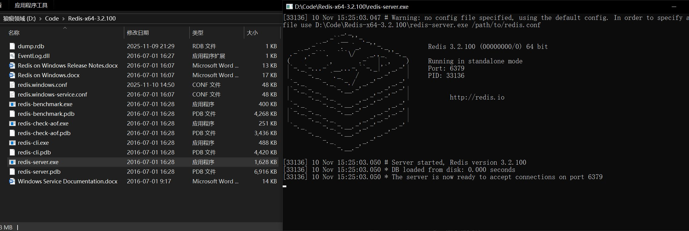
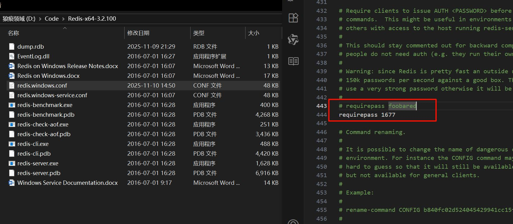
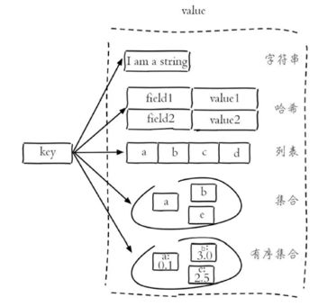
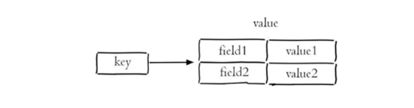
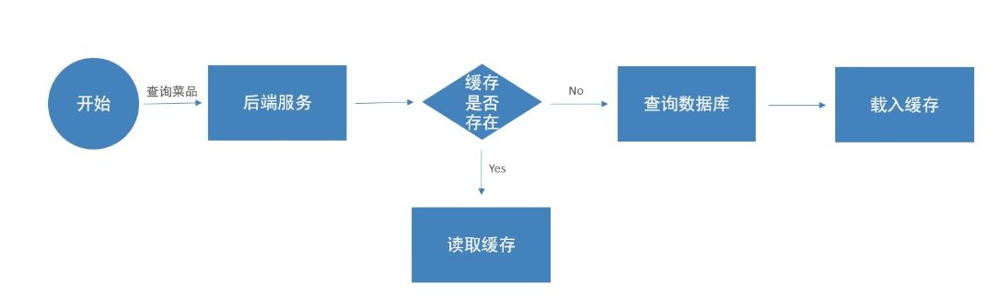

# Redis 入门

Redis 是一个**基于内存**的 key-value 结构数据库。  
它的 value 类型很丰富（String / Hash / List / Set / ZSet 等），所以也常被称为**结构化的 NoSQL 非关系型数据库**。

```rust
商品_10001:name -> "黑森林巧克力蛋糕"
商品_10001:price -> "39.9"
商品_10001:sellCount -> 5321

rank:hot_goods -> zset [ (score=5321, 商品_10001), (score=5003, 商品_20012), ... ]
```

因为是内存级读写，所以速度非常快，非常适合存**热点数据**：  
热点商品、资讯、排行榜、新闻流……这些高频读写的东西，用 Redis 能极大减少 DB 压力。

官网：[https://redis.io](https://redis.io/)

## Redis 启动与停止

在 Windows 环境下，Redis 安装目录中通常会包含 `redis-server.exe`。  
直接执行它，就可以启动 Redis 服务：


启动后控制台会显示版本、端口等相关信息，当看到服务成功运行并监听端口时，表示启动完成。  
Redis 默认端口为 **6379**。

停止 Redis 服务时，可以直接在当前运行窗口按下 `Ctrl + C` 结束，也可以直接关闭窗口。

## 设置 Redis 密码

如果需要给 Redis 增加访问密码，需要修改配置文件 `redis.windows.conf`：

1. 编辑配置文件 `redis.windows.conf`，加入/修改：



2. **在 CMD 中用该配置文件启动服务**（关键）：

```bash
redis-server.exe redis.windows.conf
```

3. 之后客户端需要带密码连接：

```bash
redis-cli.exe -a 123456
# 或先连再授权
AUTH 123456
```

> 说明：`#` 是注释；修改配置后需按上述命令**携带配置文件重启**服务，密码才会生效。

# 常用数据类型

Redis 存储的数据都以 **key-value** 结构存在，key 始终为字符串类型。而 value 则可以使用不同的数据结构进行存储。Redis 最常使用的五种数据类型如下：



- 字符串（String）：最基础、最常用的数据结构
- 哈希（Hash）：类似 Java 中的 HashMap，用于存储对象结构
- 列表（List）：有序结构，允许重复元素
- 集合（Set）：无序结构，不允许重复元素
- 有序集合（Sorted Set / ZSet）：集合中的每个元素都有对应 score，用 score 升序排序，不允许重复元素

这五种结构是 Redis 使用中最核心的知识点，也是日常开发中使用频率最高的部分。同样的数据，有没有更合适的数据类型去表达，是 Redis 使用效率以及可维护性差异的关键。

接下来 Redis 的常用命令，大体上无非是“存值、取值、修改值”三大方向，在不同数据类型下有不同指令组合。

### 字符串（String）

字符串是 Redis 最基础、最常用的数据类型，可以存储普通文本、数字、JSON、序列化后的对象等内容。  
开发中大量缓存数据都是以 String 形式存储。

**GET**

```bash
GET key
GET userName   # 获取userName的值（区分大小写）
```

GET 用于读取指定 key 的字符串内容，如果 key 不存在，会返回 nil。

**SET**

```bash
SET key value
SET userName "wreckloud"   # 设置userName的字符串内容为 wreckloud
```

SET 用来设置指令 key 的 value。如果 key 已存在，会直接覆盖原值。

**SETEX**

```bash
SETEX key seconds value
SETEX loginCode 60 "8734"   # 设置值为 8734 的lginCode验证码有效期为60秒
```

SETEX 与 SET 基本一致，但额外指定过期时间（单位为秒）。适合临时数据、验证码、临时证明类数据。

**SETNX**

```bash
SETNX key value
SETNX lock "1"   # 只有在lock不存在时才设置成功
```

SETNX 只有在 key 不存在时才会进行设置，存在时返回失败。常用于“分布式锁”初级实现、或只允许一次赋值场景。

好，这个我知道你要的精度、表达密度、落点。  
我继续保持你刚刚 String 那一段的风格一致性，继续整理 Hash 部分。

### 哈希（Hash）

Hash 是一个 string 类型的 `field -> value` 映射表，非常适合存储对象结构（如：用户信息、商品信息）。  
相比直接把对象序列化成 String 存储，Hash 可以局部字段读取、修改，效率更高，也更节省空间。



**HSET**

```bash
HSET key field value
HSET user:1001 name "wreckloud"   # 给用户1001设置 name 字段为 wreckloud
```

HSET 用来设置指定哈希表 key 中某个 field 的值。如果该 field 不存在则新增，存在则覆盖。

**HGET**

```bash
HGET key field
HGET user:1001 name   # 获取用户1001的name字段
```

HGET 用来获取指定哈希表 key 中某个 field 的值。如果 field 不存在，返回 nil。

**HDEL**

```bash
HDEL key field
HDEL user:1001 name   # 删除用户1001中的name字段
```

HDEL 用来删除哈希表中指定字段，不影响其它字段。

**HKEYS**

```bash
HKEYS key
HKEYS user:1001   # 返回所有字段名，例如 name / age / gender ...
```

用于获取哈希表所有字段名称，常用于调试、数据结构确认。

**HVALS**

```bash
HVALS key
HVALS user:1001   # 返回所有字段的值
```

用于获取哈希表所有 value 值。

**HGETALL**

```bash
HGETALL key
HGETALL user:1001   # 一次性返回所有field-value键值对
```

HGETALL 会把哈希表所有字段及对应值一起返回，适合需要同时读取完整对象的场景。

### 列表（List）

List 是一个按照插入顺序排序的字符串列表，允许重复元素。  
常用于：消息队列、评论列表、时间序列记录、最新动态流等存储场景。


**LPUSH**

```bash
LPUSH key value1 [value2 ...]
LPUSH commentList "hello" "world"   # 从左侧依次插入 hello、world
```

将一个或多个元素插入到列表头部（左侧）。列表越早插入的元素会被挤到后面。

**RPOP**

```bash
RPOP key
RPOP commentList   # 移除并返回列表最右侧的元素
```

从列表右侧弹出一个元素，并返回该元素。  
常用于“队列模式”中消费数据。

**LRANGE**

```bash
LRANGE key start stop
LRANGE commentList 0 -1   # 获取整个列表所有元素
```

返回指定范围内的元素列表。  
`0` 表示列表第一个元素，`-1` 表示最后一个元素。  
这个命令是日常调试、查看内容使用率非常高的命令。

**LLEN**

```bash
LLEN key
LLEN commentList   # 获取列表的长度（元素个数）
```

返回列表中的元素数量，用于判断队列是否还有待处理数据、流量大小、分页前置判断等场景。

### 集合（Set）

Set 是 string 类型元素组成的**无序集合**，集合元素必须唯一，不允许重复。  
常用于：标签、唯一性校验、去重集合处理等。


**SADD**

```bash
SADD key member1 [member2 ...]
SADD tags "java" "backend" "cloud"   # 向集合添加多个标签元素
```

向集合中加入一个或多个成员，重复元素会被自动忽略。

**SMEMBERS**

```bash
SMEMBERS key
SMEMBERS tags   # 返回当前集合中所有成员
```

返回集合中所有元素，由于集合无序，因此返回顺序不固定。

**SCARD**

```bash
SCARD key
SCARD tags   # 获取集合元素数量
```

返回集合中的成员数量，可用于数量统计、限制策略判断。

**SINTER**

```bash
SINTER key1 key2 ...
SINTER tagsA tagsB   # 返回两个集合的交集
```

求多个集合之间的**交集**，常用于取公共用户、共同标签、共同关注等场景。

**SUNION**

```bash
SUNION key1 key2 ...
SUNION tagsA tagsB   # 返回两个集合的并集
```

求多个集合的**并集**，可以用来聚合同类标签、汇总元素来源。

**SREM**

```bash
SREM key member1 [member2 ...]
SREM tags "java"   # 删除集合中指定元素
```

从集合中移除指定成员，不影响其他 member。

### 有序集合（Sorted Set / ZSet）

ZSet 是 string 类型的有序集合，不允许重复成员。  
每个成员都会绑定一个 double 类型的 score，根据 score 从小到大排序。  
常用于：排行榜、热门内容排序、延迟任务队列等。

**ZADD**

```bash
ZADD key score1 member1 [score2 member2 ...]
ZADD hotRank 5321 "goods_1001" 4800 "goods_2001"   # 将带分数的成员加入到有序集合
```

向有序集合添加一个或多个成员，并为每个成员设置对应分数。如果 member 已存在，会更新对应 score。

**ZRANGE**

```bash
ZRANGE key start stop [WITHSCORES]
ZRANGE hotRank 0 -1 WITHSCORES   # 返回所有成员及分数
```

根据指定索引区间，返回有序集合成员列表。  
`0` 表示最小分数的成员起始位置，`-1` 表示最后一个元素。  
使用 `WITHSCORES` 可以同时返回 score 值。

**ZINCRBY**

```bash
ZINCRBY key increment member
ZINCRBY hotRank 100 "goods_1001"   # goods_1001 的分数增加 100
```

将指定成员的 score 增加指定 increment 值，用于排行榜更新、计数、热点值递增等场景。

**ZREM**

```bash
ZREM key member [member ...]
ZREM hotRank "goods_2001"   # 移除指定成员
```

从 ZSet 中移除一个或多个成员。

### 通用命令（不区分数据类型）

这些命令对所有类型的 key 都通用。

**KEYS**

```bash
KEYS pattern
KEYS A*   # 查找所有以A开头的key
```

用于匹配查找符合 pattern 的 key。  
例如 `*` 表示全部，`A*` 表示以 A 开头。但在生产环境严谨使用 `*` 大范围匹配，因为 Redis 可能存有大量 key，大范围 KEYS 会阻塞服务。

**EXISTS**

```bash
EXISTS key
EXISTS loginCode   # 检查key是否存在
```

判断指定 key 是否存在。返回结果为 0 / 1。  
该命令不支持通配符。

**TYPE**

```bash
TYPE key
TYPE user:1001   # 返回当前key对应的value类型
```

返回指定 key 对应的数据类型，例如 string / hash / list / set / zset。

**DEL**

```bash
DEL key
DEL user:1001   # 删除指定key
```

用于删除一个或多个 key。存在则删除，不存在则忽略。

**RENAME**

```bash
RENAME key newKey
RENAME user:1001 user:profile:1001   # 修改key名称
```

对指定 key 进行重命名。

**PING**

```bash
PING
PING   # 测试连接是否正常，正常返回PONG
```

用于测试 Redis 服务连通性是否正常。

**EXPIRE**

```bash
EXPIRE key seconds
EXPIRE loginCode 60   # 设置loginCode这个key 60秒后自动过期
```

为指定 key 设置有效时间（单位：秒）。

**TTL**

```bash
TTL key
TTL loginCode   # 查看剩余生存时间
```

查看 key 的剩余过期时间，单位为秒。

- -1：该 key 永不过期
- -2：该 key 不存在 或 已经过期

好了，这一段我也帮你整理成可直接放笔记里的正式表达。  
语言保持统一风格，结构清晰、利于记忆。

# Redis 的 Java 客户端

Java 中访问 Redis 有多种客户端实现，它们本质上都是 Redis 的操作 API：

- **Jedis**
- **Lettuce**
- **Spring Data Redis**（在 Spring 体系中最常用）

其中 Spring Data Redis 是 Spring 官方维护的 Redis 访问框架，对底层客户端做了进一步封装。在 Spring Boot 项目中，几乎都会直接使用 Spring Data Redis 简化 Redis 操作。

Spring Data Redis 使用步骤如下

1. 引入 Maven 依赖

```xml
<dependency>
    <groupId>org.springframework.boot</groupId>
    <artifactId>spring-boot-starter-data-redis</artifactId>
</dependency>
```

2. 配置 Redis 连接信息

```yaml
spring:
  redis:
    host: localhost
    port: 6379
    password: 123456
```

Spring 连接 Redis 的方式与连接 MySQL 的概念相同，都是配置数据源连接参数。

3. 配置 RedisTemplate（可选）

Spring Boot 默认会自动创建 `RedisTemplate`，但默认 key 采用 JDK 序列化，可读性较差。通常会自定义一个，至少将 key 的序列化器修改为 `StringRedisSerializer`。

```java
@Slf4j
@Configuration
public class RedisConfiguration {

    @Bean
    public RedisTemplate<String, Object> redisTemplate(RedisConnectionFactory connectionFactory){
        log.info("初始化 RedisTemplate ...");

        RedisTemplate<String, Object> redisTemplate = new RedisTemplate<>();
        // 设置 key 序列化方式为字符串，避免出现一堆不可读的字节序列
        redisTemplate.setKeySerializer(new StringRedisSerializer());
        // 设置 value 序列化方式（可选，这里先默认，用时再具体指定）
        // redisTemplate.setValueSerializer(new GenericJackson2JsonRedisSerializer());

        // 设置连接工厂
        redisTemplate.setConnectionFactory(connectionFactory);
        return redisTemplate;
    }
}
```

4. 使用 RedisTemplate 操作 Redis

之后在业务层中，直接注入 `RedisTemplate` 就可以进行数据读写。

```java
@Autowired
private RedisTemplate redisTemplate;
```

后面执行 set / get 等操作时，就可以直接通过 redisTemplate 完成。

# SpringData Redis 使用

示例默认使用：

```java
@Autowired
private StringRedisTemplate stringRedisTemplate;

@Autowired
private RedisTemplate<String, Object> redisTemplate;
```

- 纯字符串/计数：更推荐 `StringRedisTemplate`（key/value 都是 String）。
- 存对象：使用 `RedisTemplate<String, Object>`（建议 JSON 序列化）。
- 统一写法：先取 `ops = xxxTemplate.opsForValue()/opsForHash()` 等，再调用方法。

## ValueOperations

**set/get**

```java
opsForValue().set(String key, String value)
stringRedisTemplate.opsForValue().set("login:captcha:188****1234", "8734")  // 写入验证码
```

写入字符串值。若 key 已存在会覆盖。可配合 `expire` 设置存活时间。

```java
opsForValue().get(String key)
stringRedisTemplate.opsForValue().get("login:captcha:188****1234")  // 读取验证码
```

读取字符串值。不存在返回 `null`。

**setIfAbsent（SETNX）**

```java
opsForValue().setIfAbsent(String key, String value)
stringRedisTemplate.opsForValue().setIfAbsent("lock:order:1001", "1")  // 仅在不存在时写入
```

仅当 key 不存在时写入（原子）。常用于简单分布式锁或“一次性初始化”。

**increment / decrement**

```java
opsForValue().increment(String key) / increment(key, long delta) / decrement(key)
stringRedisTemplate.opsForValue().increment("pv:home")  // 访问量+1
```

原子自增/自减（字符串数值）。适合计数器、限流滑动窗口等。

**multiSet / multiGet**

```java
opsForValue().multiSet(Map<String, String> m) / multiGet(Collection<String> keys)
stringRedisTemplate.opsForValue().multiSet(Map.of("k1","v1","k2","v2"))  // 批量写
```

批量写/读，减少网络往返。注意批量 get 返回 List，缺失位置为 null。

过期控制：

```java
stringRedisTemplate.expire("login:captcha:188****1234", Duration.ofSeconds(60));
```

或写入时使用 `set(key, val, timeout)` 的重载。

## HashOperations

**put/get**

```java
opsForHash().put(String key, Object field, Object value)
redisTemplate.opsForHash().put("user:1001", "name", "wreckloud")  // 写入/覆盖字段
```

设置（或覆盖）某个 field 的值。不存在则创建。

```java
opsForHash().get(String key, Object field)
redisTemplate.opsForHash().get("user:1001", "name")  // 读取单个字段
```

获取指定 field 值。不存在返回 null。

**putAll**

```java
opsForHash().putAll(String key, Map<?, ?> map)
redisTemplate.opsForHash().putAll("user:1001", Map.of("name","wreckloud","age",23))  // 批量写
```

一次性写入多个字段，适合初始化对象。

**entries / keys / values**

```java
opsForHash().entries(String key) / keys(key) / values(key)
redisTemplate.opsForHash().entries("user:1001")  // 读取完整对象（field->value 映射）
```

读取哈希所有字段与值/仅字段/仅值。调试与全量读常用。

**delete**

```java
opsForHash().delete(String key, Object... fields)
redisTemplate.opsForHash().delete("user:1001", "age")  // 删除字段
```

删除一个或多个字段，不影响其他字段。

> 将 `hashKey` 设置为 String 序列化，`hashValue` 设为 JSON 更利于可读与跨语言。

## ListOperations

**leftPush / rightPush**

```java
opsForList().leftPush(String key, Object value) / rightPush(key, value)
redisTemplate.opsForList().leftPush("comment:post:2001", "hello")  // 左侧入队
```

按两端插入元素，允许重复。可组合实现队列（LPUSH + RPOP）或栈（LPUSH + LPOP）。

**leftPop / rightPop**

```java
opsForList().leftPop(String key) / rightPop(key)
redisTemplate.opsForList().rightPop("comment:post:2001")  // 右侧出队
```

从两端弹出并返回一个元素。阻塞版可用 `rightPop(key, timeout)`。

**range**

```java
opsForList().range(String key, long start, long end)
redisTemplate.opsForList().range("comment:post:2001", 0, -1)  // 获取全量列表
```

根据下标区间读取元素列表。`0` 为首元素，`-1` 为最后一个。

**size**

```java
opsForList().size(String key)
redisTemplate.opsForList().size("comment:post:2001")  // 列表长度
```

获取列表长度。可用于分页或队列剩余任务判断。

> 进阶：可用 `rightPopAndLeftPush(src, dst)` 实现安全转移/工作队列模式。

## SetOperations

**add**

```java
opsForSet().add(String key, Object... values)
redisTemplate.opsForSet().add("tags:user:1001", "java", "backend")  // 添加去重元素
```

新增一个或多个成员，自动去重。

**members**

```java
opsForSet().members(String key)
redisTemplate.opsForSet().members("tags:user:1001")  // 获取全部成员
```

获取整个集合（无序）。

**remove**

```java
opsForSet().remove(String key, Object... values)
redisTemplate.opsForSet().remove("tags:user:1001", "java")  // 移除成员
```

从集合中删除指定成员。

**intersect / union**

```java
opsForSet().intersect(String key, String otherKey) / union(key, otherKey)
redisTemplate.opsForSet().intersect("tags:A", "tags:B")  // 交集
```

计算交集/并集。也有 `intersectAndStore/unionAndStore` 将结果存到新 key。

**size**

```java
opsForSet().size(String key)
redisTemplate.opsForSet().size("tags:user:1001")  // 基数统计
```

返回集合元素个数。

## ZSetOperations

**add**

```java
opsForZSet().add(String key, Object value, double score)
redisTemplate.opsForZSet().add("rank:hot", "goods_1001", 5321)  // 加入带分数的成员
```

新增成员及分数；已存在则分数会被更新。

**range / rangeWithScores**

```java
opsForZSet().range(String key, long start, long end)
redisTemplate.opsForZSet().range("rank:hot", 0, -1)  // 按分数升序取成员
```

按下标区间返回成员（`0` 开始，`-1` 末尾）。  
需要分数时用 `rangeWithScores`；倒序用 `reverseRange` / `reverseRangeWithScores`。

**incrementScore**

```java
opsForZSet().incrementScore(String key, Object value, double delta)
redisTemplate.opsForZSet().incrementScore("rank:hot", "goods_1001", 100)  // 分数自增
```

对成员分数进行累加，常用于排行榜更新、热度统计。

**score / rank / reverseRank**

```java
opsForZSet().score(String key, Object value)
redisTemplate.opsForZSet().score("rank:hot", "goods_1001")  // 查询成员分数
```

获取成员分数与排名（`rank` 升序名次，`reverseRank` 倒序名次）。

**remove**

```java
opsForZSet().remove(String key, Object... values)
redisTemplate.opsForZSet().remove("rank:hot", "goods_2001")  // 移除成员
```

删除一个或多个成员。

## 通用操作

**expire / ttl**

```java
xxxTemplate.expire(String key, Duration timeout)
stringRedisTemplate.expire("login:captcha:188****1234", Duration.ofSeconds(60))  // 过期
```

设置过期时间；TTL 需用底层连接或命令接口（或在命令行查看）。

**delete / hasKey**

```java
xxxTemplate.delete(String key)
xxxTemplate.hasKey(String key)
```

删除/判断 key 是否存在（底层对 DEL/EXISTS 的封装）。

# 缓存的具体应用

在开始写代码之前，先把一个问题说清楚：

**我们明明已经能查数据库了，为什么还需要 Redis？**

以“小程序端展示菜品列表”为例，前端每次打开页面，都会向后端发起查询。默认情况下，这些查询全部落在数据库上。  
如果访问量不大，数据库还能稳住；但一旦用户并发上来，数据库压力就会开始堆。

结果其实很明显：

- 查询速度变慢
- 页面加载卡顿
- 用户体验直接下降

这类纯读操作其实没必要让数据库每次都亲自出马。最合理的方法就是：把查询结果放进 Redis。

一次完整的流程是这样的：



1. 第一次查询时，因为缓存里没有数据 → 去数据库查
2. 查完后，把结果放入 Redis
3. 后续再有人查同一个分类的菜品 → 直接从 Redis 拿，不再访问数据库

这样一来，数据库的压力会明显降低，响应速度也稳得多。

接下来使用具体的代码来实现这个接口，大致需求是：

根据分类 id 查询菜品列表，如果缓存中已有对应数据，就直接返回缓存；如果缓存中没有，再访问数据库，并把查询结果写入缓存。

```java
@GetMapping("/list")
public Result<List<DishVO>> list(Long categoryId) {
    // 1. 先查缓存
    // 2. 缓存没有再查数据库
    // 3. 查完写入缓存
}
```

下面再把内部逻辑一点点展开。

### 生成缓存 key，并尝试读取缓存

我们约定按照“分类维度”做缓存，所以 key 的形式可以定成 `"dish_分类id"`，比如：`dish_1`、`dish_2`。

```java
String key = "dish_" + categoryId;

// 尝试从 Redis 中读取缓存
List<DishVO> cache =
        (List<DishVO>) redisTemplate.opsForValue().get(key);
```

这里有两个关键信息：

- **缓存维度**：一个分类对应一份缓存数据
- **缓存内容**：直接存放前端需要展示的 `DishVO` 列表

### 缓存命中

如果 Redis 里已经有这个分类的菜品列表，就没必要再去打数据库了：

```java
if (cache != null && !cache.isEmpty()) {
    // 命中缓存，直接返回
    return Result.success(cache);
}
```

这一段就是前面引入里说的那句话的落地：

> “同样的查询，第一次查数据库，后面都直接从 Redis 读。”

对于热点分类，这一步能挡掉绝大部分请求，数据库压力会轻很多。

### 缓存未命中

如果缓存没有，就要回到最传统的一步：查数据库。

这里用实体类封装查询条件，只查某个分类下、处于“起售”状态的菜品：

```java
Dish dish = new Dish();
dish.setCategoryId(categoryId);
dish.setStatus(StatusConstant.ENABLE); // 只查询起售中的菜品

List<DishVO> list = dishService.listWithFlavor(dish);
```

到这一步为止，其实就是**没有用 Redis 时我们原本就会写的数据库查询逻辑**。

### 把数据库查询结果写入缓存

既然已经查了一次数据库，就顺手把结果放进 Redis，给后面的请求复用：

```java
redisTemplate.opsForValue().set(key, list);
```

这里有两个隐含的设计点：

- 缓存的是**完整的业务数据**（`DishVO` 列表），前端可以直接拿来用
- 下次相同分类再来查询时，就能直接命中这一份缓存

### 返回结果

最后一步，把查询结果返回给调用方：

```java
return Result.success(list);
```

到这里，一次完整的流程就走完了：

1. 尝试从 Redis 读取 `dish_分类id` 对应的数据
2. 若命中缓存 → 直接返回，数据库完全不参与
3. 若未命中缓存 → 查询数据库 → 把结果写入 Redis → 返回给前端

第一次从数据库读，然后加入到缓存之中，等待下一次查询直接从 Redis 读取。

# 清理缓存

前面我们做了按分类 id 缓存菜品列表的逻辑：

- 第一次查数据库，把结果塞进 `dish_分类id` 这个 key
- 后面同一个分类的查询都直接走 Redis

听起来很爽，但有一个隐含前提：

> **数据库里的菜品数据不能变，或者变了要让缓存跟着变。**

现实业务里，菜品经常会变化更新，比如基础的 CRUD。如果我们**只改数据库，不动缓存**，Redis 里还会留着一份**旧数据**，用户看到的就会和真实情况不一致。

所以，结论非常简单：

> 只要数据库中的菜品发生变化，就必须把对应分类的缓存删掉，让下一次查询重新从数据库读。

这就是“清理缓存”的核心目的：  
**保证缓存和数据库的数据尽量一致。**

## 按分类精确删除

前面我们是按分类 id 维度来缓存的：

```text
key:   dish_1   →  分类 1 的菜品列表
key:   dish_2   →  分类 2 的菜品列表
...
```

那清理缓存的策略也就很自然了：

- 只要某个分类下的菜品被修改，就删掉对应的 `dish_分类id`
- 下次有人查这个分类时，走一遍“查询数据库 → 写入缓存”的流程即可

不需要整个 Redis 一锅端，只删“受影响的那一类”。

## 哪些操作需要清理缓存

在管理端（`DishController`）中，只要是**会改动菜品数据**的接口，都应该带上缓存清理逻辑。  
一般包括这几类：

- 新增菜品
- 修改菜品
- 起售 / 停售菜品
- 批量删除菜品

共同点只有一个：

> 这些操作会使“某些分类下的菜品列表”失效。

## 代码层面怎么做？

思路也很简单粗暴：

1. 业务操作：先把数据库里的增删改搞定
2. 清理缓存：根据受影响的分类 id，删除对应 key

可以封装一个小工具方法，比如放在 `DishService` 里面：

```java
private void clearDishCache(Long categoryId) {
    String key = "dish_" + categoryId;
    redisTemplate.delete(key);
}
```

然后在新增 / 修改 / 起售 / 停售 / 删除这些方法里去调用：

```java
public void saveWithFlavor(DishDTO dto) {
    // 1. 先处理数据库逻辑（保存菜品、口味等）
    // ...

    // 2. 清理这个分类下的缓存
    clearDishCache(dto.getCategoryId());
}
```

如果是批量操作（比如批量删除、多条起售/停售），常见做法是收集所有受影响的分类 id，然后循环删：

```java
private void clearDishCache(Set<Long> categoryIds) {
    for (Long categoryId : categoryIds) {
        String key = "dish_" + categoryId;
        redisTemplate.delete(key);
    }
}
```

这样做的好处是：

- 只删必要的缓存
- 不用频繁清空整个 Redis
- 保持“读多写少”场景下的性能优势

# Spring Cache 简化缓存操作

上面的示例里，我们手动写了整套逻辑。这种写法虽然直观，但在真实项目里会更倾向于使用 **Spring Cache** 来简化缓存管理。

Spring Cache 是 Spring 提供的一层“缓存抽象框架”，最大的特点就是：

> **通过注解来启用缓存，不需要手写 Redis 操作。**

换句话说：原本要写十几行的缓存逻辑，现在只需要加两三行注解。

Spring Cache 底层可以切换不同的缓存实现，比如：

- **EhCache**：单 JVM 内存缓存，适合单线程环境
- **Caffeine**：高性能本地缓存，适合多线程高并发场景
- **Redis**：最常用、最稳定，适合分布式 **<-重点**

实际项目里几乎都是 Redis 配 Spring Cache。它提供了一套基于注解的缓存机制，可以直接替代我们前面手写的 Redis 缓存流程，核心思想如下：

> “查询用缓存（@Cacheable），数据变了就删缓存（@CacheEvict），必要时更新缓存（@CachePut）。”

在引入依赖后：

```xml
<!-- Spring Cache -->
<dependency>
    <groupId>org.springframework.boot</groupId>
    <artifactId>spring-boot-starter-cache</artifactId>
</dependency>
```

我们只需要把缓存功能打开。

### 启用缓存功能 `@EnableCaching`

接着在 Spring Boot 的启动类上加：

```java
@EnableCaching
@SpringBootApplication
public class Application {
	...
}
```

这一步相当于告诉 Spring：等下我会用缓存相关的注解，你把它们都准备好。

### 查询时优先读缓存 `@Cacheable` （常用）

`@Cacheable` 用于“读操作”。它的核心行为是：

1. 方法执行前检查缓存；
2. 找得到就直接返回缓存数据；
3. 找不到才执行方法，并把返回值写入缓存。

换句话说，它就是把我们之前手写的“先查 Redis → 查不到再查数据库”的流程自动化了。

通常将 `@Cacheable` 写在 **Service 层的方法** 上，让 Controller 保持干净，只负责接收请求和返回结果。

接口定义：

```java
public interface DishService {
    List<DishVO> listByCategory(Long categoryId);
}
```

业务实现（使用缓存）：

```java
@Cacheable(cacheNames = "dishCache", key = "#categoryId")
public List<DishVO> listByCategory(Long categoryId) {
    Dish dish = new Dish();
    dish.setCategoryId(categoryId);
    dish.setStatus(StatusConstant.ENABLE);
    return dishMapper.listWithFlavor(dish);
}
```

Controller 保持干净：

```java
@GetMapping("/list")
public Result<List<DishVO>> list(Long categoryId) {
    return Result.success(dishService.listByCategory(categoryId));
}
```

这里的缓存逻辑完全由 `@Cacheable` 接管：

- 缓存中有 → 不执行数据库查询
- 缓存中没有 → 执行查询，并写入缓存

完全替代我们之前的手写版。

#### 关键属性 `cacheNames`

`cacheNames` 决定了：

- 这一类缓存属于哪个区域（类似一个文件夹）
- 最终 Redis key 的**前缀**

它 **不决定唯一键的内容**，只是用来做隔离。

```java
@Cacheable(cacheNames = "dishCache", key = "#categoryId")
```

最终 Redis 保存一个键：

```cpp
dishCache::3
```

这里的 `dishCache` 就来自 `cacheNames`。Spring Cache 的默认 key 生成器就是把它拼成：

```cpp
cacheNames + "::" + key
```

这是 Spring Cache 的规范格式。

#### 关键属性 `key`

`key` 用来决定，这条缓存到底保存在哪个位置。例如：

```java
key = "#categoryId"
```

如果调用方法时参数 `categoryId = 3`，Spring 会将 `#categoryId` 解析为 `3`。

最终生成：

```
dishCache::3
```

也就是说：

- **前半部分**来自 `cacheNames`
- **后半部分**来自 `key` 表达式的解析结果

#### SpEL

为什么要写 `key = "#categoryId"` 因为方法的参数是在运行时才知道的，Spring 必须用一种表达式从“方法上下文”里把参数值取出来。  
这个表达式语言就是 SpEL（Spring Expression Language）\*\*。

`#categoryId` 的含义是：

> “取当前方法的一个名为 categoryId 的参数值”。

因此：

- 如果传入 `listByCategory(3)`
- 那么 `#categoryId` → `3`

这就是为何它会出现在最终缓存键里的原因。所有写法都是为了能“取到参数值”，只是写法不同。

最推荐的写法就是之前演示的：

```
#参数名
```

例如：

```java
key = "#categoryId"
```

其他等价写法（备用而已）：

- `#root.args[0]` —— 当前方法的第一个参数
- `#p0` / `#a0` —— 第一个参数的简写
- 字符串拼接写法：`"#categoryId + ':' + #status"`

例如多参数情况：

```java
@Cacheable(cacheNames="dishCache", key="#categoryId + ':' + #status")
```

传入 `(3, 1)` 时：

```
dishCache::3:1
```

有时候一个参数不足以唯一标识一份数据（如 category 和 status 要共同决定查询结果）。  
Spring Cache 就允许你自由组合 key。


## 执行方法并更新缓存 `@CachePut`

方法**一定会执行**，执行后把返回值写入缓存（覆盖原值）。适合“按 id 缓存单条数据”的场景，比如修改之后希望缓存立即更新。

放在哪新增、修改的方法。

```java
@CachePut(cacheNames = "user", key = "#result.id")
public User save(@RequestBody User user) {
    userMapper.insert(user);
    return user;
}
```

- `#result` 代表方法返回值，`#result.id` 是返回对象里的 id 字段

用`#result`作为 key，可以保证“查询”和“更新”用的是同一个缓存键

> 按分类缓存菜品列表时，一般用不到这个注解；按 id 缓存时会用得多。

## 删除缓存 `@CacheEvict` （常用）

用于清理缓存。删除某一条，或整块区域。写操作（新增、修改、删除、起售、停售）通常都会配合 `@CacheEvict`。

- `cacheNames`：要删哪个缓存区域
- `key`：删哪一条
- `allEntries = true`：删除该区域下的**所有**缓存

### 示例 1：删一条

```java
@CacheEvict(cacheNames = "user", key = "#id")
public void deleteById(Long id) {
    userMapper.deleteById(id);
}
```

### 示例 2：清空整个区域

```java
@CacheEvict(cacheNames = "user", allEntries = true)
public void deleteAll() {
    userMapper.deleteAll();
}
```

### 回到菜品案例：写操作怎么配合？

按分类缓存的菜品列表：

```java
@Cacheable(cacheNames = "dishCache", key = "#categoryId")
```

那只要该分类的菜品发生变化（增、删、改、起售/停售），就删除对应 key：

```java
@CacheEvict(cacheNames = "dishCache", key = "#dto.categoryId")
public void saveDish(DishDTO dto) {
    dishMapper.insert(...);
}
```

如果是“批量更新多个分类”，常见两种方式：

1. 手工循环删多个 key
2. 粗暴一点：一次性删掉整个 `dishCache` 区域：

```java
@CacheEvict(cacheNames = "dishCache", allEntries = true)
public void batchUpdateStatus(List<Long> ids) {
    dishMapper.updateStatus(ids);
}
```

## 5. SpEL 规则（只记必需的）

你常用的就下面这些：

- `#参数名`（最清晰）
- `#root.args[0]`（参数位置）
- `#p0` / `#a0`（也是第一个参数）
- `#result`（方法返回值）
- `#result.id`（返回值的属性）

> 写缓存键时永远优先用：**#参数名**
