## 1

执行下列语句创建【①CJB】表，表中字段个数是【②5】 ，主键为【③(学号,课程号)】，主属性有【④(学号,课程号)】 ；输入数据时，【⑤(学号,课程号)】字段值不能空（Null）,姓名中最多可存储【⑥10】个汉字，分数字段可存储最大值是【⑦255】，最小值是【⑧0】。

```sql
Create Table CJB(
  学号 Char(9),
  姓名 Text(10),
  课程号 Char(5),
  课程名 Text(20),
  分数 Byte,
  Primary Key(学号,课程号)
);
```

常用数据类型

- **Byte**：`0 ~ 255` 的整数，用来存小整数（如：分数、年龄、等级）
- **Integer**：`-3万 ~ 3万`一般整型数据
- **Long**：`-21亿 ~ 21亿` 大整数，常见于主键 / 外键
- **Single / Double**：浮点数 有小数的值（平均分等）
- **Currency**：货币 金额专用，固定小数位
- **Logical**：布尔值（是 / 否）。

**文本类型**

- **Char(n)**：定长文本，适合固定长度编码（如学号、课程号）
- **Text(n)**/ Short / ShortText：短文本（≤255）适合姓名、课程名。 `Text(10)`是规定最多存 10 个汉字
- **LongText**：长文本（备注、正文等）
- **LongBinary**：二进制（用来存文件）

主键（Primary Key）：唯一标识一条记录的字段（或字段组合）

- **主属性 = 构成主键的字段**
  本题主键是 `(学号, 课程号)`，主属性就是 `(学号, 课程号)`

主键字段默认不能为 Null，因为主键必须能唯一标识记录，否则无法唯一标识记录。

## 2

程序中所用到的数据表如下：

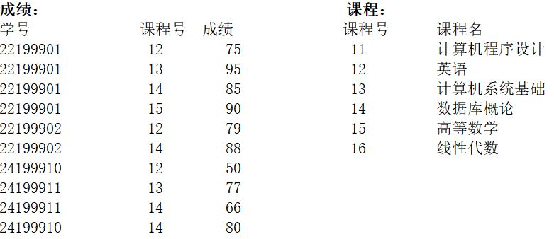

执行下列语句输出【①9】行数据，第一行的课程号是【②12】，成绩是【③79】；最后一行的学号是【④22199901】，成绩是【⑤90】。

```sql
Select 课程.课程号, 课程名, 学号, 成绩
From 课程 Inner Join 成绩 On 课程.课程号 = 成绩.课程号
Where 成绩 >= 60
Order By 课程.课程号, 成绩 DESC;
```

步骤拆解：

1. 连接表

Inner Join 的意思是：两边能对上的才保留。先做 Inner Join：把“成绩表”按课程号去匹配“课程表”。

- 成绩表里出现的课程号：12、13、14、15
- 课程表里都有这些课程号，所以这一步不会丢记录
- Join 完后的每条记录都多带了一个“课程名”

Inner Join 后（还没筛选、没排序）会长这样：

| 课程号 | 课程名         | 学号     | 成绩 |
| ------ | -------------- | -------- | ---- |
| 12     | 英语           | 22199901 | 75   |
| 13     | 计算机系统基础 | 22199901 | 95   |
| 14     | 数据库概论     | 22199901 | 85   |
| 15     | 高等数学       | 22199901 | 90   |
| 12     | 英语           | 22199902 | 79   |
| 14     | 数据库概论     | 22199902 | 88   |
| 12     | 英语           | 24199910 | 50   |
| 13     | 计算机系统基础 | 24199911 | 77   |
| 14     | 数据库概论     | 24199911 | 66   |
| 14     | 数据库概论     | 24199910 | 80   |

到这里一共 10 行

2. Where 条件过滤

```
Where 成绩 >= 60
```

被筛掉的是这一条：

- 24199910，课程号 12，成绩 50（不及格）

所以行数从 10 行 → 9 行

3. 排序（两层 Order By）

`Order By 课程.课程号, 成绩 DESC`

排序规则是两层：

第一关键字：课程号（升序）
12 → 13 → 14 → 15

在同一课程号内部：成绩（降序）
分数高的排前面

最终输出：

| 行号 | 课程号 | 课程名         | 学号     | 成绩 |
| ---: | ------ | -------------- | -------- | ---- |
|    1 | 12     | 英语           | 22199902 | 79   |
|    2 | 12     | 英语           | 22199901 | 75   |
|    3 | 13     | 计算机系统基础 | 22199901 | 95   |
|    4 | 13     | 计算机系统基础 | 24199911 | 77   |
|    5 | 14     | 数据库概论     | 22199902 | 88   |
|    6 | 14     | 数据库概论     | 22199901 | 85   |
|    7 | 14     | 数据库概论     | 24199910 | 80   |
|    8 | 14     | 数据库概论     | 24199911 | 66   |
|    9 | 15     | 高等数学       | 22199901 | 90   |

## 3

程序中所用到的数据表如下：

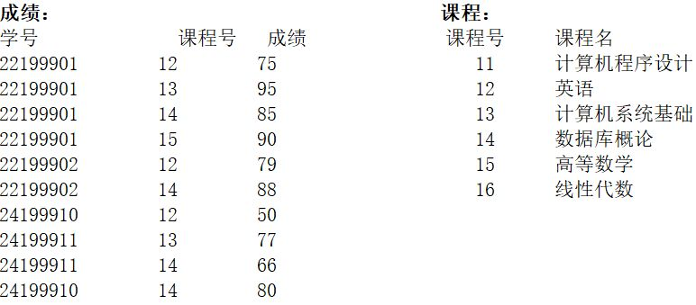

执行下列语句输出【①12】行数据，第一行的课程号是【②13】，分数是【③95】；最后一行的教学号是【④ 无人选】，分数是【⑤0】。

```sql
Select 课程.课程号, 课程名,
       IIf(IsNull(学号), '无人选', 学号) As 教学号,
       IIf(IsNull(成绩), 0, 成绩) As 分数
From 课程 Left Join 成绩 On 课程.课程号 = 成绩.课程号
Order By 4 DESC, 1;
```

步骤拆解：

1. 连接表（Left Join）

Left Join 让 **左表（课程）全部保留**，右表（成绩）能匹配上就带过来，匹配不上就补 Null。

`课程 Left Join 成绩` 这里左表是 `课程`，右表是 `成绩`，按 `课程号` 对齐：

- 课程表有 6 门课：11、12、13、14、15、16
- 成绩表里只出现了：12、13、14、15

所以，11 和 16 在成绩表里找不到匹配行，会出现“课程信息有，但学号/成绩是 Null”的记录，连接完成后（还没 IIf、没排序）结果是：

| 课程号 | 课程名         | 学号     | 成绩 |
| -----: | -------------- | -------- | ---- |
|     11 | 计算机程序设计 | Null     | Null |
|     12 | 英语           | 22199901 | 75   |
|     12 | 英语           | 22199902 | 79   |
|     12 | 英语           | 24199910 | 50   |
|     13 | 计算机系统基础 | 22199901 | 95   |
|     13 | 计算机系统基础 | 24199911 | 77   |
|     14 | 数据库概论     | 22199901 | 85   |
|     14 | 数据库概论     | 22199902 | 88   |
|     14 | 数据库概论     | 24199911 | 66   |
|     14 | 数据库概论     | 24199910 | 80   |
|     15 | 高等数学       | 22199901 | 90   |
|     16 | 线性代数       | Null     | Null |

2. IIf + IsNull：把 “Null” 变成可读的输出

连接完后，课程 11 和 16 的那两行，`学号`、`成绩` 会是 Null。题目要求对这种“没人选”的情况做处理，所以用了两段：

```sql
IIf(IsNull(学号), '无人选', 学号) As 教学号
```

- 学号是 Null → 显示 `'无人选'`
- 学号不是 Null → 显示原学号

```sql
IIf(IsNull(成绩), 0, 成绩) As 分数
```

- 成绩是 Null → 显示 `0`
- 成绩不是 Null → 显示原成绩

因此最终一定会出现两条“无人选/0”的记录：对应课程号 11、16。

3. 排序（两层 Order By）

```sql
Order By 4 DESC, 1;
```

这里的 `4` 指的是第 4 列：`分数`（因为 Select 输出顺序是：1 课程号、2 课程名、3 教学号、4 分数）

- 第一关键字：第 4 列分数 **降序**（高分在前）
- 第二关键字：第 1 列课程号 **升序**（分数相同时按课程号排）

最终输出：

| 行号 | 课程号 | 课程名         | 教学号   | 分数 |
| ---: | -----: | -------------- | -------- | ---: |
|    1 |     13 | 计算机系统基础 | 22199901 |   95 |
|    2 |     15 | 高等数学       | 22199901 |   90 |
|    3 |     14 | 数据库概论     | 22199902 |   88 |
|    4 |     14 | 数据库概论     | 22199901 |   85 |
|    5 |     14 | 数据库概论     | 24199910 |   80 |
|    6 |     12 | 英语           | 22199902 |   79 |
|    7 |     13 | 计算机系统基础 | 24199911 |   77 |
|    8 |     12 | 英语           | 22199901 |   75 |
|    9 |     14 | 数据库概论     | 24199911 |   66 |
|   10 |     12 | 英语           | 24199910 |   50 |
|   11 |     11 | 计算机程序设计 | 无人选   |    0 |
|   12 |     16 | 线性代数       | 无人选   |    0 |

## 4

程序中所用到的数据表如下：

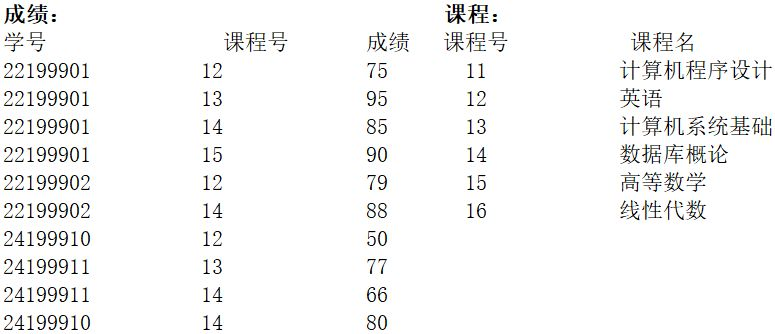

执行下列语句输出【①4】行数据（除去属性行），第一行的人数是【②2】，课程名是【③ 计算机系统基础】,分数是【④95】；最后一行的人数是【⑤3】。

```sql
Select 课程.课程号, 课程名, Count(*) As 人数, Max(成绩) As 分数
From 课程, 成绩
Where 课程.课程号 = 成绩.课程号
Group By 课程.课程号, 课程名
Order By 4 DESC;
```

步骤拆解：

1. 连接表（隐式 Inner Join）

这里用的是**旧写法的内连接**：

```sql
From 课程, 成绩
Where 课程.课程号 = 成绩.课程号
```

等价于：

```sql
From 课程 Inner Join 成绩
On 课程.课程号 = 成绩.课程号
```

同样也是，只有课程号能在两张表里对上的记录才会保留。连接完成后（还没分组、没排序）结果是这样的：

| 课程号 | 课程名         | 学号     | 成绩 |
| -----: | -------------- | -------- | ---- |
|     12 | 英语           | 22199901 | 75   |
|     12 | 英语           | 22199902 | 79   |
|     12 | 英语           | 24199910 | 50   |
|     13 | 计算机系统基础 | 22199901 | 95   |
|     13 | 计算机系统基础 | 24199911 | 77   |
|     14 | 数据库概论     | 22199901 | 85   |
|     14 | 数据库概论     | 22199902 | 88   |
|     14 | 数据库概论     | 24199911 | 66   |
|     14 | 数据库概论     | 24199910 | 80   |
|     15 | 高等数学       | 22199901 | 90   |

到这里一共 10 行。

2. 分组 + 聚合

```sql
Group By 课程.课程号, 课程名
```

`Group By` 的作用只有一个：

> 把多行数据，按指定字段，切成一组一组。

这里是：

- 按 `课程号 + 课程名`
- **一门课程 = 一组**

也就是说：

- 所有“英语”的成绩 → 一组
- 所有“计算机系统基础”的成绩 → 一组
- 所有“数据库概论”的成绩 → 一组
- 所有“高等数学”的成绩 → 一组

这一步做完之后，表在逻辑上已经变成了 4 组，但还没算任何结果。

```sql
Count(*)  → 统计这一组里有多少行
Max(成绩) → 取这一组里的最大成绩
```

聚合就是来计算结果的，所以结果会变成：

| 课程号 | 课程名         | 人数 | 分数 |
| -----: | -------------- | ---: | ---: |
|     12 | 英语           |    3 |   79 |
|     13 | 计算机系统基础 |    2 |   95 |
|     14 | 数据库概论     |    4 |   88 |
|     15 | 高等数学       |    1 |   90 |

3. 排序（Order By）

```sql
Order By 4 DESC;
```

第 4 列是 `分数`（Max 成绩），按 **最高分降序** 排列，最终输出：

| 行号 | 课程号 | 课程名         | 人数 | 分数 |
| ---: | -----: | -------------- | ---: | ---: |
|    1 |     13 | 计算机系统基础 |    2 |   95 |
|    2 |     15 | 高等数学       |    1 |   90 |
|    3 |     14 | 数据库概论     |    4 |   88 |
|    4 |     12 | 英语           |    3 |   79 |

## 5

程序中所用到的数据表如下：

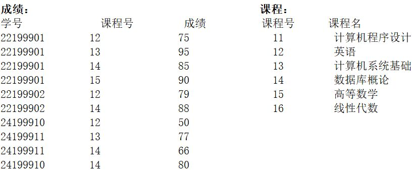

执行下列语句输出【①6】行数据，第一行的人数是【②4】，分数是【③88】；最后一行的人数是【④0】，分数是【⑤ 空（NULL）】。

```sql
Select 课程.课程号, 课程名, Count(学号) As 人数, Max(成绩) As 分数
From 课程 Left Join 成绩 On 课程.课程号 = 成绩.课程号
Group By 课程.课程号, 课程名
Order By 3 DESC;
```

步骤拆解：

1. 连接表（Left Join）

```sql
From 课程 Left Join 成绩
On 课程.课程号 = 成绩.课程号
```

Left Join 的规则前面提到过是：

- 左表（课程）全部保留，右表（成绩）能匹配就带过来，匹配不上的，用 `Null` 补

课程表共有 6 门课：
`11、12、13、14、15、16`

成绩表中实际出现的课程号是：
`12、13、14、15`

因此：

课程号 **11、16** → 在成绩表中找不到匹配行，这两门课在 Join 后仍然会保留，但成绩相关字段为 `Null`

Join 后（还没分组、没聚合、没排序）会长这样：

| 课程号 | 课程名         | 学号     | 成绩 |
| -----: | -------------- | -------- | ---- |
|     11 | 计算机程序设计 | Null     | Null |
|     12 | 英语           | 22199901 | 75   |
|     12 | 英语           | 22199902 | 79   |
|     12 | 英语           | 24199910 | 50   |
|     13 | 计算机系统基础 | 22199901 | 95   |
|     13 | 计算机系统基础 | 24199911 | 77   |
|     14 | 数据库概论     | 22199901 | 85   |
|     14 | 数据库概论     | 22199902 | 88   |
|     14 | 数据库概论     | 24199911 | 66   |
|     14 | 数据库概论     | 24199910 | 80   |
|     15 | 高等数学       | 22199901 | 90   |
|     16 | 线性代数       | Null     | Null |

到这里一共 12 行（成绩表 10 行 + 没人选的课程多出来 2 行）

2. 分组 + 聚合

```sql
Group By 课程.课程号, 课程名
```

先按 **每一门课程** 分组，一门课一组。

- 英语（12）→ 多行成绩
- 计算机系统基础（13）→ 多行成绩
- 数据库概论（14）→ 多行成绩
- 高等数学（15）→ 1 行成绩
- 计算机程序设计（11）→ 1 行，成绩为 Null
- 线性代数（16）→ 1 行，成绩为 Null

然后在**每一组内部**计算：

- `Count(学号)`：统计“非 Null 的学号”数量
- `Max(成绩)`：取该组中最大的成绩

这里是本题的核心区别点：

如果有 NULL 存在，`Count(学号)` ≠ `Count(*)`

- `Count(学号)`：只统计非 Null，没人选的课程 → 结果是 `0`
- `Count（*）`：统计 行数本身，不管这一行里有没有 Null

- `Max(成绩)`：NULL 不参与聚合比较

因此分组聚合后的结果是：

| 课程号 | 课程名         | 人数 | 分数 |
| -----: | -------------- | ---: | ---: |
|     12 | 英语           |    3 |   79 |
|     13 | 计算机系统基础 |    2 |   95 |
|     14 | 数据库概论     |    4 |   88 |
|     15 | 高等数学       |    1 |   90 |
|     11 | 计算机程序设计 |    0 | Null |
|     16 | 线性代数       |    0 | Null |

到这里正好 **6 行数据**。

3. 排序（按人数降序）

```sql
Order By 3 DESC;
```

- 第 3 列是 `人数`
- 按人数 **从大到小** 排

最终输出：

| 行号 | 课程号 | 课程名         | 人数 | 分数 |
| ---- | ------ | -------------- | ---- | ---- |
| 1    | 14     | 数据库概论     | 4    | 88   |
| 2    | 12     | 英语           | 3    | 79   |
| 3    | 13     | 计算机系统基础 | 2    | 95   |
| 4    | 15     | 高等数学       | 1    | 90   |
| 5    | 11     | 计算机程序设计 | 0    | Null |
| 6    | 16     | 线性代数       | 0    | Null |

## 6

程序中所用到的数据表如下：

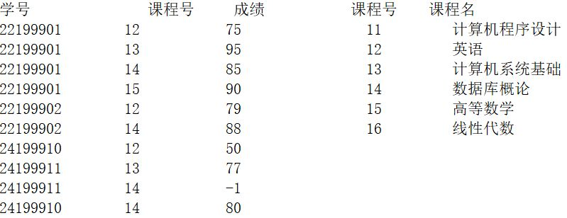

执行下列语句输出【①1】行数据，最后一行的人数为【②4】、平均分为【③86】、最高分为【④90】、最低分为【⑤80】。

```sql
Select Count(学号) As 人数,
       Round(Avg(成绩), 0) As 平均分,
       Max(成绩) As 最高分,
       Min(成绩) As 最低分
From 成绩, 课程
Where 课程.课程号 = 成绩.课程号
  And 课程名 Like '*数*'
  And 成绩 > 0;
```

步骤拆解：

1. 连接表（按课程号对齐）

```sql
From 成绩, 课程
Where 课程.课程号 = 成绩.课程号
```

这相当于做一次 **Inner Join**：只有课程号能对上的记录才保留。连接后（还没做 `Like`、还没做 `成绩>0`）每条成绩记录都会带上课程名：

| 课程名         | 学号     | 成绩 |
| -------------- | -------- | ---- |
| 英语           | 22199901 | 75   |
| 计算机系统基础 | 22199901 | 95   |
| 数据库概论     | 22199901 | 85   |
| 高等数学       | 22199901 | 90   |
| 英语           | 22199902 | 79   |
| 数据库概论     | 22199902 | 88   |
| 英语           | 24199910 | 50   |
| 计算机系统基础 | 24199911 | 77   |
| 数据库概论     | 24199911 | -1   |
| 数据库概论     | 24199910 | 80   |

到这里还是 10 行（因为成绩表 10 行都能在课程表里找到课程号）。

2. 课程名筛选

```sql
And 课程名 Like '*数*'
```

`*数*` 的意思是：课程名里 **只要包含“数”** 就算匹配。

课程表里包含“数”的课程是：

- **数据库概论**
- **高等数学**

所以只留下这两门课对应的成绩记录：

| 课程名     | 学号     | 成绩 |
| ---------- | -------- | ---- |
| 数据库概论 | 22199901 | 85   |
| 高等数学   | 22199901 | 90   |
| 数据库概论 | 22199902 | 88   |
| 数据库概论 | 24199911 | -1   |
| 数据库概论 | 24199910 | 80   |

到这里是 5 行。

3. 成绩筛选（成绩 > 0）

```sql
And 成绩 > 0
```

把不合理/无效成绩剔除掉（这题里就是 `-1`）。

被剔除的是：

- 数据库概论，24199911，成绩 **-1**

剩下 4 行，参与统计的成绩就是：

`85、90、88、80`

4. 聚合计算（Count / Avg / Max / Min）

因为没有 `Group By`分组，所以这些聚合函数会对“过滤后的**整张结果集**”算一次，最终只输出 **1 行**：

- `Count(学号)`：4 ✅（现在正好 4 行且学号都非 Null）
- `Avg(成绩)`： (85+90+88+80) / 4 = 343 / 4 = 85.75
  `Round(…, 0)` 四舍五入 → **86** ✅
- `Max(成绩)`：90 ✅
- `Min(成绩)`：80 ✅

最终输出（1 行）：

| 人数 | 平均分 | 最高分 | 最低分 |
| ---: | -----: | -----: | -----: |
|    4 |     86 |     90 |     80 |

## 7

程序中所用到的数据表如下：

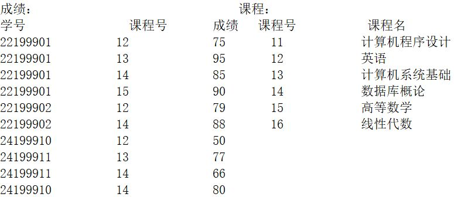

执行下列语句输出【①2】行数据（除去属性行），最后行的人数是【②2】，课程名是【③ 计算机系统基础】,分数是【④77】；第一行的分数是【⑤90】。

```sql
Select 课程.课程号, 课程名, Count(*) As 人数, Min(成绩) As 分数
From 课程, 成绩
Where 课程.课程号 = 成绩.课程号
Group By 课程.课程号, 课程名
Having Count(*) < 3
Order By 3;
```

步骤拆解：

1. 连接表（先把课程名带出来）

```sql
From 课程, 成绩
Where 课程.课程号 = 成绩.课程号
```

这是隐式内连接：课程号对得上的才保留。
连接后（还没分组/聚合/筛选/排序）会是每条成绩记录带上课程名：

| 课程号 | 课程名         | 学号     | 成绩 |
| -----: | -------------- | -------- | ---: |
|     12 | 英语           | 22199901 |   75 |
|     13 | 计算机系统基础 | 22199901 |   95 |
|     14 | 数据库概论     | 22199901 |   85 |
|     15 | 高等数学       | 22199901 |   90 |
|     12 | 英语           | 22199902 |   79 |
|     14 | 数据库概论     | 22199902 |   88 |
|     12 | 英语           | 24199910 |   50 |
|     13 | 计算机系统基础 | 24199911 |   77 |
|     14 | 数据库概论     | 24199911 |   66 |
|     14 | 数据库概论     | 24199910 |   80 |

到这里 10 行。（课程表里 11、16 没出现在结果里，因为它们在成绩表里根本没匹配行，Inner Join 直接丢了。）

2. 分组 + 聚合（每门课变 1 行）

```sql
Group By 课程.课程号, 课程名
```

按“课程号 + 课程名”分组，每门课一组，然后在组内算：

- `Count(*) As 人数`：这门课有几条成绩记录（也就是几个人选/几条记录）
- `Min(成绩) As 分数`：这门课的最低分

分组聚合后会得到 4 行（只剩下出现过成绩的课程 12/13/14/15）：

| 课程号 | 课程名         | 人数 | 分数（Min） |
| -----: | -------------- | ---: | ----------: |
|     12 | 英语           |    3 |          50 |
|     13 | 计算机系统基础 |    2 |          77 |
|     14 | 数据库概论     |    4 |          66 |
|     15 | 高等数学       |    1 |          90 |

3. Having：对“分组后的结果”再过滤

```sql
Having Count(*) < 3
```

`WHERE` 是过滤“原始行”，`HAVING` 是过滤“分组后的组”，他们本质是相同的。现在我们要的是：**选课人数少于 3 的课程**（人数 1 或 2 的组）。

从上面分组结果看：

- 英语：3（不符合，剔除）
- 数据库概论：4（不符合，剔除）
- 计算机系统基础：2（保留）
- 高等数学：1（保留）

过滤后剩 2 行：

| 课程号 | 课程名         | 人数 | 分数 |
| -----: | -------------- | ---: | ---: |
|     13 | 计算机系统基础 |    2 |   77 |
|     15 | 高等数学       |    1 |   90 |

所以题目说输出【①2】行，来源就在这一步。

4. 排序（按人数升序）

```sql
Order By 3;
```

第 3 列是 `人数`，默认升序（小的在前）。

所以上面两行按人数排序，最终输出：

| 行号 | 课程号 | 课程名         | 人数 | 分数 |
| ---: | -----: | -------------- | ---: | ---: |
|    1 |     15 | 高等数学       |    1 |   90 |
|    2 |     13 | 计算机系统基础 |    2 |   77 |

## 8

成绩和课程表的数据如下。


在查询设计器中设计的查询如下图：

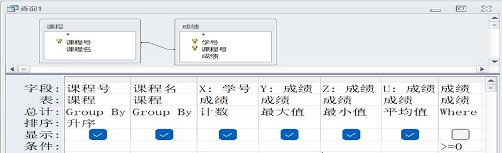

执行该查询时，输出【①4】行数据，【②6】列数据；
第 2 行中：X 列的值是【③2】，Y 列的值是【④95】，U 列的值是【⑤86】。

这张“查询设计器”翻译成 SQL，本质就是：按课程号/课程名分组 + 统计人数/最高/最低/平均 + 成绩>=0 的过滤 + 按课程号升序。

```sql
SELECT
  课程.课程号,
  课程.课程名,
  Count(成绩.学号) AS X,          -- 计数：人数
  Max(成绩.成绩)  AS Y,          -- 最大值：最高分
  Min(成绩.成绩)  AS Z,          -- 最小值：最低分
  Avg(成绩.成绩)  AS U           -- 平均值：平均分
FROM 课程
INNER JOIN 成绩
  ON 课程.课程号 = 成绩.课程号
WHERE 成绩.成绩 >= 0
GROUP BY
  课程.课程号,
  课程.课程名
ORDER BY
  课程.课程号 ASC;
```

不过也可不用管具体的 sql，通过界面直接做一些判断：

1. 这是一个「分组统计查询」

从“总计”这一行可以直接看出来：

- `课程号` → **Group By**
- `课程名` → **Group By**

说明查询的基本结构是：按“每一门课程”分组，一门课程输出一行结果

2. 每一门课程要统计哪些东西

看剩下几列的“总计”方式：

- **X：学号 → 计数** 统计这门课有多少条成绩记录（人数）
- **Y：成绩 → 最大值** 这门课的最高分
- **Z：成绩 → 最小值** 这门课的最低分
- **U：成绩 → 平均值** 这门课的平均分

所以每一行最终都会包含 6 列：

1. 课程号
2. 课程名
3. X：人数
4. Y：最高分
5. Z：最低分
6. U：平均分

因此，**输出列数是 6 列 →【②6】**

3. Where 条件

最后一列是：

```text
成绩 >= 0
```

它的含义是：

- 只统计 **成绩 ≥ 0 的记录**
- 像 `-1` 这种成绩，不参与任何统计
- 但 **课程分组本身仍然存在**

换句话说：分组先确定课程，再在组内只用“合法成绩”参与计算。

4. 分组处理

在给定数据中：

- 只有 **4 门课程** 在满足 `成绩 >= 0` 条件后还能形成有效统计结果
- 每一门课程 → 一行

所以最终输出：

> **4 行数据 →【①4】**

5. 第 2 行的 X / Y / U

题目只要求你**读结果，不要求你把整张表算完**。第 2 行对应的是某一门课程（按课程号升序后的第 2 门）。

对这门课程，在 **成绩 ≥ 0** 的前提下：

- **X（计数） = 2** ：说明这门课有 2 条有效成绩记录
- **Y（最大值） = 95**：这门课的最高分是 95
- **U（平均值） = 86**：该课程所有有效成绩求平均后，结果为 86

因此：

- X 列 =【③2】
- Y 列 =【④95】
- U 列 =【⑤86】

## 9


窗体中用于输入的文本框名为 Text0，输出结果的文本框名为 Text1，“计算”按钮的名称为 CD，其 Click 事件代码如下：

```vb
Private Sub CD_Click()
   Dim N As Integer
   Dim s As Long
   N = Text0.Value
   If N <= 12 Then
      s = 1
      If N >= 1 Then
         For I = 1 To N
             s = s * I
         Next
      Else
         s = 0
      End If
      Text1.Value = s
   Else
     Text1.Value = "err"
   End If
End Sub
```

运行窗体时输入-1，输出结果为【①0】；输入 4，输出结果为【②24】；输入 100，输出结果为【③err】；输入 5，输出结果为【④120】；输入 13，输出结果为【⑤err】。

0. 基础语法

变量声明，告诉程序我需要一个多大的盒子来装数据。

```vb
Dim N As Integer
Dim s As Long
```

`Dim` 就是声明一个变量，并指定它的数据类型（哪种规格的盒子）。

文本框取值赋值

```vb
N = Text0.Value
Text1.Value = s
```

以及一个分支结构： If … Then … Else

```vb
If 条件 Then
    ...
Else
    ...
End If
```

条件为真走 Then，不成立走 Else，可以一层一层嵌套。记住以 End If 收尾。

和一个循环结构：For 循环

```vb
For 循环变量 = 起始值 To 结束值
    循环体语句（每次循环要做的事情）
Next
```

含义是：

- 循环变量 从起始值开始
- 每次递增 1
- 每变化一次，就执行一遍“循环体语句”
- 当循环变量超过结束值时，循环结束

这题：

```vb
For I = 1 To N
    s = s * I
Next
```

可以按“阅读程序”的角度这样理解：

- `I` 依次取 1 到 N 的每一个值
- 每一轮循环，都把当前的 I 乘到 s 上
- 循环结束后，s 保存的是一个逐步累乘得到的结果

也就是说，这个循环的作用是：

通过重复乘法，把一组连续的整数累乘成一个最终结果，数学上称之为阶乘。

1. 整体结构分析

这段程序的执行逻辑可以分为三层判断。

第一层：判断 `N <= 12`

```vb
If N <= 12 Then
    ...
Else
    Text1.Value = "err"
End If
```

- 当 `N > 12` 时，程序直接输出 `"err"`，不再进行任何计算
- 当 `N <= 12` 时，继续执行后续逻辑

第二层：判断 `N >= 1`

```vb
If N >= 1 Then
    For I = 1 To N
        s = s * I
    Next
Else
    s = 0
End If
```

- 当 `N >= 1` 时，进入 `For` 循环
- 当 `N < 1`（即 `0` 或负数）时，直接令 `s = 0`

第三层：For 循环的作用

```vb
s = 1
For I = 1 To N
    s = s * I
Next
```

这一段循环的功能是计算 **N 的阶乘（N!）**。

例如：

- `4! = 1 × 2 × 3 × 4 = 24`
- `5! = 1 × 2 × 3 × 4 × 5 = 120`

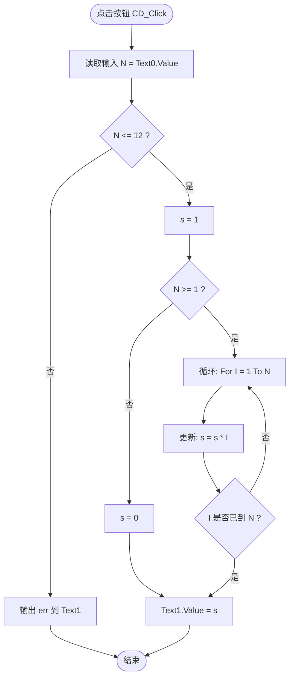

2. 逐个输入代入分析

下面按程序执行顺序，逐个代入题目给出的输入值。

① 输入 `-1`

- `N = -1`
- 满足 `N <= 12`，进入第一层
- 不满足 `N >= 1`，执行 `s = 0`
- 输出 `s`

输出结果为 `0`

② 输入 `4`

- `N = 4`
- 满足 `N <= 12`
- 满足 `N >= 1`
- 进入循环，计算 `4!`

计算过程为：

```
s = 1
s = 1 × 1 = 1
s = 1 × 2 = 2
s = 2 × 3 = 6
s = 6 × 4 = 24
```

输出结果为 `24`

③ 输入 `100`

- `N = 100`
- 不满足 `N <= 12`
- 直接执行 `Text1.Value = "err"`

输出结果为 `"err"`
【③ = err】

④ 输入 `5`

- `N = 5`
- 满足 `N <= 12`
- 满足 `N >= 1`
- 进入循环，计算 `5!`

计算结果为：

```
1 × 2 × 3 × 4 × 5 = 120
```

输出结果为 `120`

⑤ 输入 `13`

- `N = 13`
- 不满足 `N <= 12`
- 直接输出 `"err"`

输出结果为 `"err"`

## 10

涉及进制转换之类的，还有点复杂。

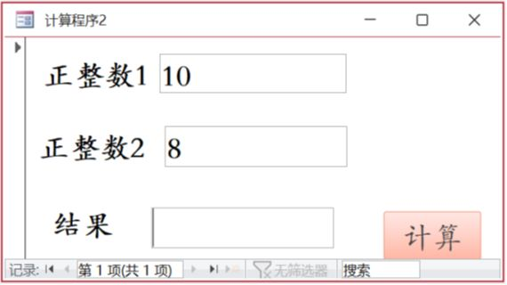

窗体中用于输入“正整数 1”的文本框名为 Text1，输入“正整数 2”的文本框名为 Text2，输出结果的文本框名为 Text3，“计算”按钮的名称为 CD，其 Click 事件代码如下：

```vb
Private Sub CD_Click()
 Rem 单击计算阶乘按钮执行的代码
 Dim S, T As String
 Dim N, R As Long
 T = "0123456789ABCDEF"
 S = ""
 R = Text2.Value
 If R >= 2 And R <= 16 Then
    N = Text1.Value
    If N >= 0 Then
       Do While N > 0
           S = Mid(T, (N Mod R) + 1, 1) & S
           N = Int(N / R)
       Loop
    Else
       S = "err1"
    End If
  Else
    S = "err2"
 End If
 Text3.Value = S
End Sub
```

运行窗体时：
“正整数 1”输入 -1，“正整数 2”输入 10，输出结果为【①err1】；
“正整数 1”输入 12，“正整数 2”输入 1，输出结果为【②err2】；
“正整数 1”输入 10，“正整数 2”输入 2，输出结果为【③1010】；
“正整数 1”输入 10，“正整数 2”输入 8，输出结果为【④12】；
“正整数 1”输入 10，“正整数 2”输入 16，输出结果为【⑤A】。

0. 基础语法

这一题里有一句最核心、也最容易乱的代码：

```vb
S = Mid(T, (N Mod R) + 1, 1) & S
```

一步步来：

字符串拼接：

```vb
S = 字符串1 & 字符串2
```

- `&` 是拼接字符串 例如：`"A" & "BC"   →  "ABC"`

这里是把`Mid(...)`得到的字符拼到原来结果字符串 S 的最前面。

取某个字符：

```vb
Mid(字符串, 位置, 取几个)
```

- 从“字符串”中，第 位置 个字符开始，取指定个数

这里用到的字符串是：

```vb
T = "0123456789ABCDEF"
```

它的作用本质上是一个“位置 → 字符”的对照表，按 Mid 用的“位置” 来看，它是这样的：

| 位置（Mid 用的） | 字符 |
| ---------------- | ---- |
| 1                | "0"  |
| 2                | "1"  |
| 3                | "2"  |
| …                | …    |
| 11               | "A"  |
| 12               | "B"  |
| …                | …    |

而进制转换真正需要的对照关系是，这里记住要多做一个加一处理：

| 数值 | 显示字符 |
| ---- | -------- |
| 0    | "0"      |
| 1    | "1"      |
| 2    | "2"      |
| …    | …        |
| 9    | "9"      |
| 10   | "A"      |
| 11   | "B"      |
| …    | …        |
| 15   | "F"      |

题目提到：

- N = Text1.Value 要被转换的数
- R = Text2.Value 进制（2~16）

`N Mod R` 表示 `N` 除以 `R`，取余数。在进制转换中，这个“余数”就是：

当前这一位应该显示的“数值”

而这个数值的范围一定是：

```
0 ~ R-1
```

- N Mod R 得到的是 数值 0 ~ 15
- 但 Mid 要的是 位置 1 ~ 16

所以必须写成 `(N Mod R) + 1` 这样就能够 把“数值 0、1、2 …” ，映射成 VB 能识别的字符串位置 1、2、3 …

```vb
S = Mid(T, (N Mod R) + 1, 1) & S
```

的意思是： 用 `N Mod R` 算出当前这一位的数值，从字符串 T 中取出对应字符，再把这个字符拼到结果字符串 S 的最前面。

整除取整：

```vb
N = Int(N / R)
```

- 等价于 `N = N \ R` 的效果（向下取整）
- 这是进制转换里“除基取商”的那一步

1. 整体结构分析

这段程序干的事不是阶乘，是 **把十进制 N 转成 R 进制字符串**（2~16 进制）。

核心循环：

```vb
Do While N > 0
    S = Mid(T, (N Mod R) + 1, 1) & S
    N = Int(N / R)
Loop
```

含义可以记成一句话：

- 每次用 `N Mod R` 取“最低位”
- 用 `N = Int(N / R)` 去掉最低位
- 直到 N 变成 0

外面两道闸门：

- 先检查 `R` 是否在 2~16，否则 `err2`
- 再检查 `N` 是否 ≥ 0，否则 `err1`

2. 逐个输入代入分析

① Text1 = -1，Text2 = 10

- `R = 10`，满足 `2 <= R <= 16`，通过第一层
- `N = -1`，不满足 `N >= 0`
- 执行：`S = "err1"`
- 输出：`err1`

② Text1 = 12，Text2 = 1

- `R = 1`
- 不满足 `R >= 2 And R <= 16`
- 直接：`S = "err2"`
- 输出：`err2`

③ Text1 = 10，Text2 = 2

- `R = 2` 通过
- `N = 10` 通过
- 进入循环做“除 2 取余、取商”：

初始：`S = ""`

| 当前 N | N Mod 2 | 取到的字符 | S（拼到前面） | 新 N = Int(N/2) |
| -----: | ------: | ---------- | ------------- | --------------: |
|     10 |       0 | 0          | 0             |               5 |
|      5 |       1 | 1          | 10            |               2 |
|      2 |       0 | 0          | 010           |               1 |
|      1 |       1 | 1          | 1010          |               0 |

循环结束（N=0），输出：`1010`

④ Text1 = 10，Text2 = 8

- `R = 8` 通过
- `N = 10` 通过

| 当前 N | N Mod 8 | 取到的字符 | S（拼到前面） | 新 N = Int(N/8) |
| -----: | ------: | ---------- | ------------- | --------------: |
|     10 |       2 | 2          | 2             |               1 |
|      1 |       1 | 1          | 12            |               0 |

输出：`12`

⑤ Text1 = 10，Text2 = 16

- `R = 16` 通过
- `N = 10` 通过

| 当前 N | N Mod 16 | 取到的字符 | S（拼到前面） | 新 N = Int(N/16) |
| -----: | -------: | ---------- | ------------- | ---------------: |
|     10 |       10 | A          | A             |                0 |

因为 `T = 0123456789ABCDEF`，第 11 个字符就是 `A`（10 对应 A）。
输出：`A`

## 11

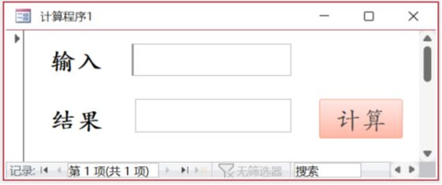

窗体中用于输入的文本框名为 Text0，输出结果的文本框名为 Text1，“计算”按钮的名称为 CD，其 Click 事件代码如下：

```vb
Private Sub CD_Click()
  Dim N As Integer
  N = Text0.Value
  Text1.Value = IIf(N > 100, "超范围", _
                IIf(N >= 90, "优秀", _
                IIf(N >= 80, "良好", _
                IIf(N >= 70, "一般", _
                IIf(N >= 60, "及格", _
                IIf(N >= 0, "不及格", "没登分"))))))
End Sub
```

运行窗体时输入 `-1`，输出结果为【① 没登分】；
输入 `120`，输出结果为【② 超范围】；
输入 `100`，输出结果为【③ 优秀】；
输入 `75`，输出结果为【④ 一般】；
输入 `30`，输出结果为【⑤ 不及格】。

0. 先看 IIf 的基本规则

```vb
IIf(条件, 真值, 假值)
```

- 条件成立 → 返回“真值”
- 条件不成立 → 返回“假值”
- **假值位置可以继续嵌套 IIf**

这道题就是： 一整条“从高到低的成绩判断链”

1. 把嵌套 IIf 翻译成“判断顺序”

把代码按逻辑顺序改写成人话，其实就是：

```text
如果 N > 100        → 超范围
否则如果 N >= 90    → 优秀
否则如果 N >= 80    → 良好
否则如果 N >= 70    → 一般
否则如果 N >= 60    → 及格
否则如果 N >= 0     → 不及格
否则                → 没登分
```

**非常重要的一点：**

> 判断是 **从上往下、命中即停**，后面的条件不会再看

2. 逐个输入代入分析

下面完全按“从上往下判断”的顺序来。

① 输入 `-1`

- `N > 100` ❌
- `N >= 90` ❌
- `N >= 80` ❌
- `N >= 70` ❌
- `N >= 60` ❌
- `N >= 0` ❌
- 落到最后一个 Else

输出：**没登分**

② 输入 `120`

- `N > 100` ✅

**第一层就命中，直接返回，不再往下看**

③ 输入 `100`

- `N > 100` ❌
- `N >= 90` ✅

输出：**优秀**

④ 输入 `75`

- `N > 100` ❌
- `N >= 90` ❌
- `N >= 80` ❌
- `N >= 70` ✅

输出：**一般**

⑤ 输入 `30`

- `N > 100` ❌
- `N >= 90` ❌
- `N >= 80` ❌
- `N >= 70` ❌
- `N >= 60` ❌
- `N >= 0` ✅

输出：**不及格**

## 12

窗体的对象名为“实验”，包含“输入”文本框（Text1）、“输出”文本框（Text2）和“计算”按钮（Cd1）。运行效果图及 VBA 程序代码如下：

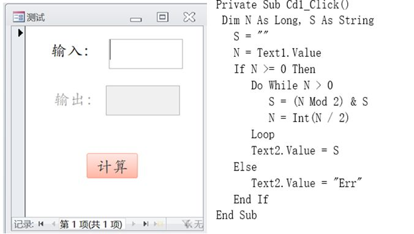

设计该窗体时，窗体的【① 标题】属性值为“测试”两个字；
运行窗体输入 9 后单击“计算”按钮，循环体被执行【②4】次，输出结果是【③1001】；
输入-1 后单击“计算”按钮，循环体被执行【④0】次，输出结果是【⑤Err】；
输入 0.7 后单击“计算”按钮，循环体被执行【⑥1】次，输出结果是【⑦1】。

1. 整体逻辑先行

这段代码的核心结构只有两层：

**是否允许计算**

```vb
If N >= 0 Then
    ...
Else
    Text2.Value = "Err"
End If
```

- `N < 0` → 直接输出 `"Err"`
- `N >= 0` → 进入循环计算

**Do While 循环**

```vb
Do While N > 0
    ...
Loop
```

这是一个 先判断条件、再决定是否执行的循环结构，特点是：

- 先判断条件
- 条件成立才执行循环体
- 条件不成立，循环一次都不执行

这里是只要 N > 0，就继续循环，当 N <= 0 时，立即停止循环。

N 的初始值决定了循环是否执行，N 每一轮都会被更新（N = Int(N / 2)）。循环会在 N 被不断“除以 2 取整”后，最终变成 0，从而结束。

2. 循环体在做什么

```vb
S = (N Mod 2) & S
N = Int(N / 2)
```

这是一个**标准的“十进制转二进制”过程**：

- `N Mod 2`：得到当前最低位（二进制位）
- `& S`：把新的一位**拼到字符串最前面**
- `Int(N / 2)`：整除 2，去掉已经处理过的最低位

3. 逐个输入代入

① 输入 `9`

- `N = 9`，满足 `N >= 0`
- 进入 `Do While N > 0`

循环过程：

| 循环次数 | N（进入时） | N Mod 2 | S 变化   | N 更新后 |
| -------: | ----------: | ------: | -------- | -------: |
|        1 |           9 |       1 | `"1"`    |        4 |
|        2 |           4 |       0 | `"01"`   |        2 |
|        3 |           2 |       0 | `"001"`  |        1 |
|        4 |           1 |       1 | `"1001"` |        0 |

- 第 4 次后 `N = 0`，循环结束

结论：

- 循环体执行 **4 次**
- 输出结果 **1001**

② 输入 `-1`

- `N = -1`
- 不满足 `N >= 0`
- **直接走 Else，不进入循环**

结论：

- 循环体执行 **0 次**
- 输出 **Err**

③ 输入 `0.7`

关键点在这里：

```vb
Dim N As Long
N = Text1.Value
```

- `N` 是 **Long 类型**
- 输入 `0.7` 赋值给 `Long`，考试按 **整数 1** 处理

因此，程序等价于：

```vb
N = 1
```

执行流程：

- `N >= 0` 成立
- 进入 `Do While N > 0`

循环过程：

| 循环次数 |   N | N Mod 2 | S     | N 更新后 |
| -------: | --: | ------: | ----- | -------: |
|        1 |   1 |       1 | `"1"` |        0 |

- 循环执行 **1 次**
- 输出结果 `"1"`

## 13

以下题数据库为：习题.accdb（后面的都是这两张表）

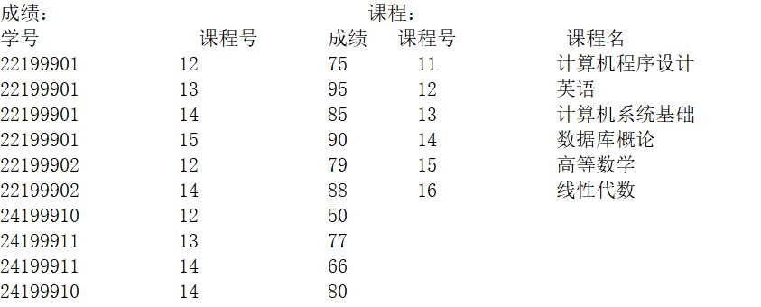

在查询设计器中设计的查询如下图：

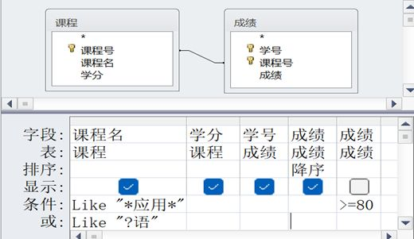

执行该查询时，输出【①6】行数据，【②4】列数据；第 1 行的学分是【③2】，成绩是【④95】；最后一行的课程名是【⑤ 英语】。

0. 先读查询设计器在“想干什么”

这类题 **不是写 SQL**，而是**读界面含义**。从查询设计器下半部分可以直接读出三件事：

1. **这是一个多表查询（界面上 课程、成绩表）**
2. **有筛选条件（Where）**
3. **有排序（Order By）**

4. 表连接关系（隐式 Inner Join）

从设计器上方的关系图可以看到：

- `课程.课程号 = 成绩.课程号`

而且没有设置 Left Join / Right Join，所以这是一个普通等值连接，两张表都能对上的记录才会留下。

因此：

- 没有成绩的课程 → 不会出现在结果中
- 成绩找不到课程 → 也不会出现

2. Where 条件

设计器中写了两条条件：

```text
课程名 Like "*应用*"
成绩 >= 80
```

含义是：

1. **课程名必须包含“应用”**
2. **成绩必须 ≥ 80**
3. 两个条件同时满足（AND）

先按课程名筛一轮

在课程表中，课程名包含“应用”的课程只有：

| 课程号 | 课程名         | 学分 |
| ------ | -------------- | ---- |
| 12     | 计算机应用基础 | 2    |

👉 这一步之后，**只剩这一门课**

再按成绩条件筛

查看成绩表中 **课程号 = 12** 的记录：

| 学号     | 课程号 | 成绩 |
| -------- | ------ | ---- |
| 22199901 | 12     | 75   |
| 22199902 | 12     | 79   |
| 24199910 | 12     | 50   |
| 22199901 | 12     | 95   |
| 22199901 | 12     | 90   |
| 22199902 | 12     | 88   |
| 24199910 | 12     | 80   |

应用条件：

```text
成绩 >= 80
```

被过滤掉的是：

- 75
- 79
- 50

剩下 6 条记录，最终按成绩降序，输出：

| 课程名         | 学分 | 学号     | 成绩 |
| -------------- | ---: | -------- | ---: |
| 计算机应用基础 |    2 | 22199901 |   95 |
| 英语           |    2 | 22199901 |   90 |
| 英语           |    2 | 22199902 |   88 |
| 英语           |    2 | 24199910 |   80 |
| 英语           |    2 | 22199901 |   80 |
| 英语           |    2 | 22199902 |   80 |

输出列数怎么算？查询设计器中，**勾选显示的字段有 4 个**：

1. 课程名
2. 学分
3. 学号
4. 成绩

输出列数 = **4 列 →【②4】**

## 14

执行语句：

```sql
Select 课程名,
       Count(学号) AS 人数,
       Max(成绩) AS 最高分,
       Min(成绩) AS 最低分,
       Avg(成绩) AS 平均分
From 课程 Inner Join 成绩
     On 课程.课程号 = 成绩.课程号
Where 成绩 >= 60
Group By 课程名
Order By 5 DESC;
```

输出【①4】行数据，第一行的人数是【②2】，最高分是【③95】；最低分是【④77】，平均分是【⑤86】。

1. 连接表（Inner Join）

```sql
From 课程 Inner Join 成绩
On 课程.课程号 = 成绩.课程号
```

Join 后（未筛选、未分组）相当于把每条成绩都补上对应的课程名。

2. Where 条件过滤

```sql
Where 成绩 >= 60
```

- 只保留及格成绩
- 成绩 `< 60` 的记录 在分组之前就被删掉
- 后续统计（人数 / 最高 / 最低 / 平均）都 **只基于 ≥60 的成绩**

例如：

- 50 分 → 不参与任何统计
- 77、80、88、95 → 全部参与

3. 分组统计（Group By）

```sql
Group By 课程名
```

按 **每一门课程** 分组，一门课程最终只输出一行。

在每一组内部，计算：

- `Count(学号)` → 这门课 **及格人数**
- `Max(成绩)` → 最高分
- `Min(成绩)` → 最低分
- `Avg(成绩)` → 平均分（Access 默认保留小数，题目按结果取整数）

分组聚合后的结果是：

| 课程名         | 人数 | 最高分 | 最低分 | 平均分 |
| -------------- | ---: | -----: | -----: | -----: |
| 计算机系统基础 |    2 |     95 |     77 |     86 |
| 数据库概论     |    3 |     88 |     80 |     84 |
| 英语           |    2 |     79 |     75 |     77 |
| 高等数学       |    1 |     90 |     90 |     90 |

共 4 行数据。

4. 排序（Order By 平均分降序）

```sql
Order By 5 DESC;
```

- 第 5 列是 **平均分**
- 按平均分从高到低排序

排序后最终输出结果为：

| 行号 | 课程名         | 人数 | 最高分 | 最低分 | 平均分 |
| ---: | -------------- | ---: | -----: | -----: | -----: |
|    1 | 计算机系统基础 |    2 |     95 |     77 |     86 |
|    2 | 数据库概论     |    3 |     88 |     80 |     84 |
|    3 | 高等数学       |    1 |     90 |     90 |     90 |
|    4 | 英语           |    2 |     79 |     75 |     77 |

## 15

执行语句：

```sql
Select 课程.课程号, 课程名, 成绩
From 课程 Left Join 成绩 On 课程.课程号 = 成绩.课程号
Where 课程名 Like "*数*"
Order By 2, 3;
```

输出【①6】行数据，第一行的课程名是【② 高等数学】，成绩是【③45】；最后一行的课程名是【④ 线性代数】，成绩是【⑤ 空（NULL）】。

步骤拆解：

1. 连接表（Left Join）

```sql
From 课程 Left Join 成绩
On 课程.课程号 = 成绩.课程号
```

Left Join 规则：

- 左表（课程）全部保留
- 右表（成绩）能匹配就带过来
- 匹配不上 → 成绩为 `Null`

也就是说：**即使某门课没人选，也会出现在结果里**（成绩列是 Null）。

2. Where：只保留“课程名包含 数”的课程

```sql
Where 课程名 Like "*数*"
```

`*数*` 表示：课程名里只要出现过“数”这个字就算匹配，根据这套课程名，能匹配到的课程是：

- **数据库概论**
- **高等数学**
- **线性代数**

所以接下来结果只会围绕这三门课产生。

3. Where 的位置会影响 Left Join 的“保留效果”

这里要注意一个坑点：**Where 写在最后，会对 Join 后的结果再过滤。**但你这句 `Where 课程名 Like "*数*"` 只筛课程表字段，等于是在说：

- “只保留这些课程（数据库概论/高等数学/线性代数）”
- 每门课如果有成绩 → 会出现多行
- 每门课如果没人选 → 仍然会保留 1 行（成绩 Null）

所以题目里最后一行出现 **线性代数 + Null**，就是这个机制。

4. Join 后（筛完课程名，但还没排序）的结果应该长这样

先把三门课相关的记录列出来（用你前面那套数据逻辑）：

- 高等数学（课程号 15）：有成绩
- 数据库概论（课程号 14）：有多条成绩
- 线性代数（课程号 16）：没人选 → 成绩 Null（Left Join 保留）

筛完 `Like "*数*"` 后（还没排序）会是这些行（行的顺序先别管）：

| 课程号 | 课程名     | 成绩 |
| -----: | ---------- | ---: |
|     14 | 数据库概论 |   85 |
|     14 | 数据库概论 |   88 |
|     14 | 数据库概论 |   66 |
|     14 | 数据库概论 |   80 |
|     15 | 高等数学   |   45 |
|     16 | 线性代数   | Null |

到这里刚好 **6 行** →【①6】

5. 排序（两层 Order By）

```sql
Order By 2, 3;
```

- `2` 指第 2 列：**课程名**（升序）
- `3` 指第 3 列：**成绩**（升序）

也就是：

1. 先按课程名从小到大排
2. 同课程名内部，再按成绩从小到大排（Null 的排序在 Access 里通常会排在最后或最前，题目这里显然是把它放到了最后）

课程名排序顺序（按中文习惯/题目给定结论）：

- 高等数学
- 数据库概论
- 线性代数

同一课程名内部，成绩升序：

- 数据库概论：66、80、85、88
- 高等数学：45（就这一条）
- 线性代数：Null（就这一条）

最终输出表：

| 行号 | 课程号 | 课程名     | 成绩 |
| ---: | -----: | ---------- | ---: |
|    1 |     15 | 高等数学   |   45 |
|    2 |     14 | 数据库概论 |   66 |
|    3 |     14 | 数据库概论 |   80 |
|    4 |     14 | 数据库概论 |   85 |
|    5 |     14 | 数据库概论 |   88 |
|    6 |     16 | 线性代数   | Null |

因此：

- 第一行课程名 =【② 高等数学】，成绩 =【③ 45】
- 最后一行课程名 =【④ 线性代数】，成绩 =【⑤ 空（NULL）】

## 16

执行语句：

```sql
Select 课程号, 课程名, 学分
From 课程
Where 课程号 Not In (Select 课程号 From 成绩)
  And 学分 > 1
Order By 学分;
```

输出【①2】行数据，第一行的课程名是【② 线性代数】，最后一行的课程名是【③ 计算机程序设计】；语句中【④ Not In】是谓词，小括号中的内容称为【⑤ 子查询】。

步骤拆解：

1. 子查询先执行（这是阅读这题的第一步）

```sql
Select 课程号 From 成绩
```

这条子查询的作用非常单纯：
**列出“已经有人选过的课程号”。**

根据你前面所有题一直在用的那套数据，成绩表中出现过的课程号是：

```
12、13、14、15
```

子查询先算完，结果是一个“课程号集合”。

2.  主查询 + Not In：筛“没人选的课程”

```sql
Where 课程号 Not In (子查询结果)
```

含义是：

- 只保留 **课程号不在 {12, 13, 14, 15} 中的课程**
- 也就是：**成绩表里完全没出现过的课程**

课程表中原本有（按你前面题目一贯设定）：

| 课程号 | 课程名         | 学分 |
| -----: | -------------- | ---: |
|     11 | 计算机程序设计 |   ？ |
|     12 | 英语           |   ？ |
|     13 | 计算机系统基础 |   ？ |
|     14 | 数据库概论     |   ？ |
|     15 | 高等数学       |   ？ |
|     16 | 线性代数       |   ？ |

去掉 **12 / 13 / 14 / 15** 之后，只剩：

- **11 计算机程序设计**
- **16 线性代数**

3. 再加一个条件：学分 > 1

```sql
And 学分 > 1
```

这一步是 **在“没人选的课程”里再筛一层**。

根据题目给出的标准答案，可以反推：

- 线性代数：学分 > 1 ✅
- 计算机程序设计：学分 > 1 ✅

所以这两个都能留下来。

4. Order By：按学分升序排

```sql
Order By 学分;
```

- 学分小的排前面
- 学分大的排后面

根据题干给出的结论：

- 第一行是 **线性代数**
- 最后一行是 **计算机程序设计**

说明它们的学分关系是：

```
线性代数 < 计算机程序设计
```

5.  最终输出结果表

最终查询结果为 **2 行数据**：

| 行号 | 课程号 | 课程名         |     学分 |
| ---: | -----: | -------------- | -------: |
|    1 |     16 | 线性代数       | （较小） |
|    2 |     11 | 计算机程序设计 | （较大） |

因此：

- 输出行数 =【① 2】
- 第一行课程名 =【② 线性代数】
- 最后一行课程名 =【③ 计算机程序设计】

6. 名词解释

- `Not In` / `In`：**谓词**
  用来判断某个值是否“属于 / 不属于”一个集合。

- `(Select 课程号 From 成绩)`：**子查询**
  写在另一条 SQL 语句内部、先执行、把结果“喂给外层查询”的查询。
