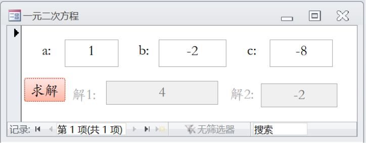
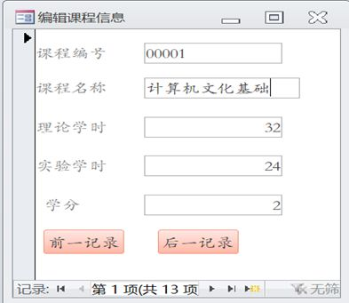
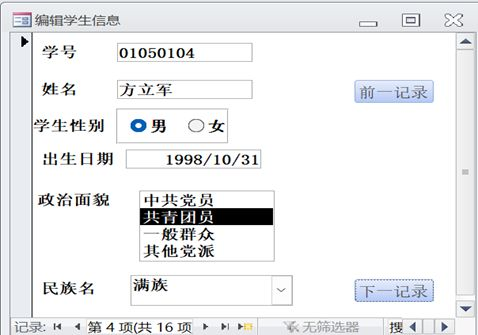
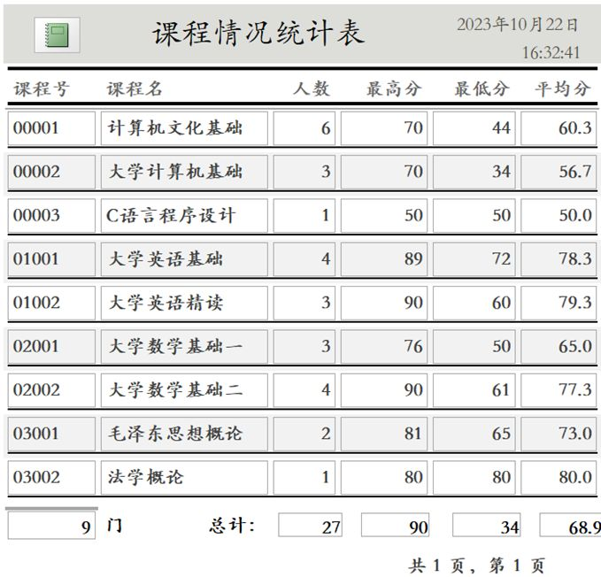
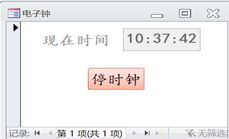
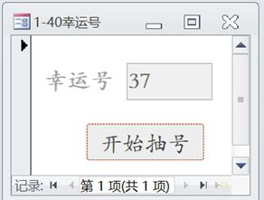

## 10

**“课程”表**中有“`课程号`”和“`课程名`”（文本型）字段，**“选课”表**中有“`学号`”、“`课程号`”和“`成绩`”（数字型）字段，按课程号由小到大顺序输出每门课程的最高分及获得者学号：

```sql
Select 课程.课程号, 课程名, 成绩 As 最高分, 学号
From 课程 Inner Join 选课
On 课程.课程号 = 选课.课程号
Where 成绩 >= All (
    Select 成绩
    From 选课 As CJB
    Where 选课.课程号 = CJB.课程号
)
Order By 课程.课程号;
```

步骤拆解：

1. 连接表（Inner Join）

```sql
From 课程 Inner Join 选课
On 课程.课程号 = 选课.课程号
```

含义：**只保留“课程表里有、并且在选课表里也出现过”的课程记录**，把这门课的每一条选课成绩行都连出来。

连接后（先不管子查询条件、也不排序），数据长这样（把课程名也带上）：

| 课程号 | 课程名         | 学号     | 成绩 |
| -----: | -------------- | -------- | ---: |
|     12 | 英语           | 22199901 |   75 |
|     12 | 英语           | 22199902 |   79 |
|     12 | 英语           | 24199910 |   50 |
|     13 | 计算机系统基础 | 22199901 |   95 |
|     13 | 计算机系统基础 | 24199911 |   77 |
|     14 | 数据库概论     | 22199901 |   85 |
|     14 | 数据库概论     | 22199902 |   88 |
|     14 | 数据库概论     | 24199911 |   66 |
|     14 | 数据库概论     | 24199910 |   80 |
|     15 | 高等数学       | 22199901 |   90 |

到这里是 **10 行**（每条选课成绩就是一行）。

2. 子查询：找“同一门课的所有成绩”

核心在 Where 这一段：

```sql
Where 成绩 >= All (
    Select 成绩
    From 选课 As CJB
    Where 选课.课程号 = CJB.课程号
)
```

先看子查询：

```sql
Select 成绩
From 选课 As CJB
Where 选课.课程号 = CJB.课程号
```

这句的意思是：
对“外层当前这一行”的课程号（`选课.课程号`），去子表 `CJB` 里把**同课程号**的成绩全部取出来。

举个外层具体行的例子你就明白了：

- 假设外层当前行是：课程号=14、学号=22199902、成绩=88
  那么子查询就会返回课程号=14 的所有成绩集合：

  ```
  {85, 88, 66, 80}
  ```

3. `>= All`：只留下“这门课的最高分那一行”

`成绩 >= All(成绩集合)` 的意思是：

- “当前行的成绩”要 **大于等于** 这门课所有成绩（集合）里的每一个值
- 换句话说：**当前行必须是这门课的最大值（最高分）**

继续用上面的例子：

- 当前行成绩=88
- 子查询集合 `{85, 88, 66, 80}`
- 88 ≥ 85 ✅，88 ≥ 88 ✅，88 ≥ 66 ✅，88 ≥ 80 ✅
  所以这一行保留。

反过来，如果当前行是成绩=80：

- 80 ≥ 88 ❌
  所以这一行会被过滤掉。

因此，这个 Where 会把每门课只留下“最高分”的那一行（如果最高分并列，会留下多行）。

应用完这个过滤条件后，剩下：

- 课程 12：最高分 79 → 学号 22199902
- 课程 13：最高分 95 → 学号 22199901
- 课程 14：最高分 88 → 学号 22199902
- 课程 15：最高分 90 → 学号 22199901

过滤后的结果表：

| 课程号 | 课程名         | 最高分 | 学号     |
| -----: | -------------- | -----: | -------- |
|     12 | 英语           |     79 | 22199902 |
|     13 | 计算机系统基础 |     95 | 22199901 |
|     14 | 数据库概论     |     88 | 22199902 |
|     15 | 高等数学       |     90 | 22199901 |

4. 排序（按课程号升序）

```sql
Order By 课程.课程号;
```

课程号从小到大：12、13、14、15
上面这张表本身已经是这个顺序了，所以输出不变。

最终输出：每门课程 1 行，共 **4 行**。

## 11

**“课程”表**中有“`课程号`”和“`课程名`”（文本型）字段，**“选课”表**中有“`学号`”、“`课程号`”和“`成绩`”（数字型）字段，按课程号由大到小顺序输出每门课程的最高分及获得者学号：

```sql
Select 课程.课程号, 课程名, 成绩 As 最高分, 学号
From 课程 Inner Join 选课
On 课程.课程号 = 选课.课程号
Where 成绩 = (
    Select Max(成绩)
    From 选课 As CJB
    Where 选课.课程号 = CJB.课程号
)
Order By 课程.课程号 DESC;
```

步骤拆解：

1. 连接表（Inner Join）

```sql
From 课程 Inner Join 选课
On 课程.课程号 = 选课.课程号
```

| 课程号 | 课程名         | 学号     | 成绩 |
| -----: | -------------- | -------- | ---: |
|     12 | 英语           | 22199901 |   75 |
|     12 | 英语           | 22199902 |   79 |
|     12 | 英语           | 24199910 |   50 |
|     13 | 计算机系统基础 | 22199901 |   95 |
|     13 | 计算机系统基础 | 24199911 |   77 |
|     14 | 数据库概论     | 22199901 |   85 |
|     14 | 数据库概论     | 22199902 |   88 |
|     14 | 数据库概论     | 24199911 |   66 |
|     14 | 数据库概论     | 24199910 |   80 |
|     15 | 高等数学       | 22199901 |   90 |

到这里还是 **10 行**。

2. 子查询：求“当前课程号”的最高分

Where 条件：

```sql
Where 成绩 = (
    Select Max(成绩)
    From 选课 As CJB
    Where 选课.课程号 = CJB.课程号
)
```

先看子查询本身：

```sql
Select Max(成绩)
From 选课 As CJB
Where 选课.课程号 = CJB.课程号
```

含义：对“外层当前这行”的课程号，去 CJB 中找到同课程号的所有成绩，然后取最大值。

举例：

- 如果外层当前行课程号=14
  子查询会得到 `Max({85,88,66,80}) = 88`

- 如果外层当前行课程号=12
  子查询会得到 `Max({75,79,50}) = 79`

3. 外层 `成绩 = 子查询最大值`：只留下“最高分那一行”

因为外层是 `=`，所以保留规则是：

- 当前行的成绩必须 **等于** 该课程号对应的最大成绩
- 也就是：**只保留每门课的最高分记录**
- 如果最高分有并列（比如两个人都 95），那两行都会留下（本题数据里没有并列）。

过滤完成后，剩下 4 行：

| 课程号 | 课程名         | 最高分 | 学号     |
| -----: | -------------- | -----: | -------- |
|     12 | 英语           |     79 | 22199902 |
|     13 | 计算机系统基础 |     95 | 22199901 |
|     14 | 数据库概论     |     88 | 22199902 |
|     15 | 高等数学       |     90 | 22199901 |

4. 排序（课程号降序）

```sql
Order By 课程.课程号 DESC;
```

课程号从大到小：15、14、13、12

最终输出：

| 行号 | 课程号 | 课程名         | 最高分 | 学号     |
| ---: | -----: | -------------- | -----: | -------- |
|    1 |     15 | 高等数学       |     90 | 22199901 |
|    2 |     14 | 数据库概论     |     88 | 22199902 |
|    3 |     13 | 计算机系统基础 |     95 | 22199901 |
|    4 |     12 | 英语           |     79 | 22199902 |

## 12

**“课程”表**中有“`课程号`”和“`课程名`”（文本型）字段，**“选课”表**中有“`学号`”、“`课程号`”和“`成绩`”（数字型）字段，按课程号由小到大顺序输出高于课程平均分的成绩情况：

```sql
Select 课程.课程号, 课程名, 成绩, 学号
From 课程【① Inner Join 】 选课
【②   Where   】 课程.课程号 = 选课.课程号
And 成绩【③   >   】 (
    Select 【④   Avg(成绩)   】
    From 选课 As CJB
    Where 【⑤   选课.课程号 = CJB.课程号  】
);
```

1. 连接表（`Inner Join`）

```sql
From 课程 Inner Join 选课
On 课程.课程号 = 选课.课程号
```

2. 条件筛选：高于课程平均分

```sql
Where 课程.课程号 = 选课.课程号
And 成绩 > (
    Select Avg(成绩)
    From 选课 As CJB
    Where 选课.课程号 = CJB.课程号
)
```

- **条件 1：** `课程.课程号 = 选课.课程号` 确保每条选课记录和对应的课程进行匹配。
- **条件 2：** `成绩 > (Select Avg(成绩) ...)` 筛选出 **高于课程平均分** 的成绩记录。

3. 子查询：求每门课程的平均成绩

```sql
Select Avg(成绩)
From 选课 As CJB
Where 选课.课程号 = CJB.课程号
```

- 子查询通过 **`Avg(成绩)`** 计算每门课程的平均成绩。

4. 输出每门课程的成绩及学号

- 保留每门课程 **高于平均成绩** 的学生成绩及学号。

5. 最终排序：按课程号升序

```sql
Order By 课程.课程号;
```

- 结果按 **课程号升序** 排列。

| 课程号 | 课程名     | 成绩 | 学号     |
| -----: | ---------- | ---: | -------- |
|     12 | 英语       |   79 | 22199902 |
|     14 | 数据库概论 |   88 | 22199902 |
|     15 | 高等数学   |   90 | 22199901 |

## 13


窗体中用于输入 n 的文本框名为 TextN，输出 n！的文本框名为 TextJC，输出 1!+……+n！的文本框名为 TextJCH，“开始计算”按钮的名称为 CD，其 Click 事件代码如下：

```vb
Private Sub CD_Click()
   Rem 单击计算阶乘按钮执行的代码，计算n!和1！+2！+……+n!
   Dim I, N As Integer
   Dim JC, JCH As Long

   N = 【①   TextN.Value   】
   JC = 【②   1   】
   JCH = 【③   0   】

   If N >= 1 Then
     For I = 1 To 【④   N   】
       JC = JC * I
       JCH = JCH + JC
     【⑤   Next   】
   Else
     JC = 0
   【⑥   End If   】

   【⑦   TextJC.Value   】 = JC
   【⑧   TextJCH.Value   】 = JCH
End Sub
```

0. 基础语法

界面上有三个文本框：

- **TextN**：输入 n（比如 5）
- **TextJC**：输出 n!（5! = 120）
- **TextJCH**：输出 1!+2!+…+n!（1+2+6+24+120 = 153）

按钮 **CD** 点一下就跑一遍程序并计算。

1）Sub / End Sub

- `Private Sub CD_Click()`：意思是 **你点了按钮 CD，就执行下面这段**
- `End Sub`：结束

2）Dim：声明变量（相当于“准备几个盒子装数字”）

```vb
Dim I, N As Integer
Dim JC, JCH As Long
```

- **N**：输入的 n
- **I**：循环用的“计数器” 1,2,3...
- **JC**：保存当前阶乘（会从 1! 变到 2!、3!…）
- **JCH**：保存累加和（1!+2!+…）

Integer/Long 只是“装整数的盒子”，Long 更能装大的数。

3）TextN.Value

- `TextN.Value` 就是 **从文本框里取值**
- `TextJC.Value = JC` 就是 **把结果塞回文本框显示**

界面与程序的数据传递就靠它了。

4）If / Else / End If

```vb
If 条件 Then
    条件成立走这里
Else
    条件不成立走这里
End If
```

- `If 条件 Then`：如果条件成立
- `Else`：否则
- `End If`：结束判断

5）For / Next（循环）

```vb
For 计数器 = 初值 To 终点
    循环体（每一轮要做的事）
Next '计数器自动 +1，决定是否继续
```

- `For I = 1 To N`：I 从 1 跑到 N，每次加 1
- `Next`：循环结束，给计数器加一，当超过终点才停（等于终点那轮也会执行）

1. 代码分析

读取输入 + 初始化

```vb
N = TextN.Value
JC = 1
JCH = 0
```

- `JC = 1`：因为阶乘从 1 开始乘，把阶乘初始值设为 1
- `JCH = 0`：设置阶乘和初始为 0

判断 n 合不合法（至少要 >= 1）

```vb
If N >= 1 Then
   ...
Else
   JC = 0
End If
```

- 如果 n 小于 1，题目这里就直接让 n! = 0（虽然数学上 0!=1，但考试按题给的代码逻辑来）

循环计算（核心）

```vb
For I = 1 To N
   JC = JC * I
   JCH = JCH + JC
Next
```

这一段是整题灵魂：

1）`JC = JC * I` 在干什么？

它在“滚动更新阶乘”：

- I=1：JC = 1\*1 = 1 （1!）
- I=2：JC = 1\*2 = 2 （2!）
- I=3：JC = 2\*3 = 6 （3!）
- I=4：JC = 6\*4 = 24 （4!）
- I=5：JC = 24\*5 = 120（5!）

**所以循环跑完，JC 就是 n!**

2）JCH = JCH + JC 在干什么？

把每次算出来的阶乘都加进去：

- I=1：JCH = 0 + 1 = 1
- I=2：JCH = 1 + 2 = 3
- I=3：JCH = 3 + 6 = 9
- I=4：JCH = 9 + 24 = 33
- I=5：JCH = 33 + 120 = 153

所以循环跑完，JCH 就是 1!+2!+…+n!

最终，输出到界面

```vb
TextJC.Value = JC
TextJCH.Value = JCH
```

- TextJC 显示 n!
- TextJCH 显示阶乘和

## 14



窗体为 aX2+bx+c=0 的求解程序，输入 a 的文本框名为 TextA，输入 b 的文本框名为 TextB，输入 c 的文本框名为 TextC，输出第一个解的文本框名为 Text1，输出第二个解的文本框名为 Text2，“求解”按钮的名称为 QJ，其 Click 事件代码如下：

```vb
Private Sub QJ_Click()
Dim a, b, c As Single

a = 【①   Texta.Value   】
b = 【②   Textb.Value   】
c = 【③   Textc.Value   】

Text2.Value = ""

If 【④   a=0   】 Then
   Text1.Value = "非一元二次方程！"
ElseIf 【⑤   b^2-4*a*c=0   】 Then
   Text1.Value = -b / (2 * a)
   Text2.Value = ""
ElseIf 【⑥   b^2-4*a*c>0   】 Then
   Text1.Value = (-b + Sqr(b ^ 2 - 4 * a * c)) / (2 * a)
   Text2.Value = (-b - Sqr(b ^ 2 - 4 * a * c)) / (2 * a)
【⑦   Else   】
   Text1.Value = "无实数解！"
【⑧   End If   】
End Sub
```

0. 分析

这题就是让程序根据输入的 a、b、c，去判断方程有没有实数解，然后把解显示在 Text1、Text2 里。

关键点只有一个：高中数学判别式
D = b² - 4ac

- D > 0：有两个不相等的实数解
- D = 0：有一个实数解（两个解相等）
- D < 0：没有实数解（无实数解）

另外如果 a = 0，这就不是一元二次方程了（变成一次或常数），本题直接提示错误。

1. 基本语法

1）Dim：声明变量

```vb
Dim a, b, c As Single
```

Single 是小数类型，输入可能带小数，所以用它装。

2）Value：从文本框取数 / 把结果显示到文本框

- `Texta.Value`、`Textb.Value`、`Textc.Value`：取 a、b、c
- `Text1.Value = ...`、`Text2.Value = ...`：显示结果

3）If / ElseIf / Else / End If：多分支判断

```vb
If 条件1 Then
    ...
ElseIf 条件2 Then
    ...
ElseIf 条件3 Then
    ...
Else
    ...
End If
```

从上往下挨个判断，满足哪个就执行哪个分支，然后直接结束（不会继续往下判断）。

4）Sqr(x)：开平方

- `Sqr(9) = 3`
- 本题用它求 √(b²-4ac)

2. 代码分析（按执行顺序）

1）读取输入

```vb
a = Texta.Value
b = Textb.Value
c = Textc.Value
Text2.Value = ""
```

先把 a、b、c 从界面拿出来，并且先清空第二个解的输出框，避免上次结果残留。

2）第一层判断：a 是否为 0

```vb
If a = 0 Then
   Text1.Value = "非一元二次方程！"
```

a=0 就不是一元二次方程，本题直接提示，不再算后面的内容。

3）第二层判断：判别式 D = b²-4ac

```vb
ElseIf b ^ 2 - 4 * a * c = 0 Then
   Text1.Value = -b / (2 * a)
   Text2.Value = ""
```

D=0：只有一个解（两个根相同），所以只显示 Text1，Text2 置空。

4）第三层判断：D > 0（两个实根）

```vb
ElseIf b ^ 2 - 4 * a * c > 0 Then
   Text1.Value = (-b + Sqr(b ^ 2 - 4 * a * c)) / (2 * a)
   Text2.Value = (-b - Sqr(b ^ 2 - 4 * a * c)) / (2 * a)
```

D>0：两个解都要算出来，公式就是：
x = (-b ± √D) / (2a)

5）否则：D < 0（无实数解）

```vb
Else
   Text1.Value = "无实数解！"
End If
```

D<0 的情况下，根号里是负数，实数范围下没法开方，所以显示“无实数解”。

考试能套的观察法

- 先看 a=0：不是一元二次，直接提示
- 否则看 D = b²-4ac：

  - D=0：一个解：-b/(2a)
  - D>0：两个解：(-b±√D)/(2a)
  - D<0：无实数解

## 15



**“课程”表**中有`课程号`、`课程名`、`理论学时`、`实验学时`和`学分` 5 个字段。设计窗体时，其
【① 标题 】属性值为“编辑课程信息”。

为了使窗体与课程表绑定，窗体的【② 记录源 】属性值为“课程”，

“课程编号”对应的文本框的【③ 控件来源 】属性值为【④ 课程号 】；

“前一记录”是命令按钮的【⑤ 标题 】属性值。

1. 关键概念：Access 的“绑定”

Access 的窗体可以理解成“表的操作界面”：

- 表里有很多条记录
- 窗体一次显示其中一条记录（比如第 1 条、第 2 条）
- 你点“前一记录/后一记录”其实是在 **切换当前显示的是哪一条记录**

要实现这种效果，必须两层绑定：

1）窗体 ↔ 表（决定这窗体展示哪张表的数据）
2）控件 ↔ 字段（决定这个文本框展示表里的哪个字段）

2. 本题这几个属性分别是干啥的

①【标题】= “编辑课程信息”

- **标题（Caption）**：窗体最上面那行显示的文字（像窗口名字）

所以题里要求窗体看起来叫“编辑课程信息”，就填 标题

②【记录源】= “课程”

- **记录源（RecordSource）**：窗体的数据来源（绑定哪张表/查询）

这里要展示“课程”表的数据，所以记录源是 “课程”

③“课程编号”文本框的【控件来源】= ④【课程号】

- **控件来源（ControlSource）**：控件从哪里拿数据（绑定哪个字段）

“课程编号”这个文本框要显示课程号，所以它的控件来源必须绑定到字段 **课程号**

⑤“前一记录”是命令按钮的【标题】属性值

- 命令按钮上显示的字，也是 **标题（Caption）**

所以按钮上写“前一记录”，就是把按钮的标题设成“前一记录”

看到“窗体 / 文本框 / 按钮”的属性题，按这个顺序扫：

- **窗体要显示的名字** → 找 **标题**
- **窗体绑定哪张表** → 找 **记录源**
- **某个文本框显示哪个字段** → 找 **控件来源**
- **按钮上显示的字** → 也找 **标题**

## 16



**“学生”表** 中有`学号`、 `姓名`、`性别`、`出生日期`、`政治面貌`和`民族` 6 个字段，**MZB 表**中有`民族码`和`民族`名 2 个字段。为了使窗体与学生表绑定，设计窗体时：

学生性别对应选项组的【① 控件来源 】属性值为【② 性别 】

“政治面貌”列表框的 “中共党员;共青团员;一般群众;其他党派” 是【③ 行来源 】属性的值

“民族名”组合框的行来源是 `SELECT 民族名 FROM mzb` 其行来源类型应该是【④ 表/查询 】

“前一记录”命令按钮的“单击”事件值为【⑤ `[嵌入的宏]` 】

0. 先把画面翻译成人话

这个窗体里大概有四块典型控件：

- “男/女”那一组：是 **选项组**（点一个圆点只能选一个）
- “政治面貌”那一块：是 **列表框**（显示一列选项）
- “民族名”那一块：是 **组合框/下拉框**（点开可以选，平时显示一个）
- “前一记录”按钮：点一下就跳到上一条学生记录

题目就是问：这些东西在“属性表”里分别该填什么，才能正常工作。

1. 核心观念：窗体就是“显示一条记录的面板”

Access 的窗体可以理解成“学生表的一张卡片”：

- 学生表有很多行（很多学生）
- 窗体每次显示其中一行（当前这条学生记录）
- 你点“前一记录/后一记录”其实是在切换“当前是哪一行”

为了做到这点，要两层对接：

- 第一层：窗体对接“学生表”（题干说“为了使窗体与学生表绑定”，这一层默认已经完成）
- 第二层：每个控件对接“学生表里的某个字段”（这题主要考这个 + 列表选项来源）

2. 把四个属性说到“能用”的程度

（1）控件来源：这个控件对应“表里的哪个字段”

> **控件来源 = 字段名**，就是把控件和表字段绑起来。

- 绑定后会发生两件事：
  你切换记录时，控件会自动显示该字段的值；你修改控件时，会写回该字段。

所以题里说： “学生性别对应选项组的【控件来源】属性值为【性别】” 意思就是：这组选项最终要存到学生表的“性别”字段里。

（2）行来源：这个列表/下拉框“有哪些选项可以选”

> **行来源 = 选项的来源内容**。来源有两种常见形态：

- 直接写死一串：`A;B;C`（适合固定选项）
- 写 SQL：`SELECT ... FROM ...`（适合从表里动态取）

题里“政治面貌”就是固定的那种，所以把 `中共党员;共青团员;一般群众;其他党派` ，直接塞进它的【行来源】属性。

（3）行来源类型：告诉 Access “你这行来源到底是哪种”

> **行来源类型 = 行来源的解释方式**。

- 如果行来源是 `中共党员;共青团员;...` 这种一串文本 → 行来源类型通常是“值列表”
- 如果行来源是 SQL（比如 `SELECT 民族名 FROM mzb`）→ 行来源类型就必须是【表/查询】

行来源里出现了分号 ; 串起来的一堆文字 → 大概率选 值列表
行来源里出现 SELECT ... FROM ...（或明显是表/查询名）→ 必选 表/查询

（4）单击事件：按钮点一下之后，Access 用什么方式处理

> **单击事件 = 点击后执行逻辑的承载方式**。

一般有这两个选项

- `[事件过程]`：走 VBA 代码 （会出现 Private Sub 按钮名\_Click() 这种代码框架）逻辑比较复杂、需要计算/判断/多步处理时。
- `[嵌入的宏]`：走 Access 宏 （在宏设计器里选动作）比较简单的操作。

“前一记录”这种属于 Access 常见的“记录导航动作”，用宏做很常见、也很符合考试套路，所以填【[嵌入的宏]】。

## 17



上述报表的记录源为：

```sql
Select 课程.课程号, 课程名,
       Count(学号) AS 人数,
       Max(成绩) AS 最高分,
       Min(成绩) AS 最低分,
       Avg(成绩) AS 平均分
From 课程 Inner Join 成绩
On 课程.课程号 = 成绩.课程号
Group By 课程.课程号, 课程名;
```

设计报表时：

报表日期文本框的控件来源属性值为【① `=Date()` 】
统计门数文本框的控件来源属性值为【② `=Count(*)` 】
“总计”行右侧 4 个文本框的控件来源属性值依次是：
【③ `=Sum(人数)` 】、【④ `=Max(最高分)` 】、
【⑤ `=Min(最低分)` 】和【⑥ `=Avg(平均分)` 】

0. 分析

这题考报表里的某些文本框要显示“统计结果”，控件来源应该填什么表达式。

报表分两层：

- 明细区：每一行是一门课（课程号、课程名、人数、最高分、最低分、平均分）
- 报表页脚/总计行：把所有课程再做一次汇总（总人数、最高分中的最大值、最低分中的最小值、平均分的平均）

关键点：
控件来源里可以写“=函数(...)”，让报表自动算出来。

1. 先读懂记录源：每行已经算出了哪些字段

这条 SQL 通过 `Group By 课程号, 课程名` 做了分组，因此输出结果是“按课程汇总”的表，每行都有：

- 人数：`Count(学号) AS 人数`
- 最高分：`Max(成绩) AS 最高分`
- 最低分：`Min(成绩) AS 最低分`
- 平均分：`Avg(成绩) AS 平均分`

所以在报表的“明细区”，这些字段可以直接绑定显示（控件来源填 人数/最高分/最低分/平均分 即可）。本题问的不是这块，而是“报表日期 / 统计门数 / 总计行”。

2. 控件来源怎么填：两种情况要分清

情况 A：显示系统生成的值（不来自记录源字段）
→ 直接用系统函数：`=Date()`、`=Time()` 这种。

常见就这几个：

`=Date()`：显示系统当前日期（只要日期，不含时间）
例：2026-01-21（具体格式由系统/区域设置决定）

`=Time()`：显示系统当前时间（只要时间，不含日期）
例：10:37:42

`=Now()`：显示当前日期 + 当前时间
例：2026-01-21 10:37:42

情况 B：对“记录源的多行结果”再做一次汇总
→ 用汇总函数：`=Count(*)`、`=Sum(...)`、`=Max(...)`、`=Min(...)`、`=Avg(...)`

选`=Count(*)` 而不选 `=Count(学号)` ,因为题目要统计的是课程而不是学生，这里又已经按照课程号分组了，因此 `=Count(*)` 的效果就等于 `=Count(课程号)`

## 18



窗体对象名为计时器 A1，运行初始状态如图所示，每间隔 1 秒文本框（Text1）上显示系统时间，单击“停时钟”按钮（Cd1），按钮（Cd1）上显示“启时钟”，并且文本框（Text1）上时间停止；再单击“启时钟”按钮（Cd1），窗体功能恢复到初始状态。相关事件代码如下：

```vb
Private Sub Cd1_Click()
If Forms!计时器A1.TimerInterval = 0 Then
   Cd1.Caption =  ①   "停时钟"
   Forms!计时器A1.TimerInterval =  ②   1000
Else
  Cd1.Caption =  ③   "启时钟"
  Forms!计时器A1.TimerInterval =  ④   0
End If
End Sub

Private Sub Form_Timer()
Text1.Value =  ⑤   Time()
End Sub
```

0. 分析

这题就是做一个“电子钟 + 暂停/继续”的开关。

关键只有两点：

- Text1 显示时间，是靠 `Form_Timer()` 反复刷新
- 是否刷新，完全取决于 `TimerInterval`：

  - `TimerInterval = 1000`：每 1000 毫秒 （1 秒）触发一次 `Form_Timer()`（时间会走）
  - `TimerInterval = 0`：计时器关闭，不再触发 `Form_Timer()`（时间停住）

按钮 Cd1 的作用就是在这两种状态之间切换，并把按钮文字改成对应提示。

1. 先看 Form_Timer：时间为什么会动

```vb
Private Sub Form_Timer()
Text1.Value = Time()
End Sub
```

- `Form_Timer()`：计时器每触发一次就执行一次
- `Text1.Value = Time()`：把系统当前时间写进 Text1

`Time()` 就是“当前时间”（例如 10:37:42）。
所以只要计时器不断触发，这个文本框就会不断被写入新时间，看起来就像“钟在走”。

2. 再看 Cd1_Click：如何实现“停/启”的切换

```vb
If Forms!计时器A1.TimerInterval = 0 Then
   Cd1.Caption = "停时钟"
   Forms!计时器A1.TimerInterval = 1000
Else
  Cd1.Caption = "启时钟"
  Forms!计时器A1.TimerInterval = 0
End If
```

先判断当前是否“停着”：

- 如果 `TimerInterval = 0`（当前是停的）
  → 把间隔改成 1000，让它每秒触发一次
  → 按钮文字改成“停时钟”（提示下一次点会停）

- 否则（说明正在跑）
  → 把间隔改成 0，直接停掉计时器触发
  → 按钮文字改成“启时钟”（提示下一次点会启）

3. 为什么“停了之后时间就不变”

因为显示时间这件事只发生在 `Form_Timer()` 里。
当 `TimerInterval = 0` 时，`Form_Timer()` 不再触发，Text1 就不会再被写入新时间，所以画面停住。

## 19

窗体运行效果同上题。设计窗体时，在属性表中：

- ① 标题（Caption） 的属性值为：电子钟
- 为使窗体初始运行的计时器有效，应将
  ② 计时器间隔 属性值设置成大于 0

相关事件代码如下：

```vb
Private Sub Cd1_Click()
If Forms!计时器A1. ③   TimerInterval   = 0 Then
   Cd1. ④   Caption   = "停时钟"
   Forms!计时器A1. ③     = 1000
Else
  Cd1. ④     = "启时钟"
  Forms!计时器A1. ③     = 0
End If
End Sub

Private Sub Form_Timer()
Text1. ⑤   Value   = Time()
End Sub
```

这一题和 18 的功能完全一样，只是换了问法：
它把“代码里的关键属性名”挖空，让你填出 Access 里常见的属性：

- Caption：窗口/按钮上显示的文字
- TimerInterval：计时器间隔（毫秒），决定 Timer 是否触发
- Value：文本框当前显示的值

另外多问了一句“初始运行要怎么设置”，答案就是：窗体的 TimerInterval 必须 > 0 才会一开始就触发 Form_Timer。

1. 属性表里的两个设置（题干 ①②）

① 标题（Caption）= 电子钟

- 这是窗体标题栏显示的名字。

② 计时器间隔（TimerInterval）> 0

- 计时器间隔是毫秒数。
- 如果一开始就要每秒显示时间，常见就是设成 1000。
- 只要大于 0，Form_Timer 才会周期触发；等于 0 就是停。

2. 代码填空逐个落地（③④⑤）

```vb
If Forms!计时器A1.TimerInterval = 0 Then
   Cd1.Caption = "停时钟"
   Forms!计时器A1.TimerInterval = 1000
Else
  Cd1.Caption = "启时钟"
  Forms!计时器A1.TimerInterval = 0
End If
```

③ TimerInterval

- 这里既要判断计时器是否停（=0），也要把它设为 1000 或 0
- 所以空里全是 `TimerInterval`

④ Caption

- 按钮上显示“停时钟/启时钟”，这是按钮的标题文字
- 所以用 `Caption`

```vb
Text1.Value = Time()
```

⑤ Value

- Text1 是文本框，要把当前时间显示进去，就是给它的 Value 赋值
- 所以填 `Value`

## 20

窗体对象名为 C1，运行初始状态如图所示，每次单击“开始抽号”按钮（Cd1），在文本框（Text1）上都重新显示 1—40 的一个幸运号，但不可修改。



设计窗体时，在属性表中：

- 窗体的 ① 标题（Caption） 属性值为：1—40 幸运号
- 文本框（Text1）的 ② 可用（Enabled） 属性值为：否
- 按钮（Cd1）的 ③ 标题（Caption） 属性值为：开始抽号

相关事件代码如下：

```vb
Private Sub cd1_Click()
Text1.  ④   Value   = Int( ⑤   Rnd()*40+1   )
End Sub
```

20

窗体对象名为 C1，运行初始状态如图所示，每次单击“开始抽号”按钮（Cd1），在文本框（Text1）上都重新显示 1—40 的一个幸运号，但不可修改。

设计窗体时，在属性表中：

- 窗体的 ① 标题（Caption） 属性值为：1—40 幸运号
- 文本框（Text1）的 ② 可用（Enabled） 属性值为：否
- 按钮（Cd1）的 ③ 标题（Caption） 属性值为：开始抽号

相关事件代码如下：

```vb
Private Sub cd1_Click()
Text1.Value = Int( Rnd() * 40 + 1 )
End Sub
```

0. 分析

这题就是“点一次按钮，随机生成一个 1 ～ 40 的整数并显示出来”。

要实现“显示但不可修改”，关键不是代码，而是属性表：

- Text1 的 Enabled 设为 否 → 用户不能点击输入/修改
- 数字的生成由按钮点击事件完成

1. 属性表里的三个设置（题干 ①②③）

① 窗体 Caption = 1—40 幸运号

- Caption 就是窗体标题栏显示的文字。

② Text1 Enabled = 否

- Enabled 决定控件是否可用。设为 否 后：

  - 不能被用户编辑
  - 也不会获得输入焦点
    （程序仍然可以给它赋值显示内容）

③ Cd1 Caption = 开始抽号

- 按钮上显示的文字就是 Caption。

2. 代码部分在做什么（④⑤）

```vb
Text1.Value = Int( Rnd() * 40 + 1 )
```

④ Value

- Text1 是文本框，把结果显示出来就是给 Text1 的 Value 赋值。

⑤ Rnd()\*40+1

- `Rnd()` 会生成一个 0 到 1 之间的随机小数（不包含 1）
- 乘 40 → 变成 0 到 40 之间的小数
- 再加 1 → 变成 1 到 41 之间的小数
- `Int(...)` 取整数部分 → 最终得到 1 到 40 的整数

所以每次点击按钮，Text1 都会更新成一个新的幸运号。
