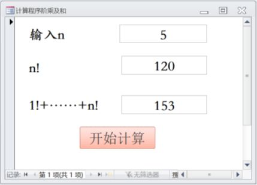

## 10

**“课程”表**中有“`课程号`”和“`课程名`”（文本型）字段，**“选课”表**中有“`学号`”、“`课程号`”和“`成绩`”（数字型）字段，按课程号由小到大顺序输出每门课程的最高分及获得者学号：

```sql
Select 课程.课程号, 课程名, 成绩 As 最高分, 学号
From 课程 Inner Join 选课
On 课程.课程号 = 选课.课程号
Where 成绩 >= All (
    Select 成绩
    From 选课 As CJB
    Where 选课.课程号 = CJB.课程号
)
Order By 课程.课程号;
```

步骤拆解：

1. 连接表（Inner Join）

```sql
From 课程 Inner Join 选课
On 课程.课程号 = 选课.课程号
```

含义：**只保留“课程表里有、并且在选课表里也出现过”的课程记录**，把这门课的每一条选课成绩行都连出来。

连接后（先不管子查询条件、也不排序），数据长这样（把课程名也带上）：

| 课程号 | 课程名         | 学号     | 成绩 |
| -----: | -------------- | -------- | ---: |
|     12 | 英语           | 22199901 |   75 |
|     12 | 英语           | 22199902 |   79 |
|     12 | 英语           | 24199910 |   50 |
|     13 | 计算机系统基础 | 22199901 |   95 |
|     13 | 计算机系统基础 | 24199911 |   77 |
|     14 | 数据库概论     | 22199901 |   85 |
|     14 | 数据库概论     | 22199902 |   88 |
|     14 | 数据库概论     | 24199911 |   66 |
|     14 | 数据库概论     | 24199910 |   80 |
|     15 | 高等数学       | 22199901 |   90 |

到这里是 **10 行**（每条选课成绩就是一行）。

2. 子查询：找“同一门课的所有成绩”

核心在 Where 这一段：

```sql
Where 成绩 >= All (
    Select 成绩
    From 选课 As CJB
    Where 选课.课程号 = CJB.课程号
)
```

先看子查询：

```sql
Select 成绩
From 选课 As CJB
Where 选课.课程号 = CJB.课程号
```

这句的意思是：
对“外层当前这一行”的课程号（`选课.课程号`），去子表 `CJB` 里把**同课程号**的成绩全部取出来。

举个外层具体行的例子你就明白了：

- 假设外层当前行是：课程号=14、学号=22199902、成绩=88
  那么子查询就会返回课程号=14 的所有成绩集合：

  ```
  {85, 88, 66, 80}
  ```

3. `>= All`：只留下“这门课的最高分那一行”

`成绩 >= All(成绩集合)` 的意思是：

- “当前行的成绩”要 **大于等于** 这门课所有成绩（集合）里的每一个值
- 换句话说：**当前行必须是这门课的最大值（最高分）**

继续用上面的例子：

- 当前行成绩=88
- 子查询集合 `{85, 88, 66, 80}`
- 88 ≥ 85 ✅，88 ≥ 88 ✅，88 ≥ 66 ✅，88 ≥ 80 ✅
  所以这一行保留。

反过来，如果当前行是成绩=80：

- 80 ≥ 88 ❌
  所以这一行会被过滤掉。

因此，这个 Where 会把每门课只留下“最高分”的那一行（如果最高分并列，会留下多行）。

应用完这个过滤条件后，剩下：

- 课程 12：最高分 79 → 学号 22199902
- 课程 13：最高分 95 → 学号 22199901
- 课程 14：最高分 88 → 学号 22199902
- 课程 15：最高分 90 → 学号 22199901

过滤后的结果表：

| 课程号 | 课程名         | 最高分 | 学号     |
| -----: | -------------- | -----: | -------- |
|     12 | 英语           |     79 | 22199902 |
|     13 | 计算机系统基础 |     95 | 22199901 |
|     14 | 数据库概论     |     88 | 22199902 |
|     15 | 高等数学       |     90 | 22199901 |

4. 排序（按课程号升序）

```sql
Order By 课程.课程号;
```

课程号从小到大：12、13、14、15
上面这张表本身已经是这个顺序了，所以输出不变。

最终输出：每门课程 1 行，共 **4 行**。

## 11

**“课程”表**中有“`课程号`”和“`课程名`”（文本型）字段，**“选课”表**中有“`学号`”、“`课程号`”和“`成绩`”（数字型）字段，按课程号由大到小顺序输出每门课程的最高分及获得者学号：

```sql
Select 课程.课程号, 课程名, 成绩 As 最高分, 学号
From 课程 Inner Join 选课
On 课程.课程号 = 选课.课程号
Where 成绩 = (
    Select Max(成绩)
    From 选课 As CJB
    Where 选课.课程号 = CJB.课程号
)
Order By 课程.课程号 DESC;
```

步骤拆解：

1. 连接表（Inner Join）

```sql
From 课程 Inner Join 选课
On 课程.课程号 = 选课.课程号
```

| 课程号 | 课程名         | 学号     | 成绩 |
| -----: | -------------- | -------- | ---: |
|     12 | 英语           | 22199901 |   75 |
|     12 | 英语           | 22199902 |   79 |
|     12 | 英语           | 24199910 |   50 |
|     13 | 计算机系统基础 | 22199901 |   95 |
|     13 | 计算机系统基础 | 24199911 |   77 |
|     14 | 数据库概论     | 22199901 |   85 |
|     14 | 数据库概论     | 22199902 |   88 |
|     14 | 数据库概论     | 24199911 |   66 |
|     14 | 数据库概论     | 24199910 |   80 |
|     15 | 高等数学       | 22199901 |   90 |

到这里还是 **10 行**。

2. 子查询：求“当前课程号”的最高分

Where 条件：

```sql
Where 成绩 = (
    Select Max(成绩)
    From 选课 As CJB
    Where 选课.课程号 = CJB.课程号
)
```

先看子查询本身：

```sql
Select Max(成绩)
From 选课 As CJB
Where 选课.课程号 = CJB.课程号
```

含义：对“外层当前这行”的课程号，去 CJB 中找到同课程号的所有成绩，然后取最大值。

举例：

- 如果外层当前行课程号=14
  子查询会得到 `Max({85,88,66,80}) = 88`

- 如果外层当前行课程号=12
  子查询会得到 `Max({75,79,50}) = 79`

3. 外层 `成绩 = 子查询最大值`：只留下“最高分那一行”

因为外层是 `=`，所以保留规则是：

- 当前行的成绩必须 **等于** 该课程号对应的最大成绩
- 也就是：**只保留每门课的最高分记录**
- 如果最高分有并列（比如两个人都 95），那两行都会留下（本题数据里没有并列）。

过滤完成后，剩下 4 行：

| 课程号 | 课程名         | 最高分 | 学号     |
| -----: | -------------- | -----: | -------- |
|     12 | 英语           |     79 | 22199902 |
|     13 | 计算机系统基础 |     95 | 22199901 |
|     14 | 数据库概论     |     88 | 22199902 |
|     15 | 高等数学       |     90 | 22199901 |

4. 排序（课程号降序）

```sql
Order By 课程.课程号 DESC;
```

课程号从大到小：15、14、13、12

最终输出：

| 行号 | 课程号 | 课程名         | 最高分 | 学号     |
| ---: | -----: | -------------- | -----: | -------- |
|    1 |     15 | 高等数学       |     90 | 22199901 |
|    2 |     14 | 数据库概论     |     88 | 22199902 |
|    3 |     13 | 计算机系统基础 |     95 | 22199901 |
|    4 |     12 | 英语           |     79 | 22199902 |

## 12

**“课程”表**中有“`课程号`”和“`课程名`”（文本型）字段，**“选课”表**中有“`学号`”、“`课程号`”和“`成绩`”（数字型）字段，按课程号由小到大顺序输出高于课程平均分的成绩情况：

```sql
Select 课程.课程号, 课程名, 成绩, 学号
From 课程【① Inner Join 】 选课
【②   Where   】 课程.课程号 = 选课.课程号
And 成绩【③   >   】 (
    Select 【④   Avg(成绩)   】
    From 选课 As CJB
    Where 【⑤   选课.课程号 = CJB.课程号  】
);
```

1. 连接表（`Inner Join`）

```sql
From 课程 Inner Join 选课
On 课程.课程号 = 选课.课程号
```

2. 条件筛选：高于课程平均分

```sql
Where 课程.课程号 = 选课.课程号
And 成绩 > (
    Select Avg(成绩)
    From 选课 As CJB
    Where 选课.课程号 = CJB.课程号
)
```

- **条件 1：** `课程.课程号 = 选课.课程号` 确保每条选课记录和对应的课程进行匹配。
- **条件 2：** `成绩 > (Select Avg(成绩) ...)` 筛选出 **高于课程平均分** 的成绩记录。

3. 子查询：求每门课程的平均成绩

```sql
Select Avg(成绩)
From 选课 As CJB
Where 选课.课程号 = CJB.课程号
```

- 子查询通过 **`Avg(成绩)`** 计算每门课程的平均成绩。

4. 输出每门课程的成绩及学号

- 保留每门课程 **高于平均成绩** 的学生成绩及学号。

5. 最终排序：按课程号升序

```sql
Order By 课程.课程号;
```

- 结果按 **课程号升序** 排列。

| 课程号 | 课程名     | 成绩 | 学号     |
| -----: | ---------- | ---: | -------- |
|     12 | 英语       |   79 | 22199902 |
|     14 | 数据库概论 |   88 | 22199902 |
|     15 | 高等数学   |   90 | 22199901 |

## 13



窗体中用于输入 n 的文本框名为 TextN，输出 n！的文本框名为 TextJC，输出 1!+……+n！的文本框名为 TextJCH，“开始计算”按钮的名称为 CD，其 Click 事件代码如下：

```vb
Private Sub CD_Click()
   Rem 单击计算阶乘按钮执行的代码，计算n!和1！+2！+……+n!
   Dim I, N As Integer
   Dim JC, JCH As Long

   N = 【①   TextN.Value   】
   JC = 【②   1   】
   JCH = 【③   0   】

   If N >= 1 Then
     For I = 1 To 【④   N   】
       JC = JC * I
       JCH = JCH + JC
     【⑤   Next   】
   Else
     JC = 0
   【⑥   End If   】

   【⑦   TextJC.Value   】 = JC
   【⑧   TextJCH.Value   】 = JCH
End Sub
```

行，主子。咱们就用**“没学过编程也能看懂”**的方式，把 13 题拆开。目标很现实：**考试能套用、能改字就能得分**。这题本质上就两件事：算 **n!**，再把 **1!+2!+…+n!** 累加出来。

0. 基础语法

界面上有三个文本框：

- **TextN**：输入 n（比如 5）
- **TextJC**：输出 n!（5! = 120）
- **TextJCH**：输出 1!+2!+…+n!（1+2+6+24+120 = 153）

按钮 **CD** 点一下就跑一遍程序并计算。

1）Sub / End Sub

- `Private Sub CD_Click()`：意思是 **你点了按钮 CD，就执行下面这段**
- `End Sub`：结束

2）Dim：声明变量（相当于“准备几个盒子装数字”）

```vb
Dim I, N As Integer
Dim JC, JCH As Long
```

- **N**：输入的 n
- **I**：循环用的“计数器” 1,2,3...
- **JC**：保存当前阶乘（会从 1! 变到 2!、3!…）
- **JCH**：保存累加和（1!+2!+…）

Integer/Long 只是“装整数的盒子”，Long 更能装大的数。

3）TextN.Value

- `TextN.Value` 就是 **从文本框里取值**
- `TextJC.Value = JC` 就是 **把结果塞回文本框显示**

界面与程序的数据传递就靠它了。

4）If / Else / End If

```vb
If 条件 Then
    条件成立走这里
Else
    条件不成立走这里
End If
```

- `If 条件 Then`：如果条件成立
- `Else`：否则
- `End If`：结束判断

5）For / Next（循环）

```vb
For 计数器 = 初值 To 终点
    循环体（每一轮要做的事）
Next '计数器自动 +1，决定是否继续
```

- `For I = 1 To N`：I 从 1 跑到 N，每次加 1
- `Next`：循环结束，给计数器加一，当超过终点才停（等于终点那轮也会执行）

1. 代码分析

读取输入 + 初始化

```vb
N = TextN.Value
JC = 1
JCH = 0
```

- `JC = 1`：因为阶乘从 1 开始乘，把阶乘初始值设为 1
- `JCH = 0`：设置阶乘和初始为 0

判断 n 合不合法（至少要 >= 1）

```vb
If N >= 1 Then
   ...
Else
   JC = 0
End If
```

- 如果 n 小于 1，题目这里就直接让 n! = 0（虽然数学上 0!=1，但考试按题给的代码逻辑来）

循环计算（核心）

```vb
For I = 1 To N
   JC = JC * I
   JCH = JCH + JC
Next
```

这一段是整题灵魂：

1）`JC = JC * I` 在干什么？

它在“滚动更新阶乘”：

- I=1：JC = 1\*1 = 1 （1!）
- I=2：JC = 1\*2 = 2 （2!）
- I=3：JC = 2\*3 = 6 （3!）
- I=4：JC = 6\*4 = 24 （4!）
- I=5：JC = 24\*5 = 120（5!）

**所以循环跑完，JC 就是 n!**

2）JCH = JCH + JC 在干什么？

把每次算出来的阶乘都加进去：

- I=1：JCH = 0 + 1 = 1
- I=2：JCH = 1 + 2 = 3
- I=3：JCH = 3 + 6 = 9
- I=4：JCH = 9 + 24 = 33
- I=5：JCH = 33 + 120 = 153

所以循环跑完，JCH 就是 1!+2!+…+n!

最终，输出到界面

```vb
TextJC.Value = JC
TextJCH.Value = JCH
```

- TextJC 显示 n!
- TextJCH 显示阶乘和

## 14

窗体为 aX2+bx+c=0 的求解程序，输入 a 的文本框名为 TextA，输入 b 的文本框名为 TextB，输入 c 的文本框名为 TextC，输出第一个解的文本框名为 Text1，输出第二个解的文本框名为 Text2，“求解”按钮的名称为 QJ，其 Click 事件代码如下：

```vb
Private Sub QJ_Click()
Dim a, b, c As Single

a = 【①   Texta.Value   】
b = 【②   Textb.Value   】
c = 【③   Textc.Value   】

Text2.Value = ""

If 【④   a=0   】 Then
   Text1.Value = "非一元二次方程！"
ElseIf 【⑤   b^2-4*a*c=0   】 Then
   Text1.Value = -b / (2 * a)
   Text2.Value = ""
ElseIf 【⑥   b^2-4*a*c>0   】 Then
   Text1.Value = (-b + Sqr(b ^ 2 - 4 * a * c)) / (2 * a)
   Text2.Value = (-b - Sqr(b ^ 2 - 4 * a * c)) / (2 * a)
【⑦   Else   】
   Text1.Value = "无实数解！"
【⑧   End If   】
End Sub
```


## 15

“课程”表中有课程号、课程名、理论学时、实验学时和学分 5 个字段。设计窗体时，其
【① 标题 】属性值为“编辑课程信息”。

为了使窗体与课程表绑定，窗体的
【② 记录源 】属性值为“课程”，

“课程编号”对应的文本框的
【③ 控件来源 】属性值为【④ 课程号 】；

“前一记录”是命令按钮的
【⑤ 标题 】属性值。

---

## 16

“学生”表中有学号、姓名、性别、出生日期、政治面貌和民族 6 个字段，MZB 表中有民族码和民族名 2 个字段。为了使窗体与学生表绑定，设计窗体时：

- 学生性别对应选项组的【① 控件来源 】属性值为【② 性别 】
- “政治面貌”列表框的
  “中共党员;共青团员;一般群众;其他党派”
  是【③ 行来源 】属性的值
- “民族名”组合框的行来源是
  `SELECT 民族名 FROM mzb`
  其行来源类型应该是【④ 表/查询 】
- “前一记录”命令按钮的“单击”事件值为【⑤ [嵌入的宏] 】

---

## 17

上述报表的记录源为：

```sql
Select 课程.课程号, 课程名,
       Count(学号) AS 人数,
       Max(成绩) AS 最高分,
       Min(成绩) AS 最低分,
       Avg(成绩) AS 平均分
From 课程 Inner Join 成绩
On 课程.课程号 = 成绩.课程号
Group By 课程.课程号, 课程名;
```

设计报表时：

- 报表日期文本框的控件来源属性值为【① =Date() 】
- 统计门数文本框的控件来源属性值为【② =Count(\*) 】
- “总计”行右侧 4 个文本框的控件来源属性值依次是：
  【③ =Sum(人数) 】、【④ =Max(最高分) 】、
  【⑤ =Min(最低分) 】和【⑥ =Avg(平均分) 】

---

## 18

窗体对象名为计时器 A1，运行初始状态如图所示，每间隔 1 秒文本框（Text1）上显示系统时间，单击“停时钟”按钮（Cd1），按钮（Cd1）上显示“启时钟”，并且文本框（Text1）上时间停止；再单击“启时钟”按钮（Cd1），窗体功能恢复到初始状态。相关事件代码如下：

```vb
Private Sub Cd1_Click()
If Forms!计时器A1.TimerInterval = 0 Then
   Cd1.Caption =  ①   "停时钟"
   Forms!计时器A1.TimerInterval =  ②   1000
Else
  Cd1.Caption =  ③   "启时钟"
  Forms!计时器A1.TimerInterval =  ④   0
End If
End Sub

Private Sub Form_Timer()
Text1.Value =  ⑤   Time()
End Sub
```

---

## 19

窗体运行效果同上题。设计窗体时，在属性表中：

- ① 标题（Caption） 的属性值为：电子钟
- 为使窗体初始运行的计时器有效，应将
  ② 计时器间隔 属性值设置成大于 0

相关事件代码如下：

```vb
Private Sub Cd1_Click()
If Forms!计时器A1. ③   TimerInterval   = 0 Then
   Cd1. ④   Caption   = "停时钟"
   Forms!计时器A1. ③     = 1000
Else
  Cd1. ④     = "启时钟"
  Forms!计时器A1. ③     = 0
End If
End Sub

Private Sub Form_Timer()
Text1. ⑤   Value   = Time()
End Sub
```

---

## 20

窗体对象名为 C1，运行初始状态如图所示，每次单击“开始抽号”按钮（Cd1），在文本框（Text1）上都重新显示 1—40 的一个幸运号，但不可修改。

设计窗体时，在属性表中：

- 窗体的 ① 标题（Caption） 属性值为：1—40 幸运号
- 文本框（Text1）的 ② 可用（Enabled） 属性值为：否
- 按钮（Cd1）的 ③ 标题（Caption） 属性值为：开始抽号

相关事件代码如下：

```vb
Private Sub cd1_Click()
Text1.  ④   Value   = Int( ⑤   Rnd()*40+1   )
End Sub
```
