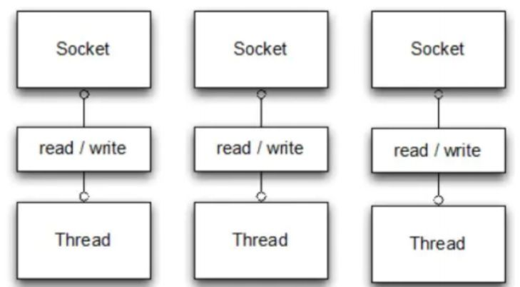
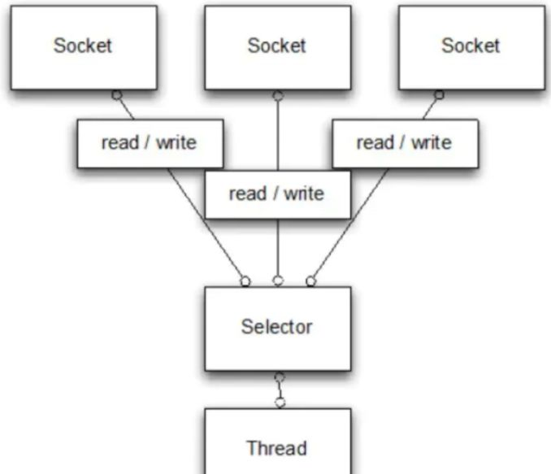

# **String、StringBuffer、StringBuilder 的区别**

这三者都能表示字符串，但设计目的完全不同。

在 JDK 8 及之前，它们都用 `char[]` 存储字符；
从 JDK 9 开始改成 `byte[] + coder` 的组合，以节省内存，因为大部分字符串只用到单字节编码。三个类都是 `final` 修饰，不能被继承。

- **String**：不可变，内部字符数组被 `final` 修饰。任何修改都会创建新对象，让引用指向新地址。

```java
// String：每次拼接都会创建新对象
String s1 = "wolf";
s1 = s1 + " pack";  // 实际生成了新的字符串对象
```

> 但注意 `final` 只限制**指针不变**，限制不了指向对象的内容。`String` 通过**不外泄引用**与**防御性拷贝**确保没有任何代码能拿到内部数组去改；

- **StringBuffer**：可变，所有方法加 `synchronized`，保证线程安全。

```java
// StringBuffer：线程安全
StringBuffer sbf = new StringBuffer("wolf");
sbf.append(" pack"); // 修改原对象
```

- **StringBuilder**：可变，但没有加锁，线程不安全，性能更高。

```java
// StringBuilder：性能最佳（单线程）
StringBuilder sbd = new StringBuilder("wolf");
sbd.append(" howl");
```

这种不可变设计让 `String` 更适合作为哈希表键值，因为内容不会变化；同时也保证线程安全，但频繁修改时会产生大量临时对象，性能较差。

# **`==` 和 `equals` 的区别**

`==` 是一个运算符，它的行为是由 Java 语法规则决定的，行为固定：基础类型比值，引用类型比地址。

- **基本数据类型**：比较的是数值本身。
  ```java
  int a = 5, b = 5;
  System.out.println(a == b); // true
  ```
- **引用类型**：比较的是引用是否指向同一块内存地址。

  ```java
  String s1 = new String("wolf");
  String s2 = new String("wolf");
  System.out.println(s1 == s2); // false，不是同一个对象
  ```

`equals` 是一个方法，它的行为是由类的实现决定的（可以继承、重写）。默认比地址，但常被重写成比内容。

- 定义在 `Object` 类，默认实现等价于 `==`，也是比较地址。
- 常用类（如 `String`、包装类、集合类）都**重写了 `equals`**，用来比较内容。

  ```java
  String s1 = new String("wolf");
  String s2 = new String("wolf");
  System.out.println(s1.equals(s2)); // true，因为 String 重写了 equals
  ```

在集合（如 `HashMap`、`HashSet`）里使用对象时，通常需要同时重写 `equals` 和 `hashCode`，否则可能出现“明明内容一样却查不到”的问题。

# **Integer 缓冲池**

在 Java 中，`int` 是基本数据类型，而 `Integer` 是它的包装类。

- `int`：存储数值本身，默认值是 `0`。
- `Integer`：对象引用，默认值是 `null`，内部存储一个 `int` 值。

```java
int a = 100;            // 直接存储数值
Integer b = new Integer(100); // 包装对象，存放在堆里
```

`Integer.valueOf(int)` 在装箱时会走缓存，默认缓存范围是 `[-128, 127]`，可通过 JVM 参数 `-XX:AutoBoxCacheMax=<size>` 调整上限。

在这个范围内，返回的是缓存中的对象，而不是新建对象。
超出范围则创建新对象。

```java
Integer x = 127;
Integer y = 127;
System.out.println(x == y); // true，来自缓存

Integer m = 128;
Integer n = 128;
System.out.println(m == n); // false，超出范围，创建了新对象
```

注意如果是`new Integer(int)` 永远创建新对象，不走缓存。因此更推荐使用 `Integer.valueOf` 而不是 `new Integer`，减少对象创建。

```java
Integer i1 = new Integer(127);
Integer i2 = new Integer(127);
System.out.println(i1 == i2); // false，不同对象
```

`Integer` 重写了 `equals`，比较的是数值内容：

```java
Integer a = new Integer(100);
Integer b = new Integer(100);
System.out.println(a.equals(b)); // true，数值相等
```

`==` 在包装类上经常出错，要用 `equals` 比较数值。

# **String 常量池**

常量池让相同字面量的字符串共享同一个对象，从而减少内存开销、提升效率。

当用字面量方式创建字符串时：

```java
String a = "wolf";
String b = "wolf";
System.out.println(a == b); // true
```

`"wolf"` 会被放进 字符串常量池。如果常量池中已有 `"wolf"`，就直接返回引用；否则先创建再放进去。
所以 `a` 和 `b` 指向的是同一个对象，因此使用字面量是最推荐的创建方式。

而 `new` 会在堆上创建一个新的对象，即使常量池中已有同样的字面量。

```java
String x = new String("wolf");
String y = new String("wolf");
System.out.println(x == y); // false
```

所以 `x` 和 `y` 是不同对象，地址不一样。但它们的内容相同，因此 `x.equals(y)` 为 `true`。

`intern()` 能够手动把字符串放入常量池：

```java
String s1 = new String("wolf");
String s2 = s1.intern();
String s3 = "wolf";

System.out.println(s2 == s3); // true，都指向常量池的 "wolf"
```

当调用该方法时，如果常量池已有 `"wolf"`，`intern()` 返回池里的引用。如果没有，则把该字符串加入常量池，再返回引用。

明白了，我来把 **6.1.7 checkedException 与 RuntimeException 的区别** 整理成和你喜欢的那种风格，既有逻辑叙述又有代码示例，像面试答题一样。

# checkedException 与 RuntimeException

在 Java 的异常体系中，所有异常都继承自 `Throwable`。它分成两大类：

- **Error**严重错误，通常不由程序员处理
- **Exception** 异常情况，可以捕获

而 Exception 又细分为：

- **受检异常（checkedException）**：必须显式处理，否则编译无法通过。
- **运行时异常（RuntimeException）**：可以处理，也可以不处理，由程序员自行决定。

当调用某个可能抛出受检异常的方法时，编译器会强制要求你：要么 `try-catch` 捕获，要么在方法签名里用 `throws` 抛出。这是 Java 设计上的一种“安全网”，防止开发者忽略潜在问题。

```java
// 受检异常：IOException
try {
    FileReader fr = new FileReader("wolf.txt"); // 可能找不到文件
} catch (IOException e) {
    e.printStackTrace(); // 必须捕获或抛出，否则编译不通过
}
```

而运行时异常继承自 `RuntimeException`，常见的如 `NullPointerException`、`ArrayIndexOutOfBoundsException`。编译器不会强制你处理它们，因为这些错误往往是代码逻辑问题，应该通过修复逻辑来避免，而不是事后去捕获。

```java
// 运行时异常：NullPointerException
String wolf = null;
System.out.println(wolf.length()); // 编译通过，但运行时报错
```

# throw 和 throws

异常既可以在方法内部抛出，也可以在方法声明时交给调用者去处理。这两种方式分别对应 `throw` 和 `throws`。

**throw：在方法内部抛出异常**

用于手动创建并抛出一个异常对象，强制结束当前方法执行，并把异常交给调用栈上层去处理。一个方法体中可以有多个 `throw`，但一次只能真正抛出一个异常对象。

```java
public void huntWolf(int arrows) {
    if (arrows <= 0) {
        throw new IllegalArgumentException("没有箭了，不能打狼！");
    }
    System.out.println("狼被猎杀");
}
```

**throws：在方法签名上声明异常**

告诉调用者“本方法可能会抛出某种异常”，由调用者决定如何处理，可以声明多个异常类型，用逗号分隔。

```java
public void readWolfFile(String path) throws IOException {
    FileReader fr = new FileReader(path); // 可能抛出受检异常
}
```

调用者必须显式处理受检异常，否则编译不通过：

```java
try {
    readWolfFile("wolf.txt");
} catch (IOException e) {
    e.printStackTrace();
}
```

# **final、finally、finalize**

这三个关键字/方法长得很像，但含义完全不同，是面试常见的混淆点。

**final：修饰符**

- **修饰类**：类不能被继承。
- **修饰方法**：方法不能被重写。
- **修饰变量**：变量不能被重新赋值（对于对象变量，引用不能变，但对象内容仍可修改）。

```java
final class Wolf {}
final int age = 5;
```

**finally：异常处理块**

写在 `try-catch` 后，无论是否发生异常都会执行，常用于释放资源。  
如果调用了 `System.exit(0)`，`finally` 不会执行。

```java
try {
    System.out.println("进入狼洞");
} catch (Exception e) {
    e.printStackTrace();
} finally {
    System.out.println("带走猎具"); // 一定会执行
}
```

**finalize：Object 的方法**

`finalize()` 是 `Object` 类的方法，垃圾回收器在回收对象前可能会调用一次，但不可靠，也不推荐使用。JDK 9 之后已经被标记为 **deprecated**。

```java
@Override
protected void finalize() throws Throwable {
    System.out.println("狼对象被回收前的清理动作");
}
```

# **序列化和反序列化**

序列化的类必须有稳定的 **serialVersionUID**，否则类修改后可能反序列化失败。常用于缓存、对象持久化、网络通信。

> `transient` 或 `static` 修饰的字段不会被序列化。

**序列化**

是把对象转为字节序列，以便保存到磁盘或在网络中传输。需要让类实现 `Serializable` 接口，才能被序列化。  
用 `ObjectOutputStream` 把对象写出。

```java
import java.io.*;

class Wolf implements Serializable {
    private String name;
    public Wolf(String name) { this.name = name; }
}

Wolf wolf = new Wolf("白狼");
ObjectOutputStream oos = new ObjectOutputStream(
        new FileOutputStream("wolf.dat"));
oos.writeObject(wolf);
oos.close();
```

**反序列化**

则是把字节序列恢复成原来的对象。用 `ObjectInputStream` 从文件或字节流中读回对象。

```java
ObjectInputStream ois = new ObjectInputStream(
        new FileInputStream("wolf.dat"));
Wolf wolf2 = (Wolf) ois.readObject();
ois.close();
```

# **Object 类常见方法**

在 Java 中，`Object` 是所有类的父类，里面定义的一些方法为所有对象提供了通用的行为。常见的有以下几个：

**equals(Object obj)**

比较两个对象是否“相等”。默认实现是比较地址，很多类（如 `String`、包装类）都会重写它来比较内容。

```java
String a = new String("wolf");
String b = new String("wolf");
System.out.println(a.equals(b)); // true
```

**hashCode()**

返回对象的哈希值，常与 `equals` 搭配，用于 `HashMap`、`HashSet` 等容器。契约是：

- 如果 `equals` 相等，`hashCode` 必须相等。
- 如果 `hashCode` 不相等，`equals` 一定不相等。

**toString()**

返回对象的字符串表示。默认是“类名@哈希码”，常被重写用于打印调试。

```java
class Wolf {}
System.out.println(new Wolf()); // Wolf@6d06d69c
```

**getClass()**

返回运行时类对象，用于反射。

```java
Wolf w = new Wolf();
System.out.println(w.getClass().getName()); // Wolf
```

**clone()**

用于对象拷贝，必须实现 `Cloneable` 接口并重写 `clone()` 方法。

**wait()/notify()/notifyAll()**

配合 `synchronized` 实现线程间的通信。

**finalize()**

对象被垃圾回收前调用一次，但不可靠，JDK 9 开始废弃。

# **short s1 = 1; s1 = s1 + 1; 和 s1 += 1 的区别**

在 Java 中，不同数值类型之间的运算会发生自动类型提升。对于 `byte`、`short`、`char`，只要参与了算术运算，都会先提升为 `int`，结果类型也是 `int`。

```java
short s1 = 1;
s1 = s1 + 1; // 编译错误，因为右边是 int，不能隐式赋值给 short
```

这就是为什么 `s1 = s1 + 1;` 会报错。

而 `+=` 是一种复合赋值运算符，编译器会自动带上强制类型转换，相当于：

```java
short s1 = 1;
s1 += 1; // 实际执行的是：s1 = (short)(s1 + 1);
```

因此它不会报错，结果可以正常赋值回 `short`。

这种规则同样适用于 `byte` 和 `char`，要记住：算术运算会默认转成 `int`，但复合赋值符会帮你隐式强转。

# 垃圾回收

在 Java 里，对象都是在 **堆内存** 里创建的。当一个对象不再有任何引用指向它时，它就“不可达”了，意味着程序再也访问不到它，这时候就算是**垃圾**。

Java 程序员不用手动释放内存，而是交给 **GC（垃圾回收器）** 自动完成。GC 会定期扫描堆，把那些没有被引用的对象标记出来，然后释放它们占用的内存。

比如：

```java
Wolf wolf = new Wolf("白狼"); // 堆里创建对象
wolf = null;                 // 原来的对象没人引用了
// 下一次 GC 时，这个对象会被回收
```

**GC 的特点：**

- 不用像 C/C++ 那样手动 `free`，降低内存泄漏风险。
- 回收的时机不可精确控制，只能通过 `System.gc()` 建议，但 JVM 不一定立即执行。
- 有不同的垃圾回收算法和收集器（标记-清除、标记-整理、分代回收等），JVM 会根据情况选择。

# Java 的四种引用

Java 中的引用分为四种级别，它们决定了对象在垃圾回收中的“生存优先级”。

- 强引用：最常用，对象始终存活。
- 软引用：内存不足时才会被回收，适合缓存。
- 弱引用：只要 GC（Garbage Collection，垃圾回收），就会被回收。
- 虚引用：几乎不持有对象，用于回收跟踪。

从强到弱依次是：强引用 > 软引用 > 弱引用 > 虚引用。

**强引用** 是最常见的形式，平时我们用 `new` 出来的对象赋给变量就是强引用。只要有强引用指向，对象就不会被回收。要想回收，必须先手动断开引用。

```java
Wolf wolf = new Wolf(); // 强引用
wolf = null;            // 断开引用后才能被 GC
```

**软引用** 用 `SoftReference` 表示。如果内存充足，对象不会回收；但当内存不足时，GC 会回收这些对象。常用于实现内存敏感的缓存。

```java
SoftReference<Wolf> softWolf = new SoftReference<>(new Wolf());
```

**弱引用** 用 `WeakReference` 表示。只要发生 GC，不管内存是否紧张，都会立即回收。常用于映射缓存（如 `WeakHashMap`），避免内存泄漏。

```java
WeakReference<Wolf> weakWolf = new WeakReference<>(new Wolf());
```

**虚引用** 用 `PhantomReference` 表示。它本身并不影响对象的生命周期，无法通过虚引用直接获取对象。主要用于在对象被回收时收到一个系统通知，常配合 `ReferenceQueue` 做资源清理。

```java
ReferenceQueue<Wolf> queue = new ReferenceQueue<>();
PhantomReference<Wolf> phantomWolf = new PhantomReference<>(new Wolf(), queue);
```

# **Java 创建对象的方式**

在 Java 中常见的创建对象方式主要有以下几种：

**1. 使用 new 关键字**  
最常见、最直接的方式。会调用构造方法，在堆内存中开辟空间。

```java
Wolf wolf = new Wolf("白狼");
```

**2. 使用反射机制**  
通过 `Class` 对象的 `newInstance()`（已过时）或 `Constructor.newInstance()` 创建。常用于框架和底层库。

```java
Wolf wolf = Wolf.class.getDeclaredConstructor(String.class).newInstance("灰狼");
```

**3. 使用 clone()**  
通过对象的 `clone()` 方法拷贝一个新对象。前提是类实现了 `Cloneable` 接口并重写了 `clone()` 方法。

```java
Wolf wolf1 = new Wolf("黑狼");
Wolf wolf2 = (Wolf) wolf1.clone();
```

**4. 使用反序列化**  
把字节流还原成对象。常见于网络传输或文件持久化。

```java
ObjectInputStream ois = new ObjectInputStream(new FileInputStream("wolf.dat"));
Wolf wolf = (Wolf) ois.readObject();
```

**5. 使用工厂方法或第三方框架**  
一些类库或框架会提供工厂方法来统一创建对象，例如：

- `Calendar.getInstance()`
- Spring 容器中的 `getBean()`

# **深拷贝和浅拷贝的区别**

在 Java 中，拷贝对象通常依赖 `clone()` 方法。但拷贝并不只有一种语义，可以分为 **浅拷贝** 和 **深拷贝**。

**浅拷贝** 指的是：

拷贝对象本身，但对象内部的引用字段只拷贝“引用地址”，不会再创建新的对象。
结果是：两个对象的引用字段指向同一块内存，修改其中一个对象的引用内容，另一个也会受到影响。

```java
class Wolf implements Cloneable {
    String name;
    Pack pack; // 引用类型

    @Override
    protected Object clone() throws CloneNotSupportedException {
        return super.clone(); // 默认就是浅拷贝
    }
}

class Pack { String title; }

Wolf w1 = new Wolf();
w1.name = "白狼";
w1.pack = new Pack();
w1.pack.title = "狼群A";

Wolf w2 = (Wolf) w1.clone();
w2.pack.title = "狼群B";

System.out.println(w1.pack.title); // 输出 "狼群B"，两个对象共享同一个 pack
```

**深拷贝** 指的是：

不仅拷贝对象本身，还会**递归地拷贝引用类型的字段**，为它们创建新的对象。
结果是：两个对象完全独立，修改一个不会影响另一个。

常见实现方式：

- 在 `clone()` 方法里手动调用引用字段的 `clone()`，实现级联复制。
- 或者通过序列化和反序列化来间接实现。

```java
@Override
protected Object clone() throws CloneNotSupportedException {
    Wolf cloned = (Wolf) super.clone();
    cloned.pack = new Pack();  // 深拷贝引用字段
    cloned.pack.title = this.pack.title;
    return cloned;
}
```

- 浅拷贝：只复制一层对象，引用字段还是同一份。
- 深拷贝：对象和其内部引用字段都复制一份，彻底独立。
- 默认的 `Object.clone()` 提供的是浅拷贝，需要手动扩展成深拷贝。

# **接口和抽象类的区别**

在 Java 中，接口（`interface`）和抽象类（`abstract class`）都可以作为一种“规范”，强制子类去实现某些方法。但两者的定位和使用场景并不一样。

**抽象类** 是“类”的一种，它可以包含:

- 抽象方法（没有方法体，需要子类实现）
- 普通方法和成员变量。

它体现的是 **模板式设计**：部分实现写好，子类继承后补齐剩余的实现。

```java
abstract class Wolf {
    abstract void howl();        // 抽象方法，子类必须实现
    public void run() {          // 普通方法
        System.out.println("狼在奔跑");
    }
}
class WhiteWolf extends Wolf {
    @Override
    void howl() {
        System.out.println("白狼嚎叫");
    }
}
```

**接口** 更纯粹，它只定义方法的规范。

- JDK 8 之前：接口里不能写实现
- JDK 8 之后：允许写 **default 方法**（有方法体）和 **static 方法**，但依然不能定义实例字段。

接口强调的是 **能力的约定**，是“能做什么”，而不是“是什么”。

```java
interface Hunter {
    void hunt();
}
class WolfHunter implements Hunter {
    @Override
    public void hunt() {
        System.out.println("猎狼者开始狩猎");
    }
}
```

**主要区别：**

- **继承关系**：抽象类只能单继承；接口可以多实现。
- **成员类型**：抽象类里可以有成员变量、构造方法；接口里没有实例字段，所有字段默认 `public static final`（常量）。
- **方法**：抽象类里既可以有抽象方法，也可以有已实现的方法；接口里的方法默认 `public abstract`，JDK 8 之后支持 `default` 和 `static`。
- **设计思路**：抽象类强调的是 **“继承体系中的父类”**，接口强调的是 **“统一规范”**。

**面试常见总结：**

- 如果是 **“is-a” 关系**（某个类本质上就是某种父类），用抽象类。
- 如果是 **“can-do” 能力**（某个类额外具备的功能），用接口。

# 注解

注解（Annotation）其实就是**给代码贴上额外的说明**，让编译器、框架、工具在运行或编译时能读到这些说明，做一些自动化处理。它不直接影响业务逻辑，但能极大减少重复代码。

注解能做：

- 告诉编译器一些检查规则（例如 `@Override`，防止写错方法签名）。
- 给框架/工具提供元数据（例如 Spring 用 `@Component`、`@Autowired` 扫描和注入 Bean）。
- 参与运行时逻辑（例如自定义注解 + 反射，做日志、权限校验、参数校验）。

### 元注解（定义注解的注解）

自己写注解时，常用的就是这些**元注解**（定义注解的注解）。

`@Target` — 限定能用在哪

它的参数是一个 **ElementType 枚举数组**，常用值有：

| 枚举值            | 作用位置               |
| ----------------- | ---------------------- |
| `TYPE`            | 类、接口、枚举         |
| `FIELD`           | 成员变量（含枚举常量） |
| `METHOD`          | 方法                   |
| `PARAMETER`       | 方法参数               |
| `CONSTRUCTOR`     | 构造方法               |
| `LOCAL_VARIABLE`  | 局部变量               |
| `ANNOTATION_TYPE` | 注解类型本身           |
| `PACKAGE`         | 包                     |

```java
@Target({ElementType.METHOD, ElementType.FIELD})
public @interface Demo {}
```

这就表示 `@Demo` 只能标在方法和字段上，标在类或参数上会报错。

`@Retention` — 控制生命周期

它能控制注解能保留到哪一步，它的参数是 **RetentionPolicy 枚举值**：

| 枚举值    | 保留范围   | 特点                                       |
| --------- | ---------- | ------------------------------------------ |
| `SOURCE`  | 源码       | 编译后丢弃，用于编译检查（如 `@Override`） |
| `CLASS`   | class 文件 | JVM 加载时丢弃，运行时不可见               |
| `RUNTIME` | 运行时     | 运行时可通过反射读取，常用于框架注解       |

```java
@Retention(RetentionPolicy.RUNTIME)
public @interface Demo {}
```

> 这里指定为 `RUNTIME`，表示运行时还能通过反射读取；  
> 如果是 `SOURCE`，编译后就丢掉；`CLASS` 在字节码里存在，但运行时读不到。

`@Documented` — 生成文档时包含

```java
@Documented
public @interface Demo {}
```

> 让 Javadoc 自动把这个注解出现在生成的 API 文档里。

`@Inherited` — 子类也能继承

```java
@Inherited
@Target(ElementType.TYPE)
@Retention(RetentionPolicy.RUNTIME)
public @interface Demo {}

@Demo
class Parent {}

class Child extends Parent {}
```

> `Child` 虽然没显式标 `@Demo`，通过反射仍能读到它继承了父类的注解。

### 自定义注解

比如我们想给接口方法打日志，可以写一个自己的注解：

```java
@Target(ElementType.METHOD)
@Retention(RetentionPolicy.RUNTIME)
public @interface Log {
    String value() default "";
}
```

然后用 AOP 或反射去扫描：

```java
@Log("新增狼的任务")
public void addMission(Mission mission) {
    ...
}
```

运行时发现有 `@Log` 注解，就自动打印日志。

> 这样比写一堆重复的 `System.out.println` 好得多。

# IO 和 NIO 的区别

- **IO（BIO）**：传统 Java 输入输出流，面向流、阻塞式，每次 `accept()` 或 `read()` 都会把当前线程卡住，直到有连接/数据。
- **NIO**：JDK 1.4 引入的新 API，面向缓冲、非阻塞，核心有 `Channel`、`Buffer`、`Selector`，可以用一个线程管理成百上千个连接。

| 特性           | BIO（传统 IO）     | NIO（New IO）                      |
| -------------- | ------------------ | ---------------------------------- |
| 阻塞方式       | 阻塞，线程一直等待 | 非阻塞，没数据立刻返回             |
| 编程模型       | 面向流（顺序读写） | 面向缓冲（可前后移动指针）         |
| 多连接处理方式 | 一个连接一个线程   | 一个线程可轮询多个连接             |
| 适合场景       | 连接少、逻辑简单   | 高并发、长连接场景（聊天室、网关） |

假设要写一个服务器，接收客户端发来的消息。

用传统 IO（BIO）写

```java
Socket socket = serverSocket.accept(); // 等待客户端连进来（阻塞）
InputStream in = socket.getInputStream();
int data = in.read(); // 等待数据到来（阻塞）
System.out.println("收到：" + data);
```



这里有两个“卡点”：

1. `accept()` 会卡住线程，直到有人连进来。
2. `read()` 会卡住线程，直到数据来了。

所以如果有 100 个客户端连进来，你就得开 100 个线程，每个线程都卡在各自的 `read()` 上等待。  
→ **线程多、资源开销大、效率低。**

用 NIO 写

```java
socketChannel.configureBlocking(false); // 设置非阻塞
int bytesRead = socketChannel.read(buffer);
if (bytesRead > 0) {
    System.out.println("收到：" + new String(buffer.array()));
}
```



这里不再“死等”数据：

- `read()` 立刻返回，如果没数据就告诉你 0。
- 你可以用一个 `Selector` 来统一管理一堆 `Channel`，哪个有数据就去读，没有就继续做别的。

这样只要一个线程就能处理成百上千个连接，因为它不会被某一个客户端卡死。

BIO = 每个连接占用一个线程，等着有数据；
NIO = 一个线程能同时盯着很多连接，只有有数据才去处理。

# 设计模式七大原则

当代码越来越多、项目越来越大，如果没有规则，代码会变成“意大利面”——改一个地方牵一堆地方，谁都不敢动。  
设计原则就是指导我们**写出可维护、可扩展、不容易出 bug 的代码**，减少返工。

设计模式可以理解成“写代码的交通规则”，不是强制必须遵守，但遵守后代码会更稳健。

### 单一职责原则（SRP）

> 一个类只做一件事，职责要单一。

```java
// 违背原则：一个类既管狼数据，又负责打印日志
class WolfManager {
    void saveWolf() {}
    void logToFile() {}
}
```

改进：把日志拆出去，WolfManager 只管业务逻辑。

### 开闭原则（OCP）

> 对扩展开放，对修改关闭。  
> 新需求尽量通过“加代码”实现，而不是“改原来的代码”。

```java
// 原来只有文字任务
class MissionPrinter {
    void printText(Mission m) {}
}
// 新需求：加图片任务，不改原类，扩展一个子类
class ImageMissionPrinter extends MissionPrinter {
    void printImage(Mission m) {}
}
```

### 依赖倒置原则（DIP）

> 依赖抽象，不依赖具体实现。

```java
// 低级：直接依赖具体类
class WolfService {
    WolfDao dao = new WolfDao();
}
// 改成依赖接口，方便切换不同实现
class WolfService {
    Dao dao;
}
```

### 接口隔离原则（ISP）

> 不要让类实现它用不到的方法；接口要精简。

```java
// 违背原则：大接口把所有行为塞一起
interface Animal {
    void fly();
    void swim();
    void run();
}
// 分成小接口
interface Flyable { void fly(); }
interface Runnable { void run(); }
```

### 合成复用原则（CRP）

> 多用组合，少用继承。  
> 组合比继承灵活，不会被父类牵制。

```java
// 继承导致强绑定
class GuardWolf extends Wolf {}

// 组合更灵活
class GuardWolf {
    private Wolf wolf;
}
```

### 里氏替换原则（LSP）

> 子类必须能完全替换父类，保证程序逻辑不出错。

```java
class Wolf { void hunt() {} }
class BabyWolf extends Wolf {
    // 不应该把 hunt 改成“扔异常”，破坏父类契约
}
```

### 迪米特法则（LoD）

> 最少知道原则：类与类之间少耦合，不该管的不要管。

```java
// 不要直接深入别的类的内部去拿字段
wolf.getPack().getLeader().setName("xx");
// 而是提供一个对外方法
wolf.setLeaderName("xx");
```

七大原则的核心就是：**低耦合、高内聚、方便扩展、少改原有代码**。目的是让项目大了以后还能轻松维护，不至于动一处崩全局。
