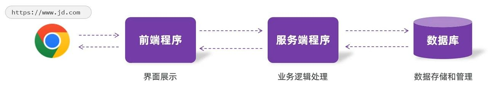
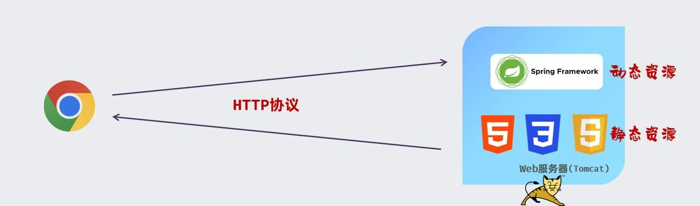

# 序

**Web（万维网，World Wide Web）**，说白了就是你通过浏览器访问的那些网站。比如打开淘宝、B 站、知乎，点进去就能看到网页、视频、图文——这都属于 Web 的范畴。

Web 是建立在全球互联网之上的一套系统，它让网站变得可视化、可交互。你输入一个网址（URL），按下回车，能看到一个页面跳出来，这就是 Web 的魅力。

但要实现这样的效果，背后其实有一整套技术结构在支撑——这就是我们接下来要说的：

# Web 网站结构

一个 web 网站的核心, 是由以下三个部分组成:

- 前端程序：负责将数据以好看的样式**呈现**出来。
- 后端/服务端程序：负责具体的业务逻辑的**处理**。
- 数据库：负责数据的**存储和管理**。

当我们在浏览器地址栏, 输入 url 地址, 一敲回车.
此时首先访问到的是服务器中部署的 **前端程序**, 而前端程序仅仅负责将数据以好看的样式呈现出来.

前端展示的数据从哪里来呢? 前端程序会发送请求来请求**服务端/后端程序**，由服务端/后端程序来查询**数据库**, 然后将数据库查询的数据返回给前端.

最终, 前端程序再将数据渲染, 再由浏览器来解析前端程序.
这样, 一个精美的网页就展示在浏览器中了.

# Web 前端

前端的任务很明确：**把数据好看地展示出来，让用户能看懂、能操作**。

前端开发的三大支柱，也叫“前端三件套”是：

- **HTML**：网页的“骨架”，负责结构，比如文字、图片、按钮的位置。
- **CSS**：网页的“外衣”，负责样式，比如颜色、字体、布局。
- **JavaScript**：网页的“大脑”，负责交互，比如点击按钮时发生什么、数据怎么动态更新。

> 有了这三者，就可以搭建出一个完整的网页页面。

另外，现代前端中还会用到：

- **Ajax**：让网页在不刷新整个页面的情况下，从后端获取数据。
- **Vue、React 等框架**：更高效地开发复杂前端页面。
- **UI 框架（如 Element Plus、Tlias）**：提供一套现成的界面组件，比如按钮、表单、弹窗。

# Web 后端

Web 后端开发，主要负责处理前端发送的请求、执行业务逻辑、与数据库交互以及管理服务器.
后端是网站和应用程序的"指挥官"，它处理着数据的存储、检索和业务逻辑。

后端的职责包括：

- 处理前端发来的各种请求（比如登录、下单）
- 执行对应的业务逻辑
- 查询和更新数据库
- 返回处理结果给前端

我们日常使用的网页资源有两种：

- **静态资源**：比如 HTML、CSS、JS、图片、音频等，内容写死了，不会变化。
- **动态资源**：由后端根据用户请求生成，比如个性化推荐、订单详情页面，每次请求内容可能都不一样。

> 以前 Java 后端开发用的 Servlet、JSP 这些技术现在已经淘汰，现代企业开发基本都是基于 **Spring 框架** 来处理动态资源。

这些后端程序会部署在 Web 服务器上，比如 **Tomcat**，并通过浏览器与之通信。这种通信主要依赖的协议是：

- **HTTP 协议**：Web 上传输信息的规则。

# BS 架构 vs CS 架构

我们常说的网站系统，其实属于一种架构模式，叫做：

- **BS 架构**（Browser/Server）：浏览器-服务器架构。用户只需要一个浏览器就可以访问服务端提供的资源，省去了安装客户端的麻烦。

而相对的还有：

- **CS 架构**（Client/Server）：客户端-服务器架构。用户需要专门下载一个应用程序来使用，比如一些老的软件系统、QQ PC 客户端等。

# 末

**Web 就是浏览器访问的万维网世界，它由前端、后端和数据库构成，前端负责展示，后端负责处理，数据库负责存储，一起合作，让我们得以看到和使用各种网站服务。**

如果你想学习 Web 开发，前端三件套是起点，而了解整个 Web 的工作流程，是打基础的第一步。
