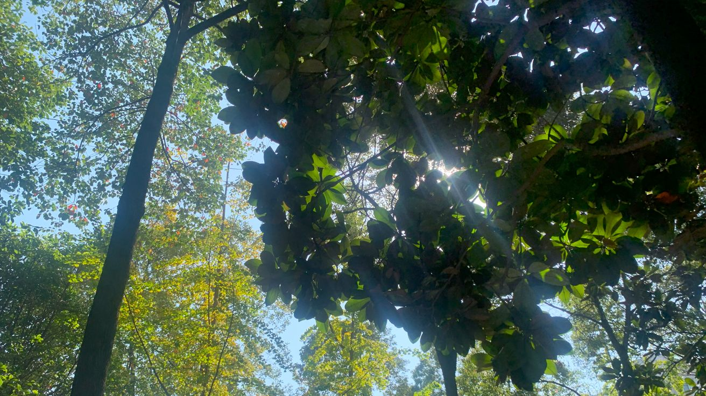

# 序

我从小就幻想着能够拥有暂停时间的能力。

总觉得如果能有那么一段安静的停顿时间，我就能补上所有落下的进度，整个人也会踏实一点。

# 在乱流中稳下爪

最近的生活对我而言发生了翻天覆地的变化。大三下刚结束，我作为一名准大四的学生，开始了一段算是“实习体验”的生活。
工作日一周五天，我得赶在早上八点之前从出租屋出发，骑着共享单车，踏过熙熙攘攘的早高峰街道，一路挤进人流和车阵之间。直到晚上九点，我才能躺回那张占据房间五分之三的床上。

这生活节奏一点也不轻松，但对我来说，算是正式踏出校园的第一步了。
一个人在外租房，我大学随意攒下的钱，就像一盆水一样，一泼就见了底。没办法，我也不得不学着控制着预算和节奏。

但这实习生活却让我觉得很充实，白天跟着项目走，晚上就尝试多多复盘。这周新来带我们的项目老师，比上一个讲得更清楚。整理笔记的时候给我整的可自信了，心想：

> “难道说？我真的是计算机领域大神？”

当然，我还是有点自知之明的哈哈哈，可比起最初焦头烂额的样子，现在已经可以和自己讲清楚很多道理了！

我以前在学校，就喜欢写点笔记。
但当时就像没头苍蝇似的，前端、爬虫、算法、数据库……囫囵吞枣地全往博客上堆，结果就像一个全是孔洞的网去捞水一样，甚至都算不上竹篮，脑子里什么东西都没放进去。
笔记也做得一团乱，很多东西再回过头来当初的笔记，就连自己都看不懂。最近几个月，我都在整理之前写过的笔记，那些杂乱无章的尝试，居然真的变成了我现在的基石。

我的博客也从那时候开始搭建起来，一开始只是为了应对我这个单线程、内存又小的大脑，生怕自己转头就忘记重要的东西。
现在这个博客，不仅是个整理工具，有时候也真的能让我更自信一些——让我意识到自己并不只是随便学学，而是真的能看见自己身后的爪印。

今天，实习同组的同学给我展示他的毕业设计，是个前后端的商城项目，我当然夸他厉害，但心里还是忍不住有点偷乐：
“我博客写的东西，好像……不比你这个差啊，而且，我明年才毕业呢~”

# 旧线条与新牙印

说到底，大学三年我一直在很随性的学习，没有什么特别清晰的规划，但始终不愿意停下脚步。
哪怕是混乱的学习过程，也让我积累下现在能看见的成果，不过也确实绕了不少弯路。

> 所以啊，我可不要轻易的否定那个阶段的自己。

今天的晚饭又是：拼好饭点了一份炒方便面，六块钱一份。咸香的味道一下子把我拽回高中清晨的小摊，那时候背着书包冲进教室前，总能先来上一份。
如今再尝，熟悉又好笑。
预算没超，我心里暗自满足——哪怕风里跌跌撞撞，还是能守住一点属于自己的节奏。

偶尔我也会翻以前在学校的照片，看阳光、走廊、傍晚的操场。

那些场景美好得有些不真实，好像不是刚刚过去，而是更久远的梦。有点遗憾，也有点释然——毕竟我也没什么重大的遗憾，只是学得磕磕绊绊，但确实是自己一点点叼起来的。
想来就算给我一个来自以撒的道具：能重置一切的“R 键”。
我大概还是会走回那条路上，只不过会更知道自己在干嘛，也会更温柔地对待那个曾经慌乱的自己。

现在回头看，那时候乱画的线条，搜集过欣赏过的一堆好看插画，居然都真派上了用场。昨天我的好朋友教我构图，他讲得很认真，我能听得个大概。
他一边讲一边说自己表达不好，那样的样子让我忍不住笑了一下，因为我也会这样。其实他讲得挺清楚的，我也能理解他说的“感觉”。
让我觉得意外的是，那些随手乱画的日子，现在也成了我手里的一点本事。好像线条握得更稳了，动作更自然了——

> 果然啊，时间从来没白白走过。

# 末 | 风依旧紧

我无法完全地掌控时间，更没办法拥有暂停时间的能力，但我学会了咬住它。咬不住全部，但好歹能留下属于今天的痕迹。

不是每一天都轰轰烈烈，但也有平凡一刻，值得被记住。
今晚那碗六块钱的炒方便面，咸香朴素，却让我确定：我还在生活，而不能被推着走。

暂停时间的幻想我依然有，但我得学会不再指望它能解决一切。也许“暂停”不是让世界停下，而是让我学会——

> 在风呼啸的时候，把身子伏低一点，在乱流中找到自己的节奏。

风依然紧，而我学会让脚步更稳。我一边咬牙，一边把每个不完美的今天，慢慢叼成自己的。
