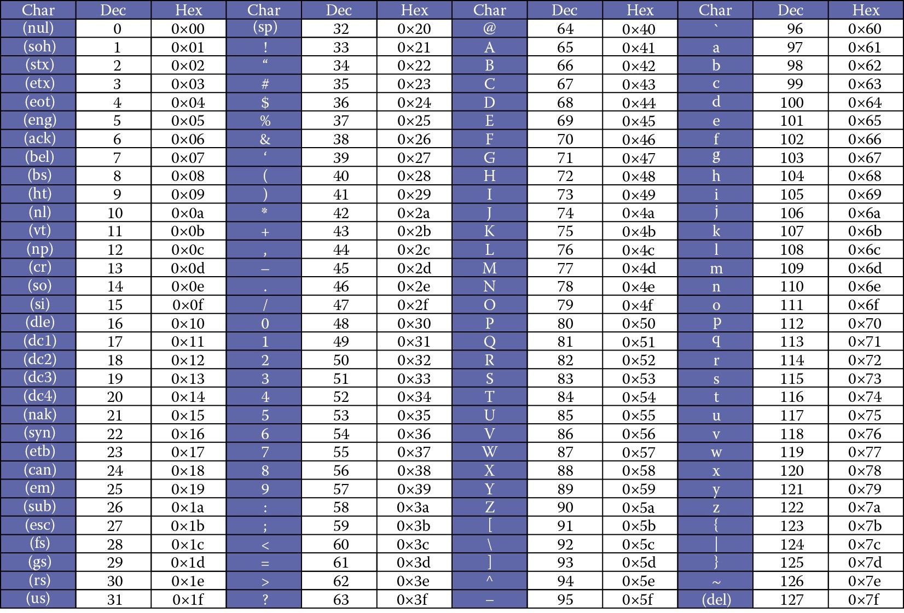

## 数字存储

计算机的内存本质上是一大片电路网络，其中每个最小的存储单位，是一个能被充电或放电的电容器。  
充电代表 1，放电代表 0，因此一切数据只能以 **0 和 1** 的形式保存。

每一个这样的“电的状态”，就是一个 **bit（位）**。

### 二进制

由于 bit 只有 0 和 1 两个状态，为了能表示更多的数, 计算机采用二进制存储数字，逢 2 进 1.
这就是 **二进制**.

```Java
10 // 这是十进制的10

0b1010 // 二进制表示的10，0b开头
```

不过，二进制一长就不容易看清了。为了解决这个问题，我们可以将它们按位数分组。
为了解决这个问题，我们可以将它们按位数分组。


### 十六进制

每 4 个 bit 为一组，能表示 0~15，对应十六进制的 0~F。

> 这就是 **十六进制**（逢 16 进 1），通常以 `0x` 开头。


```java
0xA //10 十六进制以0x开头
```

### 八进制

也可以 三个 bit 为一组，那么每一组的十进制取值就是 0~7


这就是 八进制，逢 8 进 1。

```Java
012 //还是10 八进制以0开头
```

这些进制之间的关系，不只是为了表达省事，它们和底层内存的可读性、压缩存储空间都息息相关。

# 字符存储原理

数字能转为二进制，字符也可以。

只要我们为每个字符 **规定一个数字（码点）**，再将这个数字转成二进制存储，就能把字符也塞进计算机里了。  
这套 “字符 <-> 数字” 的映射关系，就叫做 **编码表**。

### ASCII 编码表

最早的编码表之一是 ASCII。它定义了 128 个常用字符（字母、数字、符号等），每个都有唯一的码点（Code Point）。



因为 128 的最大值只需要 7 位二进制，所以后来我们约定 **每 8 个 bit（一个字节，Byte）** 为基本存储单位。

**单位换算**：

> 1 KB = 1024 B
> 1 MB = 1024 KB
> 1 GB = 1024 MB
> 1 TB = 1024 GB

### GBK 汉字编码

由于只有 128 个字符，ASCII 码表覆盖有限，因此各个国家都需要给自己单独规定编码表。

我国的 **汉字内码拓展规范** 简称 GBK，GBK 是对 ASCII 的扩展，新增了超过两万个汉字，每个汉字用 **两个字节** 表示。

### Unicode 与 UTF 编码

如果有一万个国家, 那就得有一万种不同的编码.

于是，国际标准组织（ISO）提出了统一编码方案 —— **Unicode**，也叫 统一/万国(union)码，它囊括了全球大多数语言字符（14 万+），彻底解决编码冲突问题。

其中包含 65536 个常用基础字符，剩下的是补充字符。
通常情况下，汉字的码点同样占两个字节。

接下来可能有点复杂，我们先来搞清楚两个常见但容易混淆的概念：

- **码点（Code Point）**：就像“身份证号”，表示某个字符在“字符大全”里的编号。
  > 比如：字母 `A` 的码点是 `U+0041`，汉字 `你` 的码点是 `U+4F60`。
- **编码（Encoding）**：把码点翻译成能在电脑里储存的二进制数字。
  > 不同的编码方案，用的二进制规则不一样。

Unicode 本身只是个码点系统，具体怎么编码，还得靠实现方式。
最常见的编码方式有：

- **UTF-8**：变长编码，使用 1~4 个字节表示一个字符，常用字符占位少，最为普及。
- **UTF-16**：也是变长编码，常用字符用 2 字节，补充字符用 4 字节。
- **UTF-32**：固定 4 字节，无需变化，但空间占用大。

其中，UTF-8 是现实开发中使用最多的一种编码方式，兼容 ASCII 且节省空间。

UTF-8 会根据码点的大小，分配不同的字节数量：

| 码点范围        | UTF-8 编码格式                           | 所需字节 |
| --------------- | ---------------------------------------- | -------- |
| `U+0000`~`007F` | `0xxx xxxx`                              | 1 字节   |
| `U+0080`~`07FF` | `110x xxxx 10xx xxxx`                    | 2 字节   |
| `U+0800`~`FFFF` | `1110 xxxx 10xx xxxx 10xx xxxx`          | 3 字节   |
| `U+10000`以上   | `11110xxx 10xx xxxx 10xx xxxx 10xx xxxx` | 4 字节   |

例如，“你” 字在 Unicode 表里的编号是：`U+4F60`（码点）

来看它在不同 UTF 编码下的样子：

| 编码方式 | 存储结果（16 进制） | 占用字节数 |
| -------- | ------------------- | ---------- |
| UTF-8    | `E4 BD A0`          | 3 字节     |
| UTF-16   | `4F60`              | 2 字节     |
| UTF-32   | `00004F60`          | 4 字节     |

也就是说，**码点相同，但存储方式不同**。UTF-8 是现实中最常见的，因为它能节省空间、兼容旧系统。

# 图像的存储

计算机图像是由无数个像素点（Pixel）组成的网格。
当像素点足够小，足够多时，就组成了人眼能识别的图像了。

显示器的每一个像素点都包含 **红绿蓝(R/G/B)** 三个子像素，我们称为三基色。
通过调整每种颜色的亮度，就能组合出世界上所有的颜色。


每个颜色通道的亮度范围是 0~255，正好可以用三个十六进制数表示（00~FF）：

```
#RRGGBB
```

例如, 白色是所有颜色亮度最大值 255, 对应的十六进制是 FF

```
#FFFFFF
```

这就是著名的 **RGB 模型**。

# 音频的存储

声音来自振动，关键在两个维度：

- **频率**：高低
- **振幅**：响度


计算机存声音，大致分三步：

1. **采样**（Sampling）  
   固定时间间隔对声波进行测量。间隔越短，采样率越高，声音越还原。
2. **量化**（Quantization）  
   将每个采样值用一定精度转为数字。精度越高，误差越小。
3. **编码**（Encoding）  
   把这些量化值转成二进制存储。

采样越密、量化越细，音质越好，但存储空间也越大。
