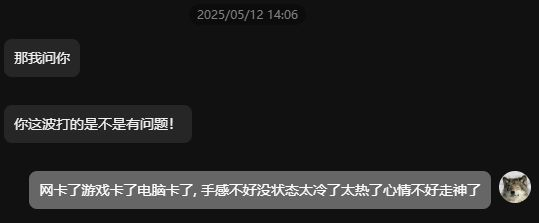

# 序

在许多奇幻世界里，“言灵”是一种常见又神秘的力量。

说出真名就能控制某个生物，念出特定的咒语就能召唤风火雷电——这些设定我们并不陌生。从中世纪魔法、北欧符文，到日式动画中的言语魔法，几乎所有幻想作品都在变着法儿告诉我们一件事：

> **语言存在力量，甚至能改变现实**。

我越来越觉得幻想中的“言灵”，不只是文学装饰，更是文化直觉。人类从本能上就知道，说出口的话不是空气里的废振动，而是拥有能够影响生命力的能量。

# 跨越幻想的直觉

虽然现实中我们不会因为喊一句「**hayate**」而真的吹飞一切，但我们说的话，确实正在反过来一点点地塑造我们。

我以前是个非常爱说“我不行”“我就是这样的人”的人，那种话有时是自嘲，有时是泄气，也有时只是图个轻松。但说多了之后，真的会慢慢相信自己确实不行，那些表达正在慢慢侵蚀你看待自己的方式。

后来我逐渐意识到这个问题，开始试着换种方式表达——给自己留点回旋的余地。

比如游戏失败了，不再说“我好菜”，而是甩锅：“网卡了”“手滑了”“今天状态不好”。
其实一些朋友对输赢并没那么在意；  
反倒是气氛松弛了，话也更好接了，连我自己都不再那么轻易沮丧了。

我认为人类的大脑并不是一座冷静独立的处理器，而更像是一个会被语言“调教”与“反复洗脑”的系统。当你不断地用某种词汇解释自己、形容他人、定义世界，你就是在给大脑喂素材，告诉它“应该怎么理解这一切”。

语言，是认知的接口，也是思维的输入设备。

# 禁忌的言灵暗面

我也曾经觉得，“不就说说而已吗？我又不是认真那样想。”但问题在于，大脑貌似并不会细细区分“只是说说”和“真的相信”。它只会根据你反复输入的模式进行重构。

你越说“我不行”“这不可能”“我好讨厌这个世界”，你大脑里的神经连接就越朝着那条路发展。说久了，它就变成了认知方式。

这并不代表我们不能情绪低落，也不是鼓励压抑真实感受，而是提醒自己：
**语言，是我们认知自我和世界的镜子。**
重点是长期哦，如果长期用负面语言照这面镜子，我们看到的世界就只剩阴影了。

我后来回顾自己过去常说的话，发现很多时候，我其实是在用语言给自己加固牢笼，反而没有真正面对和解决问题。

而从外部角度看，语言还有另一层作用：它会在无形中塑造人与人之间的气氛。

我自己曾经也意识到，长时间处在压力和焦虑中时，哪怕没有刻意抱怨，讲话的语气也会变得紧张甚至刺人。那时我常常后知后觉，明明是想分享近况，却不知不觉把聊天变得沉重。
后来才明白，其实不是内容的问题，而是语气、词句的选择，会不知不觉影响整场对话的氛围。  
于是我开始有意识地调整表达——大方地把内心的夸赞毫无保留地传达给朋友，哪怕带点抽象修辞，也比沉默强得多。  
有时候朋友游戏里打出神操作，我会为之欢呼，打得稀烂我也笑着说“尽力了，艺术流打法，让对面一把”。虽然在夸赞时朋友会笑着推拒，但如果换我是被夸赞的那一方，我肯定也会一边说过誉了，一边偷着笑吧。
久而久之，我自己也不再那么紧绷。

# 正向言灵的自救诗篇

包括我自己在内的很多人，一听到“多说正能量的话”就会皱眉，以为那是某种精神胜利法。

但现实是，正向语言不是让你“假装快乐”，而是让你的大脑**获得修复和重构的机会**。

当你说“我还可以再试试”“这件事值得努力看看”，给自己的认知系统留出弹性和空间。这些词汇是自我鼓励，不是自欺，是提醒自己还有别的可能性，而不是认定只有死路一条。

要知道，语言影响的从来都不只是听者，也包括说话者本身。**你说出口的词，其实也在塑造你是谁。**

我不否认有时候这些话听上去像“鸡汤”，但与其说那是安慰，不如说是我们在现实里，用语言为自己打补丁。就像我自己，现在并不是每天都能保持积极状态，但哪怕只是偶尔提醒自己一句“慢慢来”，也会比“我完了”好很多。

# 末

所以，我想表达的其实很简单：

我们的世界，的确没有真正的魔法。但”言灵“或许是存在的——只是它不像幻想故事里那样，一句中二的台词、顷刻炼化！而是更慢、更轻、更潜移默化的。

它可能不会让你一夜之间脱胎换骨，但会在你反复说“我做得到”的时候，悄悄在你心里种下一点相信的种子；会在你学着对朋友和自己说“你真的超级棒！”的时候，帮你一点点松开长久的紧绷。

地球 Oline 的语言魔力是微弱的，是属于我们三次元生物的“低配言灵”。

我写下这些，并不是因为我已经走在光明里，而是我曾经也在阴影里待过太久。我知道那种时候有多难开口、又有多渴望有人能说一句不一样的话。

如果你也正卡在那样的地方——  
那不妨试着，对自己说一句轻一点的词。  
也许不会立刻改变什么，但谁知道呢，也许它已经在生效了。只是我还没注意到而已。
