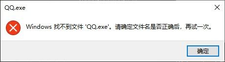
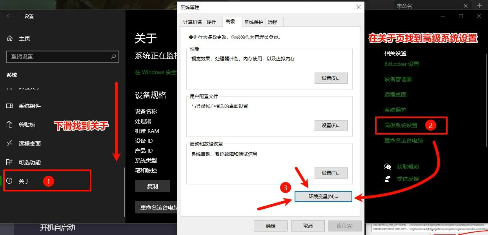
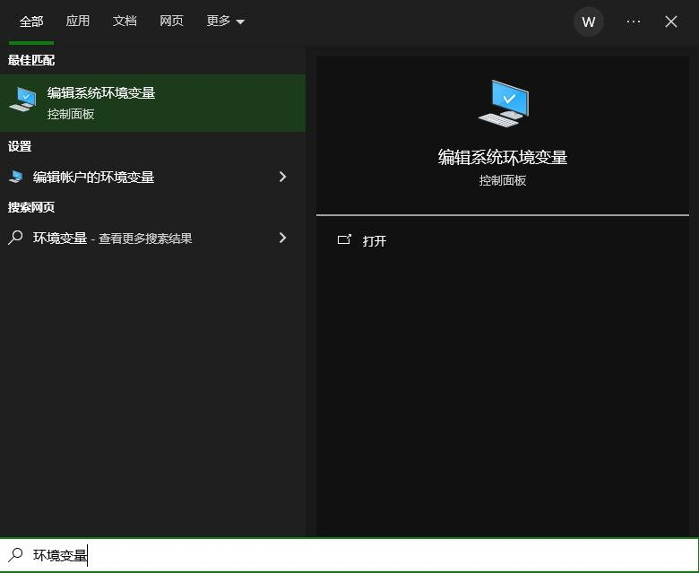
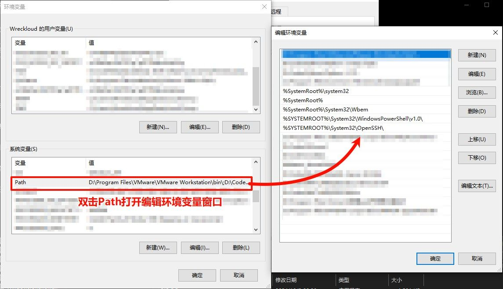
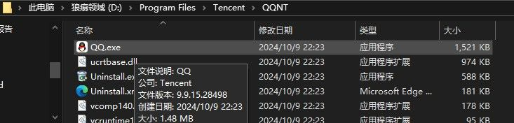
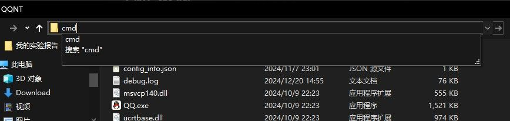
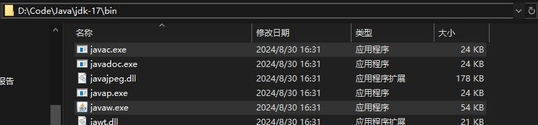
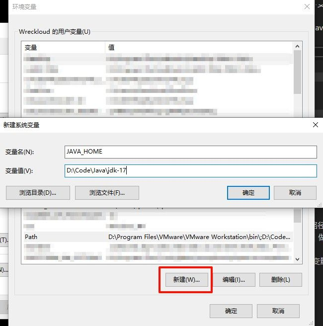
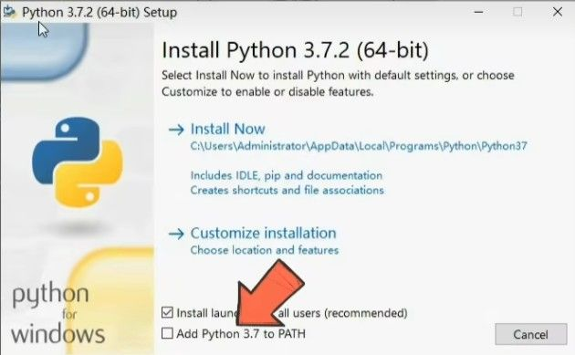

# 序

**如何通过"运行"对话框打开程序？**

1. 按下 `Win + R` 打开"运行"对话框。
2. 输入 `cmd` 并回车，即可打开命令提示符（cmd 也算是一个 exe 程序）。


但如果你尝试输入一个别的 exe，例如 `QQ.exe`，可能会发现无法运行——这正是环境变量在起作用！



# 环境变量

**环境变量是什么？**  
环境变量就像系统的"快捷地址簿"。当你输入一个程序名（如 `cmd`），系统会快速从地址簿（Path 变量）中查找程序的位置。

>  **注意**  
> 修改环境变量需谨慎！错误操作可能导致系统无法找到关键程序（如系统忘记如何"呼吸"）。

### 如何查看环境变量？

打开设置, 在 关于 系统 -> 系统高级设置 中即可找到`环境变量`.



也可以按下 `Win + S` 搜索"环境变量":



打开面板, 我们不难发现, cmd 的路径 `(C:\Windows\System32)` 就在其中:



这是系统变量的界面：


因此, "运行"对话框实际上是在环境变量配置的路径中寻找程序.
如果能够找到指定程序的路径就运行,
反之则报错.


你可能注意到了 CMD 的实际目录是 `C:\Windows\System32`
而在环境变量 PATH 中指定的目录是 `%SystemRoot%\system32`

这是由于虽然系统默认安装在 C 盘, 但是也可由用户指定位置.
为了灵活应对, Windows 就规定了 `%SystemRoot%` 的变量来存放系统安装的位置.
Windows 安装程序会将`%SystemRoot%`环境变量设置为安装目录的路径，通常是`C:\Windows`.

# 配置环境变量

一般而言, 我们并不需要通过 "运行" 对话框, 或是使用命令行来运行 QQ 这种程序.
环境变量更多地用于配置那些在命令行中运行的程序，比如 Java 和 Python 这样的开发工具.

使用命令行 运行程序时, 命令行会:

- 默认会在 **当前的目录** 下寻找指定的程序.
- 未找到, 则会尝试去 **Path 环境变量** 中指定的路径寻找.

::: danger 再次提醒!
错误地编辑注册表可能会损坏系统!
编辑更改注册表前请确保你知道你在做什么.
:::

那就拿熟悉点的 QQ 来举例吧!

### 方式一 默认路径

我的 QQ 安装在了这个文件夹下:



我们可以尝试通过 CMD 命令行 打开, 在桌面时 `win`+`r` `回车`, 快捷打开命令行.


可以观察到当前命令行所在的路径为 `C:\Users\Wreckloud`
显而易见地, QQ 并不在这个目录中, 尝试运行一下, 直接输入应用程序的名称即可运行:

```bash
QQ.exe
```

也是在预料之内的:


接下来我们将命令行的路径切换到 `QQ.exe` 所在的目录中:
常用以下两种方式打开指定的路径.

#### 在命令行中使用指令切换路径

使用指令: `cd 路径` 即可将命令行切换到指定的路径.

```bash
cd D:\Program Files\Tencent\QQNT
```

> 关于命令行的更多指令, 请 [[windows命令行与批处理|看这里!]]

#### 在文件浏览器中用命令行打开指定路径

我更推荐:
直接在文件夹中找到需要的文件, 然后在地址栏输入 `cmd` 并回车.



两种方式都能让命令行转到指定的路径中:


再尝试在这个路径下输入 `QQ.exe` .


成功地打开了, 但这种方式并不是重头戏.
这样也成功验证了 在安装目录以外的地方没办法使用命令行打开 QQ.

### 方式二 Path 中的路径

只要类似 cmd 的, 将自己的安装路径配置在 Path 中, 命令行就可以在任意位置找到并打开 QQ.exe 了.

打开 环境变量 ,在 系统变量中 双击 Path.
接着将 `D:\Program Files\Tencent\QQNT` 配置到 Path 环境变量中


打开一个 **新的** 命令行, 尝试在任意位置执行 QQ.exe:


> 带后缀(.exe)地, 不带后缀地都可以执行此程序.

# 环境变量的用途

环境变量实际可用于 版本控制.
例如 Java, 我们可以在一台计算机中安装多个版本的环境变量.

在 环境变量 Path 中指定所需要的 Java 路径(注意指定的是 `java.exe` 与 `javac.exe` 所在的路径):



将此路径新建到 环境变量的 Path 中.
打开一个新的终端查看 Java 版本.

```bash
java -version
```

我们提到过, Path 中有许多重要的路径, 不建议直接修改 Path 的内容.
我们可以模仿系统的 `%SystemRoot%` 做法, 也为 Java 设置一个 `%JAVA_HOME%` 的变量.
`% %`代表引用环境变量.

这样, 控制版本时, 只需要在外修改变量的值, 从而避免频繁修改 Path 的内容.

### 具体步骤

在环境变量中新建系统环境变量:

```text
JAVA_HOME
```



再在 Path 中新建, 引用词变量 (注意指定的是 `java.exe` 与 `javac.exe` 所在的路径):


# 末

总之, 在绝大部分的情况下, 我们配置环境变量只是为了在任何一处都能用命令行或是别的什么, 来便利地运行所需程序.

这是一个很常用的功能.
既然如此, 现代的软件在设计时就考虑到了这一点.

在它们安装时, 通常会自带有将安装目录写入 Path 的选项:



如果在命令行中遇到了:
`xxx' 不是内部或外部命令，也不是可运行的程序或批处理文件.`
那么就检查一下 Path 路径是否配置正确吧.
