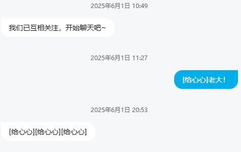
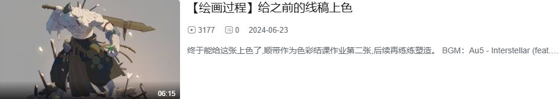
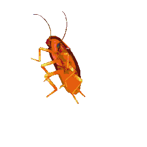
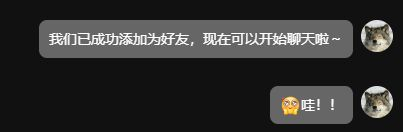
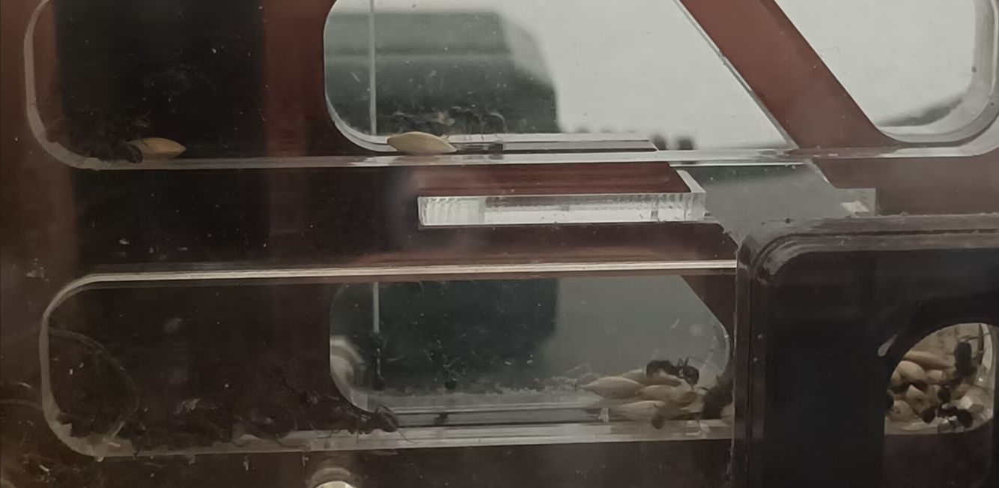

# 序 - 风未起

其实也没发生什么大事。就是……竟然被 Airthead 回关了。

是 [劈里啪啦](https://space.bilibili.com/303103435?spm_id_from=333.337.0.0) 上那只好会画狼的创作者。关注他也有一阵了，第一次看到他的画，就像突然嗅到熟悉的气味——野、真，让人忍不住靠近。

他画的狼，带着独特的气场，不只是帅，也不是单纯的凶猛，而是一种我一眼就认出的存在：那就是狼，是一种难以言表的神态。

# 叙 - 不为回应

日常登上 B 站，点开小红点时，消息框里出现了他的名字。我愣了几秒，反复确认好几遍。那一瞬间，满脑子只有一个念头：**“真的假的？！”**

其实在更早的时候，我就因为他的作品加入过群聊。他总是很好相处，一有话题就能聊很久，不会让任何人被冷落，气氛总是轻松友好。
总之，人真的超级好！

而且还不失有趣。比如他居然会对 **蟑螂** 这种生物格外感兴趣，收藏了一堆奇奇怪怪的蟑螂跳舞视频。

---

> 就像这种: ↓↓↓
> 

谁能想到一个把狼画得那么有气势的人，脑子里还装着这种稀奇古怪的小癖好？但仔细想想，好像也不奇怪。毕竟很多大艺术家都有点奇怪的小癖好——比如村上隆喜欢画糖果风的怪物，达利爱养蚂蚁……哪个不是怪得可爱？

更巧的是，我和他玩过的游戏也重合得离谱，好几次看到他发的视频，我都惊喜地发现：“诶，我也玩过这个！”。

> “要不要一起来玩？”

本来是很好的话题切口吧？但话到嘴边总是收住。社恐一上头，总会被 “别太刻意了” “会不会太打扰” 的念头绊住。（悲

哎，好想靠近，却怕走得太急...

所以，就这样先记下来吧，当做一个小记号。就算只是个“回关”，对我来说也是一个能反复回想的瞬间。像林子深处传来一声嗥叫，那声音不属于我，却让我忍不住循着声音迈步。

也许哪天，我能自然地说一句 “可以和我一起玩吗”，那就是我终于咬断那些胆怯的时候。

# 续 - 风卷至

收到好友申请了。

心脏像被猛撞了一下，脑子直接蓝屏。反应过来的第一件事，居然是——截图。

就像给这一刻按下印章，证明它真的发生过。

---

我试图打点像样的话，结果越想着“别太激动”，就越像一只尾巴乱甩的傻狗。

手指在输入框上来回折腾，删掉、重打，再删、再打……

最后只丢出去一个字加一个表情。我长叹了一口气：完了，这招呼打得一塌糊涂。

但最后发现——其实根本是我多虑了....

我以为自己得再憋久一点，找个合适不尴尬的契机提起这篇文章。  
结果他比我先一步开口了，还顺手引用了我写的那句：

> “达利爱养蚂蚁…”

**他真的看过了。**

是的，我偷偷藏在括号里的念头，字里行间绕来绕去的语气词，那些不敢明说的喜欢，全都被赤裸裸地揭开。  
他不仅看见，还轻巧地顺着我的博客文章接了下去：

> “我还真养蚂蚁。”

甚至还说：

> “我平常也不好意思加别人，都是想着说别人来加我……”

**——我完了，我的防线崩得一塌糊涂。**

---

当初写这篇文章的时候还在想，要是他能来撇一眼就好了——就算只是扫一眼标题，也够我偷着乐的。

可这种想法太奢侈，我不敢真信。大多数时候，我都只是把文字丢进我的博客，像把气味撒进风里，随它飘去。万一真有那么一阵风，把气息带到他面前，那也只是风的任性。

我原以为只是这样。

**结果今天……**

命运哪是一阵微风啊！它像狼掀开猎物的胸腔，把我藏着的骨头和心思全都暴露出来，连同忐忑和幻想一起抛到刺眼的光下。那一刻，我所有的设防都轰然倒塌，只剩下心脏一声声地砰砰砰。

# 絮 - 风仍在

写到这里已经有点词穷了。很多感觉... 说出来不够准，藏着又太可惜。

回想最近和他聊的那些话，不算多，却次次让我记住。我发现自己比想象中更在意他的想法，也比平常更愿意开口。

或许从某一刻起，我就不只是“喜欢他的画”了。  
我开始好奇他看待世界的方式，感受到他对人的温度，甚至在意他话语背后的思考。那也许是仰慕？我无法给它确切的名字，只知道这是我从未有过的强烈心绪。

这种感觉太稀有，也太珍贵。

所以哪怕这只是生活里一段微不足道的插曲，我也想把它记下来。它值得被记录、被承认、被铭记。

说了一些平时不敢说的话，也生出了一点久违的勇气。  
我不是外向的人，常常被社恐绊住，但在这一切之后，我有点想试着慢慢改一改，让自己更大方些。

如果以后还能继续这样聊聊画、聊聊喜欢的东西，哪怕只是偶尔，我也会很开心。

——能遇到这样一只，我真幸运。
