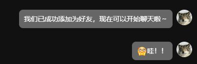

# 序 - 风未起

其实也没发生什么大事。就是……竟然被 Airthead 回关了。

是 劈里啪啦 上那只好会画狼的创作者。关注他也有一阵了，第一次看到他的作品，就像撞上一种久违的气味——熟悉又新鲜，让人忍不住想靠近，却又有点不敢。

他画的狼，总带着一种特别的气质。不仅是单纯的野性或者帅气，而是……某种我渴望过、梦中的样子。是在我沉浸的幻想世界里，也曾见过那样的獠牙和利爪。

# 叙 - 不为回应

那天日常登上 B 站，点开小红点时，消息框里出现了他的名字。我愣了几秒，反复确认了好几遍。那一瞬，满脑子都是“真的假的？！”

早在我发现他时，就追着加进了他的群聊。其实他特别好聊，一有话题就能跟大家聊很久，气氛轻松友好。总之，人真的超级好！
而且他还不失有趣。比如他居然会对 **蟑螂** 感兴趣，收藏了一堆奇怪的蟑螂跳舞视频，像是什么隐秘的地下派对资料库……

---

> 就像这种: ↓↓↓
> 

谁能想到一个把狼画得那么有气势的人，脑子里还装着这种稀奇古怪的小癖好？但仔细想想，好像也不奇怪。毕竟很多大艺术家都有点奇怪的小癖好——比如村上隆喜欢画糖果风的怪物，达利爱养蚂蚁……哪个不是怪得可爱？

更巧的是，我们玩的游戏也重合得离谱，好几次看到他发的视频，我都惊喜地发现：“诶，我也玩过这个！”。

> [“要不要一起玩？”]

本来是很好的话题切口吧？但话到嘴边总是收住。超级社恐开始发力了，总会被“别太刻意了”“会不会太打扰了”的念头绊住。（悲

嗷，好想靠近，却怕走得太急...

所以，就这样先记下来。
当做一个小记号。就算只是个“回关”，对我来说也是一个能反复回想的小瞬间。就像林子深处传来一声熟悉的嗥叫，那声音不是喊你，也没带任何承诺，但你听见了，就开始忍不住往那个方向迈步。

如果哪天，我也能自然地说上一句“可以和我一起玩游戏吗！”，那我一定是喝中药把社恐调理好了(

今天就先这样吧。风停了，尾巴还在晃~

# 续 - 风卷至

**收到好友申请了。**

心跳一下子快到不受控，语言系统直接宕机，整个脑子只剩下乱码。
然后反应过来的第一件事竟然是：

> 要先截图

就像是在给这一刻盖个章，留个证据，证明它真的发生过。

---

我试图组织一点像人类的话说出口。  
但这种时候越想“别太激动”，就越像一只激动的傻狗。

手指悬在输入框上打了一半，删掉，重打、再删，再打，再删。

最后干脆打了一个字发了一个表情，长叹一口气。  
“啊，我完蛋了。我连一个招呼都打不利索。”

但最后发现——其实根本是我多虑了....

我以为我得再酝酿半天，找个不尴尬的契机提起这篇文章。  
结果他比我先一步开口了，还顺手引用了我写的那句：

> “达利爱养蚂蚁…”

**他真的看过了。**

那些藏着心思的小括号、琢磨半天才写出的语气词、我不敢明说的那点崇拜和欢喜。  
他不仅看了，还顺着那句接了一句：

> “我还真养蚂蚁。”

甚至还说：

> “我平常也不好意思加别人，都是想着说别人来加我……”

**——我完了，我的防线崩得一塌糊涂。**

---

当初写这篇文章的时候还在想，要是他看到就好了——就算只是扫一眼标题，也够我偷着乐的。

可那种想法又太奢侈了，奢侈到连自己都不敢认真对待。所以更多时候，我还是把博客当成是写给自己的东西，发出来。万一……万一有那么一阵风，刚好把其中一丝气息吹到他面前呢？那就当作是风擅自做主，送了一个心照不宣的讯号。
我原本是这样想的。

**结果今天……**

命运哪是一阵微风啊！它是直接把我小心翼翼藏着的骨头，猛地掀开、把气息毫无保留地卷过去，还是在我毫无防备的时候。
把我心里那个装着所有预设和忐忑的小盒子直接掀翻了，碎片和彩带炸得漫天都是，只剩下一个在原地懵圈的我，和那颗还在疯狂擂鼓的心（

# 絮 - 风仍在

其实写到这已经有点词穷了。很多感觉……难说得太明白，说了也觉得不准，藏了又觉得可惜。

我在回想最近和他聊的那些话，不算多，却总让我印象深刻。
我发现自己比想象中更在意他的想法，也比平时更愿意自然地去说点什么。

或许从某一刻起，我就不只是“喜欢他的画”了。  
我开始好奇他看待世界的方式，感受到他对人的温度，甚至在意他的表达背后藏着怎样的思考。  
像是靠近一个我仰慕的人。

这种感觉太稀有了，也太珍贵了。

所以哪怕这只是生活里一小段微不足道的插曲，我也想把它记下来。
只是我不想让这份情绪，就这样静静消散。  
它值得被记录、被承认、被铭记。

说了平时不会对人说的话，也多了一点久违的勇气。

我不是个很外向的人，也常常社恐，而在这一切之后，我有点想——  
试着慢慢地改改，变得更大方一些。

如果以后还能继续这样聊聊画、聊聊喜欢的东西，  
哪怕只是偶尔说说话，我也会很开心。

总之，能遇到这样一只，我真幸运！！！
